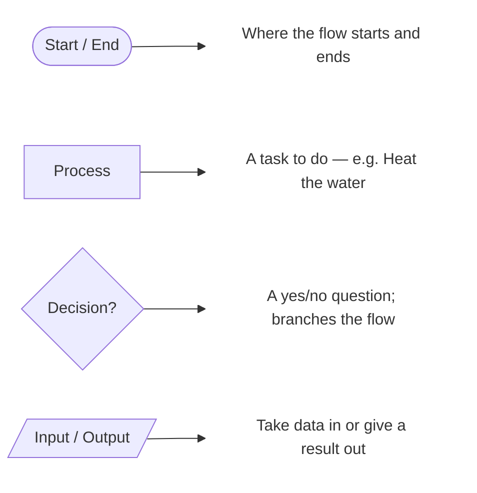
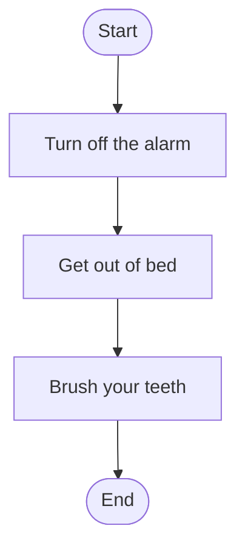
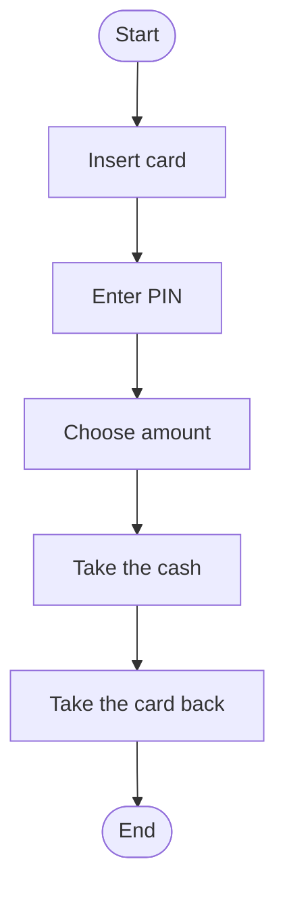
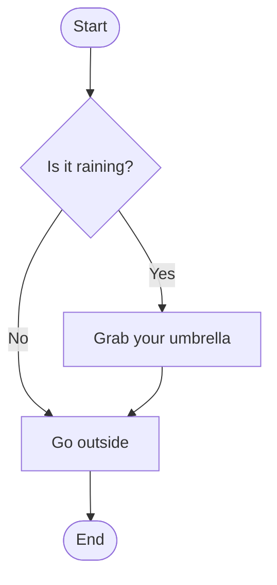
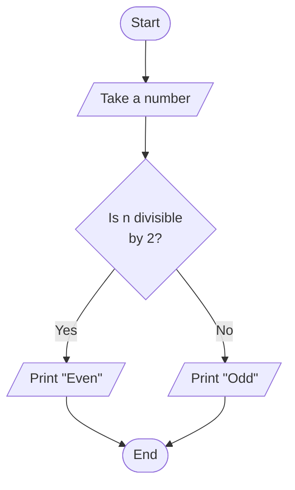
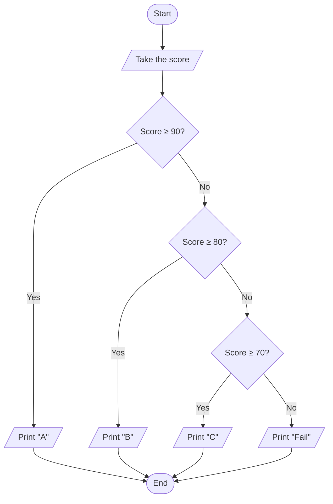
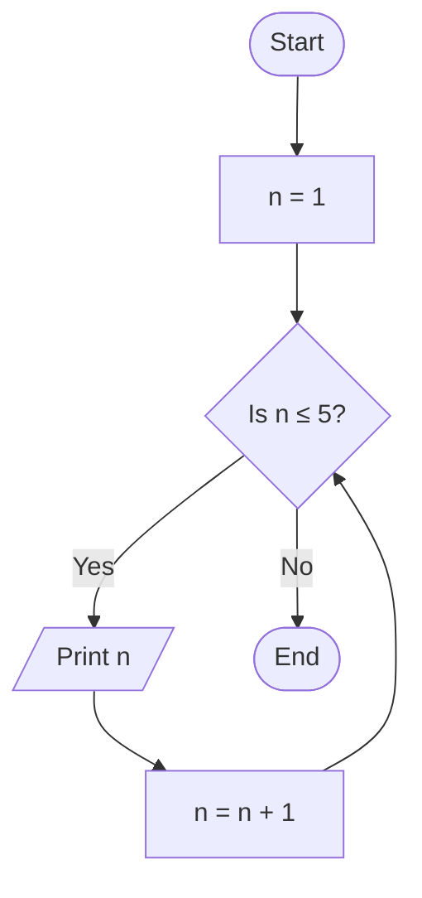
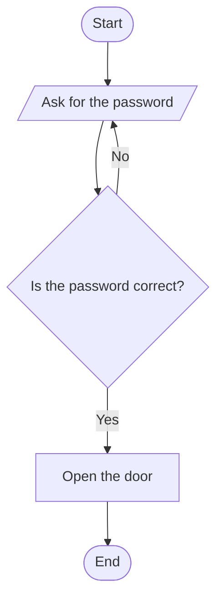
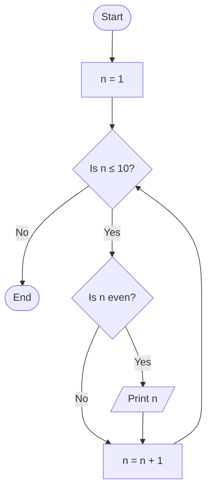
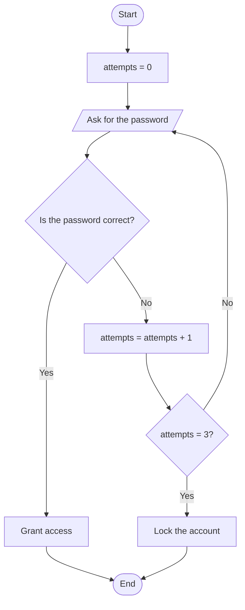

import Callout from '../../components/Callout.astro';
import Steps from '../../components/Steps.astro';

[In the previous post](/en/blog/what-is-an-algorithm) we wrote an algorithm **in
words** and, at the end, met the shapes of a flowchart. Now it is time to use those
shapes to **draw your own algorithm.**

Because as an algorithm grows — especially once branches like "if this happens do
that, otherwise do this" appear — plain sentences start to get confusing. This is
exactly where a flowchart steps in like a map: you see where you are going at a glance.

> A **flowchart** is a way of drawing an algorithm's steps as boxes and arrows that
> show the direction of flow. Whatever programming language you use, the same diagram
> reads the same; that is why it is the fastest way to design an idea **without
> writing a single line of code.**

<Callout type="note" title="Where are we in this series?">
This is the second post in the **Algorithms** series. In the first one we covered
"what is an algorithm" and the basic flowchart shapes. We are still not writing code
here; the goal is to be able to think through an algorithm by **drawing** it. In the
next post we will turn these drawings into pseudocode, and from there into real code.
</Callout>

## First, a quick reminder

So it stays fresh, here are the four core shapes we will keep using and the arrow
that connects them:

The arrow (`-->`) shows the **direction** of flow; after a decision, the label on the
arrow (`Yes` / `No`) tells you which path to take. Now to the real question: **how**
do we arrange these shapes together?

## Every algorithm is built from three building blocks

Here is the good news: no matter how complex an algorithm looks, it is really just a
combination of **three basic structures.** Once you learn them, you can read every
flowchart in the world.

We will look at all three one by one, with plenty of examples. Take your time; read
each diagram by following it with your finger.

## 1) Sequence — doing steps one after another

The simplest one. Steps flow from top to bottom, one at a time, without branching.
The "morning routine" from the previous post was exactly this.

No decisions here, no repetition; just a straight path. The skeleton of most
algorithms starts like this, and then we sprinkle in decisions and loops.

One more example — withdrawing cash from an ATM in its plainest form, without asking
"but what if?":

In real life you would need to ask "what if the PIN is wrong?"; but that is the job of
the next structure.

## 2) Decision — a fork based on a condition

This is where things get interesting. A **decision** is a question answered with
yes/no, and it splits the flow in two. It is drawn as a diamond (`{ ... }`) and **at
least two arrows** leave it. A decision comes in three flavours; let's see all three.

### One-armed decision — "if this, then do that"

Sometimes we do an extra task only when the condition holds, and otherwise simply
carry on without doing anything. A classic example: checking the weather before going
out.

The "No" path goes straight to `Go outside` without any extra work; the "Yes" path
squeezes in the `Grab your umbrella` step. Both paths merge again at the **same
point.**

### Two-armed decision — "either this or that"

This time both paths do their own job. The even/odd check we also saw in the previous
post is a perfect example:

<Callout type="tip" title="Always at least two exits from a decision">
If only one arrow leaves a decision box, there is a mistake: it is not a decision at
all, just an ordinary step. If you asked a question, **both** the "yes" and the "no"
answers must have somewhere to go.
</Callout>

### Multi-armed decision — "one of several"

Sometimes there are more than two options. Let's turn a score into a letter grade. We
draw this as a **chain of decisions**, each one wired to the "No" path of the one
before:

Read the flow top to bottom once: if the score were 85, it would say "No" at the first
question, drop to the second, say "Yes" there and print `B`. This is exactly the
visual form of the `if / else if / else` chain in code.

## 3) Loop — repeating until a job is done

Sometimes we do the same step over and over until a condition is met. The "wait until
the water boils" from the previous post was exactly this. The secret of a loop is an
**arrow that goes back from a decision.** A loop also comes in two common types.

### Counted loop — "do it exactly N times"

If we know up front how many times it will run, we use a **counter.** Let's count from
1 to 5:

Follow this diagram slowly: `n` is printed while it is 1, then becomes 2, the arrow
goes back and asks the condition again… This continues until `n` becomes 6 and the
condition says "No". The three must-haves of a loop are hidden in this diagram:

<Steps>

1. **Start:** Begin somewhere (`n = 1`).
2. **Condition:** Ask whether to keep going (`Is n ≤ 5?`).
3. **Progress:** Each round, **change** the value you check (`n = n + 1`).

</Steps>

The third step is vital. If we never increased `n`, the condition would say "Yes"
forever and the loop would never end. This is called an **infinite loop**; we will
meet it again shortly in the pitfalls section.

### Conditional loop — "do it until it happens"

Sometimes we do not know how many rounds it will take; we just keep going until a
condition is met. Picture a door that keeps asking until the right password is typed:

The "No" arrow goes straight back to `Ask for the password`; this loop keeps turning
until the user types the correct password. There is no counter, because we cannot know
in advance how many attempts it will take — only "until it is correct".

## Nested structures: a decision inside a loop

The real power appears when you put these three structures **inside one another.**
Let's print only the **even numbers** from 1 to 10. Here we place a decision *inside*
a loop:

Look closely: the outer **loop** walks through every number from 1 to 10; the inner
**decision** asks "is it even?" for each number. If it is even it prints it, otherwise
it moves to the next without printing. The two structures work together — nearly all
real programs are born exactly like this, from simple parts nested inside one another.

## Building a flowchart from scratch, step by step

Reading ready-made examples is one thing; starting from a blank page is another. Here
is a four-step recipe that works every time. Let our problem be:

> **"Ask the user for a password. Allow at most 3 attempts. If they get it right, let
> them in; if they get it wrong three times, lock the account."**

**Step 1 — Decide the input and output.** Input: the password the user types. Output:
either "access granted" or "account locked".

**Step 2 — List the main steps.** At its roughest: ask for the password → check it →
report the result.

**Step 3 — Add the decision.** "Is the password correct?" is a decision box. If it is
correct, let them in.

**Step 4 — Turn the repetition into a loop.** If it is wrong, ask again — but not
forever, at most 3 times. So we need a **counter**: one that increases on each wrong
attempt and breaks the loop when it reaches 3.

Putting it all together, the diagram becomes:

We took a problem that looks scary on its own and broke it, step by step, into
solvable pieces with four small questions. That is the whole point: **break it down,
order it, put the decisions and loops in place.**

## Keeping complex branching simple

As diagrams grow they can turn into spaghetti. A few simple habits keep them readable:

- **Flow in one direction.** Generally go top to bottom (or left to right); minimise
  arrows crossing each other as much as you can.
- **Every path should merge or end somewhere.** Don't leave a dangling arrow that goes
  nowhere.
- **If there is too much nested branching, split it.** Instead of stacking four or
  five decisions on top of each other, pull one part out as a **sub-process** (the
  `[[Sub-process]]` shape from the previous post) and draw it in a separate diagram.
- **Write questions so they are answered with "Yes/No".** Not "User?" but "Is the user
  logged in?". A clear question means clear branching.

<Callout type="important" title="A diagram is a tool, not the goal">
A flowchart is there to **clarify** your idea. If the diagram you draw tires you more
than the code would, you have either broken the problem into too many tiny pieces or
tried to fit everything into one giant diagram. Split it, simplify it, and draw a few
small diagrams if you need to.
</Callout>

## Common mistakes

These are the traps beginners fall into most often with flowcharts:

<Callout type="caution" title="Watch out for these four mistakes">
- **A loop with no exit (infinite loop):** If the condition the back-arrow connects to
  never changes, the flow gets stuck there forever. Make sure there is a step inside
  the loop that **changes** the condition.
- **A single exit from a decision:** Asking a question but drawing only the "Yes" path.
  Always show what happens on "No" as well.
- **No start/end:** Every diagram should open with a clear `Start` and close with at
  least one `End`. A diagram where it is unclear where things begin and end is an
  incomplete algorithm.
- **Ambiguous arrows:** If the arrows leaving a decision have no `Yes`/`No` label, the
  reader cannot tell which case goes where.
</Callout>

Remember the rule from the [first post](/en/blog/what-is-an-algorithm): a computer is
not smart, it is **obedient.** It will not fill in these gaps for you; on the contrary,
every gap you leave turns into a bug later.

## Try it yourself

Don't just read on — grab a sheet of paper and a pen, you need no tools. Draw the
three problems below, from easy to hard. We are not saving the solutions for the next
post; the hints are right underneath.

### Exercise 1 — Going through a door (easy)

> You are trying to get through a door. If the door is locked, unlock it with the key
> first, then go in. If it is open, go straight in.

<Callout type="note" title="Hint">
A single decision is enough: **"Is the door locked?"**. The "Yes" path should have an
*unlock with the key* step first, and the "No" path should go straight to *go in*. Do
both paths meet at the **same** "go in" step in the end? If they do, you set up the
diagram correctly (this is the *one-armed decision* we just saw).
</Callout>

### Exercise 2 — Times table (medium)

> Print the products of a number (say 7) from 1 to 10, one under another:
> 7×1, 7×2, … 7×10.

<Callout type="note" title="Hint">
This is a **counted loop**. Start with `factor = 1`, ask `Is factor ≤ 10?`, each round
print the result of `7 × factor` and increase `factor` by one. Remember the
count-from-1-to-5 example — it is almost identical.
</Callout>

### Exercise 3 — Find the largest (hard)

> The user enters numbers one after another and stops by entering `0`. You report the
> **largest** number they entered.

<Callout type="note" title="Hint">
A **loop** (read numbers until one is 0) nested with a **decision** (is the new number
bigger than the largest so far?). Keep a value called `largest` on the side; whenever a
new number is bigger than it, update `largest`. Just like keeping "the tallest so far"
person in mind while comparing a group of people's heights.
</Callout>

Once you have drawn all three, test each one by reading it aloud to your "robot
friend": *Does every arrow go somewhere? Does the loop end somewhere? Does the
decision have two exits?*

## Summary

<Callout type="tip" title="Keep in your pocket">
- A flowchart is the way to draw an algorithm with **boxes and arrows** and see it at
  a glance.
- Every algorithm is built from three building blocks: **sequence**, **decision** and
  **loop**.
- A **decision** can be one-armed ("if this, do that"), two-armed ("either this or
  that") or multi-armed (a chain of decisions); at least two arrows leave each decision.
- A **loop** is either counted ("do it N times") or conditional ("do it until it
  happens"); it has three parts: a start, a condition, and a progress step that changes
  the condition each round.
- Break complex problems into a diagram in **four steps**: decide input/output, order
  the steps, add the decisions, turn repetitions into loops.
- The most common mistakes: **infinite loops**, a single exit from a decision, missing
  start/end, and unlabelled arrows.
</Callout>
