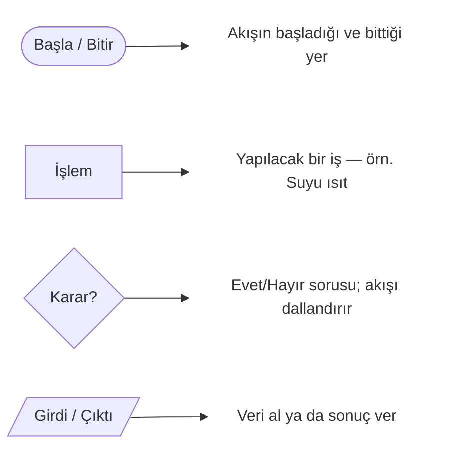
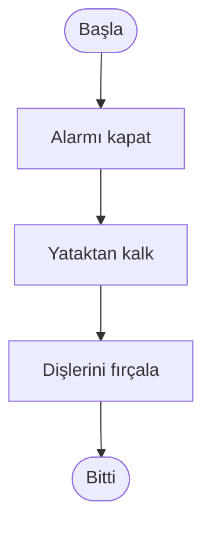
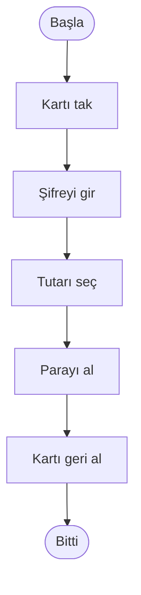
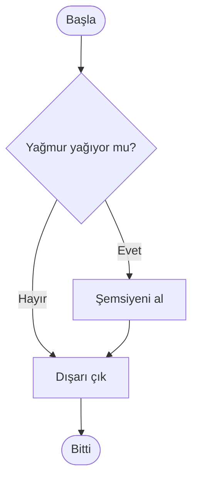
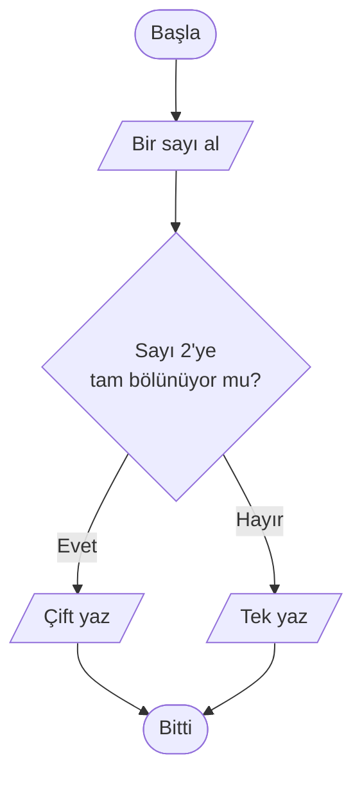
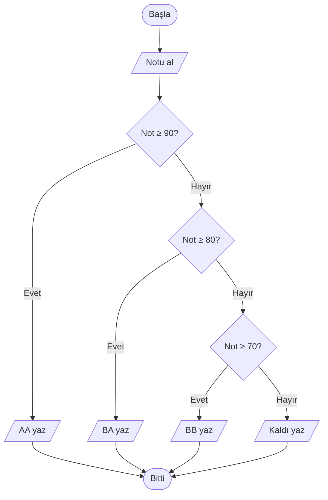
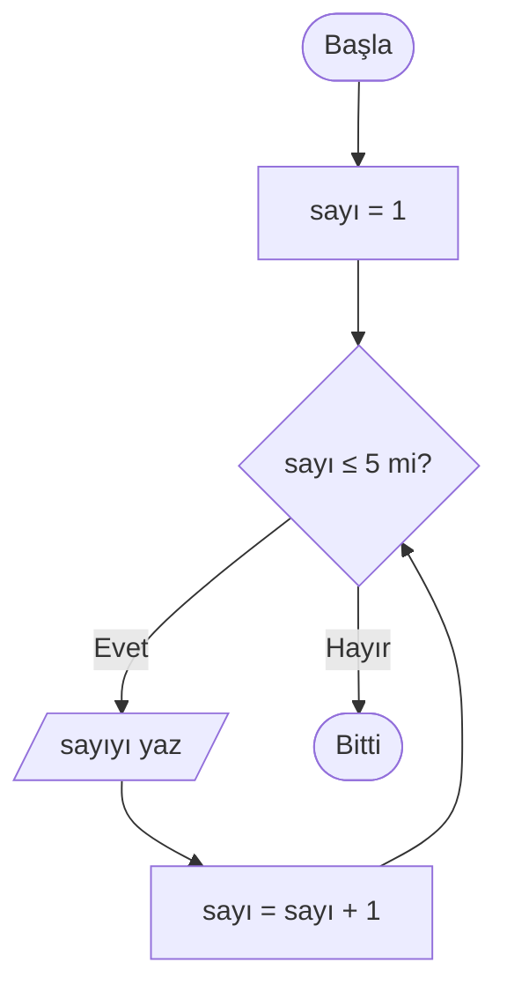
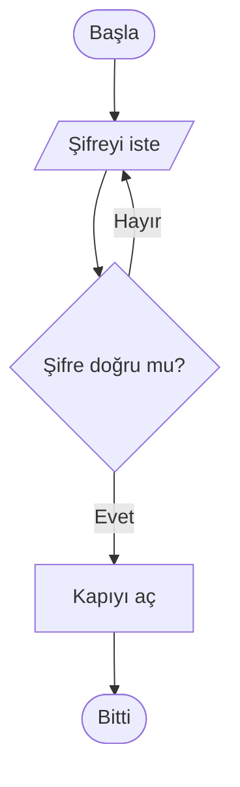
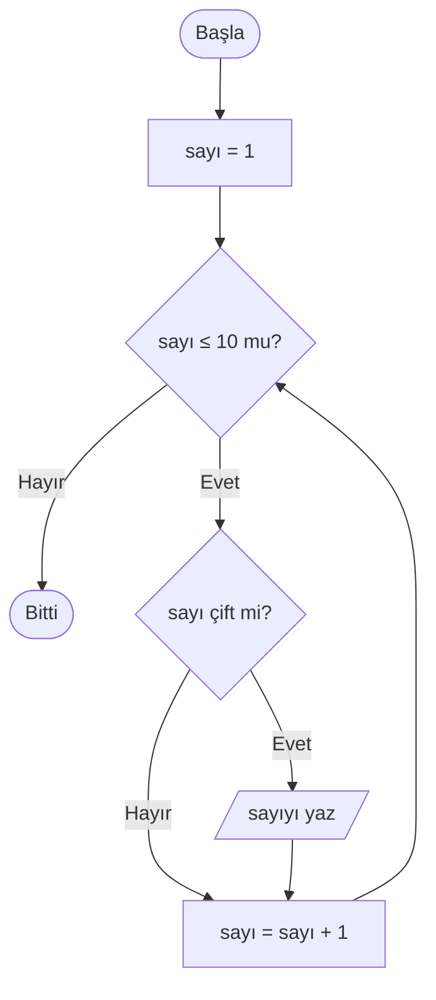
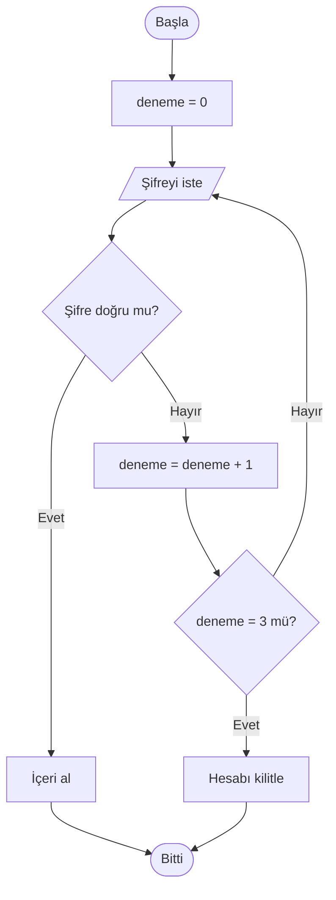

import Callout from '../../components/Callout.astro';
import Steps from '../../components/Steps.astro';

[Geçen yazıda](/blog/algoritma-nedir) algoritmayı **kelimelerle** yazdık ve sonunda
akış şemalarının şekilleriyle tanıştık. Şimdi sıra o şekilleri kullanıp **kendi
algoritmanı çizmeye** geldi.

Çünkü bir algoritma büyüdükçe, özellikle "şu olursa şunu yap, olmazsa bunu yap"
gibi dallanmalar girince, düz cümleler kafa karıştırmaya başlar. Akış şeması tam
da burada bir harita gibi devreye girer: nereye gittiğini tek bakışta görürsün.

> **Akış şeması (flowchart)**, bir algoritmanın adımlarını kutular ve oklarla,
> akışın yönünü gösteren bir diyagram hâlinde çizme biçimidir. Hangi programlama
> dilini kullanırsan kullan aynı şema okunur; bu yüzden bir fikri **tek satır kod
> yazmadan** tasarlamanın en hızlı yoludur.

<Callout type="note" title="Bu seride neredeyiz?">
Bu, **Algoritmalar** serisinin ikinci yazısı. İlkinde "algoritma nedir"i ve temel
akış şeması şekillerini gördük. Burada hâlâ kod yazmıyoruz; amacımız bir
algoritmayı **çizerek** düşünebilmek. Bir sonraki yazıda bu çizimleri sözde koda,
oradan da gerçek koda çevireceğiz.
</Callout>

## Önce kısa bir hatırlatma

Geçen yazıdan aklında kalsın diye, sürekli kullanacağımız dört temel şekil ve onları
birbirine bağlayan ok şöyleydi:

Ok (`-->`) akışın **yönünü** gösterir; bir karardan sonra okun üzerindeki etiket
(`Evet` / `Hayır`) hangi yoldan gidileceğini söyler. Şimdi asıl meseleye gelelim:
bu şekilleri birbirine **nasıl** dizeceğiz?

## Her algoritma üç yapı taşından kurulur

İyi haber şu: bir algoritma ne kadar karmaşık görünürse görünsün, aslında yalnızca
**üç temel yapının** birleşiminden oluşur. Bunları öğrendiğinde, dünyadaki her
akış şemasını okuyabilir hâle gelirsin.

Bu üçünü tek tek, bolca örnekle inceleyeceğiz. Acele etme; her şemayı parmağınla
takip ederek oku.

## 1) Sıra — adımları birbiri ardına yapmak

En basiti. Adımlar yukarıdan aşağıya, tek tek, hiç dallanmadan akar. Geçen yazıdaki
"sabah rutini" tam olarak buydu.

Burada karar yok, tekrar yok; sadece düz bir yol var. Çoğu algoritmanın iskeleti
böyle başlar, sonra araya karar ve döngü serpiştiririz.

Bir örnek daha — bankamatikten para çekmenin en yalın hali, hiç "ya olmazsa?" demeden:

Gerçek hayatta "şifre yanlışsa?" diye sorman gerekir; ama o, bir sonraki yapının işi.

## 2) Karar — bir koşula göre yol ayrımı

İşin rengi burada değişir. **Karar**, evet/hayır ile yanıtlanan bir sorudur ve
akışı ikiye böler. Baklava şekliyle (`{ ... }`) çizilir ve içinden **en az iki ok**
çıkar. Kararın üç farklı tadı var; üçünü de görelim.

### Tek kollu karar — "şu olursa şunu yap"

Bazen yalnızca koşul sağlandığında fazladan bir iş yaparız; sağlanmadığında hiçbir
şey yapmadan devam ederiz. Klasik örnek: dışarı çıkmadan önce hava kontrolü.

"Hayır" yolu hiçbir ek iş yapmadan doğrudan `Dışarı çık` adımına gidiyor; "Evet"
yolu ise araya `Şemsiyeni al` adımını sıkıştırıyor. İki yol yine **aynı noktada**
birleşiyor.

### Çift kollu karar — "ya bunu ya şunu"

Bu sefer iki yol da kendi işini yapar. Geçen yazıda da gördüğümüz çift/tek kontrolü
tam buna örnek:

<Callout type="tip" title="Karardan her zaman en az iki çıkış">
Bir karar kutusundan tek ok çıkıyorsa, orada bir hata vardır: o zaten bir karar
değil, sıradan bir adımdır. Soru sorduysan, "evet" ve "hayır" cevaplarının
**ikisinin de** gidecek bir yeri olmalı.
</Callout>

### Çok kollu karar — "şıklardan biri"

Bazen ikiden fazla seçenek vardır. Bir notu harf karşılığına çevirelim. Bunu, her
biri bir öncekinin "Hayır" yoluna bağlanan **kararlar zinciri** olarak çizeriz:

Akışı bir kez yukarıdan aşağı oku: not 85 olsaydı, ilk soruda "Hayır" deyip ikinci
soruya iner, orada "Evet" deyip `BA` yazardı. İşte koddaki `if / else if / else`
zincirinin görsel hâli tam olarak budur.

## 3) Döngü — bir iş bitene kadar tekrarlamak

Bazen aynı adımı bir koşul sağlanana kadar tekrar tekrar yaparız. Geçen yazıdaki
"su kaynayana kadar bekle" tam olarak buydu. Döngünün sırrı, bir **karardan geriye
dönen bir oktur.** Döngünün de iki yaygın türü var.

### Sayaçlı döngü — "tam N kere yap"

Kaç kere döneceğini baştan biliyorsak bir **sayaç** kullanırız. 1'den 5'e kadar
sayalım:

Bu şemayı yavaşça takip et: `sayı` 1'ken yazdırılıyor, sonra 2 oluyor, ok geri
dönüp koşulu tekrar soruyor… Bu, ta ki `sayı` 6 olup koşul "Hayır" diyene kadar
sürüyor. İşte bir döngünün üç olmazsa olmazı bu şemada gizli:

<Steps>

1. **Başlangıç:** Bir yerden başla (`sayı = 1`).
2. **Koşul:** Devam edilecek mi diye sor (`sayı ≤ 5 mi?`).
3. **İlerleme:** Her turda kontrol ettiğin değeri **değiştir** (`sayı = sayı + 1`).

</Steps>

Üçüncü adım hayati. Eğer `sayı`yı hiç artırmasaydık, koşul sonsuza kadar "Evet"
derdi ve döngü asla bitmezdi. Buna **sonsuz döngü** denir; birazdan tuzaklar
bölümünde tekrar karşılaşacağız.

### Koşullu döngü — "olana kadar yap"

Bazen kaç tur süreceğini bilmeyiz; sadece bir koşul sağlanana kadar devam ederiz.
Doğru şifre girilene kadar tekrar tekrar soran bir kapı düşün:

"Hayır" oku doğrudan `Şifreyi iste` adımına geri dönüyor; kullanıcı doğru şifreyi
girene kadar bu döngü dönmeye devam eder. Sayaç yok, çünkü kaç deneme süreceğini
önceden bilemeyiz — sadece "doğru olana kadar".

## İç içe yapılar: döngünün içinde karar

Asıl güç, bu üç yapıyı **iç içe** koyduğunda ortaya çıkar. 1'den 10'a kadar olan
sayılardan yalnızca **çift olanları** yazdıralım. Burada bir döngünün *içine* bir
karar yerleştiriyoruz:

Dikkatle bak: dıştaki **döngü** 1'den 10'a kadar her sayıyı geziyor; içerdeki
**karar** ise her sayı için "çift mi?" diye soruyor. Çiftse yazdırıyor, değilse
yazdırmadan bir sonrakine geçiyor. İki yapı birlikte çalışıyor — gerçek programların
neredeyse tamamı işte böyle, basit parçaların iç içe geçmesinden doğar.

## Bir şemayı sıfırdan adım adım kurmak

Hazır örnekleri okumak başka, boş bir kâğıttan başlamak başka. İşte her seferinde
işe yarayan dört adımlık bir tarif. Problemimiz şu olsun:

> **"Kullanıcıdan şifre iste. En fazla 3 deneme hakkı olsun. Doğru girerse içeri al,
> üç kez de yanlış girerse hesabı kilitle."**

**Adım 1 — Girdi ve çıktıyı belirle.** Girdi: kullanıcının yazdığı şifre. Çıktı: ya
"içeri alındı" ya "hesap kilitlendi".

**Adım 2 — Ana adımları sırala.** En kaba hâliyle: şifre iste → kontrol et → sonucu
söyle.

**Adım 3 — Kararı ekle.** "Şifre doğru mu?" bir karar kutusu. Doğruysa içeri al.

**Adım 4 — Tekrarı döngüye çevir.** Yanlışsa tekrar sor — ama sonsuza kadar değil,
en fazla 3 kez. Demek ki bir **sayaca** ihtiyacımız var: her yanlış denemede artan,
3'e ulaşınca döngüyü kıran bir sayaç.

Hepsini birleştirince şema şu hâle gelir:

Tek başına korkutucu görünen bir problemi, dört küçük soruyla adım adım çözülebilir
parçalara böldük. Bütün mesele bu: **böl, sırala, kararları ve döngüleri yerine koy.**

## Karmaşık dallanmaları sade tutmak

Şemalar büyüdükçe spagettiye dönebilir. Birkaç basit alışkanlık onları okunur tutar:

- **Tek yönde ak.** Genelde yukarıdan aşağıya (ya da soldan sağa) ilerle; okların
  birbirini kesmesini elinden geldiğince azalt.
- **Her yol bir yerde birleşsin ya da bitsin.** Havada kalan, hiçbir yere gitmeyen
  ok bırakma.
- **İç içe çok fazla karar varsa böl.** Üst üste dört-beş kararı yığmak yerine, bir
  parçayı **alt-işlem** olarak ayır (geçen yazıdaki `[[Alt-işlem]]` şekli) ve onu
  ayrı bir şemada çiz.
- **Soruları "Evet/Hayır" ile yanıtlanır yaz.** "Kullanıcı?" değil, "Kullanıcı giriş
  yaptı mı?". Net soru, net dallanma demektir.

<Callout type="important" title="Şema amaç değil, araçtır">
Akış şeması, fikrini **netleştirmek** içindir. Eğer çizdiğin şema seni koddan daha
çok yoruyorsa, ya problemi fazla küçük parçalara böldün ya da tek bir dev şemaya
sığdırmaya çalışıyorsun. Böl, sadeleştir, gerekirse birkaç küçük şema çiz.
</Callout>

## Sık yapılan hatalar

Yeni başlayanların akış şemalarında en çok düştüğü tuzaklar şunlar:

<Callout type="caution" title="Bu dört hataya dikkat">
- **Çıkışı olmayan döngü (sonsuz döngü):** Geriye dönen okun bağlandığı koşul hiç
  değişmiyorsa, akış orada sonsuza kadar takılır. Döngünün içinde koşulu
  **değiştiren** bir adım olduğundan emin ol.
- **Karardan tek çıkış:** Soru sorup yalnızca "Evet" yolunu çizmek. "Hayır" olunca
  ne olacağını da mutlaka göster.
- **Başlangıç/bitiş yok:** Her şema net bir `Başla` ile açılıp en az bir `Bitti` ile
  kapanmalı. Nerede başlayıp nerede bittiği belirsiz şema, eksik bir algoritmadır.
- **Belirsiz ok:** Bir karardan çıkan okların üzerinde `Evet`/`Hayır` etiketi yoksa,
  okuyan kişi hangi durumda nereye gidileceğini bilemez.
</Callout>

[İlk yazıdaki](/blog/algoritma-nedir) kuralı hatırla: bilgisayar zeki değil,
**itaatkârdır.** Şemandaki bu
boşlukları o senin yerine doldurmaz; tam tersine, eksik bıraktığın her yer ileride
bir hataya dönüşür.

## Kendin dene

Okuyup geçme — bir kâğıt ve kalem al, hiçbir araca ihtiyacın yok. Aşağıdaki üç
problemi kolaydan zora çiz. Çözümü bir sonraki yazıya saklamıyoruz; ipuçları
hemen altlarında.

### Egzersiz 1 — Kapıdan geçmek (kolay)

> Bir kapıdan içeri girmeye çalışıyorsun. Kapı kilitliyse önce anahtarla aç, sonra
> içeri gir. Açıksa doğrudan içeri gir.

<Callout type="note" title="İpucu">
Tek bir karar yeterli: **"Kapı kilitli mi?"**. "Evet" yolunda önce *anahtarla aç*
adımı olmalı, "Hayır" yolu doğrudan *içeri gir*'e gitmeli. İki yol sonunda **aynı**
"içeri gir" adımında buluşuyor mu? Buluşuyorsa şemayı doğru kurmuşsun (bu, az önce
gördüğümüz *tek kollu karar*).
</Callout>

### Egzersiz 2 — Çarpım tablosu (orta)

> Bir sayının (örneğin 7'nin) 1'den 10'a kadar çarpımlarını alt alta yazdır:
> 7×1, 7×2, … 7×10.

<Callout type="note" title="İpucu">
Bu bir **sayaçlı döngü**. `çarpan = 1` ile başla, `çarpan ≤ 10 mu?` diye sor, her
turda `7 × çarpan` sonucunu yaz ve `çarpan`ı bir artır. 1'den 5'e sayma örneğini
hatırla — neredeyse aynısı.
</Callout>

### Egzersiz 3 — En büyüğü bul (zor)

> Kullanıcı arka arkaya sayılar giriyor; `0` girince duruyor. Sen de en sonunda
> girdiği **en büyük** sayıyı söyle.

<Callout type="note" title="İpucu">
Bir **döngü** (sayı 0 olana kadar oku) ile bir **karar** (yeni sayı, şimdiye kadarki
en büyükten büyük mü?) iç içe. Bir kenarda `enbuyuk` diye bir değer tut; her yeni
sayı ondan büyükse `enbuyuk`u güncelle. Tıpkı bir grup insanın boyunu kıyaslarken
"şu ana kadarki en uzun" kişiyi aklında tutman gibi.
</Callout>

Üçünü de çizdiğinde, her birini "robot arkadaşına" yüksek sesle okuyup test et:
*Her ok bir yere gidiyor mu? Döngü bir yerde bitiyor mu? Karardan iki çıkış var mı?*

## Özet

<Callout type="tip" title="Cebine koy">
- Akış şeması, algoritmayı **kutular ve oklarla** çizip tek bakışta görmenin yoludur.
- Her algoritma üç yapı taşından kurulur: **sıra**, **karar** ve **döngü**.
- **Karar** tek kollu ("şu olursa yap"), çift kollu ("ya bunu ya şunu") veya çok
  kollu (kararlar zinciri) olabilir; her karardan en az iki ok çıkar.
- **Döngü** sayaçlı ("N kere yap") ya da koşullu ("olana kadar yap") olur; üç parçası
  vardır: başlangıç, koşul ve her turda koşulu değiştiren ilerleme adımı.
- Karmaşık problemleri **dört adımda** şemaya dök: girdi/çıktıyı belirle, adımları
  sırala, kararları ekle, tekrarları döngüye çevir.
- En sık hatalar: **sonsuz döngü**, karardan tek çıkış, başlangıç/bitiş eksikliği ve
  etiketsiz oklar.
</Callout>
