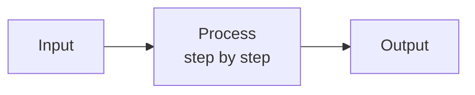
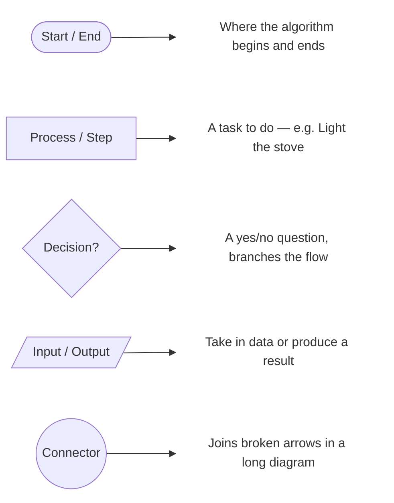
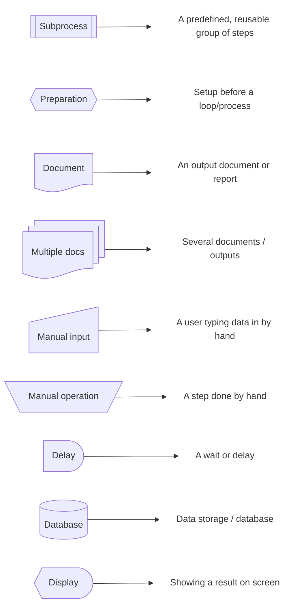
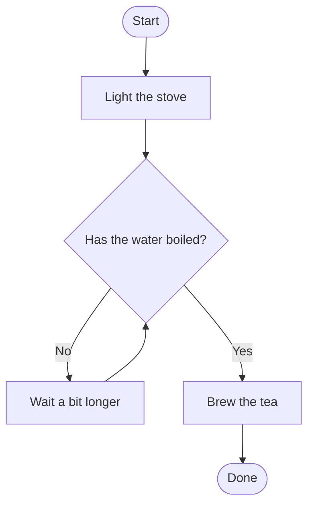

import Callout from '../../components/Callout.astro';
import Steps from '../../components/Steps.astro';

Most people taking their first step into software start with code, languages and
curly braces. We will start somewhere else: **with something you already do every
day.**

Because here is the secret: you were building algorithms long before you wrote a
single line of code. You just did not call it that.

<Callout type="note" title="Where are we in this series?">
This is the first post of the **Algorithms** series. We will not write any code
here; the goal is to exercise your "algorithmic thinking" muscle. Code comes much
more easily once you have the right intuition.
</Callout>

## You are already writing algorithms

Think about this morning. You woke up and roughly did the following:

1. Turned off the alarm
2. Got out of bed
3. Brushed your teeth
4. Got dressed
5. Had breakfast
6. Left the house

You did it without thinking, but there is something hidden here: these are **steps
performed in a certain order that lead you to a result.** That is exactly what an
algorithm is.

What if you broke the order? If you tried to leave the house first and get dressed
afterwards, you would have a problem. So the **order** of the steps directly affects
the result. Keep that in a corner of your mind — we will need it again shortly.

## So what exactly is an "algorithm"?

Behind the scary word lies a very simple idea:

> An **algorithm** is a set of step-by-step, clear and finite instructions followed
> to solve a problem.

A recipe is an algorithm. A furniture assembly guide is an algorithm. The route you
picture in your head on the way to the store is an algorithm. What they all share:
**there is a beginning, steps applied in order, and a result.**

In fact, we can fit every algorithm into a single three-part pattern:



Getting a computer to do work is just this. First we break the problem into steps
(this part is a human job — **your** job), then we translate those steps into a
language the computer understands (we will call that programming — but that is a
topic for later posts).

## A quirk: the computer does everything literally

There is a very important point here that confuses every beginner. Imagine a game:

In front of you is a robot friend that carries out everything you say **exactly,
word for word.** If you tell it to "spread jam on the bread," it might pick up the
jam jar and place it, as is, on top of the bread. Because you did not say "open the
jar, take the knife, scoop a bit of jam with the knife, and spread it thinly over
the bread."

<Callout type="important" title="The computer is not smart; it is obedient">
The computer does not guess your intent; **it does whatever you say.** That is why
the steps of an algorithm must be:

- **Unambiguous** → not "wait a bit," but "wait 5 seconds."
- **Complete** → it will not fill in any step you skip.
</Callout>

It may feel annoying at first, but it is actually good news: the computer never says
"I understood it differently." If something goes wrong, the source is almost always
our own instructions. That makes debugging a **learnable skill** — it is not magic,
it is attention to detail.

## Properties of a good algorithm

For an algorithm to count as "correct," it must have these basic properties:

- **Clear (unambiguous):** Each step must mean exactly one thing. No room for
  confusion.
- **Ordered:** The steps must follow a definite order. (Remember: leaving first and
  dressing afterwards did not work.)
- **Finite:** It must end somewhere. A recipe that goes on forever is not a recipe.
- **Correct:** When followed, it must actually produce the result you want.
- **Has input and output:** You usually start with something (input) and produce a
  result (output).

## Example: the tea-brewing algorithm

Let us make this concrete with our favorite example.

**Input:** water, tea, kettle · **Output:** a cup of brewed tea

<Steps>

1. Put water in the bottom of the kettle.
2. Put tea in the upper pot.
3. Light the stove.
4. **Wait until the water boils.**
5. Add some hot water to the upper pot.
6. Let it brew on low heat for 10–15 minutes.
7. Pour tea and water into the cup.
8. Turn off the stove.

</Steps>

Notice step four: we said "wait until the water boils." So we are waiting based on a
**condition** — if the water has boiled, continue; if not, keep waiting. This tiny
detail is exactly one of the two most important concepts we will meet later
(conditions and loops).

### The same algorithm, with a slightly more "developer" eye

We can write the same recipe without getting stuck on the strict rules of
programming languages, but with its structure made a bit clearer. This is called
**pseudocode** — used to clarify the idea, then easily turned into real code:

```text title="Brewing tea — pseudocode" showLineNumbers=false
INPUT: water, tea
PUT water in the kettle base
PUT tea in the pot
LIGHT the stove

UNTIL the water boils:        ← loop (repeat until the condition holds)
    wait

ADD hot water to the pot
WAIT 10–15 minutes
POUR tea + water into the cup
TURN OFF the stove
OUTPUT: a cup of brewed tea
```

As you can see, the content is the same; we just made the "until the water boils"
part a **loop**, and the check of whether it boiled a **condition**, much more
clearly. When we later write real code, this structure will be preserved almost
one-to-one.

## There is no single right way

A problem usually has more than one solution. When brewing tea you could put the
water in the kettle first and then light the stove; or light the stove first and put
the pot on afterwards — both get you to tea.

It is the same in software. Many algorithms can solve the same problem; some are
faster, some use fewer resources, some are more readable.

<Callout type="tip" title="A spark for later">
We will later learn to answer "which solution is better?" by **measuring**; the name
for this is *algorithmic complexity* (and the famous **Big-O** notation). For now,
all you need to know: there are several correct ways, and there are measurable
differences between them.
</Callout>

## What is next: drawing the steps

So far we have written the algorithm **in words**. But especially once branches like
"if this happens, do that; otherwise do this" come in, words fall short and get
confusing.

This is exactly where **flowcharts** come in: a way to express an algorithm by
*drawing* it with boxes and arrows. The best thing about flowcharts is that they are
a **language-independent common language**: Java, Python, JavaScript or C# — whatever
programming language you use, everyone can read the same diagram. So you can design
an idea without writing a single line of code and share it with teammates who use
different languages.

To read a diagram, each shape has a meaning. First, the **basic shapes you will run
into in almost every algorithm** (shape on the left, what it does on the right):



And there is the **arrow** (`-->`) that connects them: it shows the **direction** of
the flow; after a decision, the label on the arrow (`Yes` / `No`) tells you which
path to take.

Beyond these, there are **other standard shapes** used in larger, real-world
flowcharts (for example audit or business processes):



For most algorithms the four shapes in the first group plus the arrow are more than
enough; you will see the second group in more complex or enterprise flows.

Now let us draw the "has the water boiled?" part of brewing tea with these shapes:



Now you can "read" the diagram: the **No** arrow coming out of the `Has the water
boiled?` diamond loops back and waits again (a **loop**), while the **Yes** arrow
moves on to brewing (a **decision**). That is the power of a flowchart: it shows the
loop and the decision at a single glance.

<Callout type="note" title="What is next?">
You know the shapes now; in the next post we will see, hands-on, how to use them to
**draw your own algorithms step by step**: turning conditions and loops into a
diagram, keeping complex branches simple, and avoiding common mistakes.
</Callout>

## Try it yourself

Do not just read on — practice right away. Write the algorithm for this problem,
step by step:

> **"Swap the contents of two glasses without pouring one directly into the other."**
> That is, the water in glass A should end up in B, and the water in B in A.

<Callout type="note" title="Hint">
You will need an empty **third glass**. If you pour one glass directly into the
other, the two liquids mix — just like overwriting one variable with another without
thinking loses the old value.
</Callout>

This innocent-looking puzzle is actually one of the most fundamental operations in
programming: **swapping the values of two variables.** Its solution comes down to
three steps, and the temporary (third) glass is exactly the *temporary variable* in
code:

```text title="Swapping two values — pseudocode" showLineNumbers=false
temp ← A          # pour A's water into the empty glass
A    ← B          # pour B's water into A
B    ← temp       # pour the glass's water into B
```

Write your steps on paper, then read them out loud as if handing them to your robot
friend: *Is each step clear? Is any step missing? Does it end somewhere?* When you
can do that, you have already started thinking algorithmically.

## Summary

<Callout type="tip" title="Pocket this">
- An algorithm = **clear, ordered and finite** steps that solve a problem.
- The computer is not smart, it is **obedient**; your steps cannot be vague or
  incomplete.
- Every algorithm has an **input, a process and an output**.
- Phrases like "wait until the water boils" mean a **condition** and a **loop**.
- A problem can have several correct solutions, with **measurable** differences
  between them.
</Callout>

---

*Next post: **Flowcharts** — drawing an algorithm with boxes and arrows.*
