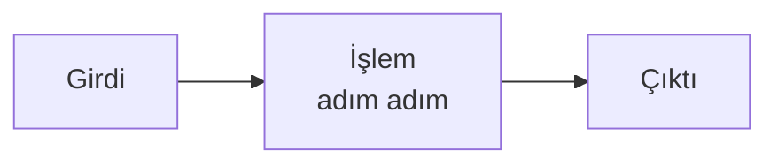
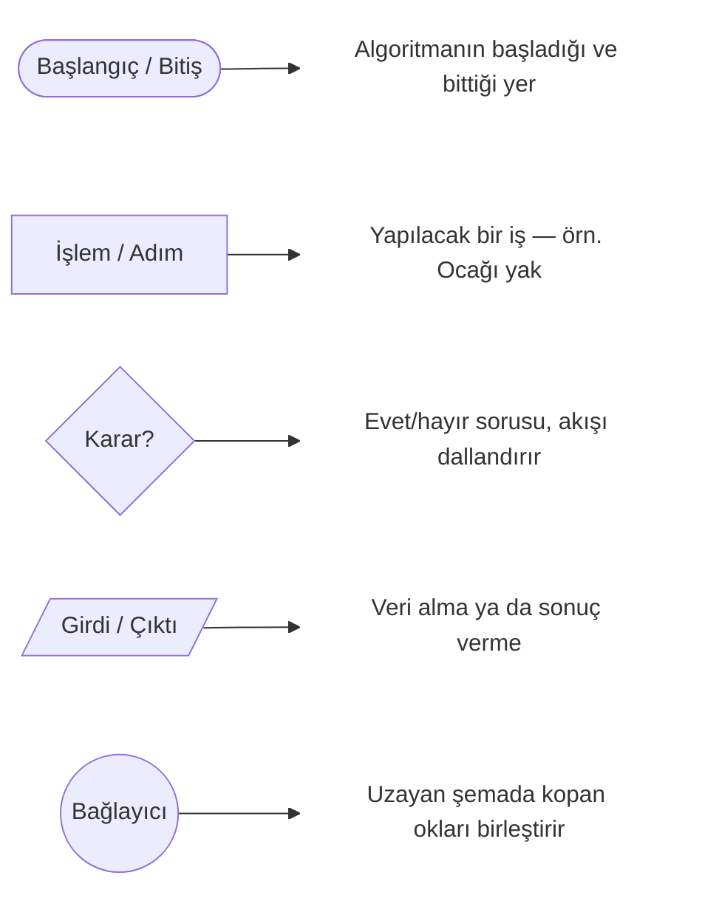
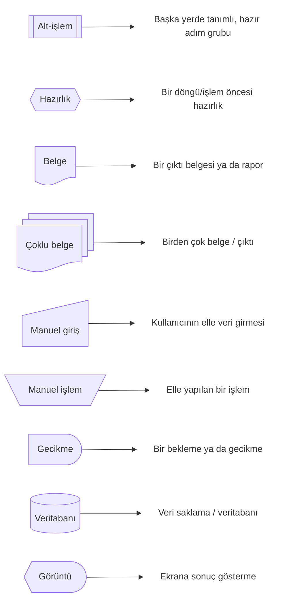
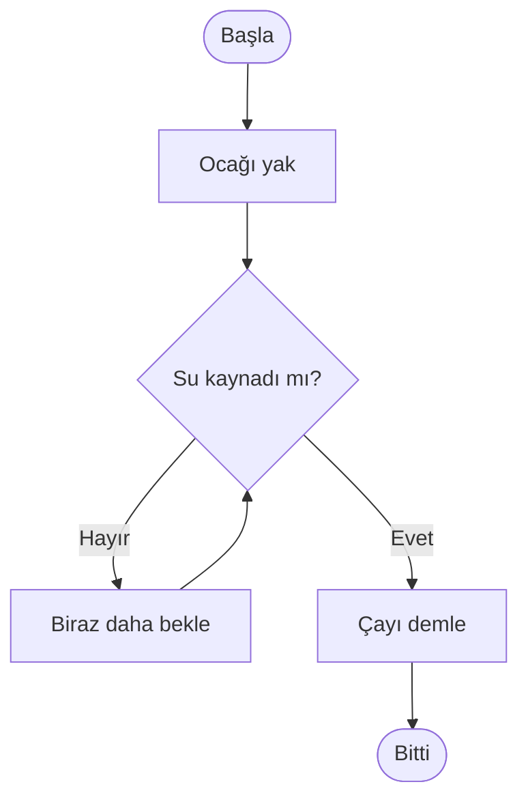

import Callout from '../../components/Callout.astro';
import Steps from '../../components/Steps.astro';

Yazılım dünyasına ilk adımı atan çoğu kişi koddan, dillerden, süslü
parantezlerden başlar. Biz başka bir yerden başlayacağız: **senin zaten her gün
yaptığın bir şeyden.**

Çünkü işin sırrı şu: sen daha tek satır kod yazmadan önce de algoritma
kuruyordun. Sadece adını bilmiyordun.

<Callout type="note" title="Bu seride neredeyiz?">
Bu, **Algoritmalar** serisinin ilk yazısı. Burada hiç kod yazmayacağız; amacımız
"algoritmik düşünme" kasını çalıştırmak. Kod, doğru sezgiyi kurduktan sonra çok
daha kolay gelecek.
</Callout>

## Aslında sen zaten algoritma yazıyorsun

Bu sabahı düşün. Uyandın ve kabaca şunları yaptın:

1. Alarmı kapattın
2. Yataktan kalktın
3. Dişlerini fırçaladın
4. Giyindin
5. Kahvaltı yaptın
6. Evden çıktın

Hiç düşünmeden yaptın ama burada gizli bir şey var: bunlar **belirli bir sırayla
yapılan, seni bir sonuca ulaştıran adımlar.** Algoritma tam olarak budur.

Sırayı bozsan ne olurdu? Önce evden çıkıp sonra giyinmeye kalksan bir sorun
yaşardın. Demek ki adımların **sırası** sonucu doğrudan etkiliyor. Bunu aklının
bir köşesine yaz — birazdan yine lazım olacak.

## Peki "algoritma" tam olarak ne?

Korkutucu kelimenin arkasında çok basit bir fikir var:

> **Algoritma**, bir problemi çözmek için izlenen; adım adım, net ve sonlu
> talimatlar bütünüdür.

Bir yemek tarifi algoritmadır. Mobilya montaj kılavuzu algoritmadır. Markete
giderken aklından geçirdiğin yol tarifi algoritmadır. Hepsinin ortak noktası:
**bir başlangıç var, sırayla uygulanan adımlar var ve bir sonuç var.**

Aslında her algoritmayı üç parçalı tek bir kalıba sığdırabiliriz:



Bilgisayara iş yaptırmak da bundan ibaret. Önce problemi adımlara böleceğiz (bu
kısım insan işi, yani **senin** işin), sonra bu adımları bilgisayarın anladığı
dile çevireceğiz (buna programlama diyeceğiz — ama o, sonraki yazıların konusu).

## Bir tuhaflık: bilgisayar her şeyi kelimesi kelimesine yapar

Burada yeni başlayan herkesin kafasını karıştıran çok önemli bir nokta var.
Şöyle bir oyun düşün:

Karşında, söylediğin her şeyi **tam olarak, kelimesi kelimesine** uygulayan bir
robot arkadaş var. Ona "ekmeğe reçel sür" desen, reçel kavanozunu olduğu gibi
eline alıp ekmeğin üstüne bırakabilir. Çünkü sen "kavanozu aç, bıçağı al, bıçakla
biraz reçel al, ekmeğin üstüne ince ince yay" demedin.

<Callout type="important" title="Bilgisayar zeki değildir; itaatkârdır">
Bilgisayar senin niyetini tahmin etmez; **ne dersen onu yapar.** Bu yüzden bir
algoritmanın adımları:

- **Belirsiz olmamalı** → "biraz bekle" değil, "5 saniye bekle".
- **Eksiksiz olmalı** → atladığın hiçbir adımı kendisi tamamlamaz.
</Callout>

İlk başta sinir bozucu gelebilir, ama aslında bu güzel bir haber: bilgisayar asla
"ben bunu farklı anladım" demez. Sorun çıkarsa, kaynağı neredeyse her zaman bizim
talimatımızdadır. Bu da hata bulmayı (debugging) **öğrenilebilir bir beceri**
yapar — sihir değil, dikkat işidir.

## İyi bir algoritmanın özellikleri

Bir algoritmanın "doğru" sayılması için şu temel özellikleri taşıması gerekir:

- **Net (anlaşılır):** Her adım tek bir anlama gelmeli. Kafa karışıklığına yer
  yok.
- **Sıralı:** Adımlar belirli bir düzende olmalı. (Hatırla: önce çıkıp sonra
  giyinmek olmuyordu.)
- **Sonlu:** Bir yerde bitmeli. Sonsuza kadar süren bir tarif, tarif değildir.
- **Doğru:** İzlendiğinde gerçekten istediğin sonucu vermeli.
- **Girdisi ve çıktısı olmalı:** Genelde bir şeyle başlarsın (girdi) ve bir sonuç
  üretirsin (çıktı).

## Örnek: çay demleme algoritması

Bunu en sevdiğimiz örnekle somutlaştıralım.

**Girdi:** su, çay, çaydanlık · **Çıktı:** bir bardak demli çay

<Steps>

1. Çaydanlığın alt kısmına su koy.
2. Üst demliğe çay koy.
3. Ocağı yak.
4. **Su kaynayana kadar bekle.**
5. Üst demliğe sıcak sudan ekle.
6. Kısık ateşte 10–15 dakika demlenmesini bekle.
7. Bardağa çay ve su koy.
8. Ocağı kapat.

</Steps>

Dördüncü adıma dikkat et: "su kaynayana kadar bekle" dedik. Yani bir **koşula**
bağlı bekliyoruz — su kaynadıysa devam, kaynamadıysa beklemeye devam. Bu küçücük
detay, ileride göreceğimiz en önemli iki kavramın (koşullar ve döngüler) ta
kendisi.

### Aynı algoritma, biraz daha "yazılımcı" gözüyle

Aynı tarifi, programlama dillerinin katı kurallarına takılmadan ama yapısını
biraz daha belirginleştirerek de yazabiliriz. Buna **sözde kod (pseudocode)**
denir — fikri netleştirmek için kullanılır, sonra kolayca gerçek koda çevrilir:

```text title="Çay demleme — sözde kod" showLineNumbers=false
GİRDİ: su, çay
çaydanlığın_altına su KOY
demliğe çay KOY
ocağı YAK

SU KAYNAYANA KADAR:        ← döngü (koşul sağlanana dek tekrar et)
    bekle

demliğe sıcak su EKLE
10–15 dakika BEKLE
bardağa çay + su KOY
ocağı KAPAT
ÇIKTI: bir bardak demli çay
```

Gördüğün gibi içerik aynı; sadece "su kaynayana kadar" kısmını bir **döngü**, su
kaynayıp kaynamadığı kontrolünü bir **koşul** olarak daha net görür hale geldik.
İleride gerçek kodu yazdığımızda bu yapı neredeyse birebir korunacak.

## Aynı işin tek bir doğru yolu yok

Bir problemin genelde birden fazla çözümü vardır. Çayı demlerken suyu önce
çaydanlığa koyup sonra ocağı yakabilirsin; ya da önce ocağı yakıp tencereyi sonra
koyabilirsin — ikisi de seni çaya ulaştırır.

Yazılımda da böyledir. Aynı problemi çözen birçok algoritma olabilir; bazıları
daha hızlı, bazıları daha az kaynak harcar, bazıları daha okunabilirdir.

<Callout type="tip" title="İleri bir kıvılcım">
"Hangi çözüm daha iyi?" sorusunu ileride **ölçerek** yanıtlamayı öğreneceğiz; bu
işin adı *algoritma karmaşıklığı* (ve meşhur **Big-O** gösterimi). Şimdilik tek
bilmen gereken: birden fazla doğru yol vardır ve aralarında ölçülebilir farklar
bulunur.
</Callout>

## Sırada ne var: adımları çizmek

Şimdiye kadar algoritmayı **kelimelerle** yazdık. Ama özellikle "şu olursa şunu
yap, olmazsa bunu yap" gibi dallanmalar girince kelimeler yetersiz kalır ve kafa
karışır.

İşte tam burada **akış şemaları** devreye giriyor: algoritmayı kutular ve oklarla
*çizerek* anlatmanın yolu. Akış şemalarının en güzel yanı, **dilden bağımsız ortak
bir dil** olmalarıdır: Java, Python, JavaScript ya da C# — hangi programlama dilini
kullanırsan kullan, aynı şemayı herkes okuyabilir. Böylece bir fikri tek satır kod
yazmadan tasarlayabilir ve farklı diller kullanan ekip arkadaşlarınla
paylaşabilirsin.

Şemayı okuyabilmen için her şeklin bir anlamı vardır. Önce **hemen her algoritmada
karşına çıkacak temel şekiller** (solda şekil, sağında ne işe yaradığı):



Bir de bunları birbirine bağlayan **ok** (`-->`) var: akışın **yönünü** gösterir;
bir karardan sonra okun üzerindeki etiket (`Evet` / `Hayır`) hangi yoldan
gidileceğini söyler.

Bunların dışında, daha büyük ve gerçek dünya akış şemalarında (örneğin denetim ya da
iş süreçleri) kullanılan **diğer standart şekiller** de vardır:



Çoğu algoritma için ilk gruptaki dört şekil ve ok fazlasıyla yeterli; ikinci
gruptakileri ise daha karmaşık veya kurumsal akışlarda görürsün.

Şimdi bu şekillerle çay demlemenin "su kaynadı mı?" kısmını çizelim:



Şimdi şemayı "okuyabiliyorsun": `Su kaynadı mı?` baklavasından çıkan **Hayır** oku
geri dönüp tekrar bekletiyor (bir **döngü**), **Evet** oku ise demlemeye geçiriyor
(bir **karar**). İşte bir akış şemasının gücü: döngüyü ve kararı tek bakışta
gösterir.

<Callout type="note" title="Sırada ne var?">
Şekilleri tanıdın; bir sonraki yazıda bunları kullanarak **kendi algoritmalarını
adım adım nasıl çizeceğini** uygulamalı göreceğiz: koşulları ve döngüleri şemaya
dökmek, karmaşık dallanmaları sade tutmak ve sık yapılan hatalardan kaçınmak.
</Callout>

## Kendin dene

Okuyup geçme — hemen pratik yap. Şu problemin algoritmasını adım adım yaz:

> **"İki bardağın içindekileri, birinden diğerine boşaltmadan yer değiştir."**
> Yani A bardağındaki su B'ye, B'deki su A'ya geçsin.

<Callout type="note" title="İpucu">
Boş bir **üçüncü bardağa** ihtiyacın olacak. Bir bardağı doğrudan diğerine
boşaltırsan iki sıvı birbirine karışır — tıpkı bir değişkenin değerini düşünmeden
diğerinin üstüne yazarsan eski değerin kaybolması gibi.
</Callout>

Bu masum görünen bulmaca, aslında programlamanın en temel işlemlerinden biridir:
**iki değişkenin değerini takas etmek (swap).** Çözümü üç adımda toplanır ve
geçici (üçüncü) bardak, koddaki *geçici değişkenin* ta kendisidir:

```text title="İki değeri takas etmek — sözde kod" showLineNumbers=false
geçici  ← A          # A'nın suyunu boş bardağa boşalt
A       ← B          # B'nin suyunu A'ya koy
B       ← geçici     # boş bardaktaki suyu B'ye koy
```

Adımlarını bir kâğıda yaz, sonra robot arkadaşına verir gibi yüksek sesle oku:
*Her adım net mi? Eksik adım var mı? Bir yerde bitiyor mu?* Bunu yapabildiğinde,
algoritmik düşünmeye çoktan başlamış olacaksın.

## Özet

<Callout type="tip" title="Cebine koy">
- Algoritma = bir problemi çözen **net, sıralı ve sonlu** adımlar.
- Bilgisayar zeki değil **itaatkârdır**; adımların belirsiz veya eksik olamaz.
- Her algoritmanın bir **girdisi, işlemi ve çıktısı** vardır.
- "Su kaynayana kadar bekle" gibi ifadeler **koşul** ve **döngü** demektir.
- Bir problemin birden çok doğru çözümü olabilir; aralarında **ölçülebilir**
  farklar vardır.
</Callout>

---

*Bir sonraki yazı: **Akış Şemaları** — algoritmayı kutular ve oklarla çizmek.*
