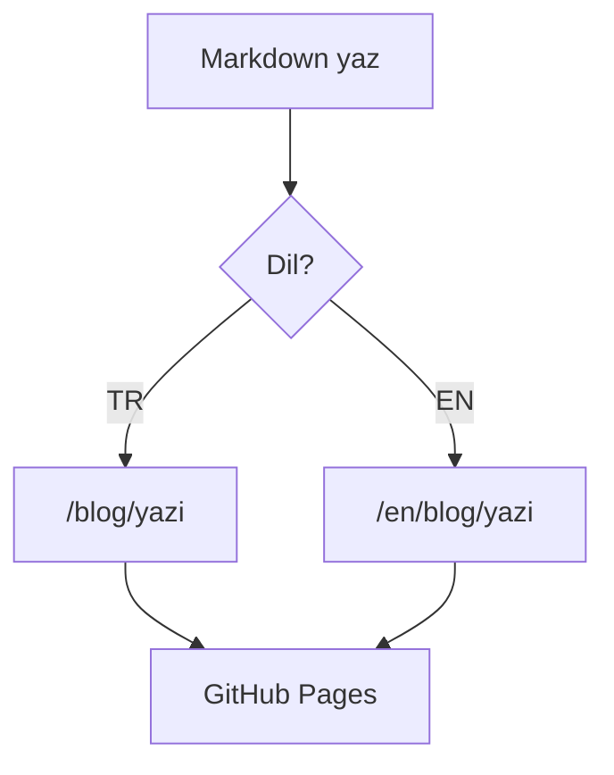
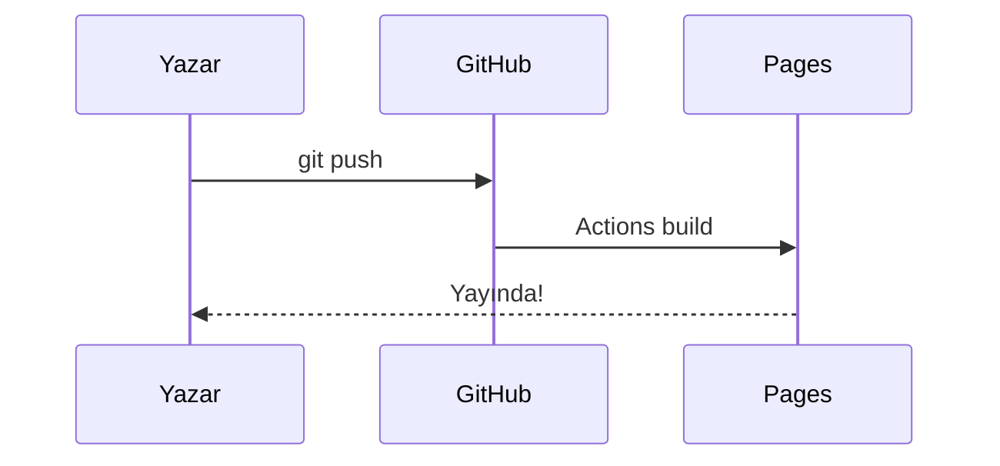

import Emoji from 'astro-emoji';
import CodeGroup from '../../components/CodeGroup.astro';
import Callout from '../../components/Callout.astro';
import Steps from '../../components/Steps.astro';
import Kbd from '../../components/Kbd.astro';
import YouTube from '../../components/YouTube.astro';
import GitHubCard from '../../components/GitHubCard.astro';
import Sandbox from '../../components/Sandbox.astro';
import Figure from '../../components/Figure.astro';
import ProsCons from '../../components/ProsCons.astro';
import figureSample from '../../assets/blog-placeholder-3.jpg';
import { Badge } from '../../components/starwind/badge';
import { Button } from '../../components/starwind/button';
import { Alert, AlertTitle, AlertDescription } from '../../components/starwind/alert';
import {
	Card,
	CardHeader,
	CardTitle,
	CardDescription,
	CardContent,
	CardFooter,
} from '../../components/starwind/card';
import { Tabs, TabsList, TabsTrigger, TabsContent } from '../../components/starwind/tabs';
import {
	Accordion,
	AccordionItem,
	AccordionTrigger,
	AccordionContent,
} from '../../components/starwind/accordion';

Bu sayfa sitenin **tasarım sistemini** ve tüm bileşenlerini tek yerde gösterir
<Emoji symbol="🎨" label="palet" />. Aynı zamanda her şeyin açık/koyu temada doğru
çalıştığını doğrulayan canlı bir testtir.

## Renk paleti

<div class="not-prose grid grid-cols-4 gap-3 sm:grid-cols-8">
	<div><div class="h-14 rounded-xl border border-slate-200 bg-brand-50 dark:border-white/10" /><p class="mt-1.5 text-center text-xs text-slate-500 dark:text-slate-400">50</p></div>
	<div><div class="h-14 rounded-xl bg-brand-100" /><p class="mt-1.5 text-center text-xs text-slate-500 dark:text-slate-400">100</p></div>
	<div><div class="h-14 rounded-xl bg-brand-200" /><p class="mt-1.5 text-center text-xs text-slate-500 dark:text-slate-400">200</p></div>
	<div><div class="h-14 rounded-xl bg-brand-300" /><p class="mt-1.5 text-center text-xs text-slate-500 dark:text-slate-400">300</p></div>
	<div><div class="h-14 rounded-xl bg-brand-400" /><p class="mt-1.5 text-center text-xs text-slate-500 dark:text-slate-400">400</p></div>
	<div><div class="h-14 rounded-xl bg-brand-500" /><p class="mt-1.5 text-center text-xs text-slate-500 dark:text-slate-400">500</p></div>
	<div><div class="h-14 rounded-xl bg-brand-600" /><p class="mt-1.5 text-center text-xs text-slate-500 dark:text-slate-400">600</p></div>
	<div><div class="h-14 rounded-xl bg-brand-700" /><p class="mt-1.5 text-center text-xs text-slate-500 dark:text-slate-400">700</p></div>
</div>

## Uyarılar (Alert)

<div class="not-prose space-y-3">
	<Alert variant="info">
		<AlertTitle>Bilgi</AlertTitle>
		<AlertDescription>Bu bir bilgilendirme kutusudur.</AlertDescription>
	</Alert>
	<Alert variant="success">
		<AlertTitle>Başarılı</AlertTitle>
		<AlertDescription>İşlem başarıyla tamamlandı.</AlertDescription>
	</Alert>
	<Alert variant="warning">
		<AlertTitle>Uyarı</AlertTitle>
		<AlertDescription>Dikkat edilmesi gereken bir durum var.</AlertDescription>
	</Alert>
	<Alert variant="error">
		<AlertTitle>Hata</AlertTitle>
		<AlertDescription>Bir şeyler ters gitti.</AlertDescription>
	</Alert>
</div>

## Bilgi kutuları (Callout)

<Callout type="note">Bu bir **not** kutusudur; ek bağlam vermek için.</Callout>
<Callout type="tip" title="İpucu">Yazıları Markdown yazıp `git push` ile yayınla.</Callout>
<Callout type="important">Bu noktayı atlama, sonradan işine yarayacak.</Callout>
<Callout type="warning">Dikkatli ol; bu işlem geri alınamaz.</Callout>
<Callout type="caution">Tehlikeli bölge — production'da denemeden önce iki kez düşün.</Callout>

## Düğmeler & Rozetler

<div class="not-prose flex flex-wrap items-center gap-3">
	<Button variant="primary">Birincil</Button>
	<Button variant="secondary">İkincil</Button>
	<Button variant="outline">Outline</Button>
	<Button variant="ghost">Ghost</Button>
</div>

<div class="not-prose mt-4 flex flex-wrap items-center gap-2">
	<Badge variant="primary">primary</Badge>
	<Badge variant="secondary">secondary</Badge>
	<Badge variant="success">success</Badge>
	<Badge variant="warning">warning</Badge>
	<Badge variant="error">error</Badge>
	<Badge variant="outline">outline</Badge>
</div>

## Kart (Card)

<div class="not-prose grid gap-4 sm:grid-cols-2">
	<Card>
		<CardHeader>
			<CardTitle>Astro</CardTitle>
			<CardDescription>İçerik odaklı, hızlı web sitesi çatısı.</CardDescription>
		</CardHeader>
		<CardContent>Statik üretim, ada mimarisi ve sıfır JS varsayılanı.</CardContent>
		<CardFooter>
			<Button variant="primary" size="sm" href="https://astro.build">Keşfet</Button>
		</CardFooter>
	</Card>
	<Card>
		<CardHeader>
			<CardTitle>Tailwind CSS</CardTitle>
			<CardDescription>Utility-first CSS çatısı.</CardDescription>
		</CardHeader>
		<CardContent>Tasarım sistemini doğrudan işaretlemede kur.</CardContent>
		<CardFooter>
			<Button variant="outline" size="sm" href="https://tailwindcss.com">Keşfet</Button>
		</CardFooter>
	</Card>
</div>

## Sekmeler (Tabs)

<div class="not-prose">
	<Tabs defaultValue="tr">
		<TabsList>
			<TabsTrigger value="tr">Türkçe</TabsTrigger>
			<TabsTrigger value="en">English</TabsTrigger>
		</TabsList>
		<TabsContent value="tr">Yazılar hem Türkçe hem İngilizce yazılabilir.</TabsContent>
		<TabsContent value="en">Posts can be written in both Turkish and English.</TabsContent>
	</Tabs>
</div>

## Akordeon (Accordion)

<div class="not-prose">
	<Accordion type="single">
		<AccordionItem value="a">
			<AccordionTrigger>Yazılar nasıl yayınlanır?</AccordionTrigger>
			<AccordionContent>Markdown dosyasını ekleyip `git push` yapman yeterli.</AccordionContent>
		</AccordionItem>
		<AccordionItem value="b">
			<AccordionTrigger>Tema nasıl değişir?</AccordionTrigger>
			<AccordionContent>Üstteki güneş/ay düğmesiyle; tercih kaydedilir.</AccordionContent>
		</AccordionItem>
	</Accordion>
</div>

## Adımlar (Steps)

<Steps>

1. Depoyu klonla ve bağımlılıkları kur:

   ```bash
   git clone https://github.com/MehmetNuri/mehmetnuri.com
   pnpm install
   ```

2. Geliştirme sunucusunu başlat: `pnpm dev`.

3. Yeni bir Markdown dosyası ekleyip `git push` yap. Bitti!

</Steps>

## Klavye tuşları (Kbd)

Aramayı açmak için <Kbd>⌘</Kbd> + <Kbd>K</Kbd>, temayı değiştirmek için <Kbd>T</Kbd>.

## Artılar & Eksiler (ProsCons)

<ProsCons
	pros={['Çok hızlı statik çıktı', 'Sıfır JS varsayılanı', 'İçerik odaklı']}
	cons={['Sunucu tarafı mantık sınırlı', 'Büyük SPA için ideal değil']}
/>

## GitHub kartı (build-time)

<GitHubCard repo="withastro/astro" />

## Etkileşimli sandbox

<Sandbox stackblitz="edit/astro-basics" title="Astro örneği" />

## YouTube (tıkla-oynat)

<YouTube id="zfQoleQEa4w" title="Astro tanıtımı" />

## Altyazılı görsel (Figure)

<Figure src={figureSample} alt="Örnek görsel" caption="Figure bileşeniyle altyazı eklenir." />

## Tipografi & Markdown

Burada **kalın**, _italik_, ~~üstü çizili~~, `satır içi kod` ve bir
[bağlantı](https://astro.build) var.

- Madde bir
- Madde iki
  - İç madde

1. Birinci
2. İkinci

### Görev listesi (GFM)

- [x] Tamamlanan iş
- [ ] Bekleyen iş

### Tablo

| Özellik      | Eklenti           | Durum |
| ------------ | ----------------- | :---: |
| Diyagram     | astro-mermaid     |  ✅   |
| Kod blokları | Expressive Code   |  ✅   |
| Çok dillilik | astro-loader-i18n |  ✅   |

> Sadelik nihai gelişmişliktir. — _Leonardo da Vinci_

## Kod blokları (Expressive Code)

```js title="merhaba.js" {2} ins={3} del={4}
function selamla(isim) {
	const mesaj = `Merhaba, ${isim}!`;
	console.log(mesaj); // eklendi
	console.log('eski'); // silindi
	return mesaj;
}
```

```bash title="Terminal"
pnpm install
pnpm dev
```

İlgisiz satırlar katlanır (tıklayınca açılır):

```js title="kurulum.js" collapse={2-6}
export function setup() {
	const a = 1;
	const b = 2;
	const c = 3;
	const d = 4;
	const e = 5;
	return a + b + c + d + e;
}
```

## Sekmeli kod grubu

<CodeGroup titles={['Astro', 'Next.js', 'Vite']}>

```js title="astro.config.mjs"
import { defineConfig } from 'astro/config';

export default defineConfig({
	site: 'https://mehmetnuri.com',
});
```

```js title="next.config.js"
/** @type {import('next').NextConfig} */
module.exports = {
	reactStrictMode: true,
};
```

```ts title="vite.config.ts"
import { defineConfig } from 'vite';

export default defineConfig({
	build: { target: 'es2022' },
});
```

</CodeGroup>

## Twoslash (hover tip bilgisi)

Aşağıdaki blokta değişkenlerin üzerine gelince tür bilgisi görünür:

```ts twoslash
const greeting = 'Merhaba';
const upper = greeting.toUpperCase();
//    ^?

function double(x: number): number {
	return x * 2;
}

const result = double(21);
```

## Mermaid diyagramları





## Görsel


## Dipnot

Astro, Markdown'da dipnotları destekler[^1].

[^1]: Bu bir dipnot örneğidir.

---

Test bitti <Emoji symbol="🎉" label="kutlama" />.
