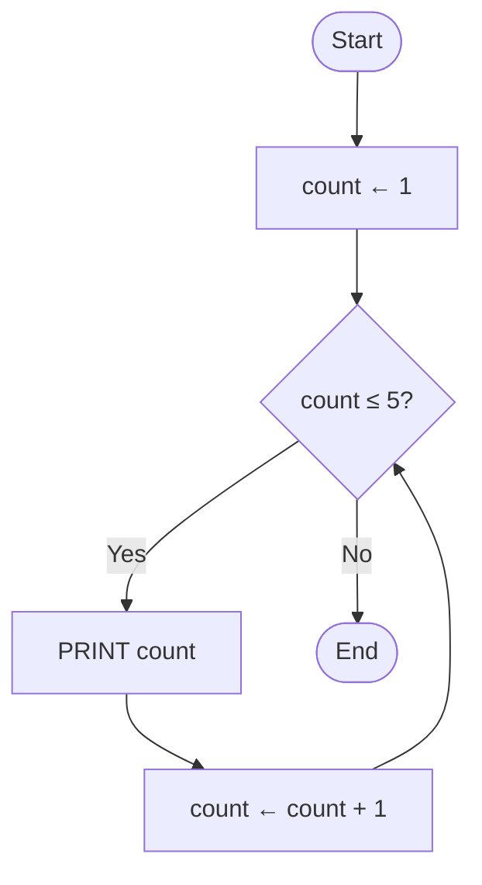
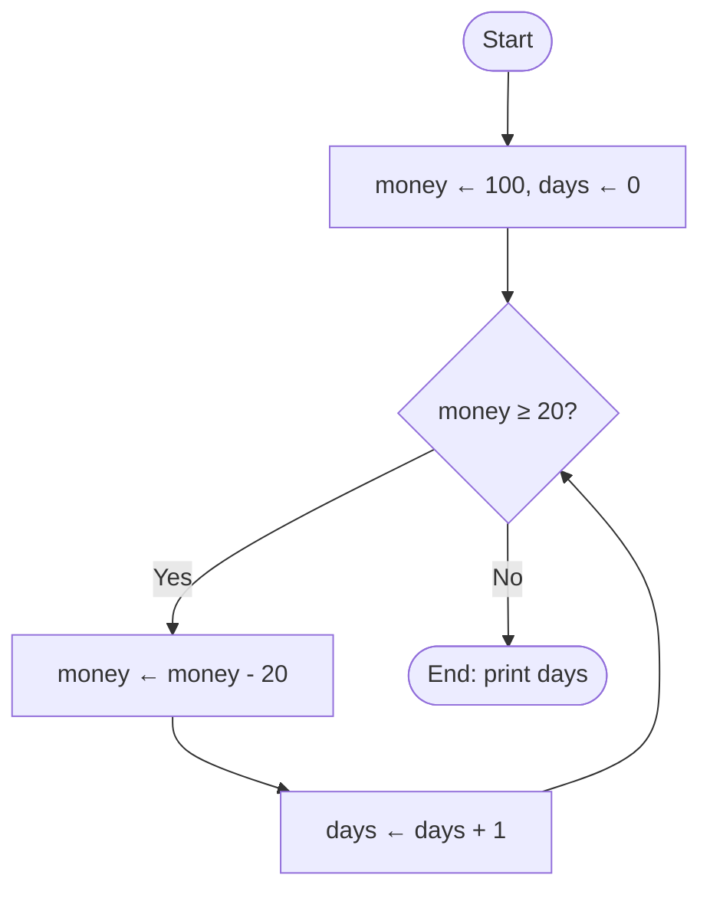

import Callout from '../../components/Callout.astro';
import Steps from '../../components/Steps.astro';

[In the previous post](/en/blog/conditionals) we learned conditionals: looking at a
true/false question and **choosing a path.** But did you notice that `IF` asked its question
only **once** — it entered a branch based on the answer and moved on. What if we want to do
the same work not once but **dozens of times?** To ask the same decision over and over?

That is exactly what this post is about: running a group of steps **again and again** while a
condition holds. We call it a **loop.** So far our program either flowed straight down or made
a single choice and moved on; with a loop it can, for the first time, **go back** and repeat
the same work. And we'll see that a loop is nothing but the decision from the previous post,
**asked over and over.**

<Callout type="note" title="Where are we in this series?">
This is the sixth post in the **Algorithms** series. We [met algorithms](/en/blog/what-is-an-algorithm), drew them as
[flowcharts](/en/blog/flowcharts), wrote them as [pseudocode](/en/blog/pseudocode), stored
information with [variables](/en/blog/variables), and learned to decide with
[conditionals](/en/blog/conditionals). Loops bring all of these together: we repeat steps, by
changing a **variable,** while a **condition** holds. Still not a single line of real code —
just pen, paper, and thinking.
</Callout>

## Why do we need loops?

Say you want to print the numbers 1 to 5. We have the `PRINT` command from the
[pseudocode post](/en/blog/pseudocode) — it writes to the screen. You could do this:

```text title="Without a loop — repeating by hand" showLineNumbers=false
PRINT 1
PRINT 2
PRINT 3
PRINT 4
PRINT 5
```

Five lines, no big deal. But what about 1 to **1000?** Are you going to write a thousand
lines? And what if the limit isn't known up front — like "count until the user enters 0"? Then
you can't even **know** how many lines to write. That's where we get stuck.

Yet the work here is really the repetition of a single pattern: "print a number, then add one
to it, and keep going until you hit the limit." You do exactly this all day long:

- Climbing stairs, you repeat the same move on **each step** — until you reach the top.
- Washing dishes, you repeat the same steps for **each plate** — until the sink is empty.
- On a running track, you run the same lap **each time** — until you hit your target lap count.

This is precisely what a computer does best: **repeating the same work tirelessly, without
ever slipping.** A loop is how you tell it to "repeat this until that condition breaks." Set it
up correctly once, and whether it runs five times or five million times is all the same to it.

## The three parts of a loop

Every loop is built from the same skeleton: you set up a counter, ask a condition, do your
work, update the counter, and go back to the condition. We've actually met this skeleton
before: in the [flowcharts post](/en/blog/flowcharts) we briefly called these **"the three
must-haves of a loop"** without unpacking them. Let's now open up those three parts one by
one — because if any of them is missing, the loop either never runs or never stops:

<Steps>
1. **Initialization** — Before entering the loop you lay the groundwork: you set up a counter
   or variable. *"Start counting from 1."* (`count ← 1` — that arrow is the **assignment**
   you know from the [variables post](/en/blog/variables): put 1 into the count box.)
2. **Condition** — A question asked at the **start** of each pass: should we keep looping? If
   true, one more pass runs; the moment it's false, the loop ends. *"Is count still less than
   or equal to 5?"* (`count ≤ 5`)
3. **Progression** — The step **inside** the loop that will eventually **break** the condition.
   Without it, the condition stays true forever. *"Add one to count each pass."*
   (`count ← count + 1`)
</Steps>

Keep this trio in mind; the rest of this post revolves around these three parts. When you look
at a loop, reflexively ask: **Where does it start? When does it stop? Where is the step that
stops it?**

## Counter loop: "do this exactly N times"

The most familiar loop is the one where you **know up front how many times it runs.** A
counter tracks the passes, and you say "loop until you reach this number." In the
[flowcharts post](/en/blog/flowcharts) we called this a **counter loop.**

In pseudocode we open a loop with `WHILE … DO` and close it with `ENDWHILE` — just as we met in
the [pseudocode post](/en/blog/pseudocode). Here's the loop that counts from 1 to 5 — the very
example we drew as a flowchart and wrote as pseudocode in the earlier posts — all three
parts in place:

```text title="Count 1 to 5 — counter loop" showLineNumbers=false
count ← 1
WHILE count ≤ 5 DO
    PRINT count
    count ← count + 1
ENDWHILE
```

Read it line by line: we start `count` at 1 (**initialization**). Then we ask "is count ≤ 5?"
(**condition**); if true we go inside, print the number, and add one (**progression**). At
`ENDWHILE` the arrow goes back to the condition and the question is asked again. This continues
until `count` becomes 6 and the condition says "false." Let's also see the same idea as a
flowchart:



That **loop-back arrow** (from E to C) is the heart of the loop; spotting it is the fastest way
to say "there's a repetition here." Now let's run this loop by hand on paper — writing down
what the variables are on each pass is the best way to understand a loop:

| Pass | `count` (start) | `count ≤ 5` true? | Printed | `count` (end) |
| :--: | :-------------: | :---------------: | :-----: | :-----------: |
| 1    | 1               | true              | 1       | 2             |
| 2    | 2               | true              | 2       | 3             |
| 3    | 3               | true              | 3       | 4             |
| 4    | 4               | true              | 4       | 5             |
| 5    | 5               | true              | 5       | 6             |
| 6    | 6               | **false**         | —       | (loop ends)   |

On the sixth pass `count` becomes 6, the condition comes out false, and the loop stops
gracefully. We call this a **trace table;** it's familiar from the
[variables](/en/blog/variables) and [conditionals](/en/blog/conditionals) posts. Whenever
you're unsure about a loop, walk it on paper like this for a few passes — you'll see it with
your own eyes.

<Callout type="tip" title="Real code has a shortcut called 'for'">
This "initialize – check – progress" pattern is used so often that nearly every real language
offers a special, one-line structure for it: the **`for` loop.** A `for` loop gathers the
counter's initialization, condition, and progression into a single line — so it's the compact
form of our three-part counter loop; not a different thing, just a tidier way to write the same
idea.
</Callout>

## Conditional loop: "do this until something happens"

We don't always know how many times we'll loop. Sometimes we loop **until something happens** —
the number of passes isn't known up front; it depends on an external event. This is called a
**conditional loop.** Here there's no counter tracking passes; what stops the loop is something
changing in the world.

You have 100 in your pocket and spend 20 each day. How many days will your money last? You don't
need to work out the number of passes in advance — the loop runs on its own until the money runs
out:

```text title="Until the money runs out — conditional loop" showLineNumbers=false
money ← 100
days  ← 0
WHILE money ≥ 20 DO
    money ← money - 20
    days  ← days + 1
ENDWHILE
PRINT days
```

Notice: the structure is still the same three parts (initialization, condition, progression),
but this time "progression" isn't incrementing a counter — it's **reducing the money.** The
condition (`money ≥ 20`) isn't counting passes, it's watching a state. The loop stops when the
money drops below 20. Here's the flowchart:



Now notice the real subtlety here:

<Callout type="important" title="A loop is a decision asked over and over">
Recognize the `money ≥ 20?` box in the diagram? It **is** the decision (diamond) box from the
[previous post](/en/blog/conditionals). The only difference is that the "Yes" arrow goes
**back to the condition** instead of moving forward. So a loop is really an `IF` decision
**asked again at the start of every pass.** If you understood conditionals, you already
understand loops halfway — a loop sits on top of a decision.
</Callout>

We've actually been living with this kind of loop since day one of the series. The "wait
until the water boils" step in the tea-brewing algorithm from the
[first post](/en/blog/what-is-an-algorithm) was a conditional loop: how many minutes it takes
isn't known; it ends when the water boils. So is the door
[we drew in the flowcharts post](/en/blog/flowcharts) that keeps asking until the correct
password is typed: "keep asking **until** the password is correct." How many attempts it takes
isn't known up front; the moment the user gives the right answer, the loop ends on its own.

## Counter or conditional? How do I choose?

One question keeps them straight: **"Do I know up front how many times it will loop?"**

| Question | Counter loop | Conditional loop |
| -------- | ------------ | ---------------- |
| How many times? | **Known** up front ("exactly 10") | **Unknown** up front ("until it happens") |
| What does it watch? | A **counter** (`count ≤ 10`) | A **state** (`money ≥ 20`, `wrong password`) |
| Everyday example | "run 5 laps" | "run until you're tired" |
| Name in real code | usually `for` | usually `while` |

Neither name in the table should scare you; both are old friends. The `while` of real code is
the very `WHILE … DO` we've been writing since the [pseudocode post](/en/blog/pseudocode), and
you met `for` a moment ago as the shortcut that packs the three parts into one line.

Both can be written with the same `WHILE … ENDWHILE` structure; the difference is **what stops
the loop.** If you're unsure, ask yourself: "does my stopping rule depend on a number, or on
something happening out in the world?"

## Accumulating with a loop: sum and count

One of the most powerful things about loops is **accumulating** a small contribution each pass
and arriving at a single result at the end. You've actually seen this pattern before: at the
end of the [pseudocode post](/en/blog/pseudocode) we found the sum of the **even** numbers from
1 to 10, and the `total` variable there grew exactly like this, pass by pass. Let's build a
simpler version of that example: the sum of **all** the numbers from 1 to 10. To do it, we
place a **second variable** next to our loop variable (`n`) to accumulate the result:

```text title="Sum from 1 to 10 — accumulation" showLineNumbers=false
n     ← 1
total ← 0
WHILE n ≤ 10 DO
    total ← total + n
    n     ← n + 1
ENDWHILE
PRINT total
```

There are **two** variables here, and their roles are completely different:

- `n` is the **loop variable** (the counter) that drives the passes. It grows 1, 2, 3… and
  moves the loop forward.
- `total` is the **accumulator** that gathers the result. It grows by `n` each pass:
  0 → 1 → 3 → 6 → 10… When the loop ends, the final answer (55) sits inside it.

<Callout type="important" title="Initialize the accumulator OUTSIDE the loop">
The most critical point: the `total ← 0` line sits **outside** the loop, **before** it. If you
accidentally put this line inside the loop, `total` is reset at the start of every pass and
nothing accumulates — you'd end up with just the last number instead of 55. Prepare the
accumulator **once,** before entering the loop; then let the loop grow it pass by pass.
</Callout>

You can **count** with the same idea: if you bump an accumulator (`itemCount ← 0`) by one on
each qualifying pass, you'll know how many there were when the loop ends. Summing, counting, finding
the largest… they're all variations of this "prepare before the loop, update each pass" pattern.

## The infinite loop: the most classic trap

What happens if you forget the **progression** among a loop's three parts? The condition never
breaks, the loop never stops. This is called an **infinite loop** — we met it by name in the
pitfalls section of the [flowcharts post](/en/blog/flowcharts) — and it's the number-one
nemesis of beginners. Now let's catch it in the act.

Look — let's delete a single line from our first example:

```text title="Infinite loop — WARNING, this is broken!" showLineNumbers=false
count ← 1
WHILE count ≤ 5 DO
    PRINT count
ENDWHILE
```

The `count ← count + 1` line is gone. Now trace it on paper: `count` is always 1. "Is 1 ≤ 5?" —
yes. Print 1. Ask again: "Is 1 ≤ 5?" — yes again. Print 1. Again, again, again… because `count`
never changes, the condition stays true **forever;** the program keeps printing "1" endlessly
and never finishes.

<Callout type="caution" title="How do you avoid an infinite loop?">
- **Check the progression:** Is there a step inside the loop that eventually **breaks** the
  condition you check? Is the counter growing, the money shrinking, the password being read
  again?
- **Walk a few passes on paper:** Run the loop by hand with a trace table for 2–3 passes. If
  the variable that governs the condition **never changes,** you'll smell an infinite loop.
- **Ask "how does this loop end?":** Ask yourself this every time you write a loop. If the
  answer isn't clear, you're probably missing a progression step somewhere.
</Callout>

A note: sometimes an infinite loop is set up **on purpose** — a program that keeps a website
up day and night must never stop, for instance. But even then there's a special exit inside to
break the loop when needed. The `STOP` command you saw in the three-attempt password example
of the [pseudocode post](/en/blog/pseudocode) did exactly this job: when the correct password
came in, it cut the loop right in the middle. As a beginner, our rule is clear: **every loop
must have an ending.**

## Nested loops: a loop inside a loop

Nested structures are nothing new to you: we [put a conditional inside a conditional](/en/blog/conditionals),
and in the [flowcharts post](/en/blog/flowcharts) we placed a **decision** inside a loop to
print the even numbers from 1 to 10. Now we go one step further: we'll put **another loop**
inside a loop. This is called a **nested loop.** Let's print a small multiplication table: for
each row from 1 to 3, print that row's products from 1 to 3.

```text title="Mini multiplication table — nested loop" showLineNumbers=false
row ← 1
WHILE row ≤ 3 DO
    col ← 1
    WHILE col ≤ 3 DO
        PRINT row × col
        col ← col + 1
    ENDWHILE
    row ← row + 1
ENDWHILE
```

How does it work? The **outer** loop (`row`) takes one pass, and within that single pass the
**inner** loop (`col`) runs **fully** from start to finish. So while `row = 1`, cols 1, 2, 3
are printed; then `row` becomes 2 and cols 1, 2, 3 are printed **again**… If the outer loop
runs 3 times, each time running the inner loop 3 times, that's 3 × 3 = **9** passes in total.
Notice the indentation shifting one level deeper; which loop owns what is shown, again, by
[indentation](/en/blog/pseudocode).

<Callout type="tip" title="Reset the inner counter on EVERY outer pass">
The most common mistake with nested loops: forgetting to put the `col ← 1` line **inside the
outer loop.** If that line doesn't reset the inner counter at the start of each outer pass,
`col` stays at 4 when you move to the second row, the inner loop never runs, and you only see
the table's first row. The rule: the inner loop's initialization must sit **in the outer loop's
body** — a fresh start on every outer pass.
</Callout>

## Common mistakes

<Callout type="caution" title="Watch out for these traps">
- **Forgetting the progression:** Skipping the step that increments the counter or changes the
  condition. The loop never stops (infinite loop). For every loop, ask "how does this end?"
- **Resetting the accumulator inside:** Accidentally putting `total ← 0` inside the loop. It's
  reset every pass and nothing accumulates. Set up the accumulator **before** the loop.
- **Off-by-one at the boundary:** Writing `<` instead of `≤` (or vice versa) and looping one
  pass too few or too many. To count 1 to 5, is it `count ≤ 5` or `count < 5`? Always test the
  boundary value on paper — that's where most bugs hide.
- **Forgetting to reset the inner counter:** In a nested loop, not putting the inner counter's
  initialization inside the outer loop. The inner loop never runs after the first pass.
- **Mixing up the variables:** Treating the loop variable (counter) and the accumulator as the
  same thing. One drives the passes, the other gathers the result; they're separate jobs.
- **Forgetting the "zero passes" case:** If the condition is false from the very start, the loop
  may **never** run (`money ← 10` while `money ≥ 20`). Sometimes that's correct, sometimes a
  bug — consider the possibility that the loop runs zero times.
</Callout>

<Callout type="note" title="A short history note: the person who wrote the first loop">
The idea of running a program's steps **over and over** has a surprisingly early hero: the
English mathematician **Ada Lovelace** (1815–1852). In 1843, in her notes on Charles Babbage's
never-fully-built *Analytical Engine,* she described a step-by-step method for computing a
special sequence of numbers prized by mathematicians (the Bernoulli numbers). That method involved running a group of operations **repeatedly** — that is,
a loop. These notes are today often called the **first computer program** in history, and Ada
the first programmer. What's more, she foresaw — with no computer even in existence yet — that
the machine could process not just numbers but anything that follows rules, like music and
symbols. A nice coincidence: **George Boole,** who built the true/false logic of the
[previous post](/en/blog/conditionals), and Ada Lovelace were born the **same year,** 1815.
Every loop you write today is a distant echo of Ada's notes.
</Callout>

## Try it yourself

Pen and paper are all you need. For each exercise, first write the **pseudocode** (don't forget
the three parts: initialization, condition, progression), then draw a **trace table** and walk
the loop by hand for a few passes.

### Exercise 1 — Countdown (easy)

> Print the numbers from 10 down to 1, largest to smallest (10, 9, 8, … 1).

<Callout type="note" title="Hint">
This is a **counter loop,** but this time we **decrease** the counter. Start with `count ← 10`,
make the condition `count ≥ 1`, and in the progression step write `count ← count - 1`. Then walk
the first few passes with a trace table: does count go 10, 9, 8… in order, and does it stop
exactly at **1** without going down to 0?
</Callout>

### Exercise 2 — Multiples of a number (medium)

> Take a number from the user (say 7) and print its multiples from 1 to 10: 7, 14, 21, … 70.
> Then, at the very end, print their **sum.**

<Callout type="note" title="Hint">
This has both a **counter loop** and **accumulation.** Let a counter (`k ← 1`) go from 1 to 10;
each pass, print `n × k`. For the sum, set up `total ← 0` **before** the loop, and each pass say
`total ← total + (n × k)`. When the loop ends, print `total`. Make sure you initialize the
accumulator outside the loop — otherwise the total keeps getting reset.
</Callout>

### Exercise 3 — Multiplying bacteria (mini project)

> A dish holds 1 bacterium, and every hour the count **doubles** (1 → 2 → 4 → 8 …). How many
> hours does it take for the count to **exceed** 1000?

<Callout type="note" title="Hint">
You don't know up front how many hours it'll take; so this is a **conditional loop.** Set up two
variables: `bacteria ← 1` and `hours ← 0`. Let the loop condition be `bacteria ≤ 1000`. Each
pass, double the count (`bacteria ← bacteria × 2`) and add one to the hours (`hours ← hours +
1`). When the loop ends, print `hours`. Walk it on paper: 1, 2, 4, 8, 16… see on which pass it
first passes 1000. (Hint: the answer is under 10 — you'll be surprised how fast it grows.)
</Callout>

## Summary

<Callout type="tip" title="Pocket it">
- A **loop** runs a group of steps **over and over** while a condition holds; it's the only way
  an algorithm can handle repetition. It's the job of the loop-back arrow in a flowchart and the
  `WHILE … ENDWHILE` in pseudocode.
- Every healthy loop has **three parts:** **initialization** (set up the counter), **condition**
  (should we keep looping?), and **progression** (the step that eventually breaks the condition).
- A **counter loop** says "do this exactly N times" (count known, usually `for` in real code);
  a **conditional loop** says "do this until something happens" (unknown, usually `while`).
- A loop is really **a decision asked again at the start of every pass** — it sits on top of a
  conditional.
- You can **accumulate** a result with a loop (sum, count); initialize the accumulator
  **outside** the loop and update it each pass.
- The **infinite loop** is the classic trap: forget the progression and the loop never stops.
  For every loop, ask "how does this end?" and test the boundary values on paper.
</Callout>
