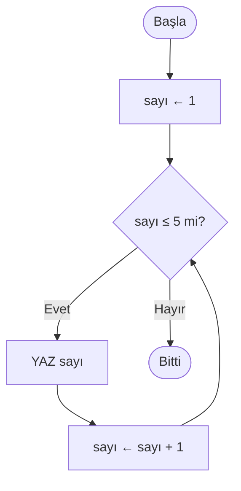
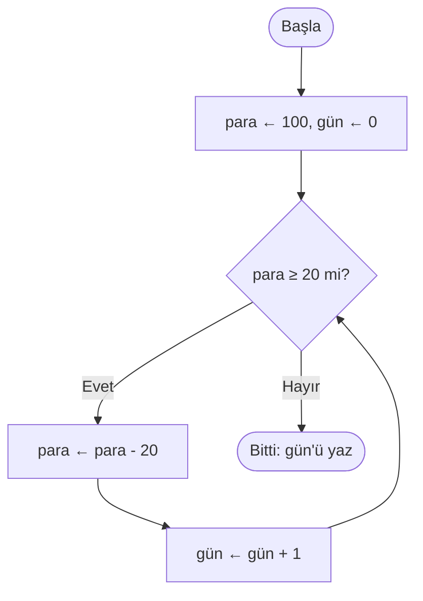

import Callout from '../../components/Callout.astro';
import Steps from '../../components/Steps.astro';

[Önceki yazıda](/blog/kosullar) koşulları öğrendik: bir doğru/yanlış sorusuna bakıp
**yol ayırmak.** Ama fark ettin mi, `EĞER` soruyu yalnızca **bir kez** soruyordu — cevaba
göre bir dala girip yoluna devam ediyordu. Peki ya aynı işi bir değil, **onlarca kez**
yapmak istersek? Aynı kararı tekrar tekrar sormak istersek?

İşte bu yazının konusu tam olarak bu: bir grup adımı, bir şart sağlandığı sürece **tekrar
tekrar** çalıştırmak. Buna **döngü** diyoruz. Şu ana kadar programımız ya düz akıyordu ya
da bir kez seçim yapıp geçiyordu; döngüyle birlikte ilk kez **geriye dönüp** aynı işi
yineleyebilecek. Ve göreceğiz ki bir döngü, aslında bir önceki yazıdaki kararın **tekrar
tekrar sorulan** hâlinden başka bir şey değil.

<Callout type="note" title="Bu seride neredeyiz?">
Bu, **Algoritmalar** serisinin altıncı yazısı. [Algoritmayı tanıdık](/blog/algoritma-nedir), [akış şemasıyla](/blog/akis-semalari)
çizdik, [sözde kodla](/blog/sozde-kod) yazdık, [değişkenlerle](/blog/degiskenler) bilgiyi
sakladık ve [koşullarla](/blog/kosullar) karar vermeyi öğrendik. Döngü, bu parçaların
hepsini bir araya getiriyor: bir **değişkeni** değiştirerek, bir **koşul** tuttuğu sürece,
adımları tekrarlıyoruz. Hâlâ tek satır gerçek kod yok — sadece kalem, kâğıt ve düşünce.
</Callout>

## Neden döngüye ihtiyacımız var?

Diyelim ki 1'den 5'e kadar olan sayıları ekrana yazdırmak istiyorsun. Elimizde
[sözde kod yazısından](/blog/sozde-kod) `YAZ` komutu var — ekrana yazdırıyordu. Şöyle
yapabilirsin:

```text title="Döngüsüz — elle tekrar" showLineNumbers=false
YAZ 1
YAZ 2
YAZ 3
YAZ 4
YAZ 5
```

Beş satır, dert değil. Peki ya 1'den **1000'e** kadar? Bin satır mı yazacaksın? Ya sınır
baştan belli değilse — "kullanıcı 0 girene kadar say" gibi? O zaman kaç satır yazacağını
**bilemezsin bile.** İşte burada tıkanırız.

Oysa buradaki iş aslında tek bir kalıbın tekrarı: "bir sayı yaz, sonra onu bir artır, sınıra
gelene kadar bunu sürdür." Günlük hayatta bunu sürekli yaparsın:

- Merdiveni çıkarken **her basamakta** aynı hareketi yaparsın — ta ki tepeye varana kadar.
- Bulaşıkları yıkarken **her tabak için** aynı adımları tekrarlarsın — leğen boşalana kadar.
- Koşu pistinde **her turda** aynı yolu koşarsın — hedef tur sayısına ulaşana kadar.

Bilgisayarın en iyi yaptığı şey tam olarak budur: **bıkmadan, şaşmadan, aynı işi tekrarlamak.**
Döngü, ona "şunu şu şart bozulana kadar yinele" demenin yoludur. Bir kez doğru kur, ister
beş kez ister beş milyon kez dönsün — senin için hep aynı.

## Bir döngünün üç parçası

Her döngü hep aynı iskeletten kurulur: bir sayaç kurarsın, bir koşul sorarsın, işini yaparsın,
sayacı güncellersin ve baştan koşula geri dönersin. Aslında bu iskeletle daha önce karşılaştık:
[akış şemaları yazısında](/blog/akis-semalari) buna kısaca **"bir döngünün üç olmazsa olmazı"**
demiş, ama ayrıntısına girmemiştik. Şimdi o üç parçayı tek tek açalım — çünkü üçünden biri
eksikse döngü ya hiç çalışmaz ya da hiç durmaz:

<Steps>
1. **Başlangıç** — Döngüye girmeden önce bir zemin hazırlarsın: bir sayaç ya da değişken
   kurarsın. *"Saymaya 1'den başla."* (`sayı ← 1` — bu ok, [değişkenler yazısından](/blog/degiskenler)
   tanıdığın **atama**: sayı kutusuna 1 koy.)
2. **Koşul** — Her turun **başında** sorulan bir sorudur: dönmeye devam edilecek mi?
   Doğruysa bir tur daha atılır, yanlış olduğu an döngü biter. *"Sayı hâlâ 5'ten küçük veya
   eşit mi?"* (`sayı ≤ 5`)
3. **İlerletme** — Döngünün **içinde,** koşulu eninde sonunda **bozacak** adımdır. Bu adım
   olmazsa koşul sonsuza kadar doğru kalır. *"Her turda sayıyı bir artır."* (`sayı ← sayı + 1`)
</Steps>

Bu üçlüyü aklında tut; yazının geri kalanı hep bu üç parçanın etrafında dönecek. Bir döngüye
baktığında refleks olarak sor: **Nerede başlıyor? Ne zaman duruyor? Onu durduran adım nerede?**

## Sayaçlı döngü: "tam N kere yap"

En tanıdık döngü, **kaç kez döneceğini baştan bildiğin** döngüdür. Bir sayaç turları sayar,
sen de "şu sayıya gelene kadar dön" dersin. [Akış şemaları yazısında](/blog/akis-semalari)
buna **sayaçlı döngü** demiştik.

Sözde kodda döngüyü `ZAMAN … DOĞRU İKEN` ile açar, `DÖNGÜ SONU` ile kapatırız — tıpkı
[sözde kod yazısında](/blog/sozde-kod) tanıştığımız gibi. İşte 1'den 5'e kadar sayan döngü —
akış şemalarında çizip sözde kodda yazdığımız o tanıdık örneğin ta kendisi — üç parçası da
yerli yerinde:

```text title="1'den 5'e say — sayaçlı döngü" showLineNumbers=false
sayı ← 1
ZAMAN sayı ≤ 5 DOĞRU İKEN
    YAZ sayı
    sayı ← sayı + 1
DÖNGÜ SONU
```

Satır satır oku: `sayı`yı 1'den başlatıyoruz (**başlangıç**). Sonra "sayı ≤ 5 mi?" diye
soruyoruz (**koşul**); doğruysa içeri giriyoruz, sayıyı yazıyoruz ve bir artırıyoruz
(**ilerletme**). `DÖNGÜ SONU`ya gelince ok başa, koşula dönüyor ve soru yeniden soruluyor.
Bu, `sayı` 6 olup koşul "yanlış" diyene kadar sürüyor. Aynı fikri bir de akış şemasıyla
görelim:



O **geriye dönen ok** (E'den C'ye) döngünün kalbidir; onu görmek, "burada bir tekrar var"
demenin en hızlı yoludur. Şimdi bu döngüyü kâğıtta elle çalıştıralım — her turda değişkenlerin
ne olduğunu bir tabloya yazmak, döngüyü anlamanın en iyi yoludur:

| Tur | `sayı` (turun başı) | `sayı ≤ 5` doğru mu? | Ekrana yazılan | `sayı` (turun sonu) |
| :-: | :-----------------: | :------------------: | :------------: | :-----------------: |
| 1   | 1                   | doğru                | 1              | 2                   |
| 2   | 2                   | doğru                | 2              | 3                   |
| 3   | 3                   | doğru                | 3              | 4                   |
| 4   | 4                   | doğru                | 4              | 5                   |
| 5   | 5                   | doğru                | 5              | 6                   |
| 6   | 6                   | **yanlış**           | —              | (döngü biter)       |

Altıncı turda `sayı` 6 olunca koşul yanlış çıkıyor ve döngü kibarca duruyor. Bu tabloya
**izleme tablosu** diyoruz; [değişkenler](/blog/degiskenler) ve [koşullar](/blog/kosullar)
yazılarından tanıdık. Bir döngüden emin olamadığında, onu böyle kâğıtta birkaç tur yürüt —
gözünle göreceksin.

<Callout type="tip" title="Gerçek kodda 'for' diye bir kısayol var">
Bu "başlat – kontrol et – ilerlet" kalıbı o kadar sık kullanılır ki, neredeyse bütün gerçek
diller bunun için özel, tek satırlık bir yapı sunar: **`for` döngüsü.** `for`, sayacın
başlangıcını, koşulunu ve ilerlemesini tek bir satırda toplar — yani bizim üç parçalı sayaçlı
döngümüzün kısaltılmış hâlidir. Farklı bir şey değil, aynı fikrin derli toplu yazımı.
</Callout>

## Koşullu döngü: "olana kadar yap"

Her zaman kaç kez döneceğimizi bilmeyiz. Bazen "bir şey **olana kadar**" döneriz — kaç tur
süreceği baştan belli değildir, dış bir olaya bağlıdır. Buna **koşullu döngü** denir. Burada
turları sayan bir sayaç yoktur; döngüyü durduran şey, dünyada bir şeyin değişmesidir.

Cebinde 100 TL var ve her gün 20 TL harcıyorsun. Paran kaç gün dayanır? Kaç tur döneceğini
baştan hesaplamana gerek yok — döngü, para bitene kadar kendi kendine döner:

```text title="Para bitene kadar — koşullu döngü" showLineNumbers=false
para ← 100
gün  ← 0
ZAMAN para ≥ 20 DOĞRU İKEN
    para ← para - 20
    gün  ← gün + 1
DÖNGÜ SONU
YAZ gün
```

Fark ettin mi: yapı yine aynı üç parça (başlangıç, koşul, ilerletme), ama bu kez "ilerletme"
bir sayacı artırmak değil, **parayı azaltmak.** Koşul (`para ≥ 20`) bir sayıyı saymıyor, bir
durumu izliyor. Döngü, para 20'nin altına düşünce duruyor. İşte akış şeması:



Şimdi buradaki asıl inceliğe dikkat et:

<Callout type="important" title="Bir döngü, tekrar tekrar sorulan bir karardır">
Şemadaki `para ≥ 20 mi?` kutusunu tanıdın mı? O, [bir önceki yazıdaki](/blog/kosullar) karar
(baklava) kutusunun **ta kendisi.** Aradaki tek fark, "Evet" okunun ileri gitmek yerine
**geriye, koşula geri dönmesi.** Yani bir döngü, aslında bir `EĞER` kararının her turun
başında **yeniden sorulmasıdır.** Koşulları anladıysan, döngüleri de zaten yarı yarıya
anladın demektir — döngü, kararın üstüne oturur.
</Callout>

Aslında bu tür döngülerle serinin ilk gününden beri iç içeyiz. [İlk yazıdaki](/blog/algoritma-nedir)
çay demleme algoritmasının "su kaynayana kadar bekle" adımı bir koşullu döngüydü: kaç dakika
süreceği belli değildir, su kaynayınca biter. [Akış şemalarında çizdiğimiz](/blog/akis-semalari),
doğru şifre girilene kadar tekrar tekrar soran kapı da öyle: "şifre doğru **olana kadar**
sormaya devam et." Kaç deneme süreceği baştan belli değildir; kullanıcı doğru cevabı verince
döngü kendiliğinden biter.

## Sayaçlı mı, koşullu mu? Nasıl seçerim?

İkisini karıştırmamak için tek bir soru yeter: **"Kaç kez döneceğimi baştan biliyor muyum?"**

| Soru | Sayaçlı döngü | Koşullu döngü |
| ---- | ------------- | ------------- |
| Kaç kez dönecek? | Baştan **belli** ("tam 10 kez") | Baştan **belirsiz** ("olana kadar") |
| Neye bakar? | Bir **sayaç** (`sayı ≤ 10`) | Bir **duruma** (`para ≥ 20`, `şifre yanlış`) |
| Günlük örnek | "5 tur koş" | "yorulana kadar koş" |
| Gerçek koddaki adı | genelde `for` | genelde `while` |

Tablodaki `for` ve `while` kelimeleri gözünü korkutmasın; ikisi de aslında tanıdık.
[Sözde kod yazısının](/blog/sozde-kod) sonundaki Türkçe–İngilizce karşılıklar tablosunu
hatırla: bizim `ZAMAN … DOĞRU İKEN`imizin İngilizce karşılığı `WHILE` idi — gerçek koddaki
`while` işte o. `for` ile de az önce tanıştın: üç parçayı tek satırda toplayan kısayol.

İkisi de aynı `ZAMAN … DÖNGÜ SONU` yapısıyla yazılabilir; aradaki fark, döngüyü **neyin
durdurduğudur.** Emin değilsen kendine sor: "durma şartım bir sayıya mı, yoksa dışarıda olup
biten bir şeye mi bağlı?"

## Döngüyle biriktirmek: toplam ve sayma

Döngülerin en güçlü yanlarından biri, her turda küçük bir katkıyı **biriktirip** sonunda tek
bir sonuca ulaşmaktır. Bu kalıbı aslında gördün: [sözde kod yazısının](/blog/sozde-kod)
sonunda 1'den 10'a kadar olan **çift** sayıların toplamını bulmuştuk; oradaki `toplam`
değişkeni tam böyle tur tur birikiyordu. Şimdi o örneğin daha yalın hâlini kuralım: 1'den
10'a kadar olan **bütün** sayıların toplamı. Bunu yapmak için döngü değişkenimizin (`sayı`)
yanına, sonucu biriktirecek **ikinci bir değişken** koyarız:

```text title="1'den 10'a kadar toplam — biriktirme" showLineNumbers=false
sayı   ← 1
toplam ← 0
ZAMAN sayı ≤ 10 DOĞRU İKEN
    toplam ← toplam + sayı
    sayı   ← sayı + 1
DÖNGÜ SONU
YAZ toplam
```

Burada **iki** değişken var ve rolleri bambaşka:

- `sayı`, turları ilerleten **döngü değişkeni** (sayaç). 1, 2, 3… diye artar ve döngüyü
  ilerletir.
- `toplam`, sonucu biriktiren **biriktirici** değişken. Her turda `sayı` kadar büyür:
  0 → 1 → 3 → 6 → 10… Döngü bitince içinde nihai cevap (55) durur.

<Callout type="important" title="Biriktiriciyi döngünün DIŞINDA başlat">
Dikkat edilecek en kritik nokta: `toplam ← 0` satırı döngünün **dışında,** ondan **önce**
durur. Eğer bu satırı yanlışlıkla döngünün içine koyarsan, her turun başında `toplam`
sıfırlanır ve hiçbir şey birikmez — sonuçta 55 yerine yalnızca son sayıyı elde edersin.
Biriktiriciyi **bir kez,** döngüye girmeden hazırla; sonra döngü onu tur tur büyütsün.
</Callout>

Aynı fikirle **sayma** da yapabilirsin: bir biriktiriciyi (`adet ← 0`) her uygun turda bir
artırırsan, döngü bitince kaç kez olduğunu sayarsın. Toplama, sayma, en büyüğü bulma… hepsi
bu "döngüden önce hazırla, her turda güncelle" kalıbının çeşitleridir.

## Sonsuz döngü: en klasik tuzak

Döngünün üç parçasından **ilerletmeyi** unutursan ne olur? Koşul asla bozulmaz, döngü asla
durmaz. Buna **sonsuz döngü** denir — adıyla [akış şemaları yazısının](/blog/akis-semalari)
tuzaklar bölümünde tanışmıştık — ve yeni başlayanların bir numaralı baş belasıdır. Şimdi onu
iş üstünde yakalayalım.

Bak, ilk örneğimizden tek bir satırı silelim:

```text title="Sonsuz döngü — DİKKAT, bu bozuk!" showLineNumbers=false
sayı ← 1
ZAMAN sayı ≤ 5 DOĞRU İKEN
    YAZ sayı
DÖNGÜ SONU
```

`sayı ← sayı + 1` satırı gitti. Şimdi kâğıtta yürüt: `sayı` hep 1. "1 ≤ 5 mi?" — evet. Yaz 1.
Tekrar sor: "1 ≤ 5 mi?" — yine evet. Yaz 1. Yine, yine, yine… `sayı` hiç değişmediği için
koşul **sonsuza kadar** doğru kalır; program ekrana durmadan "1" basar ve asla bitmez.

<Callout type="caution" title="Sonsuz döngüden nasıl kaçınırsın?">
- **İlerletmeyi kontrol et:** Döngünün içinde, kontrol ettiğin koşulu eninde sonunda bozan
  bir adım **var mı?** Sayaç artıyor mu, para azalıyor mu, şifre sorusu tekrar okunuyor mu?
- **Kâğıtta birkaç tur yürüt:** Döngüyü izleme tablosuyla 2-3 tur elle çalıştır. Koşulu
  belirleyen değişken **hiç değişmiyorsa,** sonsuz döngü kokusu alırsın.
- **"Bu döngü nasıl biter?" diye sor:** Her döngü yazdığında kendine bu soruyu sor. Cevabı
  net değilse, muhtemelen bir yerde ilerletme eksik.
</Callout>

Not: Bazen sonsuz döngü **bilerek** kurulur — örneğin bir web sitesini gece gündüz ayakta
tutan program hiç durmamalıdır. Ama o zaman bile içeride, gerektiğinde döngüyü kıran özel
bir çıkış bulunur. [Sözde kod yazısındaki](/blog/sozde-kod) üç denemeli şifre örneğinde
gördüğün `DUR` komutu tam bu işi yapıyordu: doğru şifre gelince döngüyü ortasından kesiyordu.
Yeni başlarken kuralımız net: **her döngünün bir bitişi olmalı.**

## İç içe döngü: döngü içinde döngü

İç içe yapılar sana yabancı değil: [koşulun içine koşul](/blog/kosullar) koymuştuk,
[akış şemalarında](/blog/akis-semalari) da bir döngünün içine **karar** yerleştirip 1–10
arası çift sayıları yazdırmıştık. Şimdi bir adım ileri gidiyoruz: bir döngünün içine
**başka bir döngü** koyacağız. Buna **iç içe döngü** denir. Küçük bir çarpım tablosu yazdıralım:
1'den 3'e kadar her satır için, o satırın 1'den 3'e kadar olan çarpımlarını basalım.

```text title="Mini çarpım tablosu — iç içe döngü" showLineNumbers=false
satır ← 1
ZAMAN satır ≤ 3 DOĞRU İKEN
    sütun ← 1
    ZAMAN sütun ≤ 3 DOĞRU İKEN
        YAZ satır × sütun
        sütun ← sütun + 1
    DÖNGÜ SONU
    satır ← satır + 1
DÖNGÜ SONU
```

Nasıl çalışır? **Dış** döngü (`satır`) bir tur atar, ve o tek turun içinde **iç** döngü
(`sütun`) baştan sona **tamamen** döner. Yani `satır = 1` iken sütun 1, 2, 3 basılır; sonra
`satır = 2` olur ve sütun **yeniden** 1, 2, 3 basılır… Dış döngü 3 kez, her seferinde iç
döngü 3 kez dönerse, toplam 3 × 3 = **9** tur olur. Girintinin bir kademe daha içeri kaymasına
dikkat et; hangi döngünün kime ait olduğunu yine [girinti](/blog/sozde-kod) gösterir.

<Callout type="tip" title="İç sayacı her dış turda YENİDEN başlat">
İç içe döngünün en sık hatası şu: `sütun ← 1` satırını **dış döngünün içine** koymayı
unutmak. Bu satır her dış turun başında iç sayacı sıfırlamazsa, ikinci satıra geçtiğinde
`sütun` hâlâ 4'te kalır, iç döngü hiç çalışmaz ve tablonun yalnızca ilk satırını görürsün.
Kural: iç döngünün başlangıcı, **dış döngünün gövdesinde** durmalı — her dış turda taze bir
başlangıç.
</Callout>

## Sık yapılan hatalar

<Callout type="caution" title="Bu tuzaklara dikkat">
- **İlerletmeyi unutmak:** Sayacı artırmayı ya da koşulu değiştirmeyi atlamak. Döngü hiç
  durmaz (sonsuz döngü). Her döngüde "bu nasıl biter?" diye sor.
- **Biriktiriciyi içeride sıfırlamak:** `toplam ← 0`u yanlışlıkla döngünün içine koymak. Her
  turda sıfırlanır, hiçbir şey birikmez. Biriktiriciyi döngüden **önce** kur.
- **Sınırı bir kaydırmak:** `≤` yerine `<` (ya da tersi) yazıp döngüyü bir tur eksik veya
  fazla döndürmek. 1'den 5'e saymak istiyorsan `sayı ≤ 5` mi, `sayı < 5` mi? Sınır değerini
  hep kâğıtta dene — hataların çoğu tam orada.
- **İç sayacı sıfırlamayı unutmak:** İç içe döngüde iç sayacın başlangıcını dış döngünün
  içine koymamak. İç döngü ilk turdan sonra hiç çalışmaz.
- **Değişkenleri karıştırmak:** Döngü değişkeni (sayaç) ile biriktirici değişkeni aynı
  sanmak. Biri turları ilerletir, öteki sonucu biriktirir; ikisi ayrı işlerdir.
- **"Sıfır tur" durumunu unutmak:** Koşul en baştan yanlışsa döngü **hiç** çalışmayabilir
  (`para ← 10` iken `para ≥ 20`). Bu bazen doğru, bazen hata — döngünün hiç dönmeme
  ihtimalini de düşün.
</Callout>

<Callout type="note" title="Küçük bir tarih notu: ilk döngüyü yazan kişi">
Bir programın adımları **tekrar tekrar** çalıştırma fikrinin şaşırtıcı derecede eski bir
kahramanı var: İngiliz matematikçi **Ada Lovelace** (1815–1852). 1843'te, Charles Babbage'ın
hiç tam olarak inşa edilemeyen *Analitik Makine*'si için yazdığı notlarda, matematikçilerin
önemsediği özel bir sayı dizisini (Bernoulli sayılarını) hesaplayan adım adım bir yöntem
tarif etti. Bu yöntemde bir grup işlemin **tekrar
tekrar** çalıştırılması vardı — yani bir döngü. Bu notlar bugün çoğu zaman **tarihteki ilk
bilgisayar programı** olarak anılır; Ada da ilk programcı olarak. Üstelik makinenin yalnızca
sayı değil, kurallara uyan her şeyi —müziği, sembolleri— işleyebileceğini, ortada henüz bir
bilgisayar bile yokken öngördü. Hoş bir tesadüf: [bir önceki yazının](/blog/kosullar) doğru/
yanlış mantığını kuran **George Boole** ile Ada Lovelace **aynı yıl,** 1815'te doğdular. Bugün
yazdığın her döngü, Ada'nın o notlarının uzak bir yankısıdır.
</Callout>

## Kendin dene

Kalem ve kâğıt yeter. Her egzersizde önce **sözde kodu** yaz (üç parçayı unutma: başlangıç,
koşul, ilerletme), sonra bir **izleme tablosu** çizip döngüyü birkaç tur elle çalıştır.

### Egzersiz 1 — Geri sayım (kolay)

> 10'dan 1'e kadar olan sayıları, büyükten küçüğe doğru ekrana yaz (10, 9, 8, … 1).

<Callout type="note" title="İpucu">
Bu bir **sayaçlı döngü,** ama bu kez sayacı **azaltıyoruz.** `sayı ← 10` ile başla, koşulu
`sayı ≥ 1` yap ve ilerletme adımında `sayı ← sayı - 1` yaz. Sonra bir izleme tablosuyla ilk
birkaç turu yürüt: sayı sırayla 10, 9, 8… oluyor mu, ve tam **1**'de durup 0'a inmiyor mu?
</Callout>

### Egzersiz 2 — Bir sayının katları (orta)

> Kullanıcıdan bir sayı al (diyelim 7) ve o sayının 1'den 10'a kadar olan katlarını yaz:
> 7, 14, 21, … 70. Bir de en sonunda hepsinin **toplamını** yazdır.

<Callout type="note" title="İpucu">
Burada hem **sayaçlı döngü** hem **biriktirme** var. Bir sayaç (`kat ← 1`) 1'den 10'a
ilerlesin; her turda `sayı × kat` değerini yaz. Toplam için döngüden **önce** `toplam ← 0`
kur, her turda `toplam ← toplam + (sayı × kat)` de. Döngü bitince `toplam`ı yaz. Biriktiriciyi
döngünün dışında başlattığından emin ol — yoksa toplam hep sıfırlanır.
</Callout>

### Egzersiz 3 — Bakteriler çoğalıyor (mini proje)

> Bir kapta 1 bakteri var ve her saat sayıları **ikiye katlanıyor** (1 → 2 → 4 → 8 …).
> Bakteri sayısının 1000'i **geçmesi** kaç saat sürer?

<Callout type="note" title="İpucu">
Kaç saat süreceğini baştan bilmiyorsun; bu yüzden bu bir **koşullu döngü.** İki değişken kur:
`bakteri ← 1` ve `saat ← 0`. Döngü koşulu `bakteri ≤ 1000` olsun. Her turda sayıyı ikiye
katla (`bakteri ← bakteri × 2`) ve saati bir artır (`saat ← saat + 1`). Döngü bitince `saat`i
yaz. Kâğıtta yürüt: 1, 2, 4, 8, 16… 1000'i ilk hangi turda aştığını gör. (İpucu: cevap 10'dan
küçük — döngünün ne kadar hızlı büyüdüğüne şaşıracaksın.)
</Callout>

## Özet

<Callout type="tip" title="Cebine koy">
- **Döngü,** bir grup adımı bir koşul tuttuğu sürece **tekrar tekrar** çalıştırmaktır; bir
  algoritmanın tekrarı ele almasının tek yolu. Akış şemasındaki geriye dönen okun, sözde
  koddaki `ZAMAN … DÖNGÜ SONU`nun işi.
- Her sağlıklı döngünün **üç parçası** vardır: **başlangıç** (sayacı kur), **koşul** (dönmeye
  devam edilecek mi?) ve **ilerletme** (koşulu eninde sonunda bozan adım).
- **Sayaçlı döngü** "tam N kere yap" der (kaç kez döneceği belli, gerçek kodda genelde `for`);
  **koşullu döngü** "olana kadar yap" der (belirsiz, genelde `while`).
- Bir döngü, aslında **her turun başında tekrar sorulan bir karardır** — koşulun üstüne oturur.
- Döngüyle bir sonucu **biriktirebilirsin** (toplam, sayma); biriktiriciyi döngünün **dışında**
  başlat, her turda güncelle.
- **Sonsuz döngü** en klasik tuzaktır: ilerletmeyi unutunca döngü hiç durmaz. Her döngüde
  "bu nasıl biter?" diye sor ve sınır değerlerini kâğıtta test et.
</Callout>
