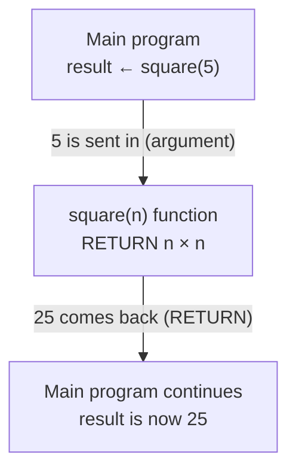
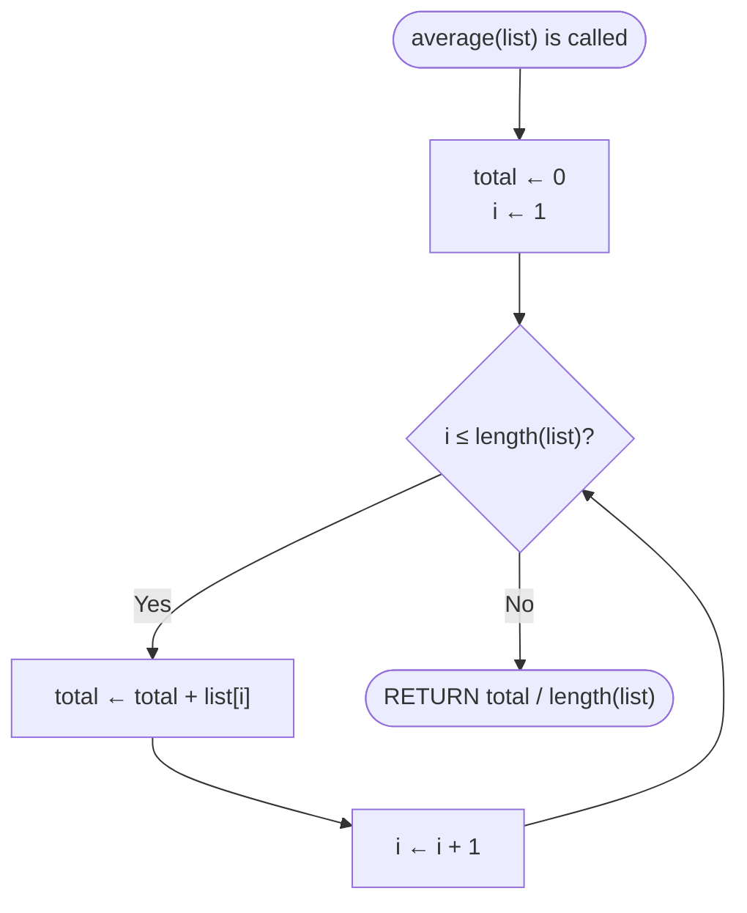
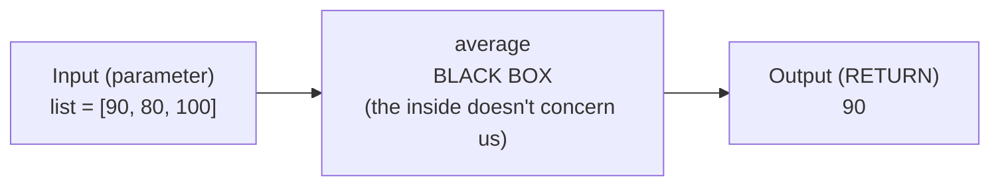

import Callout from '../../components/Callout.astro';
import Steps from '../../components/Steps.astro';

[In the previous post](/en/blog/lists) we learned lists and did something nice: we found the
**average** of a list — walked it with a loop, summed it, then divided by the number of
elements. Now imagine your program needs to compute that average in **five different places** —
in a student report, a class summary, a chart. Are you going to copy-paste that loop block five
times? And if you later find a bug — will you fix it in all five?

There's a better way: give that group of steps a **name,** write it **once,** and just say its
name when you need it. This named, reusable group of steps is what we call a **function.** That
is what this post is about: defining a job once and calling it by name as many times as you
like. A function sits on top of everything we've learned so far (variables, conditionals, loops,
lists) and, for the first time, lets us break our programs into **tidy pieces.**

<Callout type="note" title="Where are we in this series?">
This is the eighth post in the **Algorithms** series. We [met algorithms](/en/blog/what-is-an-algorithm),
drew them as [flowcharts](/en/blog/flowcharts), wrote them as [pseudocode](/en/blog/pseudocode),
stored information with [variables](/en/blog/variables), decided with
[conditionals](/en/blog/conditionals), repeated with [loops](/en/blog/loops), and held piles of
data with [lists](/en/blog/lists). Until now our programs were always **one long list of steps.**
Functions let us break that long list into named, reusable pieces — a big turning point in
programming. And don't worry: still not a single line of real code, just pen, paper, and thinking.
</Callout>

## Why do we need functions?

Back to the problem from the start. Say you want to compute and print the grade average of two
separate classes. Let's deliberately write the average block from the
[lists post](/en/blog/lists) **twice,** so you can see the problem with your own eyes:

```text title="Without a function — copy the same block twice" showLineNumbers=false
# Class A
total ← 0
i ← 1
WHILE i ≤ length(A_grades) DO
    total ← total + A_grades[i]
    i ← i + 1
ENDWHILE
PRINT total / length(A_grades)

# Class B — the exact same steps, only the list name changed
total ← 0
i ← 1
WHILE i ≤ length(B_grades) DO
    total ← total + B_grades[i]
    i ← i + 1
ENDWHILE
PRINT total / length(B_grades)
```

We wrote the same eight lines twice — the only difference is the list name. There are three
problems. First, **repetition:** with a third and fourth class the code just grows and grows.
Second, **risk of bugs:** if tomorrow you say "I computed the average wrong, I should also
check for division by zero," you have to make that fix in **every copy** separately; miss one
and the program is right in one place and wrong in another. Third, **unreadability:** the code's
real intent ("take the average of two classes") gets lost in this repeated clutter.

In everyday life we don't fall into this trap. In a recipe you don't rewrite "make the sauce:
chop the onion, sauté it, add the paste…" from scratch every time; you describe **"the sauce"**
once, then just say "make the sauce." Giving a job a **name** and using that name — that's the
whole idea of a function.

## What is a function?

A function is **a name given to a group of steps.** You do two separate things:

<Steps>
1. **You define it** (once): You write the steps and give them a name. This does *not* run the
   steps — it just creates a recipe that sits ready.
2. **You call it** (as often as you like): You say that name and the steps run right then. Define
   once, call a hundred times.
</Steps>

Let's make this concrete. The simplest function just does a job, without taking or giving any
information. In pseudocode we open a function with `FUNCTION`, write the steps **indented**
below, and close it with `ENDFUNCTION` — a closing much like `ENDIF` from
[conditionals](/en/blog/conditionals) or `ENDWHILE` from [loops](/en/blog/loops):

```text title="The simplest function: greet" showLineNumbers=false
FUNCTION greet
    PRINT "Hello!"
    PRINT "How are you today?"
ENDFUNCTION

greet        (call it — the two lines run)
greet        (call it again — they run again)
```

Notice: writing everything between `FUNCTION greet … ENDFUNCTION` prints **nothing** to the
screen. That's just the definition. The thing that prints "Hello!" is the `greet` **calls**
below. We called it twice, it greeted twice. We wrote it once, used it as often as we wanted.

<Callout type="important" title="Defining ≠ calling">
Let this distinction sink in from the start: **defining** a function is writing the recipe and
setting it aside — no step runs. **Calling** it is applying that recipe right then. If you
define a function but never call it, nothing happens; just like writing a recipe but never
cooking it. A common beginner snag: writing the function and asking "why didn't it run?" Because
you didn't **call** it.
</Callout>

## Input: giving a function information (parameters)

`greet` says the same thing every time. But often we want a function to behave **differently
depending on the situation:** to greet everyone by name. For that we give the function an
**input.** Think of a juicer: whatever fruit you put in, it gives back that fruit's juice. A
function is like that — you put a value in, it works with that value.

We give the input a **placeholder name** inside the definition; this is called a **parameter.**
When calling, we put a real value in place of that placeholder; this is called an **argument:**

```text title="A function with input: a personal greeting" showLineNumbers=false
FUNCTION greet(name)
    PRINT "Hello, " + name + "!"
ENDFUNCTION

greet("Ada")     → Hello, Ada!
greet("Can")     → Hello, Can!
```

The `+` here is the **text concatenation** you know from the [variables post](/en/blog/variables).
The `name` in the definition is a parameter — waiting like an empty box. When you say
`greet("Ada")`, the argument `"Ada"` goes into that box and the function uses "Ada" everywhere
it sees `name`. On the next call, "Can" goes into the box. The same function does a different
job with different input.

<Callout type="note" title="Parameter or argument? A simple distinction">
The two are easily confused but the difference is clear. A **parameter** is the placeholder name
written in the definition (`name`) — like "an onion" in a recipe. An **argument** is the real
value you pass when calling (`"Ada"`) — like the onion in your hand. A parameter is written
**once** in the definition and stays the same; an argument can **change on every call.** A
function can take several inputs, too; then you separate the parameters with commas:
`FUNCTION add(a, b)`.
</Callout>

## Output: getting a result from a function (RETURN)

Our functions so far did a job but gave back no **result.** Yet often we want a function to
**compute something and hand it back to us** — like a calculator that gives the answer and
waits. A function handing back a result is called `RETURN`:

```text title="A function that gives output: the square of a number" showLineNumbers=false
FUNCTION square(n)
    RETURN n × n
ENDFUNCTION

result ← square(5)   (square(5) returns 25; that 25 goes into result)
PRINT result         → 25
```

The `square(5)` call runs, computes `5 × 5 = 25`, and with `RETURN` **hands 25 back to the
caller.** Notice we can put that returned 25 into a variable (`result`) — this is where a
function's power lies. Now `square` is like a tool that produces numbers; you can put its output
wherever you like: `PRINT square(3)`, `area ← square(side)`, even `square(square(2))` (the
square of the square of 2 = 16).

You can picture what happens in a function call like this: the main program **pauses** for a
moment and sends the argument to the function; the function does its job and hands the result
back with `RETURN`; the main program takes that result and continues where it left off:



Notice the arrow **going into** the function and **coming back** with a value — a call hands the
program's flow to the function for a moment, and `RETURN` brings the result back. Here we reach
the point beginners **confuse most often:**

<Callout type="important" title="RETURN is not the same as PRINT">
Both look like "give the result," but they're completely different. **`PRINT`** puts a value
**on the screen** — a human sees it, but the program can no longer do anything with that value;
it was printed and it's gone. **`RETURN`** hands the result **to the caller** — you can put it
in a variable, feed it into an operation, pass it to another function. In short: `PRINT` is for
**showing,** `RETURN` is for **letting it be used.** If `square` wrote `PRINT n × n` instead of
`RETURN n × n`, you'd see 25 on screen but the line `result ← square(5)` couldn't put a usable
value into `result`. If you'll use a result later, **RETURN** it; if you'll only show it, **PRINT.**
</Callout>

<Callout type="caution" title="Nothing after RETURN runs">
A small but important rule: the moment `RETURN` runs, the function **ends** and control goes back
to the caller. So any steps you write **below** the `RETURN` line never run. Finish everything
you need to do **above** the `RETURN`, before handing the result back.
</Callout>

## Input and output together: a real function

Now let's put the pieces together and solve the problem from the start of this post. Let's turn
the average block from [lists](/en/blog/lists) into a real function that **takes an input** (a
list) and **returns an output** (the average):

```text title="A reusable average function" showLineNumbers=false
FUNCTION average(list)
    total ← 0
    i ← 1
    WHILE i ≤ length(list) DO
        total ← total + list[i]
        i ← i + 1
    ENDWHILE
    RETURN total / length(list)
ENDFUNCTION

PRINT average(A_grades)      (Class A's average)
PRINT average(B_grades)      (Class B's average)
PRINT average([100, 90, 80]) (you can call it with a ready list too → 90)
```

Look how that two-copy, long block from the start of the post melted away: we wrote the average
logic **once,** then just **called** it for three different lists. If tomorrow you say "let me
check for division by zero," you make the fix in one place — inside the function — and **all**
the calls fix themselves. That's exactly what functions promised.

Notice how everything we've learned in this series works together inside: a
[list](/en/blog/lists) parameter, a [loop](/en/blog/loops), an [accumulator](/en/blog/loops)
(`total`), a [variable](/en/blog/variables) (`i`), and finally a `RETURN`. The function hides all
these pieces behind a single name.

In fact, the inside of a function is an **algorithm** with two defined ends, just like the ones
we've drawn in this series: it **enters** with parameters and **exits** with `RETURN`. If we draw
the steps inside `average` as a [flowchart](/en/blog/flowcharts), we get the familiar diagram
from the [loops post](/en/blog/loops), now wrapped inside a function's boundaries:



The rounded box at the top is where the function is **called** (starts); the box at the bottom is
where it hands back the result and **exits** — `RETURN` is the function's version of an
algorithm's "Done" end. A function is nothing more than a named algorithm with two defined ends
like this.

## Think of a function as a "black box"

Now we reach the real magic of functions. When you **call** the `average` above, did you think
about whether there's a loop inside, how it sums? You don't need to. When you write
`average(A_grades)`, all you know is: **you give a list, you get back an average.** The inside is
a **black box** to you — you know what goes in and what comes out, you don't need to know how it
works inside.



Whether there's a loop inside the middle box or some other method makes no difference from the
outside; you just give the input on the left and take the output on the right. This is something
you do everywhere in life:

- **A TV remote:** you press a button, the channel changes. You don't need to know the infrared
  signal, the circuits inside.
- **A microwave:** you put the food in, set the time, press start. You don't deal with what
  happens inside.
- **A tap:** you turn it, water comes. You don't think about which pipes and which pump it came
  through.

<Callout type="important" title="Abstraction: hiding complexity">
A function hiding its inner complexity behind a name and offering the outside a simple "what you
give, what you get" interface is called **abstraction.** It's one of the most powerful ideas in
programming: you break a big program into small functions, each a black box; then you combine
these boxes by their names, without thinking about their insides. This way you only need to think
about one small piece at a time — you don't have to hold the whole program in your head at once.
Complex software can only be written because it's split this way, into pieces the human mind can
handle.
</Callout>

## A function's inside is its own: local variables

Inside the `average` function we used two variables, `total` and `i`. Do these names exist
**outside** the function too? No. Variables defined inside a function live only **there;** they
disappear when the function ends and can't be seen from outside. These are called **local
variables;** they're like a function's own private scratchpad.

Why is this a good thing? Because two different functions can use the same name without clashing
at all. `average` has an `i` inside it; another function can have an `i` too; they're entirely
different boxes, neither overwrites the other. Each function works comfortably in its own corner,
with its own variables.

<Callout type="note" title="Scope: where is a variable valid?">
The region where a variable is "visible/valid" is called its **scope.** A local variable defined
inside a function has a scope of that function's inside — the outside can't see it. That's why if
you try to print `total` from `average` outside the function with `PRINT total`, you get an
error: there's no such box out there. A function has only one proper way to tell the outside
something: **hand it back with `RETURN`.** Local variables stay inside; the result leaves via
`RETURN`.
</Callout>

## A function calls a function

Functions have one more beauty: from inside one function you can **call another function.** You
build bigger jobs by combining small pieces. For example, let's produce both the average and a
"did they pass?" result from a student's grades; the second uses the first:

```text title="A function inside a function" showLineNumbers=false
FUNCTION passed(list)
    avg ← average(list)          (calling the function we defined above)
    IF avg ≥ 50 THEN
        RETURN true
    ELSE
        RETURN false
    ENDIF
ENDFUNCTION

PRINT passed([70, 40, 55])    → true   (average is 55, passed)
```

`passed` doesn't compute the average itself — it **delegates** that job to the `average`
function that knows how, evaluates the returned result with a [conditional](/en/blog/conditionals),
and returns `true`/`false` (a [boolean](/en/blog/variables)). This is how you build big jobs from
small, single-purpose pieces. Note: a function like `passed` that returns `true`/`false` can be
seen as "a function that asks a yes/no question" — like `isEven`, `isEmpty`, `isValid`.

<Callout type="tip" title="You've been using functions all along">
Did you notice: we've been calling functions since the very start of this series! The
`length(list)` from [lists](/en/blog/lists) is a function — you give it a list, it returns a
number (a perfect black box: you never thought about how it counts inside). `PRINT`, which writes
to the screen, is a function too. You **didn't write** these; the language gave them to you
ready-made. Now you're learning to write your own functions.
</Callout>

## Built-in functions: don't reinvent the wheel

As the tip above hinted, every programming language comes with pre-written functions for common
jobs: printing to the screen, getting a list's length, computing a square root, converting text
to uppercase… These are called **built-in** functions, and collectively a **library.** The goal
is simple: **don't reinvent the wheel.** You don't write a square-root algorithm from scratch
every time; you call the ready-made function the language gives you and focus on your real work.

Real programming is largely this: combining functions — some you wrote, some ready-made — by
their names, building bigger jobs layer by layer. Each function is a brick; the program is the
building you make from those bricks.

## Common mistakes

<Callout type="caution" title="Watch out for these traps">
- **Defining but not calling:** writing a function doesn't run it. "Why did nothing happen?" —
  because you didn't **call** it. The definition sits ready; the call is what starts the work.
- **Confusing PRINT with RETURN:** if you'll use the result later you need `RETURN`. If a function
  does a `PRINT` inside and returns nothing, the line `result ← function(...)` leaves you no
  usable value.
- **Writing code after RETURN:** once `RETURN` runs the function ends instantly; the lines below
  it never run.
- **Getting the number/order of arguments wrong:** if `divide(a, b)` expects two inputs, calling
  it with one, or in the wrong order, gives a wrong result. `divide(10, 2)` and `divide(2, 10)`
  are not the same.
- **Trying to use a local variable outside:** the `total` inside a function doesn't exist
  outside. The way to carry something out is `RETURN`.
- **Loading one function with too much:** a good function does **one job** well. If you can name
  it clearly (`average`, `passed`) you're on track; if the name grows into
  "processDataAndPrintAndCheck", you probably need to split it into a few small functions.
</Callout>

<Callout type="note" title="A little history note: the invention of naming a job">
The idea of naming a group of steps and calling it over and over goes back to the earliest days
of computers. In the late 1940s at Cambridge, a young mathematician named **David Wheeler,**
working on one of the first working computers, **EDSAC,** found a way to write a job once and
call it from anywhere in the program; the idea is still known by his name today — the **"Wheeler
Jump"** — and is considered the ancestor of the function, the **subroutine.** In those same
years the American mathematician **Grace Hopper** wrote the first **compiler,** which
automated combining these ready-made pieces by name, and gave the name **"library"** — a word we
still use — to the collections of commonly used subroutines she gathered together. So when you
write `average(list)` and call a function today, you're using the idea those pioneers had seventy
years ago: "name a job, then call it." (Like the Fortran and Dijkstra of [the previous
post](/en/blog/lists), or the Ada Lovelace of [loops](/en/blog/loops), every basic idea has a
story like this.)
</Callout>

## Try it yourself

Pen and paper are enough. For each exercise, first **define** the function (`FUNCTION …
ENDFUNCTION`), then **call** it with a few different arguments and trace the result on paper.
Don't forget the distinction between input (parameter) and output (`RETURN`).

### Exercise 1 — Return the larger one (easy)

> Write a `larger(a, b)` function that takes two numbers and **returns the larger one.** Then
> call it with `larger(3, 9)` and `larger(12, 7)` and print the results.

<Callout type="note" title="Hint">
Two **parameters** (`a`, `b`) and one **RETURN.** Inside the function, set up a
[conditional](/en/blog/conditionals): `IF a > b THEN RETURN a ELSE RETURN b ENDIF`. Note: here you
use `RETURN`, not `PRINT` — because the caller will do the printing. The call `larger(3, 9)`
should return 9.
</Callout>

### Exercise 2 — Is it even? (medium)

> Write an `isEven(n)` function that takes a number and **returns** `true` if it's even, `false`
> if it's odd. Try it with `isEven(4)` and `isEven(7)`.

<Callout type="note" title="Hint">
Recall `MOD` from the [conditionals post](/en/blog/conditionals): if `n MOD 2 = 0` the number is
even. This is a "function that asks a yes/no question": inside it, `IF n MOD 2 = 0 THEN RETURN
true ELSE RETURN false ENDIF`. You're returning a [boolean](/en/blog/variables) (`true`/`false`).
Bonus: notice you can call this function inside an `IF isEven(n) THEN …`.
</Callout>

### Exercise 3 — A function that sums a list (medium)

> Write a `sum(list)` function that takes a number list and **returns the sum** of its elements.
> Then call it with two different lists: `sum([10, 20, 30])` and `sum([5, 5, 5, 5])`.

<Callout type="note" title="Hint">
This is the plainer sibling of the `average` function from the post. Inside, [walk the list with
a loop](/en/blog/lists) and [accumulate](/en/blog/loops): set up `total ← 0` before the loop, say
`total ← total + list[i]` on each pass, and finally `RETURN total`. `total` and `i` are **local**
variables — they don't clash between calls. (Answers: 60 and 20.)
</Callout>

### Exercise 4 — Report card: combine functions (mini project)

> Write an `average(list)` function (use the one from the post) and a `highest(list)` function
> (returns the biggest element). Then, for a list `grades ← [65, 90, 78, 55]`, **call both** and
> print a report card in the form "Average: … , Highest: …".

<Callout type="note" title="Hint">
For `highest`, wrap the "find the maximum" pattern from [lists](/en/blog/lists) into a function:
start with `biggest ← list[1]`, walk the list, update when you see a bigger one, finally `RETURN
biggest`. Then in the main program call both: `PRINT "Average: " + average(grades)` and `PRINT
"Highest: " + highest(grades)`. As you see, the code that produces the report card is now just
**two clear calls** — all the complexity sits inside the functions, as black boxes. (Answers:
average 72, highest 90.)
</Callout>

## Summary

<Callout type="tip" title="Put it in your pocket">
- A **function** is a name given to a group of steps: you **define it once** and **call it again
  and again** by name. It avoids repetition, breaks up complexity, and hides detail.
- **Defining ≠ calling.** A definition is a recipe sitting ready; what runs the steps is the call.
- **Input (parameters)** give the function information; the placeholder in the definition (the
  parameter) and the real value passed in the call (the argument) are different things.
- **Output (`RETURN`)** hands the result back to the caller. `RETURN` lets the result **be used;**
  `PRINT` only **shows** it — don't confuse the two.
- A function is a **black box:** to use it you don't need to know its inside, only what you give
  and get. This idea of hiding complexity is called **abstraction.**
- A function's **local variables** live only inside it (**scope**); the way to carry something
  out is `RETURN`.
- Functions can **call other functions;** both the ones you write and the language's built-in
  (`length`, `PRINT`) **library** functions are small bricks — the program is the building you
  make from them.
</Callout>
