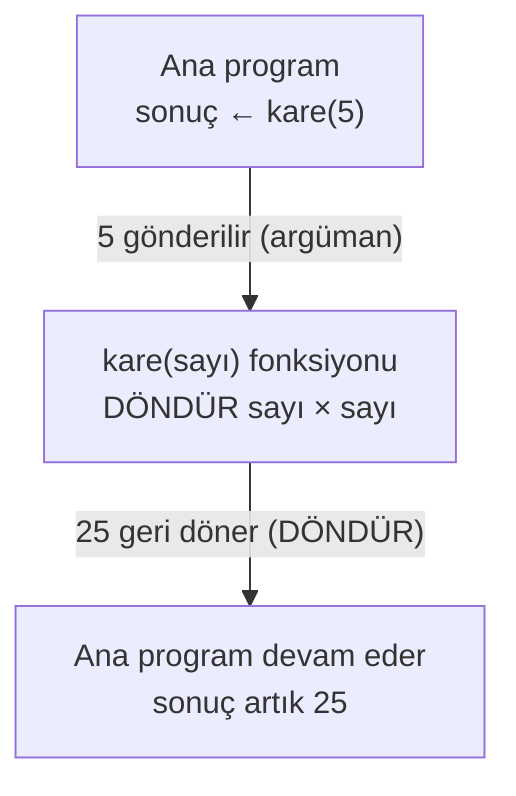
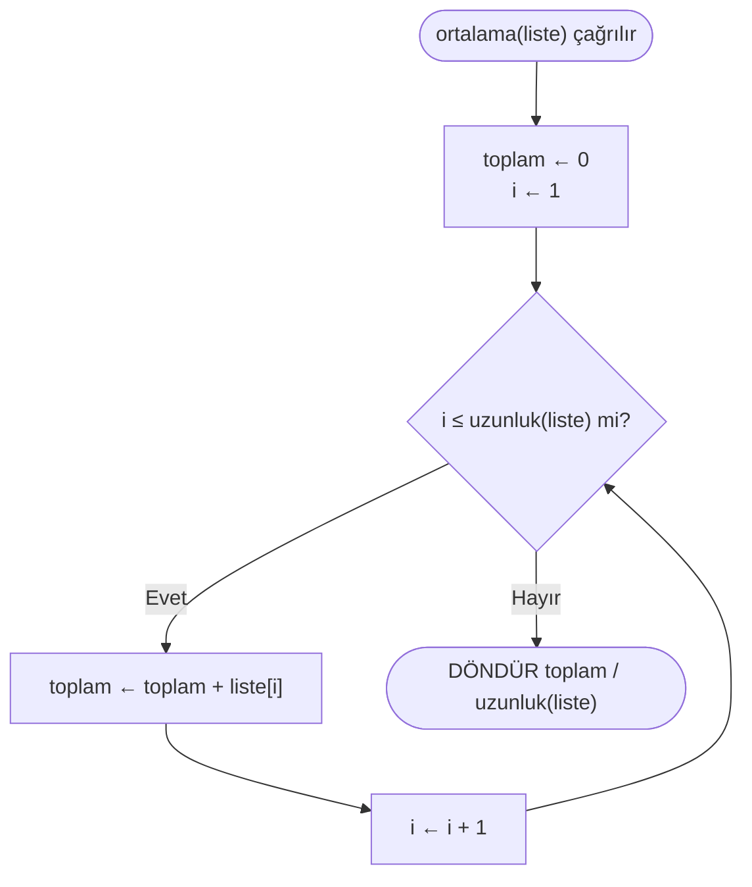
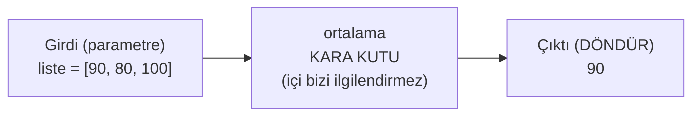

import Callout from '../../components/Callout.astro';
import Steps from '../../components/Steps.astro';

[Önceki yazıda](/blog/listeler) listeleri öğrendik ve güzel bir şey yaptık: bir listenin
**ortalamasını** bulduk — döngüyle gezip topladık, sonra eleman sayısına böldük. Şimdi
hayal et: programın bu ortalamayı **beş ayrı yerde** hesaplasın — bir öğrenci karnesinde,
bir sınıf özetinde, bir grafikte. O döngülü bloğu beş kez kopyalayıp yapıştıracak mısın?
Ya sonradan bir hata bulursan — hepsini tek tek mi düzelteceksin?

Daha iyi bir yol var: o adım grubuna bir **isim** ver, **bir kez** yaz ve gerektiğinde sadece
adını söyle. İşte bu adlı, tekrar tekrar kullanılabilen adım grubuna **fonksiyon** diyoruz.
Bu yazının konusu bu: bir işi bir kez tanımlayıp, adıyla dilediğin kadar çağırmak. Fonksiyon,
şimdiye kadar öğrendiğimiz her şeyin (değişken, koşul, döngü, liste) üstüne oturan ve
programlarımızı ilk kez **derli toplu parçalara** bölmemizi sağlayan fikir.

<Callout type="note" title="Bu seride neredeyiz?">
Bu, **Algoritmalar** serisinin sekizinci yazısı. [Algoritmayı tanıdık](/blog/algoritma-nedir),
[akış şemasıyla](/blog/akis-semalari) çizdik, [sözde kodla](/blog/sozde-kod) yazdık,
[değişkenlerle](/blog/degiskenler) bilgiyi sakladık, [koşullarla](/blog/kosullar) karar verdik,
[döngülerle](/blog/donguler) tekrar ettik ve [listelerle](/blog/listeler) veri yığınlarını
tuttuk. Şimdiye kadar programlarımız hep **tek bir uzun adım listesiydi.** Fonksiyon, o uzun
listeyi adlı, yeniden kullanılabilir parçalara bölmemizi sağlıyor — programlamada büyük bir
dönüm noktası. Ve merak etme: hâlâ tek satır gerçek kod yok, sadece kalem, kâğıt ve düşünce.
</Callout>

## Neden fonksiyona ihtiyacımız var?

En baştaki soruna dönelim. Diyelim ki iki ayrı sınıfın not ortalamasını hesaplayıp yazdırmak
istiyorsun. [Listeler yazısındaki](/blog/listeler) ortalama bloğunu bilerek **iki kez**
yazalım ki sorunu gözünle gör:

```text title="Fonksiyonsuz — aynı bloğu iki kez kopyala" showLineNumbers=false
# A sınıfı
toplam ← 0
i ← 1
ZAMAN i ≤ uzunluk(A_notları) DOĞRU İKEN
    toplam ← toplam + A_notları[i]
    i ← i + 1
DÖNGÜ SONU
YAZ toplam / uzunluk(A_notları)

# B sınıfı — birebir aynı adımlar, sadece liste adı değişti
toplam ← 0
i ← 1
ZAMAN i ≤ uzunluk(B_notları) DOĞRU İKEN
    toplam ← toplam + B_notları[i]
    i ← i + 1
DÖNGÜ SONU
YAZ toplam / uzunluk(B_notları)
```

Aynı sekiz satırı iki kez yazdık — tek fark liste adı. Üç sıkıntı var. Birincisi **tekrar:**
Üçüncü, dördüncü sınıf gelince kod uzadıkça uzar. İkincisi **hata riski:** Yarın "ortalamayı
yanlış hesaplamışım, sıfıra bölünmeyi de kontrol etmeliyim" dersen, bu düzeltmeyi **her
kopyada** ayrı ayrı yapman gerekir; birini unutursan program bir yerde doğru, bir yerde yanlış
çalışır. Üçüncüsü **okunmazlık:** Kodun asıl niyeti ("iki sınıfın ortalamasını al") bu tekrar
eden kalabalığın içinde kayboluyor.

Günlük hayatta bu tuzağa düşmeyiz. Bir yemek tarifinde her seferinde "sosu şöyle hazırla:
soğanı doğra, kavur, salçayı ekle…" diye baştan yazmazsın; bir kez **"sos"** diye tarif eder,
sonra "sosu hazırla" dersin. Bir işe bir **ad** verip o adı kullanmak — fonksiyonun tüm fikri
budur.

## Fonksiyon nedir?

Bir fonksiyon, **bir grup adıma verilmiş bir isimdir.** İki ayrı iş yaparsın:

<Steps>
1. **Tanımlarsın** (bir kez): Adımları yazıp onlara bir ad verirsin. Bu, adımları
   *çalıştırmaz* — sadece "hazır bekleyen" bir tarif oluşturur.
2. **Çağırırsın** (istediğin kadar): O ismi söylersin ve adımlar tam o an çalışır. Bir kez
   tanımla, yüz kez çağır.
</Steps>

Bunu somutlaştıralım. En basit fonksiyon, hiçbir bilgi alıp vermeden sadece bir iş yapar.
Sözde kodda bir fonksiyonu `FONKSIYON` ile açar, adımları **içeri girintili** yazar ve
`FONKSIYON SONU` ile kapatırız — tıpkı [koşullardaki](/blog/kosullar) `BİTİREĞER` ya da
[döngülerdeki](/blog/donguler) `DÖNGÜ SONU` gibi bir kapanış:

```text title="En basit fonksiyon: selam ver" showLineNumbers=false
FONKSIYON selamVer
    YAZ "Merhaba!"
    YAZ "Bugün nasılsın?"
FONKSIYON SONU

selamVer        (çağır — iki satır çalışır)
selamVer        (tekrar çağır — yine çalışır)
```

Dikkat et: `FONKSIYON selamVer … FONKSIYON SONU` arasını yazmak, ekrana **hiçbir şey basmaz.**
Orası sadece tanım. Ekrana "Merhaba!" yazdıran şey, aşağıdaki `selamVer` **çağrılarıdır.** İki
kez çağırdık, iki kez selam verdi. Bir kez yazdık, istediğimiz kadar kullandık.

<Callout type="important" title="Tanımlamak ≠ çağırmak">
Bu ayrımı en baştan içine sindir: bir fonksiyonu **tanımlamak,** tarifi yazıp bir kenara
koymaktır — hiçbir adım çalışmaz. **Çağırmak** ise o tarifi o an uygulamaktır. Bir fonksiyonu
tanımlayıp hiç çağırmazsan, hiçbir şey olmaz; tıpkı bir yemek tarifini yazıp hiç pişirmemek
gibi. Yeni başlayanların sık takıldığı yer: fonksiyonu yazıp "neden çalışmadı?" diye sormak.
Çünkü onu **çağırmadın.**
</Callout>

## Girdi: fonksiyona bilgi vermek (parametre)

`selamVer` her seferinde aynı şeyi diyor. Ama çoğu zaman fonksiyonun **duruma göre** farklı
davranmasını isteriz: herkese ismiyle selam versin. Bunun için fonksiyona **girdi** veririz.
Bir meyve sıkacağını düşün: içine ne koyarsan onun suyunu verir. Fonksiyon da böyle — içine
bir değer koyarsın, o değerle çalışır.

Fonksiyonun alacağı girdiye, tanımın içinde bir **yer tutucu isim** veririz; buna **parametre**
denir. Çağırırken o yer tutucunun yerine gerçek bir değer koyarız; buna da **argüman** denir:

```text title="Girdili fonksiyon: isme özel selam" showLineNumbers=false
FONKSIYON selamVer(isim)
    YAZ "Merhaba, " + isim + "!"
FONKSIYON SONU

selamVer("Ada")     → Merhaba, Ada!
selamVer("Can")     → Merhaba, Can!
```

Buradaki `+`, [değişkenler yazısından](/blog/degiskenler) tanıdığın **metin birleştirme.**
Tanımdaki `isim` bir parametre — boş bir kutu gibi bekliyor. `selamVer("Ada")` dediğinde `"Ada"`
argümanı o kutuya girer ve fonksiyon `isim` gördüğü her yerde "Ada"yı kullanır. Bir sonraki
çağrıda kutuya "Can" girer. Aynı fonksiyon, farklı girdiyle farklı iş yapar.

<Callout type="note" title="Parametre mi, argüman mı? Basit ayrım">
İkisi kolayca karışır ama farkı nettir. **Parametre,** tanımda yazan yer tutucu isimdir
(`isim`) — tarifteki "bir soğan" gibi. **Argüman,** çağırırken verdiğin gerçek değerdir
(`"Ada"`) — elindeki o soğan gibi. Parametre tanımda **bir kez** yazılır ve hep aynı kalır;
argüman **her çağrıda** değişebilir. Bir fonksiyon birden çok girdi de alabilir; o zaman
parametreleri virgülle ayırırsın: `FONKSIYON topla(a, b)`.
</Callout>

## Çıktı: fonksiyondan sonuç almak (DÖNDÜR)

Şimdiye kadarki fonksiyonlarımız iş yaptı ama geriye bir **sonuç** vermedi. Oysa çoğu zaman
fonksiyonun bir şey **hesaplayıp bize geri vermesini** isteriz — bir hesap makinesinin cevabı
ekrana verip beklemesi gibi. Bir fonksiyonun sonucu geri vermesine `DÖNDÜR` diyoruz:

```text title="Çıktı veren fonksiyon: bir sayının karesi" showLineNumbers=false
FONKSIYON kare(sayı)
    DÖNDÜR sayı × sayı
FONKSIYON SONU

sonuç ← kare(5)     (kare(5), 25'i döndürür; o 25 sonuç'a girer)
YAZ sonuç           → 25
```

`kare(5)` çağrısı çalışır, `5 × 5 = 25` hesaplar ve `DÖNDÜR` ile **25'i çağırana geri verir.**
O geri verilen 25'i bir değişkene (`sonuç`) koyabildiğimize dikkat et — işte fonksiyonun gücü
burada. Artık `kare`, sayı üreten bir araç gibi; çıktısını istediğin yere koyabilirsin:
`YAZ kare(3)`, `alan ← kare(kenar)`, hatta `kare(kare(2))` (2'nin karesinin karesi = 16).

Bir fonksiyon çağrısında olup biteni şöyle canlandırabilirsin: ana program bir an **durur,**
argümanı fonksiyona yollar; fonksiyon işini yapıp sonucu `DÖNDÜR` ile geri verir; ana program
da o sonucu alıp kaldığı yerden devam eder:



Okun fonksiyona **girip** bir değerle geri **döndüğüne** dikkat et — çağrı, programın akışını
bir an fonksiyona verir, `DÖNDÜR` de sonucu alıp geri getirir. Burada, yeni başlayanların
**en sık karıştırdığı** noktaya geldik:

<Callout type="important" title="DÖNDÜR ile YAZ aynı şey değildir">
İkisi de "sonucu ver" gibi görünür ama bambaşkadır. **`YAZ`** bir değeri **ekrana basar** —
insan görür, ama program o değerle artık bir şey yapamaz; ekrana yazıldı, uçtu gitti. **`DÖNDÜR`**
ise sonucu **çağırana teslim eder** — sen onu bir değişkene koyabilir, bir işleme sokabilir,
başka bir fonksiyona verebilirsin. Kısaca: `YAZ` **göstermek,** `DÖNDÜR` **kullandırmak** içindir.
Eğer `kare` fonksiyonu `DÖNDÜR sayı × sayı` yerine `YAZ sayı × sayı` yazsaydı, ekranda 25'i
görürdün ama `sonuç ← kare(5)` satırı `sonuç`a hiçbir işe yarar değer koyamazdı. Bir sonucu
sonradan kullanacaksan **DÖNDÜR;** sadece göstereceksen **YAZ.**
</Callout>

<Callout type="caution" title="DÖNDÜR'den sonrası çalışmaz">
Küçük ama önemli bir kural: `DÖNDÜR` çalıştığı an fonksiyon **biter** ve çağırana geri döner.
Yani `DÖNDÜR` satırının **altına** yazdığın adımlar hiç çalışmaz. Sonucu döndürmeden önce
yapman gereken her şeyi `DÖNDÜR`'ün **üstünde** bitir.
</Callout>

## Girdi ve çıktı birlikte: gerçek bir fonksiyon

Şimdi parçaları birleştirip yazının başındaki sorunu çözelim. [Listelerdeki](/blog/listeler)
ortalama bloğunu, bir **girdi alan** (liste) ve bir **çıktı döndüren** (ortalama) gerçek bir
fonksiyona dönüştürelim:

```text title="Yeniden kullanılabilir ortalama fonksiyonu" showLineNumbers=false
FONKSIYON ortalama(liste)
    toplam ← 0
    i ← 1
    ZAMAN i ≤ uzunluk(liste) DOĞRU İKEN
        toplam ← toplam + liste[i]
        i ← i + 1
    DÖNGÜ SONU
    DÖNDÜR toplam / uzunluk(liste)
FONKSIYON SONU

YAZ ortalama(A_notları)     (A sınıfının ortalaması)
YAZ ortalama(B_notları)     (B sınıfının ortalaması)
YAZ ortalama([100, 90, 80]) (hazır bir listeyle de çağırabilirsin → 90)
```

Bak, yazının başındaki o iki kopyalı, upuzun kod nasıl da eridi: ortalama mantığını **bir kez**
yazdık, sonra üç farklı liste için sadece **çağırdık.** Yarın "sıfıra bölünmeyi kontrol edeyim"
dersen, düzeltmeyi tek bir yerde — fonksiyonun içinde — yaparsın ve **bütün** çağrılar
kendiliğinden düzelir. İşte fonksiyonların vaat ettiği şey buydu.

İçeride, bu seride öğrendiğimiz her şeyin bir arada çalıştığına dikkat et: bir [liste](/blog/listeler)
parametresi, bir [döngü](/blog/donguler), bir [biriktirici](/blog/donguler) (`toplam`), bir
[değişken](/blog/degiskenler) (`i`) ve sonunda bir `DÖNDÜR`. Fonksiyon, bütün bu parçaları tek
bir adın arkasına saklıyor.

Aslında bir fonksiyonun içi, tıpkı bu seride çizdiğimiz gibi iki ucu belli bir **algoritmadır:**
parametreyle **girer,** `DÖNDÜR` ile **çıkar.** `ortalama`nın içindeki adımları
[akış şemasıyla](/blog/akis-semalari) çizersek, [döngüler yazısındaki](/blog/donguler) o tanıdık
şemanın bir fonksiyonun sınırları içine alınmış hâlini görürüz:



Baştaki yuvarlak kutu, fonksiyonun **çağrıldığı** (başladığı) yer; sondaki kutu ise sonucu verip
fonksiyondan **çıktığı** yerdir — `DÖNDÜR`, bir algoritmanın "Bitti" ucunun fonksiyondaki
karşılığıdır. Bir fonksiyon, işte böyle iki ucu belli, adlandırılmış bir algoritmadan başka bir
şey değil.

## Fonksiyonu bir "kara kutu" gibi düşün

Şimdi fonksiyonların asıl büyüsüne geldik. Yukarıdaki `ortalama`yı **çağırırken,** içinde
döngü mü var, nasıl topluyor — bunları düşündün mü? Düşünmene gerek yok. `ortalama(A_notları)`
yazdığında, tek bildiğin şu: **bir liste veriyorsun, bir ortalama geri alıyorsun.** İçerisi
senin için bir **kara kutu** — ne girdiğini ve ne çıktığını bilirsin, içindeki işleyişi bilmen
gerekmez.



Ortadaki kutunun içinde döngü mü var, başka bir yöntem mi — dışarıdan bakınca hiç fark etmez;
sen yalnızca soldaki girdiyi verir, sağdaki çıktıyı alırsın. Bu, hayatının her yerinde yaptığın
bir şey:

- **Televizyon kumandası:** Düğmeye basarsın, kanal değişir. İçindeki kızılötesi sinyali,
  devreleri bilmene gerek yok.
- **Mikrodalga:** Yemeği koyar, süreyi girer, başlat dersin. İçeride ne olduğuyla uğraşmazsın.
- **Musluk:** Açarsın, su gelir. Suyun hangi borulardan, hangi pompayla geldiğini düşünmezsin.

<Callout type="important" title="Soyutlama: karmaşayı gizlemek">
Bir fonksiyonun içindeki karmaşayı bir adın arkasına saklayıp, dışarıya sade bir "ne verirsen
ne alırsın" arayüzü sunmasına **soyutlama** denir. Programlamanın en güçlü fikirlerinden biridir:
büyük bir programı, her biri birer kara kutu olan küçük fonksiyonlara bölersin; sonra bu kutuları
içlerini düşünmeden, isimleriyle birleştirirsin. Böylece aynı anda tek bir küçük parçayı
düşünmen yeter — koca programı bir bütün olarak kafanda tutman gerekmez. Karmaşık yazılımlar
ancak bu sayede, insan aklının kaldırabileceği parçalara bölünerek yazılabilir.
</Callout>

## Fonksiyonun içi kendine ait: yerel değişkenler

`ortalama` fonksiyonunun içinde `toplam` ve `i` diye iki değişken kullandık. Peki bu isimler,
fonksiyonun **dışında** da var mı? Hayır. Bir fonksiyonun içinde tanımlanan değişkenler yalnızca
**orada** yaşar; fonksiyon bitince yok olurlar ve dışarıdan görülmezler. Bunlara **yerel
değişken** denir; bir fonksiyonun kendine ait, özel karalama defteri gibidirler.

Bu neden iyi bir şey? Çünkü iki farklı fonksiyon, birbirine hiç karışmadan aynı ismi
kullanabilir. `ortalama`nın içinde bir `i` var; başka bir fonksiyonun içinde de bir `i` olabilir;
ikisi bambaşka kutulardır, birbirini ezmez. Her fonksiyon kendi köşesinde, kendi değişkenleriyle
rahatça çalışır.

<Callout type="note" title="Kapsam (scope): bir değişken nerede geçerli?">
Bir değişkenin "görülebildiği/geçerli olduğu" bölgeye onun **kapsamı** (scope) denir. Bir
fonksiyonun içinde tanımlanan yerel değişkenin kapsamı, o fonksiyonun içidir — dışarısı onu
göremez. Bu yüzden `ortalama`nın içindeki `toplam`ı, fonksiyonun dışında `YAZ toplam` diye
yazdırmaya kalkarsan hata alırsın: dışarıda öyle bir kutu yoktur. Fonksiyonun dışarıya bir şey
söylemesinin tek düzgün yolu vardır: onu **`DÖNDÜR` ile geri vermek.** Yerel değişkenler
içeride kalır; sonuç `DÖNDÜR` ile dışarı çıkar.
</Callout>

## Fonksiyon, fonksiyonu çağırır

Fonksiyonların bir güzelliği daha var: bir fonksiyonun içinden **başka bir fonksiyonu**
çağırabilirsin. Küçük parçaları birleştirerek daha büyük işler kurarsın. Örneğin bir öğrencinin
notlarından hem ortalamayı hem de "geçti mi?" bilgisini üretelim; ikincisi, ilkini kullansın:

```text title="Fonksiyon içinde fonksiyon" showLineNumbers=false
FONKSIYON geçtiMi(liste)
    ort ← ortalama(liste)        (yukarıda tanımladığımız fonksiyonu çağırıyoruz)
    EĞER ort ≥ 50 İSE
        DÖNDÜR doğru
    DEĞİLSE
        DÖNDÜR yanlış
    BİTİREĞER
FONKSIYON SONU

YAZ geçtiMi([70, 40, 55])    → doğru   (ortalama 55, geçti)
```

`geçtiMi`, ortalamayı kendisi hesaplamıyor — o işi bilen `ortalama` fonksiyonuna **havale
ediyor,** dönen sonucu bir [koşulla](/blog/kosullar) değerlendirip `doğru`/`yanlış`
([boolean](/blog/degiskenler)) döndürüyor. Küçük, tek işlik parçalardan büyük işler kurmanın
yolu budur. Not: `geçtiMi` gibi, geriye `doğru`/`yanlış` döndüren fonksiyonlara bazen "evet/hayır
sorusu soran fonksiyon" gözüyle bakabilirsin — `çiftMi`, `boşMu`, `geçerliMi` gibi.

<Callout type="tip" title="Aslında baştan beri fonksiyon kullanıyordun">
Fark ettin mi: bu seride en başından beri fonksiyon çağırıyorduk! [Listelerdeki](/blog/listeler)
`uzunluk(liste)` bir fonksiyondur — ona bir liste verirsin, sana bir sayı döndürür (tam bir
kara kutu: içinde nasıl saydığını hiç düşünmedin). Ekrana basan `YAZ` da bir fonksiyondur.
Bunları **sen yazmadın;** dil sana hazır verdi. Şimdi ise kendi fonksiyonlarını yazmayı
öğreniyorsun.
</Callout>

## Hazır fonksiyonlar: tekerleği yeniden icat etme

Yukarıdaki ipucunda değindiğimiz gibi, her programlama dili sık gereken işler için önceden
yazılmış fonksiyonlarla gelir: ekrana basmak, bir listenin uzunluğunu almak, karekök hesaplamak,
bir metni büyük harfe çevirmek… Bunlara **hazır** (yerleşik) fonksiyonlar, topluca da
**kütüphane** denir. Amaç basit: **tekerleği yeniden icat etme.** Karekök almak için her
seferinde sıfırdan bir algoritma yazmazsın; dilin sana verdiği hazır fonksiyonu çağırır, kendi
asıl işine odaklanırsın.

Gerçek programlama, büyük ölçüde budur: bir kısmı senin yazdığın, bir kısmı hazır gelen
fonksiyonları isimleriyle birleştirerek, katman katman daha büyük işler kurmak. Her fonksiyon
bir tuğla; program, bu tuğlalardan kurduğun bina.

## Sık yapılan hatalar

<Callout type="caution" title="Bu tuzaklara dikkat">
- **Tanımlayıp çağırmamak:** Fonksiyonu yazmak onu çalıştırmaz. "Neden bir şey olmadı?" — çünkü
  onu **çağırmadın.** Tanım hazır bekler; işi başlatan çağrıdır.
- **YAZ ile DÖNDÜR'ü karıştırmak:** Sonucu sonradan kullanacaksan `DÖNDÜR` gerekir. Fonksiyon
  içeride `YAZ` yapıp bir şey döndürmezse, `sonuç ← fonksiyon(...)` satırı elinde kullanılabilir
  bir değer bırakmaz.
- **DÖNDÜR'den sonra kod yazmak:** `DÖNDÜR` çalışınca fonksiyon anında biter; altındaki satırlar
  hiç çalışmaz.
- **Argüman sayısını/sırasını şaşırmak:** `bol(a, b)` iki girdi bekliyorsa, onu tek argümanla ya
  da sırası ters çağırmak yanlış sonuç verir. `böl(10, 2)` ile `böl(2, 10)` aynı şey değildir.
- **Yerel değişkeni dışarıda kullanmaya çalışmak:** Fonksiyonun içindeki `toplam`, dışarıda
  yoktur. Dışarıya bir şey taşımanın yolu `DÖNDÜR`'dür.
- **Bir fonksiyona çok iş yüklemek:** İyi bir fonksiyon **tek bir işi** iyi yapar. Adını net
  koyabiliyorsan (`ortalama`, `geçtiMi`) yolundasın; adı "veriyiİşleVeYazdırVeKontrolEt" gibi
  uzuyorsa, muhtemelen onu birkaç küçük fonksiyona bölmelisin.
</Callout>

<Callout type="note" title="Küçük bir tarih notu: işe ad vermenin icadı">
Bir grup adıma ad verip tekrar tekrar çağırma fikri, bilgisayarların ilk günlerine dayanır.
1940'ların sonunda Cambridge'de **EDSAC** adlı ilk çalışan bilgisayarlardan birini kullanan genç
matematikçi **David Wheeler,** bir işi bir kez yazıp programın her yerinden çağırmanın bir yolunu
buldu; bu fikir bugün bile onun adıyla — **"Wheeler sıçraması"** (Wheeler Jump) — anılır ve
**alt program** (subroutine), yani fonksiyonun atası kabul edilir. Aynı yıllarda Amerikalı
matematikçi **Grace Hopper,** bu hazır parçaları isimleriyle birleştirmeyi otomatikleştiren ilk
**derleyiciyi** yazdı ve sık kullanılan alt programları bir araya topladığı koleksiyonlara —
bugün hâlâ kullandığımız o kelimeyle — **"kütüphane"** adını verdi. Yani bugün `ortalama(liste)`
yazıp bir fonksiyonu çağırdığında, yetmiş yıl önce "işe ad ver, sonra çağır" diyen o
öncülerin fikrini kullanıyorsun. ([Bir önceki yazının](/blog/listeler) Fortran ve Dijkstra'sı,
[döngülerin](/blog/donguler) Ada Lovelace'ı gibi, her temel fikrin böyle bir hikâyesi var.)
</Callout>

## Kendin dene

Kalem ve kâğıt yeter. Her egzersizde önce fonksiyonu **tanımla** (`FONKSIYON … FONKSIYON SONU`),
sonra onu birkaç farklı argümanla **çağırıp** kâğıtta sonucu izle. Girdi (parametre) ve çıktı
(`DÖNDÜR`) ayrımını unutma.

### Egzersiz 1 — Büyük olanı döndür (kolay)

> İki sayı alan ve **büyük olanı döndüren** bir `buyukOlan(a, b)` fonksiyonu yaz. Sonra
> `buyukOlan(3, 9)` ve `buyukOlan(12, 7)` ile çağırıp sonuçlarını yazdır.

<Callout type="note" title="İpucu">
İki **parametre** (`a`, `b`) ve bir **DÖNDÜR** var. Fonksiyonun içinde bir [koşul](/blog/kosullar)
kur: `EĞER a > b İSE DÖNDÜR a DEĞİLSE DÖNDÜR b BİTİREĞER`. Dikkat: burada `YAZ` değil, `DÖNDÜR`
kullanıyorsun — çünkü sonucu çağıran taraf yazdıracak. `buyukOlan(3, 9)` çağrısı 9'u döndürmeli.
</Callout>

### Egzersiz 2 — Çift mi? (orta)

> Bir sayı alıp, o sayı çiftse `doğru`, tekse `yanlış` **döndüren** bir `çiftMi(sayı)`
> fonksiyonu yaz. `çiftMi(4)`, `çiftMi(7)` ile dene.

<Callout type="note" title="İpucu">
[Koşullar yazısındaki](/blog/kosullar) `MOD`'u hatırla: `sayı MOD 2 = 0` ise sayı çifttir. Bu
bir "evet/hayır sorusu soran" fonksiyon: içinde `EĞER sayı MOD 2 = 0 İSE DÖNDÜR doğru DEĞİLSE
DÖNDÜR yanlış BİTİREĞER`. Geriye [boolean](/blog/degiskenler) (`doğru`/`yanlış`) döndürüyorsun.
Bonus: bu fonksiyonu bir `EĞER çiftMi(sayı) İSE …` içinde çağırabildiğine dikkat et.
</Callout>

### Egzersiz 3 — Listeyi toplayan fonksiyon (orta)

> Bir sayı listesi alıp, elemanlarının **toplamını döndüren** bir `topla(liste)` fonksiyonu
> yaz. Sonra iki farklı listeyle çağır: `topla([10, 20, 30])` ve `topla([5, 5, 5, 5])`.

<Callout type="note" title="İpucu">
Bu, yazıdaki `ortalama` fonksiyonunun daha yalın kardeşi. İçeride [listeyi döngüyle gez](/blog/listeler)
ve [biriktir](/blog/donguler): `toplam ← 0`i döngüden önce kur, her turda `toplam ← toplam +
liste[i]` de, sonunda `DÖNDÜR toplam`. `toplam` ve `i` birer **yerel** değişkendir — çağrılar
arasında birbirine karışmaz. (Cevaplar: 60 ve 20.)
</Callout>

### Egzersiz 4 — Karne: fonksiyonları birleştir (mini proje)

> `ortalama(liste)` (yazıdakini kullan) ve `enYuksek(liste)` (en büyük elemanı döndüren)
> fonksiyonlarını yaz. Sonra bir `notlar ← [65, 90, 78, 55]` listesi için **her ikisini de
> çağırıp** "Ortalama: … , En yüksek: …" biçiminde bir karne yazdır.

<Callout type="note" title="İpucu">
`enYuksek` için [listelerdeki](/blog/listeler) "en yükseği bulma" kalıbını bir fonksiyona
sar: `enBüyük ← liste[1]` ile başla, listeyi gez, daha büyüğünü görünce güncelle, sonunda
`DÖNDÜR enBüyük`. Sonra ana programda ikisini de çağır: `YAZ "Ortalama: " + ortalama(notlar)`
ve `YAZ "En yüksek: " + enYuksek(notlar)`. Gördüğün gibi, karneyi üreten kod artık **iki net
çağrıdan** ibaret — bütün karmaşa fonksiyonların içinde, birer kara kutu olarak duruyor.
(Cevaplar: ortalama 72, en yüksek 90.)
</Callout>

## Özet

<Callout type="tip" title="Cebine koy">
- **Fonksiyon,** bir grup adıma verilmiş bir isimdir: **bir kez tanımlar,** adıyla **tekrar
  tekrar çağırırsın.** Tekrarı önler, karmaşayı böler, ayrıntıyı gizler.
- **Tanımlamak ≠ çağırmak.** Tanım, hazır bekleyen bir tariftir; adımları çalıştıran şey çağrıdır.
- **Girdi (parametre)** fonksiyona bilgi verir; tanımdaki yer tutucu (parametre) ile çağrıda
  verilen gerçek değer (argüman) farklı şeylerdir.
- **Çıktı (`DÖNDÜR`)** sonucu çağırana geri verir. `DÖNDÜR` sonucu **kullandırır,** `YAZ` sadece
  **gösterir** — ikisini karıştırma.
- Bir fonksiyon bir **kara kutudur:** onu kullanmak için içini bilmen gerekmez, sadece ne verip
  ne aldığını. Bu karmaşayı gizleme fikrine **soyutlama** denir.
- Fonksiyonun içindeki **yerel değişkenler** yalnızca orada yaşar (**kapsam**); dışarı bir şey
  taşımanın yolu `DÖNDÜR`'dür.
- Fonksiyonlar **başka fonksiyonları çağırabilir;** hem kendi yazdıkların hem de dilin hazır
  verdiği (`uzunluk`, `YAZ` gibi) **kütüphane** fonksiyonları küçük tuğlalardır — program, onlardan
  kurduğun binadır.
</Callout>
