import Callout from '../../components/Callout.astro';
import Steps from '../../components/Steps.astro';
import Figure from '../../components/Figure.astro';
import goslingImg from '../../assets/james-gosling.jpg';
import dukeImg from '../../assets/duke-mascot.png';
import sunLogo from '../../assets/sun-logo.png';

We're starting a new series. If you followed the [Algorithms series](/en/blog/what-is-an-algorithm),
you figured out how a computer "thinks" with pen and paper: variables, conditionals, loops, lists,
functions. Now it's time to pour those thoughts into a real language. And that language will be
**Java.**

But we won't rush. Before writing Java's first line, I want the answers to these questions: what
exactly is Java for? Where did it come from, who made it, why? How does a computer program actually
run? What are those 0s and 1s they call "binary"? What does **bytecode** look like? Which layers live
inside Java's beating heart, the **JVM,** and what do **JIT** and the **garbage collector** do? This
post is going to be long, because we'll go through all of it one piece at a time. If you're ready,
let's begin.

<Callout type="note" title="Who is this series for?">
This series is for anyone new to software, or anyone who wants to learn Java from scratch. You can
follow along even if you've never touched programming; but if the variable, loop, and function
concepts that come up feel a bit foreign, I'd recommend the
[Algorithms series](/en/blog/what-is-an-algorithm), which explains them from the very beginning. The
two series complement each other: one teaches you to think, this one teaches you to write that
thinking in Java.
</Callout>

## What exactly is Java for?

Think of it this way: Java is one of the languages we use to tell a computer what to do. You write it
a list of instructions (that is, a program), and it turns that into something the computer can
understand and run. So it's a kind of "middleman language." But why is it so famous, and where do we
run into it?

You've probably touched dozens of things written in Java today without even realizing it:

- **Android phones.** For many years, most Android apps were written in Java. There's Java under a lot
  of the apps in your pocket.
- **Banks and big companies.** Behind the scenes of the world's largest banks, insurance companies,
  and airline booking systems, Java is often what's running. It's known for being solid and reliable;
  that's why it's so loved in places that can't afford mistakes, like "money matters."
- **Enormous websites.** Important parts of systems that serve millions of people, like Netflix,
  LinkedIn, and Amazon, are written in Java (and its relatives).
- **Games.** The original version of Minecraft, the best-selling game in the world, was written in
  Java. (That's why it's called the "Java Edition.")
- **Embedded systems, IoT, and palm-sized devices.** Perhaps the most surprising part: Java runs not
  only on giant servers but also on tiny devices that fit in your hand. You can comfortably run Java
  on a **Raspberry Pi**, a cheap, credit-card-sized computer. Even more striking: the tiny chip
  inside your phone's **SIM card** and many **bank cards** runs a version of Java called "Java Card";
  that means **billions of cards** are quietly running Java. ATMs, smart meters, industrial sensors,
  old Blu-ray players... Java is inside a lot of them.

That this breadth is no accident you'll see in a moment: the team that created Java designed it
precisely **for small devices** (things like televisions and remote controls). Over the years Java
first became the language of huge systems, but then it also realized its original dream and returned
to those tiny devices. So how can one and the same language run both on a giant bank's server and on
a Raspberry Pi in your palm?

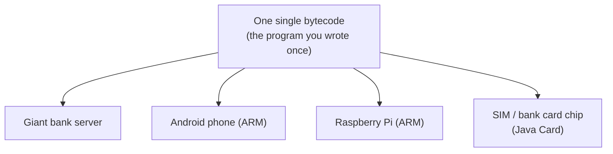

The answer is hidden in the **bytecode + JVM** duo you'll meet shortly in this post: you write the
program once, and each device's own JVM (whether it's a powerful server processor, or a phone's or
Raspberry Pi's **ARM** processor) translates it into that device's language. So when we say "runs
anywhere," we really mean *anywhere*: from the biggest to the smallest.

<Callout type="tip" title="So you can build almost anything with Java">
To sum up, Java isn't a language locked into a single field; with it you can write a phone app, a
website and server, a desktop program, a game, even embedded-device software. Each of these areas has
its own tools: **servlets** on the web and server side, **Swing** and JavaFX on the desktop,
**applets** in the browser's early days... We won't unpack these tools now; we'll meet each of them
in later parts of this series as the time comes. For now the only thing to keep in mind is this: once
you learn Java, a very wide world opens up in front of you, and once you've laid the foundation you
can go almost anywhere you want with this language.
</Callout>

In short, Java made a name for itself as the language of both "big, serious work" and "tiny devices."
It has a history of more than thirty years, yet it's still among the most in-demand, most used
languages.

<Callout type="important" title="Java and JavaScript get mixed up — but they're not related">
Let's head off a misunderstanding right from the start. **Java** and **JavaScript** get constantly
confused because their names look alike; but they are two completely different languages. The
relationship between them is about as close as the one between a "car" and a "carpet": just a name
resemblance. JavaScript mainly runs in the web browser; Java runs mostly on servers and on Android.
The name similarity is just a coincidence left over from a 1990s marketing fashion. In this series,
our subject is **Java.**
</Callout>

## First let's settle this: how does a computer actually work?

To understand how Java works, we need to go down one floor. Because the very reason Java exists is
hidden down on that lower floor.

The secret is surprisingly simple: **a computer is actually pretty dumb.** Sounds odd, I know. But
the truth is that on its own, a computer can only do very small, very simple things: add two numbers,
compare two values, take a piece of information from one place and put it in another. That's it. The
thing that makes it look "smart" is that it does these tiny jobs at an incredible speed, billions of
times a second.

Inside a computer there are, roughly, two important parts. One is the **processor** (CPU): the
computer's "brain" that does all those simple jobs. The other is the **memory** (RAM): where it
temporarily holds information while it works. Remember the "labeled box" example from the
[variables post](/en/blog/variables)? Those boxes physically live right here, in memory.

So what language does this processor speak? That's the key question.

## Binary: the computer's only real language

At the deepest level of a computer, everything happens with electricity. And for electricity, there's
only one question that matters: **is there a current or not?** Like whether a lightbulb is on or off.
The computer boils the whole world down to this single question.

We represent the "current on" state with **1** and the "current off" state with **0.** A system made
only of these two digits, 0 and 1, is called **binary.** We call each of these individual 0s and 1s a
**bit.** A bit is the smallest piece of information in a computer.

A single bit isn't much use on its own (it can only say "yes or no"). But line them up and things
change. When we bring eight bits together we get a **byte,** and with one byte we can already express
256 different things. (Keep this word "byte" in mind; it'll show up again soon in "bytecode.")

<Callout type="note" title="But letters, images? Are those 0s and 1s too?">
Yes, all of them. Since a computer knows nothing but 0 and 1, everything we want to show it is first
turned into a number, and then into that number's binary form.

Take the capital letter **"A,"** for example. According to a table that everyone in the computing
world agreed on, the number for "A" is **65.** And the binary form of the number 65 is:

`01000001`

So while you see a big "A" on the screen, the computer is actually holding an eight-bit (one-byte)
pattern of electricity: `01000001`. A photo? That's millions of tiny colored dots (pixels), each
one's color turned into a number. A song? Sound measured thousands of times and turned into numbers.
**Everything** in a computer, at the very bottom, is nothing but 0s and 1s.
</Callout>

### But how is this calculated? (and why do we count in tens?)

I just said the letter "A" is 65, and 65 is `01000001` in binary. But where do we get that `01000001`
from? To understand it, let's ask a question you've probably never asked in your life: why do we
humans use exactly **ten** digits, 0 through 9?

The answer is literally at your fingertips: **we have ten fingers.** Early humans started counting on
their fingers, and our number system naturally settled on ten. So much so that the English word
*digit*, meaning a numeral, comes from the Latin **digitus**, meaning **finger.**

But this isn't a universal law, just a habit. Throughout history different civilizations used
completely different bases, and some are still in our lives today:

- The **Babylonians counted in base 60.** The fact that an hour has **60 minutes,** a minute has
  **60 seconds,** and a circle is divided into **360 degrees** is a direct inheritance from them. So
  every time you look at a clock, you're using a 4000-year-old number system.
- The **Maya used base 20;** most likely counting both fingers and toes.

So how does "base 10" actually work? It's something you do all the time without ever stopping to
think. Take the number `365`. It means:

`365 = (3 × 100) + (6 × 10) + (5 × 1)`

Each digit has a **weight,** and these weights, from right to left, are the **powers of 10:** ones
(1), tens (10), hundreds (100), thousands (1000)... Why 10? Because we have 10 digits. That's what
"base 10" is: ten digits, and each place is ten times the one to its right.

Now the neat part. A computer has no fingers; it has only **two** states: current on (1), current off
(0). So it has only **two digits** to work with. It counts place by place just like us, but instead
of powers of 10 it uses **powers of 2.** The weights of a byte (eight places), from right to left, go
like this, each one twice the previous:

| Place weight | 128 | 64 | 32 | 16 | 8 | 4 | 2 | 1 |
| --- | --- | --- | --- | --- | --- | --- | --- | --- |

**Reading binary** is now easy: wherever there's a 1, add up that place's weight. Let's drop
`01000001` into this table:

| Weight | 128 | 64 | 32 | 16 | 8 | 4 | 2 | 1 |
| --- | --- | --- | --- | --- | --- | --- | --- | --- |
| Bit | 0 | **1** | 0 | 0 | 0 | 0 | 0 | **1** |

The places with a 1 are 64 and 1. Add them: **64 + 1 = 65.** So the decimal value of `01000001` is
65; the number for the letter "A."

**The reverse works too: turning a number into binary.** Say we want 65 in binary. Start from the
biggest weight and ask "does it fit?":

<Steps>
1. 128 → does it fit in 65? No (128 > 65). Digit: **0.**
2. 64 → does it fit? Yes. Take one; 65 − 64 = 1 is left. Digit: **1.**
3. 32, 16, 8, 4, 2 → none of them fit in the remaining 1. Digits: **0 0 0 0 0.**
4. 1 → does it fit? Yes, exactly; 0 is left, done. Digit: **1.**
</Steps>

Lining up the bits in order: `01000001`. One more with the same method: the number **13** = 8 + 4 + 1,
which is `00001101` in binary. No magic at all; just the question "which powers of 2 add up to this
number?" (If you want to try one more, the letter "B" is waiting: 66 = 64 + 2.)

<Callout type="note" title="Why did computers pick base 2?">
You might think: if base 10 is so natural to us, why don't computers work in base 10 too? The reason
is hidden in electronics. It's very easy for a circuit to reliably tell apart **two** states, like
"current on / current off"; but telling ten separate levels apart ("three-tenths of a current,
seven-tenths of a current") without mixing them up is very hard and error-prone. Two states, on the
other hand, are clear, robust, and cheap. That's why computers boil the whole world down to just 0
and 1: because the thing they can count most reliably is "is it there or not."
</Callout>

The commands the processor directly understands and runs are also in this 0-1 language. This
lowest-level language is called **machine code** (or machine language). The processor understands
nothing else; whatever you want it to do, it eventually has to be translated into this 0-1 language.

## So why don't we just write 0s and 1s?

Now think about it. You're going to write a program. If you had to do it by writing pure 0s and 1s,
even the simplest job would turn into a nightmare. Even a tiny request like "print Hello to the
screen" would be pages upon pages of 0s and 1s. A human can't write something like that, can't read
it, and certainly can't find and fix a bug in it.

The solution? We humans write in a language that reads well **to us;** then a **translator** converts
it into the machine code the computer understands. That's exactly what languages like Java (and the
real programming languages we imitated earlier with [pseudocode](/en/blog/pseudocode)) are for: a
middle ground between human and machine.

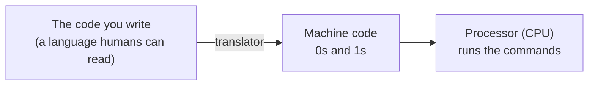

There are two classic ways to do this translation, and knowing the difference is the key to
understanding Java.

<Callout type="note" title="Two kinds of translator: compiler and interpreter">
**Compiler:** takes all of your code up front, translates it into machine code in one go, and
produces a runnable file. Like translating a whole book from start to finish and handing it over in
printed form. The translation happens once, then that file runs quickly.

**Interpreter:** takes the code line by line, translating each line right then and running it
immediately. Like a translator interpreting a conversation sentence by sentence, on the spot. It
starts quickly but redoes the translation every time it runs.

Java cleverly **combines** these two. We'll see how in a moment, when we get to the JVM; and that's
where Java's nicest idea lives.
</Callout>

## Where did Java come from? A short but nice story

Before the technical part, let me tell you where Java came from; because you understand why Java was
designed the way it is much better once you know the story.

The year is 1991. At a computer company called **Sun Microsystems,** a small team gathers. They call
themselves the "Green Team." At the core of the team were three names:
**[James Gosling](https://en.wikipedia.org/wiki/James_Gosling),** who designed the language, and
**[Patrick Naughton](https://www.linkedin.com/in/naughton/)** and **Mike Sheridan,** who kick-started
the project. (Other
engineers joined over time, but these were the founding trio of the "Green Team.") Their goal wasn't
actually to write computer programs like today; they wanted to develop a language for consumer
electronics devices like smart televisions and remote controls.

<div style="display:flex;flex-wrap:wrap;gap:1.25rem;justify-content:center;align-items:flex-end;margin:1.5rem 0;">
  <div style="flex:0 1 300px;max-width:300px;">
    <Figure src={sunLogo} alt="Sun Microsystems logo" caption="Where Java was born: Sun Microsystems. (Logo: public domain, Wikimedia Commons.)" />
  </div>
  <div style="flex:0 1 230px;max-width:230px;">
    <Figure src={goslingImg} alt="James Gosling, 2008" caption="James Gosling, the chief designer of Java. (Photo: Peter Campbell, CC BY-SA 4.0, Wikimedia Commons.)" />
  </div>
</div>

But they hit a problem. The processor inside every device was different, meaning each one's machine
code was different. A program written for one device wouldn't run on another; it had to be rewritten
for each device. The Green Team asked: **"Can't we make a language you write once that can run on
every device?"** Java's whole spirit was born from that question.

<Callout type="note" title="Why 'Java'? From a tree to coffee">
They first named the language **"Oak"** (as in the oak tree); the story goes that Gosling was inspired
by an oak tree visible from his office window. But it later turned out that the name "Oak" was already
taken by another company. Looking for a new name, they drew inspiration from a programmer's essential:
coffee. **"Java"** is actually the name of a kind of coffee from the island of Java in Indonesia.
That's also why the language's logo is a cup of hot coffee. A little culture note: to this day, the
files Java programs are packaged into have the extension `.jar`; and "jar" is, well, a jar. The
coffee joke is baked into every corner of the language; and we'll catch one more of these jokes in a
moment.
</Callout>

Java was officially announced to the world in **1995** and quickly drew a lot of interest. In those
years the internet was just spreading, and the idea of "write once, run anywhere" fit the moment
perfectly. Over the years, Java went far beyond the consumer-electronics idea and became the language
of enormous systems. Java also has a cute, red-nosed mascot named **Duke,** still the community's
symbol. (Sun was bought by **Oracle** in 2010; Java continues to evolve today under Oracle's roof.)

<div style="max-width:160px;margin:1.5rem auto;">
  <Figure src={dukeImg} alt="Duke, Java's mascot" caption="Duke, Java's friendly mascot. (Art: sbmehta, BSD license, Wikimedia Commons.)" />
</div>

## How does Java work? Bytecode and that stopover

Now let's put all the pieces together. Remember the problem the Green Team wanted to solve: a program
should be written once and run on every device. But every device's machine code was different. How
did they solve it?

With a trick like this: they didn't translate Java code **directly** into a device's machine code.
They put a **stopover** in between.

<Steps>
1. You write Java code. This is a file you can read, with a `.java` extension (for example
   `Hello.java`).
2. A compiler called **`javac`** translates this code not into machine code but into an intermediate
   language called **bytecode.** Out comes a file with a `.class` extension. Bytecode is not yet
   specific to any device; it's a halfway language.
3. The **JVM** (Java Virtual Machine) steps in. Every device has its own JVM. The JVM takes the
   bytecode and translates it into the machine code of the device it's currently running on, then
   runs it.
</Steps>

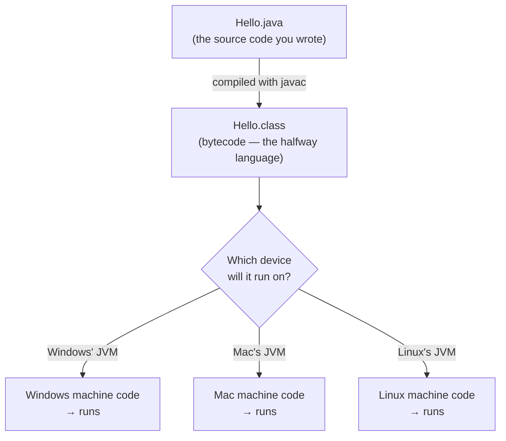

See the cleverness? You write `Hello.java` **once,** `javac` turns it into bytecode **once.** Then
that same bytecode can run on Windows, Mac, and Linux. "Write once, run anywhere" is exactly this.

### One second: why is this so important? (let's compare with C)

To see how clever this "stopover" idea is, let's look at the world before Java. Take **C,** a language
older than Java. In C, the code you write is compiled directly into **that device's machine code.** So
you have to compile separately for Windows, separately for Mac, separately for Linux (and often tweak
the code a bit too). Three operating systems means three separate compilations and three separate
runnable files:

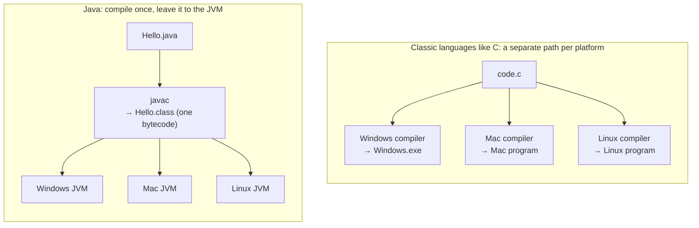

See the difference? In C there's a separate path for each platform **starting from the source code.**
In Java the hard part (translating source into bytecode) is done **once;** the only difference between
platforms is the JVM at the very end. So Java takes the "different device" worry out of your code and
buries it **inside the JVM.** You produce a single bytecode, and each device's own JVM handles the
rest. That's exactly the engineering behind Java's famous slogan, **"write once, run anywhere."**

### But what does bytecode actually look like?

We've been saying "bytecode" without stopping, but you're probably curious: what exactly is this
intermediate language? Let's open the hood and look.

Bytecode is made of commands written not for a real processor but for an **imaginary computer** (the
JVM). This imaginary computer works like a **"stack machine":** while doing its work it piles values
on top of one another like a stack of plates, then takes the top ones off and processes them. Each
command fits into **a single byte** (a number from 0 to 255); that's where the name "byte-code" comes
from. There are about 200 different commands in total.

Let's see a concrete example. Say you wrote a line in Java that adds two numbers and stores the result
in a third (`c = a + b`). `javac` turns it into bytecode commands like these:

```text title="c = a + b  →  bytecode" showLineNumbers=false
iload_1      # push the value of a onto the top of the stack
iload_2      # push the value of b onto the top of the stack
iadd         # take the top two values, add them, push the result
istore_3     # take the result off and store it in c
```

Let's trace how the stack changes at each step (say a = 5, b = 3); just like the
[trace table from the Algorithms series](/en/blog/variables):

```text showLineNumbers=false
iload_1   →  stack: [5]
iload_2   →  stack: [5, 3]
iadd      →  stack: [8]        (5 and 3 taken off, 8 put on)
istore_3  →  stack: []         (8 taken off and written to c → c = 8)
```

Notice: your one-line `c = a + b` was split into four tiny commands. That's exactly what the processor
likes: very simple, very small steps. Likewise, `System.out.println("Hello")` roughly turns into: push
the object representing the screen onto the stack, then push the `"Hello"` text, then call the "print"
command. Remember [calling a function](/en/blog/functions)? At the bytecode level, a function call
looks just like this.

<Callout type="tip" title="You don't need to memorize these">
Don't panic: you'll never write commands like `iload` and `iadd` by hand, and you don't need to
memorize them at all. I'm showing them so that the "something" in "javac turns my code into something"
has a real shape in your mind. You'll comfortably write `c = a + b`; splitting it into these tiny
commands is `javac`'s job, not yours. (A curious person can actually see their own code's bytecode
later with a command called `javap -c` — but that's for much later.)
</Callout>

<Callout type="note" title="A little secret: every .class file starts with coffee">
Here's the second coffee joke I promised. The **first four bytes** at the very start of every `.class`
(bytecode) file are always the same, written in the hexadecimal (hex) number system as: `CA FE BA BE`.
That is, `CAFEBABE`. When the JVM opens a file, the first thing it does is check these four bytes; if
it doesn't start with "CAFEBABE," it says "this isn't a valid Java class file" and rejects it. This is
called a **magic number.** Gosling's team picked these four bytes with another coffee pun: "CAFE BABE."
Even at Java's very bottom, there's the smell of coffee.
</Callout>

## Inside the JVM: layer by layer

Now we've reached the most crucial part. We said "the JVM runs bytecode," but the JVM isn't a single
box; inside it are **three big subsystems** working together. Picture the journey of a bytecode file
(that is, your program) through the JVM with this diagram:

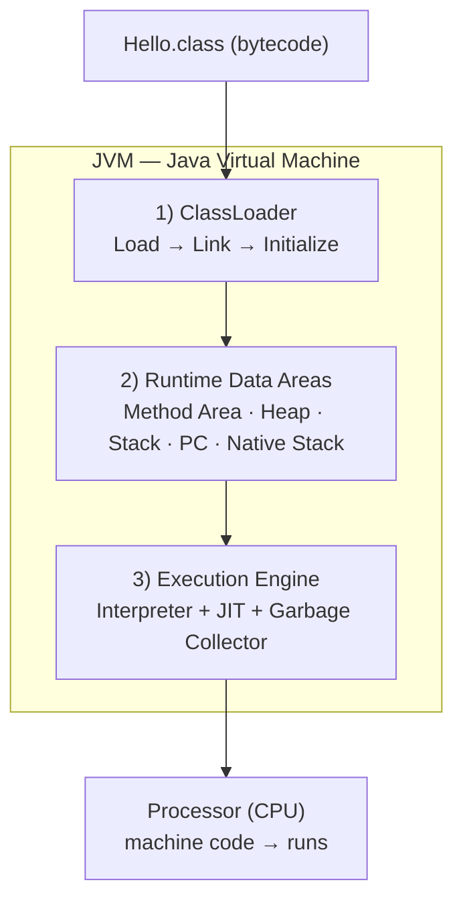

Let's open up these three layers one by one.

### 1. ClassLoader: the door that lets classes in

Before your program starts running, its bytecode (the `.class` files) needs to be brought into memory.
The **ClassLoader** does this job. It works in three stages:

<Steps>
1. **Loading:** it finds the `.class` file and reads the bytecode inside into memory. Several loaders
   do this: the most basic *Bootstrap* (loads Java's own core classes), above it the *Platform*, and
   on the outside the *Application* (which loads the classes you wrote).
2. **Linking:** it has three small steps. *Verify* — checks whether the bytecode is safe and follows
   the rules (a corrupt or malicious file can't get past here; part of Java's security). *Prepare* —
   allocates memory for the class's variables. *Resolve* — connects the references one part makes to
   another into real addresses.
3. **Initialization:** the class's starting values are assigned and setup code runs. The class is now
   ready to use.
</Steps>

There's a nice rule in how these loaders work: **"ask upward first"** (called *parent delegation*).
The Application loader, which will load your class, doesn't jump in right away; it first asks the
Platform above it, which asks the Bootstrap above it, "can you load this?" If nobody up top can, the
job comes back down to the Application at the bottom.

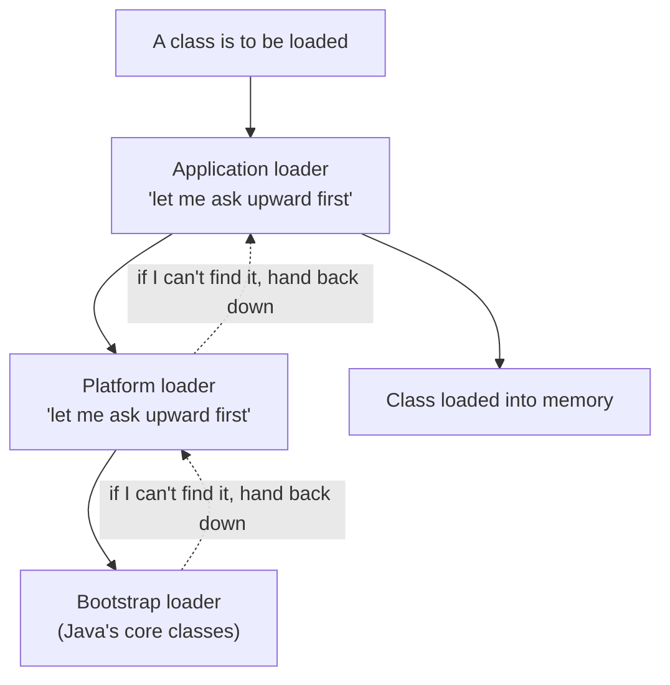

Why this order? For security. Thanks to it, even if you accidentally write a class named `String`, you
**can't overwrite** Java's real core `String`; because core classes are always loaded from the most
trusted source, the Bootstrap at the very top.

### 2. Runtime data areas: the space a program uses while running

While running, a program needs to hold information somewhere. The JVM divides this memory into tidy
compartments. Let's start with the two most important:

- **Heap:** all the **objects** your program creates live here. Think of it as a big, shared
  warehouse; it's also where the garbage collector we'll meet in a moment does its work.
- **Stack (the method call stack):** every time a [function (method)](/en/blog/functions) is called,
  its information (like its local variables) is stacked here as a "frame"; when the function ends,
  that frame is removed. Remember the rule from [functions](/en/blog/functions), "local variables
  disappear when the function ends"? Here's the physical reason.

Alongside these are three more compartments: the **Method Area** (holds classes' structure, shared
information, and constants), the **PC Register** (a tiny pointer holding which command we're currently
on), and the **Native Stack** (for non-Java code, e.g. written in C).

<Callout type="note" title="Shared, or private?">
A small but important distinction: the **Heap** and **Method Area** are **shared** by the whole
program (there's only one of each). The **Stack, PC Register, and Native Stack** are **private to each
thread** (each separate line of work running at the same time) — each one gets its own copy. That's
why two lines of work running at once don't mix up their local variables. (An upper layer of the "each
function has its own scratchpad" idea from [functions](/en/blog/functions).)
</Callout>

Let's bring the difference between the Heap and the Stack to life with a small example, because these
two will keep coming up in Java. Say a method is running and inside it you create a "person" object.
The object **itself** (with its data like name and age) sits on the Heap; the little connection (a
reference) that *points to* that object, held by the method, sits in the frame on the Stack. So on the
Stack there's an **arrow** pointing to the object, and on the Heap there's the **object itself:**

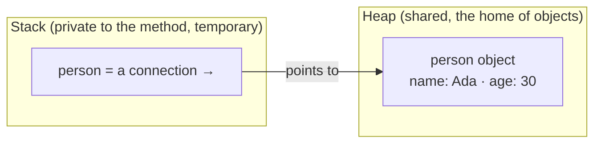

When the method ends, the frame on the Stack (including that arrow) is instantly deleted. But the
object itself on the Heap? This is exactly where the garbage collector comes in: if **no other arrow**
is left pointing to that object, it's unreachable, and the GC clears it. We look at that right below.

### 3. Execution Engine: the engine that actually runs the bytecode

The bytecode is loaded, our memory is ready. Now we've reached the part that does the real work: the
**Execution Engine.** Inside it are three important players.

**The Interpreter.** It reads and runs the bytecode from the start, line by line. It starts right
away, no waiting. But if a piece of code runs over and over, translating it fresh every time is a
waste of time.

**The JIT Compiler.** Here's Java's speed trick. JIT means "Just-In-Time." While the JVM runs the
program it also watches: which pieces of code run **very often?** These frequently run pieces are
called **"hot code."** When the JVM sees hot code, it stops interpreting it and **compiles it into
machine code once and stores it;** on every later call it uses that ready, lightning-fast version. So
the program speeds itself up as it runs.

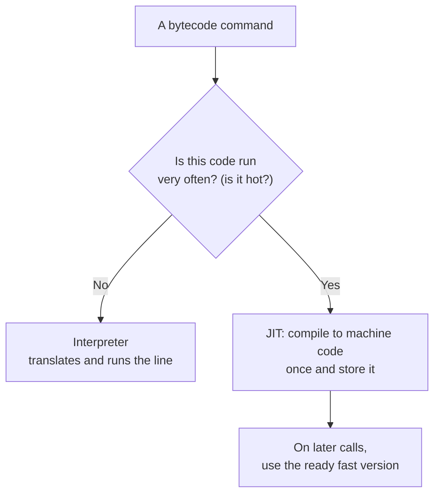

<Callout type="important" title="Java is both portable and fast: this is the secret">
Remember the "compiler or interpreter?" question earlier. Java uses **both:** to stay portable it
starts by interpreting the bytecode (runs on every device), and to be fast it compiles hot code into
machine code with the JIT. The technology that combines these two is called **HotSpot** (as in "the
hot spot"; because it finds the frequently run, "heating up" pieces of code and focuses on them). This
is why Java breaks the "interpreted languages are slow" cliché: after the first few seconds, most Java
programs are nearly as fast as native code.
</Callout>

**The Garbage Collector.** The third player, perhaps the part that most reassures a beginner. Objects
you create on the Heap take up space. In some languages (C, for instance), once you're done with an
object you have to hand that memory back **by hand;** forget and memory fills up, the program bloats.
In Java, the **Garbage Collector** (GC) does this for you: it wanders in the background, finds objects
that can no longer be reached from anywhere (that nobody is using), and clears their memory
automatically. You never say "delete this object"; the GC collects the ones that have turned to trash
itself. This is one of the biggest reasons Java is more comfortable to write and less prone to bugs.

So how does the GC know an object is "trash"? The criterion is one word: **reachability.** The JVM
starts from the "root" connections the program still holds (like the Stack variables of running
methods) and, going from arrow to arrow, sees what it can reach. Every object reachable from the end
of this chain is **alive** and is kept. Objects that can't be reached by any chain are **trash.**

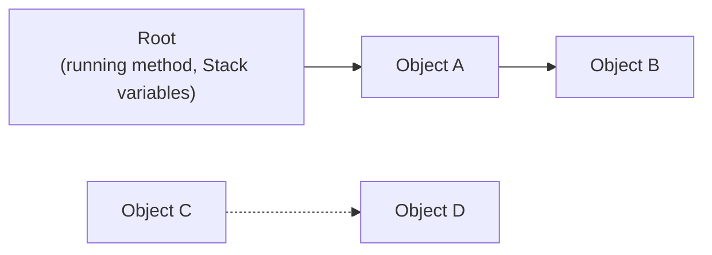

Above, A and B are connected to the root, so they're **alive;** they're kept. C and D, even though
they point to each other, aren't connected to the root by any path; both are **unreachable,** that is,
trash. On its next pass the GC reclaims the memory of C and D; without you writing a single "delete"
command. (This "island that holds itself but nobody can reach" situation is one of the sneakiest kinds
of bug in languages that manage memory by hand; in Java the GC handles it for you.)

<Callout type="note" title="There's also the JNI bridge">
One last detail: sometimes Java wants to talk to code deep in the operating system that wasn't written
directly in Java (say, in C/C++). A bridge called **JNI** (Java Native Interface) and "native"
libraries make this possible. It's not something you'll deal with often, but if you see its name on a
JVM diagram, remember it as "Java's door to the outside world."
</Callout>

## JDK, JRE, JVM: what's this pile of three letters?

After all this internal machinery, let's place the three abbreviations you'll run into often. Think of
them as three rings nested inside one another.

At the very center is the **JVM** we now know well: the engine that runs bytecode, the one we examined
layer by layer above.

Wrapping it is the **JRE** (Java Runtime Environment): it adds, next to the JVM, the ready-made
libraries that programs often need. If you only want to **run** a Java program (say, one someone else
wrote), this is enough for you.

On the outside is the **JDK** (Java Development Kit): on top of the JRE, it adds the tools needed to
**write** programs; most importantly the `javac` compiler that turns your code into bytecode. Since
you'll be **writing** Java in this series, the thing you'll install is the JDK.

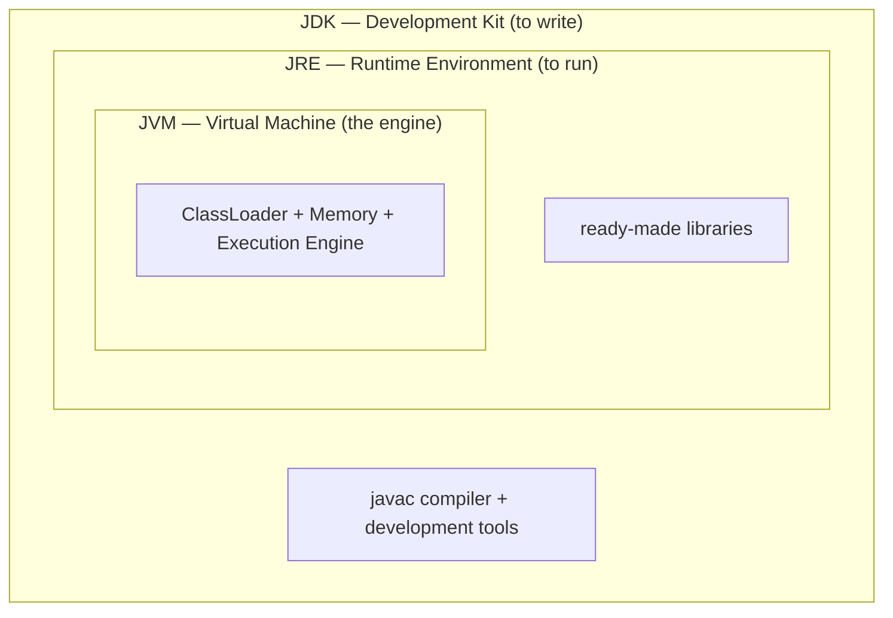

In one sentence: **the JDK to write, the JRE just to run, and the JVM the engine that actually does
the work.** Like a Russian nesting doll, one inside another.

## Everything together: a program's end-to-end journey

We've learned a lot: source code, javac, bytecode, ClassLoader, memory, interpreter, JIT, garbage
collector... Let's now combine it all into a single picture so the big picture settles in your mind.
When you write `Hello.java` and say "run," behind the curtain, in order, this is what happens:

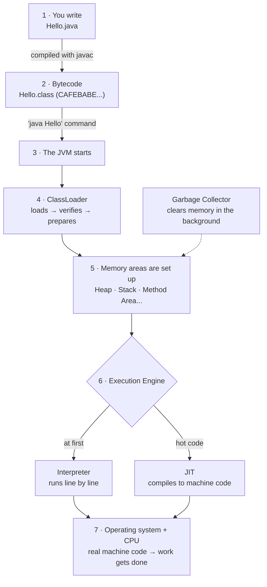

Let's sum up the steps in one sentence: **(1)** you write readable Java; **(2)** `javac` turns it into
portable bytecode; **(3–4)** the `java` command starts the JVM, and the ClassLoader brings the
bytecode in and verifies it; **(5)** the memory compartments are set up; **(6)** the Execution Engine
first interprets, and compiles frequently run code into machine code with the JIT; **(7)** at the very
bottom the real operating system and processor do the work; and throughout all of this the **garbage
collector** clears unused memory in the background. The full answer to "how does Java work?" is right
there in this one diagram.

## A quick peek at our first code

After all this hood-lifting, let's go back to the very top, to the code you'll write. A Java program
that prints "Hello, world!" to the screen, in the **classic** form you'll see in every book for
decades, looks like this:

```java title="Hello.java — classic form" showLineNumbers=false
public class Hello {
    public static void main(String[] args) {
        System.out.println("Hello, world!");
    }
}
```

We just saw what this turns into under the hood: `javac` compiles it to bytecode (`Hello.class`,
starting with `CAFEBABE`); the ClassLoader loads it; the Execution Engine first interprets it, and if
it runs often, compiles it to machine code with the JIT.

Now some good news. Java is still evolving, and the latest version, **Java 25** (2025), made things a
lot easier for beginners. That `public static void main(String[] args)` pattern, mandatory for years,
is **no longer required;** you can bring the exact same program down to just this:

```java title="Hello.java — Java 25 simple form" showLineNumbers=false
void main() {
    IO.println("Hello, world!");
}
```

Both programs do the exact same thing: print "Hello, world!" to the screen. But the second one has
none of that scary clutter. Look at the core; it's the same in both: printing something to the screen.
Remember how, in the [Algorithms series](/en/blog/what-is-an-algorithm), we said `PRINT "Hello"`? Well,
`System.out.println` (and its shorter Java 25 sibling `IO.println`) is exactly its Java equivalent.

<Callout type="tip" title="So why will we still learn the classic form?">
You might think: "Since Java 25 simplified it this much, can't I just never learn that long pattern?"
No, because almost all the existing Java code in the world is still written in that classic
`public static void main(String[] args)` form. You'll see it every day in books, older courses, and at
work; so you have to recognize it. In this series we'll use both: mostly the **simple Java 25 form** so
it doesn't overwhelm you at the start, but the classic pattern too, unpacking line by line what
`public`, `static`, `void`, `main`, and `String[] args` mean. Each has a story, and we'll tell them
when the time comes. What matters is this: the real work inside is the logic you already
[learned to think of as an algorithm](/en/blog/what-is-an-algorithm). Java just puts a wrapper around
it; and Java 25 made that wrapper a good deal thinner.
</Callout>

## Think for yourself

We didn't write code in this post, but a few small questions will help cement what you learned. Pen
and paper are enough.

### Question 1 — If everything is a number... (easy)

> We said the number for capital "A" is 65 and its binary form is `01000001`. The next letter, "B,"
> has the number 66. What do you think "B"'s binary form is?

<Callout type="note" title="Hint">
When counting in binary, just like normal numbers, you "add one" to move to the next. And using the
place-weight table: 66 = 64 + 2. So the places worth 64 and 2 get a 1, the rest get 0: `01000010`.
That's the letter "B" in the computer's eyes. (Did you notice: A, B, C... are all consecutive numbers.
That's why a computer can put letters in order so easily.)
</Callout>

### Question 2 — The stack machine (medium)

> We saw that the line `c = a + b` turns into the commands `iload`, `iload`, `iadd`, `istore`. Now,
> for `a = 10`, `b = 4`, write out by hand how the stack looks at each step. What does `c` end up as?

<Callout type="note" title="Hint">
Do the same trace as in the post: `iload_1` → `[10]`, `iload_2` → `[10, 4]`, `iadd` (take the two off,
add) → `[14]`, `istore_3` (take it off and write to c) → `[]`, and `c = 14`. The stack is like a pile
of plates: you always work with the top one(s).
</Callout>

### Question 3 — The JVM's three layers (medium)

> Try to recall the JVM's three main subsystems and each one's one-sentence job without looking. Then
> place these in the right layer: (a) the Heap, (b) the part that brings what javac produced into
> memory, (c) the part that compiles hot code into machine code.

<Callout type="note" title="Hint">
Three layers: **ClassLoader** (loads), **Runtime Data Areas** (holds information while running),
**Execution Engine** (runs). Placement: (a) Heap → Runtime Data Areas; (b) the loader → ClassLoader;
(c) the one compiling hot code → the **JIT** inside the Execution Engine.
</Callout>

### Question 4 — Match them up (easy)

> Match these: (a) JVM, (b) JRE, (c) JDK — with — (1) the full kit needed to write Java, (2) the
> engine that runs a program, (3) the middle package needed just to run.

<Callout type="note" title="Hint">
Remember the rings: the innermost engine is the JVM (a→2), the runtime package wrapping it is the JRE
(b→3), the outermost writing kit is the JDK (c→1). Since you'll be writing Java, the thing you'll
install is (c) the JDK.
</Callout>

## What makes Java, Java

You now know how Java works. So what are the core features that made Java so loved and so widespread?
Good news: you've already seen most of them in this post. Let's gather them together:

| Feature | What it means | Where it came up in this post |
| --- | --- | --- |
| **Platform independent** | Write once, run anywhere; your code isn't stuck to a device | Bytecode + JVM, the C comparison |
| **Object-oriented** | You build the program around real-world "things" (objects) | We'll go deep in later posts |
| **Automatic memory management** | You don't clean up memory by hand; the garbage collector does | The Garbage Collector |
| **Secure** | Corrupt or malicious bytecode can't get past verification before running | The ClassLoader's "verify" step |
| **Robust** | A structure that catches errors early and resists crashing | Type checking + verification |
| **Multithreaded** | Can run several jobs in parallel at once | The per-thread Stack |
| **Fast** | Thanks to the JIT, nearly as fast as native code after the first seconds | HotSpot / JIT |

Note: we haven't opened up the **"object-oriented"** part yet; that's a whole topic on its own and
will form the backbone of this series. For now let it sit in a corner of your mind as "Java lets you
split a program into parts like real-world objects"; we'll cover it at length in the coming posts.

## A short version history of Java

Java hasn't stopped since it was announced in 1995 and set off with its first release in 1996. In
nearly thirty years, each version has added dozens of features. The table below shows the milestone
versions and **a few of the standout** additions of each — note: these are just the highlights, each
version has far more changes than this. You don't need to understand them all now; think of it as a
map you can come back to later and ask "which feature arrived in which version?"

| Version | Year | Standout additions (just a few) |
| --- | --- | --- |
| Java 1.0 | 1996 | First release; "write once, run anywhere," applets, the AWT GUI |
| Java 2 (1.2) | 1998 | Collections (List/Map/Set), the Swing GUI library |
| Java 5 | 2004 | Generics, `enum`, annotations, autoboxing, enhanced `for`, `java.util.concurrent` |
| Java 7 | 2011 | try-with-resources, diamond `<>`, `switch` on Strings, new file API (NIO.2) |
| **Java 8** (LTS) | 2014 | **Lambda expressions, the Stream API,** `Optional`, new date/time API (`java.time`) — a huge turning point |
| Java 9 | 2017 | Module system (Jigsaw), JShell; the 6-month release cadence began here |
| Java 10 | 2018 | `var` for local-variable type inference |
| **Java 11** (LTS) | 2018 | Modern HTTP client, running a single file without compiling, new `String` methods |
| Java 14 | 2020 | `record` (preview), `switch` expressions, helpful NullPointerException messages |
| Java 15 | 2020 | Text blocks (`"""..."""`), `sealed` classes (preview) |
| **Java 17** (LTS) | 2021 | `sealed` classes, `instanceof` pattern matching, `record`s; strong encapsulation of internals |
| Java 19 | 2022 | Virtual threads (preview) |
| **Java 21** (LTS) | 2023 | **Virtual threads,** pattern matching in `switch`, `record` patterns, sequenced collections |
| **Java 25** (LTS) | 2025 | Compact source files + simple `main` (JEP 512), flexible constructor bodies, module imports, scoped values |

<Callout type="note" title="What does LTS mean, and why does it matter?">
Some versions in the table are marked **LTS**: "Long Term Support." Since Java 9 (2017), a new version
comes out every 6 months, but most are supported for only a few years. So that companies don't have to
chase a big update every 6 months, every few years one version is marked "to be supported for a long
time." Today the most common LTS versions are Java 8, 11, 17, 21, and the newest, 25. If you're just
starting out, it makes the most sense to begin with the latest LTS, **Java 25**; that's what we'll use
in this series. (And as you can see, Java 25 is not "just `main`"; the simplified `main` is only one of
that version's many standout additions.)
</Callout>

## Summary and what's next

<Callout type="tip" title="Put it in your pocket">
- **Java** is a very widely used language, around since 1995, that we use to tell a computer what to
  do; it's everywhere, from Android to banks, from huge servers down to a Raspberry Pi or a bank card.
- At its core a computer understands only **0 and 1** (binary); the language the processor runs is
  called **machine code.** Eight bits make a **byte.**
- Number systems work by place weights: base 10 uses powers of 10 (because we have 10 fingers), binary
  uses powers of 2. `01000001` = 64 + 1 = 65.
- Your Java code is first turned into **bytecode:** tiny commands (`iload`, `iadd`...) written for an
  imaginary **stack machine,** each fitting in one byte. Every `.class` file starts with `CAFEBABE`.
- The **JVM has three layers:** the **ClassLoader** (load-link-initialize), the **Runtime Data Areas**
  (Heap, Stack, Method Area, PC, Native), and the **Execution Engine** (interpreter + JIT + garbage
  collector).
- The **JIT** compiles frequently run "hot" code into machine code (HotSpot); that's why Java is both
  portable and fast. The **garbage collector (GC)** clears the memory of unused objects for you.
- **JDK ⊃ JRE ⊃ JVM:** the JDK to write, the JRE to run, the JVM the engine.
- **Java 25** (2025, the latest LTS) made the classic `public static void main` pattern optional; we'll
  move forward with this version.
- Next up: installing Java (the JDK) on our computer and running that first `Hello, world!` program
  line by line, with our own hands.
</Callout>
