import Callout from '../../components/Callout.astro';
import Steps from '../../components/Steps.astro';
import Figure from '../../components/Figure.astro';
import goslingImg from '../../assets/james-gosling.jpg';
import dukeImg from '../../assets/duke-mascot.png';
import sunLogo from '../../assets/sun-logo.png';

Yeni bir seriye başlıyoruz. Eğer [Algoritmalar serisini](/blog/algoritma-nedir) takip ettiysen, bir
bilgisayarın nasıl "düşündüğünü" kalem ve kâğıtla çözdün: değişkenler, koşullar, döngüler, listeler,
fonksiyonlar. Şimdi sıra o düşünceleri gerçek bir dile dökmeye geldi. O dil de **Java** olacak.

Ama acele etmeyeceğiz. Java'nın ilk satırını yazmadan önce şu soruların cevabını istiyorum: Java tam
olarak ne işe yarıyor? Nereden çıktı, kim yaptı, neden yaptı? Bir bilgisayar programı aslında nasıl
çalışıyor? "Binary" dedikleri o 0'lar ve 1'ler ne? **Bytecode** neye benzer? Java'nın kalbindeki
**JVM'in içinde** hangi katmanlar var, **JIT** ve **çöp toplayıcı** ne yapar? Bu yazı uzun olacak,
çünkü hepsini tek tek, sindire sindire göreceğiz. Hazırsan başlayalım.

<Callout type="note" title="Bu seri kimin için?">
Bu seri, yazılıma yeni başlayan ya da Java'yı sıfırdan öğrenmek isteyen herkes için. Programlamayla
hiç tanışmadıysan da devam edebilirsin; ama arada geçen değişken, döngü, fonksiyon gibi kavramları
biraz yabancı bulursan, onları en baştan anlatan [Algoritmalar serisine](/blog/algoritma-nedir) göz
atmanı tavsiye ederim. İki seri birbirini tamamlıyor: biri düşünmeyi, bu ise o düşünceyi Java'yla
yazmayı öğretiyor.
</Callout>

## Java tam olarak ne işe yarar?

Şöyle düşün: Java, bir bilgisayara ne yapması gerektiğini anlatmak için kullandığımız dillerden biri.
Sen ona bir talimat listesi (yani bir program) yazarsın, o da bunu bilgisayarın anlayacağı hâle
getirip çalıştırır. Yani bir "aracı dil". Peki neden bu kadar meşhur, nerelerde karşımıza çıkıyor?

Muhtemelen bugün, farkında bile olmadan Java'yla yazılmış onlarca şeye dokundun:

- **Android telefonlar.** Uzun yıllar boyunca Android uygulamalarının çoğu Java ile yazıldı. Cebindeki
  pek çok uygulamanın altında Java var.
- **Bankalar ve büyük şirketler.** Dünyanın en büyük bankalarının, sigorta şirketlerinin, havayolu
  rezervasyon sistemlerinin arka planında çoğu zaman Java çalışır. Sağlamlığı ve güvenilirliğiyle
  tanınır; bu yüzden "para işleri" gibi hata kaldırmayan yerlerde çok sevilir.
- **Devasa web siteleri.** Netflix, LinkedIn, Amazon gibi milyonlarca kişiye hizmet veren sistemlerin
  önemli parçaları Java (ve akrabası dillerle) yazılmıştır.
- **Oyunlar.** Dünyanın en çok satan oyunu Minecraft'ın orijinali Java ile yazıldı. (Adının "Java
  Edition" olması bundan.)
- **Gömülü sistemler, IoT ve avuç içi cihazlar.** İşin belki de en şaşırtıcı yanı: Java yalnızca dev
  sunucularda değil, elinin içine sığan minik cihazlarda da çalışır. Kredi kartı büyüklüğündeki, ucuz
  bir bilgisayar olan **Raspberry Pi** üzerinde rahatça Java çalıştırabilirsin. Daha da çarpıcısı:
  cebindeki **SIM kartın** ve pek çok **banka kartının** içindeki minicik çipte "Java Card" denen bir
  Java sürümü koşar; yani dünyada **milyarlarca kart** sessizce Java çalıştırıyor. ATM'ler, akıllı
  sayaçlar, sanayi sensörleri, eski Blu-ray oynatıcılar... Java bunların çoğunun içinde.

Bu genişliğin tesadüf olmadığını birazdan göreceksin: Java'yı doğuran ekip onu tam da **küçük cihazlar
için** tasarlamıştı (televizyonlar, kumandalar gibi). Yıllar içinde Java önce dev sistemlerin dili
oldu, ama sonra ilk hayaline de kavuştu ve o minik cihazlara geri döndü. Peki aynı dil nasıl oluyor da
hem koca bir bankanın sunucusunda hem de avucundaki bir Raspberry Pi'de çalışabiliyor?

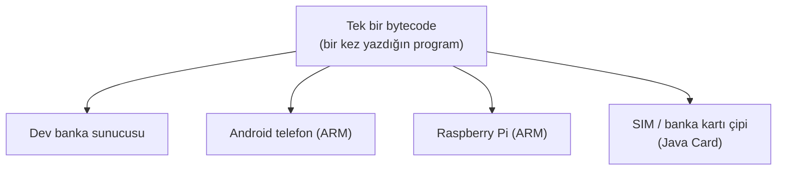

Cevabı, bu yazıda birazdan tanışacağın **bytecode + JVM** ikilisinde gizli: sen programı bir kez
yazarsın, her cihazın kendi JVM'i (ister güçlü bir sunucu işlemcisi, ister bir telefonun ya da
Raspberry Pi'nin **ARM** işlemcisi olsun) onu o cihazın diline çevirir. Yani "her yerde çalışır"
derken gerçekten *her yeri* kastediyoruz: en büyükten en küçüğe.

<Callout type="tip" title="Yani Java ile neredeyse her şeyi yapabilirsin">
Toparlarsak, Java tek bir alana hapsolmuş bir dil değil; onunla telefon uygulaması, web sitesi ve
sunucu, masaüstü programı, oyun, hatta gömülü cihaz yazılımı yazabilirsin. Bu alanların her birinin
kendi araçları var: web ve sunucu tarafında **servlet**'ler, masaüstünde **Swing** ve JavaFX,
tarayıcının ilk günlerinde **applet**'ler... Bu araçları şimdi tek tek açmayacağız; her birini bu
serinin ileriki bölümlerinde sırası geldikçe tanıyacağız. Şimdilik aklında kalması gereken tek şey
şu: Java'yı öğrenince önünde çok geniş bir dünya açılıyor, ve bir kere temeli attın mı bu dille
gitmek istediğin hemen her yere gidebilirsin.
</Callout>

Kısacası Java, hem "büyük ve ciddi işlerin" hem de "minicik cihazların" dili olarak bir isim yaptı.
Otuz yılı aşkın bir geçmişi var ama hâlâ en çok iş ilanı çıkan, en çok kullanılan diller arasında.

<Callout type="important" title="Java ile JavaScript karıştırılır — ama akraba değiller">
Daha en baştan bir yanlış anlaşılmanın önüne geçelim. **Java** ile **JavaScript,** isimleri
benzediği için sürekli karıştırılır; oysa bambaşka iki dildir. Aralarındaki ilişki, "araba" ile
"halı" arasındaki ilişki kadardır: sadece isim benzerliği. JavaScript ağırlıklı olarak web
tarayıcısında çalışır; Java ise daha çok sunucularda ve Android'de. İsim benzerliği 1990'ların
pazarlama modasından kalma bir tesadüf, o kadar. Bu seride konumuz **Java.**
</Callout>

## Önce şu soruyu çözelim: bir bilgisayar aslında nasıl çalışır?

Java'nın nasıl çalıştığını anlamak için, bir alt kata inmemiz lazım. Çünkü Java'nın var oluş sebebi,
tam da bu alt katta gizli.

İşin sırrı şaşırtıcı derecede basit: **bir bilgisayar aslında çok aptaldır.** Kulağa garip geliyor,
biliyorum. Ama gerçek şu ki bir bilgisayar, tek başına yalnızca çok küçük ve çok basit işleri
yapabilir: iki sayıyı toplamak, iki değeri karşılaştırmak, bir bilgiyi bir yerden alıp başka yere
koymak. Hepsi bu. Onu "akıllı" gibi gösteren şey, bu minik işleri **inanılmaz bir hızla,** saniyede
milyarlarca kez yapabilmesi.

Bir bilgisayarın içinde, kabaca iki önemli parça vardır. Biri **işlemci** (CPU): bütün o basit işleri
yapan, bilgisayarın "beyni". Diğeri **bellek** (RAM): işlem yaparken bilgileri geçici olarak tuttuğu
yer. [Değişkenler yazısındaki](/blog/degiskenler) "etiketli kutu" örneğini hatırlıyor musun? İşte o
kutular fiziksel olarak burada, bellekte duruyor.

Peki bu işlemci hangi dili konuşur? İşte kilit soru bu.

## Binary: bilgisayarın tek gerçek dili

Bir bilgisayarın en derininde, her şey elektrikle olup biter. Ve elektrik için tek bir sorunun
cevabı vardır: **akım var mı, yok mu?** Ampul yanıyor mu, yanmıyor mu gibi. İşte bilgisayar bütün
dünyayı bu tek soruya indirger.

"Akım var" durumunu **1,** "akım yok" durumunu **0** ile gösteririz. Yalnızca bu iki rakamdan,
0 ve 1'den oluşan sisteme **binary** (Türkçesiyle **ikili** sistem) denir. Bu tek tek 0 ve 1'lerin
her birine bir **bit** deriz. Bit, bilgisayardaki en küçük bilgi parçasıdır.

Tek bir bit tek başına pek işe yaramaz (sadece "evet ya da hayır" diyebilir). Ama onları yan yana
dizince iş değişir. Sekiz biti bir araya getirdiğimizde bir **byte** oluşur, ve bir byte ile artık
256 farklı şeyi ifade edebiliriz. (Bu "byte" kelimesini aklında tut; birazdan "bytecode"da yine
karşımıza çıkacak.)

<Callout type="note" title="Peki harfler, resimler? Onlar da mı 0 ve 1?">
Evet, hepsi. Bir bilgisayar 0 ve 1'den başka bir şey bilmediği için, ona göstermek istediğimiz her
şeyi önce sayıya, sonra da o sayının binary karşılığına çeviririz.

Örneğin büyük **"A"** harfini ele alalım. Bilgisayar dünyasında herkesin üzerinde anlaştığı bir
tabloya göre "A" harfinin sayısı **65'tir.** 65 sayısının binary karşılığı da şudur:

`01000001`

Yani sen ekranda kocaman bir "A" görürken, bilgisayar aslında `01000001` diye sekiz bitlik (bir
byte'lık) bir elektrik desenini tutuyor. Bir fotoğraf mı? O da milyonlarca minik renkli noktanın
(piksel), her birinin renginin sayıya çevrilmiş hâli. Bir şarkı mı? Sesin binlerce kez ölçülüp sayıya
dökülmüş hâli. Bilgisayardaki **her şey,** en dipte, 0 ve 1'lerden ibarettir.
</Callout>

### Peki bu hesap nasıl yapılıyor? (ve neden biz 10'lu sayıyoruz)

Az önce "A" harfinin 65, 65'in de binary'de `01000001` olduğunu söyledim. Ama bu `01000001`'i nereden
buluyoruz? Bunu anlamak için, hayatında hiç sormadığın bir soruyla başlayalım: biz insanlar neden
0'dan 9'a kadar tam **on** rakam kullanıyoruz?

Cevap tam anlamıyla elinin ucunda: **on parmağımız var.** İlk insanlar saymaya parmaklarıyla başladı,
sayı sistemimiz de doğal olarak ona (10'a) oturdu. O kadar ki, İngilizcede "rakam" demek olan *digit*
kelimesi, Latince **parmak** (digitus) demektir.

Ama bu, evrensel bir yasa değil, sadece bir alışkanlık. Tarihte farklı uygarlıklar bambaşka tabanlar
kullandı, üstelik bazıları bugün hâlâ hayatımızda:

- **Babilliler 60 tabanıyla** sayardı. Bugün bir saatin **60 dakika,** bir dakikanın **60 saniye**
  olması ve bir çemberin **360 dereceye** bölünmesi, doğrudan onlardan kalma bir miras. Yani her saate
  baktığında aslında 4000 yıllık bir sayı sistemini kullanıyorsun.
- **Mayalar 20 tabanını** kullanırdı; büyük ihtimalle hem el hem ayak parmaklarını sayarak.

Peki "10'lu sistem" tam olarak nasıl çalışıyor? Aslında sürekli yaptığın ama hiç durup düşünmediğin
bir şey. `365` sayısını ele al. Bu sayı şu demek:

`365 = (3 × 100) + (6 × 10) + (5 × 1)`

Yani her basamağın bir **ağırlığı** var ve bu ağırlıklar sağdan sola doğru **10'un kuvvetleri:** birler
(1), onlar (10), yüzler (100), binler (1000)... Neden 10? Çünkü elimizde 10 rakam var. İşte "onluk
taban" (10'lu sistem) budur: 10 rakam, ve her basamak bir sağındakinin 10 katı.

Şimdi asıl güzel kısım. Bilgisayarın parmağı yok; onun yalnızca **iki** hâli var: akım var (1), akım
yok (0). Yani elinde sadece **iki rakam** var. O da tıpkı bizim gibi basamak basamak sayar, ama 10'un
kuvvetleri yerine **2'nin kuvvetlerini** kullanır. Bir byte'ın (sekiz basamağın) ağırlıkları sağdan
sola şöyle gider — her biri bir öncekinin iki katı:

| Basamak ağırlığı | 128 | 64 | 32 | 16 | 8 | 4 | 2 | 1 |
| --- | --- | --- | --- | --- | --- | --- | --- | --- |

**Binary okumak** artık çok kolay: hangi basamakta 1 varsa, o basamağın ağırlığını topla. `01000001`'i
bu tabloya oturtalım:

| Ağırlık | 128 | 64 | 32 | 16 | 8 | 4 | 2 | 1 |
| --- | --- | --- | --- | --- | --- | --- | --- | --- |
| Bit | 0 | **1** | 0 | 0 | 0 | 0 | 0 | **1** |

1 olan basamaklar 64 ve 1. Topla: **64 + 1 = 65.** İşte `01000001`'in onlu karşılığı 65; hani "A"
harfinin sayısıydı.

**Tersi de mümkün: bir sayıyı binary'ye çevirmek.** Diyelim 65'i binary yapacağız. En büyük ağırlıktan
başlayıp "sığar mı?" diye soralım:

<Steps>
1. 128 → 65'e sığar mı? Hayır (128 > 65). Basamak: **0.**
2. 64 → sığar mı? Evet. Bir tane al; geriye 65 − 64 = 1 kaldı. Basamak: **1.**
3. 32, 16, 8, 4, 2 → hiçbiri kalan 1'e sığmaz. Basamaklar: **0 0 0 0 0.**
4. 1 → sığar mı? Evet, tam oturdu; geriye 0 kaldı, bitti. Basamak: **1.**
</Steps>

Bitleri sırayla dizince: `01000001`. Aynı yöntemle küçük bir örnek daha: **13** sayısı = 8 + 4 + 1,
yani binary'de `00001101`. Gördüğün gibi hiç sihir yok; sadece "hangi 2'nin kuvvetleri toplanınca bu
sayı olur?" sorusu. (Bir tane daha denemek istersen, "B" harfi seni bekliyor: 66 = 64 + 2.)

<Callout type="note" title="Neden bilgisayarlar 2'li sistemi seçti?">
Aklına şu gelebilir: madem 10'lu sistem bize bu kadar doğal, bilgisayarlar da 10'lu çalışsaydı ya?
Sebebi elektronikte gizli. Bir devrenin "akım var / akım yok" gibi **iki** durumu güvenilir biçimde
ayırt etmesi çok kolaydır; ama "onda üç akım, onda yedi akım" gibi on ayrı seviyeyi karıştırmadan
ayırt etmek çok zordur ve hataya açıktır. İki durum ise nettir, sağlamdır, ucuzdur. İşte bilgisayarlar
bu yüzden bütün dünyayı sadece 0 ve 1'e indirger: çünkü en güvenilir sayabildikleri şey "var mı, yok
mu"dur.
</Callout>

İşlemcinin doğrudan anlayıp çalıştırdığı komutlar da bu 0-1 dilindedir. Bu en alt seviye dile
**makine dili** (ya da makine kodu) denir. İşlemci başka hiçbir şey anlamaz; ona ne yaptırmak
istiyorsan, sonunda bu 0-1 diline çevrilmiş olması gerekir.

## Peki biz neden 0 ve 1 yazmıyoruz?

Şimdi bir düşün. Sen bir program yazacaksın. Bunu tamamen 0 ve 1 yazarak yapmak zorunda olsaydın, en
basit iş bile kâbusa dönerdi. "Ekrana Merhaba yaz" gibi küçücük bir istek bile, sayfalarca 0 ve
1'den oluşurdu. İnsan böyle bir şeyi yazamaz, okuyamaz, hele hata bulup düzeltemez.

Çözüm ne? Biz insanlar, **bize okunabilir gelen** bir dille program yazarız; sonra bir **çevirmen**
bunu bilgisayarın anladığı makine diline dönüştürür. İşte Java gibi diller (ve daha önce
[sözde kodla](/blog/sozde-kod) taklidini yaptığımız gerçek programlama dilleri) tam olarak bu işe
yarar: insanla makine arasında bir orta yol.

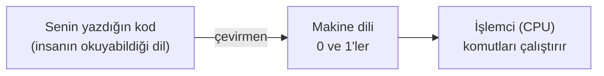

Bu çeviri işini yapmanın iki klasik yolu vardır ve aradaki farkı bilmek, Java'yı anlamanın anahtarı.

<Callout type="note" title="İki tür çevirmen: derleyici ve yorumlayıcı">
**Derleyici (compiler):** Yazdığın kodun tamamını en baştan alır, bir çırpıda makine diline
çevirir ve ortaya çalıştırılabilir bir dosya çıkarır. Bir kitabı baştan sona çevirip basılı hâlde
teslim etmek gibi. Çeviri bir kez yapılır, sonra o dosya hızlıca çalışır.

**Yorumlayıcı (interpreter):** Kodu satır satır alır, her satırı o anda çevirip hemen çalıştırır.
Bir konuşmayı, cümle cümle anında tercüme eden bir çevirmen gibi. Başlaması hızlıdır ama her
çalıştırmada çeviriyi yeniden yapar.

Java, bu ikisini akıllıca **birleştirir.** Nasıl olduğunu birazdan JVM'i anlatırken göreceğiz; işte
Java'nın en güzel fikri de tam orada.
</Callout>

## Java nereden çıktı? Kısa ama güzel bir hikâye

Teknik kısma geçmeden, Java'nın nereden geldiğini anlatayım; çünkü Java'nın neden böyle
tasarlandığını, hikâyesini bilince çok daha iyi anlıyorsun.

Yıl 1991. **Sun Microsystems** adlı bir bilgisayar şirketinde küçük bir ekip toplanıyor. Kendilerine
"Green Team" (Yeşil Ekip) diyorlar. Ekibin çekirdeğinde üç isim var: dili tasarlayan
**[James Gosling](https://en.wikipedia.org/wiki/James_Gosling)** ile projeyi başlatan
**[Patrick Naughton](https://www.linkedin.com/in/naughton/)** ve **Mike Sheridan.** (Zamanla ekibe başka mühendisler de
katıldı, ama "Yeşil Ekip"in kurucu üçlüsü bunlardı.) Amaçları, bugünkü gibi bilgisayar programları
yazmak değildi aslında; akıllı televizyonlar, uzaktan kumandalar gibi ev elektroniği cihazları için
bir dil geliştirmek istiyorlardı.

<div style="display:flex;flex-wrap:wrap;gap:1.25rem;justify-content:center;align-items:flex-end;margin:1.5rem 0;">
  <div style="flex:0 1 300px;max-width:300px;">
    <Figure src={sunLogo} alt="Sun Microsystems logosu" caption="Java'nın doğduğu yer: Sun Microsystems. (Logo: kamu malı, Wikimedia Commons.)" />
  </div>
  <div style="flex:0 1 230px;max-width:230px;">
    <Figure src={goslingImg} alt="James Gosling, 2008" caption="James Gosling, Java'nın baş tasarımcısı. (Foto: Peter Campbell, CC BY-SA 4.0, Wikimedia Commons.)" />
  </div>
</div>

Ama bir sorunla karşılaştılar. Her cihazın içindeki işlemci farklıydı, yani her birinin makine dili
başkaydı. Bir cihaz için yazdıkları program, öbüründe çalışmıyordu; her cihaz için baştan yazmak
gerekiyordu. Green Team şunu sordu: **"Bir kez yazıp her cihazda çalışabilen bir dil yapamaz mıyız?"**
İşte Java'nın bütün ruhu bu sorudan doğdu.

<Callout type="note" title="Neden 'Java'? Ağaçtan kahveye">
Dile ilk başta **"Oak"** (İngilizcede meşe) adını verdiler; rivayete göre Gosling'in ofisinin
penceresinden görünen bir meşe ağacından esinlenerek. Ama sonradan "Oak" isminin başka bir şirket
tarafından çoktan kullanıldığı ortaya çıktı. Yeni bir isim ararken, programcıların vazgeçilmezi olan
kahveden ilham aldılar: **"Java",** aslında Endonezya'daki Java (Cava) adasından gelen bir kahve
türünün adıdır. Dilin logosunun bir fincan sıcak kahve olması da bu yüzden. Küçük bir kültür notu:
Java'da programların paketlendiği dosyaların uzantısı bugün hâlâ `.jar`'dır; İngilizcede "jar" da
kavanoz demek. Kahve esprisi dilin her yerine sinmiş; birazdan bir espriyi daha yakalayacağız.
</Callout>

Java resmî olarak **1995'te** dünyaya duyuruldu ve kısa sürede büyük ilgi gördü. O yıllarda internet
yeni yeni yayılıyordu, ve "bir kez yaz, her yerde çalıştır" (İngilizcesiyle **"Write Once, Run
Anywhere"**) fikri tam da o döneme uygundu. Yıllar içinde Java, ev elektroniği fikrinden çok öteye
geçti ve devasa sistemlerin diline dönüştü. Java'nın **Duke** adında sevimli, kırmızı burunlu bir
maskotu da var; hâlâ topluluğun simgesi. (Sun, 2010'da **Oracle** tarafından satın alındı; Java bugün
Oracle çatısı altında gelişmeye devam ediyor.)

<div style="max-width:160px;margin:1.5rem auto;">
  <Figure src={dukeImg} alt="Duke, Java'nın maskotu" caption="Duke, Java'nın sevimli maskotu. (Çizim: sbmehta, BSD lisansı, Wikimedia Commons.)" />
</div>

## Java nasıl çalışır? Bytecode ve o ara durak

Şimdi bütün parçaları birleştirelim. Green Team'in çözmek istediği problemi hatırla: bir program bir
kez yazılsın, her cihazda çalışsın. Ama her cihazın makine dili farklıydı. Bunu nasıl çözdüler?

Şöyle bir numarayla: Java kodunu **doğrudan** bir cihazın makine diline çevirmediler. Araya bir
**ara durak** koydular.

<Steps>
1. Sen Java kodunu yazarsın. Bu, senin okuyabildiğin, `.java` uzantılı bir dosyadır (örneğin
   `Merhaba.java`).
2. **`javac`** adlı bir derleyici, bu kodu makine diline değil, **bytecode** denen bir ara dile
   çevirir. Ortaya `.class` uzantılı bir dosya çıkar. Bytecode henüz hiçbir cihaza özel değildir;
   yarı yolda bir dildir.
3. **JVM** (Java Virtual Machine, yani Java Sanal Makinesi) devreye girer. Her cihazda kendine ait
   bir JVM vardır. JVM, bytecode'u alıp o an üzerinde çalıştığı cihazın makine diline çevirir ve
   çalıştırır.
</Steps>

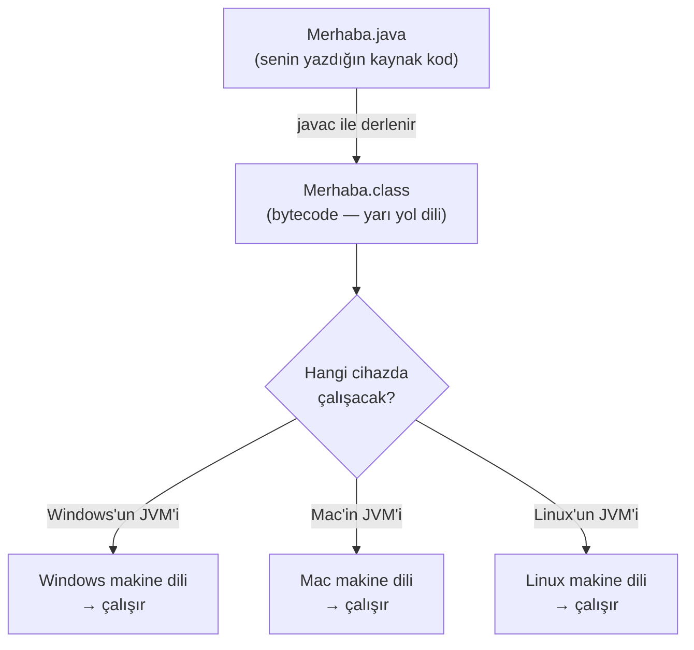

Gördün mü marifeti? Sen `Merhaba.java`'yı **bir kez** yazıyorsun, `javac` onu **bir kez** bytecode'a
çeviriyor. Sonra o aynı bytecode; Windows'ta, Mac'te, Linux'ta çalışabiliyor. "Bir kez yaz, her yerde
çalıştır" işte tam olarak bu.

### Bir saniye: bu neden bu kadar önemli? (C ile karşılaştıralım)

Bu "ara durak" fikrinin ne kadar akıllıca olduğunu görmek için, Java'dan önceki dünyaya bakalım.
Java'dan eski bir dil olan **C**'yi ele al. C'de yazdığın kod, doğrudan **o cihazın makine diline**
derlenir. Yani Windows için ayrı, Mac için ayrı, Linux için ayrı derlemen (çoğu zaman kodu da biraz
değiştirmen) gerekir. Üç işletim sistemi demek, üç ayrı derleme ve üç ayrı çalıştırılabilir dosya
demek:

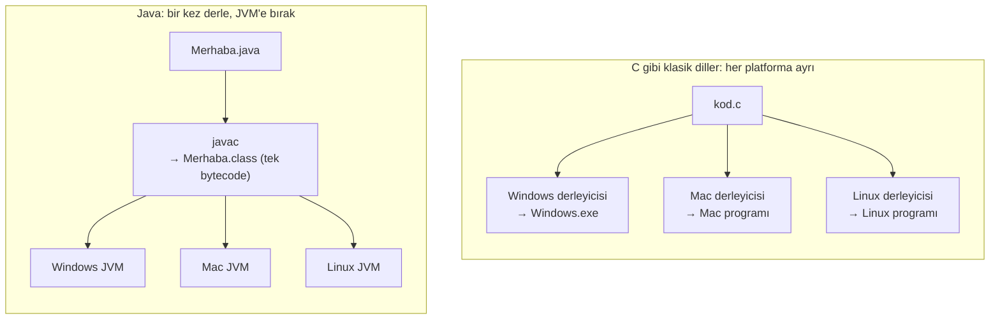

Farkı gördün mü? C'de **kaynak koddan itibaren** her platform için ayrı bir yol var. Java'da ise
zahmetli kısım (kaynak koddan bytecode'a çeviri) **bir kez** yapılıyor; platformlar arasındaki tek
fark, en sondaki JVM. Yani Java, "farklı cihaz" derdini senin kodundan alıp **JVM'in içine** gömüyor.
Sen tek bir bytecode üretiyorsun, gerisini her cihazın kendi JVM'i hallediyor. Java'nın o ünlü
sloganı **"bir kez yaz, her yerde çalıştır"**ın altında yatan mühendislik işte tam olarak bu.

### Peki bytecode gerçekte neye benzer?

"Bytecode" deyip geçtik ama merak ediyorsundur: bu ara dil tam olarak nasıl bir şey? Gel, kaputu
açıp bakalım.

Bytecode, gerçek bir işlemci için değil, **hayalî bir bilgisayar** (yani JVM) için yazılmış komutlardan
oluşur. Bu hayalî bilgisayar bir **"yığın makinesi"** (stack machine) gibi çalışır: işlemleri yaparken
değerleri bir tabak yığınına koyar gibi üst üste dizer, sonra en üsttekileri alıp işler. Komutların
her biri **tek bir byte'a** (0–255 arası bir sayıya) sığar; işte "byte-code" (byte-kod) adı buradan
gelir. Toplamda yaklaşık 200 kadar farklı komut vardır.

Somut bir örnek görelim. Diyelim ki Java'da şöyle bir satır yazdın: iki sayıyı toplayıp bir üçüncüsüne
koyuyorsun (`c = a + b`). `javac` bunu şuna benzer bytecode komutlarına çevirir:

```text title="c = a + b  →  bytecode" showLineNumbers=false
iload_1      # a'nın değerini yığının üstüne koy
iload_2      # b'nin değerini yığının üstüne koy
iadd         # üstteki iki değeri çek, topla, sonucu yığına koy
istore_3     # sonucu çek ve c'ye yaz
```

Yığının her adımda nasıl değiştiğini izleyelim (a = 5, b = 3 diyelim); tıpkı
[algoritma serisindeki izleme tablosu](/blog/degiskenler) gibi:

```text showLineNumbers=false
iload_1   →  yığın: [5]
iload_2   →  yığın: [5, 3]
iadd      →  yığın: [8]        (5 ve 3 çekildi, 8 kondu)
istore_3  →  yığın: []         (8 çekilip c'ye yazıldı → c = 8)
```

Fark ettin mi: senin tek satırlık `c = a + b`'in, dört minik komuta bölündü. İşlemcinin sevdiği şey de
bu: çok basit, çok küçük adımlar. Aynı `System.out.println("Merhaba")` da kabaca şuna dönüşür: önce
ekranı temsil eden nesne yığına konur, sonra `"Merhaba"` metni yığına konur, sonra "yazdır" komutu
çağrılır. [Fonksiyon çağırmayı](/blog/fonksiyonlar) hatırlıyor musun? Bytecode seviyesinde bir
fonksiyon çağrısı da işte böyle görünüyor.

<Callout type="tip" title="Bunları ezberlemene gerek yok">
Sakın panik yapma: `iload`, `iadd` gibi komutları asla elle yazmayacaksın, ezberlemene hiç gerek yok.
Bunları sana gösteriyorum ki "javac kodumu bir şeye çeviriyor" cümlesindeki o "bir şey"in gözünde bir
karşılığı olsun. Sen rahatça `c = a + b` yazacaksın; bu minik komutlara bölme işini `javac` senin
yerine yapacak. (Merak eden biri, kendi kodunun bytecode'unu ileride `javap -c` diye bir komutla
gerçekten görebilir — ama o çok sonra.)
</Callout>

<Callout type="note" title="Küçük bir sır: her .class dosyası kahveyle başlar">
İşte söz verdiğim ikinci kahve esprisi. Her `.class` (bytecode) dosyasının **en başındaki dört byte**
hep aynıdır ve onaltılık (hex) sayı sistemiyle şöyle yazılır: `CA FE BA BE`. Yani `CAFEBABE`. JVM bir
dosyayı açtığında ilk iş bu dört byte'a bakar; "CAFEBABE" ile başlamıyorsa "bu geçerli bir Java sınıf
dosyası değil" der ve reddeder. Buna **sihirli sayı** (magic number) denir. Gosling'in ekibi, bu dört
byte'ı yine kahve şakasıyla seçmiş: "CAFE BABE". Java'nın en dibinde bile kahve kokusu var.
</Callout>

## JVM'in içi: katman katman

Şimdi işin en can alıcı kısmına geldik. "JVM bytecode'u çalıştırır" dedik ama JVM tek parça bir kutu
değil; içinde birbiriyle çalışan **üç büyük alt sistem** var. Bir bytecode dosyasının (yani senin
programının) JVM içindeki yolculuğunu şu şemayla düşün:

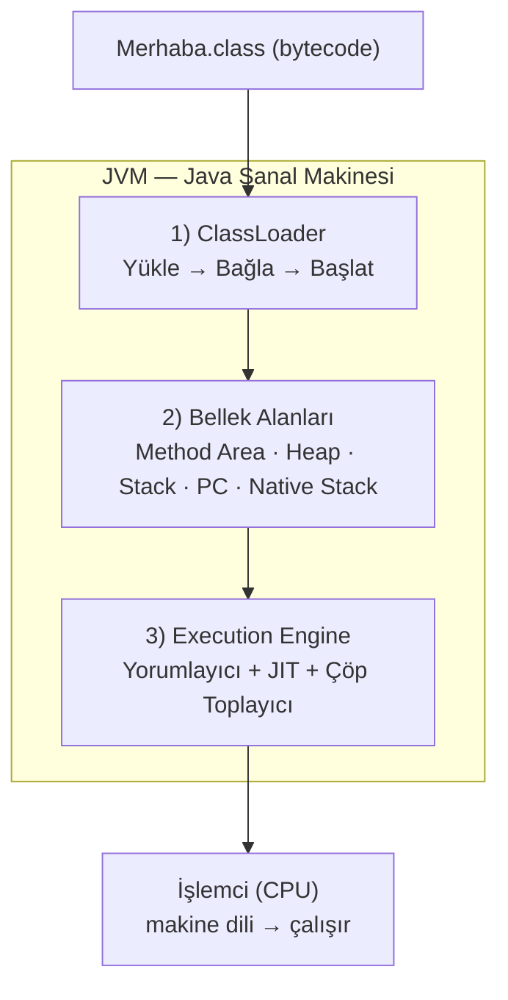

Gel bu üç katmanı tek tek açalım.

### 1. ClassLoader: sınıfları içeri alan kapı

Programın çalışmaya başlamadan önce, bytecode'unun (`.class` dosyalarının) bellekten içeri alınması
gerekir. Bu işi **ClassLoader** (Sınıf Yükleyici) yapar. Üç aşamada çalışır:

<Steps>
1. **Yükle (Loading):** `.class` dosyasını bulur ve içindeki bytecode'u belleğe okur. Bunu yapan
   birkaç yükleyici vardır: en temeldeki *Bootstrap* (Java'nın kendi çekirdek sınıflarını yükler),
   onun üstünde *Platform* ve en dışta *Application* (senin yazdığın sınıfları yükleyen).
2. **Bağla (Linking):** Üç küçük adımı var. *Doğrula* — bytecode güvenli ve kurallara uygun mu diye
   kontrol eder (bozuk ya da zararlı bir dosya buradan geçemez; Java'nın güvenliğinin bir parçası).
   *Hazırla* — sınıfın değişkenleri için bellekte yer ayırır. *Çöz* — bir parçanın başka bir parçaya
   yaptığı göndermeleri gerçek adreslere bağlar.
3. **Başlat (Initialization):** Sınıfın başlangıç değerleri atanır, hazırlık kodları çalışır. Artık
   sınıf kullanıma hazırdır.
</Steps>

Bu yükleyicilerin çalışma biçiminde hoş bir kural var: **"önce üste sor"** (buna *parent delegation*
denir). Senin sınıfını yükleyecek olan Application yükleyicisi işe hemen girişmez; önce bir üstündeki
Platform'a, o da bir üstündeki Bootstrap'e "bunu sen yükleyebilir misin?" diye sorar. En tepeden
kimse yükleyemezse iş en alttaki Application'a geri döner.

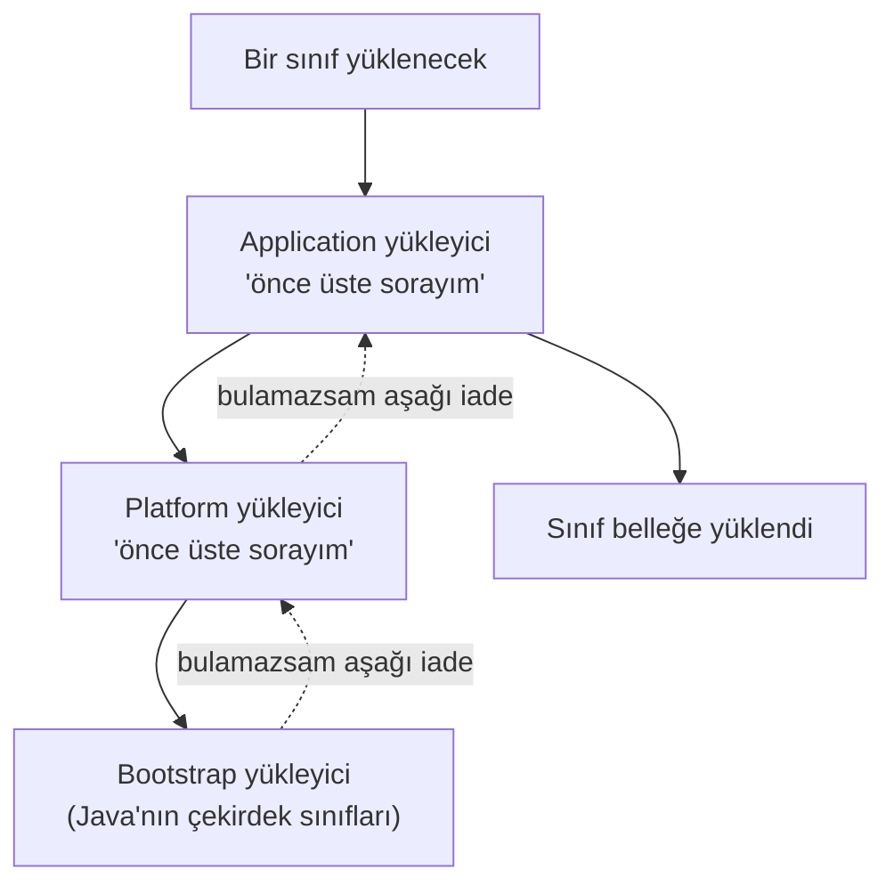

Bu sıra neden var? Güvenlik için. Bu sayede, örneğin sen yanlışlıkla `String` adında bir sınıf yazsan
bile, Java'nın gerçek çekirdek `String`'ini **ezemezsin;** çünkü çekirdek sınıflar hep en güvenilir
kaynaktan, en tepedeki Bootstrap'ten yüklenir.

### 2. Çalışma zamanı bellek alanları: programın çalışırken kullandığı yer

Program çalışırken bilgileri bir yerde tutması gerekir. JVM bu belleği düzenli bölmelere ayırır. En
önemli ikisiyle başlayalım:

- **Heap (Yığın Alanı):** Programın oluşturduğu bütün **nesneler** burada yaşar. Büyük, ortak bir
  depo gibi düşün; birazdan tanışacağımız çöp toplayıcının çalıştığı yer de burasıdır.
- **Stack (Yığın / Metot Çağrı Yığını):** Bir [fonksiyon (metot)](/blog/fonksiyonlar) her
  çağrıldığında, ona ait bilgiler (yerel değişkenleri gibi) burada bir "çerçeve" (frame) olarak
  üst üste konur; fonksiyon bitince o çerçeve kaldırılır. [Fonksiyonlardaki](/blog/fonksiyonlar)
  "yerel değişkenler fonksiyon bitince yok olur" kuralını hatırla — işte fiziksel sebebi bu.

Bunların yanında üç bölme daha var: **Method Area** (sınıfların yapısı, ortak bilgileri ve sabitleri
burada tutulur), **PC Register** (o an hangi komutta olduğumuzu tutan minik bir işaretçi) ve **Native
Stack** (Java dışı, örneğin C ile yazılmış kodlar için).

<Callout type="note" title="Ortak mı, kişiye özel mi?">
Küçük ama önemli bir ayrım: **Heap** ve **Method Area** bütün program tarafından **ortak** kullanılır
(tek bir tane vardır). **Stack, PC Register ve Native Stack** ise her **iş parçacığına** (thread; yani
aynı anda yürüyen her ayrı iş koluna) **özeldir** — her birinin kendi kopyası olur. Bu yüzden iki iş
kolu aynı anda çalışırken kendi yerel değişkenlerini birbirine karıştırmaz. ([Fonksiyonlardaki](/blog/fonksiyonlar)
"her fonksiyonun kendi karalama defteri" fikrinin bir üst katmanı.)
</Callout>

Heap ile Stack'in farkını küçük bir örnekle canlandıralım, çünkü bu ikisi Java'da sürekli karşına
çıkacak. Diyelim bir metot çalışıyor ve içinde bir "kişi" nesnesi oluşturuyorsun. Nesnenin
**kendisi** (adı, yaşı gibi bilgileriyle) Heap'te durur; metodun elindeki, o nesneyi *işaret eden*
küçük bir bağlantı (referans) ise Stack'teki çerçevede durur. Yani Stack'te nesneye giden bir **ok,**
Heap'te nesnenin **kendisi** olur:

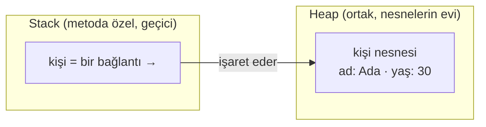

Metot bittiğinde Stack'teki çerçeve (o ok dahil) anında silinir. Peki Heap'teki nesnenin kendisi?
İşte çöp toplayıcının devreye girdiği yer tam da burası: eğer o nesneyi işaret eden **başka hiçbir ok
kalmadıysa,** nesne artık ulaşılamaz demektir ve GC onu temizler. Hemen aşağıda buna bakıyoruz.

### 3. Execution Engine: bytecode'u asıl çalıştıran motor

Bytecode yüklendi, belleğimiz hazır. Şimdi asıl işi yapan kısma geldik: **Execution Engine**
(Çalıştırma Motoru). İçinde üç önemli oyuncu var.

**Yorumlayıcı (Interpreter).** Bytecode'u en baştan, satır satır okuyup çalıştırır. Hemen başlar,
beklemezsin. Ama bir kod parçası defalarca çalışıyorsa, onu her seferinde yeniden çevirmek zaman
kaybıdır.

**JIT Derleyici.** İşte Java'nın hızlanma numarası. JIT, "Just-In-Time" yani "tam zamanında" demek.
JVM programı çalıştırırken bir yandan da izler: hangi kod parçaları **çok sık** çalışıyor? Sık çalışan
bu parçalara **"sıcak kod"** (hot code) denir. JVM sıcak bir kodu görünce, onu yorumlamayı bırakıp
**bir kez makine diline derler ve saklar;** sonraki her çağrıda o hazır, şimşek hızındaki sürümü
kullanır. Yani program çalıştıkça kendi kendine hızlanır.

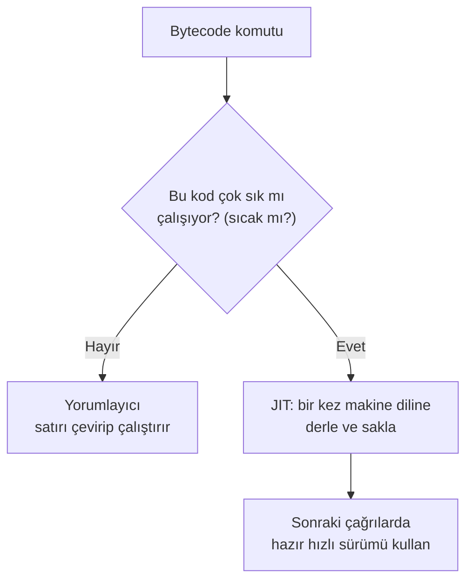

<Callout type="important" title="Java hem taşınabilir hem hızlı: sırrı bu">
Baştaki "derleyici mi, yorumlayıcı mı?" sorusunu hatırla. Java **ikisini birden** kullanır: taşınabilir
olsun diye bytecode'u yorumlayarak başlar (her cihazda çalışır), hızlı olsun diye de sık kodu JIT ile
makine diline derler. Bu ikisini birleştiren teknolojinin adı **HotSpot** (yani "sıcak nokta"; sık
çalışan, kızışan kod parçalarını bulup onlara odaklandığı için). Bu yüzden Java, "yorumlanan diller
yavaştır" kalıbını kırar: ilk saniyelerden sonra çoğu Java programı neredeyse yerel kod kadar hızlıdır.
</Callout>

**Çöp Toplayıcı (Garbage Collector).** Üçüncü oyuncu, belki de yeni başlayanı en çok rahatlatan parça.
Heap'te oluşturduğun nesneler yer kaplar. Bazı dillerde (örneğin C'de), bir nesneyle işin bitince o
belleği **elle** geri vermen gerekir; unutursan bellek dolar, program şişer. Java'da ise bu işi **Çöp
Toplayıcı** (GC) senin yerine yapar: arka planda dolaşır, artık hiçbir yerden ulaşılamayan (yani
kimsenin kullanmadığı) nesneleri bulur ve belleklerini otomatik temizler. Sen "şu nesneyi sil"
demezsin; GC, çöpe dönüşmüş nesneleri kendisi toplar. Bu, Java'yı yazması daha rahat ve daha az hataya
açık kılan en büyük sebeplerden biridir.

Peki GC bir nesnenin "çöp" olduğunu nasıl anlıyor? Ölçüt tek kelime: **ulaşılabilirlik.** JVM,
programın hâlâ elinde tuttuğu "kök" bağlantılardan (çalışan metotların Stack'teki değişkenleri gibi)
başlar; oklardan oklara giderek nelere erişebildiğine bakar. Bu zincirin ucundan ulaşılabilen her
nesne **canlıdır,** korunur. Hiçbir zincirle ulaşılamayan nesneler ise **çöptür.**

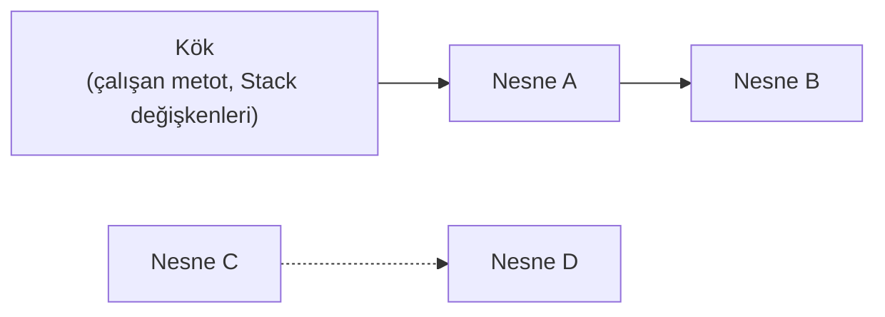

Yukarıda A ve B köke bağlı, yani **canlı;** korunurlar. C ve D ise birbirini işaret etse bile köke
hiçbir yoldan bağlı değil; ikisi de **ulaşılamaz,** yani çöp. GC bir sonraki turunda C ile D'nin
belleğini geri alır; sen tek bir "sil" komutu bile yazmadan. (Bu "birbirini tutan ama kimsenin
ulaşamadığı ada" durumu, elle bellek yöneten dillerde en sinsi hata türlerinden biridir; Java'da GC
bunu senin için halleder.)

<Callout type="note" title="Bir de JNI köprüsü var">
Son bir ayrıntı: bazen Java, işletim sisteminin çok derinindeki, doğrudan Java'yla yazılmamış (örneğin
C/C++ ile yazılmış) kodlarla konuşmak ister. Bunu **JNI** (Java Native Interface) denen bir köprü ve
"native" kütüphaneler sağlar. Çok sık uğraşacağın bir şey değil, ama JVM şemalarında adını görürsen
"Java'nın dış dünyaya açılan kapısı" diye hatırla.
</Callout>

## JDK, JRE, JVM: bu üç harf yığını da ne?

Bunca iç yapıyı gördükten sonra, sık karşılaşacağın şu üç kısaltmayı yerine oturtalım. Birbirinin
içine geçmiş üç halka gibi düşün.

En içte, artık iyi tanıdığımız **JVM** var: bytecode'u çalıştıran, yukarıda katman katman incelediğimiz
motor.

Onu saran **JRE** (Java Runtime Environment): JVM'in yanına, programların sık ihtiyaç duyduğu hazır
kütüphaneleri de ekler. Bir Java programını yalnızca **çalıştırmak** istiyorsan (örneğin başkasının
yazdığı bir programı) sana bu yeter.

En dışta **JDK** (Java Development Kit): JRE'nin üstüne, program **yazmak** için gereken araçları
koyar; en önemlisi de kodunu bytecode'a çeviren `javac` derleyicisi. Sen bu seride Java **yazacağın**
için, senin kuracağın şey JDK olacak.

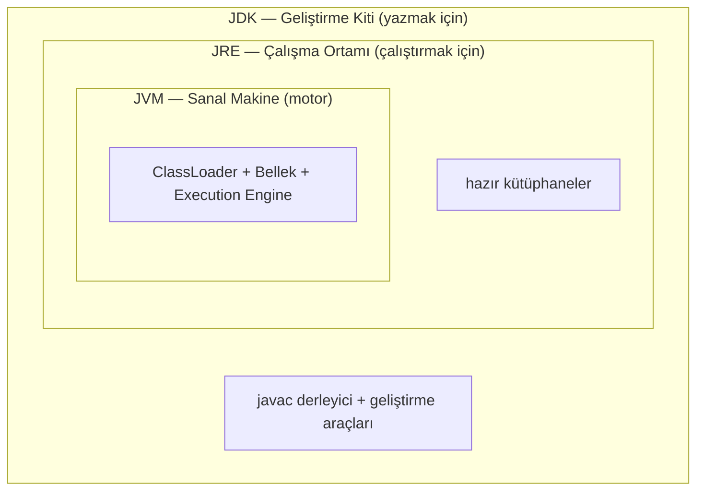

Tek cümlede: **yazmak için JDK, sadece çalıştırmak için JRE, işi asıl yapan motor da JVM.** Bir Rus
matruşka bebeği gibi, biri diğerinin içinde.

## Her şeyi bir arada: bir programın uçtan uca yolculuğu

Çok şey öğrendik: kaynak kod, javac, bytecode, ClassLoader, bellek, yorumlayıcı, JIT, çöp toplayıcı...
Şimdi hepsini tek bir resimde birleştirelim ki büyük resim kafanda otursun. Sen `Merhaba.java`'yı
yazıp "çalıştır" dediğinde perde arkasında, sırayla, şunlar olur:

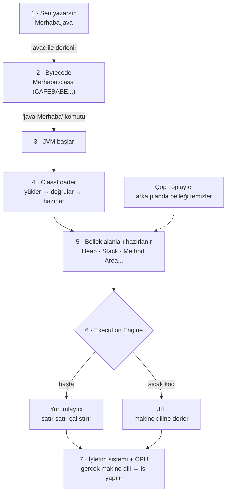

Adımları tek cümleyle özetleyelim: **(1)** sen okunabilir Java yazarsın; **(2)** `javac` onu
taşınabilir bytecode'a çevirir; **(3–4)** `java` komutu JVM'i başlatır, ClassLoader bytecode'u içeri
alıp doğrular; **(5)** bellek bölmeleri hazırlanır; **(6)** Execution Engine önce yorumlar, sık
çalışan kodu JIT ile makine diline derler; **(7)** en altta gerçek işletim sistemi ve işlemci işi
yapar; ve tüm bu süre boyunca **çöp toplayıcı** arka planda kullanılmayan belleği toplar. "Java nasıl
çalışır?" sorusunun tam cevabı işte bu tek şema.

## İlk kodumuza küçük bir bakış

Bunca kaputun altını gördükten sonra, en tepeye, senin yazacağın koda dönelim. Ekrana "Merhaba,
dünya!" yazan bir Java programı, on yıllardır her kitapta göreceğin **klasik** hâliyle şöyle görünür:

```java title="Merhaba.java — klasik biçim" showLineNumbers=false
public class Merhaba {
    public static void main(String[] args) {
        System.out.println("Merhaba, dünya!");
    }
}
```

Az önce bunun kaputun altında nelere dönüştüğünü gördük: `javac` bunu bytecode'a (`Merhaba.class`,
`CAFEBABE` ile başlayan) çevirir; ClassLoader yükler; Execution Engine önce yorumlar, sık çalışırsa
JIT ile makine diline derler.

Şimdi güzel bir haber. Java hâlâ gelişiyor, ve en güncel sürüm olan **Java 25** (2025) yeni
başlayanların işini epey kolaylaştırdı. Yıllarca zorunlu olan o `public static void main(String[] args)`
kalıbı **artık zorunlu değil;** tam olarak aynı programı şu kadarına indirebiliyorsun:

```java title="Merhaba.java — Java 25 sade biçim" showLineNumbers=false
void main() {
    IO.println("Merhaba, dünya!");
}
```

İki program da birebir aynı işi yapıyor: ekrana "Merhaba, dünya!" yazıyor. Ama ikincisinde o
korkutucu kalabalık yok. İşin özüne bak; ikisinde de aynı: ekrana bir şey yazdırmak. Hani
[Algoritmalar serisinde](/blog/algoritma-nedir) `YAZ "Merhaba"` diyorduk ya? İşte `System.out.println`
(ve Java 25'teki daha kısa kardeşi `IO.println`) tam olarak onun Java'daki karşılığı.

<Callout type="tip" title="Peki klasik biçimi neden hâlâ öğreneceğiz?">
Aklına şu gelebilir: "Madem Java 25 bu kadar sadeleştirdi, o uzun kalıbı hiç öğrenmesem olmaz mı?"
Olmaz, çünkü dünyadaki mevcut Java kodunun neredeyse tamamı hâlâ o klasik `public static void
main(String[] args)` biçiminde yazılmış. Kitaplarda, eski derslerde, iş yerinde onu her gün
göreceksin; o yüzden tanımak zorundasın. Bu seride ikisini de kullanacağız: başlarken seni boğmasın
diye çoğu zaman **sade Java 25 biçimini,** ama klasik kalıbı da, `public`, `static`, `void`, `main`,
`String[] args` ne demek diye satır satır açarak. Hepsinin bir hikâyesi var, sırası gelince
anlatacağız. Önemli olan şu: içerideki asıl iş, senin zaten
[algoritma olarak düşünmeyi öğrendiğin](/blog/algoritma-nedir) mantık. Java ona sadece bir kılıf
giydiriyor; Java 25 de o kılıfı bir hayli inceltti.
</Callout>

## Kendin düşün

Bu yazıda kod yazmadık ama birkaç küçük soruyla öğrendiklerini pekiştirebilirsin. Kalem kâğıt yeter.

### Soru 1 — Her şey sayıysa... (kolay)

> Metinde büyük "A" harfinin sayısının 65 olduğunu ve binary karşılığının `01000001` olduğunu
> söyledik. Sıradaki harf "B"nin sayısı 66'dır. Sence "B"nin binary karşılığı ne olur?

<Callout type="note" title="İpucu">
Binary'de sayarken, tıpkı normal sayılar gibi bir sonrakine geçmek için "bir eklersin". 65 = `01000001`
idi. En sağdaki basamağa bir eklemeyi dene: `01000001` → `01000010`. İşte "B" harfi bilgisayarın
gözünde `01000010`. (Fark ettin mi: A, B, C... hepsi ardışık sayılar. Bu yüzden bilgisayar harfleri
sıraya dizmeyi de kolayca yapıyor.)
</Callout>

### Soru 2 — Yığın makinesi (orta)

> `c = a + b` satırının `iload`, `iload`, `iadd`, `istore` komutlarına dönüştüğünü gördük. Şimdi
> `a = 10`, `b = 4` için yığının her adımda nasıl göründüğünü kendi elinle yaz. Sonuçta `c` kaç olur?

<Callout type="note" title="İpucu">
Yazıdaki izlemenin aynısını yap: `iload_1` → `[10]`, `iload_2` → `[10, 4]`, `iadd` (ikisini çek,
topla) → `[14]`, `istore_3` (çek ve c'ye yaz) → `[]`, ve `c = 14`. Yığın, üst üste konan tabaklar
gibi: hep en üstteki(ler)le iş yaparsın.
</Callout>

### Soru 3 — JVM'in üç katmanı (orta)

> JVM'in üç ana alt sistemini ve her birinin tek cümlelik görevini, bakmadan hatırlamaya çalış. Sonra
> şunları doğru katmana yerleştir: (a) Heap, (b) javac'ın ürettiğini belleğe alan kısım, (c) sıcak
> kodu makine diline derleyen kısım.

<Callout type="note" title="İpucu">
Üç katman: **ClassLoader** (yükler), **Bellek Alanları** (çalışırken bilgiyi tutar), **Execution
Engine** (çalıştırır). Yerleştirme: (a) Heap → Bellek Alanları; (b) yükleyen → ClassLoader; (c) sıcak
kodu derleyen → Execution Engine içindeki **JIT.**
</Callout>

### Soru 4 — Doğru eşleştir (kolay)

> Şunları eşleştir: (a) JVM, (b) JRE, (c) JDK — ile — (1) Java yazmak için gereken tam takım,
> (2) programı çalıştıran motor, (3) sadece çalıştırmak için gereken orta paket.

<Callout type="note" title="İpucu">
Halkaları hatırla: en içteki motor JVM (a→2), onu saran çalıştırma paketi JRE (b→3), en dıştaki
yazma takımı JDK (c→1). Sen Java yazacağın için kuracağın şey (c) JDK.
</Callout>

## Java'yı Java yapan özellikler

Java'nın nasıl çalıştığını artık biliyorsun. Peki Java'yı bu kadar sevilen ve yaygın kılan temel
özellikler neler? Güzel haber: çoğunu bu yazıda çoktan gördün. Bir araya toplayalım:

| Özellik | Ne demek? | Bu yazıda nerede geçti |
| --- | --- | --- |
| **Platform bağımsız** | Bir kez yaz, her yerde çalıştır; kodun cihaza takılmaz | Bytecode + JVM, C karşılaştırması |
| **Nesne yönelimli** | Programı, gerçek dünyadaki "şeyler" (nesneler) etrafında kurarsın | İleriki yazılarda derinleşeceğiz |
| **Otomatik bellek yönetimi** | Belleği elle temizlemezsin; çöp toplayıcı halleder | Garbage Collector |
| **Güvenli** | Bozuk ya da zararlı bytecode, çalışmadan doğrulamayı geçemez | ClassLoader'ın "doğrula" adımı |
| **Sağlam (robust)** | Hataları erken yakalayan, çökmeye dirençli bir yapı | Tip kontrolü + doğrulama |
| **Çok iş parçacıklı** | Aynı anda birden çok işi paralel yürütebilir | Her iş parçacığına özel Stack |
| **Hızlı** | JIT sayesinde ilk saniyelerden sonra neredeyse yerel kod kadar | HotSpot / JIT |

Not: **"Nesne yönelimli"** (object-oriented) kısmını henüz açmadık; o başlı başına bir konu ve bu
serinin bel kemiğini oluşturacak. Şimdilik "Java, programı gerçek dünyadaki nesneler gibi parçalara
ayırmana izin verir" diye aklının bir köşesinde dursun; ilerleyen yazılarda uzun uzun işleyeceğiz.

## Java'nın kısa sürüm tarihi

Java 1995'te duyurulup 1996'daki ilk sürümüyle yola çıktığından beri hiç durmadı. Otuz yıla yakın
sürede her sürüm dile onlarca yenilik kattı. Aşağıdaki tablo, dönüm noktası sürümleri ve her birinin
**öne çıkan birkaç** yeniliğini gösteriyor — dikkat: bunlar sadece başlıcaları, her sürümde bundan çok
daha fazla değişiklik var. Hepsini şimdi anlamana gerek yok; bunu, ileride "hangi özellik hangi
sürümde gelmiş?" diye dönüp bakabileceğin bir harita gibi düşün.

| Sürüm | Yıl | Öne çıkan yenilikler (yalnızca birkaçı) |
| --- | --- | --- |
| Java 1.0 | 1996 | İlk sürüm; "bir kez yaz, her yerde çalıştır", applet'ler, AWT arayüzü |
| Java 2 (1.2) | 1998 | Koleksiyonlar (List/Map/Set), Swing arayüz kütüphanesi |
| Java 5 | 2004 | Generics, `enum`, annotation'lar, autoboxing, gelişmiş `for`, `java.util.concurrent` |
| Java 7 | 2011 | try-with-resources, diamond `<>`, `switch`'te String, yeni dosya API'si (NIO.2) |
| **Java 8** (LTS) | 2014 | **Lambda ifadeleri, Stream API,** `Optional`, yeni tarih/saat API'si (`java.time`) — büyük dönüm noktası |
| Java 9 | 2017 | Modül sistemi (Jigsaw), JShell; buradan sonra her 6 ayda bir yeni sürüm |
| Java 10 | 2018 | `var` ile yerel değişkende tip çıkarımı |
| **Java 11** (LTS) | 2018 | Modern HTTP istemcisi, tek dosyayı derlemeden çalıştırma, yeni `String` metotları |
| Java 14 | 2020 | `record` (önizleme), `switch` ifadeleri, yardımcı NullPointerException mesajları |
| Java 15 | 2020 | Metin blokları (`"""..."""`), `sealed` sınıflar (önizleme) |
| **Java 17** (LTS) | 2021 | `sealed` sınıflar, `instanceof` desen eşleme, `record`'lar; iç yapıların güçlü kapsüllenmesi |
| Java 19 | 2022 | Sanal iş parçacıkları (virtual threads, önizleme) |
| **Java 21** (LTS) | 2023 | **Sanal iş parçacıkları,** `switch`'te desen eşleme, `record` desenleri, sıralı koleksiyonlar |
| **Java 25** (LTS) | 2025 | Kompakt kaynak dosyaları + sade `main` (JEP 512), esnek yapıcı gövdeleri, modül içe aktarma, scoped values |

<Callout type="note" title="LTS ne demek, neden önemli?">
Tabloda bazı sürümlerin yanında **LTS** yazıyor: "Long Term Support", yani **uzun süreli destek.**
Java 9'dan (2017) beri her 6 ayda bir yeni sürüm çıkıyor, ama bunların çoğu yalnızca birkaç yıl
desteklenir. Şirketler her 6 ayda bir büyük güncelleme derdine girmesin diye, birkaç yılda bir sürüm
"uzun süre desteklenecek" diye işaretlenir. Bugün en yaygın LTS'ler Java 8, 11, 17, 21 ve en yenisi
25. Yeni başlıyorsan en güncel LTS olan **Java 25** ile başlaman en mantıklısı; bu seride de onu
kullanacağız. (Ve gördüğün gibi Java 25 "sadece `main`" değil; sadeleştirilmiş `main`, o sürümün
öne çıkan pek çok yeniliğinden yalnızca biri.)
</Callout>

## Özet ve sırada ne var?

<Callout type="tip" title="Cebine koy">
- **Java,** bir bilgisayara ne yapacağını anlatmak için kullandığımız, 1995'ten beri var olan çok
  yaygın bir dildir; Android'den bankalara, dev web sitelerinden Minecraft'a kadar her yerde.
- Bir bilgisayar en temelde yalnızca **0 ve 1'i** (binary) anlar; işlemcinin çalıştırdığı bu dile
  **makine dili** denir. Sekiz bit bir **byte** eder.
- Java kodun önce **bytecode'a** çevrilir: hayalî bir **yığın makinesi** için yazılmış, her biri bir
  byte'a sığan minik komutlar (`iload`, `iadd`...). Her `.class` dosyası `CAFEBABE` ile başlar.
- **JVM'in üç katmanı** var: **ClassLoader** (yükle-bağla-başlat), **Bellek Alanları** (Heap, Stack,
  Method Area, PC, Native), **Execution Engine** (yorumlayıcı + JIT + çöp toplayıcı).
- **JIT,** sık çalışan "sıcak" kodu makine diline derleyip saklar (HotSpot); Java bu yüzden hem
  taşınabilir hem hızlıdır. **Çöp toplayıcı (GC),** kullanılmayan nesnelerin belleğini senin yerine
  temizler.
- **JDK ⊃ JRE ⊃ JVM:** yazmak için JDK, çalıştırmak için JRE, motor JVM.
- Java'yı öne çıkaran şey: **platform bağımsızlık** (bytecode + JVM), **otomatik bellek yönetimi**
  (çöp toplayıcı), **güvenlik** (bytecode doğrulama) ve **hız** (JIT).
- **Java 25** (2025, en güncel LTS) o klasik `public static void main` kalıbını zorunlu olmaktan
  çıkardı; biz de bu sürümle ilerleyeceğiz.
- Sırada: bilgisayarımıza Java'yı (JDK) kurmak ve o ilk `Merhaba, dünya!` programını satır satır, kendi
  ellerimizle çalıştırmak var.
</Callout>
