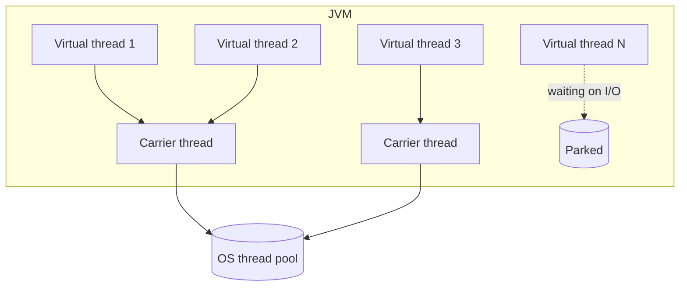

import Callout from '../../components/Callout.astro';
import Steps from '../../components/Steps.astro';
import ProsCons from '../../components/ProsCons.astro';

**Virtual threads** became stable in Java 21 after years of development under the
name _Project Loom_. In one sentence: you can now run millions of concurrent tasks
with the simplicity of the classic `thread-per-request` model, but without the cost
of platform threads.

This post explains what virtual threads are, why they matter, and how to use them in
real code — plus the pitfalls to know before you fall into them. For more Java
content, see my [Java page](/en/java).

## The problem: platform threads are expensive

A classic Java thread (a platform thread) maps **one-to-one** to an operating-system
thread. Each reserves ~1 MB of stack and is scheduled by the OS. We'd love
"one thread per request" because the code stays simple and readable — but after a few
thousand threads, memory and context-switching costs stop you.

That's why for years we reached for **reactive** and **asynchronous** APIs:
`CompletableFuture`, callback chains, reactive streams... Performant, but hard to read
and debug.

<Callout type="note" title="In short">
Virtual threads let you get "simple, synchronous-looking code" and "high scalability"
at the same time — without the complexity of async.
</Callout>

## What is a virtual thread?

A virtual thread is a lightweight thread **scheduled by the JVM**. It is not
permanently bound to an OS thread; it only mounts onto a **carrier platform thread**
while it is actually doing work (using the CPU). When it blocks on an I/O call
(network, file, database), the JVM **unmounts** it from the carrier and hands the
carrier to another virtual thread.

The result: tens of thousands of virtual threads run on a handful of OS threads.



## How to create one

The simplest way to start a virtual thread:

```java title="Simple virtual thread" {1}
Thread.startVirtualThread(() -> {
    System.out.println("Hello, virtual world!");
});
```

In practice you manage tasks with an `ExecutorService`. The key is to use the executor
that starts **a new virtual thread per task**.

```java title="One virtual thread per task" ins={3} {6-9}
import java.util.concurrent.Executors;

try (var executor = Executors.newVirtualThreadPerTaskExecutor()) {
    for (int i = 0; i < 10_000; i++) {
        int taskId = i;
        executor.submit(() -> {
            // I/O-bound work — e.g. an HTTP call
            var result = callRemoteService(taskId);
            process(result);
        });
    }
} // executor.close() waits for all tasks to finish
```

Those 10,000 tasks run **without** opening 10,000 OS threads, and the code stays fully
synchronous and readable.

## Step by step: enabling it in Spring Boot

With Spring Boot 3.2+ you can enable virtual threads with a single setting:

<Steps>

1. Make sure you're on Java 21+ (`java -version`).

2. Add this line to `application.properties`:

   ```properties title="application.properties"
   spring.threads.virtual.enabled=true
   ```

3. Start the app. Tomcat now handles each HTTP request on a **virtual** thread — with
   no changes to your code.

</Steps>

<Callout type="tip" title="Measure, don't guess">
Load-test before and after (e.g. `wrk` or `k6`). The gain depends on how I/O-bound
your workload is.
</Callout>

## When to use it, when to avoid it

<ProsCons
	prosTitle="Pros"
	consTitle="Cons"
	pros={[
		'I/O-bound, highly concurrent workloads (web servers, API gateways)',
		'Synchronous, readable code — no async complexity',
		'Works with existing blocking APIs (JDBC, HttpClient)',
		'Very cheap: tens of thousands of threads are fine',
	]}
	cons={[
		'No benefit for CPU-bound work (a classic pool is better)',
		'Long synchronized blocks can cause pinning',
		'Overusing ThreadLocal creates memory pressure',
		'Profiling/tooling is still maturing',
	]}
/>

## Watch out: the "pinning" trap

If a virtual thread blocks on I/O **while inside** a `synchronized` block, it gets
**pinned** to its carrier thread and can't release it. Lots of pinning can erase the
entire benefit of virtual threads.

```java title="Avoid: synchronized + I/O" del={2-4}
synchronized (lock) {
    // ❌ Long I/O under a lock → pinning
    var data = database.query(sql);
    cache.put(key, data);
}
```

```java title="Prefer: ReentrantLock" ins={4-9}
private final ReentrantLock lock = new ReentrantLock();

// ✓ ReentrantLock does not cause pinning
lock.lock();
try {
    var data = database.query(sql);
    cache.put(key, data);
} finally {
    lock.unlock();
}
```

<Callout type="warning" title="Don't pool them">
Pooling virtual threads is an **anti-pattern**. They are single-use and cheap — start
a fresh one per task. What you should pool is the expensive resource the virtual thread
accesses (e.g. a database connection).
</Callout>

## Conclusion

Virtual threads make concurrency in Java **simple** again: write synchronous code, yet
scale high. The key rules:

- Start a new virtual thread per task; don't pool.
- Use them for I/O-bound work; stay on classic pools for CPU-bound work.
- Avoid `synchronized` + long I/O; use `ReentrantLock`.
- Always **measure**.

For more, browse the [#java](/en/etiket/java) and [#concurrency](/en/etiket/concurrency)
tags, or the curated [Java page](/en/java).
