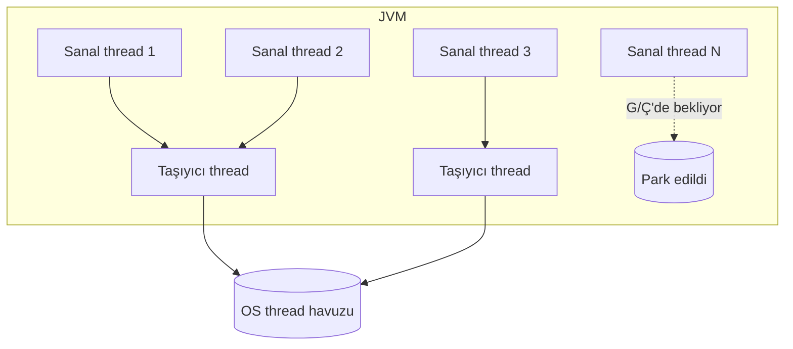

import Callout from '../../components/Callout.astro';
import Steps from '../../components/Steps.astro';
import ProsCons from '../../components/ProsCons.astro';
import Kbd from '../../components/Kbd.astro';

**Sanal iş parçacıkları (virtual threads)**, Java 21 ile kararlı hale gelen ve
yıllardır _Project Loom_ adıyla geliştirilen bir özellik. Tek cümleyle: artık
milyonlarca eşzamanlı görevi, klasik `thread-per-request` modelinin sadeliğiyle
ama platform thread'lerinin maliyeti olmadan çalıştırabiliyoruz.

Bu yazıda sanal iş parçacıklarının ne olduğunu, neden önemli olduğunu ve gerçek
kodda nasıl kullanıldığını; ayrıca düşmeden önce bilmen gereken tuzakları
anlatıyorum. Daha fazla Java içeriği için [Java sayfama](/java) göz atabilirsin.

## Sorun: platform thread'leri pahalı

Klasik bir Java thread'i (platform thread), işletim sisteminin bir thread'ine
**bire bir** karşılık gelir. Her biri ~1 MB yığın (stack) ayırır ve OS tarafından
zamanlanır. Bir web sunucusunda "her istek için bir thread" açmak isterdik çünkü
kod basit ve okunabilir olur — ama birkaç bin thread'den sonra bellek ve bağlam
değiştirme (context switch) maliyeti seni durdurur.

Bu yüzden yıllarca **reaktif** ve **asenkron** API'lere kaçtık: `CompletableFuture`,
callback zincirleri, reaktif akışlar... Performanslı ama okuması ve hata ayıklaması
zor kod.

<Callout type="note" title="Özet">
Sanal iş parçacıkları, "basit ve senkron görünen kod" ile "yüksek ölçeklenme"yi
aynı anda elde etmeni sağlar. Asenkron karmaşıklığına gerek kalmadan.
</Callout>

## Sanal iş parçacığı nedir?

Sanal iş parçacığı, **JVM tarafından zamanlanan** hafif bir thread'tir. Bir OS
thread'ine kalıcı olarak bağlı değildir; yalnızca gerçekten iş yaptığı (CPU
kullandığı) anlarda bir **taşıyıcı (carrier) platform thread**'ine bağlanır. Bir
G/Ç çağrısında (ağ, dosya, veritabanı) beklemeye girdiğinde JVM onu taşıyıcıdan
**ayırır** (unmount) ve taşıyıcıyı başka bir sanal thread'e verir.

Sonuç: on binlerce sanal thread, avuç dolusu OS thread'i üzerinde çalışabilir.



## Nasıl oluşturulur?

En basit haliyle bir sanal thread başlatmak:

```java title="Basit sanal thread" {1}
Thread.startVirtualThread(() -> {
    System.out.println("Merhaba, sanal dünya!");
});
```

Gerçek hayatta ise görevleri bir `ExecutorService` ile yönetirsin. Buradaki kilit
nokta: **her görev için yeni bir sanal thread** açan executor'ı kullanmak.

```java title="Görev başına sanal thread" ins={3} {6-9}
import java.util.concurrent.Executors;

try (var executor = Executors.newVirtualThreadPerTaskExecutor()) {
    for (int i = 0; i < 10_000; i++) {
        int taskId = i;
        executor.submit(() -> {
            // G/Ç ağırlıklı iş — örn. bir HTTP çağrısı
            var result = callRemoteService(taskId);
            process(result);
        });
    }
} // executor.close() tüm görevlerin bitmesini bekler
```

Yukarıdaki 10.000 görev, 10.000 OS thread'i **açmadan** çalışır. Kod ise tamamen
senkron ve okunabilir.

## Adım adım: Spring Boot'ta açmak

Spring Boot 3.2+ ile sanal iş parçacıklarını tek satırlık bir ayarla
etkinleştirebilirsin:

<Steps>

1. Java 21+ kullandığından emin ol (`java -version`).

2. `application.properties` dosyasına şu satırı ekle:

   ```properties title="application.properties"
   spring.threads.virtual.enabled=true
   ```

3. Uygulamayı başlat. Artık Tomcat, her HTTP isteğini bir **sanal** thread üzerinde
   işler — kodunda hiçbir değişiklik yapmadan.

</Steps>

<Callout type="tip" title="Ölç, tahmin etme">
Açmadan önce ve sonra yük testi yap (örn. `wrk` veya `k6`). Kazanç senin iş
yükünün ne kadar G/Ç-ağırlıklı olduğuna bağlıdır.
</Callout>

## Ne zaman kullanmalı, ne zaman kaçınmalı?

<ProsCons
	pros={[
		'G/Ç ağırlıklı, çok sayıda eşzamanlı görev (web sunucuları, API ağ geçitleri)',
		'Senkron, okunabilir kod — asenkron karmaşıklığı yok',
		'Mevcut blocking API’lerle (JDBC, HttpClient) uyumlu',
		'Çok ucuz: on binlerce thread sorun değil',
	]}
	cons={[
		'CPU-yoğun işlerde fayda sağlamaz (klasik havuz daha iyi)',
		'Uzun synchronized blokları pinning’e yol açabilir',
		'ThreadLocal’ın aşırı kullanımı bellek baskısı yaratır',
		'Profilleme/araçlar hâlâ olgunlaşıyor',
	]}
/>

## Dikkat: "pinning" tuzağı

Sanal bir thread, `synchronized` bir blok **içindeyken** bir G/Ç çağrısında
bloklanırsa, taşıyıcı thread'ine **sabitlenir** (pinned) ve onu serbest bırakamaz.
Çok sayıda pinning, sanal thread'lerin tüm avantajını yok edebilir.

```java title="Kaçın: synchronized + G/Ç" del={2-4}
synchronized (lock) {
    // ❌ Kilit altında uzun G/Ç → pinning
    var data = database.query(sql);
    cache.put(key, data);
}
```

```java title="Tercih et: ReentrantLock" ins={4-9}
private final ReentrantLock lock = new ReentrantLock();

// ✓ ReentrantLock pinning'e yol açmaz
lock.lock();
try {
    var data = database.query(sql);
    cache.put(key, data);
} finally {
    lock.unlock();
}
```

<Callout type="warning" title="Havuzlama yapma">
Sanal thread'leri bir havuzda (pool) tutmak **anti-pattern**'dir. Onlar tek
kullanımlık ve ucuzdur — her görev için yenisini aç. Havuzlanması gereken şey,
sanal thread'in eriştiği pahalı kaynaktır (örn. veritabanı bağlantısı).
</Callout>

## Sonuç

Sanal iş parçacıkları, Java'da eşzamanlılığı yıllar sonra yeniden **basit**
yapıyor: senkron kod yaz, yine de yüksek ölçeklen. Anahtar kurallar:

- Görev başına yeni sanal thread aç, havuzlama.
- G/Ç ağırlıklı işlerde kullan; CPU-yoğun işlerde klasik havuzlarda kal.
- `synchronized` + uzun G/Ç kombinasyonundan kaçın, `ReentrantLock` kullan.
- Her zaman **ölç**.

Daha fazlası için [#java](/etiket/java) ve [#concurrency](/etiket/concurrency)
etiketlerine, ya da derli toplu [Java sayfasına](/java) bakabilirsin.
