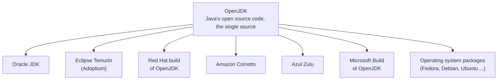
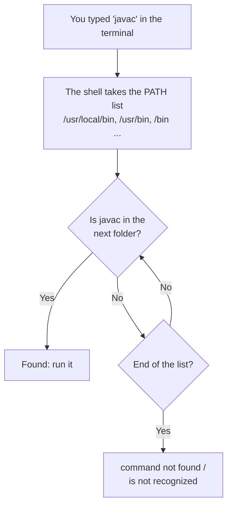
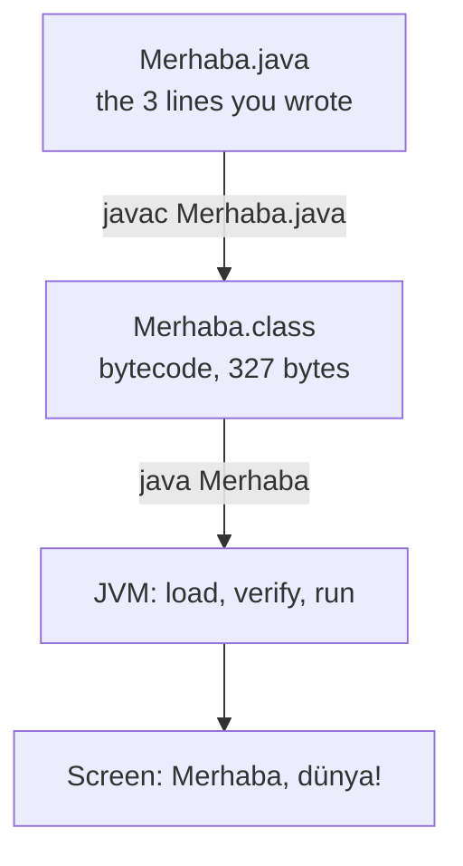

import Callout from '../../components/Callout.astro';
import Steps from '../../components/Steps.astro';
import Figure from '../../components/Figure.astro';
import dnfListImg from '../../assets/jdk-01-dnf-list.webp';
import dnfInstallImg from '../../assets/jdk-02-dnf-install.webp';
import versionImg from '../../assets/jdk-03-version.webp';
import editorImg from '../../assets/jdk-04-editor.webp';
import compileImg from '../../assets/jdk-05-compile-run.webp';
import singleImg from '../../assets/jdk-06-single-file.webp';
import javapImg from '../../assets/jdk-07-javap.webp';
import jshellImg from '../../assets/jdk-08-jshell.webp';
import treeImg from '../../assets/jdk-09-jdk-tree.webp';
import classicImg from '../../assets/jdk-10-classic.webp';
import errorsImg from '../../assets/jdk-11-errors.webp';

We have talked for two parts. In the [first part](/en/blog/what-is-java) we saw what Java is and how `javac`
and the JVM work hand in hand; in the [second part](/en/blog/inside-the-jvm) we walked through the JVM's door
and toured the warehouse, the desks and the kitchen. Today we stop talking. You will install Java on your
computer, write your first program with your own hands, and see "Merhaba, dünya!" (that's "Hello, world!" in
Turkish, and it's the greeting we'll keep) appear on the screen.

Honestly, this is the most enjoyable moment of the series. In the [Algorithms series](/en/blog/what-is-an-algorithm)
we brewed tea on paper, put values into mailboxes, drew loops; and we kept saying "it's the same in a real
language". That day is today. The `PRINT` command on paper is going to print something on a real computer.

<Callout type="important" title="Short answer: how do you install Java and run the first program?">
Install **JDK 25**: on Windows and macOS download Eclipse Temurin from adoptium.net and finish the wizard; on
Linux use the package manager (`sudo dnf install java-25-openjdk-devel` or `sudo apt install openjdk-25-jdk`).
Open a new terminal and check with `java -version`. In a folder, write `void main() { IO.println("Merhaba, dünya!"); }`
into a file called `Merhaba.java`. In the terminal, compile with `javac Merhaba.java` and run with `java Merhaba`.
If you saw the text on screen, you are a Java programmer. The details and the screens of every step are below.
</Callout>

<Callout type="note" title="What you need for this part">
- A computer running Windows, macOS or Linux; the JDK takes about 300 MB.
- Internet for the download and an uninterrupted hour.
- A terminal window. "Terminal" or "PowerShell" on Windows, "Terminal" on macOS, the "Terminal" application on
  Linux. Don't let the word scare you: it's a window where you give the computer commands by typing, that's all.
  [Part 3 of the Red Hat series](/en/red-hat) will be devoted entirely to that window.
- Not pen and paper this time; though they'll still be useful for the questions at the end.
</Callout>

<Callout type="tip" title="About the screenshots">
I took the terminal screens in this post on the RHEL 10.2 virtual machine I installed in
[part 2 of the Red Hat series](/en/blog/installing-rhel). The commands are exactly the same on Windows and
macOS; only the installation step differs by operating system, and I describe that separately for all three.
The `mehmet@rhel-lab:~$` part you see on the screens is the command prompt; yours will say something else,
it doesn't matter.
</Callout>

## What are we installing? JDK, JRE and JVM

In [part 1](/en/blog/what-is-java) we drew a set of nesting dolls; remember: innermost the **JVM** (the engine
that runs bytecode), around it the **JRE** (engine + Java's ready-made libraries; enough to **run** a program),
outermost the **JDK** (JRE + the tools for **writing** programs: compiler, playground, debugger).

```mermaid
flowchart TD
    subgraph JDK["JDK: development kit"]
        direction TB
        T["javac, jshell, javap, jar, javadoc ..."]
        subgraph JRE["JRE: runtime environment"]
            direction TB
            L["Ready-made libraries<br/>(String, List, files, network ...)"]
            JVM["JVM<br/>the engine that runs bytecode"]
        end
    end
```



Since we're going to write programs, we install the outermost doll, the **JDK**. The libraries and the JVM come
inside it. If you come across "install the JRE first" in older articles, don't be surprised: since Java 11
(2018) there's no need to download a separate JRE; most distributions ship only the JDK.

## Which version? Why 25?

Java's release calendar, as you'll remember from the [version table in part 1](/en/blog/what-is-java), is like a
train timetable: a new version departs every **March and September**. But not every train is a long-distance
train. Most versions lose support six months later when the next one arrives; the ones released every two
years get updates for years. These are called **LTS** (Long-Term Support): 8, 11, 17, 21, **25** and 29,
coming in 2027.

| Version | Released | Status |
| --- | --- | --- |
| Java 21 | September 2023 | LTS, still widespread; enough for this series, but the short `void main()` won't work |
| **Java 25** | **September 2025** | **LTS, current; the version we use in this series** |
| Java 26 | March 2026 | Six-month release, giving way to 27 in September |
| Java 27 | September 2026 | Out this month; not LTS |

For a beginner the right choice is always the **current LTS**, which today means 25. You get the newest
conveniences (the plain `main` from part 1) and you work with the same version for two years. If 21 is
installed on your machine, no need to panic; you just write the first program in its classic form, which is
below as well.

<Callout type="note" title="History note: from the slow train to the fast train">
Until 2017 Java versions came out every three or four years: Java 6 (2006), 7 (2011), 8 (2014), 9 (2017). Every
release was a big event and delays were measured in years; Java 7 kept people waiting five. In 2017 Oracle
moved to "a small release every six months, an LTS every two years". The result: new features arrive in small
pieces and on time, and nobody waits five years. The habit of reading version numbers pays off here too:
`25.0.4` means "major version 25, fourth update"; updates come out in January, April, July and October and
almost always carry security fixes. The same reflex as reading the kernel number in the
[Red Hat post](/en/blog/installing-rhel).
</Callout>

## Which JDK? One source, many builds

Now comes the confusing part; on the download pages you'll see names like Oracle JDK, OpenJDK, Temurin,
Corretto, Zulu. Are they all Java? Yes. What's the difference? Remember the Linux analogy from the
[Red Hat post](/en/blog/what-is-red-hat): one kernel, many distributions. It's the same with Java.



**OpenJDK** is Java's open source code; developed in a single repository, in front of everyone's eyes. Companies
take that code, build it, test it and distribute it under their own name. All of them pass the same
compatibility test suite (the TCK), so if `Merhaba.java` runs on one of them it runs on all of them.

| Build | From | When to pick it |
| --- | --- | --- |
| Eclipse Temurin | Eclipse Foundation (Adoptium) | The most practical choice on Windows and macOS; free, every platform |
| Oracle JDK | Oracle | Companies that want Oracle support; free to use since 17 (NFTC) |
| Red Hat build of OpenJDK | Red Hat | The version that comes with the package manager on RHEL and Fedora; also available for Windows |
| Amazon Corretto | Amazon | Projects running on AWS |
| Azul Zulu | Azul | Those who need support even for very old versions |
| Microsoft Build of OpenJDK | Microsoft | Azure and Windows-oriented projects |
| Distribution package | Fedora, Debian, Ubuntu ... | The easiest route on Linux: `dnf` or `apt` |

Our decision: **Temurin on Windows and macOS, the package manager on Linux.** The screens in this post are from
Red Hat's build; on RHEL it comes with `dnf`.

<Callout type="note" title="History note: how Java became open source">
Sun Microsystems open-sourced Java under the GPL in 2006; the OpenJDK project was born that day. When Oracle
bought Sun in 2010 ([part 1](/en/blog/what-is-java)) it kept developing OpenJDK, but in 2019 it changed the
licence of its own Oracle JDK: from Java 11 on, using it at work cost money. The community answered with
AdoptOpenJDK: free builds from the same source code. In 2021 that project moved to the Eclipse Foundation and
took the name **Temurin**; the same year Oracle returned to free use with Java 17 (the NFTC licence). Today the
answer to "which one is free" is simple: all of them. The difference is in the support contract and the
length of updates.
</Callout>

## Step 1: installing the JDK

Three operating systems, three separate routes. Read only yours, then skip to "Step 2".

### Windows

<Steps>
1. In a browser go to [adoptium.net](https://adoptium.net/). The page recognises your operating system and
   shows a big "Latest LTS Release" button; check that it says **Temurin 25** underneath. The button downloads
   an installer with the `.msi` extension (about 180 MB).
2. Double-click the downloaded file. On the wizard's "Custom Setup" screen there are four options: **Add to
   PATH** (ticked by default, leave it), **Associate .jar** (leave it), **Set JAVA_HOME variable** (tick it; it
   will be useful later), JavaSoft registry keys (leave it). Next, Install; Windows asks for administrator
   approval, say Yes.
3. When it finishes, **close and reopen** any open terminal windows. People who skip this step get "java is
   not recognized" in the next step; the PATH change only applies to new windows.
4. In the new terminal type `java -version` and `javac -version`. Both should print a version starting with 25.
</Steps>

For those who like the command line there's a one-liner too; in a PowerShell opened as administrator:

```powershell title="Windows: with winget"
winget install EclipseAdoptium.Temurin.25.JDK
```

### macOS

<Steps>
1. The [adoptium.net](https://adoptium.net/) page recognises the Mac. The only thing to watch is the processor:
   Macs from 2020 on (M1, M2, M3, M4) are **aarch64**, older Intel Macs are **x64**. If unsure, open "About
   This Mac" from the Apple menu at the top left; if you see "Apple M" it's aarch64. Download the `.pkg` file.
2. Double-click the file and finish the wizard with Continue, Continue, Install; the Mac asks for your password.
3. Open the Terminal application (type "Terminal" into Spotlight) and check with `java -version`.
</Steps>

If you use Homebrew, one line:

```bash title="macOS: with Homebrew"
brew install --cask temurin@25
```

### Linux

On Linux we use the package manager; the "download from the store" route I described in the
[Red Hat post](/en/blog/what-is-red-hat). Depending on your distribution:

```bash title="Fedora, RHEL, CentOS Stream, Rocky, Alma"
sudo dnf install java-25-openjdk-devel
```

```bash title="Debian, Ubuntu, Linux Mint"
sudo apt install openjdk-25-jdk
```

```bash title="Arch, Manjaro"
sudo pacman -S jdk-openjdk
```

<Callout type="caution" title="Trap: the -devel and -jdk suffixes">
On Fedora and RHEL the `java-25-openjdk` package only gives you the runtime (the JRE); `javac` is not in it. To
write programs the package name must end in **`-devel`**. Debian and Ubuntu have the same split: `openjdk-25-jre`
runs, **`openjdk-25-jdk`** writes. Almost every "I installed Java but there's no javac" complaint comes from
this suffix. Then there's the version: Ubuntu 24.04's repository has 21; if 25 isn't there, install
`openjdk-21-jdk` and write the first program in its classic form, described below. If you want 25, the
"portable archive" route below works on every Linux.
</Callout>

On my RHEL 10 virtual machine I first checked which versions the repository has, then installed 25:

<Figure src={dnfListImg} alt="dnf list output in a RHEL 10.2 terminal: the java-21-openjdk-devel and java-25-openjdk-devel packages in the AppStream repository" caption="dnf list --available: the RHEL 10.2 repository has two JDKs, 21 and 25. Both come from the AppStream shelf." />

<Figure src={dnfInstallImg} alt="End of the dnf install java-25-openjdk-devel output in a RHEL 10.2 terminal: 10 packages installed, Complete!" caption="sudo dnf install -y java-25-openjdk-devel: a 69 MB download, 10 packages. The JDK arrives in three pieces: headless (the engine), java-25-openjdk (the graphical parts) and devel (javac and the tools). Complete! at the end." />

Look at the package list: `java-25-openjdk-headless` is the engine itself, `java-25-openjdk` the graphical parts
for programs that open windows, `java-25-openjdk-devel` the toolbox we asked for. There's also `tzdata-java`:
Java's own time zone table; the Java-flavoured sibling of the `tzdata` from the
[Red Hat post](/en/blog/installing-rhel).

### The portable archive: no installer at all

You can run Java without any installer too; a JDK is really just a folder. Download Temurin's `.tar.gz` or
`.zip`, or Red Hat's "portable JDK" archive, unpack it into a folder and run the `bin/java` inside directly. I
tried Red Hat's archive on my own Linux:

```bash title="Unpack the archive and run it directly" showLineNumbers=false
tar -xJf java-25-openjdk-25.0.4.0.7-1.0.portable.jdk.x86_64.tar.xz
./java-25-openjdk-25.0.4.0.7-1.0.portable.jdk.x86_64/bin/java -version
```

```text title="Output" showLineNumbers=false
openjdk version "25.0.4" 2026-07-21 LTS
OpenJDK Runtime Environment (Red_Hat-25.0.4.0.7-1) (build 25.0.4+7-LTS)
OpenJDK 64-Bit Server VM (Red_Hat-25.0.4.0.7-1) (build 25.0.4+7-LTS, mixed mode, sharing)
```

The only thing an installer does is put this folder in a sensible place and add its `bin` folder to
**PATH**. We're coming to that word now, because half of the "Java doesn't work" complaints come from it.

<Callout type="note" title="For the curious: SDKMAN">
People who work with several Java versions (you will too, later) use [SDKMAN](https://sdkman.io/) on Linux and
macOS: `sdk install java 25-tem` installs Temurin 25, `sdk use java 21-tem` switches one terminal to 21. No
need for it yet; just know the name.
</Callout>

## Step 2: checking the installation and understanding PATH

Whichever route you installed by, the check is the same: open a new terminal and type these.

```bash title="Installation check" showLineNumbers=false
java -version
javac -version
```

<Figure src={versionImg} alt="java -version, javac -version, which java and readlink output in a RHEL 10.2 terminal" caption="java -version: openjdk 25.0.4.1, LTS. javac -version: 25.0.4.1. which: both programs live under /usr/bin; readlink -f shows the real location: /usr/lib/jvm/java-25-openjdk/bin/java." />

Let's read the first line: `openjdk version "25.0.4.1" 2026-08-18 LTS`. **openjdk** says the source is OpenJDK;
**25.0.4.1** is a small interim fix released on 18 August on top of version 25's July update; **LTS** says it's
a long-term support release. The `Red_Hat-25.0.4.1.1-1` in parentheses is the builder's signature; on Temurin
you'd see something like `Temurin-25.0.4+7` there. **mixed mode** on the last line means the interpreter + JIT
pair we described in [part 2](/en/blog/inside-the-jvm) is on, and **sharing** means frequently used classes are
shared from a pre-built archive. Two lines of output, two parts of theory.

### PATH: where does the computer look for `javac`?

You asked a friend "could you fetch the scissors?". Which drawer are the scissors in? Your friend doesn't search
the whole house; they check a few familiar places: the kitchen drawer, the desk, maybe the bathroom cabinet. The
operating system behaves the same way when you type a command in the terminal: it has a **list of folders to
search**, called **PATH**, and it looks for the command in those folders in order.



The installer's "Add to PATH" option adds the JDK's `bin` folder to this list. On Linux the package manager
takes a more elegant route: it puts `javac` into `/usr/bin`, which is already on the list, but not as the real
file, as a **shortcut** to the real file. On the screen, `which java` showed `/usr/bin/java`, and `readlink -f`
the end of the shortcut: `/usr/lib/jvm/java-25-openjdk/bin/java`. The `/etc/alternatives` stop in between is the
mechanism that picks the "default" when several Javas live on the same machine; `sudo alternatives --config java`
switches between them. On Windows `where java` gives the same information; on macOS
`/usr/libexec/java_home -V` lists every installed version.

<Callout type="note" title="History note: why does PATH exist?">
The idea of PATH comes from 1970s Unix and hasn't changed in fifty years: you type a command, the shell looks
through the folders on the list in order and runs the first one it finds. The "first one" part matters: if you
have both an old and a new Java on the machine and the old one comes earlier on the list, `java -version` shows
the old one. That's the answer to "I installed it but it still says 17"; changing the order on the list or
choosing with `alternatives` is enough. In [part 3 of the Red Hat series](/en/red-hat) we'll look closely at
the shell and this list.
</Callout>

### JAVA_HOME: the address tools use to find Java

PATH is for finding the `java` and `javac` commands. **JAVA_HOME** does a different job: it's a separate
environment variable holding the full address of the JDK folder. The terminal doesn't look at it when running a
command, but most of the tools you'll meet later do. The build tools mentioned in the questions above, Maven and
Gradle, IDEs like IntelliJ and Eclipse, application servers like Tomcat, ask "where is Java installed?" not to
PATH but to JAVA_HOME. Setting it correctly now saves you from the common "JAVA_HOME is not set" error later.

On Windows, if you ticked "Set JAVA_HOME variable" in the installer, it's already set. If you didn't, or want to
do it by hand, by operating system:

```powershell title="Windows (PowerShell, permanent)"
setx JAVA_HOME "C:\Program Files\Eclipse Adoptium\jdk-25.0.4.7-hotspot"
```

```bash title="macOS (zsh)"
echo 'export JAVA_HOME=$(/usr/libexec/java_home -v 25)' >> ~/.zshrc
source ~/.zshrc
```

```bash title="Linux (bash)"
echo 'export JAVA_HOME=/usr/lib/jvm/java-25-openjdk' >> ~/.bashrc
source ~/.bashrc
```

After setting it, **open a new terminal** and check: `echo $JAVA_HOME` on Linux and macOS, `$env:JAVA_HOME` on
Windows (PowerShell). The output should print the path of the JDK folder.

<Callout type="caution" title="Trap: JAVA_HOME points at the root folder, not bin">
The most common mistake: setting JAVA_HOME to the `.../java-25-openjdk/bin` folder. Wrong. JAVA_HOME points to
the folder that **contains** `bin` (`.../java-25-openjdk`); the tools find `java` themselves as
`$JAVA_HOME/bin/java`. The `$(/usr/libexec/java_home -v 25)` on macOS computes the correct path for you; on
Windows and Linux, when you give the path by hand, make sure it doesn't end in `bin`. And the version: the
`jdk-25.0.4.7-hotspot` folder name in the Windows path above changes with the build you installed; check the
real folder name under `C:\Program Files\Eclipse Adoptium`.
</Callout>

### What's inside the JDK folder?

Since an installation is just a folder, let's look inside. On RHEL the folder is
`/usr/lib/jvm/java-25-openjdk`; on Windows `C:\Program Files\Eclipse Adoptium\jdk-25...`, on macOS
`/Library/Java/JavaVirtualMachines/temurin-25.jdk/Contents/Home`. The contents are the same everywhere:

<Figure src={treeImg} alt="The /usr/lib/jvm listing, the tree output of the JDK folder and the 30 tools in the bin folder in a RHEL 10.2 terminal" caption="The shortcuts under /usr/lib/jvm point to alternatives; the real folder is java-25-openjdk. Inside: bin, conf, include, legal, lib and release. The bin folder holds 30 tools." />

| Folder or file | What's inside |
| --- | --- |
| `bin/` | The tools: `java` (launcher), `javac` (compiler), `jshell` (playground), `javap` (bytecode reader), `jar` (packager), `javadoc` (documentation generator), `jlink` and `jpackage` (distribution builders), `jwebserver` (a small web server), `keytool` (certificate tool) and the debugging tools |
| `lib/` | Java's ready-made libraries and the JVM itself; the `lib/modules` file is all of the drawers (modules) from [part 2](/en/blog/inside-the-jvm), 140 MB in a single file |
| `include/` | Header files written in C; the outside of the side door (JNI) from part 2 |
| `conf/` | Configuration files: security, network, logging |
| `release` | Version information; `cat release` tells you who built it and when |
| `legal/` | Licence texts |

We won't learn all thirty tools. Three are enough today: `javac`, `java` and `jshell`. Plus `javap` for the
curious.

## Step 3: the first program

If you're ready, on to the real work. Three steps: a folder, a file, two commands.

### Folder and editor

<Steps>
1. Create a folder on your computer for this series; I called mine `java-dersleri` ("java lessons"). Under
   Documents on Windows, in the home folder on macOS and Linux. You can do it from the terminal too:
   `mkdir java-dersleri` then `cd java-dersleri`. No spaces or special characters in the folder name; they'll
   give you headaches later.
2. Open a **plain text editor**. Notepad on Windows, TextEdit on macOS (from the menu, Format → Make Plain
   Text, otherwise it saves rich text and Java won't understand it), Text Editor or gedit on Linux. Word and the
   like won't do; they add invisible formatting.
3. Type the three lines below and save them inside the folder as **`Merhaba.java`**. In Windows Notepad's
   "Save As" window set "Save as type" to **All Files**; otherwise the file silently becomes
   `Merhaba.java.txt` and `javac` can't find it.
</Steps>

```java title="Merhaba.java"
void main() {
    IO.println("Merhaba, dünya!");
}
```

<Figure src={editorImg} alt="The three-line Merhaba.java file in the RHEL 10.2 Text Editor window" caption="Merhaba.java in GNOME Text Editor. Three lines; the red squiggles are the spell checker tripping over Turkish words, irrelevant." />

<Callout type="note" title="Why a plain editor now, an IDE later? And why do most Java developers pick IntelliJ?">
We're using a plain editor on purpose right now: so you can see what `javac` and `java` do without the machinery
being hidden. But in real projects nobody types three lines into Notepad; everyone uses an **IDE** (Integrated
Development Environment). An IDE is far more than an editor: it shows errors in red as you type, completes the
word you started, compiles and runs with a single key, lets you stop the program line by line with a debugger,
and has Maven and Gradle built in.

The most common choice in the Java world is **IntelliJ IDEA**. The reason: this program by JetBrains is known as
the IDE that understands Java most deeply; its code completion and error detection are a step ahead of the
others, and it supports new Java versions early. **The Community edition is free and open source**, more than
enough for a beginner. On top of that, even Google's Android development tool, Android Studio, is built on it, so
the interface you learn pays off later. Not mandatory, of course: **Visual Studio Code** (lightweight, writes
Java with an extension) and **Eclipse** (classic, entirely free) are strong options too. In the part where we
move to an IDE I'll show the examples in IntelliJ IDEA Community; you can follow along with whichever you like,
because the `.java` you write runs the same in all of them.
</Callout>

<Callout type="caution" title="Java is case-sensitive">
You write `IO.println`, not `io.println` or `IO.Println`. The file name is `Merhaba.java`, with a capital M.
Semicolon at the end of the line, curly braces in pairs. There's a section on error messages at the end of this
post; if you get an error on the first try, look there, it's most likely covered.
</Callout>

### Line by line: what do these three lines say?

Short, but every word says something; remember the black box from the [Functions post](/en/blog/functions).

- **`void main()`** defines a black box; its name is `main`. Java's rule: the program starts from the box
  called `main`. In [part 1](/en/blog/what-is-java) we called it the "start here" sign. `void` means "returns
  nothing"; a function without the `RETURN` line from the Functions post. The parentheses are empty: the box
  takes nothing from outside.
- **`{` and `}`** wrap the body of the box; the Java form of the `FUNCTION ... ENDFUNCTION` pair in pseudocode.
  The lines inside are the work the box does.
- **`IO.println("Merhaba, dünya!");`** is the very `PRINT "Merhaba, dünya!"` line from the
  [Pseudocode post](/en/blog/pseudocode). `IO` is Java's input/output box, `println` is "print and end the
  line". What's inside the quotes is a **string**; in the [Variables post](/en/blog/variables) we called it the
  text type. The **semicolon** at the end is the sentence's full stop: in Java every statement ends with one.
- **Indentation** (the spaces at the start of the line) is not required by Java; it's for your eyes. Make it a
  habit; it saves lives in hundred-line files later on.

<Callout type="note" title="History note: why does everyone write &quot;Hello, world&quot; first?">
The tradition goes back to 1972: Brian Kernighan, in a tutorial he wrote at Bell Labs for the B language, used
a program that prints "hello, world" as the first example. When the C book he wrote with Dennis Ritchie in 1978
opened with the same example, the tradition stuck. For fifty years it has been every language's first program;
the reason is simple: it proves with a single line that the installation, the compiler and the launcher are
all correct. Which is exactly what you're doing today.
</Callout>

### Compile and run

In the terminal go into the `java-dersleri` folder (`cd java-dersleri`) and type two commands:

```bash title="Compile, then run" showLineNumbers=false
javac Merhaba.java
java Merhaba
```

<Figure src={compileImg} alt="cat, javac, ls -l and java Merhaba output in a RHEL 10.2 terminal; the screen shows Merhaba, dünya!" caption="javac finished silently and produced the 327-byte Merhaba.class file. java Merhaba: Merhaba, dünya!" />

See? The first command printed nothing; in the Unix world silence means success. But when you look in the folder
with `ls` there's a new file: **`Merhaba.class`**, 327 bytes. The halfway language from [part 1](/en/blog/what-is-java),
bytecode; the shipping box `javac` produced from your 52-byte source code. The second command handed that box to
the JVM, and the JVM did everything we toured in [part 2](/en/blog/inside-the-jvm): took it in at the door,
checked it, put it on the desk, ran `main` and printed to the screen. Within milliseconds.



Note: in the second command we typed **`java Merhaba`**, not `java Merhaba.class`. `java` is given a class name,
not a file name; if you add the extension you get "Could not find or load main class Merhaba.class". We'll come
back to that below.

### In one step: `java Merhaba.java`

Since Java 11 there's a shortcut for small programs: squeezing compile and run into a single command.

```bash title="With a single command" showLineNumbers=false
java Merhaba.java
```

<Figure src={singleImg} alt="rm Merhaba.class, ls, java Merhaba.java and ls again in a RHEL 10.2 terminal; no .class file was created" caption="First I deleted the old .class file. java Merhaba.java ran directly and left no new .class in the folder: the compilation happened in memory." />

This time no `.class` file appeared on disk; `java` compiled in memory, ran it, forgot it. Great for experiments.
But in real projects the two steps are always separate: you compile once, run many times, package the `.class`
files and hand them to others. That's why you need to know both.

### The classic form: the version you'll see on the internet

I promised in part 1: the "Hello, world" of internet examples, books, and Java 21 and earlier is a bit longer.
Let's write it too and run it the same way:

```java title="Klasik.java"
public class Klasik {
    public static void main(String[] args) {
        System.out.println("Merhaba, dünya!");
    }
}
```

<Figure src={classicImg} alt="The contents of Klasik.java, its compilation, its run and the javap -c bytecode dump in a RHEL 10.2 terminal" caption="The classic version: same output, same flow. javap -c shows main turned into four bytecode instructions: get System.out, load the string, call println, return." />

Each of the extra words has a meaning, but you don't have to learn them all today: `public class Klasik` is "a
publicly visible class called Klasik" (the cookie cutter from [part 2](/en/blog/inside-the-jvm)), `static` is
"can be called without cutting a cookie from the cutter", `String[] args` is "words that can be handed to the
program from outside". Java 25 decided none of these are needed for a first program and made the short form
standard; but the long form is valid too and runs everywhere. One rule differs: if you wrote `public class
Klasik`, the file name must be **`Klasik.java`**. The short form has no such requirement.

<Callout type="note" title="For the curious: looking behind the curtain">
The JDK's `javap` tool makes a `.class` file readable. Type `javap -c Merhaba` and you'll see that the short
version's `main` comes down to three instructions: load the string (`ldc`), call `IO.println` (`invokestatic`),
return (`return`). The classic version has four, because `System.out` is fetched first. In
[part 2](/en/blog/inside-the-jvm) we said "there's a magic number at the start of the shipping box"; the command
`od -A x -t x1 -N 4 Merhaba.class` shows the first four bytes of the file: `ca fe ba be`. It really is there.
</Callout>

<Figure src={javapImg} alt="javap -c Merhaba output and the first four bytes of the file via the od command in a RHEL 10.2 terminal: ca fe ba be" caption="javap -c Merhaba: a three-instruction main. Below, the first four bytes of Merhaba.class via od: CAFEBABE, the magic number from part 2." />

## Step 4: jshell, the playground

Opening a file and compiling for every little curiosity is tiring. There's a tool inside the JDK for that:
**jshell**, the interactive playground that came with Java 9 (2017). Type `jshell` in the terminal, write a
line of Java, press Enter, see the result.

<Figure src={jshellImg} alt="A jshell session in a RHEL 10.2 terminal: 2 + 3 gives 5, String ad = Ada, string concatenation and ad.length() * 2 gives 6" caption="jshell: 2 + 3 → 5. I defined a string variable, joined two strings with +, multiplied its length by two. No file, no main, no compiling." />

Try what's on the screen yourself:

```text title="A jshell session" showLineNumbers=false
jshell> 2 + 3
$1 ==> 5

jshell> String ad = "Ada";
ad ==> "Ada"

jshell> "Merhaba, " + ad
$3 ==> "Merhaba, Ada"

jshell> ad.length() * 2
$4 ==> 6

jshell> /exit
```

Look at the second line: `String ad = "Ada";`. The mailbox from the [Variables post](/en/blog/variables),
written in Java: the box's type (`String`, text), its name (`ad`, "name" in Turkish), the value put inside
(`"Ada"`). In pseudocode we wrote `ad ← "Ada"`; an equals sign instead of the arrow, and a type in front. The
third line joins two strings with `+`; the fourth asks for the string's length and multiplies it by a number.
Everything we did on paper is alive here. You leave jshell with `/exit`; we'll use it plenty in the next part.

## Reading your first error messages

If you got no error while writing your first program, you're either very careful or lucky; you'll get one on
the second. That's fine. In the [last post of the Algorithms series](/en/blog/final-steps) we said "an error
message is not an enemy, it's directions"; Java's messages are a good example. I produced and read every one of
the following with my own hands:

<Figure src={errorsImg} alt="The javac error for Hata.java with a missing semicolon and the Could not find or load main class error for java Merhaba.class in a RHEL 10.2 terminal" caption="Two classics: when you forget the semicolon, javac shows the line number and the exact spot (';' expected). When you type java Merhaba.class it searches for a class name including the extension and can't find it." />

| Message | Meaning and fix |
| --- | --- |
| `error: ';' expected` | No semicolon at the end of the line. Go to the line number in the message and put a `;` where the `^` points. |
| `error: package system does not exist` or `cannot find symbol` | Upper and lower case: `system.out` was written, it should be `System.out`. `cannot find symbol` usually means a misspelled name. |
| `error: ')' or ',' expected` | You forgot to put the text in quotes: `IO.println("Merhaba")`, not `IO.println(Merhaba)`. |
| `error: reached end of file while parsing` | A closing curly brace `}` is missing; the file ended early. |
| `error: class Klasik is public, should be declared in a file named Klasik.java` | In the classic form the class name and the file name must match. Rename the file or change the class name. |
| `Error: Could not find or load main class Merhaba.class` | You typed `java Merhaba.class`; it should be `java Merhaba`. The same message appears if you're in the wrong folder: `cd` into the folder that holds the `.class` file. |
| `error: unnamed classes are a preview feature` | You tried to compile the short `void main()` form with Java 21. Either move to 25 or write the classic form. |
| `javac: command not found` or `'javac' is not recognized` | A PATH problem, or only the JRE is installed. See the "Trap" and "PATH" sections above; don't forget to reopen the terminal. |

The recipe for reading a message is always the same: file name, colon, line number, colon, message. If it says
`Hata.java:2: error: ';' expected`, look at line two; the `^` underneath shows the exact spot. Before pasting a
message into Google, read it once yourself; most of the time the answer is inside.

## Try it yourself

This part's questions are for the keyboard, not pen and paper. But answer each one in your head first, then
try; if the guess doesn't match, that's where the real learning starts.

### Question 1 — Two lines (easy)

> Add a second line `IO.println("Nasılsın?");` to `Merhaba.java`. Before compiling and running, guess: does the
> output appear on one line or two? And if you write `print` instead of `println`?

<Callout type="note" title="Hint">
The `ln` in `println` stands for "line": it prints and ends the line, so the next text starts on a new line.
`print` doesn't end the line; two `print`s in a row write on the same line: `Merhaba, dünya!Nasılsın?`. Our
pseudocode `PRINT` always wrote on a new line by our own decision; Java gives you both.
</Callout>

### Question 2 — Delete the full stop (easy)

> Delete the semicolon, run `javac Merhaba.java` and read the error message **out loud**: file, line, message,
> marker. Then put it back. This two-minute exercise saves hours later.

<Callout type="note" title="Hint">
The message will be `Merhaba.java:2: error: ';' expected`, with the line itself underneath and a `^` pointing at
its end. The line number is 2, because `IO.println` is on the second line. Java gives one message per error; if
there are ten errors there are ten messages and `10 errors` at the bottom. Always start from the **first**
error; the rest are often echoes of the first.
</Callout>

### Question 3 — The file name (medium)

> Save the short version as `merhaba.java` (lowercase m) and run it with `java merhaba.java`. Does it work? Try
> the same by turning `Klasik.java` into `klasik.java`. Does that work too? Why the difference?

<Callout type="note" title="Hint">
The short version works: the class name is derived from the file, there's no rule. The classic version doesn't:
if you said `public class Klasik`, the file must be `Klasik.java`, and `javac` says "should be declared in a
file named Klasik.java". Java 25's short form removed, one by one, exactly this kind of rule that beginners
run into.
</Callout>

### Question 4 — Division in jshell (medium)

> Open jshell and type these two: `7 / 2` and `7.0 / 2`. The results differ. Explain why, remembering the
> distinction between whole numbers and decimals from the [Variables post](/en/blog/variables).

<Callout type="note" title="Hint">
`7 / 2` gives `3`; in Java the division of two whole numbers is a whole number, the remainder is dropped.
`7.0 / 2` gives `3.5`; once one side is a decimal, the result is a decimal too. In the Variables post we said
"a mailbox's type decides what can go into it"; Java takes that very seriously. It's the main topic of the
next part.
</Callout>

### Question 5 — Which Java? (medium)

> A colleague at work says "we use Java 21 on the project, you installed 25, is that a problem?". What do you
> answer? Can both live on your computer?

<Callout type="note" title="Hint">
They can, and it's normal. Several JDKs sit side by side on one machine; PATH order or `alternatives` decides
which one answers the `java` command (on macOS and Linux SDKMAN reduces that to one command). The project's
version is a separate matter: a `.class` file compiled with 25 won't run on 21, but you can tell 25 to "compile
for 21" (`javac --release 21`). We'll see that in the projects part; for today the answer is "no problem".
</Callout>

## Summing up

No theory today, just work: you installed Java, wrote your first program, compiled it, ran it, broke it and
fixed it. Put the list below in your pocket; we'll use all of it in the coming parts.

<Callout type="tip" title="Pocket summary">
- Install the **JDK** (not the JRE): **Temurin 25** on Windows and macOS, the package manager on Linux (the
  package with the `-devel` / `-jdk` suffix). Check: `java -version` and `javac -version` in a new terminal.
- **Version:** an LTS every two years (17, 21, **25**, 29). The current LTS for a beginner. `25.0.4` = version
  25, update 4.
- **Builds:** one source (OpenJDK), many builds (Oracle, Temurin, Red Hat, Corretto, Zulu, Microsoft); all free,
  all compatible.
- **PATH:** the list of folders where commands are searched. "command not found" or "is not recognized" → reopen
  the terminal, check the `-devel`/`-jdk` package, find it with `which java` / `where java`.
- **JAVA_HOME:** the variable holding the JDK folder's address (the folder that contains `bin`, not `bin`
  itself); Maven, Gradle, IDEs and application servers find Java from here. `setx` on Windows, an `export` in
  `~/.zshrc` or `~/.bashrc` on macOS/Linux; then verify in a new terminal with `echo $JAVA_HOME`.
- **First program:** `void main() { IO.println("Merhaba, dünya!"); }`; `main` is the starting point,
  `IO.println` = `PRINT`, the semicolon ends the statement, case matters. The classic form (`public class` +
  `public static void main(String[] args)`) is valid everywhere; file name = class name.
- **Two commands:** `javac Merhaba.java` (→ `Merhaba.class`, bytecode) and `java Merhaba` (no extension).
  Shortcut: `java Merhaba.java`. For the curious, `javap -c` and `CAFEBABE`.
- **jshell:** the playground; `2 + 3`, `String ad = "Ada";`, `/exit`.
- **Error message** = file : line : message + `^`. Start from the first error, read it out loud.
- Next up: the Java form of the [Variables post](/en/blog/variables). `int`, `double`, `String`, `boolean`;
  we'll stick type labels on the mailboxes in Java and play in jshell.
</Callout>

## Sources

- [Eclipse Temurin downloads](https://adoptium.net/) and the [Adoptium installation guide](https://adoptium.net/installation/).
- [Red Hat build of OpenJDK](https://developers.redhat.com/products/openjdk/overview): RHEL packages and portable
  archives; there are builds for Windows too.
- [The OpenJDK project](https://openjdk.org/) and the [JDK 25 release page](https://openjdk.org/projects/jdk/25/).
- The features in this post: [JEP 512, compact source files and `void main()`](https://openjdk.org/jeps/512),
  [JEP 330, launching single-file programs with `java`](https://openjdk.org/jeps/330),
  [JEP 222, jshell](https://openjdk.org/jeps/222).
- [dev.java](https://dev.java/learn/): Oracle's free learning site; its "Getting Started" section is the official
  counterpart of this post.
- [SDKMAN](https://sdkman.io/): managing several JDKs on Linux and macOS.
- The [Homebrew temurin@25](https://formulae.brew.sh/cask/temurin@25) and
  [winget](https://learn.microsoft.com/windows/package-manager/winget/) documentation.
- [The history of the "Hello, World!" program](https://en.wikipedia.org/wiki/%22Hello,_World!%22_program):
  Kernighan, 1972.
- Screenshots: from the author's RHEL 10.2 virtual machine inside VirtualBox (Red Hat build of OpenJDK
  25.0.4.1); the portable archive test on the author's own Linux.
