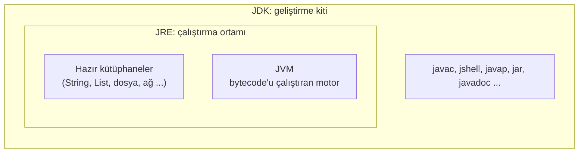
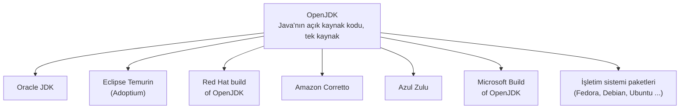
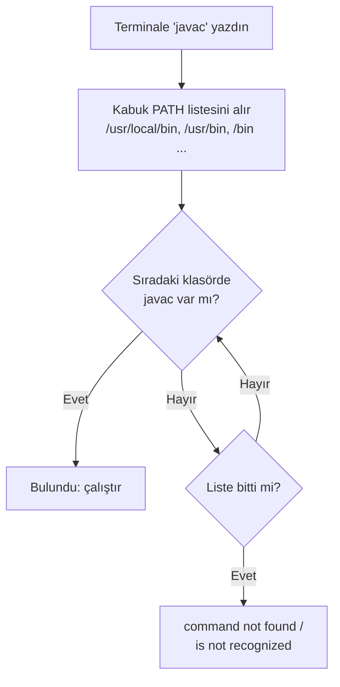
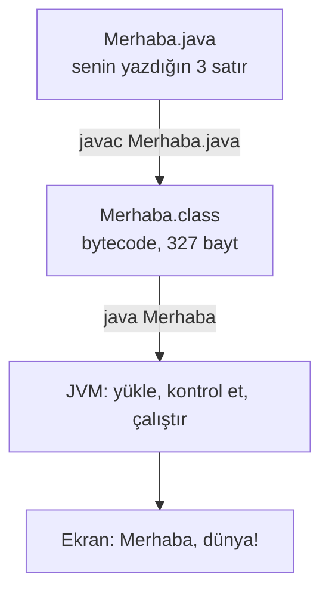

import Callout from '../../components/Callout.astro';
import Steps from '../../components/Steps.astro';
import Figure from '../../components/Figure.astro';
import dnfListImg from '../../assets/jdk-01-dnf-list.webp';
import dnfInstallImg from '../../assets/jdk-02-dnf-install.webp';
import versionImg from '../../assets/jdk-03-version.webp';
import editorImg from '../../assets/jdk-04-editor.webp';
import compileImg from '../../assets/jdk-05-compile-run.webp';
import singleImg from '../../assets/jdk-06-single-file.webp';
import javapImg from '../../assets/jdk-07-javap.webp';
import jshellImg from '../../assets/jdk-08-jshell.webp';
import treeImg from '../../assets/jdk-09-jdk-tree.webp';
import classicImg from '../../assets/jdk-10-classic.webp';
import errorsImg from '../../assets/jdk-11-errors.webp';

İki bölümdür konuştuk. [İlk bölümde](/blog/java-nedir) Java'nın ne olduğunu ve `javac` ile JVM'in nasıl el
ele çalıştığını gördük; [ikinci bölümde](/blog/jvm-derinlemesine) JVM'in kapısından girip depoyu, masaları ve
mutfağı gezdik. Bugün konuşmayı bırakıyoruz. Java'yı bilgisayarına kuracak, ilk programını kendi ellerinle
yazacak ve ekranda "Merhaba, dünya!" yazısını göreceksin.

Açıkçası bu, serinin en keyifli anı. [Algoritmalar serisinde](/blog/algoritma-nedir) kâğıt üstünde çay
demledik, posta kutularına değer koyduk, döngüler çizdik; hep "gerçek bir dilde de böyle" dedik. O gün bugün.
Kâğıttaki `YAZ` komutu, bugün gerçek bir bilgisayarda gerçekten bir şey yazacak.

<Callout type="important" title="Kısa cevap: Java nasıl kurulur, ilk program nasıl çalışır?">
**JDK 25**'i kur: Windows ve macOS'ta adoptium.net'ten Eclipse Temurin'i indir ve sihirbazı bitir; Linux'ta
paket yöneticisini kullan (`sudo dnf install java-25-openjdk-devel` ya da `sudo apt install openjdk-25-jdk`).
Yeni bir terminal aç, `java -version` ile kontrol et. Bir klasörde `Merhaba.java` adlı dosyaya
`void main() { IO.println("Merhaba, dünya!"); }` yaz. Terminalde `javac Merhaba.java` ile derle, `java Merhaba`
ile çalıştır. Ekranda yazıyı gördüysen Java programcısı oldun. Her adımın ayrıntısı ve ekranı aşağıda.
</Callout>

<Callout type="note" title="Bu bölüm için gerekenler">
- Windows, macOS ya da Linux çalıştıran bir bilgisayar; JDK yaklaşık 300 MB yer kaplar.
- İndirme için internet ve kesintisiz bir saat.
- Bir terminal penceresi. Windows'ta "Terminal" ya da "PowerShell", macOS'ta "Terminal", Linux'ta
  "Terminal" uygulaması. Terminal kelimesi seni ürkütmesin: bilgisayara yazıyla komut verdiğin bir pencere,
  o kadar. [Red Hat serisinin 3. bölümü](/red-hat) tamamen bu pencereye ayrılacak.
- Kalem kâğıt bu sefer değil; ama sondaki sorular için yine işine yarar.
</Callout>

<Callout type="tip" title="Ekran görüntüleri hakkında">
Bu yazıdaki terminal ekranlarını, [Red Hat serisinin 2. bölümünde](/blog/rhel-kurulumu) kurduğum RHEL 10.2
sanal makinesinde çektim. Komutlar Windows ve macOS'ta da birebir aynı; yalnızca kurulum adımı işletim
sistemine göre değişiyor, onu da üçü için ayrı ayrı anlatıyorum. Ekranlarda gördüğün `mehmet@rhel-lab:~$`
kısmı komut istemi; senin makinende başka bir şey yazar, önemli değil.
</Callout>

## Neyi kuruyoruz? JDK, JRE ve JVM

[Bölüm 1'de](/blog/java-nedir) bir matruşka bebek çizmiştik; hatırla: en içte **JVM** (bytecode'u çalıştıran
motor), onun etrafında **JRE** (motor + Java'nın hazır kütüphaneleri; bir programı **çalıştırmaya** yeter), en
dışta **JDK** (JRE + program **yazmak** için araçlar: derleyici, deneme tahtası, hata ayıklayıcı).



Program yazacağımız için en dıştaki bebeği, **JDK**'yı kuracağız. Kütüphaneler ve JVM onun içinde geliyor. Eski
yazılarda "önce JRE'yi kur" cümlesine rastlarsan şaşırma: Java 11'den beri (2018) ayrı bir JRE indirmek gerekmiyor,
çoğu dağıtım yalnızca JDK veriyor.

## Hangi sürüm? Neden 25?

Java'nın sürüm takvimi, [Bölüm 1'deki sürüm tablosundan](/blog/java-nedir) hatırlayacağın gibi bir tren tarifesi
gibi: her **Mart ve Eylül**'de yeni bir sürüm kalkar. Ama her tren uzun yol treni değil. Sürümlerin çoğu altı ay
sonra bir sonraki gelince desteğini yitirir; iki yılda bir çıkanlar ise yıllarca güncelleme alır. Bunlara **LTS**
(Long-Term Support, uzun süreli destek) denir: 8, 11, 17, 21, **25** ve 2027'de gelecek 29.

| Sürüm | Çıkış | Durum |
| --- | --- | --- |
| Java 21 | Eylül 2023 | LTS, hâlâ yaygın; bu seri için yeter ama kısa `void main()` çalışmaz |
| **Java 25** | **Eylül 2025** | **LTS, güncel; bu seride kullanacağımız sürüm** |
| Java 26 | Mart 2026 | Altı aylık sürüm, Eylül'de yerini 27'ye bırakıyor |
| Java 27 | Eylül 2026 | Bu ay çıkıyor; LTS değil |

Yeni başlayan biri için doğru seçim her zaman **güncel LTS**, yani bugün 25. Hem en yeni yazım kolaylıklarını
(Bölüm 1'deki sade `main`) alırsın hem de iki yıl boyunca aynı sürümle çalışırsın. Bilgisayarında 21 kuruluysa
paniğe gerek yok; yalnızca ilk programı klasik hâliyle yazarsın, aşağıda o da var.

<Callout type="note" title="Tarih notu: yavaş trenden hızlı trene">
2017'ye kadar Java sürümleri üç dört yılda bir çıkardı: Java 6 (2006), 7 (2011), 8 (2014), 9 (2017). Her sürüm
büyük bir olaydı, gecikmeler yıllarla ölçülürdü; Java 7 beş yıl bekletmişti. Oracle 2017'de "altı ayda bir küçük
sürüm, iki yılda bir LTS" düzenine geçti. Sonuç: yenilikler küçük parçalar hâlinde ve tarihinde geliyor, kimse
beş yıl beklemiyor. Sürüm numarasını okuma alışkanlığı burada da işine yarar: `25.0.4`, "25. ana sürüm, dördüncü
güncelleme" demek; güncellemeler Ocak, Nisan, Temmuz ve Ekim'de çıkar ve neredeyse hep güvenlik yaması taşır.
[Red Hat yazısındaki](/blog/rhel-kurulumu) çekirdek numarasını okumakla aynı refleks.
</Callout>

## Hangi JDK? Tek kaynak, birçok yapım

Şimdi kafa karıştıran kısım geliyor; indirme sayfasına gittiğinde Oracle JDK, OpenJDK, Temurin, Corretto, Zulu
gibi isimler göreceksin. Hepsi Java mı? Evet. Fark ne? [Red Hat yazısındaki](/blog/red-hat-nedir) Linux
benzetmesini hatırla: çekirdek tek, dağıtım çok. Java'da da durum aynı.



**OpenJDK**, Java'nın açık kaynak kodudur; tek bir depoda, herkesin gözü önünde geliştirilir. Şirketler bu kodu
alıp derler, test eder, kendi adlarıyla dağıtır. Hepsi aynı uyumluluk testinden (TCK) geçer, dolayısıyla
`Merhaba.java` hangisinde çalışıyorsa hepsinde çalışır.

| Yapım | Kimden | Ne zaman seçilir |
| --- | --- | --- |
| Eclipse Temurin | Eclipse Vakfı (Adoptium) | Windows ve macOS için en pratik seçim; ücretsiz, her platform |
| Oracle JDK | Oracle | Oracle desteği isteyen kurumlar; 17'den beri ücretsiz kullanım (NFTC) |
| Red Hat build of OpenJDK | Red Hat | RHEL ve Fedora'da paket yöneticisiyle gelen sürüm; Windows için de var |
| Amazon Corretto | Amazon | AWS üstünde çalışan projeler |
| Azul Zulu | Azul | Çok eski sürümlere bile destek isteyenler |
| Microsoft Build of OpenJDK | Microsoft | Azure ve Windows odaklı projeler |
| Dağıtım paketi | Fedora, Debian, Ubuntu ... | Linux'ta en kolay yol: `dnf` ya da `apt` |

Kararımız: **Windows ve macOS'ta Temurin, Linux'ta paket yöneticisi.** Bu yazıdaki ekranlar Red Hat'in
yapımından; RHEL'de `dnf` ile geliyor.

<Callout type="note" title="Tarih notu: Java nasıl açık kaynak oldu?">
Sun Microsystems, Java'yı 2006'da GPL lisansıyla açık kaynak yaptı; OpenJDK projesi o gün doğdu. Oracle 2010'da
Sun'ı satın alınca ([Bölüm 1](/blog/java-nedir)) OpenJDK'yı geliştirmeye devam etti ama kendi Oracle JDK'sının
lisansını 2019'da değiştirdi: Java 11'den itibaren iş yerinde kullanmak ücretli oldu. Topluluk buna
AdoptOpenJDK ile cevap verdi: aynı kaynak koddan ücretsiz yapımlar. 2021'de bu proje Eclipse Vakfı'na geçip
**Temurin** adını aldı; Oracle da aynı yıl Java 17 ile ücretsiz kullanıma (NFTC lisansı) geri döndü. Bugün
"hangisi ücretsiz" sorusunun cevabı basit: hepsi. Fark, destek sözleşmesinde ve güncelleme süresinde.
</Callout>

## Adım 1: JDK'yı kurmak

Üç işletim sistemi için üç ayrı yol. Yalnızca seninkini oku, sonra "Adım 2"ye atla.

### Windows

<Steps>
1. Tarayıcıda [adoptium.net](https://adoptium.net/) adresine git. Sayfa işletim sistemini kendisi tanır ve
   büyük bir "Latest LTS Release" düğmesi gösterir; altında **Temurin 25** yazdığını kontrol et. Düğme `.msi`
   uzantılı bir kurulum dosyası indirir (yaklaşık 180 MB).
2. İndirilen dosyaya çift tıkla. Sihirbazda "Custom Setup" ekranında dört seçenek var: **Add to PATH** (işaretli
   gelir, öyle kalsın), **Associate .jar** (kalsın), **Set JAVA_HOME variable** (işaretle; ileride işine
   yarayacak), JavaSoft registry anahtarları (kalsın). Next, Install; Windows yönetici onayı sorar, Evet de.
3. Bitince açık terminal pencerelerini **kapat ve yeniden aç.** Bu adımı atlayanlar bir sonraki adımda "java is
   not recognized" hatası alır; PATH değişikliği yalnızca yeni pencerelerde geçerlidir.
4. Yeni terminalde `java -version` ve `javac -version` yaz. İkisi de 25 ile başlayan bir sürüm yazmalı.
</Steps>

Komut satırını sevenler için tek satırlık yol da var; yönetici olarak açılmış bir PowerShell'de:

```powershell title="Windows: winget ile"
winget install EclipseAdoptium.Temurin.25.JDK
```

### macOS

<Steps>
1. [adoptium.net](https://adoptium.net/) sayfası Mac'i tanır. Dikkat edeceğin tek şey işlemci: 2020 sonrası
   Mac'ler (M1, M2, M3, M4) **aarch64**, daha eski Intel Mac'ler **x64**. Emin değilsen sol üstteki elma
   menüsünden "Bu Mac Hakkında"ya bak; "Apple M" görüyorsan aarch64. `.pkg` dosyasını indir.
2. Dosyaya çift tıkla, sihirbazı Devam, Devam, Yükle diye bitir; Mac şifreni sorar.
3. Terminal uygulamasını aç (Spotlight'a "Terminal" yaz) ve `java -version` ile kontrol et.
</Steps>

Homebrew kullanıyorsan tek satır:

```bash title="macOS: Homebrew ile"
brew install --cask temurin@25
```

### Linux

Linux'ta paket yöneticisini kullanacağız; [Red Hat yazısında](/blog/red-hat-nedir) anlattığım "mağazadan indir"
yolu. Dağıtımına göre:

```bash title="Fedora, RHEL, CentOS Stream, Rocky, Alma"
sudo dnf install java-25-openjdk-devel
```

```bash title="Debian, Ubuntu, Linux Mint"
sudo apt install openjdk-25-jdk
```

```bash title="Arch, Manjaro"
sudo pacman -S jdk-openjdk
```

<Callout type="caution" title="Tuzak: -devel ve -jdk ekleri">
Fedora ve RHEL'de `java-25-openjdk` paketi yalnızca çalıştırma ortamını (JRE'yi) verir; `javac` onun içinde
yoktur. Program yazmak için paket adının sonunda **`-devel`** olmalı. Debian ve Ubuntu'da da aynı ayrım:
`openjdk-25-jre` çalıştırır, **`openjdk-25-jdk`** yazdırır. "Java kurdum ama javac yok" şikâyetlerinin
neredeyse hepsi bu ekten çıkar. Bir de sürüm: Ubuntu 24.04'ün deposunda 21 var; 25 yoksa `openjdk-21-jdk`
kur ve ilk programı klasik hâliyle yaz, aşağıda anlatıyorum. 25 istiyorsan aşağıdaki "taşınabilir arşiv" yolu
her Linux'ta çalışır.
</Callout>

RHEL 10 sanal makinemde önce depoda hangi sürümler var diye baktım, sonra 25'i kurdum:

<Figure src={dnfListImg} alt="RHEL 10.2 terminalinde dnf list çıktısı: java-21-openjdk-devel ve java-25-openjdk-devel paketleri AppStream deposunda" caption="dnf list --available: RHEL 10.2 deposunda iki JDK var, 21 ve 25. İkisi de AppStream rafından geliyor." />

<Figure src={dnfInstallImg} alt="RHEL 10.2 terminalinde dnf install java-25-openjdk-devel çıktısının sonu: 10 paket kuruldu, Complete!" caption="sudo dnf install -y java-25-openjdk-devel: 69 MB indirme, 10 paket. JDK üç parçaya bölünmüş geliyor: headless (motor), java-25-openjdk (grafik parçalar) ve devel (javac ve araçlar). Sonda Complete!" />

Paket listesine dikkat et: `java-25-openjdk-headless` motorun kendisi, `java-25-openjdk` pencere açan
programlar için grafik parçalar, `java-25-openjdk-devel` de bizim istediğimiz araç kutusu. Bir de `tzdata-java`
var: Java'nın kendi saat dilimi tablosu; [Red Hat yazısındaki](/blog/rhel-kurulumu) `tzdata`'nın Java'ya
uyarlanmış kardeşi.

### Taşınabilir arşiv: kurulum programı olmadan

Hiçbir kurulum programı kullanmadan da Java çalıştırabilirsin; JDK aslında bir klasörden ibarettir. Temurin'in
`.tar.gz` ya da `.zip` dosyasını, ya da Red Hat'in "portable JDK" arşivini indir, bir klasöre aç ve içindeki
`bin/java`'yı doğrudan çalıştır. Ben Red Hat'in arşivini kendi Linux'umda denedim:

```bash title="Arşivi açıp doğrudan çalıştırmak" showLineNumbers=false
tar -xJf java-25-openjdk-25.0.4.0.7-1.0.portable.jdk.x86_64.tar.xz
./java-25-openjdk-25.0.4.0.7-1.0.portable.jdk.x86_64/bin/java -version
```

```text title="Çıktı" showLineNumbers=false
openjdk version "25.0.4" 2026-07-21 LTS
OpenJDK Runtime Environment (Red_Hat-25.0.4.0.7-1) (build 25.0.4+7-LTS)
OpenJDK 64-Bit Server VM (Red_Hat-25.0.4.0.7-1) (build 25.0.4+7-LTS, mixed mode, sharing)
```

Kurulum programının tek yaptığı şey, bu klasörü uygun bir yere koyup `bin` klasörünü **PATH**'e eklemek. O
kelimeye şimdi geliyoruz; çünkü Java'yla ilgili "çalışmıyor" şikâyetlerinin yarısı ondan çıkar.

<Callout type="note" title="Merak edenler için: SDKMAN">
Birden fazla Java sürümüyle çalışmak isteyenler (ileride sen de isteyeceksin) Linux ve macOS'ta
[SDKMAN](https://sdkman.io/) kullanır: `sdk install java 25-tem` ile Temurin 25'i kurar, `sdk use java 21-tem`
ile bir terminal için 21'e geçersin. Şimdilik gerek yok; adını duymuş ol.
</Callout>

## Adım 2: Kurulumu kontrol etmek ve PATH'i anlamak

Hangi yoldan kurmuş olursan ol, kontrol aynı: yeni bir terminal aç ve şunları yaz.

```bash title="Kurulum kontrolü" showLineNumbers=false
java -version
javac -version
```

<Figure src={versionImg} alt="RHEL 10.2 terminalinde java -version, javac -version, which java ve readlink çıktıları" caption="java -version: openjdk 25.0.4.1, LTS. javac -version: 25.0.4.1. which: iki program da /usr/bin altında; readlink -f gerçek yerini gösteriyor: /usr/lib/jvm/java-25-openjdk/bin/java." />

İlk satırı okuyalım: `openjdk version "25.0.4.1" 2026-08-18 LTS`. **openjdk**, kaynağın OpenJDK olduğunu;
**25.0.4.1**, 25. sürümün Temmuz güncellemesi üstüne 18 Ağustos'ta çıkan küçük bir ara düzeltmeyi; **LTS** de
uzun destekli sürüm olduğunu söylüyor. Parantez içindeki `Red_Hat-25.0.4.1.1-1` yapımcının imzası; Temurin'de
burada `Temurin-25.0.4+7` benzeri bir şey görürsün. Son satırdaki **mixed mode**, [Bölüm 2'de](/blog/jvm-derinlemesine)
anlattığımız yorumlayıcı + JIT ikilisinin açık olduğunu, **sharing** ise sık kullanılan sınıfların önceden
hazırlanmış bir arşivden paylaşıldığını söyler. İki satır çıktı, iki bölümlük teori.

### PATH: bilgisayar `javac`'ı nerede arar?

Bir arkadaşına "makası getirir misin" dedin. Makas hangi çekmecede? Arkadaşın evin her yerini aramaz; mutfak
çekmecesi, çalışma masası, belki banyo dolabı diye birkaç bildik yere bakar. İşletim sistemi de terminale bir
komut yazdığında böyle davranır: elinde **bakılacak klasörlerin listesi** vardır, adı **PATH**, ve komutu bu
klasörlerde sırayla arar.



Kurulum programının "Add to PATH" seçeneği, JDK'nın `bin` klasörünü bu listeye ekler. Linux'ta paket yöneticisi
daha zarif bir yol izler: `javac`'ı zaten listede olan `/usr/bin`'e koyar, ama gerçek dosya değil, gerçek dosyaya
giden bir **kısayol** olarak. Ekranda `which java` bunu `/usr/bin/java` diye gösterdi, `readlink -f` ise
kısayolun sonunu: `/usr/lib/jvm/java-25-openjdk/bin/java`. Aradaki `/etc/alternatives` durağı, aynı makinede
birden çok Java varken hangisinin "varsayılan" olacağını seçen mekanizma; `sudo alternatives --config java`
ile aralarında geçiş yapılır. Windows'ta aynı bilgiyi `where java` verir; macOS'ta `/usr/libexec/java_home -V`
kurulu bütün sürümleri listeler.

<Callout type="note" title="Tarih notu: PATH neden var?">
PATH fikri 1970'lerin Unix'inden geliyor ve elli yıldır değişmedi: bir komut yazarsın, kabuk listedeki
klasörlere sırayla bakar, ilk bulduğunu çalıştırır. "İlk bulduğunu" kısmı önemli: bilgisayarında hem eski hem
yeni Java varsa ve eskisi listede daha önceyse `java -version` eskiyi gösterir. "Kurdum ama hâlâ 17 diyor"
şikâyetinin cevabı budur; listedeki sırayı değiştirmek ya da `alternatives` ile seçim yapmak yeter.
[Red Hat serisinin 3. bölümünde](/red-hat) kabuğu ve bu listeyi yakından göreceğiz.
</Callout>

### JAVA_HOME: araçların Java'yı bulduğu adres

PATH, `java` ve `javac` komutlarını bulmaya yarar. **JAVA_HOME** ise başka bir iş görür: JDK klasörünün tam
adresini tutan ayrı bir ortam değişkenidir. Terminal komut çalıştırırken ona bakmaz, ama ileride tanışacağın
araçların çoğu bakar. Yukarıdaki sorularda adı geçen Maven ve Gradle gibi derleme araçları,
IntelliJ ve Eclipse gibi IDE'ler, Tomcat gibi uygulama sunucuları "Java nerede kurulu?" sorusunu PATH'e değil
JAVA_HOME'a sorar. Şimdiden doğru ayarlamak, ileride sık karşılaşılan "JAVA_HOME is not set" hatasından
kurtarır.

Windows'ta kurulum sihirbazında "Set JAVA_HOME variable" kutusunu işaretlediysen zaten ayarlı. İşaretlemediysen
ya da elle yapmak istersen, işletim sistemine göre:

```powershell title="Windows (PowerShell, kalıcı)"
setx JAVA_HOME "C:\Program Files\Eclipse Adoptium\jdk-25.0.4.7-hotspot"
```

```bash title="macOS (zsh)"
echo 'export JAVA_HOME=$(/usr/libexec/java_home -v 25)' >> ~/.zshrc
source ~/.zshrc
```

```bash title="Linux (bash)"
echo 'export JAVA_HOME=/usr/lib/jvm/java-25-openjdk' >> ~/.bashrc
source ~/.bashrc
```

Ayarladıktan sonra **yeni bir terminal aç** ve kontrol et: Linux ve macOS'ta `echo $JAVA_HOME`, Windows'ta
(PowerShell) `$env:JAVA_HOME`. Çıktı JDK klasörünün yolunu yazmalı.

<Callout type="caution" title="Tuzak: JAVA_HOME kök klasörü gösterir, bin'i değil">
En sık yapılan hata: JAVA_HOME'u `.../java-25-openjdk/bin` klasörüne ayarlamak. Yanlış. JAVA_HOME, `bin`'in
**içinde bulunduğu** klasörü gösterir (`.../java-25-openjdk`); araçlar `java`yı zaten `$JAVA_HOME/bin/java`
diye kendileri bulur. macOS'taki `$(/usr/libexec/java_home -v 25)` bu doğru yolu senin için hesaplar; Windows ve
Linux'ta yolu elle verirken sonunda `bin` olmadığından emin ol. Bir de sürüm: yukarıdaki Windows yolundaki
`jdk-25.0.4.7-hotspot` klasör adı senin kurduğun sürüme göre değişir; `C:\Program Files\Eclipse Adoptium`
altındaki gerçek klasör adına bak.
</Callout>

### JDK klasöründe ne var?

Madem kurulum bir klasörden ibaret, içine bakalım. RHEL'de klasör `/usr/lib/jvm/java-25-openjdk`; Windows'ta
`C:\Program Files\Eclipse Adoptium\jdk-25...`, macOS'ta `/Library/Java/JavaVirtualMachines/temurin-25.jdk/Contents/Home`.
İçerik her yerde aynı:

<Figure src={treeImg} alt="RHEL 10.2 terminalinde /usr/lib/jvm listesi, JDK klasörünün tree çıktısı ve bin klasöründeki 30 araç" caption="/usr/lib/jvm altındaki kısayollar alternatives'e gidiyor; asıl klasör java-25-openjdk. İçinde bin, conf, include, legal, lib ve release. bin klasöründe 30 araç var." />

| Klasör veya dosya | İçinde ne var |
| --- | --- |
| `bin/` | Araçlar: `java` (çalıştırıcı), `javac` (derleyici), `jshell` (deneme tahtası), `javap` (bytecode okuyucu), `jar` (paketleyici), `javadoc` (belge üretici), `jlink` ve `jpackage` (dağıtım paketi hazırlayıcılar), `jwebserver` (küçük bir web sunucusu), `keytool` (sertifika aracı) ve hata ayıklama araçları |
| `lib/` | Java'nın hazır kütüphaneleri ve JVM'in kendisi; `lib/modules` dosyası [Bölüm 2'deki](/blog/jvm-derinlemesine) çekmecelerin (modüllerin) tamamı, tek dosyada 140 MB |
| `include/` | C dilinde yazılmış başlık dosyaları; Bölüm 2'deki yan kapının (JNI) dış tarafı |
| `conf/` | Ayar dosyaları: güvenlik, ağ, günlük |
| `release` | Sürüm bilgisi; `cat release` ile kimin, ne zaman derlediğini okursun |
| `legal/` | Lisans metinleri |

Otuz aracın hepsini öğrenmeyeceğiz. Bugün üçü yeter: `javac`, `java` ve `jshell`. Bir de meraklısı için `javap`.

## Adım 3: İlk program

Hazırsan asıl işe geçiyoruz. Üç adım: bir klasör, bir dosya, iki komut.

### Klasör ve editör

<Steps>
1. Bilgisayarında bu seri için bir klasör aç; ben `java-dersleri` dedim. Windows'ta Belgeler altında, macOS ve
   Linux'ta ev klasöründe. Terminalden de yapabilirsin: `mkdir java-dersleri` sonra `cd java-dersleri`. Klasör
   adında boşluk ve Türkçe karakter olmasın; ileride başını ağrıtır.
2. Bir **düz metin editörü** aç. Windows'ta Not Defteri, macOS'ta TextEdit (menüden Biçim → Düz Metin Yap,
   yoksa zengin metin kaydeder ve Java anlamaz), Linux'ta Metin Düzenleyici ya da gedit. Word ve benzeri
   programlar olmaz; onlar görünmez biçimlendirme ekler.
3. Aşağıdaki üç satırı yaz ve klasörün içine **`Merhaba.java`** adıyla kaydet. Windows Not Defteri'nde "Farklı
   Kaydet" penceresinde "Kayıt türü"nü **Tüm Dosyalar** yap; yoksa dosya sessizce `Merhaba.java.txt` olur ve
   `javac` onu bulamaz.
</Steps>

```java title="Merhaba.java"
void main() {
    IO.println("Merhaba, dünya!");
}
```

<Figure src={editorImg} alt="RHEL 10.2 Metin Düzenleyici penceresinde üç satırlık Merhaba.java dosyası" caption="Merhaba.java, GNOME Metin Düzenleyici'de. Üç satır; kırmızı dalgalı çizgiler yazım denetiminin Türkçe kelimelere takılması, önemsiz." />

<Callout type="note" title="Neden şimdi düz editör, ileride IDE? Ve neden çoğu Java'cı IntelliJ seçer?">
Şimdi bilerek düz bir editör kullanıyoruz: `javac` ile `java`nın ne yaptığını perde arkası gizlenmeden görmen
için. Ama gerçek projelerde kimse üç satırı Not Defteri'ne yazmaz; herkes bir **IDE** (Integrated Development
Environment, tümleşik geliştirme ortamı) kullanır. IDE bir editörden çok daha fazlasıdır: sen yazarken hataları
anında kırmızıyla gösterir, yarım bıraktığın kelimeyi tamamlar, tek tuşla derleyip çalıştırır, hata ayıklayıcıyla
programı satır satır durdurup izletir, Maven ve Gradle'ı içinde barındırır.

Java dünyasında en yaygın tercih **IntelliJ IDEA**'dır. Sebebi: JetBrains'in yaptığı bu program Java'yı en derin
anlayan IDE olarak bilinir; kod tamamlaması ve hata yakalaması diğerlerinden bir adım öndedir, yeni Java
sürümlerini erken destekler. **Community sürümü ücretsiz ve açık kaynaktır**, yeni başlayan için fazlasıyla
yeterli. Üstelik Google'ın Android geliştirme aracı Android Studio bile onun üstüne kuruludur, yani öğrendiğin
arayüz ileride işine yarar. Zorunlu değil elbette: **Visual Studio Code** (hafif, eklentiyle Java yazar) ve
**Eclipse** (klasik, tamamen ücretsiz) de güçlü seçenekler. IDE'ye geçtiğimiz bölümde örnekleri IntelliJ IDEA
Community ile göstereceğim; sen hangisini istersen onunla takip edebilirsin, çünkü yazdığın `.java` hepsinde
aynı çalışır.
</Callout>

<Callout type="caution" title="Java büyük-küçük harfe duyarlıdır">
`IO.println` yazacaksın, `io.println` ya da `IO.Println` değil. Dosya adı `Merhaba.java`, büyük M ile. Noktalı
virgül satırın sonunda, süslü parantezler çift. Bu yazının sonunda hata mesajları bölümü var; ilk denemede hata
alırsan oraya bak, büyük ihtimalle orada.
</Callout>

### Satır satır: bu üç satır ne diyor?

Kısa ama her kelimesi bir şey söylüyor; [Fonksiyonlar yazısındaki](/blog/fonksiyonlar) kara kutuyu hatırla.

- **`void main()`** bir kara kutu tanımlar; adı `main`. Java'nın kuralı: program `main` adlı kutudan başlar.
  [Bölüm 1'de](/blog/java-nedir) "buradan başla" işareti demiştik. `void`, "geriye bir şey döndürmez" demek;
  Fonksiyonlar yazısındaki `DÖNDÜR` satırı olmayan bir fonksiyon. Parantezler boş: kutu dışarıdan bir şey
  almıyor.
- **`{` ve `}`** kutunun gövdesini çevreler; sözde koddaki `FONKSIYON ... FONKSIYON SONU` çiftinin Java'daki
  hâli. İçindeki satırlar kutunun yaptığı iş.
- **`IO.println("Merhaba, dünya!");`** [Sözde Kod yazısındaki](/blog/sozde-kod) `YAZ "Merhaba, dünya!"`
  satırının ta kendisi. `IO` Java'nın giriş-çıkış (input/output) kutusu, `println` "yaz ve satırı bitir"
  (print line). Tırnak içi bir **metin**; [Değişkenler yazısında](/blog/degiskenler) metin türü demiştik.
  Sondaki **noktalı virgül** cümlenin noktası: Java'da her komut onunla biter.
- **Girintiler** (satır başındaki boşluklar) Java için zorunlu değil, senin gözün için. Alışkanlık edin; ileride
  yüz satırlık dosyalarda hayat kurtarır.

<Callout type="note" title="Tarih notu: neden herkes ilk önce &quot;Merhaba, dünya&quot; yazar?">
Gelenek 1972'ye gidiyor: Brian Kernighan, Bell Laboratuvarları'nda B dili için yazdığı bir öğreticide ilk
örnek olarak ekrana "hello, world" yazdıran programı kullandı. 1978'de Dennis Ritchie ile yazdıkları C kitabı
aynı örnekle açılınca gelenek yerleşti. Elli yıldır her dilin ilk programı bu; sebebi basit: kurulumun,
derleyicinin ve çalıştırmanın üçünün de doğru olduğunu tek satırla kanıtlıyor. Bugün senin yaptığın da tam
olarak bu.
</Callout>

### Derle ve çalıştır

Terminalde `java-dersleri` klasörüne gir (`cd java-dersleri`) ve iki komut:

```bash title="Derle, sonra çalıştır" showLineNumbers=false
javac Merhaba.java
java Merhaba
```

<Figure src={compileImg} alt="RHEL 10.2 terminalinde cat, javac, ls -l ve java Merhaba çıktıları; ekranda Merhaba, dünya! yazıyor" caption="javac sessizce bitti ve 327 baytlık Merhaba.class dosyasını üretti. java Merhaba: Merhaba, dünya!" />

Gördün mü? İlk komut hiçbir şey yazmadı; Unix dünyasında sessizlik başarı demektir. Ama klasöre `ls` ile
bakınca yeni bir dosya var: **`Merhaba.class`**, 327 bayt. [Bölüm 1'deki](/blog/java-nedir) yarı yol dili,
bytecode; senin 52 baytlık kaynak kodundan `javac`'ın ürettiği kargo kolisi. İkinci komut o koliyi JVM'e verdi
ve JVM [Bölüm 2'de](/blog/jvm-derinlemesine) gezdiğimiz her şeyi yaptı: kapıdan aldı, kontrol etti, masaya koydu,
`main`'i çalıştırdı ve ekrana yazdı. Milisaniyeler içinde.



Dikkat: ikinci komutta **`java Merhaba`** yazdık, `java Merhaba.class` değil. `java`'ya dosya adı değil sınıf
adı verilir; uzantıyı eklersen "Could not find or load main class Merhaba.class" hatası alırsın. Buna aşağıda
tekrar geleceğiz.

### Tek adımda: `java Merhaba.java`

Java 11'den beri küçük programlar için kısa yol var: derlemeyi ve çalıştırmayı tek komuta sığdırmak.

```bash title="Tek komutla" showLineNumbers=false
java Merhaba.java
```

<Figure src={singleImg} alt="RHEL 10.2 terminalinde rm Merhaba.class, ls, java Merhaba.java ve tekrar ls çıktıları; .class dosyası oluşmadı" caption="Önce eski .class dosyasını sildim. java Merhaba.java doğrudan çalıştı ve klasörde yeni bir .class bırakmadı: derleme bellekte yapıldı." />

Bu sefer diskte `.class` dosyası oluşmadı; `java` derlemeyi bellekte yaptı, çalıştırdı, unuttu. Denemeler için
harika. Ama gerçek projelerde iki adım hep ayrıdır: bir kez derlersin, defalarca çalıştırırsın, `.class`
dosyalarını paketleyip başkasına verirsin. O yüzden ikisini de bilmen gerekiyor.

### Klasik hâli: internette göreceğin sürüm

Bölüm 1'de söz vermiştim: internetteki örneklerin, kitapların, Java 21 ve öncesinin "Merhaba, dünya"sı biraz
daha uzundur. Onu da yazalım ve aynı şekilde çalıştıralım:

```java title="Klasik.java"
public class Klasik {
    public static void main(String[] args) {
        System.out.println("Merhaba, dünya!");
    }
}
```

<Figure src={classicImg} alt="RHEL 10.2 terminalinde Klasik.java içeriği, derlenmesi, çalıştırılması ve javap -c ile bytecode dökümü" caption="Klasik sürüm: aynı çıktı, aynı akış. javap -c, main'in dört bytecode komutuna çevrildiğini gösteriyor: System.out'u al, metni yükle, println'i çağır, dön." />

Fazladan kelimelerin her birinin bir anlamı var, ama hepsini bugün öğrenmek zorunda değilsin: `public class
Klasik` "Klasik adında herkese açık bir sınıf" ([Bölüm 2'deki](/blog/jvm-derinlemesine) kurabiye kalıbı),
`static` "kalıptan kurabiye kesmeden de çağrılabilir", `String[] args` "programa dışarıdan verilebilecek
kelimeler". Java 25, ilk program için bunların hiçbirine gerek olmadığına karar verdi ve kısa yazımı standart
yaptı; ama uzun yazım da geçerli ve her yerde çalışır. Bir kural farkı: `public class Klasik` yazdıysan dosyanın
adı **`Klasik.java`** olmak zorunda. Kısa yazımda böyle bir zorunluluk yok.

<Callout type="note" title="Merak edenler için: perde arkasına bakmak">
JDK'nın `javap` aracı bir `.class` dosyasını okunur hâle getirir. `javap -c Merhaba` yazınca kısa sürümün
`main`'inin üç komuta indiğini görürsün: metni yükle (`ldc`), `IO.println`'i çağır (`invokestatic`), dön
(`return`). Klasik sürümde dört komut var, çünkü önce `System.out` nesnesi alınır. [Bölüm 2'de](/blog/jvm-derinlemesine)
"kargo kolisinin başında sihirli sayı var" demiştik; `od -A x -t x1 -N 4 Merhaba.class` komutu dosyanın ilk dört
baytını gösterir: `ca fe ba be`. Gerçekten orada.
</Callout>

<Figure src={javapImg} alt="RHEL 10.2 terminalinde javap -c Merhaba çıktısı ve od komutuyla dosyanın ilk dört baytı: ca fe ba be" caption="javap -c Merhaba: üç komutluk main. Altında od ile Merhaba.class dosyasının ilk dört baytı: CAFEBABE, Bölüm 2'deki sihirli sayı." />

## Adım 4: jshell, deneme tahtası

Her küçük merak için dosya açıp derlemek yorucu. JDK'nın içinde bunun için bir araç var: **jshell**, Java 9'la
(2017) gelen etkileşimli deneme tahtası. Terminale `jshell` yaz, bir satır Java yaz, Enter'a bas, sonucu gör.

<Figure src={jshellImg} alt="RHEL 10.2 terminalinde jshell oturumu: 2 + 3 sonucu 5, String ad = Ada, metin birleştirme ve ad.length() * 2 sonucu 6" caption="jshell: 2 + 3 → 5. Bir metin değişkeni tanımladım, iki metni + ile birleştirdim, uzunluğunu iki ile çarptım. Dosya yok, main yok, derleme yok." />

Ekrandakileri sen de dene:

```text title="jshell oturumu" showLineNumbers=false
jshell> 2 + 3
$1 ==> 5

jshell> String ad = "Ada";
ad ==> "Ada"

jshell> "Merhaba, " + ad
$3 ==> "Merhaba, Ada"

jshell> ad.length() * 2
$4 ==> 6

jshell> /exit
```

İkinci satıra bak: `String ad = "Ada";`. [Değişkenler yazısındaki](/blog/degiskenler) posta kutusu, Java'da
böyle yazılıyor: kutunun türü (`String`, metin), adı (`ad`), içine konan değer (`"Ada"`). Sözde kodda
`ad ← "Ada"` demiştik; ok yerine eşittir, başına tür. Üçüncü satır iki metni `+` ile birleştiriyor; dördüncüsü
metnin uzunluğunu soruyor ve sayıyla çarpıyor. Kâğıtta yaptığımız her şey burada canlı. jshell'den `/exit` ile
çıkılır; sıradaki bölümde onu bolca kullanacağız.

## İlk hata mesajlarını okumak

İlk programını yazarken hata almadıysan ya çok dikkatlisin ya da şanslısın; ikinci programda alacaksın. Sorun
değil. [Algoritmalar serisinin son yazısında](/blog/son-adimlar) "hata mesajı düşman değil, yol tarifi" demiştik;
Java'nın mesajları buna iyi örnek. Aşağıdakilerin hepsini kendi elimle üretip okudum:

<Figure src={errorsImg} alt="RHEL 10.2 terminalinde noktalı virgülü eksik Hata.java için javac hatası ve java Merhaba.class için Could not find or load main class hatası" caption="İki klasik: noktalı virgülü unutunca javac satır numarasını ve tam yeri gösteriyor (';' expected). java Merhaba.class yazınca da sınıf adını uzantıyla birlikte arıyor ve bulamıyor." />

| Mesaj | Anlamı ve çözümü |
| --- | --- |
| `error: ';' expected` | Satırın sonunda noktalı virgül yok. Mesajdaki satır numarasına git, `^` işaretinin gösterdiği yere `;` koy. |
| `error: package system does not exist` ya da `cannot find symbol` | Büyük-küçük harf: `system.out` yazılmış, `System.out` olmalı. `cannot find symbol` genelde yanlış yazılmış bir ad demektir. |
| `error: ')' or ',' expected` | Metni tırnak içine almayı unuttun: `IO.println(Merhaba)` değil `IO.println("Merhaba")`. |
| `error: reached end of file while parsing` | Kapanış süslü parantezi `}` eksik; dosya erken bitti. |
| `error: class Klasik is public, should be declared in a file named Klasik.java` | Klasik yazımda sınıf adı ile dosya adı aynı olmalı. Dosyayı yeniden adlandır ya da sınıf adını değiştir. |
| `Error: Could not find or load main class Merhaba.class` | `java Merhaba.class` yazdın; `java Merhaba` olacak. Aynı mesaj, yanlış klasördeysen de gelir: `cd` ile `.class` dosyasının olduğu klasöre git. |
| `error: unnamed classes are a preview feature` | Kısa `void main()` yazımını Java 21 ile derlemeye çalıştın. Ya 25'e geç ya da klasik hâli yaz. |
| `javac: command not found` ya da `'javac' is not recognized` | PATH sorunu ya da yalnızca JRE kurulu. Yukarıdaki "Tuzak" ve "PATH" bölümlerine bak; terminali yeniden açmayı unutma. |

Mesajı okumanın tarifi hep aynı: dosya adı, iki nokta, satır numarası, iki nokta, mesaj. `Hata.java:2: error:
';' expected` diyorsa ikinci satıra bak, altındaki `^` işareti tam yeri gösterir. Mesajı Google'a yazmaktan
önce bir kez kendin oku; çoğu zaman cevap içinde.

## Kendin dene

Bu bölümün soruları kalem kâğıtla değil, klavyeyle. Ama her birini önce kafanda cevapla, sonra dene; tahmin
tutmuyorsa asıl öğrenme orada başlıyor.

### Soru 1 — İki satır (kolay)

> `Merhaba.java`'ya ikinci bir `IO.println("Nasılsın?");` satırı ekle. Derleyip çalıştırmadan önce tahmin et:
> çıktı bir satırda mı iki satırda mı görünür? Peki `println` yerine `print` yazarsan?

<Callout type="note" title="İpucu">
`println`'deki `ln`, "line", satır demek: yazar ve satırı bitirir, sonraki yazı yeni satırdan başlar. `print`
satırı bitirmez; iki `print` art arda aynı satıra yazar: `Merhaba, dünya!Nasılsın?`. Sözde koddaki `YAZ` bizim
kararımızla hep yeni satıra yazıyordu; Java sana ikisini de veriyor.
</Callout>

### Soru 2 — Noktayı sil (kolay)

> Noktalı virgülü sil, `javac Merhaba.java` çalıştır ve hata mesajını **sesli** oku: dosya, satır, mesaj, işaret.
> Sonra geri koy. İki dakikalık bu alıştırma, ileride saatler kazandırır.

<Callout type="note" title="İpucu">
Mesaj şöyle olacak: `Merhaba.java:2: error: ';' expected`, altında satırın kendisi ve sonunu gösteren `^`.
Satır numarası 2, çünkü `IO.println` ikinci satırda. Java tek bir hata için tek bir mesaj verir; on hata varsa
on mesaj ve en altta `10 errors`. Her zaman **ilk** hatadan başla; sonrakiler çoğu zaman ilkinin yankısıdır.
</Callout>

### Soru 3 — Dosya adı (orta)

> Kısa sürümü `merhaba.java` (küçük m) adıyla kaydedip `java merhaba.java` ile çalıştır. Çalışır mı? Aynı şeyi
> `Klasik.java`'yı `klasik.java` yaparak dene. O da çalışır mı? Neden fark var?

<Callout type="note" title="İpucu">
Kısa sürüm çalışır: sınıf adı dosyadan türetilir, kural yok. Klasik sürüm çalışmaz: `public class Klasik`
dediysen dosya `Klasik.java` olmak zorunda, `javac` "should be declared in a file named Klasik.java" der. Java
25'in kısa yazımı, yeni başlayanın karşısına çıkan bu tür kuralları teker teker kaldırdı.
</Callout>

### Soru 4 — jshell'de bölme (orta)

> jshell'i aç ve şu ikisini yaz: `7 / 2` ve `7.0 / 2`. Sonuçlar farklı. [Değişkenler yazısındaki](/blog/degiskenler)
> tam sayı ve ondalık sayı ayrımını hatırlayarak nedenini açıkla.

<Callout type="note" title="İpucu">
`7 / 2` sonucu `3`; iki tam sayının bölümü Java'da tam sayıdır, kalan atılır. `7.0 / 2` sonucu `3.5`; taraflardan
biri ondalık olunca sonuç da ondalık. Değişkenler yazısında "posta kutusunun türü içine ne konabileceğini
belirler" demiştik; Java bunu çok ciddiye alır. Sıradaki bölümün ana konusu bu.
</Callout>

### Soru 5 — Hangi Java? (orta)

> İş yerinde bir arkadaşın "projede Java 21 kullanıyoruz, sen 25 kurmuşsun, sorun olur mu?" diyor. Ne cevap
> verirsin? Bilgisayarında ikisi de olabilir mi?

<Callout type="note" title="İpucu">
Olabilir, hatta olağan. Bir makinede birden fazla JDK yan yana durur; hangisinin `java` komutuna cevap
vereceğini PATH sırası ya da `alternatives` belirler (macOS ve Linux'ta SDKMAN bu işi tek komuta indirir).
Projenin sürümü ayrı bir konu: 25 ile derlenen bir `.class` dosyası 21'de çalışmaz, ama 25'e "21 için derle"
diyebilirsin (`javac --release 21`). Bunu projeler bölümünde göreceğiz; bugün için cevap "sorun olmaz".
</Callout>

## Toparlayalım

Bugün teori yoktu, iş vardı: Java'yı kurdun, ilk programını yazdın, derledin, çalıştırdın, bozdun ve düzelttin.
Aşağıdaki listeyi cebine koy; sıradaki bölümlerde hepsini kullanacağız.

<Callout type="tip" title="Cebine koy">
- **JDK** kur (JRE değil): Windows ve macOS'ta **Temurin 25**, Linux'ta paket yöneticisi (`-devel` / `-jdk`
  ekli paket). Kontrol: yeni terminalde `java -version` ve `javac -version`.
- **Sürüm:** iki yılda bir LTS (17, 21, **25**, 29). Yeni başlayana güncel LTS. `25.0.4` = 25. sürüm, 4.
  güncelleme.
- **Yapımlar:** kaynak tek (OpenJDK), yapım çok (Oracle, Temurin, Red Hat, Corretto, Zulu, Microsoft); hepsi
  ücretsiz, hepsi uyumlu.
- **PATH:** komutların arandığı klasör listesi. "command not found" ya da "is not recognized" → terminali
  yeniden aç, `-devel`/`-jdk` paketini kontrol et, `which java` / `where java` ile yerini bul.
- **JAVA_HOME:** JDK klasörünün adresini (`bin`'i değil, onun içinde olduğu klasörü) tutan değişken; Maven,
  Gradle, IDE'ler ve uygulama sunucuları Java'yı buradan bulur. Windows `setx`, macOS/Linux `~/.zshrc` ya da
  `~/.bashrc`'ye `export`; sonra yeni terminalde `echo $JAVA_HOME` ile doğrula.
- **İlk program:** `void main() { IO.println("Merhaba, dünya!"); }`; `main` başlangıç noktası, `IO.println`
  = `YAZ`, noktalı virgül cümle sonu, büyük-küçük harf önemli. Klasik yazım (`public class` + `public static
  void main(String[] args)`) her yerde geçerli; dosya adı = sınıf adı.
- **İki komut:** `javac Merhaba.java` (→ `Merhaba.class`, bytecode) ve `java Merhaba` (uzantısız). Kısa yol:
  `java Merhaba.java`. Meraklısına `javap -c` ve `CAFEBABE`.
- **jshell:** deneme tahtası; `2 + 3`, `String ad = "Ada";`, `/exit`.
- **Hata mesajı** = dosya : satır : mesaj + `^`. İlk hatadan başla, sesli oku.
- Sırada: [Değişkenler yazısının](/blog/degiskenler) Java hâli. `int`, `double`, `String`, `boolean`; posta
  kutularına Java'da tür etiketi yapıştıracağız ve jshell'de oynayacağız.
</Callout>

## Kaynaklar

- [Eclipse Temurin indirme](https://adoptium.net/) ve [Adoptium kurulum kılavuzu](https://adoptium.net/installation/).
- [Red Hat build of OpenJDK](https://developers.redhat.com/products/openjdk/overview): RHEL paketleri ve
  taşınabilir arşivler; Windows için de yapımlar var.
- [OpenJDK projesi](https://openjdk.org/) ve [JDK 25 sürüm sayfası](https://openjdk.org/projects/jdk/25/).
- Bu yazıdaki yenilikler: [JEP 512, kompakt kaynak dosyaları ve `void main()`](https://openjdk.org/jeps/512),
  [JEP 330, tek dosyalık programları `java` ile çalıştırma](https://openjdk.org/jeps/330),
  [JEP 222, jshell](https://openjdk.org/jeps/222).
- [dev.java](https://dev.java/learn/): Oracle'ın ücretsiz öğrenme sitesi; "Getting Started" bölümü bu yazının
  resmî karşılığı.
- [SDKMAN](https://sdkman.io/): Linux ve macOS'ta birden çok JDK yönetimi.
- [Homebrew temurin@25](https://formulae.brew.sh/cask/temurin@25) ve
  [winget](https://learn.microsoft.com/windows/package-manager/winget/) belgeleri.
- ["Hello, World!" programının tarihçesi](https://en.wikipedia.org/wiki/%22Hello,_World!%22_program): Kernighan,
  1972.
- Ekran görüntüleri: yazarın VirtualBox içindeki RHEL 10.2 sanal makinesinden (Red Hat build of OpenJDK
  25.0.4.1); taşınabilir arşiv denemesi yazarın kendi Linux'unda.
