import Callout from '../../components/Callout.astro';
import Steps from '../../components/Steps.astro';

[In the previous post](/en/blog/what-is-java) we drew the map of the JVM: the code you write is turned
into bytecode, and the JVM picks it up and runs it. Looking at a map was nice, but to really get to
know a city you have to walk its streets. That is exactly what we will do here: step through the JVM's
door and visit each of its parts one by one.

Let me say this up front: this is the most curious and the fullest post in the series. But I promise, I
won't drown you in jargon anywhere. I'll explain every part first with an everyday analogy; the
technical names come last, with a relaxed "keep it in mind if you like, no worries if you don't." I'll
put the deepest details in **"for the curious"** boxes — read them if you want, or skip them and carry
on. Grab your coffee, here we go.

<Callout type="note" title="Can't I write Java without knowing all this?">
You can, and quite well too. The JVM does every job in this post for you, without you ever noticing. So
why am I telling you all this? Because it is nice to know the inside of the thing you use. One day, when
your program unexpectedly slows down or its memory swells and you ask "what's going on in there?", this
post will open that window for you. Relax; you don't need to memorize any of it.
</Callout>

## First, two words: class and object

Two words will come up a lot in this post: **class** and **object.** We'll cover how to write these in
Java at length later on; but so you can follow the JVM tour comfortably, let's get briefly acquainted
now.

Picture a **cookie cutter.** The cutter itself is not a cookie; it is just a template that says "a
cookie will look like this." That's what a **class** is: a mold describing how something will be. For
example, a recipe that says "a person has a name and an age."

And **each real cookie** you make with that cutter is an **object.** From the same cutter (class) you
stamp out as many cookies (objects) as you want; each one is separate. So, in short: **a class is the
mold, an object is the real thing that comes out of that mold.**

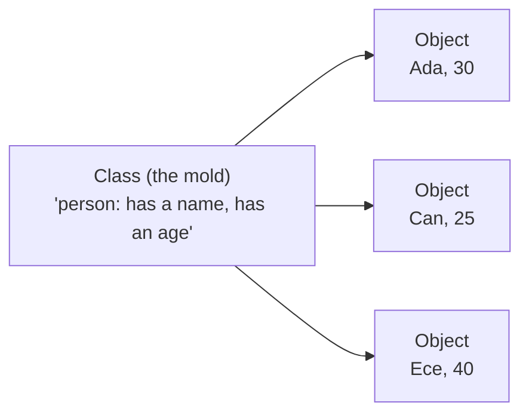

And there's our old friend the **variable:** remember from the [algorithms series](/en/blog/variables),
it was a box you wrote a name on and put a value inside. In this post, when I say "a note pointing to an
object," the thing holding that note is really a variable.

That's enough for now. Let's get back to our real subject — because, as you'll see, the JVM's main job
is exactly this: **loading these classes and managing the objects that come out of them.**

## Let's picture the JVM as a business

The JVM is not a single, magical box. Think of it like a small business where things run smoothly. In
this business there are roughly three departments, plus a side door:

- **The doorkeeper (Class Loader):** the department that takes your program in, checks it and puts it in
  place in an orderly way.
- **The warehouse and work desks (Memory):** the place where all the things (the data, the objects) sit
  while the program runs.
- **The kitchen (Execution Engine):** where the real work gets done. The crew that reads and runs the
  code, speeds up frequent jobs and clears the desks.
- **The side door (JNI):** the door through which Java talks to the outside world (the operating
  system).

Here is the whole picture:

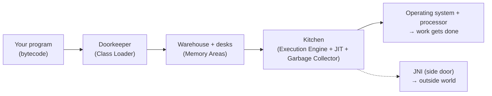

The rest of this post is about visiting each of these departments one by one. We'll stop at: the door
(class loading), the inside of a `.class` file, the warehouse and desks (memory), the garbage
collector, the kitchen (JIT), method calls, threads, JNI and modules. It's a long list, but don't
worry, we'll tour it all slowly.

<Callout type="note" title="For the curious: there is actually more than one JVM">
Believe it or not, "the JVM" is not a single program but a **recipe**: a set of rules saying "a Java
virtual machine should behave like this." Several different builds bring this recipe to life; the most
common is **HotSpot** (usually that's what we mean when we say "the JVM"), but there are others like
**OpenJ9** and **GraalVM.** They all run the same bytecode, just using different tricks under the hood.
This detail doesn't matter for now; just keep "there's more than one brand of JVM" tucked away in a
corner of your mind.
</Callout>

## First part: the door — loading classes

Running a program is like a new employee's first day. Someone greets them at the door, checks who they
are, gets their desk ready and makes them ready to start work. In the JVM, the department that does this
is called the **class loader.**

First, a nice detail: this job is **lazy.** The JVM doesn't sit down at the start of the program and
pull all the parts in at once. It calls a part only the very **first moment it truly needs it** — just
like a restaurant that, instead of piling all the ingredients on the counter, takes out the ingredients
for whichever dish was ordered right at that moment. A class you never use is never brought in; this
keeps the business light and fast.

Every class that is brought in goes through three stages:

<Steps>
1. **Take in (Loading):** The class's file (that `.class` bytecode) is found and brought into memory.
2. **Link (Linking):** Three small jobs together. First **checking:** is the incoming file really valid
   and safe? A corrupt or malicious file cannot get through here. (Much of the "Java is safe" promise
   from [Part 1](/en/blog/what-is-java) is exactly this checking step.) Then **preparing space:** boxes
   are opened in memory for the class's shared (`static`) variables. Finally **binding addresses:**
   names in the code like "that method in that class" are bound to their real places in memory.
3. **Initialize (Initialization):** The starting values you wrote in your code (like `static int NUM =
   42;`) settle into place at exactly this step. Now the class is ready to use.
</Steps>

### A nice rule at the door: "ask the one above first"

There isn't really a single doorkeeper; there is a **chain.** At the very top is the most trusted keeper
that brings in Java's own core classes (*Bootstrap*), below it a helper (*Platform*), and at the bottom
the keeper that brings in your classes (*Application*). When a class is to be loaded, the keeper at the
bottom doesn't jump straight in; it first asks the one above it, who asks the one above them: "would you
load this?" If no one at the top can load it, the job comes back down to the bottom.

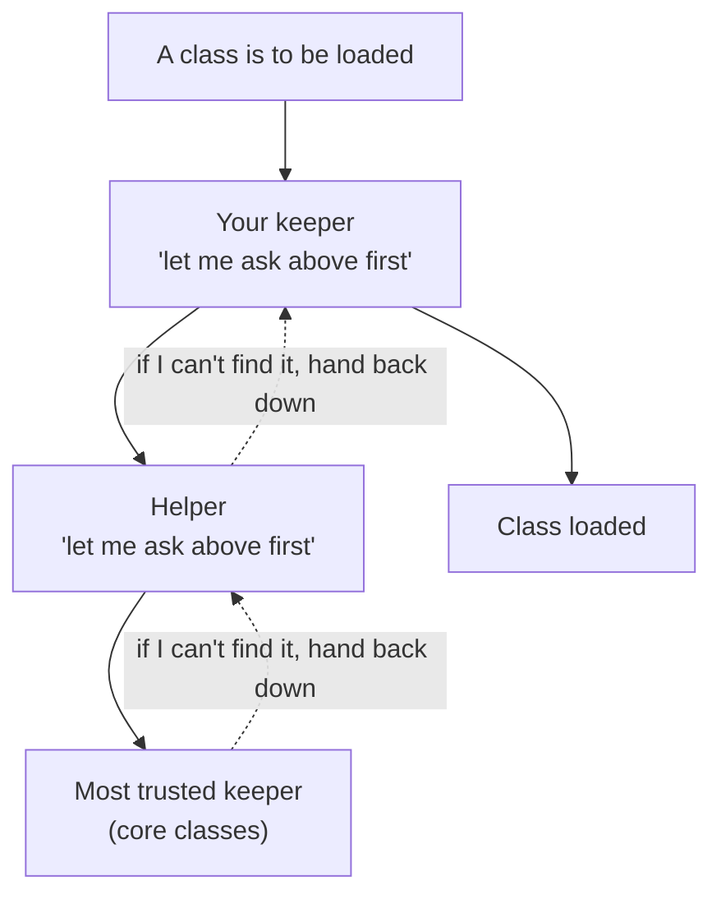

Why is this order there? For safety. Even if you accidentally write a class named `String`, you
**cannot** override Java's real `String`; because the core classes always come from the very top, from
the most trusted source. A small rule, but there's a nice idea behind it.

<Callout type="note" title="For the curious: a class's identity">
For the JVM, a class's identity is not just its name; it is **its name plus the keeper that loaded it.**
So if a class with the same name is loaded by two different keepers, the JVM counts them as two separate
classes. In large systems (like two applications running side by side on one server) this lets each keep
its own world without mixing them up. That's all there is to it; knowing the name is enough.
</Callout>

## Second part: the inside of a .class file

[In Part 1](/en/blog/what-is-java) we saw that every `.class` file starts with `CAFEBABE`. So what's
behind it? A `.class` is not a random pile of 0s and 1s; it is an **orderly package.** Think of it like
a shipping box with a table of contents on the lid:

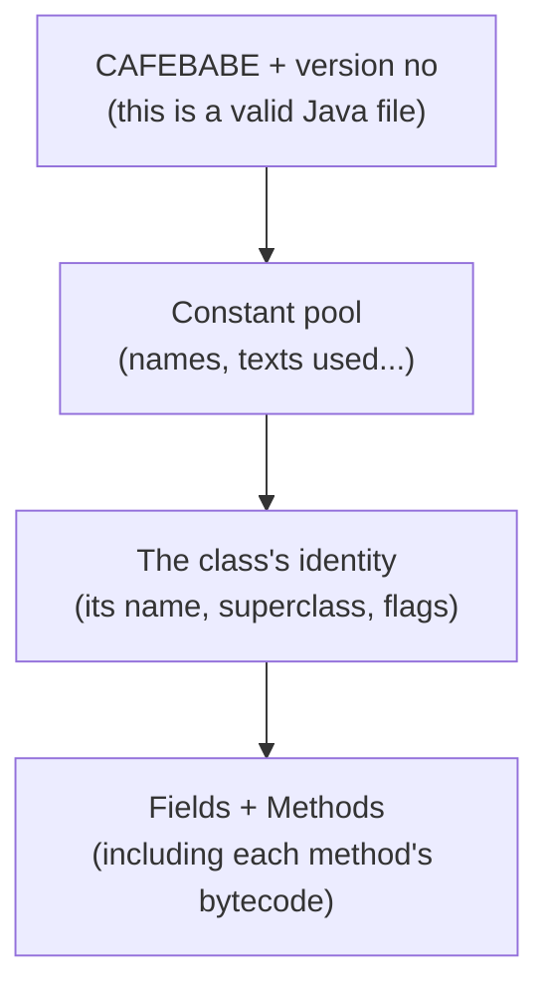

One of these deserves special attention: the **constant pool.**

<Callout type="note" title="The constant pool: the class's 'dictionary'">
While a class runs it refers to lots of names: the texts it uses (`"Hello"`), the names of other
classes, method names... Instead of embedding these everywhere one by one, the JVM gathers them all into
a single table at the start of the file. The code then refers to this table only by an **index number**
("use constant number 3"). Remember the key–value mapping from the [dictionaries post](/en/blog/dictionaries)?
This table is exactly that kind of dictionary: even if the same text appears in dozens of places, it is
stored just once in the file. It both saves space and makes the "binding addresses" job at the door
easier.
</Callout>

So a `.class` file carries two things together: **who** the class is (which fields, which methods it
has) and the **runnable bytecode** of those methods. The doorkeeper opens this box and takes it through
the process we just saw.

## Third part: the warehouse and the desks (memory)

Now we step into the busiest place in the business, the memory. While a program runs it produces lots of
things and keeps them somewhere. Picture a workshop: there are two main areas.

- **The warehouse (Heap):** all the **objects** you produce live here, in one big shared warehouse. A
  "person," a "list," an "order"... they all sit here.
- **The work desk (Stack):** the temporary notes each line of work (each method) is working on right now
  sit on a personal desk. When the job is done, the desk is cleared.

The relationship between them is this: the object **itself** is in the warehouse; on the desk there is
only a small **note** pointing to that object (a link) — like a slip of paper saying "such-and-such
object is on that shelf."

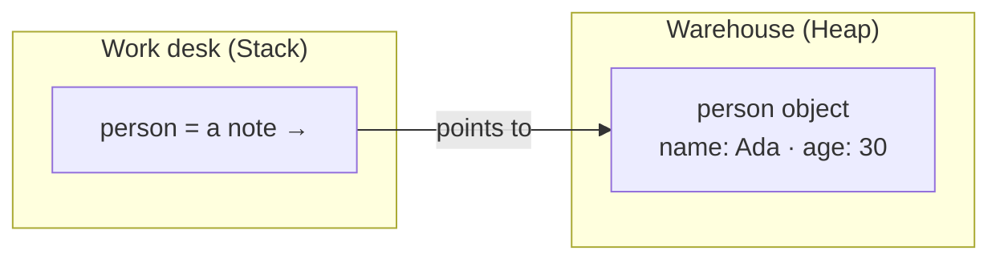

<Callout type="note" title="For the curious: a few more rooms">
Alongside these two main areas there are a few helper compartments. The "ID cards" of classes (their
structure, their shared values) are kept on a separate board; Java calls this board **Metaspace.** There
is also a tiny marker holding each line of work's "which line am I on right now" info, and a separate
desk used when work is done from the outside (C/C++). You don't have to know their names; what matters
is the pair: objects in the **warehouse,** the current job on the **desk.**
</Callout>

### How the desk works: one job on top of another

The desk part is where the program's flow lives; let's pause and look. Every time a method is called, a
new **worksheet** for that job is placed on the desk. This sheet has three corners: in one corner the
job's **materials at hand** (its parameters and local variables), in one corner the **place where the
math is done,** and in one corner a note saying **"which job am I doing, where do I return when it's
finished."**

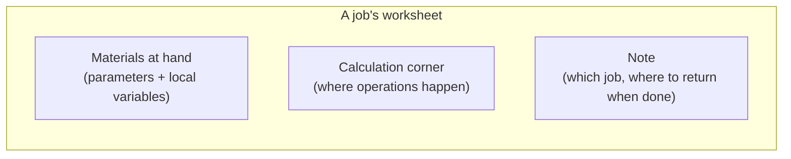

If a method calls another method, that one's sheet is placed **on top** of the previous one. When the
job finishes and we return, the topmost sheet is lifted off and the job below continues from where it
left off:

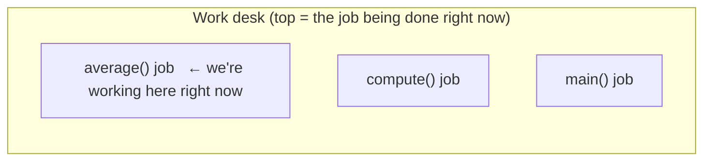

`main` calls `compute`; it calls `average`. The sheets pile up on top of each other; with every
`RETURN` the topmost one is lifted off. This simple "put on top, lift off when done" arrangement is what
[functions](/en/blog/functions) calling each other looks like under the hood.

<Callout type="tip" title="A famous error comes from here: 'StackOverflowError'">
If a method keeps calling itself without stopping (by accident, like a repetition with no end), new
sheets keep piling on the desk and the desk **overflows.** That `StackOverflowError` you sometimes see
in Java is exactly this: "the work desk is full, no more sheets fit." Next time you see it, you'll know
what it is.
</Callout>

## Fourth part: the garbage collector

Now we come to the nicest mechanism in the warehouse. A program constantly produces new objects, but
most of them serve a purpose and immediately turn to trash. Like the plates in a kitchen: most plates
are used once and go to the wash, only a few pots stay in play for a long time.

The **garbage collector** is the dishwasher of this kitchen. It roams in the background, collects the
objects nobody uses anymore and frees up their space. You never say "clear that plate"; it sees for
itself which ones aren't being used.

So how does it tell that an object is "no longer used"? It starts from a few **ends** it holds (like the
links on the desks of running jobs) and, going from thread to thread, sees where it can reach. Every
object it can reach is alive. Objects it can reach from no end are trash — that "if nobody points to it,
it's trash" idea from [Part 1](/en/blog/what-is-java).

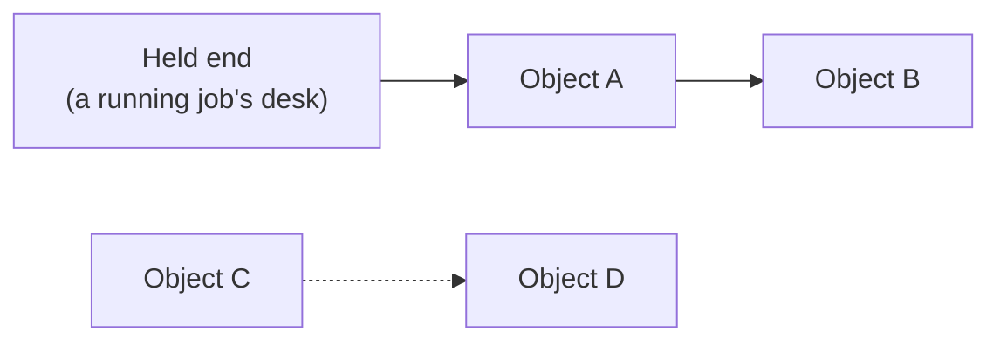

Above, A and B are attached to the end we hold; both are **alive,** and preserved. C and D, even though
they point to each other, are attached to no end; both are **unreachable,** that is, trash. On its next
round the garbage collector cleans up C and D — without you saying a single "delete."

### Young and old: why this split?

The garbage collector has a nice trick. Since most objects die young (like those quickly-dirtied
plates), let's split the warehouse in two: a **"young" region** where new objects are born, and an
**"old" region** the rare ones that manage to live long are moved into.

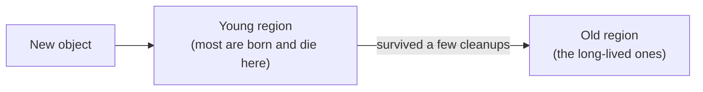

Most of the time the garbage collector only looks at the small young region; it finishes quickly there
because most objects are already trash. This is called a **quick collection** (minor GC). Now and then
it cleans the whole warehouse, old region included, from top to bottom; this is heavier and is called a
**big cleanup** (major GC). If an object survives a few quick collections and keeps living, it is
promoted to the old region as "this one will live long."

<Callout type="note" title="For the curious: a moment's pause and different dishwashers">
To do its job safely, the garbage collector sometimes stops the program for **a moment** (this is called
"stop-the-world"). These pauses usually last the blink of an eye and you don't notice them; but in
places like banking or gaming, where every millisecond matters, they become a big deal. That's why Java
has **several** garbage collectors: a plain one (Serial), a parallel one (Parallel), today's default
(**G1**), and low-latency ones that almost eliminate the pauses (ZGC, Shenandoah). One sentence is
enough: **the default G1 is perfectly fine for most work,** and you don't bother choosing.
</Callout>

## Fifth part: the kitchen — how code runs and speeds up

Now we reach the cleverest part: the kitchen that actually runs the code. How does the JVM run your
bytecode? Let's go with an example.

Say there's a calculation in your program that runs thousands of times a second. At the very start the
JVM reads and runs the code **line by line** — just like following a recipe step by step the first time
you make it. But it also watches: "that calculation keeps running." After a while it thinks:

> "Since I keep doing this job, instead of reading and translating it from scratch every time, let me
> translate it once, properly, and set it aside. When I need it again I'll use the ready one."

Just like a dish you cook often. The first few times you look at the recipe; by the twentieth time you
make it from memory. The JVM **memorizes** the most-run pieces of code the same way: it translates them
into machine language once and keeps them, then always uses that ready, fast version. That's the secret
behind a program speeding itself up as it runs. This trick is called **JIT** (keep it in mind if you
like; if not, no matter — the idea is what counts).

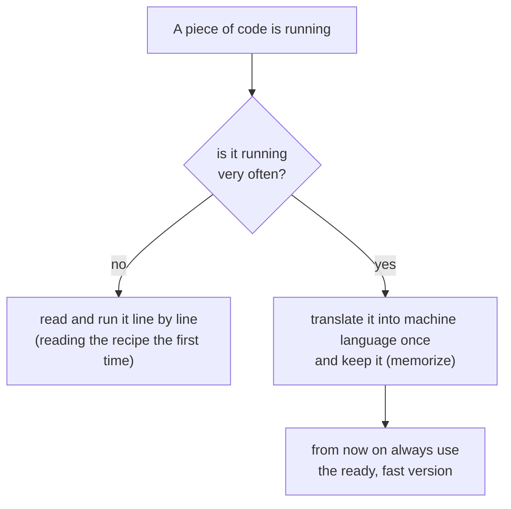

<Callout type="note" title="For the curious: speeding up in stages, and little bits of magic">
The JVM doesn't take a piece of code to "very fast" in one shot; it makes it gradually better in several
stages as it heats up. First it quickly produces a "good enough" version, and the truly hot ones it
optimizes down to the finest detail at the very end. Why in stages? Because the heaviest optimization is
expensive; it's smart to spend it only on the code that truly deserves it (like a carpenter using fine
sandpaper only on the surface that will show).

One of these optimizations is this: it **copies** the contents of a small method straight into the place
that calls it (this is called "inlining"), removing the cost of the [call](/en/blog/functions). And
another: the JVM makes these fast versions based on certain assumptions; if an assumption is broken
unexpectedly, it doesn't panic, it **falls back** to the safe, slow version. So it is both bold and
cautious.
</Callout>

### How does the JVM find the right method?

One of the kitchen's frequent jobs is calling methods, and there's a little cleverness hidden here. Say
you have a thing called an "animal," but the real object inside it is a **cat.** When you say
`animal.makeSound()`, how does the JVM know whether to make the cat's sound or the dog's sound? The
answer: at run time, by looking at the **real** type of the object in hand. So even though it looks like
an "animal," because the thing inside is a cat, it says "meow." To do this fast, it keeps a kind of
"table of contents" of each class's methods and reaches the right method from there in a single step.

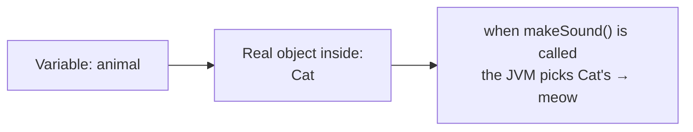

This is what object-oriented programming's "polymorphism" — which
[we'll cover at length later](/en/blog/what-is-java) — looks like under the hood. For now it's enough to
say "the JVM picks the right method according to the object's real type."

## Sixth part: threads (many jobs at once)

We've been saying "line of work" all along; let's now pin it down in one sentence. A **thread** is a
separate line of work running at the same time inside your program. A modern program does many things at
once: one draws the screen while another downloads data and a third saves a file. Each one is a thread.

The JVM's memory layout is designed for exactly this. Remember: **the warehouse (Heap) is shared,** so
all lines of work share the same objects. But each line of work has **its own desk (Stack).** We summed
it up as "shared warehouse, separate desks" — that's the secret to doing many jobs at once. The lines of
work reach the same objects but never mix up their own temporary work.

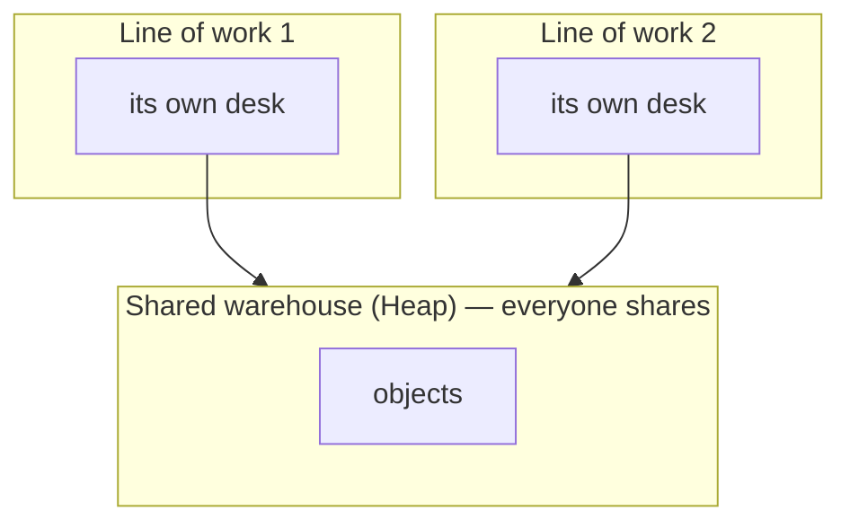

<Callout type="note" title="For the curious: who sees what, and when?">
When lines of work share the same objects, a subtle question arises: when one changes an object, when
does the other **see** it? These visibility rules are set by Java's own rules (keywords like `volatile`
tune this). It's an advanced topic in its own right; you don't need to know it for now. Oh, and one more:
[Java 21's](/en/blog/what-is-java) "virtual threads" are a modern innovation that lets you run millions
of lines of work cheaply; just having heard the name is enough.
</Callout>

## The side door: Java sometimes steps outside (JNI)

Everything I've described so far happens in the JVM's **safe, orderly world.** But sometimes you have to
step outside this world. Why? To read a file, pull data from the network, write something to the
screen... at the very bottom of these is actually the **operating system**; in the end it's the one that
does the job. Even Java itself has to reach outside its own world at this point. So even that innocent
`System.out.println` from [Part 1](/en/blog/what-is-java) passes, somewhere at its very bottom, through
this **side door** to write to the screen.

This door is called **JNI** (Java Native Interface). It serves two purposes: it lets Java talk to the
operating system, and it lets you use ready-made code written in other languages like C/C++ (libraries
that took years of effort and aren't worth rewriting) from within Java.

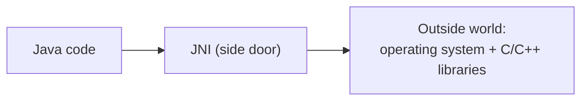

<Callout type="caution" title="But this door has a price">
Going through this door means stepping outside the JVM's safe garden — and outside is dangerous:

- **The safety shield drops.** If something goes wrong in the outside code, instead of Java's tidy
  errors, **the whole program can crash all at once.**
- **Portability breaks.** The "write once, run anywhere" beauty from [Part 1](/en/blog/what-is-java)
  doesn't hold here; that outside piece has to be prepared separately for each device.

That's why the golden rule is: **turn to JNI only when you truly have no choice.** (By the way:
[Java 22](/en/blog/what-is-java) also brought a new path that makes this door safer and easier — the
Foreign Function & Memory API; but that's an advanced topic.)
</Callout>

## The last part: Java's core is split into drawers too (modules)

Let's add one more thing and finish. Java is a huge language; inside it are thousands of ready-made tools
from text to networking, from databases to graphics. In the old days these all sat in one single, giant
chest. [Java 9](/en/blog/what-is-java) tidied this up: now Java's core is split into labeled **drawers**
(modules). The most basic drawer is called `java.base`; the language's essentials (text, numbers,
lists...) sit there.

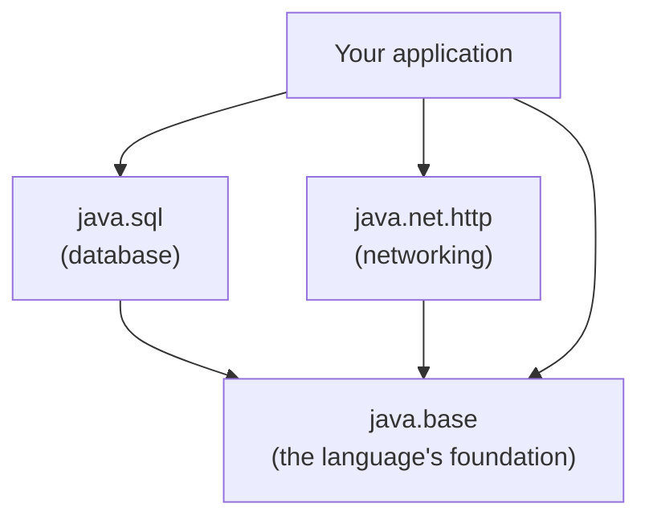

This has a nice consequence: your application doesn't need the entire giant chest, only the few drawers
it opens. With a tool called `jlink` you can take only those drawers and build a tiny, self-contained
Java package. Remember when we said in [Part 1](/en/blog/what-is-java) that "Java even runs on a
Raspberry Pi" — this is how we fit it onto small devices, with small packages like these.

## Let's put it all together: how does a program start?

We've toured all the parts; now let's bring them together and connect, in one breath, the journey from
the moment you type `java Hello` to the finish. The JVM starts up; the most trusted keeper brings in the
core classes; your `Hello` class passes through the door (brought in, checked, prepared, initialized);
the kitchen places a sheet on the desk for its `main` job and starts working; it first reads the code
line by line and memorizes the busy parts with JIT; as you produce objects the warehouse fills up, and
the garbage collector cleans it in the background; and when `main` finishes the JVM shuts down. All these
parts work together in this harmony, in every program.

## Let's wrap up

We've toured a lot of ground: we came in the door, saw the warehouse and the desks, looked at how the
kitchen works, and stopped by the side door and the drawers. Now let's gather it all into a short list so
it sticks.

<Callout type="tip" title="Pocket this">
- Think of the JVM as a business: a **doorkeeper** (class loader), a **warehouse + desks** (memory), a
  **kitchen** (execution engine) and a **side door** (JNI). "The JVM" is really a recipe; its most
  common build is **HotSpot.**
- Classes are loaded **when needed** (lazily): take in → link (check/prepare/address) → initialize. The
  "ask the one above first" rule in the chain of keepers protects the core.
- A **.class file** is an orderly box (`CAFEBABE` + **constant pool/dictionary** + identity + bytecode).
- **Objects in the shared warehouse (Heap),** the current job on a **personal desk (Stack).** If the
  desk overflows, `StackOverflowError`.
- The **garbage collector** collects the unused; because most objects die young, the warehouse is split
  into **young/old** (quick collection vs big cleanup). The default is **G1.**
- **JIT:** the JVM "memorizes" the most-run code and speeds it up stage by stage.
- **Threads** share the warehouse but each has its own desk. **JNI** is the side door to the outside
  world. **Modules** split the core into drawers (`java.base`, `jlink`).
- Up next: we're done with theory. Now it's time to **install Java (JDK 25) and write our first
  `Hello, world!` program with our own hands.** Let's get our hands dirty.
</Callout>
