import Callout from '../../components/Callout.astro';
import Steps from '../../components/Steps.astro';

[Önceki yazıda](/blog/java-nedir) JVM'in haritasını çıkarmıştık: yazdığın kod bytecode'a çevriliyor,
JVM onu alıp çalıştırıyor. Haritaya bakmak güzeldi ama bir şehri gerçekten tanımak için sokaklarında
yürümek gerekir. Bu yazıda tam onu yapacağız: JVM'in kapısından içeri girip, bütün bileşenlerine tek
tek uğrayacağız.

Şunu baştan söyleyeyim: bu, serinin en meraklı ve en dolu yazısı. Ama söz veriyorum, hiçbir yerde seni
jargona boğmayacağım. Her bileşeni önce günlük hayattan bir benzetmeyle anlatacağım; teknik adları da
en sona, "istersen aklında tut, tutmasan da olur" rahatlığıyla bırakacağım. En derin ayrıntıları da
**"merak edenler için"** kutularına koyacağım — istersen okur, istersen atlayıp devam edersin. Kahveni
al, başlıyoruz.

<Callout type="note" title="Bunları bilmesem Java yazamaz mıyım?">
Yazarsın, hem de gayet iyi. JVM bu yazıdaki her işi senin için, sen hiç fark etmeden yapıyor. O hâlde
neden anlatıyorum? Çünkü kullandığın şeyin içini bilmek güzeldir. Bir gün programın beklenmedik şekilde
yavaşladığında ya da belleği şiştiğinde, "acaba içeride ne oluyor?" diye sorduğunda, bu yazı sana o
pencereyi açacak. Rahat ol; bunları ezberlemen gerekmiyor.
</Callout>

## Önce iki kelime: sınıf ve nesne

Bu yazıda iki kelime sık sık geçecek: **sınıf** ve **nesne.** Java'da bunları nasıl yazacağımızı
ileride uzun uzun işleyeceğiz; ama JVM turunu rahat takip edebilmen için şimdi kısacık tanışalım.

Bir **kurabiye kalıbı** düşün. Kalıbın kendisi bir kurabiye değildir; sadece "kurabiye şöyle olacak"
diyen bir şablondur. İşte **sınıf** budur: bir şeyin nasıl olacağını anlatan kalıp. Mesela "bir kişinin
bir adı ve bir yaşı olur" diyen bir tarif.

O kalıpla yaptığın **her bir gerçek kurabiye** ise bir **nesnedir.** Aynı kalıptan (sınıftan) istediğin
kadar kurabiye (nesne) çıkarırsın; her biri ayrıdır. Yani kısaca: **sınıf kalıptır, nesne o kalıptan
çıkan gerçek şey.**

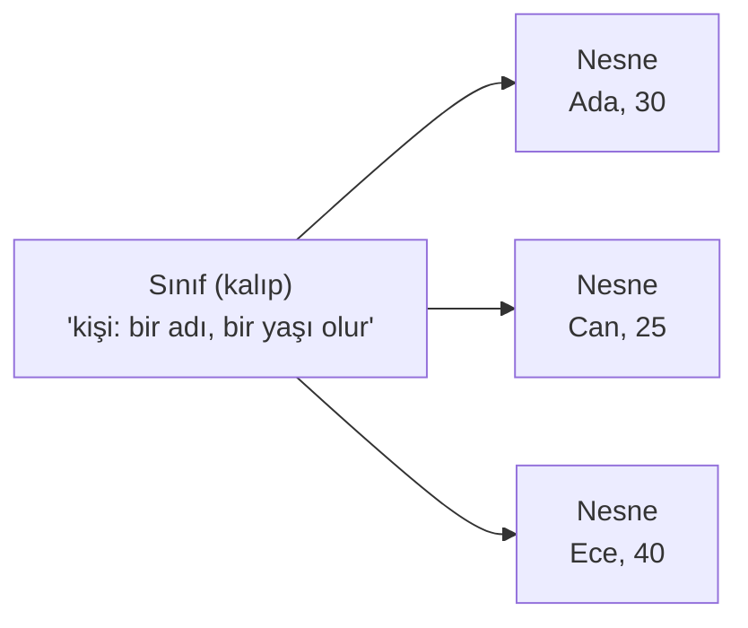

Bir de eski dostumuz **değişken:** [algoritma serisinden](/blog/degiskenler) hatırla, üstüne isim
yazdığın, içine bir değer koyduğun bir kutuydu. Bu yazıda "bir nesneye giden not" derken, o notu tutan
şey de aslında bir değişkendir.

Bu kadarı yeter. Şimdi asıl konumuza dönelim — çünkü göreceğin gibi, JVM'in başlıca işi tam da bu
**sınıfları yükleyip, onlardan çıkan nesneleri yönetmek.**

## JVM'i bir işletmeye benzetelim

JVM tek parça, sihirli bir kutu değil. Onu, işleri yolunda giden küçük bir işletme gibi düşün. Bu
işletmede kabaca üç bölüm çalışıyor, bir de bir yan kapı var:

- **Kapı görevlisi (Sınıf Yükleyici):** Senin programını içeri alan, kontrol eden ve düzenli biçimde
  yerleştiren bölüm.
- **Depo ve çalışma masaları (Bellek):** Program çalışırken bütün eşyaların (verilerin, nesnelerin)
  durduğu yer.
- **Mutfak (Çalıştırma Motoru):** İşin asıl yapıldığı yer. Kodu okuyup çalıştıran, sık yapılan işleri
  hızlandıran ve masaları toplayan ekip.
- **Yan kapı (JNI):** Java'nın, dışarıdaki dünyayla (işletim sistemiyle) konuştuğu kapı.

İşte bütün resim:

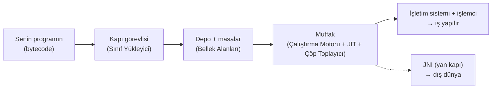

Bu yazının geri kalanı, bu bölümlerin her birine tek tek uğramak olacak. Uğrayacaklarımız: kapı
(sınıf yükleme), `.class` dosyasının içi, depo ve masalar (bellek), çöp toplayıcı, mutfak (JIT), metot
çağrıları, iş parçacıkları, JNI ve modüller. Uzun bir liste ama merak etme, hepsini yavaş yavaş
gezeceğiz.

<Callout type="note" title="Merak edenler için: aslında birden çok JVM var">
İster inan ister inanma, "JVM" tek bir program değil, bir **tarif**tir: "bir Java sanal makinesi şöyle
davranmalı" diyen bir kurallar bütünü. Bu tarifi hayata geçiren birkaç farklı yapım var; en yaygını
**HotSpot** (çoğu zaman "JVM" derken bunu kastediyoruz), ama **OpenJ9** ve **GraalVM** gibi başkaları
da var. Hepsi aynı bytecode'u çalıştırır, sadece kaputun altında farklı numaralar kullanır. Bu ayrıntı
şimdilik önemli değil; sadece "JVM markası bir değilmiş" diye aklının bir köşesinde dursun.
</Callout>

## Birinci bileşen: kapı — sınıfların yüklenmesi

Bir programı çalıştırmak, yeni bir çalışanın ilk gününe benzer. Kapıda biri onu karşılar, kim olduğunu
kontrol eder, masasını hazırlar ve işe başlamaya hazır hâle getirir. JVM'de bu işi yapan bölüme
**sınıf yükleyici** (class loader) denir.

Önce hoş bir ayrıntı: bu iş **tembeldir.** JVM, programın başında oturup bütün parçaları birden içeri
almaz. Bir parçayı ancak ona **ilk kez gerçekten ihtiyaç duyduğu an** çağırır — tıpkı bir restoranın
bütün malzemeleri masaya yığmak yerine, hangi yemek sipariş edildiyse onun malzemesini o an çıkarması
gibi. Kullanmadığın bir sınıf hiç içeri alınmaz; bu da işletmeyi hafif ve hızlı tutar.

İçeri alınan her sınıf üç aşamadan geçer:

<Steps>
1. **İçeri al (Yükleme):** Sınıfın dosyası (o `.class` bytecode'u) bulunur ve belleğe getirilir.
2. **Bağla (Bağlama):** Üç küçük iş bir arada. Önce **kontrol:** gelen dosya gerçekten geçerli ve
   güvenli mi? Bozuk ya da kötü niyetli bir dosya buradan geçemez. ([Bölüm 1'deki](/blog/java-nedir)
   "Java güvenlidir" sözünün büyük kısmı işte bu kontrol adımında.) Sonra **yer hazırlama:** sınıfın
   ortak (`static`) değişkenleri için bellekte kutular açılır. Son olarak **adres bağlama:** koddaki
   "şu sınıftaki şu metot" gibi isimler, bellekteki gerçek yerlere bağlanır.
3. **Başlat (Başlatma):** Senin kodunda yazdığın başlangıç değerleri (`static int SAYI = 42;` gibi)
   tam bu adımda yerine oturur. Artık sınıf kullanıma hazırdır.
</Steps>

### Kapıda güzel bir kural: "önce üste sor"

Aslında tek bir kapı görevlisi yok; bir **zincir** var. En tepede Java'nın kendi çekirdek sınıflarını
getiren en güvenilir görevli (*Bootstrap*), onun altında bir yardımcı (*Platform*), en altta da senin
sınıflarını getiren görevli (*Application*). Bir sınıf yükleneceği zaman, en alttaki görevli işe hemen
girişmez; önce bir üstündekine sorar, o da bir üstüne: "bunu sen yükler misin?" En tepeden kimse
yükleyemezse, iş en alta geri döner.

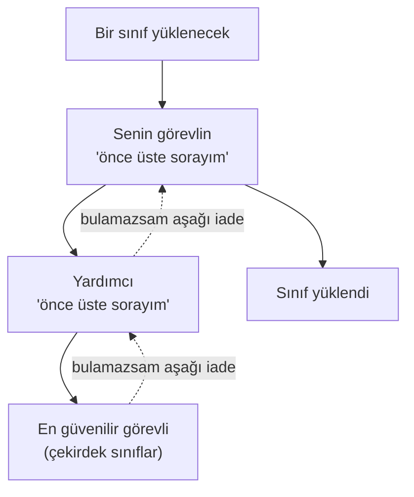

Bu sıra neden var? Güvenlik için. Sen yanlışlıkla `String` adında bir sınıf yazsan bile, Java'nın
gerçek `String`'ini **ezemezsin;** çünkü çekirdek sınıflar hep en tepeden, en güvenilir kaynaktan
gelir. Küçük bir kural ama arkasında güzel bir düşünce var.

<Callout type="note" title="Merak edenler için: bir sınıfın kimliği">
JVM için bir sınıfın kimliği yalnızca adı değildir; **adı artı onu yükleyen görevlidir.** Yani aynı
isimdeki bir sınıf iki farklı görevli tarafından yüklenirse, JVM bunları iki ayrı sınıf sayar. Bu,
büyük sistemlerde (bir sunucuda yan yana çalışan iki uygulama gibi) her birinin kendi dünyasını
karıştırmadan tutmasını sağlar. Ayrıntısı bu kadar; adını bilmen yeter.
</Callout>

## İkinci bileşen: bir .class dosyasının içi

[Bölüm 1'de](/blog/java-nedir) her `.class` dosyasının `CAFEBABE` ile başladığını görmüştük. Peki
arkasında ne var? Bir `.class`, rastgele bir yığın 0 ve 1 değil; **düzenli bir paket.** Onu, üstünde
içindekiler listesi olan bir kargo kolisi gibi düşün:

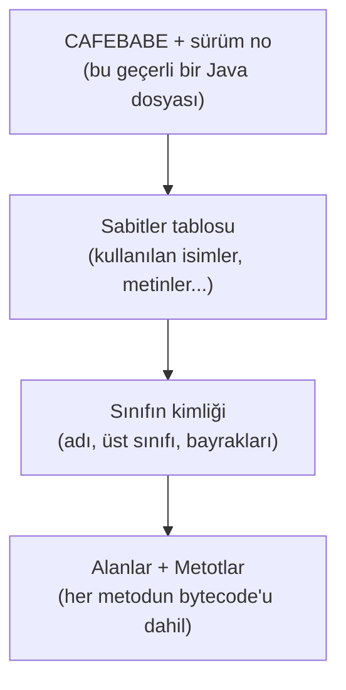

Bunlardan biri özel ilgiyi hak ediyor: **sabitler tablosu** (teknik adı *constant pool*).

<Callout type="note" title="Sabitler tablosu: sınıfın 'sözlüğü'">
Bir sınıf çalışırken bir sürü isme gönderme yapar: kullandığı metinler (`"Merhaba"`), başka sınıfların
adları, metot isimleri... Bunları her yere tek tek gömmek yerine, JVM hepsini dosyanın başındaki tek
bir tabloda toplar. Kod ise bu tabloya sadece **sıra numarasıyla** ("3 numaralı sabiti kullan") gönderme
yapar. [Sözlükler yazısındaki](/blog/sozlukler) anahtar–değer eşlemesini hatırladın mı? Bu tablo da
tam öyle bir sözlük: aynı metin onlarca yerde geçse bile dosyada bir kez tutulur. Hem yer kazandırır,
hem de kapıdaki "adres bağlama" işini kolaylaştırır.
</Callout>

Yani bir `.class` dosyası iki şeyi bir arada taşır: sınıfın **kim olduğunu** (hangi alanları, hangi
metotları var) ve o metotların **çalıştırılabilir bytecode'unu.** Kapı görevlisi bu koliyi açıp az önce
gördüğümüz süreçten geçirir.

## Üçüncü bileşen: depo ve masalar (bellek)

Şimdi işletmenin en kalabalık yerine, belleğe giriyoruz. Bir program çalışırken bir sürü şey üretir ve
bir yerde tutar. Bir atölye düşün: iki ana alan var.

- **Depo (Heap):** Ürettiğin bütün **nesneler** burada, büyük ortak bir depoda yaşar. Bir "kişi", bir
  "liste", bir "sipariş"... hepsi burada durur.
- **Çalışma masası (Stack):** Her iş kolunun (her metodun) o an üzerinde çalıştığı geçici notlar,
  kişisel bir masada durur. İş bitince masa temizlenir.

Aradaki ilişki şöyle: nesnenin **kendisi** depodadır; masanın üstünde ise o nesneye giden küçük bir
**not** (bir bağlantı) vardır — "falanca nesne şu rafta" diyen bir kâğıt gibi.

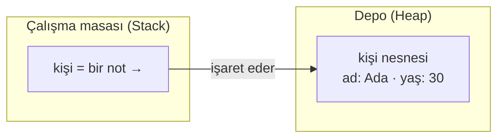

<Callout type="note" title="Merak edenler için: birkaç oda daha">
Bu iki ana alanın yanında birkaç yardımcı bölme daha var. Sınıfların "kimlik kartları" (yapıları,
ortak değerleri) ayrı bir panoda tutulur; Java bu panonun adına **Metaspace** der. Ayrıca her iş
kolunun "şu an hangi satırdayım" bilgisini tutan minicik bir imi, ve dışarıdan (C/C++) iş yapılırken
kullanılan ayrı bir masası vardır. Adlarını bilmesen de olur; önemli olan ikili: nesneler **depoda,**
o anki iş **masada.**
</Callout>

### Masa nasıl çalışır: bir işin üstüne bir iş

Masa kısmı, programın akışının yaşadığı yerdir; biraz durup bakalım. Bir metot her çağrıldığında,
masaya o işe ait yeni bir **çalışma kâğıdı** konur. Bu kâğıdın üç köşesi vardır: bir köşede o işin
**elindeki malzemeler** (parametreler ve yerel değişkenler), bir köşede **hesabın yapıldığı yer,** bir
köşede de **"hangi işi yapıyorum, bitince nereye döneceğim"** notu.

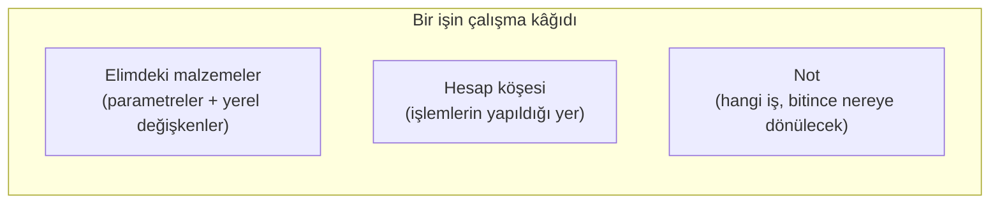

Metot bir başka metodu çağırırsa, onun kâğıdı bir öncekinin **üstüne** konur. İş bitip geri dönülünce
en üstteki kâğıt kaldırılır ve alttaki işe kalınan yerden devam edilir:

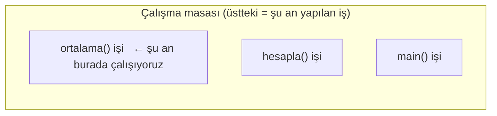

`main`, `hesapla`yı çağırır; o da `ortalama`yı çağırır. Kâğıtlar üst üste yığılır; her `DÖNDÜR`de en
üstteki kalkar. Bu basit "üste koy, bitince kaldır" düzeni, [fonksiyonların](/blog/fonksiyonlar) nasıl
iç içe çağrıldığının kaputun altındaki hâli.

<Callout type="tip" title="Meşhur bir hata buradan gelir: 'StackOverflowError'">
Bir metot kendini durmadan çağırırsa (yanlışlıkla, sonu olmayan bir tekrar gibi), masaya durmadan yeni
kâğıt yığılır ve masa **taşar.** Java'da bazen gördüğün o `StackOverflowError` hatası tam olarak budur:
"çalışma masası doldu, yeni kâğıt sığmıyor." Bir dahaki sefere gördüğünde ne olduğunu bileceksin.
</Callout>

## Dördüncü bileşen: çöp toplayıcı

Şimdi depodaki en güzel mekanizmaya geldik. Bir programda sürekli yeni nesneler üretilir ama çoğu bir
işe yarayıp hemen çöpe döner. Bir mutfaktaki tabaklar gibi: çoğu tabak bir kez kullanılıp bulaşığa
gider, sadece birkaç tencere uzun süre işte kalır.

İşte **çöp toplayıcı** (garbage collector), bu mutfağın bulaşıkçısıdır. Arka planda dolaşır, artık
kimsenin kullanmadığı nesneleri toplar ve yerlerini açar. Sen "şu tabağı kaldır" demezsin; o,
kullanılmayanı kendi görür.

Peki bir nesnenin "artık kullanılmadığını" nasıl anlıyor? Elinde tuttuğu birkaç **uçtan** (çalışan
işlerin masasındaki bağlantılar gibi) başlar ve iplikten ipliğe giderek nereye ulaşabildiğine bakar.
Ulaşabildiği her nesne canlıdır. Hiçbir uçtan ulaşılamayan nesneler ise çöptür — [Bölüm 1'deki](/blog/java-nedir)
o "kimse işaret etmiyorsa çöptür" fikri.

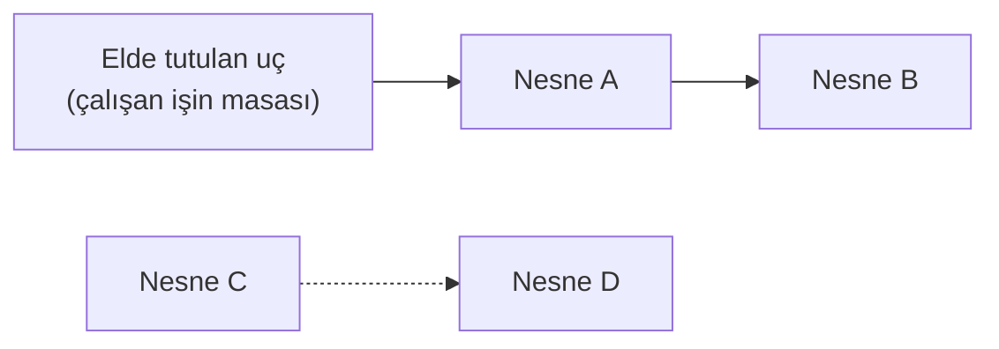

Yukarıda A ve B, elimizdeki uca bağlı; ikisi de **canlı,** korunur. C ile D ise birbirini işaret etse
bile hiçbir uca bağlı değil; ikisi de **ulaşılamaz,** yani çöp. Çöp toplayıcı bir sonraki turunda C ve
D'yi temizler — sen tek bir "sil" bile demeden.

### Gençler ve yaşlılar: neden bu ayrım?

Çöp toplayıcının güzel bir numarası var. Madem nesnelerin çoğu genç ölüyor (o çabuk kirlenen tabaklar
gibi), depoyu ikiye ayıralım: yeni nesnelerin doğduğu bir **"gençlik" bölgesi,** ve nadiren de olsa
uzun yaşamayı başaranların taşındığı bir **"yaşlılar" bölgesi.**

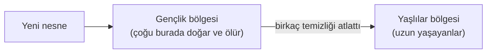

Çöp toplayıcı çoğu zaman sadece küçük gençlik bölgesine bakar; orada işi çabuk biter çünkü zaten çoğu
nesne çöptür. Buna **hızlı toplama** (minor GC) denir. Ara sıra da bütün depoyu, yaşlılar dahil baştan
sona temizler; bu daha ağırdır, adı **büyük temizlik** (major GC). Bir nesne birkaç hızlı toplamayı
atlatıp yaşamaya devam ederse, "bu uzun yaşayacak" diye yaşlılar bölgesine terfi eder.

<Callout type="note" title="Merak edenler için: bir an duruş ve farklı bulaşıkçılar">
Çöp toplayıcı işini güvenle yapabilmek için bazen programı bir **anlığına** durdurur (buna
"stop-the-world" denir). Bu duraklamalar çoğu zaman göz açıp kapayıncaya kadar sürer ve fark etmezsin;
ama bankacılık ya da oyun gibi her milisaniyenin önemli olduğu yerlerde büyük mesele olur. Bu yüzden
Java'nın **birden çok** çöp toplayıcısı vardır: sade olanı (Serial), paralel çalışanı (Parallel),
bugünün varsayılanı (**G1**), ve duraklamayı neredeyse yok eden düşük gecikmeli olanları (ZGC,
Shenandoah). Tek cümle yeter: **varsayılan G1 çoğu iş için gayet iyidir,** sen seçmekle uğraşmazsın.
</Callout>

## Beşinci bileşen: mutfak — kod nasıl çalışır ve hızlanır?

Geldik en zekice bölüme: kodu asıl çalıştıran mutfağa. JVM, senin bytecode'unu nasıl işletiyor? Bir
örnekle gidelim.

Diyelim programında bir hesap var ve saniyede binlerce kez çalışıyor. JVM en başta kodu **satır satır
okuyup** çalıştırır — tıpkı bir tarifi ilk kez yaparken adım adım takip etmen gibi. Ama bir yandan da
izler: "şu hesap durmadan çalışıyor." Bir süre sonra şöyle düşünür:

> "Madem bu işi durmadan yapıyorum, her seferinde baştan okuyup çevirmek yerine, bir kere düzgünce
> çevireyim ve bir kenara kaydedeyim. Bir daha lazım olunca hazırı kullanırım."

Tıpkı sık pişirdiğin bir yemek gibi. İlk birkaç sefer tarife bakarsın; yirminci sefere geldiğinde artık
ezbere yaparsın. JVM de en çok çalışan kod parçalarını böyle **ezberler:** bir kere makine diline
çevirip saklar, sonra hep o hazır, hızlı sürümü kullanır. Programın çalıştıkça kendi kendine
hızlanmasının sırrı bu. Bu numaranın adı **JIT** (istersen aklında tut; tutmasan da olur, fikir önemli).

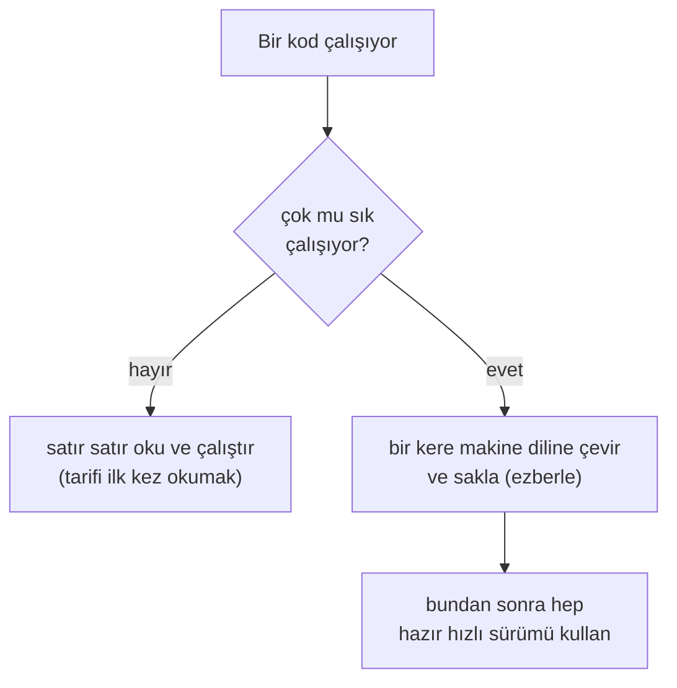

<Callout type="note" title="Merak edenler için: kademe kademe hızlanma ve küçük sihirler">
JVM bir kodu tek hamlede "çok hızlı"ya çıkarmaz; ısındıkça birkaç kademede giderek daha iyi hâle
getirir. Önce hızlıca "yeterince iyi" bir sürüm çıkarır, gerçekten çok çalışanları ise en sonunda en
ince ayrıntısına kadar iyileştirir. Neden kademeli? Çünkü en ağır iyileştirme pahalıdır; onu sadece
gerçekten değen kodlara harcamak akıllıcadır (bir marangozun sadece görünecek yüzeye ince zımpara
çekmesi gibi).

Bu iyileştirmelerden biri şu: küçük bir metodun içeriğini, onu çağıran yere doğrudan **kopyalar**
(buna "inlining" denir), böylece [çağırma](/blog/fonksiyonlar) zahmetini ortadan kaldırır. Bir de:
JVM bu hızlı sürümleri bazı varsayımlara dayanarak yapar; bir varsayım beklenmedik şekilde bozulursa,
panik yapmaz, güvenli olan yavaş sürüme **geri çekilir.** Yani hem cesur hem temkinlidir.
</Callout>

### Doğru metodu JVM nasıl buluyor?

Mutfağın sık yaptığı işlerden biri metot çağırmaktır ve burada küçük bir zeka gizli. Diyelim elinde
"hayvan" diye bir şey var ama içindeki gerçek nesne bir **kedi.** `hayvan.sesÇıkar()` dediğinde JVM,
kedinin sesini mi köpeğin sesini mi çıkaracağını nereden biliyor? Cevap: çalışma anında, elindeki
nesnenin **gerçek** tipine bakarak. Yani "hayvan" görünse bile, içindeki kedi olduğu için "miyav"
der. Bunu hızlı yapmak için her sınıfın metotlarının bir çeşit "içindekiler listesini" tutar ve doğru
metoda oradan tek adımda ulaşır.

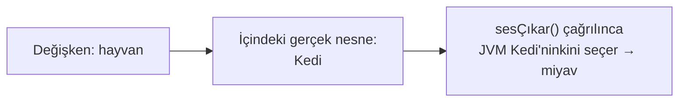

Bu, [ileride uzun uzun işleyeceğimiz](/blog/java-nedir) nesne yönelimli programlamanın ("çok
biçimlilik") kaputun altındaki hâli. Şimdilik "JVM, doğru metodu nesnenin gerçek tipine göre seçer"
demen yeter.

## Altıncı bileşen: iş parçacıkları (aynı anda birçok iş)

Baştan beri "iş kolu" deyip geçtik; şimdi bir cümleyle oturtalım. Bir **iş parçacığı** (thread),
programın içinde aynı anda yürüyen ayrı bir iş koludur. Modern bir program aynı anda birçok şey yapar:
biri ekranı çizerken bir diğeri veri indirir, bir üçüncüsü dosya kaydeder. Her biri bir iş parçacığı.

JVM'in bellek yapısı tam da bunun için tasarlanmış. Hatırla: **depo (Heap) ortaktır,** yani bütün iş
kolları aynı nesneleri paylaşır. Ama her iş kolunun **kendi çalışma masası (Stack)** vardır. "Ortak
depo, ayrı masalar" diye özetlemiştik ya — işte çok işi aynı anda yapabilmenin sırrı bu. İş kolları
aynı nesnelere ulaşır ama kendi geçici işlerini birbirine karıştırmaz.

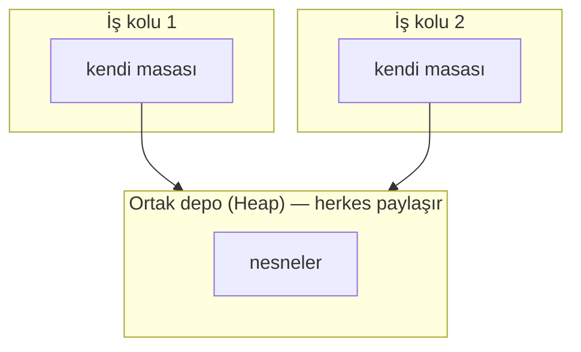

<Callout type="note" title="Merak edenler için: kim ne zaman görür?">
İş kolları aynı nesneleri paylaşınca ince bir soru doğar: biri bir nesneyi değiştirince, öbürü bunu ne
zaman **görür?** Bu görünürlük kurallarını Java'nın kendi kuralları belirler (`volatile` gibi anahtar
kelimeler bunu ayarlar). Başlı başına ileri bir konu; şimdilik bilmen gerekmiyor. Ha, bir de:
[Java 21'in](/blog/java-nedir) getirdiği "sanal iş parçacıkları," milyonlarca iş kolunu ucuza
yürütmeyi sağlayan modern bir yeniliktir; adını duymuş ol yeter.
</Callout>

## Yan kapı: Java bazen dışarı çıkar (JNI)

Şimdiye kadar anlattığım her şey, JVM'in **güvenli, düzenli dünyasında** geçiyordu. Ama bazen bu
dünyanın dışına çıkmak gerekir. Neden mi? Bir dosyayı okumak, ağdan veri çekmek, ekrana bir şey
yazmak... bunların en dibinde aslında **işletim sistemi** vardır; en sonunda o işi yapan odur. Java'nın
kendisi bile, bu noktada kendi dünyasının dışına uzanmak zorundadır. Yani [Bölüm 1'deki](/blog/java-nedir)
o masum `System.out.println` bile, en dibinde bir yerde bu **yan kapıdan** geçip ekrana yazar.

Bu kapının adı **JNI** (Java Native Interface). İki işe yarar: Java'nın işletim sistemiyle konuşmasını
sağlar, ve C/C++ gibi başka dillerle yazılmış hazır kodları (yıllarca emek verilmiş, baştan yazmaya
değmeyecek kütüphaneleri) Java'dan kullanabilmeni sağlar.

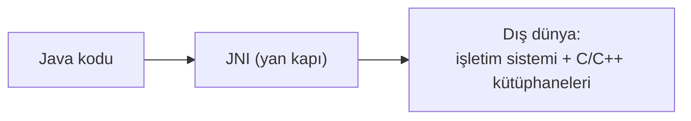

<Callout type="caution" title="Ama bu kapının bir bedeli var">
Bu kapıdan çıkmak, JVM'in güvenli bahçesinden dışarı adım atmaktır — ve dışarısı tehlikelidir:

- **Güvenlik kalkanı düşer.** Dışarıdaki kodda bir şey ters giderse, Java'daki o düzgün hatalar yerine
  **bütün program birden çökebilir.**
- **Taşınabilirlik kırılır.** [Bölüm 1'deki](/blog/java-nedir) "bir kez yaz, her yerde çalıştır"
  güzelliği burada geçerli değildir; dışarıdaki o parçayı her cihaz için ayrı hazırlamak gerekir.

Bu yüzden altın kural: **JNI'ye ancak gerçekten mecbursan başvur.** (Yeri gelmişken: [Java 22](/blog/java-nedir),
bu kapıyı daha güvenli ve kolay hâle getiren yeni bir yol da getirdi — Foreign Function & Memory API;
ama o, ileri bir konu.)
</Callout>

## Son bileşen: Java'nın çekirdeği de çekmecelere bölünmüş (modüller)

Bir şeyi daha ekleyip bitirelim. Java kocaman bir dil; içinde metinlerden ağa, veritabanından grafiğe
binlerce hazır araç var. Eskiden bunların hepsi tek, dev bir sandıkta dururdu. [Java 9](/blog/java-nedir)
bunu düzenledi: artık Java'nın çekirdeği, üstü etiketli **çekmecelere** (modüllere) bölünmüş. En temel
çekmecenin adı `java.base`'dir; dilin olmazsa olmazları (metinler, sayılar, listeler...) orada durur.

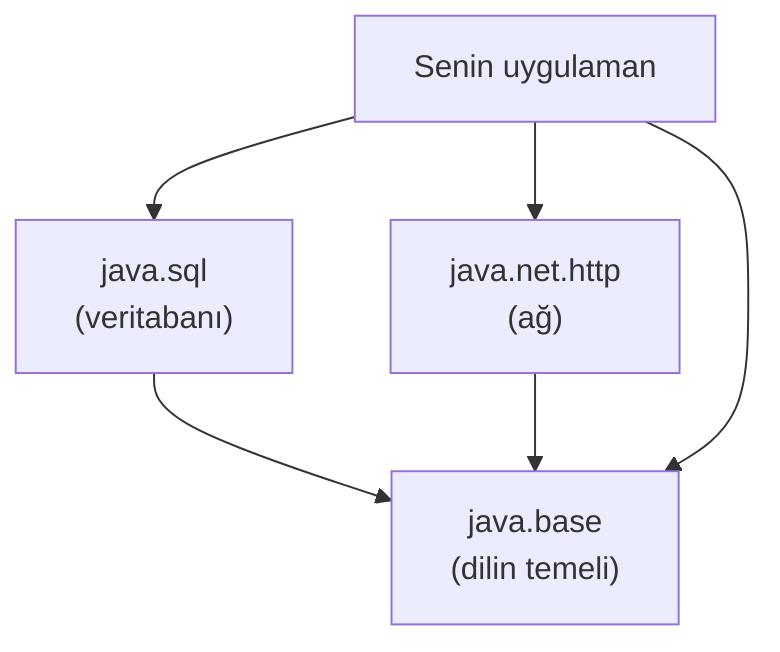

Bunun hoş bir sonucu var: uygulaman koca sandığın tamamına değil, sadece açtığı birkaç çekmeceye
ihtiyaç duyar. `jlink` denen bir araçla, yalnızca o çekmeceleri alıp küçücük, kendine yeten bir Java
paketi hazırlayabilirsin. [Bölüm 1'de](/blog/java-nedir) "Java bir Raspberry Pi'de bile çalışır"
demiştik ya — küçük cihazlara böyle küçük paketlerle sığdırıyoruz.

## Hepsini birleştirelim: bir program nasıl başlar?

Bütün bileşenleri gezdik; şimdi hepsini bir araya getirip, `java Merhaba` yazdığın andan bitişe kadarki
yolculuğu tek nefeste bağlayalım. JVM açılır; en güvenilir görevli çekirdek sınıfları içeri alır; senin
`Merhaba` sınıfın kapıdan geçer (getirilir, kontrol edilir, hazırlanır, başlatılır); mutfak, onun `main`
işi için masaya bir kâğıt koyup çalışmaya başlar; kodu önce satır satır okur, çok çalışanı JIT'le
ezberler; sen nesne ürettikçe depo dolar, çöp toplayıcı arka planda onu temizler; ve `main` bitince JVM
kapanır. İşte bütün bu bileşenler, her programda böyle bir uyum içinde çalışır.

## Toparlayalım

Çok yer gezdik: kapıdan girdik, depoyu ve masaları gördük, mutfağın nasıl çalıştığına baktık, yan
kapıya ve çekmecelere uğradık. Şimdi hepsini kısa bir listede toplayalım ki aklında kalsın.

<Callout type="tip" title="Cebine koy">
- JVM'i bir işletme gibi düşün: **kapı görevlisi** (sınıf yükleyici), **depo + masalar** (bellek),
  **mutfak** (çalıştırma motoru) ve bir **yan kapı** (JNI). Aslında "JVM" bir tariftir; en yaygın
  yapımı **HotSpot.**
- Sınıflar **gerektiğinde** yüklenir (tembel): getir → bağla (kontrol/hazırla/adres) → başlat.
  Görevliler zincirinde "önce üste sor" kuralı çekirdeği korur.
- **.class dosyası** düzenli bir kolidir (`CAFEBABE` + **sabitler tablosu/sözlük** + kimlik + bytecode).
- **Nesneler ortak depoda (Heap),** o anki iş **kişisel masada (Stack).** Masa taşarsa
  `StackOverflowError`.
- **Çöp toplayıcı** kullanılmayanı toplar; çoğu nesne genç öldüğü için depo **gençlik/yaşlılar** diye
  ayrılır (hızlı toplama vs büyük temizlik). Varsayılan **G1.**
- **JIT:** JVM en çok çalışan kodu "ezberler" ve kademe kademe hızlandırır.
- **İş parçacıkları** ortak depoyu paylaşır ama her birinin kendi masası vardır. **JNI** dış dünyaya
  açılan yan kapıdır. **Modüller** çekirdeği çekmecelere böler (`java.base`, `jlink`).
- Sırada: teoriyi bitirdik. Artık **Java'yı (JDK 25) kurup ilk `Merhaba, dünya!` programımızı kendi
  ellerimizle yazma** zamanı. Ellerimizi kirletelim.
</Callout>
