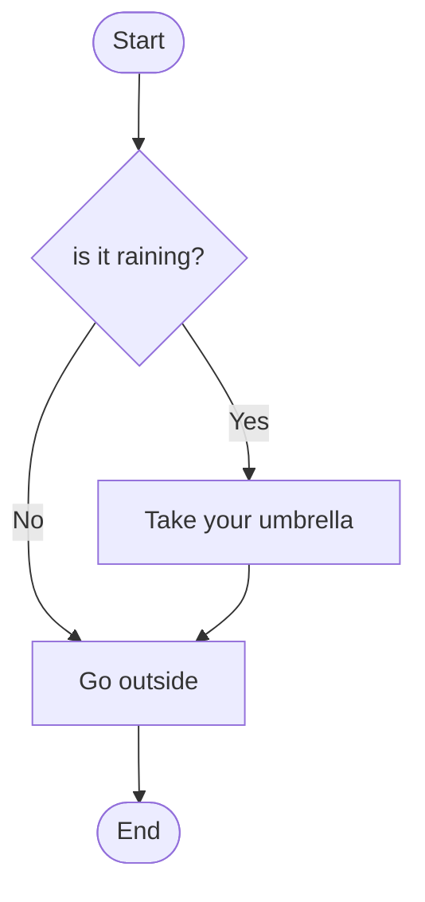
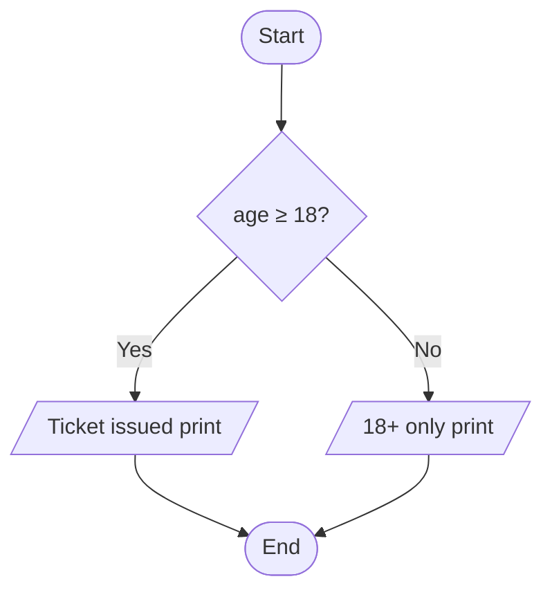

import Callout from '../../components/Callout.astro';
import Steps from '../../components/Steps.astro';

[In the previous post](/en/blog/variables) we learned variables — the boxes that store
information. Near the end there was a small line: `adult ← age ≥ 18`. That line produced
a **true/false** value — but we never actually **did** anything with it.

That is exactly what this post is about: looking at a true/false value and **choosing a
path.** A program being able to say "if this is true do that, otherwise do this." We call
it a **conditional,** and it is the **only way an algorithm can make a decision.**
Everything we have written so far flowed straight down; with conditionals, our program
starts making its first real **choices.**

<Callout type="note" title="Where are we in this series?">
This is the fifth post in the **Algorithms** series. We met algorithms, drew them as
flowcharts, wrote them as pseudocode, then stored information with variables. In the
[flowcharts post](/en/blog/flowcharts) we **drew** the decision (the diamond box); in the
[pseudocode post](/en/blog/pseudocode) we briefly **met** `IF … THEN`. Now we will open up
that decision box in full detail. Still not a single line of real code — just pen, paper,
and thinking.
</Callout>

## How does a computer "decide"?

It doesn't, really. A computer never thinks "hmm, should I turn on the light now that it's
dark?" What it does is far simpler and more mechanical: it asks a question **you wrote for
it** in advance, the answer is only ever **true** or **false**, and based on that answer it
takes **one of two paths** — again, the ones you laid out.

That is all there is to it. You do the same thing all day long:

- **If** it's raining, take an umbrella.
- **If** the light is red, stop, **otherwise** go.
- **If** there's enough money in the account, pay; **otherwise** cancel.

A conditional is how you teach this "if … then" pattern to a computer. The decision isn't
the computer's — it's **yours;** you write the rule and it applies it to the letter. Recall
the rule from the [first post](/en/blog/what-is-an-algorithm): a computer isn't smart, it's
**obedient.**

## Single-branch conditional: "if this, do that"

The simplest conditional asks a single question; if the answer is **true** it does an extra
step, if it's **false** it does nothing and carries on. It has just one branch.

The shape: start with `IF`, write the question, say `THEN`, write the work on an
**indented** line below, and close the block with `ENDIF`.

```text title="Single-branch conditional" showLineNumbers=false
IF isRaining THEN
    PRINT "Take your umbrella"
ENDIF

PRINT "Go outside"
```

Read it top to bottom: "If it's raining, take an umbrella. (Close the block.) Then, either
way, go outside." If it isn't raining, the `PRINT "Take your umbrella"` line is **skipped
entirely** and the program goes straight to `Go outside`. Remember this flowchart from the
[flowcharts post](/en/blog/flowcharts)? What you see below is its written form:



The diamond is `IF`, the "Yes" arrow is the indented block, and the point where the two
paths meet is everything after `ENDIF`. The drawing and the text are two faces of one idea.

<Callout type="important" title="Indentation is not decoration — it is the meaning">
**Indentation** decides which lines **belong** to the condition. Indented lines run only
while the condition is true; lines you pull back to the left after `ENDIF` run **regardless**
of the condition, every time. If you accidentally indent the `Go outside` line, you can
never leave the house when it isn't raining! Here indentation isn't cosmetic — it is the
program's meaning, exactly as in many real languages.
</Callout>

## What's inside a condition? A true/false question

What you write between `IF` and `THEN` is a **question,** and its answer must be either
**true** or **false.** So where does that true/false come from? From something familiar
from the [variables post](/en/blog/variables): a **comparison.**

We know the comparison operators from earlier posts; they are the fuel of conditionals:

| Symbol | Reads as         | Example condition     | True when… |
| :----: | ---------------- | --------------------- | ---------- |
| `=`    | equal to         | `color = "red"`       | color is exactly red |
| `≠`    | not equal to     | `answer ≠ "yes"`      | answer is anything but yes |
| `>`    | greater than     | `score > 100`         | score is above 100 |
| `<`    | less than        | `stock < 5`           | stock is below 5 |
| `≥`    | greater or equal | `age ≥ 18`            | age is 18 or more |
| `≤`    | less or equal    | `speed ≤ 50`          | speed is 50 or less |

Each line produces a true/false, and `IF` looks at that value to pick a path. For example,
`IF age ≥ 18 THEN` really asks "is age ≥ 18 true?" and acts on the answer.

<Callout type="caution" title="'=' in a condition is a QUESTION; '=' in assignment is a COMMAND">
In the [variables post](/en/blog/variables), while discussing assignment, we said "equals
does not always mean 'are they equal?'." The reverse is just as true: the `=` **inside a
condition** genuinely **asks** "are these equal?" — it doesn't **put** anything anywhere.
`IF score = 100 THEN` doesn't mean "put 100 into score," it means "**check** whether score
is currently 100." Same symbol, two completely different jobs: a box on the left makes it a
command, being inside a condition makes it a question. This confusion is exactly why many
real languages split the two — `=` to assign, `==` to test equality. Don't be surprised
when you meet it.
</Callout>

## Double-branch conditional: "either this or that"

Often one path isn't enough: if the condition is true we do **one thing,** if it's false we
do **something else.** This is where `ELSE` comes in. The block splits in two; **exactly
one** of them runs, never both.

```text title="Double-branch conditional — ticket check" showLineNumbers=false
IF age ≥ 18 THEN
    PRINT "Ticket issued, enjoy the film"
ELSE
    PRINT "Sorry, this film is 18+"
ENDIF
```

If age is 20 the top line runs, if it's 15 the bottom line runs — never both. It is a fork
in the road; you take one branch only:



Recall the even/odd example from the [pseudocode post](/en/blog/pseudocode); that too was a
double-branch conditional:

```text title="Is a number even or odd?" showLineNumbers=false
IF n MOD 2 = 0 THEN
    PRINT "Even"
ELSE
    PRINT "Odd"
ENDIF
```

`MOD` gives the remainder of a division; if a number's remainder when divided by 2 is 0,
it's even. With a single conditional we split every number into two.

<Callout type="tip" title="When should you write ELSE?">
Ask a simple question: "If the condition turns out **false,** does anything special need to
happen?" If the answer is **no** (no umbrella means no extra step), a single-branch
conditional is enough — don't write `ELSE`. If the answer is **yes** (not 18 means a
separate message), use a double-branch conditional. Writing an empty `ELSE` block is just
noise.
</Callout>

## Multi-branch conditional: "one of several"

Sometimes two options aren't enough either. Say we want to turn a score into a letter grade:
90 and up is `A`, the 80s are `B`, the 70s are `C`, below that is `Fail`. That's **four**
possible outcomes. For this we turn the conditions into a **chain:** `ELSE IF`.

```text title="Score to letter grade — multi-branch conditional" showLineNumbers=false
IF score ≥ 90 THEN
    PRINT "A"
ELSE IF score ≥ 80 THEN
    PRINT "B"
ELSE IF score ≥ 70 THEN
    PRINT "C"
ELSE
    PRINT "Fail"
ENDIF
```

We drew this as a **chain of decisions** in the [flowcharts post](/en/blog/flowcharts); now
we have the same chain in written form. But there is a critical, easily missed rule here:

<Callout type="important" title="First match wins — order is everything">
The computer tries the conditions **top to bottom** and enters the **first branch that is
true,** then **never looks** at the rest of the chain. Say the score is 95: the first
question (`≥ 90`) is true, `A` is printed, and it's done. 95 also satisfies `≥ 80` and
`≥ 70`, but control never reaches them.

This is why you must order the chain **from the narrowest condition to the widest.** If you
flipped it and put `≥ 70` at the top, a student scoring 95 would get a "C" — because that
would be the first condition to match. Here, the order *is* the correctness.
</Callout>

`ELSE IF` isn't really a new thing; it's shorthand for "if the previous condition was false,
then ask this one." The plain `ELSE` at the very end means "if **none** of the above
matched" — a kind of safety net. In a multi-branch conditional it's usually good practice to
include that final catch-all.

## Combining conditions: AND, OR, NOT

So far each conditional asked a single question. But real life often demands several
conditions at once: "if it's not raining **and** it's warm, go for a picnic." Those words
"and," "or," "not" exist in the world of conditionals too, combining small questions into a
single true/false answer. They are called **logical operators.**

### AND — all must be true

`AND` is true only if **all** the conditions it joins are true; if **even one** is false,
the result is false. It's a strict, exacting gatekeeper; everyone's ticket must be in order.

```text title="Discounted ticket — two conditions at once" showLineNumbers=false
IF isStudent AND isWeekday THEN
    PRINT "Discounted ticket"
ELSE
    PRINT "Full-price ticket"
ENDIF
```

The discount applies only if you're both a student and it's a weekday. A student on the
weekend gets no discount; a non-student on a weekday gets none either. `AND` means "both."

### OR — at least one will do

`OR` is true if **at least one** of the conditions it joins is true; it's false only when
**all** are false. It's a lenient gatekeeper; a single true answer opens the gate.

```text title="Is it the weekend?" showLineNumbers=false
IF day = "saturday" OR day = "sunday" THEN
    PRINT "It's a day off"
ELSE
    PRINT "It's a working day"
ENDIF
```

The day being **either** of the two counts as a day off. Note that everyday "or" sometimes
means "one or the other, but not both" — in programming `OR` is not like that: if **at least
one** is true, the result is true, even if both are.

### NOT — flip the answer

`NOT` **inverts** a condition's result: it turns true into false and false into true. It's
often used to phrase a "negative" situation more readably.

```text title="Asking about login the other way around" showLineNumbers=false
IF NOT loggedIn THEN
    PRINT "Please log in first"
ENDIF
```

`NOT loggedIn` reads as "if not logged in." Writing `IF loggedIn = false` amounts to the
same thing, but `NOT` often reads more smoothly.

Here are all three together, with their everyday meanings:

| Operator | True when… | Everyday phrasing | Example |
| :------: | ---------- | ----------------- | ------- |
| `AND` | **all** conditions are true     | "both … and …"          | `age ≥ 18 AND hasTicket` |
| `OR`  | **at least one** is true        | "either … or … (or both)" | `saturday OR sunday` |
| `NOT` | the condition is **false**      | "… not …"               | `NOT raining` |

<Callout type="note" title="The 'all' and 'at least one' gatekeepers">
Two simple intuitions keep these straight: `AND` is the **hair-splitting** gatekeeper — a
single "false" makes the whole result false. `OR` is the **generous** gatekeeper — a single
"true" makes the whole result true. When stuck, recall these two pictures; the rest follows.
</Callout>

## Nested conditionals: a decision inside a decision

Sometimes we only want to ask a question if another question came back "yes." We place a
second conditional **inside** the block of the first; this is a **nested conditional.**

Let's first check whether a user is logged in, and then — only if they are — whether they're
an admin:

```text title="Nested conditional — step-by-step check" showLineNumbers=false
IF loggedIn THEN
    IF isAdmin THEN
        PRINT "Welcome to the admin panel"
    ELSE
        PRINT "Welcome"
    ENDIF
ELSE
    PRINT "Please log in"
ENDIF
```

The outer condition opens the door; only once you're inside (logged in) is the inner
question asked. If not logged in, the program never even asks "is admin?" — control never
reaches it. Notice the inner block is indented one level **deeper;** here too, indentation
shows what belongs to what.

<Callout type="tip" title="Nested conditional, or AND?">
Sometimes two nested conditions can be written more simply with a single `AND`. `IF A THEN →
IF B THEN` often amounts to the same thing as `IF A AND B THEN`. So which should you pick?
Where both branches care **only** about the "both true" case, `AND` is cleaner. But if the
outer condition has **its own `ELSE`** (like a separate message when not logged in), you need
the nested form. Try the simplest version first; split it up when it gets hard to read.
</Callout>

## Testing a condition on paper

Remember the **trace table** habit from the [variables post](/en/blog/variables). We do
something similar with conditions: run the same condition with **different inputs** on paper
and mark which branch we land in each time. The most valuable inputs are the **boundary**
values — the exact thresholds.

Let's try the ticket example (`age ≥ 18`) with a few values:

| `age` | Is `age ≥ 18` true? | Which branch runs? |
| :---: | :-----------------: | ------------------ |
| 25    | true                | "Ticket issued"    |
| 18    | true                | "Ticket issued"    |
| 17    | false               | "18+ only"         |
| 0     | false               | "18+ only"         |

Pay special attention to the **18** row: because `≥` is "greater **or equal**," a person
exactly 18 gets the ticket. Had we written `age > 18`, an 18-year-old would be turned away —
see how one symbol makes a huge difference at the boundary? Always test conditions at these
threshold values; most bugs hide right there.

## Common mistakes

<Callout type="caution" title="Watch out for these traps">
- **Assignment instead of comparison:** Using the assignment sign when you meant to ask "are
  they equal?". `IF score = 100 THEN` is a question; in many real languages you must write it
  with `==`, or you'll accidentally set score to 100 and think the condition is always true.
- **Breaking the indentation:** Indenting a line that doesn't belong to the condition, or
  outdenting one that does. Indentation tells you which line depends on the condition; if it
  slips, so does the program.
- **Wrong `ELSE IF` order:** Putting the wide condition (`≥ 70`) before the narrow one
  (`≥ 90`). Since first match wins, everyone falls into the wrong branch.
- **Forgetting to merge the branches:** After a single-branch conditional, not returning to
  the shared flow; never thinking about what happens on "false." For every condition, ask
  "and if it's false?"
- **Confusing AND with OR:** "18 or older **or** a student" and "…**and** a student" are
  entirely different rules. Don't write it before you've pinned down which one you mean in
  plain words.
- **Building a condition backwards:** Stacking negatives with `NOT` muddies things. Instead
  of `NOT (NOT active)`, just write `active`.
</Callout>

<Callout type="note" title="A short history note: the inventor of true/false">
The "true/false" logic at the heart of every condition has an inventor: the English
mathematician **George Boole** (1815–1864). In his book *An Investigation of the Laws of
Thought* (1854), he made the rules of thinking and logic — connectors like "and," "or,"
"not" — **computable** just like arithmetic, over true (1) and false (0). In his honour we
call this two-valued logic **Boolean logic** today; the `boolean` type from the variables
post takes its name from him too. Boole didn't do this with a computer in mind — there were
none yet. But nearly a century later, when this "algebra of true/false" turned out to map
perfectly onto the on/off state of electrical switches, it became the foundation of how
modern computers think. Every `IF` you write today is a distant echo of that book.
</Callout>

## Try it yourself

Pen and paper are all you need — no other tools. First write the condition in **pseudocode,**
then run it on paper with a few different inputs and **check** that it lands in the right
branch.

### Exercise 1 — Pass or fail? (easy)

> A student has an exam score. If the score is 50 or above, print "Pass"; below that, print
> "Fail".

<Callout type="note" title="Hint">
This is a **double-branch conditional.** Start with `IF score ≥ 50 THEN`, put "Fail" in the
`ELSE` branch, and close with `ENDIF`. Then substitute 50, 49, and 90 for `score` in turn and
write down which branch runs each time. Does exactly **50** print "Pass"? It should, if you
used `≥`.
</Callout>

### Exercise 2 — Free shipping (medium)

> If a shopping cart's total is 200 or more **or** the customer is a member, shipping is free;
> if neither is true, add a shipping fee of 30.

<Callout type="note" title="Hint">
Combine two conditions with **`OR`**: `IF total ≥ 200 OR isMember THEN`. If at least one is
true, shipping is free. Try these three cases separately: (1) total 250, not a member → free?
(2) total 80, a member → free? (3) total 80, not a member → fee of 30? If all three come out
as you expect, you built the `OR` correctly.
</Callout>

### Exercise 3 — What to wear? (mini project)

> Give advice based on temperature: 30 and above "t-shirt," 15–29 "jacket," below 15 "coat."
> And if it's raining — whatever the temperature — add "take an umbrella too" to the advice.

<Callout type="note" title="Hint">
First build a **multi-branch** conditional for temperature (`IF temperature ≥ 30 THEN … ELSE
IF temperature ≥ 15 THEN … ELSE …`) — like the grade example, start from the highest
threshold. Rain is a **separate** single-branch conditional: `IF isRaining THEN PRINT "take an
umbrella too"`. Notice you solve two different questions with two separate conditionals; don't
try to cram everything into one chain. Then run a few scenarios on paper: 32°C raining, 20°C
sunny, 5°C raining.
</Callout>

## Summary

<Callout type="tip" title="Pocket it">
- A **conditional** is **choosing a path** based on a true/false question; it's the only way
  an algorithm can decide. It's the job of the decision box in a flowchart and the
  `IF … THEN` in pseudocode.
- **Single-branch** (`IF … THEN … ENDIF`) does something only when true; **double-branch**
  (`… ELSE …`) offers separate paths for true and false.
- **Multi-branch** (an `ELSE IF` chain) is for more than two options; the computer tries top
  to bottom and enters the **first true branch** — which is why **order matters.**
- The inside of a condition is a **comparison** (`= ≠ > < ≥ ≤`) that yields true/false. The
  `=` in a condition **asks** "are they equal?"; it does not "put a value in" like assignment.
- **AND** is true when all are true, **OR** when at least one is; **NOT** flips the result.
  That's how you combine multiple conditions.
- Putting a conditional inside another's block makes a **nested** decision, for step-by-step
  checks. Always test conditions at their **boundary (threshold)** values.
</Callout>
