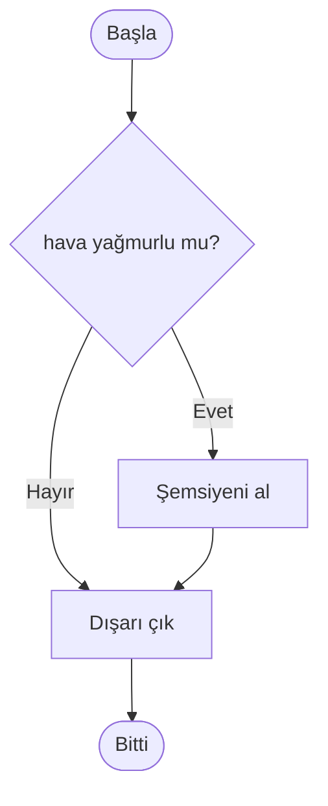
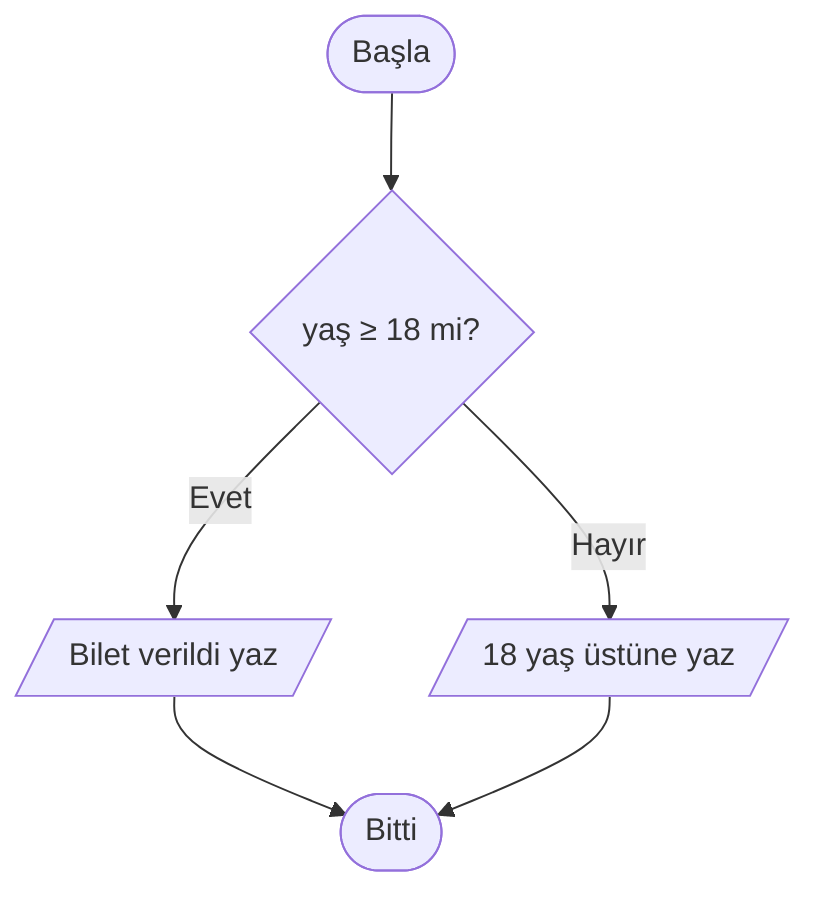

import Callout from '../../components/Callout.astro';
import Steps from '../../components/Steps.astro';

[Önceki yazıda](/blog/degiskenler) değişkenleri, yani bilgiyi saklayan kutuları
öğrendik. Sonlara doğru küçük bir satır vardı: `yetişkin ← yaş ≥ 18`. Bu satır bir
**doğru/yanlış** değeri üretiyordu — ama biz o değerle henüz hiçbir şey **yapmadık.**

İşte bu yazının konusu tam olarak bu: bir doğru/yanlış değerine bakıp **yol ayırmak.**
Bir programın "şu doğruysa bunu yap, değilse şunu yap" diyebilmesi. Buna **koşul**
diyoruz ve bir algoritmanın **karar verebilmesinin tek yolu** budur. Şu ana kadar
yazdığımız her şey baştan sona düz akıyordu; koşulla birlikte programımız ilk kez
**seçim** yapmaya başlıyor.

<Callout type="note" title="Bu seride neredeyiz?">
Bu, **Algoritmalar** serisinin beşinci yazısı. Algoritmayı tanıdık, akış şemasıyla
çizdik, sözde kodla yazdık, sonra değişkenlerle bilgiyi sakladık. [Akış şemaları
yazısında](/blog/akis-semalari) kararı **çizmiştik** (baklava kutusu), [sözde kod
yazısında](/blog/sozde-kod) `EĞER … İSE` ile kısaca **tanışmıştık.** Şimdi o karar
kutusunun bütün hâllerini en ince ayrıntısına kadar açacağız. Hâlâ tek satır gerçek
kod yok — sadece kalem, kâğıt ve düşünce.
</Callout>

## Bilgisayar nasıl "karar" verir?

Aslında vermiyor. Bir bilgisayar hava kararınca "ışığı açayım mı acaba?" diye
düşünmez. Onun yaptığı çok daha basit ve mekaniktir: kendisine önceden **yazdığın**
bir soruyu sorar, cevabı yalnızca **doğru** ya da **yanlış** olur ve bu cevaba göre,
yine senin gösterdiğin **iki yoldan birine** sapar.

Bütün mesele bundan ibaret. Gün boyu sen de aynısını yaparsın:

- **Eğer** yağmur yağıyorsa şemsiye al.
- **Eğer** ışık kırmızıysa dur, **değilse** geç.
- **Eğer** hesapta yeterli para varsa öde, **yoksa** iptal et.

Bu "eğer … ise" kalıbını bir bilgisayara anlatmanın yolu koşuldur. Karar bilgisayarın
değil, **senin** kararındır; sen kuralı yazarsın, o harfiyen uygular. [İlk yazıdaki](/blog/algoritma-nedir)
kuralı hatırla: bilgisayar zeki değil, **itaatkârdır.**

## Tek kollu koşul: "şu olursa şunu yap"

En yalın koşul, yalnızca bir soru sorar; cevap **doğruysa** fazladan bir iş yapar,
**yanlışsa** hiçbir şey yapmadan yoluna devam eder. Tek bir kolu vardır.

Kalıbı şöyle: `EĞER` ile başlar, soruyu yazarsın, `İSE` dersin, altına yapılacak işi
**içeri girintili** yazarsın ve `BİTİREĞER` ile bloğu kapatırsın.

```text title="Tek kollu koşul" showLineNumbers=false
EĞER hava_yağmurlu İSE
    YAZ "Şemsiyeni al"
BİTİREĞER

YAZ "Dışarı çık"
```

Bunu soldan sağa, yukarıdan aşağıya oku: "Eğer hava yağmurluysa, şemsiye al. (Bloğu
kapat.) Sonra her hâlükârda dışarı çık." Yağmur yoksa `YAZ "Şemsiyeni al"` satırı
**tamamen atlanır** ve program doğrudan `Dışarı çık`a geçer. [Akış şemaları
yazısında](/blog/akis-semalari) çizdiğimiz şu şemayı hatırladın mı? İşte onun yazıya
dökülmüş hâli tam olarak bu:



Baklava kutusu `EĞER`, "Evet" oku girintili blok, iki yolun birleştiği yer ise
`BİTİREĞER`den sonrası. Çizim ile yazı, aynı fikrin iki ayrı yüzü.

<Callout type="important" title="Girinti şaka değil, anlamın ta kendisi">
Hangi satırların koşula **ait** olduğunu **girinti** belirler. İçeri kaydırdığın
satırlar yalnızca koşul doğruyken çalışır; `BİTİREĞER`den sonrasını sola çektiğin
satırlar ise koşuldan **bağımsız,** her zaman çalışır. `Dışarı çık` satırını yanlışlıkla
içeri kaydırırsan, yağmur yokken evden hiç çıkamazsın! Girinti burada süs değil,
programın anlamıdır — birçok gerçek dilde de öyledir.
</Callout>

## Koşulun içinde ne var? Bir doğru/yanlış sorusu

`EĞER` ile `İSE` arasına yazdığın şey bir **soru**dur ve cevabı ya **doğru** ya
**yanlış** olmak zorundadır. Peki bu doğru/yanlış nereden gelir? [Değişkenler
yazısından](/blog/degiskenler) tanıdık: bir **karşılaştırmadan.**

Karşılaştırma operatörlerini geçen yazılardan biliyoruz; koşulların yakıtı bunlardır:

| İşaret | Okunuşu            | Örnek koşul          | Ne zaman doğru? |
| :----: | ------------------ | -------------------- | --------------- |
| `=`    | eşit mi            | `renk = "kırmızı"`   | renk tam olarak kırmızıysa |
| `≠`    | eşit değil mi      | `cevap ≠ "evet"`     | cevap evet'ten farklıysa |
| `>`    | büyük mü           | `puan > 100`         | puan 100'den fazlaysa |
| `<`    | küçük mü           | `stok < 5`           | stok 5'in altındaysa |
| `≥`    | büyük veya eşit mi | `yaş ≥ 18`           | yaş 18 ya da daha fazlaysa |
| `≤`    | küçük veya eşit mi | `hız ≤ 50`           | hız 50 ya da daha azsa |

Her satır bir doğru/yanlış üretir; `EĞER` de o değere bakıp yol seçer. Örneğin
`EĞER yaş ≥ 18 İSE`, aslında "yaş ≥ 18 doğru mu?" diye sorup cevaba göre davranır.

<Callout type="caution" title="Koşuldaki '=' bir SORU, atamadaki '=' bir EMİR">
[Değişkenler yazısında](/blog/degiskenler) atamayı konuşurken "eşittir her zaman
'eşit mi?' demek değildir" demiştik. İşte tam tersi de doğru: bir **koşulun içindeki**
`=` gerçekten "eşit mi?" diye **sorar**, bir şeyi içine **koymaz.** `EĞER puan = 100 İSE`
demek, "puan kutusuna 100 koy" değil, "puanın şu an 100 olup olmadığını **kontrol et**"
demektir. Aynı işaret, iki bambaşka iş: solda kutu varsa emir, koşulun içindeyse soru.
İşte bu karışıklık yüzünden birçok gerçek dil ikisini ayırır — atama için `=`, eşitlik
kontrolü için `==` kullanır. Karşına çıkınca şaşırma.
</Callout>

## Çift kollu koşul: "ya bunu ya şunu"

Çoğu zaman bir yol yetmez: koşul doğruysa **bir şey,** yanlışsa **başka bir şey**
yaparız. İşte burada `DEĞİLSE` devreye girer. Blok ikiye ayrılır; birinden **mutlaka
biri** çalışır, ikisi birden asla çalışmaz.

```text title="Çift kollu koşul — bilet kontrolü" showLineNumbers=false
EĞER yaş ≥ 18 İSE
    YAZ "Bilet verildi, iyi seyirler"
DEĞİLSE
    YAZ "Üzgünüz, bu film 18 yaş üstüne"
BİTİREĞER
```

Yaş 20 ise üstteki satır, 15 ise alttaki satır çalışır — asla ikisi birden. Bu, bir
yol ayrımıdır; iki koldan yalnızca birine girilir:



[Sözde kod yazısındaki](/blog/sozde-kod) çift/tek sayı örneğini de hatırla; o da tam
bir çift kollu koşuldu:

```text title="Bir sayı çift mi, tek mi?" showLineNumbers=false
EĞER sayı MOD 2 = 0 İSE
    YAZ "Çift"
DEĞİLSE
    YAZ "Tek"
BİTİREĞER
```

`MOD` bölmeden kalanı veriyordu; bir sayının 2'ye bölümünden kalan 0'sa o sayı çifttir.
Tek bir koşulla bütün sayıları ikiye ayırdık.

<Callout type="tip" title="Ne zaman DEĞİLSE yazmalı?">
Basit bir soru sor: "Koşul **yanlış** çıkarsa özel bir şey yapılacak mı?" Cevap
**hayır**sa (yağmur yoksa hiçbir ek iş yok) tek kollu koşul yeter, `DEĞİLSE` yazma.
Cevap **evet**se (18 değilse ayrı bir mesaj var) çift kollu koşul kullan. Boş bir
`DEĞİLSE` bloğu yazmak, gereksiz gürültüdür.
</Callout>

## Çok kollu koşul: "şıklardan biri"

Bazen iki seçenek de az gelir. Bir öğrencinin notunu harfe çevirmek istiyoruz: 90 ve
üstü `AA`, 80'ler `BA`, 70'ler `BB`, altı `Kaldı`. Burada tam **dört** olası sonuç var.
Bunun için koşulları bir **zincir** hâline getiririz: `DEĞİLSE EĞER`.

```text title="Notu harfe çevir — çok kollu koşul" showLineNumbers=false
EĞER not ≥ 90 İSE
    YAZ "AA"
DEĞİLSE EĞER not ≥ 80 İSE
    YAZ "BA"
DEĞİLSE EĞER not ≥ 70 İSE
    YAZ "BB"
DEĞİLSE
    YAZ "Kaldı"
BİTİREĞER
```

Bunu [akış şemaları yazısında](/blog/akis-semalari) bir **kararlar zinciri** olarak
çizmiştik; şimdi aynı zincirin yazıya dökülmüş hâli elimizde. Ama burada çok kritik,
gözden kaçan bir kural var:

<Callout type="important" title="İlk tutan kazanır — sıra her şeydir">
Bilgisayar koşulları **yukarıdan aşağıya** dener ve **doğru olan İLK dala** girer,
girdikten sonra zincirin geri kalanına **hiç bakmaz.** Not 95 olsun: ilk soru
(`≥ 90`) doğru, `AA` yazılır ve iş biter. 95 aynı zamanda `≥ 80` ve `≥ 70` koşullarını
da sağlıyor, ama sıra oraya hiç gelmez.

İşte bu yüzden zinciri **en dar koşuldan en genişe** dizmelisin. Eğer sıralamayı ters
çevirip `≥ 70`i en üste koysaydın, 95 alan öğrenci de "BB" alırdı — çünkü ilk tutan
koşul o olurdu. Sıra, burada doğruluğun kendisidir.
</Callout>

`DEĞİLSE EĞER` bir yenilik değil aslında; "önceki koşul yanlış çıktıysa, o zaman şunu
sor" demenin kısa yolu. En sondaki yalın `DEĞİLSE` ise "yukarıdakilerin **hiçbiri**
tutmadıysa" anlamına gelir — bir tür güvenlik ağı. Çok kollu koşulda çoğu zaman bu son
yakalayıcıyı koymak iyi bir alışkanlıktır.

## Koşulları birleştirmek: VE, VEYA, DEĞİL

Şimdiye kadar her koşulda tek bir soru sorduk. Ama gerçek hayat çoğu zaman birden fazla
şartı aynı anda ister: "yağmur yağmıyor **ve** hava sıcaksa pikniğe git." İşte bu
"ve", "veya", "değil" kelimeleri koşulların dünyasında da vardır ve küçük soruları
birleştirip tek bir doğru/yanlış cevabına dönüştürür. Bunlara **mantıksal operatörler**
denir.

### VE — hepsi doğru olmalı

`VE`, birleştirdiği koşulların **tümü** doğruysa doğru olur; **biri bile** yanlışsa
sonuç yanlıştır. Zorlu, titiz bir kapı bekçisidir; herkesin bileti tam olmalı.

```text title="İndirimli bilet — iki şart birden" showLineNumbers=false
EĞER öğrenci VE hafta_içi İSE
    YAZ "İndirimli bilet"
DEĞİLSE
    YAZ "Tam bilet"
BİTİREĞER
```

İndirim yalnızca hem öğrenciysen hem de gün hafta içiyse geçerli. Hafta sonu bir
öğrenci gelse indirim yok; hafta içi öğrenci olmayan biri gelse yine yok. `VE`, "ikisi
de" demektir.

### VEYA — en az biri yetsin

`VEYA`, birleştirdiği koşullardan **en az biri** doğruysa doğru olur; ancak **hepsi**
yanlışsa sonuç yanlış çıkar. Hoşgörülü bir bekçidir; tek bir doğru cevap kapıyı açar.

```text title="Hafta sonu mu?" showLineNumbers=false
EĞER gün = "cumartesi" VEYA gün = "pazar" İSE
    YAZ "Bugün tatil"
DEĞİLSE
    YAZ "Bugün iş günü"
BİTİREĞER
```

Gün ikisinden **herhangi biri** olduğunda tatil sayılır. Günlük dildeki "veya"nın bazen
"ya o ya bu ama ikisi değil" anlamına geldiğine dikkat — programlamada `VEYA` böyle
değildir: **en az biri** doğruysa, ikisi de doğru olsa bile sonuç doğrudur.

### DEĞİL — cevabı ters çevir

`DEĞİL`, bir koşulun sonucunu **tersine** çevirir: doğruyu yanlış, yanlışı doğru yapar.
Çoğu zaman "olumsuz" bir durumu daha okunur ifade etmek için kullanılır.

```text title="Girişi tersinden sormak" showLineNumbers=false
EĞER DEĞİL giriş_yapıldı İSE
    YAZ "Lütfen önce giriş yapın"
BİTİREĞER
```

`DEĞİL giriş_yapıldı`, "giriş yapılmadıysa" diye okunur. `EĞER giriş_yapıldı = yanlış`
yazmak da aynı kapıya çıkar, ama `DEĞİL` çoğu zaman daha akıcıdır.

Bu üçünü bir arada, gündelik karşılıklarıyla görelim:

| Operatör | Ne zaman doğru? | Gündelik karşılığı | Örnek |
| :------: | --------------- | ------------------ | ----- |
| `VE`    | **bütün** koşullar doğruysa | "hem … hem …"          | `yaş ≥ 18 VE bilet_var` |
| `VEYA`  | **en az bir** koşul doğruysa | "ya … ya … (ya da ikisi)" | `cumartesi VEYA pazar` |
| `DEĞİL` | koşul **yanlışsa** doğru olur | "… değilse"           | `DEĞİL yağmurlu` |

<Callout type="note" title="'Hepsi' ve 'en az biri' bekçileri">
İki basit sezgiyle karıştırmazsın: `VE` **kılı kırk yaran** bekçidir — tek bir
"yanlış" bütün sonucu yanlış yapar. `VEYA` ise **cömert** bekçidir — tek bir "doğru"
bütün sonucu doğru yapar. Zor durumda bu iki resmi hatırla, gerisi kendiliğinden gelir.
</Callout>

## İç içe koşullar: karar içinde karar

Bazen bir soruyu ancak başka bir soru "evet" çıktıysa sormak isteriz. Bir koşulun
bloğunun **içine** ikinci bir koşul koyarız; buna **iç içe (nested) koşul** denir.

Bir sitede önce kullanıcının giriş yapıp yapmadığına, ardından —ancak giriş yaptıysa—
yönetici olup olmadığına bakalım:

```text title="İç içe koşul — kademeli kontrol" showLineNumbers=false
EĞER giriş_yapıldı İSE
    EĞER yönetici İSE
        YAZ "Yönetim paneline hoş geldin"
    DEĞİLSE
        YAZ "Hoş geldin"
    BİTİREĞER
DEĞİLSE
    YAZ "Lütfen giriş yapın"
BİTİREĞER
```

Dıştaki koşul kapıyı açar; yalnızca içeri girildiyse (giriş yapıldıysa) içteki soru
sorulur. Giriş yapılmadıysa program "yönetici mi?" diye hiç sormaz bile — o soruya
sıra gelmez. İçteki bloğun bir kademe **daha fazla** girintili olduğuna dikkat et;
girinti burada da kimin kime ait olduğunu gösteriyor.

<Callout type="tip" title="İç içe koşul mu, VE mi?">
Bazen iç içe iki koşul, tek bir `VE` ile daha sade yazılabilir. `EĞER A İSE → EĞER B İSE`
çoğu zaman `EĞER A VE B İSE` ile aynı kapıya çıkar. Peki hangisini seçmeli? İki dalın da
**yalnızca** "ikisi de doğru" durumunu önemsediği yerde `VE` daha temizdir. Ama dıştaki
koşulun **kendine ait bir `DEĞİLSE`si** varsa (giriş yapılmadıysa ayrı bir mesaj gibi),
o zaman iç içe yapı gerekir. Önce en sade hâli dene; okumak zorlaşınca böl.
</Callout>

## Bir koşulu kâğıtta test etmek

[Değişkenler yazısındaki](/blog/degiskenler) **izleme tablosu** alışkanlığını hatırla.
Koşullarda da benzer bir şey yaparız: aynı koşulu **farklı girdilerle** kâğıtta
çalıştırıp her seferinde hangi dala girdiğimizi işaretleriz. En değerli girdiler
**sınır** değerleridir — tam eşik noktaları.

Bilet örneğini (`yaş ≥ 18`) birkaç değerle deneyelim:

| `yaş` | `yaş ≥ 18` doğru mu? | Hangi dal çalışır? |
| :---: | :-----------------: | ------------------ |
| 25    | doğru               | "Bilet verildi"    |
| 18    | doğru               | "Bilet verildi"    |
| 17    | yanlış              | "18 yaş üstüne"    |
| 0     | yanlış              | "18 yaş üstüne"    |

Özellikle **18** satırına dikkat: `≥` "büyük **veya eşit**" olduğu için tam 18 yaşındaki
kişi bileti alır. Eğer koşulu `yaş > 18` yazsaydık, 18 yaşındaki biri geri çevrilirdi —
tek bir işaretin sınırda kocaman bir fark yarattığını görüyor musun? Koşulları hep bu
eşik değerlerinde test et; hataların çoğu tam orada saklanır.

## Sık yapılan hatalar

<Callout type="caution" title="Bu tuzaklara dikkat">
- **Karşılaştırma yerine atama:** Koşulun içinde "eşit mi?" diye sorarken atama işareti
  kullanmak. `EĞER puan = 100 İSE` bir sorudur; birçok gerçek dilde bunu `==` ile yazman
  gerekir, yoksa yanlışlıkla puanı 100 yapıp koşulu hep doğru sanırsın.
- **Girintiyi bozmak:** Koşula ait olmayan bir satırı içeri, ait olanı dışarı kaydırmak.
  Hangi satırın koşula bağlı olduğunu girinti söyler; şaşarsa program da şaşar.
- **`DEĞİLSE EĞER` sırasını yanlış kurmak:** Geniş koşulu (`≥ 70`) dar koşuldan
  (`≥ 90`) önce koymak. İlk tutan kazandığı için, herkes yanlış dala düşer.
- **Kolları birleştirmeyi unutmak:** Tek kollu koşuldan sonra ortak akışa dönmemek;
  "hayır" durumunda ne olacağını hiç düşünmemek. Her koşulda "peki yanlışsa?" diye sor.
- **VE ile VEYA'yı karıştırmak:** "18 yaş ve üstü **veya** öğrenci" ile "…**ve** öğrenci"
  bambaşka kurallardır. Hangisini istediğini cümleyle netleştirmeden yazma.
- **Koşulu tersinden kurmak:** `DEĞİL` ile olumsuz koşulları üst üste yığmak kafa
  karıştırır. `DEĞİL (DEĞİL aktif)` yerine düpedüz `aktif` yaz.
</Callout>

<Callout type="note" title="Küçük bir tarih notu: doğru/yanlış'ın mucidi">
Bir koşulun kalbindeki o "doğru/yanlış" mantığının bir mucidi var: İngiliz matematikçi
**George Boole** (1815–1864). *An Investigation of the Laws of Thought* (1854) adlı
kitabında, düşünmenin ve mantığın kurallarını —"ve", "veya", "değil" gibi bağlantıları—
tıpkı aritmetik gibi doğru (1) ve yanlış (0) üzerinden **hesaplanabilir** hâle getirdi.
Onun onuruna bu iki değerli mantığa bugün **Boole cebiri (Boolean logic)** diyoruz;
değişkenlerdeki `boolean` tipinin adı da buradan gelir. Boole bunu bir bilgisayar
düşünerek yapmadı — daha ortada bilgisayar yoktu. Ama neredeyse yüz yıl sonra bu "doğru/
yanlış cebiri", elektrik anahtarlarının açık/kapalı durumuna birebir uyunca modern
bilgisayarların düşünme biçiminin temeli oldu. Bugün yazdığın her `EĞER`, Boole'un o
kitabının uzak bir yankısıdır.
</Callout>

## Kendin dene

Kalem ve kâğıt yeter, başka hiçbir araca gerek yok. Önce koşulu **sözde kodla** yaz,
sonra birkaç farklı girdiyle kâğıt üstünde çalıştırıp doğru dala gittiğini **kontrol et.**

### Egzersiz 1 — Geçti mi, kaldı mı? (kolay)

> Bir öğrencinin sınav notu var. Not 50 ve üzerindeyse "Geçti", altındaysa "Kaldı" yaz.

<Callout type="note" title="İpucu">
Bu bir **çift kollu koşul.** `EĞER not ≥ 50 İSE` ile başla, `DEĞİLSE` dalına "Kaldı"yı
koy, `BİTİREĞER` ile kapat. Sonra `not` yerine sırayla 50, 49 ve 90 koyup her birinde
hangi dalın çalıştığını kâğıda yaz. Tam **50**'de "Geçti" çıkıyor mu? `≥` kullandıysan
çıkmalı.
</Callout>

### Egzersiz 2 — Ücretsiz kargo (orta)

> Bir alışveriş sepetinin tutarı 200 TL ve üzeriyse **ya da** müşteri üyeyse kargo
> ücretsiz olsun; ikisi de değilse 30 TL kargo eklensin.

<Callout type="note" title="İpucu">
Burada iki koşulu **`VEYA`** ile birleştir: `EĞER tutar ≥ 200 VEYA üye İSE`. En az biri
doğruysa kargo bedava. Şu üç durumu ayrı ayrı dene: (1) tutar 250, üye değil → bedava mı?
(2) tutar 80, üye → bedava mı? (3) tutar 80, üye değil → 30 TL mi? Üçü de beklediğin gibi
çıkıyorsa `VEYA`yı doğru kurmuşsun.
</Callout>

### Egzersiz 3 — Ne giymeli? (mini proje)

> Hava sıcaklığına göre öneri ver: 30 ve üstü "tişört", 15–29 arası "ceket", 15'in altı
> "mont". Bir de yağmur yağıyorsa —sıcaklık ne olursa olsun— önerinin yanına "şemsiye de
> al" eklensin.

<Callout type="note" title="İpucu">
Önce sıcaklık için **çok kollu** bir koşul kur (`EĞER sıcaklık ≥ 30 İSE … DEĞİLSE EĞER
sıcaklık ≥ 15 İSE … DEĞİLSE …`) — tıpkı not-harf örneğindeki gibi, en yüksek eşikten
başla. Yağmur ise **ayrı** bir tek kollu koşul: `EĞER yağmurlu İSE YAZ "şemsiye de al"`.
İki farklı soruyu iki ayrı koşulla çözdüğüne dikkat; hepsini tek bir zincire tıkıştırmaya
çalışma. Sonra 32°C yağmurlu, 20°C güneşli, 5°C yağmurlu gibi birkaç senaryoyu kâğıtta
çalıştır.
</Callout>

## Özet

<Callout type="tip" title="Cebine koy">
- **Koşul**, bir doğru/yanlış sorusuna göre **yol ayırmaktır**; bir algoritmanın karar
  verebilmesinin tek yolu budur. Akış şemasındaki karar kutusunun, sözde koddaki
  `EĞER … İSE`nin yaptığı iş.
- **Tek kollu** (`EĞER … İSE … BİTİREĞER`) yalnızca doğruyken bir iş yapar; **çift kollu**
  (`… DEĞİLSE …`) doğru ve yanlış için ayrı yollar sunar.
- **Çok kollu** (`DEĞİLSE EĞER` zinciri) ikiden fazla seçenek içindir; bilgisayar
  yukarıdan aşağıya dener ve **doğru olan ilk dala** girer — bu yüzden **sıra önemlidir.**
- Koşulun içi bir **karşılaştırmadır** (`= ≠ > < ≥ ≤`) ve doğru/yanlış üretir. Koşuldaki
  `=` "eşit mi?" diye **sorar,** atamadaki gibi "içine koy" **demez.**
- **VE** hepsi doğruysa, **VEYA** en az biri doğruysa doğrudur; **DEĞİL** sonucu tersine
  çevirir. Birden çok şartı böyle birleştirirsin.
- Bir koşulun bloğuna başka bir koşul koyarsan **iç içe** karar olur; kademeli kontroller
  için kullanılır. Koşulları hep **sınır (eşik) değerlerinde** test et.
</Callout>
