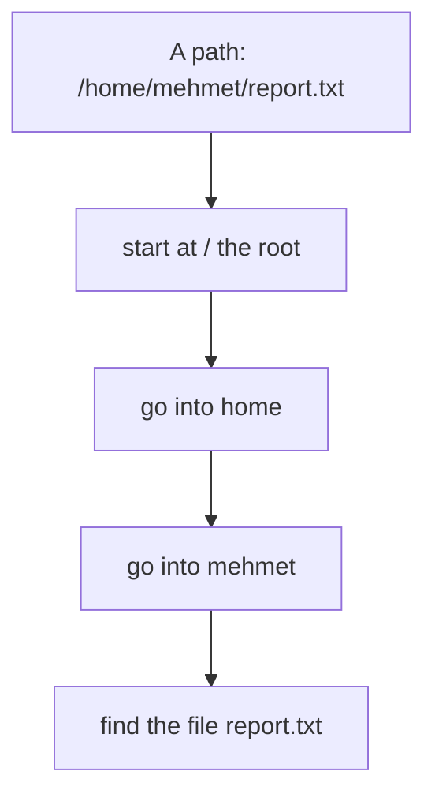
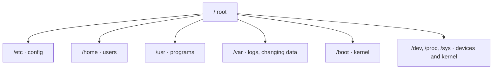
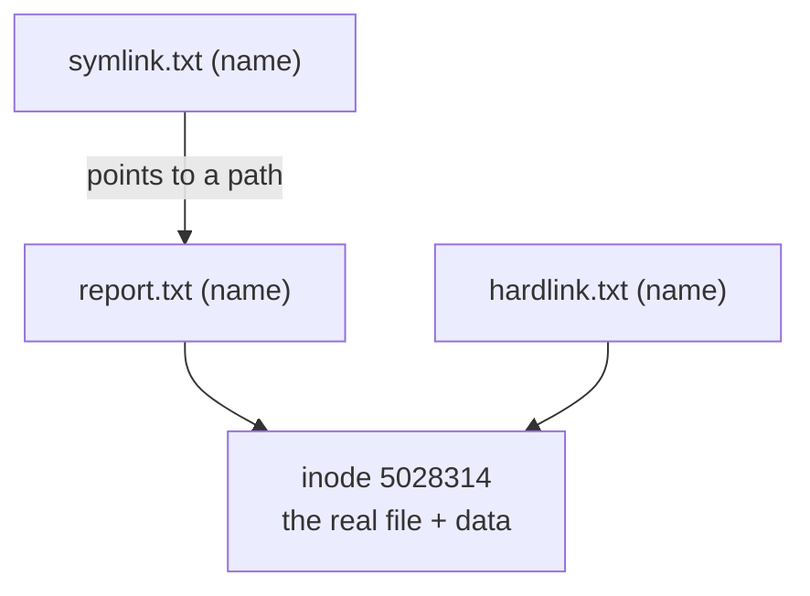
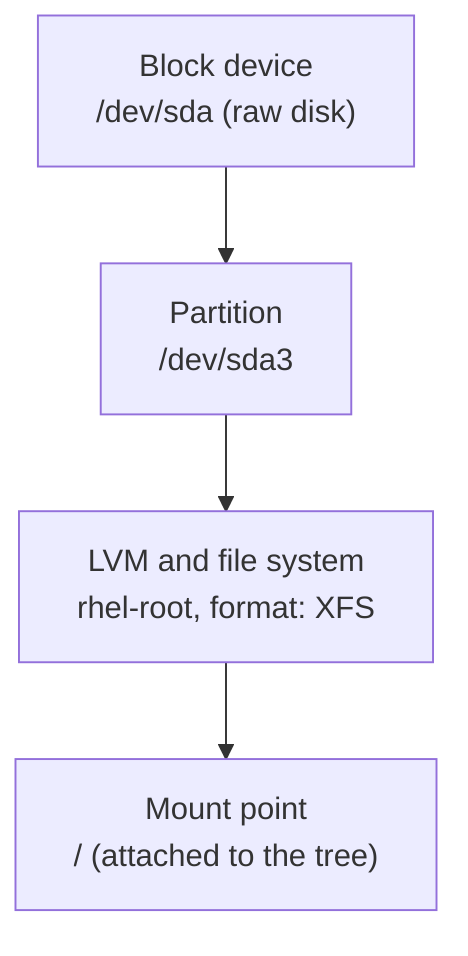

import Callout from '../../components/Callout.astro';
import Steps from '../../components/Steps.astro';
import Figure from '../../components/Figure.astro';
import treeImg from '../../assets/fs-01-tree.webp';
import typesImg from '../../assets/fs-02-filetypes.webp';
import statImg from '../../assets/fs-03-stat.webp';
import fileImg from '../../assets/fs-04-file.webp';
import linksImg from '../../assets/fs-05-links.webp';
import dfImg from '../../assets/fs-06-df.webp';
import duImg from '../../assets/fs-07-du.webp';
import procImg from '../../assets/fs-08-proc.webp';
import devImg from '../../assets/fs-09-dev.webp';
import findImg from '../../assets/fs-10-find.webp';
import bootImg from '../../assets/fs-11-boot.webp';
import treeCmdImg from '../../assets/fs-12-tree.webp';
import fileopsImg from '../../assets/fs-13-fileops.webp';
import lsblkImg from '../../assets/fs-14-lsblk.webp';
import fstabImg from '../../assets/fs-15-fstab.webp';
import inodeImg from '../../assets/fs-16-inode.webp';
import stickyImg from '../../assets/fs-17-sticky.webp';
import globImg from '../../assets/fs-18-glob.webp';
import usrvarImg from '../../assets/fs-19-usrvar.webp';

In the [third part](/en/blog/terminal-and-shell) we learned to get around the terminal: `pwd` for where we are,
`ls` for what's there, `cd` for moving about. But knowing how to walk in a city is not the same as knowing its
map. Today we draw Linux's map: which folder holds what, what the "root directory" is, how a file's real identity
is stored, and why in Linux **everything really is a file.**

In [Part 1](/en/blog/what-is-red-hat) we said "in Linux everything is under `/`"; in [Part 2](/en/blog/installing-rhel)
we saw from afar how Anaconda partitioned the disk. Now we step into that tree and walk it branch by branch. Don't
worry, you won't get lost: by the end this tree will feel logical, not memorized.

<Callout type="note" title="What you need for this part">
- The RHEL machine from Part 2, on and logged in, with a terminal open ([Part 3](/en/blog/terminal-and-shell)).
- Every command in this part **only looks;** it deletes or breaks nothing, so experiment freely.
- A folder to play in: `mkdir ~/fs-demo && cd ~/fs-demo`. That's the `fs-demo` on the screens.
</Callout>

## Everything is a file

Let's start here, because all of Linux's logic rests on it. This principle, inherited from Unix, says: you can
reach almost everything in the system through **a single, uniform interface**, that is, like a file.

Plain text and programs are files, fine. But here's the beautiful part:

- **Directories** are files too; special files that hold the list of names inside them.
- **Devices** (disk, keyboard, sound card) appear as files under `/dev`. Writing to the disk is like writing to a
  file.
- **Running processes and the kernel's state** are read like files under `/proc` and `/sys`. You "read" how full
  memory is with `cat /proc/meminfo`.

The practical benefit is enormous: learn a handful of commands (`ls`, `cat`, `cp`, `echo`) and you can manage your
documents, your settings, your hardware and the system's live state with those same commands. Where Windows needs
a separate tool for each, in Linux they all work with the same "read from a file, write to a file" idea. We'll see
concrete examples by the end.

## The top of the tree: the root directory

Everything starts at the **root directory;** its symbol is a single slash: `/`. It's the very top of the tree, and
all paths branch from it. Let's look at the top with `ls -l /`:

<Figure src={treeImg} alt="ls -l / output in a RHEL 10.2 terminal: the folders and symbolic links in the root directory" caption="The contents of the root: folders like etc, home, usr, var, boot, dev. Note: bin, lib, lib64 and sbin are symbolic links (-> usr/bin), i.e. shortcuts." />

<Callout type="important" title="Linux has no drive letters">
This is the biggest surprise coming from Windows: Linux has **no** separate drive letters like `C:`, `D:`. A
second disk, a USB stick or a network share is **mounted** onto a folder of the tree and appears as if it were
inside that folder. So no matter how many disks there are, there's a single unified tree and everything is under
`/`. We'll see disks and mounting with `df` shortly.
</Callout>

There's something interesting in the output: the `bin`, `lib`, `lib64` and `sbin` lines start with an `l` and have
an `-> usr/bin` next to them. These are **symbolic links** (shortcuts); the real folders are now gathered under
`/usr`, and the old names remain as shortcuts for compatibility. You'll also
notice a few folders like `afs` at the very top of the list; they exist on every RHEL but are usually empty. `afs`
is a mount point reserved for the AFS (Andrew File System) distributed file system; if the OpenAFS client isn't
installed it just sits empty, no need to delete it. You can also picture how the shell resolves a
path you type:



An absolute path (one starting with `/`) is always resolved from the root, step by step. Remember the
absolute/relative distinction from [Part 3](/en/blog/terminal-and-shell): a relative path starts from where you
are, an absolute path always from the root.

## A tour, folder by folder: the FHS

So what does each of these folders under the root do? Good news: this layout isn't random, it's standardized by
the **FHS** (Filesystem Hierarchy Standard). That's why whichever Linux you sit down at, you find the same thing
in the same place.

| Folder | What it holds |
| --- | --- |
| **`/etc`** | The system's **config files** (plain text). The `/etc/hostname`, `/etc/shells` from Part 3 were here. |
| **`/home`** | Users' **personal folders:** `/home/mehmet`. Your `~` directory. |
| **`/usr`** | The real home of installed **programs and libraries.** Most commands live under `/usr/bin`. |
| **`/var`** | Constantly **changing data:** logs (`/var/log`), mail, databases, cache. |
| **`/boot`** | The **kernel** and boot files (`vmlinuz`, `initramfs`, GRUB). The boot chain from Part 2. |
| **`/dev`** | **Devices** as files (`/dev/sda` the disk, `/dev/null` the black hole). |
| **`/proc`, `/sys`** | The **live state** of the kernel and processes (not on disk, produced in memory). |
| **`/tmp`** | **Temporary files;** usually cleared on reboot. Everyone can write here. |
| **`/root`** | The **root** user's home directory (separate, not under `/home`; watch out). |
| **`/opt`** | Extra software installed outside the distribution's package system. |
| **`/run`** | Runtime state (sockets, PID files). |
| **`/mnt`, `/media`** | Folders for manually and automatically **mounted** disks/USB sticks. |

<Callout type="note" title="History note: why does every Linux look the same?">
In the early 1990s every Unix and Linux distribution put files in different places; a command in `/usr/bin` on one
system was somewhere else on another. To end that chaos, **FSSTND** was published in 1994, followed in 1997 by
what we now call the **FHS** (Filesystem Hierarchy Standard). Now `/etc` means config, `/var/log` means logs,
`/usr/bin` means programs; whichever distribution you move to, that meaning holds. This standard is why the map
you learn here works on Ubuntu, Debian and Fedora too.
</Callout>

Let's also see the big picture of the tree (the most important branches):



### Into /usr and /var

Let's look more closely at two big branches, because they fill most of the disk (we saw them at the top of `du`).

<Figure src={usrvarImg} alt="ls /usr and ls /var output in a RHEL 10.2 terminal, and the count of commands in /usr/bin" caption="/usr holds bin, sbin, lib, share, local, include; /var holds log, cache, spool, lib, mail. /usr/bin alone holds 1545 commands: almost every command you type lives here." />

- **`/usr`** is the "read-only" world of installed software: `/usr/bin` user commands (1545 on screen!), `/usr/sbin`
  admin commands, `/usr/lib` and `/usr/lib64` shared libraries, `/usr/share` architecture-independent data (man
  pages, icons, fonts), `/usr/local` software you install by hand outside the package manager. Remember the
  `/bin -> usr/bin` shortcut from [Part 3](/en/blog/terminal-and-shell): everything really gathered here.
- **`/var`** ("variable") is data that constantly grows and shrinks: `/var/log` system logs (the first place to
  look when something breaks), `/var/cache` cache, `/var/spool` printer and mail queues, `/var/lib` programs'
  persistent state (databases live here). When a server warns "disk full", the first suspect is often `/var/log`.

### /boot: where the kernel lives

Let's look closely at one branch, because you know it from [Part 2](/en/blog/installing-rhel). `/boot` holds
everything the computer needs while starting up:

<Figure src={bootImg} alt="ls -l /boot output in a RHEL 10.2 terminal: vmlinuz, initramfs, grub2, config files" caption="Contents of /boot: vmlinuz-6.12.0-211... (the kernel itself), initramfs-...img (the initial RAM disk), grub2/ (the bootloader), config-... and System.map. The files of the boot chain from Part 2." />

`vmlinuz-6.12.0-211.51.1.el10_2.x86_64` is the kernel itself; `initramfs-...img` is the initial RAM disk used at
boot; `grub2/` is the bootloader. In Part 2's "booting from the ISO" section we described these files being loaded
into memory. We also took the version number (`6.12.0-211...`) apart there; here it is on disk.

## File operations: create, copy, move, delete

We learned to walk the tree; now let's prune the branches ourselves. The basic commands for working with files and
folders are few and used every day:

<Figure src={fileopsImg} alt="File operations with touch, cp, mkdir, mv, rm in a RHEL 10.2 terminal" caption="touch creates an empty file, cp copies, mkdir makes a folder, mv moves (report.bak into archive/), rm deletes. After each step we see the result with ls." />

- **`touch file`** creates an empty file (or updates its timestamp if it exists).
- **`cp source dest`** copies. To copy a folder with its contents, **`cp -r`** (recursive).
- **`mv source dest`** moves. The interesting part: `mv old.txt new.txt` is also **renaming**; because, as you'll
  see shortly, the name is a label separate from the file itself, and moving is just changing the label.
- **`mkdir folder`** makes a folder; for a whole nested chain at once, **`mkdir -p a/b/c`**. An empty folder is
  removed by **`rmdir`**.
- **`rm file`** deletes. To delete a folder and its contents, **`rm -r folder`**.

<Callout type="caution" title="rm has no undo">
In Linux a file deleted with `rm` from the terminal does **not go to a trash can;** it's gone. `rm -rf`
(recursive + force) especially is very powerful and a typo can turn into a disaster; that's why `rm -rf /` is an
internet horror joke. Two safety habits: `rm -i` (asks about each file) to see what you're deleting, and with
wildcard deletes, list the same pattern with `ls` first. Every other command in this part was harmless; `rm` is
our first "careful" command.
</Callout>

## A file's identity: type, permissions and inode

Now let's zoom in on a single file. A file has three basic pieces of identity: its **type,** its **permissions**
and its **inode.**

### File types

In [Part 3](/en/blog/terminal-and-shell) we briefly saw that the first letter of `ls -l` output tells the file
type. Let's see them all together now:

<Figure src={typesImg} alt="ls -ld showing different file types in a RHEL 10.2 terminal: directory, symbolic link, character and block device, socket" caption="Six types at once with ls -ld: /bin a symbolic link (l), /dev/null a character device (c), /dev/sda a block device (b), /etc a directory (d), /etc/hostname a regular file (-), a system socket (s)." />

The **first letter** of the line gives away the type:

| Letter | Type | Example |
| --- | --- | --- |
| `-` | Regular file | text, program, image |
| `d` | Directory | `/etc` |
| `l` | Symbolic link | `/bin -> usr/bin` |
| `c` | Character device | `/dev/null`, keyboard |
| `b` | Block device | `/dev/sda` (disk) |
| `s` | Socket | an endpoint programs talk through |
| `p` | Pipe | a data flow channel |

The nine letters after the first (`rwxr-xr-x`) are the permissions; we'll cover those at length in
[Part 6](/en/red-hat), "users and permissions". For now, recognizing the type is enough.

### inode: a file's real identity

Now a mind-bending but very important fact: a file's **name is not written in the file itself.** A file's real
identity is a record called the **inode;** it holds its owner, permissions, size, timestamps and where the data
sits on disk. The name is just a **label** kept in a directory that points to an inode number. `stat` shows a
file's full inode information:

<Figure src={statImg} alt="stat /etc/hostname output in a RHEL 10.2 terminal: size, inode, permissions, timestamps" caption="stat /etc/hostname: size 9 bytes, the Inode number, Links (how many names point to this inode), permissions, owner (root), SELinux context and four timestamps (access, modify, change, birth)." />

This "name apart, file apart" idea feels odd at first but explains a lot: renaming a file is really just changing
the label (the data never moves), and one file can have **several names.** That's exactly where links come from.

### The four timestamps

The bottom four lines of `stat` output are the file's **timestamps**, and most people confuse them:

- **Access (atime):** when the file was last **read**.
- **Modify (mtime):** when its **content** last changed. This is the date you see in `ls -l`.
- **Change (ctime):** when the **inode info** (permissions, owner, name) last changed; even if the content doesn't
  change, changing permissions updates ctime.
- **Birth (btime):** when the file was **created** (a newer addition; not on every file system).

This distinction has practical value: "when was this file last touched" and "when did its content last change" are
different questions, and searches like `find -mtime` look exactly at these stamps.

### A bit more on the inode: a directory is a name-book

Once you understand the inode, you can figure out what a directory is: **a directory is a book mapping names to
inode numbers.** It holds lines like "report.txt → 5028314", that's all. Deleting a file (`rm`) is really removing
a line from this book and decrementing the count of names pointing to that inode; when the count hits zero, the
data is truly freed. Let's see it concretely:

<Figure src={inodeImg} alt="df -i showing inode counts and stat showing directory/file link counts in a RHEL 10.2 terminal" caption="df -i: the root file system has 28 million inodes, only 1% used. stat: fs-demo is a directory with a link count of 3 (., .. and the logs subfolder); report.txt is a file with a link count of 2 (because hardlink.txt shares the same inode)." />

Two nice details: **(1)** `df -i` shows the number of inodes on the disk. Even if the disk has free space, if
inodes run out (millions of tiny files) you get a "disk full" error; an experienced sysadmin checks `df -i`
alongside `df -h`. **(2)** the **link count** (Links) in stat speaks: report.txt's count is 2 because hardlink.txt
points to the same inode. The fs-demo directory's count is 3, because every directory comes with at least two
links (its own name and the `.` inside it) and each subfolder adds one more (here, logs). So from a directory's
link count you can even tell how many subfolders it has.

### file: type by content

`ls` tells you the shell type of a file; but what's inside it? The `file` command guesses what a file is by its
**content, not its name:**

<Figure src={fileImg} alt="file command output in a RHEL 10.2 terminal: os-release a symbolic link, bash an ELF executable, libc a shared object, etc a directory, null a character device" caption="The file command: /etc/os-release is a symbolic link, /usr/bin/bash an ELF executable, libc.so.6 a shared library, /etc a directory, /dev/null a character device. It looks at content, not the extension." />

In Linux the extension (`.txt`, `.sh`) is not required; a file can be text without a `.txt` name. Content is what
decides, so `file` is very useful: with one command you learn whether a mysteriously named download is really an
image, a program or a compressed archive.

## Links: one file, several names

We saw that the name and the file are separate things. So we can give one file two names. There are two kinds of
link, and the difference matters:

<Figure src={linksImg} alt="ls -li showing hard and symbolic links in a RHEL 10.2 terminal: same inode number and the symlink target" caption="ls -li: report.txt and hardlink.txt share the same inode number (5028314) and a Links count of 2, so both are the same file. symlink.txt is a separate file (type l) pointing to report.txt; readlink and cat reach the target." />



- **Hard link:** a **second name** given to the same inode. Made with `ln report.txt hardlink.txt`. In `ls -li`
  both have the **same inode number** and a `Links` count of 2. Both are equally "real" files; deleting one leaves
  the data intact as long as the other name exists. Its limit: it works within the same disk partition and not on
  directories.
- **Symbolic link (symlink):** a small shortcut file that **points to a path,** not to a file. Made with
  `ln -s report.txt symlink.txt`. It shows in `ls -l` with a leading `l` and `-> report.txt`. If the target is
  deleted it's left "broken" (nothing to show). In return it works across disks and can point to directories; the
  `bin -> usr/bin` in the root directory was exactly this.

You'll see symlinks a lot in daily life: pointing a stable name at the "current version" of a program, or linking
a config file to another place. Hard links are rarer but are the backbone of backup systems.

## A first look at permissions: sticky and setuid

We'll cover permissions (`rwxr-xr-x`) fully in [Part 6](/en/red-hat), but two special bits will show up in the file
system right away; just know their names:

<Figure src={stickyImg} alt="The sticky bit on /tmp and the setuid bit on passwd/sudo in a RHEL 10.2 terminal" caption="/tmp permissions end with drwxrwxrwt: the final t is the 'sticky bit'. /usr/bin/passwd has rws in its permissions: the s is the 'setuid bit'. Neither is plain rwx; both are special abilities." />

- **Sticky bit (`t`):** `/tmp` permissions end with `drwxrwxrwt`. `/tmp` is a shared folder everyone can write to;
  thanks to the sticky bit, **everyone can delete their own files but not someone else's.** Like a "mind your own
  trash" rule in a shared bin.
- **Setuid bit (`s`):** `/usr/bin/passwd` has `rws` in its permissions. Normally a program you run runs with your
  privileges; a setuid program runs with **its owner's (root's) privileges.** passwd is like this: to write your
  password into `/etc/shadow` it briefly becomes root. Powerful but to be used carefully; it's one of the first
  things security audits look at.

## "Everything is a file", really: /proc and /dev

Remember the principle from the start. Now let's look at its two most striking examples: here the things we call
"files" don't exist on disk at all, the kernel produces them on the fly.

### /proc: the kernel's window

`/proc` is a **virtual** file system that takes up no real space on disk; the "files" inside show the current
state of the system. You read them with `cat`, as if they were ordinary text files:

<Figure src={procImg} alt="/proc files in a RHEL 10.2 terminal: loadavg, meminfo, nproc, kernel hostname" caption="Reads from /proc: /proc/loadavg the system load, /proc/meminfo memory (MemTotal ~9.7 GB), nproc 4 cores, /proc/sys/kernel/hostname the machine name. None of these are on disk; the kernel produces them as you read." />

- `cat /proc/cpuinfo` gives the processor, `cat /proc/meminfo` memory, `cat /proc/loadavg` the system load.
- Each running process has a folder named by its number: `/proc/1234` holds that process's info.
- Tools like `top`, `free` and `ps` actually read `/proc` behind the scenes; you can read it directly too.
- The ones under `/proc/sys` are **readable and writable kernel settings.** By writing a number to a file you can
  change the kernel's behavior; the pinnacle of "everything is a file".

### /dev: devices as files, and /dev/null

Under `/dev` every piece of hardware appears as a file. The disk is `/dev/sda`, its first partition `/dev/sda1`.
But the few you'll use most aren't even real hardware; they're **virtual devices** provided by the kernel:

<Figure src={devImg} alt="/dev devices and writing to /dev/null in a RHEL 10.2 terminal" caption="/dev/null and /dev/random are character devices (c), /dev/sda and /dev/sda1 block devices (b, the disk group). The command echo ... > /dev/null returns nothing and exit code 0: what was written got swallowed." />

**What is `/dev/null`?** Here's the most famous one. `/dev/null` is a "black hole" that **swallows and discards
everything** written to it; if you try to read it, it ends immediately, it's empty. What's it for? To **silence a
program's unwanted output:**

```bash title="Silencing with /dev/null" showLineNumbers=false
command > /dev/null       # throw away the normal output
command 2>/dev/null       # throw away only error messages
command &>/dev/null       # throw away both output and errors
```

In [Part 3](/en/blog/terminal-and-shell) we used `2>/dev/null` to silence the "Permission denied" lines from
`find`; now you know why it worked: the error messages were going to that black hole. Its two siblings come in
handy often too: **`/dev/zero`** produces endless zeros (to create an empty file or wipe an area), **`/dev/urandom`**
produces random bytes (to generate passwords and keys). So `/dev` isn't only hardware; it also holds taps that
"produce and swallow" data.

<Callout type="note" title="There's also /sys">
`/proc`'s close relative `/sys` exposes the kernel's and hardware's tuning knobs as files: battery status, screen
brightness, network card settings are read and written here. The "brightness" slider on the desktop is, behind
the scenes, nothing but writing a number to a file under `/sys`. Same principle again.
</Callout>

## What is a file system? From block device to mount point

So far we've seen the tree's **logic**. But how does this tree actually sit on a physical disk? Here three concepts
stack on top of each other, and telling them apart is the foundation of system administration.

At the bottom is the **block device.** A block device is a storage device that keeps data in fixed-size blocks and
allows direct (random) access to any point; in short, anything that behaves "like a disk". Examples: the internal
hard disk or SSD (`/dev/sda`, `/dev/nvme0n1` for NVMe SSDs), a USB flash drive you plug in (`/dev/sdb`), an external
portable disk, a memory card (`/dev/mmcblk0`), even a CD/DVD (`/dev/sr0`). They appear with a leading **`b`** in
`ls -l`; their opposite is the **character device** (`c`, like the keyboard or `/dev/null`) that streams data byte
by byte. A **NAS** is usually not a block device: it is mounted as a folder over the network via NFS or SMB; only
methods like iSCSI present remote storage as a local block device. Our disk is `/dev/sda`; **partitions** are cut
on top (`sda1`, `sda2`...).
Inside a partition a **file system** is created; the file system is the format that organizes that raw space into
"files, directories, inodes". At the top, that file system is attached to a **mount point** and becomes part of the
tree. `lsblk -f` shows the whole stack on one screen:

<Figure src={lsblkImg} alt="lsblk -f output in a RHEL 10.2 terminal: disk, partitions, LVM, file system types and mount points" caption="lsblk -f: the sda disk, sda2 (XFS, mounted on /boot) and sda3 (LVM), inside it rhel-root (XFS, /), rhel-swap (swap), rhel-home (XFS, /home). sr0 is the attached ISO (iso9660). The whole stack from block device to mount point." />



<Callout type="note" title="File system types and the VFS">
When you format a partition (`mkfs`) you choose a **type.** RHEL's default is **XFS**; other common types are
**ext4** (the Ubuntu/Debian default), **Btrfs** (with snapshots and compression), **vfat/exFAT** on USB sticks
(Windows-compatible), **iso9660** on ISOs. So how does a single `cd` or `ls` command work with all these different
types? The answer is the **VFS** (Virtual Filesystem): a layer inside the kernel that hides all file system types
behind one common interface. You write `cat file`, and the VFS decides whether it goes to XFS or ext4. This is also
the infrastructure behind "everything is a file".
</Callout>

### Mounting and /etc/fstab

Attaching a file system to the tree is called **mounting**, detaching it **umount**. But who knows which disk goes
where each time the machine boots? The answer is the `/etc/fstab` file:

<Figure src={fstabImg} alt="cat /etc/fstab and findmnt /boot output in a RHEL 10.2 terminal" caption="/etc/fstab: each line permanently maps a file system to a mount point; the disk by UUID, then the mount point, the type (xfs) and options. findmnt /boot shows that /boot comes from /dev/sda2 and its mount options." />

Each line in `/etc/fstab` is the permanent record of the layout Anaconda built in Part 2: the disk by **UUID** (so
it doesn't get confused even if the name changes), the mount point, the file system type and options. Every time
the machine boots the system reads this file and mounts the disks in place. When you plug in a USB stick you can
mount it by hand with `sudo mount /dev/sdb1 /mnt`, or leave it to the desktop's automatic mounting; the `findmnt`
and `mount` commands show what's mounted where at the moment. We'll grow disks and play with LVM in detail in
[Part 11](/en/red-hat).

## Disk and mounting: df and du

We've seen the tree and the files; but how does this tree sit on physical disks? Two commands give that picture.

### df: file systems and mount points

`df` (disk free) looks at the system's file systems as a whole: which partition is mounted where, how full:

<Figure src={dfImg} alt="df -hT output in a RHEL 10.2 terminal: root, boot and home file systems and mount points" caption="df -hT: rhel-root (55G) mounted on /, sda2 (2G) on /boot, rhel-home (27G) on /home; all XFS. The working form of the LVM layout Anaconda built in Part 2." />

Note the "Mounted on" column: this is exactly the **mount point** concept. In Part 2, when Anaconda partitioned
the disk, the root partition was mounted on `/`, the separate `/boot` partition on `/boot`, the `/home` partition
on `/home`. So when you go into `/home/mehmet` you're actually inside a separate disk partition, but nothing in the
tree gives it away; everything looks like a single whole. When you plug in a USB stick it's usually mounted
automatically under `/run/media/mehmet/...`.

### du: how much space does this folder take?

`df` looks at the whole; how much space a particular folder takes is told by `du` (disk usage):

<Figure src={duImg} alt="du -sh folder sizes sorted with sort -h in a RHEL 10.2 terminal" caption="du -sh ... | sort -h: /var/log 16M, /etc 30M, /boot 368M, /usr 4.3G, /home 11G. The most space is taken by /usr (programs) and /home (user files)." />

`du -sh <folder>` gives a folder's summary size; `sort -h` sorts the "human-readable" sizes from small to large.
When you say "my disk is full, who's the culprit?", `du` is your first command. In short, keep the two apart:
**`df` = how full is my disk, `du` = how much space does this folder take.**

## Finding files: find and tree

Searching a huge tree by hand is impossible. `find` is the most powerful way.

<Figure src={findImg} alt="find command in a RHEL 10.2 terminal: search by name, by type, and Permission denied warnings" caption="find /etc -name '*.conf' finds config files, find /usr/bin -name 'python*' the python commands, find ~/fs-demo -type f the demo files. Folders without read permission, like /etc/lvm, give 'Permission denied'." />

The basic pattern is simple: **`find <where> <criterion>`.**

```bash title="Common find patterns" showLineNumbers=false
find /etc -name "*.conf"      # by name (config files)
find ~ -type f                # files only (not directories)
find /var -size +100M         # larger than 100 MB
find /home -mtime -1          # changed in the last day
find ~/fs-demo -type f -delete   # delete what's found (careful!)
```

The "Permission denied" lines you see are normal: `find` can't enter folders you have no read permission for. For
a system-wide search you may need `sudo` in front. If you want a quick lookup by name, `locate` (`plocate` on
RHEL) is faster but searches a pre-built index; we'll see installing it in Part 7.

And if you want to see the tree visually, `tree`:

<Figure src={treeCmdImg} alt="tree ~/fs-demo output in a RHEL 10.2 terminal: the folder tree drawn visually" caption="tree ~/fs-demo: draws the folder like a branching tree; subfolders and files appear indented. For big trees you limit the depth with tree -L 2." />

## Wildcards: many files at once

Instead of typing file names one by one, you can write a **pattern** and catch many files at once. It's the
**shell** that does this (not the command): you write the pattern, the shell expands it to the matching file names;
this is called **globbing**.

<Figure src={globImg} alt="Wildcards in a RHEL 10.2 terminal: by extension with the asterisk, /dev/sda* and /boot/vmlinuz* matches" caption="ls *.txt matches all .txt files, ls *.log the logs, ls /dev/sda* all the sda devices, echo /boot/vmlinuz* the kernel files. The shell expands the pattern into file names before running the command." />

- **`*`** any number of characters: `*.txt` all .txt files, `report*` those starting with "report".
- **`?`** a single character: `file?.txt` → `file1.txt`, `file2.txt` (but not `file10.txt`).
- **`[...]`** brackets, a set: `file[12].txt` → only `file1.txt` and `file2.txt`; `[a-z]` a letter range.
- **`{...}`** braces, options: `file.{txt,log}` → `file.txt` and `file.log`.

This works with every command like `ls`, `cp`, `rm` because the shell does the work, not the command. That's
exactly why you should be careful with `rm`: before deleting, list the same pattern with `ls` to see what you'll
delete. Even `echo *` prints everything in the current directory; that's the harmless way to test a pattern.

## Try it yourself

Answer each question in your head first, then try it on your machine.

### Question 1 — Where does the path lead? (easy)

> Read the path `/home/mehmet/fs-demo/report.txt` from left to right. How many directories do you pass through to
> reach the file, and is this an absolute or a relative path?

<Callout type="note" title="Hint">
It starts at the root (`/`), so it's an **absolute** path. It goes in order through `home` → `mehmet` → `fs-demo`,
then reaches the file `report.txt`: three directories. If it were relative it wouldn't start with `/`; it would be
written relative to where you are (like `fs-demo/report.txt`).
</Callout>

### Question 2 — Read the type (easy)

> In `ls -l` output one line starts with `brw-rw----` and another with `lrwxrwxrwx`. What kinds of files are
> these?

<Callout type="note" title="Hint">
Look at the first letter: `b` = **block device** (like a disk, e.g. `/dev/sda`), `l` = **symbolic link** (a
shortcut). The remaining letters (permissions) don't change the type; the type is always in the first letter. If
you saw `d` it'd be a directory, `c` a character device, `-` a regular file.
</Callout>

### Question 3 — The same file? (medium)

> Two files show the same inode number in `ls -li`. What does that mean? And if one were a symlink, what would the
> inode numbers look like?

<Callout type="note" title="Hint">
The same inode number means both are the **same file;** that is, a hard link (one is the second name of the
other). If it were a symlink, the symlink is a **separate file** so it would carry a **different** inode number,
and it would show in `ls -l` with a leading `l` and an `->` to the target.
</Callout>

### Question 4 — Silence the noise (medium)

> A command prints both a result and a lot of error messages; you don't want to see the errors. What do you do?
> And if you wanted to throw away both the result and the errors entirely?

<Callout type="note" title="Hint">
Throw away only the errors: `command 2>/dev/null` (redirects the error stream to the `/dev/null` black hole).
Throw away both result and errors: `command &>/dev/null`. The `2` here is the number of the error stream;
`/dev/null` is the device that swallows everything. Saving the result to a file while discarding only the errors
is possible too: `command >result.txt 2>/dev/null`.
</Callout>

### Question 5 — df or du? (easy)

> (a) "What percent is my root disk full?" (b) "How much space does my Downloads folder take?" Which command for
> which question?

<Callout type="note" title="Hint">
For (a), **`df -h /`** (looks at the whole file system and its usage). For (b), **`du -sh ~/Downloads`** (computes
the space a specific folder takes). In short: whole disk = `df`, single folder = `du`.
</Callout>

### Question 6 — Copy and move (easy)

> In `~/fs-demo` there is `report.txt`. Create a backup called `report.bak`, then make a folder called `backup` and
> move this backup into it. Which commands, in order?

<Callout type="note" title="Hint">
`cp report.txt report.bak` (copy), `mkdir backup` (folder), `mv report.bak backup/` (move). Check with `ls` and
`ls backup`. To delete, `rm backup/report.bak`, and the empty folder `rmdir backup`. If you had used `mv` directly
without `cp` it would be a move, not a copy; the original `report.txt` wouldn't remain.
</Callout>

### Question 7 — Pick the right pattern (medium)

> A folder has `report1.txt`, `report2.txt`, `report10.txt` and `notes.txt`. What does `ls report?.txt` show? And
> `ls report*.txt`?

<Callout type="note" title="Hint">
`?` matches a single character, so `report?.txt` → `report1.txt` and `report2.txt` (not `report10.txt`, because
"10" is two characters). `report*.txt`, with `*` matching any number of characters, shows all three (`report1`,
`report2`, `report10`) but not `notes.txt`. Knowing this difference before you type an `rm` pattern prevents
disasters.
</Callout>

## Summing up

We've drawn Linux's map. You now know what's in which folder, can read a file's real identity, and see what the
"everything is a file" principle means. Put the following in your pocket.

<Callout type="tip" title="Pocket summary">
- **Everything is a file:** directories, devices (`/dev`), even the kernel's state (`/proc`, `/sys`) are read and
  written like files. A handful of commands (`ls`, `cat`, `echo`) reach it all.
- **The root directory `/`** is the top of the tree; Linux has no drive letters, everything is under `/` in a
  single tree. Disks are **mounted** onto a folder.
- **The FHS** standardizes everywhere: `/etc` config, `/home` users, `/usr` programs, `/var` logs/changing data,
  `/boot` kernel, `/tmp` temporary, `/dev` devices, `/proc` `/sys` live state.
- **File type** is in the first letter of `ls -l`: `-` file, `d` directory, `l` link, `c`/`b` device, `s` socket,
  `p` pipe. For type by content, `file`.
- **The inode** is a file's real identity; the name is a separate label. Look with `stat`. Several names on one
  inode = a **hard link** (`ln`); a shortcut pointing to a path = a **symbolic link** (`ln -s`).
- **`/dev/null`** is a black hole that swallows what's written: `2>/dev/null` silences errors, `&>/dev/null`
  everything. `/dev/zero` produces zeros, `/dev/urandom` random bytes.
- **`df`** how full is my disk (+ mount points), **`du`** how much this folder takes. **`find`** searches by
  name/type/size, **`tree`** shows the tree.
- **File operations:** `touch` create, `cp` (folder `cp -r`) copy, `mv` move/rename, `mkdir -p` folder, `rm`
  (folder `rm -r`) delete. `rm` can't be undone; be careful.
- **The disk stack:** block device → partition → file system (XFS/ext4, `mkfs`) → mount point. `lsblk -f` shows
  the stack, `/etc/fstab` the permanent mounts; the **VFS** unites different types under one interface.
- **Special bits:** **sticky** on `/tmp` (`t`, everyone deletes only their own), **setuid** on `passwd` (`s`, runs
  with the owner's privileges). All permissions in Part 6.
- **Wildcards:** `*` many chars, `?` one char, `[...]` a set, `{...}` options; the shell does the work, test with
  `ls` before `rm`.
- Up next: [Part 5, Pipes and Vim](/en/red-hat). We'll learn to chain command outputs together (`|`) and the
  terminal's powerful editor, vim. You learned to find files; now it's time to work on what's inside them.
</Callout>

## Sources

- [Filesystem Hierarchy Standard (FHS 3.0)](https://refspecs.linuxfoundation.org/fhs.shtml): the official standard
  for the directory tree.
- [RHEL 10 documentation](https://docs.redhat.com/en/documentation/red_hat_enterprise_linux/10): file systems and
  storage management.
- `man hier`: the manual page describing the directory tree on your own machine (type `man hier`, try it).
- [The Linux Command Line (William Shotts)](https://linuxcommand.org/tlcl.php): the file system and navigation
  chapters, free.
- The "everything is a file" principle: [the Unix philosophy](https://en.wikipedia.org/wiki/Everything_is_a_file).
