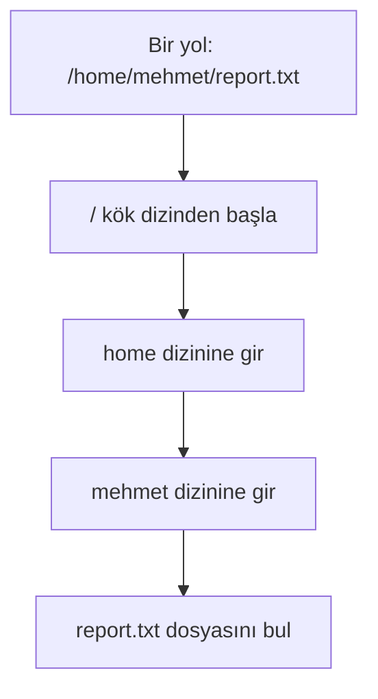
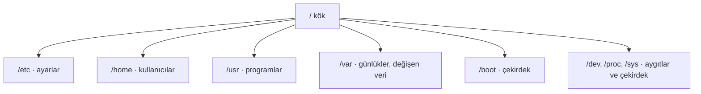
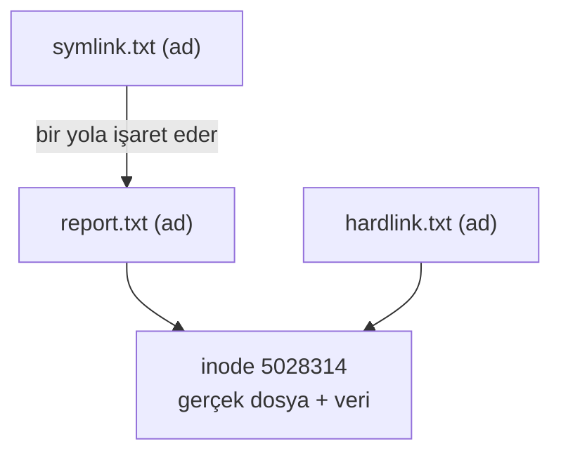
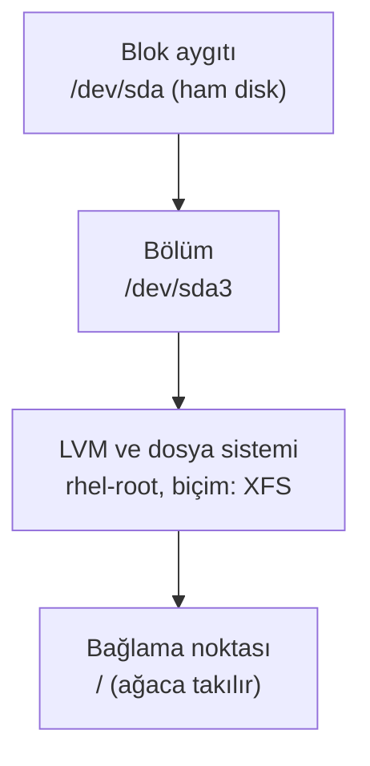

import Callout from '../../components/Callout.astro';
import Steps from '../../components/Steps.astro';
import Figure from '../../components/Figure.astro';
import treeImg from '../../assets/fs-01-tree.webp';
import typesImg from '../../assets/fs-02-filetypes.webp';
import statImg from '../../assets/fs-03-stat.webp';
import fileImg from '../../assets/fs-04-file.webp';
import linksImg from '../../assets/fs-05-links.webp';
import dfImg from '../../assets/fs-06-df.webp';
import duImg from '../../assets/fs-07-du.webp';
import procImg from '../../assets/fs-08-proc.webp';
import devImg from '../../assets/fs-09-dev.webp';
import findImg from '../../assets/fs-10-find.webp';
import bootImg from '../../assets/fs-11-boot.webp';
import treeCmdImg from '../../assets/fs-12-tree.webp';
import fileopsImg from '../../assets/fs-13-fileops.webp';
import lsblkImg from '../../assets/fs-14-lsblk.webp';
import fstabImg from '../../assets/fs-15-fstab.webp';
import inodeImg from '../../assets/fs-16-inode.webp';
import stickyImg from '../../assets/fs-17-sticky.webp';
import globImg from '../../assets/fs-18-glob.webp';
import usrvarImg from '../../assets/fs-19-usrvar.webp';

[Üçüncü bölümde](/blog/terminal-ve-kabuk) terminalde gezinmeyi öğrendik: `pwd` ile nerede olduğumuzu, `ls` ile
ne olduğunu, `cd` ile nasıl dolaşacağımızı gördük. Ama bir şehirde yürümeyi bilmek, o şehrin haritasını bilmekle
aynı şey değil. Bugün Linux'un haritasını çıkaracağız: hangi klasörde ne durur, "kök dizin" nedir, dosyaların
gerçek kimliği nasıl saklanır ve neden Linux'ta gerçekten **her şey bir dosyadır.**

[Bölüm 1'de](/blog/red-hat-nedir) "Linux'ta her şey `/` altındadır" demiştik; [Bölüm 2'de](/blog/rhel-kurulumu)
Anaconda'nın diski nasıl böldüğünü uzaktan görmüştük. Şimdi o ağacın içine girip dal dal geziyoruz. Merak etme,
kaybolmayacaksın: sonunda bu ağaç sana ezber değil, mantıklı gelecek.

<Callout type="note" title="Bu bölüm için gerekenler">
- Bölüm 2'de kurduğun RHEL makinesi, açık ve giriş yapmış; terminal açık ([Bölüm 3](/blog/terminal-ve-kabuk)).
- Bu bölümdeki komutların **hepsi yalnızca bakar,** hiçbir şeyi silmez ya da bozmaz; rahatça dene.
- Küçük denemeler için bir çalışma klasörü: `mkdir ~/fs-demo && cd ~/fs-demo`. Ekranlardaki `fs-demo` bu.
</Callout>

## Her şey bir dosyadır

Şununla başlayalım, çünkü Linux'un bütün mantığı buraya dayanır. Unix'ten miras kalan bu ilke şöyle der:
sistemdeki neredeyse her şeye **tek tip bir arayüzle**, yani bir dosya gibi erişebilirsin.

Düz metinler ve programlar zaten dosyadır, tamam. Ama işin güzel yanı şu:

- **Dizinler** de birer dosyadır; içindeki isimlerin listesini tutan özel dosyalar.
- **Aygıtlar** (disk, klavye, ses kartı) `/dev` altında birer dosya gibi görünür. Diske yazmak, bir dosyaya
  yazmak gibidir.
- **Çalışan süreçler ve çekirdeğin durumu** `/proc` ve `/sys` altında dosya gibi okunur. Belleğin ne kadar dolu
  olduğunu `cat /proc/meminfo` ile "okursun".

Bunun pratik faydası muazzam: bir avuç komutu (`ls`, `cat`, `cp`, `echo`) öğrenirsen, bu komutlarla hem
belgelerini hem ayarlarını hem donanımını hem sistemin canlı durumunu yönetebilirsin. Windows'ta her biri için
ayrı bir araç gerekirken, Linux'ta hepsi aynı "dosyaya oku, dosyaya yaz" fikriyle çalışır. Bölümün sonunda bunun
somut örneklerini göreceğiz.

## Ağacın tepesi: kök dizin

Her şey **kök dizinden** başlar; işareti tek bir eğik çizgi: `/`. Ağacın en tepesi burasıdır, bütün yollar
buradan dallanır. `ls -l /` ile tepeye bakalım:

<Figure src={treeImg} alt="RHEL 10.2 terminalinde ls -l / çıktısı: kök dizindeki klasörler ve sembolik bağlantılar" caption="Kök dizinin içeriği: etc, home, usr, var, boot, dev gibi klasörler. Dikkat: bin, lib, lib64 ve sbin birer sembolik bağlantı (-> usr/bin), yani kısayol." />

<Callout type="important" title="Linux'ta sürücü harfi yoktur">
Windows'tan gelen en büyük şaşkınlık budur: Linux'ta `C:`, `D:` gibi ayrı sürücü harfleri **yoktur.** İkinci bir
disk, USB bellek ya da ağ paylaşımı bile ağacın bir klasörüne **bağlanır** (mount edilir) ve o klasörün
içindeymiş gibi görünür. Yani kaç disk olursa olsun tek bir birleşik ağaç vardır ve her şey `/` altındadır.
Diskleri ve bağlamayı birazdan `df` ile göreceğiz.
</Callout>

Ekrandaki çıktıda ilginç bir şey var: `bin`, `lib`, `lib64` ve `sbin` satırlarının başında `l` harfi ve yanında
`-> usr/bin` gibi bir ok var. Bunlar birer **sembolik bağlantı** (kısayol); gerçek klasörler artık `/usr`
altında toplandı, eski isimler uyumluluk için kısayol olarak duruyor. Listenin en başındaki
`afs` gibi bazı klasörleri de görürsün; her RHEL'de bulunur ama çoğu zaman boştur. `afs`, AFS (Andrew File
System) adlı dağıtık dosya sistemi için ayrılmış bir bağlama noktasıdır; OpenAFS istemcisi kurulu değilse boş
durur, silmene gerek yok. Bir yolu terminale yazarken kabuğun onu
nasıl çözdüğünü de şöyle düşünebilirsin:



Mutlak bir yol (`/` ile başlayan) her zaman kökten bu şekilde, adım adım çözülür. [Bölüm 3'teki](/blog/terminal-ve-kabuk)
mutlak/göreli yol ayrımını hatırla: göreli yol bulunduğun yerden, mutlak yol hep kökten başlar.

## Dizin dizin gezelim: FHS

Peki kökün altındaki bu klasörlerin her biri ne işe yarar? İyi haber: bu düzen rastgele değil, **FHS**
(Filesystem Hierarchy Standard, dosya sistemi hiyerarşi standardı) ile standartlaştırılmıştır. Bu yüzden hangi
Linux'a otursan aynı yerde aynı şeyi bulursun.

| Klasör | Ne durur |
| --- | --- |
| **`/etc`** | Sistemin **ayar dosyaları** (düz metin). Bölüm 3'teki `/etc/hostname`, `/etc/shells` buradaydı. |
| **`/home`** | Kullanıcıların **kişisel klasörleri:** `/home/mehmet`. Senin `~` dizinin. |
| **`/usr`** | Kurulu **programların ve kütüphanelerin** asıl yeri. Komutların çoğu `/usr/bin` altında. |
| **`/var`** | Sürekli **değişen veriler:** günlükler (`/var/log`), e-posta, veritabanları, önbellek. |
| **`/boot`** | **Çekirdek** ve açılış dosyaları (`vmlinuz`, `initramfs`, GRUB). Bölüm 2'deki açılış zinciri. |
| **`/dev`** | **Aygıtlar** dosya olarak (`/dev/sda` disk, `/dev/null` kara delik). |
| **`/proc`, `/sys`** | Çekirdeğin ve süreçlerin **canlı durumu** (diskte yok, bellekte üretilir). |
| **`/tmp`** | **Geçici dosyalar;** genelde yeniden başlatınca temizlenir. Herkes yazabilir. |
| **`/root`** | **root** kullanıcısının ev dizini (`/home` değil, ayrı; dikkat). |
| **`/opt`** | Dağıtımın paket sistemi dışından kurulan ek yazılımlar. |
| **`/run`** | Çalışma anına ait geçici durum (soketler, PID dosyaları). |
| **`/mnt`, `/media`** | Elle ve otomatik **bağlanan** diskler/USB'ler için klasörler. |

<Callout type="note" title="Tarih notu: neden her Linux aynı görünür?">
1990'ların başında her Unix ve Linux dağıtımı dosyaları farklı yerlere koyuyordu; bir sistemde `/usr/bin`'de olan
komut, başka bir sistemde başka yerdeydi. Bu kaosu bitirmek için 1994'te **FSSTND**, ardından 1997'de bugünkü
adıyla **FHS** (Filesystem Hierarchy Standard) yayımlandı. Artık `/etc` ayar, `/var/log` günlük, `/usr/bin`
program demek; hangi dağıtıma geçersen geç bu anlam korunuyor. Öğrendiğin bu haritanın Ubuntu'da, Debian'da,
Fedora'da da geçerli olmasının sebebi bu standart.
</Callout>

Ağacın büyük resmini bir de şöyle görelim (en önemli dallar):



### /usr ve /var'a girelim

İki büyük dala biraz daha yakından bakalım, çünkü diskin çoğunu bunlar doldurur (`du` çıktısında en tepede
onları görmüştük).

<Figure src={usrvarImg} alt="RHEL 10.2 terminalinde ls /usr ve ls /var çıktıları, /usr/bin komut sayısı" caption="/usr içinde bin, sbin, lib, share, local, include; /var içinde log, cache, spool, lib, mail. /usr/bin tek başına 1545 komut barındırıyor: terminale yazdığın komutların neredeyse hepsi burada." />

- **`/usr`** kurulu yazılımın "salt okunur" dünyasıdır: `/usr/bin` kullanıcı komutları (ekranda 1545 tane!),
  `/usr/sbin` yönetici komutları, `/usr/lib` ve `/usr/lib64` paylaşımlı kütüphaneler, `/usr/share` mimariden
  bağımsız veriler (kılavuz sayfaları, simgeler, yazı tipleri), `/usr/local` ise paket yöneticisi dışında elle
  kurduğun yazılımlar. [Bölüm 3'teki](/blog/terminal-ve-kabuk) `/bin -> usr/bin` kısayolunu hatırla: aslında her
  şey burada toplandı.
- **`/var`** ("variable", değişken) çalışırken sürekli büyüyüp küçülen verilerdir: `/var/log` sistem günlükleri
  (bir sorun olduğunda ilk bakacağın yer), `/var/cache` önbellek, `/var/spool` yazıcı ve e-posta kuyrukları,
  `/var/lib` programların kalıcı durumu (veritabanları burada). Bir sunucuda disk doldu diye uyarı gelirse ilk
  şüpheli çoğu zaman `/var/log`'tur.

### /boot: çekirdeğin durduğu yer

Bir dala yakından bakalım, çünkü onu [Bölüm 2'den](/blog/rhel-kurulumu) tanıyorsun. `/boot`, bilgisayarın
açılırken ihtiyaç duyduğu her şeyi tutar:

<Figure src={bootImg} alt="RHEL 10.2 terminalinde ls -l /boot çıktısı: vmlinuz, initramfs, grub2, config dosyaları" caption="/boot içeriği: vmlinuz-6.12.0-211... (çekirdeğin kendisi), initramfs-...img (ilk RAM diski), grub2/ (önyükleyici), config-... ve System.map. Bölüm 2'deki açılış zincirinin dosyaları." />

`vmlinuz-6.12.0-211.51.1.el10_2.x86_64` çekirdeğin ta kendisi; `initramfs-...img` açılışta kullanılan ilk RAM
diski; `grub2/` önyükleyici. Bölüm 2'de "ISO'dan açılış" bölümünde bu dosyaların belleğe yüklendiğini
anlatmıştık. Sürüm numarasını (`6.12.0-211...`) da orada didik didik etmiştik; işte diskteki karşılığı.

## Dosya işlemleri: oluştur, kopyala, taşı, sil

Ağaçta gezinmeyi öğrendik; şimdi dalları biz budayalım. Dosya ve klasörlerle çalışmanın temel komutları azdır ve
her gün kullanılır:

<Figure src={fileopsImg} alt="RHEL 10.2 terminalinde touch, cp, mkdir, mv, rm komutlarıyla dosya işlemleri" caption="touch boş dosya oluşturur, cp kopyalar, mkdir klasör açar, mv taşır (report.bak'ı archive/ içine), rm siler. Her adımdan sonra ls ile sonucu görüyoruz." />

- **`touch dosya`** boş bir dosya oluşturur (ya da varsa zaman damgasını günceller).
- **`cp kaynak hedef`** kopyalar. Bir klasörü içeriğiyle kopyalamak için **`cp -r`** (recursive, özyinelemeli).
- **`mv kaynak hedef`** taşır. İlginç olan: `mv eski.txt yeni.txt` aynı zamanda **yeniden adlandırmaktır**;
  çünkü birazdan göreceğin gibi ad, dosyanın kendisinden ayrı bir etikettir, taşımak da adı değiştirmektir.
- **`mkdir klasör`** klasör açar; iç içe hepsini birden için **`mkdir -p a/b/c`**. Boş klasörü **`rmdir`** siler.
- **`rm dosya`** siler. Klasörü ve içindekileri silmek için **`rm -r klasör`**.

<Callout type="caution" title="rm geri dönüşü yoktur">
Linux'ta terminalden `rm` ile silinen dosya **çöp kutusuna gitmez;** doğrudan yok olur. Özellikle `rm -rf`
(recursive + force) çok güçlüdür ve bir yazım hatası felakete dönüşebilir; internetteki `rm -rf /` şakalarının
sebebi budur. İki güvenlik alışkanlığı: silmeden önce ne sildiğini görmek için `rm -i` (her dosyayı sorar), ve
joker karakterli silmelerde önce aynı deseni `ls` ile listeleyip emin olmak. Bu bölümün diğer bütün komutları
zararsızdı; `rm` ilk "dikkat" komutumuz.
</Callout>

## Bir dosyanın kimliği: tür, izin ve inode

Şimdi tek bir dosyaya yakınlaşalım. Bir dosyanın üç temel kimlik bilgisi vardır: **türü,** **izinleri** ve
**inode'u.**

### Dosya türleri

[Bölüm 3'te](/blog/terminal-ve-kabuk) `ls -l` çıktısının ilk harfinin dosya türünü söylediğini kısaca
görmüştük. Şimdi hepsini bir arada görelim:

<Figure src={typesImg} alt="RHEL 10.2 terminalinde ls -ld ile farklı dosya türleri: dizin, sembolik bağlantı, karakter ve blok aygıtı, soket" caption="ls -ld ile altı tür bir arada: /bin bir sembolik bağlantı (l), /dev/null karakter aygıtı (c), /dev/sda blok aygıtı (b), /etc dizin (d), /etc/hostname sıradan dosya (-), sistem soketi (s)." />

Satırın **ilk harfi** türü ele verir:

| Harf | Tür | Örnek |
| --- | --- | --- |
| `-` | Sıradan dosya | metin, program, resim |
| `d` | Dizin (directory) | `/etc` |
| `l` | Sembolik bağlantı | `/bin -> usr/bin` |
| `c` | Karakter aygıtı | `/dev/null`, klavye |
| `b` | Blok aygıtı | `/dev/sda` (disk) |
| `s` | Soket | programların konuştuğu uç |
| `p` | Boru (pipe) | veri akış kanalı |

İlk harften sonra gelen dokuz harf (`rwxr-xr-x`) izinlerdir; onları [6. bölümde](/red-hat) "kullanıcılar ve
izinler" konusunda uzun uzun işleyeceğiz. Şimdilik türü tanıman yeter.

### inode: dosyanın gerçek kimliği

Şimdi kafa açan ama çok önemli bir gerçek: bir dosyanın **adı, dosyanın kendisinde yazmaz.** Dosyanın gerçek
kimliği **inode** denen bir kayıttır; sahibini, izinlerini, boyutunu, zaman damgalarını ve verinin diskte nerede
durduğunu tutar. Ad ise yalnızca bir dizinde tutulan, bir inode numarasına işaret eden bir **etikettir.**
`stat` komutu bir dosyanın tüm inode bilgisini gösterir:

<Figure src={statImg} alt="RHEL 10.2 terminalinde stat /etc/hostname çıktısı: boyut, inode, izinler, zaman damgaları" caption="stat /etc/hostname: boyut 9 bayt, Inode numarası, Links (bu inode'a kaç ad işaret ediyor), izinler, sahibi (root), SELinux bağlamı ve dört zaman damgası (erişim, değişiklik, durum, doğum)." />

Bu "ad ayrı, dosya ayrı" fikri ilk başta tuhaf gelir ama çok şeyi açıklar: bir dosyayı yeniden adlandırmak
aslında sadece etiketi değiştirmektir (veri hiç kıpırdamaz), ve aynı dosyaya **birden çok ad** verilebilir. İşte
bağlantılar tam da buradan çıkar.

### Dört zaman damgası

`stat` çıktısındaki en alttaki dört satır, dosyanın **zaman damgalarıdır** ve çoğu kişi karıştırır:

- **Access (atime):** dosyaya en son ne zaman **okuma** amacıyla erişildi.
- **Modify (mtime):** **içeriği** en son ne zaman değişti. `ls -l`'de gördüğün tarih budur.
- **Change (ctime):** **inode bilgisi** (izin, sahip, ad) en son ne zaman değişti; içerik değişmese bile izin
  değiştirsen ctime güncellenir.
- **Birth (btime):** dosyanın **oluşturulma** anı (yeni bir eklenti; her dosya sisteminde bulunmaz).

Bu ayrım pratik değeri olan bir şeydir: "bu dosyaya en son ne zaman dokunuldu" ile "içeriği en son ne zaman
değişti" farklı sorulardır, ve `find -mtime` gibi aramalar tam da bu damgalara bakar.

### inode biraz daha: dizin bir ad-defteridir

inode'u anladıysan, bir dizinin de ne olduğunu çözebilirsin: **dizin, adları inode numaralarına eşleyen bir
defterdir.** "report.txt → 5028314" gibi satırlar tutar, o kadar. Bir dosyayı silmek (`rm`) aslında bu defterden
bir satırı çıkarmak ve o inode'a işaret eden ad sayısını bir azaltmaktır; sayı sıfıra inince veri gerçekten
serbest kalır. Bunu somut görelim:

<Figure src={inodeImg} alt="RHEL 10.2 terminalinde df -i ile inode sayıları ve stat ile dizin/dosya bağlantı sayıları" caption="df -i: kök dosya sisteminde 28 milyon inode var, yalnızca %1'i kullanılmış. stat: fs-demo bir dizin ve bağlantı sayısı 3 (., .. ve logs alt klasörü); report.txt ise bir dosya ve bağlantı sayısı 2 (çünkü hardlink.txt aynı inode'u paylaşıyor)." />

İki güzel ayrıntı: **(1)** `df -i` diskteki inode sayısını gösterir. Disk yer bakımından boş olsa bile milyonlarca
küçük dosyayla inode'lar tükenirse "disk dolu" hatası alırsın; deneyimli bir sysadmin `df -h` yanında `df -i`'ye
de bakar. **(2)** stat çıktısındaki **bağlantı sayısı** (Links) konuşur: `report.txt`'nin sayısı 2, çünkü
`hardlink.txt` aynı inode'a işaret ediyor. `fs-demo` dizininin sayısı 3, çünkü her dizin en az iki bağlantıyla
gelir (kendi adı ve içindeki `.`) ve her alt klasör bir tane daha ekler (buradaki `logs`). Yani bir dizinin
bağlantı sayısına bakarak kaç alt klasörü olduğunu bile anlarsın.

### file: içeriğe göre tür

`ls` dosyanın kabuk türünü söyler; peki içinde ne olduğunu? `file` komutu dosyanın **adına değil, içeriğine**
bakarak ne olduğunu tahmin eder:

<Figure src={fileImg} alt="RHEL 10.2 terminalinde file komutu çıktısı: os-release sembolik bağlantı, bash ELF çalıştırılabilir, libc paylaşımlı nesne, etc dizin, null karakter aygıtı" caption="file komutu: /etc/os-release bir sembolik bağlantı, /usr/bin/bash bir ELF çalıştırılabilir program, libc.so.6 paylaşımlı kütüphane, /etc dizin, /dev/null karakter aygıtı. Uzantıya değil içeriğe bakar." />

Linux'ta uzantı (`.txt`, `.sh`) zorunlu değildir; bir dosyayı `.txt` yapmadan da metin olabilir. Asıl belirleyici
içeriktir, o yüzden `file` çok işe yarar: indirdiğin adı belirsiz bir dosyanın gerçekte resim mi, program mı,
sıkıştırılmış arşiv mi olduğunu tek komutla anlarsın.

## Bağlantılar: bir dosya, birden çok ad

Ad ile dosyanın ayrı şeyler olduğunu gördük. O zaman aynı dosyaya iki ad verebiliriz. İki tür bağlantı var ve
farkları önemli:

<Figure src={linksImg} alt="RHEL 10.2 terminalinde ls -li ile sabit ve sembolik bağlantı: aynı inode numarası ve symlink hedefi" caption="ls -li: report.txt ve hardlink.txt aynı inode numarasını (5028314) ve Links sayısı 2'yi paylaşıyor, yani ikisi de aynı dosya. symlink.txt ise ayrı bir dosya (l tipi), report.txt'ye işaret ediyor; readlink ve cat ile hedefe ulaşıyor." />



- **Sabit bağlantı (hard link):** aynı inode'a verilen **ikinci bir addır.** `ln report.txt hardlink.txt` ile
  yapılır. `ls -li` çıktısında ikisinin **inode numarası aynıdır** ve `Links` sayısı 2'dir. İkisi de eşit
  derecede "gerçek" dosyadır; birini silsen bile veri, öteki ad durdukça kaybolmaz. Sınırı: aynı disk bölümü
  içinde çalışır, dizinlere uygulanmaz.
- **Sembolik bağlantı (symlink):** bir dosyaya değil, bir **yola işaret eden** küçük bir kısayol dosyasıdır.
  `ln -s report.txt symlink.txt` ile yapılır. `ls -l`'de başında `l` ve `-> report.txt` ile görünür. Hedef
  silinirse "kırık" kalır (gösterecek bir şey kalmaz). Buna karşılık diskler arası çalışır ve dizinleri de
  gösterebilir; kök dizindeki `bin -> usr/bin` tam da buydu.

Günlük hayatta symlink'i çok görürsün: bir programın "güncel sürüm"ünü sabit bir adla göstermek, ya da bir ayar
dosyasını başka bir yere bağlamak için. Sabit bağlantı daha nadirdir ama yedekleme sistemlerinin belkemiğidir.

## İzinlere ilk bakış: sticky ve setuid

İzinleri (`rwxr-xr-x`) tam olarak [6. bölümde](/red-hat) işleyeceğiz, ama dosya sisteminde karşına hemen çıkacak
iki özel bit var; adını duymuş ol:

<Figure src={stickyImg} alt="RHEL 10.2 terminalinde /tmp'nin sticky biti ve passwd/sudo'nun setuid biti" caption="/tmp izinleri drwxrwxrwt ile bitiyor: sondaki t 'sticky bit'. /usr/bin/passwd izinlerinde rws var: buradaki s 'setuid bit'. İkisi de sıradan rwx değil, özel yetenekler." />

- **Sticky bit (`t`):** `/tmp` izinleri `drwxrwxrwt` ile biter. `/tmp` herkesin yazabildiği ortak bir klasör;
  sticky bit sayesinde **herkes kendi dosyasını silebilir ama başkasınınkini silemez.** Ortak bir çöp
  kutusundaki "kendi çöpüne karış" kuralı gibi.
- **Setuid bit (`s`):** `/usr/bin/passwd` izinlerinde `rws` var. Normalde bir programı sen çalıştırınca senin
  yetkilerinle çalışır; setuid'li program ise **sahibinin (root'un) yetkileriyle** çalışır. `passwd` böyle:
  parolanı `/etc/shadow`'a yazabilmek için geçici olarak root olur. Güçlü ama dikkatli kullanılması gereken bir
  özelliktir; güvenlik denetimlerinin ilk baktığı yerlerdendir.

## "Her şey bir dosya" gerçekten: /proc ve /dev

En baştaki ilkeyi hatırla. Şimdi onun en çarpıcı iki örneğine bakalım: burada "dosya" dediğimiz şeyler diskte
hiç yoktur, çekirdek onları anlık üretir.

### /proc: çekirdeğin camı

`/proc`, diskte gerçekten yer kaplamayan **sanal** bir dosya sistemidir; içindeki "dosyalar" sistemin o anki
durumunu gösterir. `cat` ile okursun, sanki sıradan bir metin dosyasıymış gibi:

<Figure src={procImg} alt="RHEL 10.2 terminalinde /proc dosyaları: loadavg, meminfo, nproc, kernel hostname" caption="/proc'tan okumalar: /proc/loadavg sistem yükü, /proc/meminfo bellek (MemTotal ~9,7 GB), nproc 4 çekirdek, /proc/sys/kernel/hostname makine adı. Hiçbiri diskte yok; çekirdek okurken üretiyor." />

- `cat /proc/cpuinfo` işlemciyi, `cat /proc/meminfo` belleği, `cat /proc/loadavg` sistem yükünü verir.
- Her çalışan sürecin numarasıyla bir klasörü vardır: `/proc/1234` o sürecin bilgilerini tutar.
- `top`, `free`, `ps` gibi araçlar aslında arka planda `/proc`'u okur; sen de doğrudan okuyabilirsin.
- `/proc/sys` altındakiler **okunup yazılabilen çekirdek ayarlarıdır.** Bir sayıyı bir dosyaya yazarak çekirdeğin
  davranışını değiştirebilirsin; "her şey bir dosyadır" ilkesinin zirvesi.

### /dev: aygıtlar dosya olarak, ve /dev/null

`/dev` altında donanımın her parçası bir dosya gibi görünür. Diskin `/dev/sda`, ilk bölümü `/dev/sda1`. Ama en
çok kullanacağın birkaç tanesi gerçek donanım bile değildir; çekirdeğin sağladığı **sanal aygıtlardır:**

<Figure src={devImg} alt="RHEL 10.2 terminalinde /dev aygıtları ve /dev/null'a yazma" caption="/dev/null ve /dev/random karakter aygıtları (c), /dev/sda ve /dev/sda1 blok aygıtları (b, disk grubu). echo ... > /dev/null komutu hiçbir şey döndürmüyor ve çıkış kodu 0: yazılan yutuldu." />

**`/dev/null` nedir?** İşte en meşhuru. `/dev/null`, ona yazılan **her şeyi yutup yok eden** bir "kara
delik"tir; okumaya çalışırsan da anında biter, boştur. Peki ne işe yarar? Bir programın **istemediğin çıktısını
susturmak** için:

```bash title="/dev/null ile susturma" showLineNumbers=false
komut > /dev/null       # normal çıktıyı çöpe at
komut 2>/dev/null       # yalnızca hata mesajlarını çöpe at
komut &>/dev/null       # hem normal çıktıyı hem hataları çöpe at
```

[Bölüm 3'te](/blog/terminal-ve-kabuk) `find` çıktısındaki "Permission denied" satırlarını `2>/dev/null` ile
sustururken bunu kullanmıştık; şimdi neden işe yaradığını biliyorsun: hata mesajları o kara deliğe gidiyordu.
İki kardeşi de sık lazım olur: **`/dev/zero`** sonsuz sıfır üretir (boş dosya oluşturmak, bir alanı sıfırlamak
için), **`/dev/urandom`** rastgele bayt üretir (parola ve anahtar üretmek için). Yani `/dev` sadece donanım
değil; "veri üreten ve yutan" musluklar da içerir.

<Callout type="note" title="/sys de var">
`/proc`'un yakın akrabası `/sys`, çekirdeğin ve donanımın ayar düğmelerini dosya olarak sunar: pil durumu, ekran
parlaklığı, ağ kartı ayarları buradan okunup yazılır. Masaüstündeki "parlaklık" kaydırağı, arka planda `/sys`
altında bir dosyaya sayı yazmaktan ibarettir. Yine aynı ilke.
</Callout>

## Dosya sistemi nedir? Blok aygıttan bağlama noktasına

Buraya kadar ağacın **mantığını** gördük. Peki bu ağaç fiziksel diskte gerçekte nasıl duruyor? Burada üç kavram
üst üste biner ve bunları ayırmak sistem yönetiminin temelidir.

En altta **blok aygıtı** vardır. Blok aygıtı, veriyi sabit boyutlu bloklar hâlinde saklayan ve herhangi bir
noktasına doğrudan (rastgele) erişilebilen depolama aygıtıdır; kısaca "disk gibi" davranan her şey. Örnekleri:
bilgisayarın içindeki sabit disk ya da SSD (`/dev/sda`, NVMe SSD'lerde `/dev/nvme0n1`), taktığın USB bellek
(`/dev/sdb`), harici taşınabilir disk, hafıza kartı (`/dev/mmcblk0`), hatta CD/DVD (`/dev/sr0`). `ls -l`'de başında
**`b`** harfiyle görünürler; karşıtları, veriyi tek tek bayt akıtan **karakter aygıtlarıdır** (`c`, klavye ya da
`/dev/null` gibi). Bir **NAS** ise çoğunlukla blok aygıtı değildir: ağ üzerinden NFS ya da SMB ile bir klasör
olarak bağlanır; yalnızca iSCSI gibi yöntemler uzaktaki depolamayı yerel bir blok aygıtı gibi gösterir. Bizim
diskimiz `/dev/sda`; üstüne **bölümler** açılır (`sda1`, `sda2`...). Bir
bölümün içine bir **dosya sistemi** kurulur; dosya sistemi, o ham alanı "dosyalar, dizinler, inode'lar" olarak
düzenleyen biçimdir. En üstte de o dosya sistemi bir **bağlama noktasına** takılır ve ağacın parçası olur.
`lsblk -f` bu yığının tamamını tek ekranda gösterir:

<Figure src={lsblkImg} alt="RHEL 10.2 terminalinde lsblk -f çıktısı: disk, bölümler, LVM, dosya sistemi türleri ve bağlama noktaları" caption="lsblk -f: sda diski, sda2 (XFS, /boot'a bağlı) ve sda3 (LVM), onun içinde rhel-root (XFS, /), rhel-swap (takas), rhel-home (XFS, /home). sr0 ise takılı ISO (iso9660). Blok aygıttan bağlama noktasına kadar bütün yığın." />



<Callout type="note" title="Dosya sistemi türleri ve VFS">
Bir bölümü biçimlendirirken (`mkfs`) bir **tür** seçersin. RHEL'in varsayılanı **XFS**; başka yaygın türler
**ext4** (Ubuntu/Debian varsayılanı), **Btrfs** (anlık görüntü ve sıkıştırma özellikli), USB'lerde **vfat/exFAT**
(Windows'la uyumlu), ISO'larda **iso9660**. Peki tek bir `cd` ya da `ls` komutu bu kadar farklı türle nasıl
çalışıyor? Cevap **VFS** (Virtual Filesystem, sanal dosya sistemi): çekirdeğin içinde, bütün dosya sistemi
türlerini tek bir ortak arayüzün arkasına gizleyen katman. Sen `cat dosya` yazarsın, VFS bunu XFS'e mi ext4'e mi
ileteceğine karar verir. "Her şey bir dosyadır" ilkesinin altyapısı da budur.
</Callout>

### Bağlama ve /etc/fstab

Bir dosya sistemini ağaca takma işine **bağlama** (mount), çıkarma işine **umount** denir. Peki makine her
açıldığında hangi diskin nereye bağlanacağını kim biliyor? Cevap `/etc/fstab` dosyasıdır:

<Figure src={fstabImg} alt="RHEL 10.2 terminalinde cat /etc/fstab ve findmnt /boot çıktıları" caption="/etc/fstab: her satır bir dosya sistemini kalıcı olarak bir bağlama noktasına eşler; UUID ile disk, sonra bağlama noktası, tür (xfs) ve seçenekler. findmnt /boot ise /boot'un /dev/sda2'den geldiğini ve bağlama seçeneklerini gösteriyor." />

`/etc/fstab`'daki her satır Bölüm 2'de Anaconda'nın kurduğu düzenin kalıcı kaydıdır: disk **UUID** ile (adı
değişse de şaşmasın diye), bağlama noktası, dosya sistemi türü ve seçenekler. Makine her açıldığında sistem bu
dosyayı okuyup diskleri yerlerine bağlar. Bir USB taktığında ise elle `sudo mount /dev/sdb1 /mnt` diyebilir ya
da masaüstünün otomatik bağlamasına bırakabilirsin; `findmnt` ve `mount` komutları o an neyin nereye bağlı
olduğunu gösterir. Diski büyütmeyi ve LVM ile oynamayı [11. bölümde](/red-hat) ayrıntısıyla yapacağız.

## Disk ve bağlama: df ve du

Ağacı ve dosyaları gördük; peki bu ağaç fiziksel disklere nasıl oturuyor? İki komut bu resmi verir.

### df: dosya sistemleri ve bağlama noktaları

`df` (disk free), sistemdeki dosya sistemlerine bir bütün olarak bakar: hangi disk bölümü nereye bağlı, ne kadarı
dolu:

<Figure src={dfImg} alt="RHEL 10.2 terminalinde df -hT çıktısı: kök, boot ve home dosya sistemleri ve bağlama noktaları" caption="df -hT: rhel-root (55G) / ''a, sda2 (2G) /boot''a, rhel-home (27G) /home''a bağlı; hepsi XFS. Bölüm 2'de Anaconda'nın kurduğu LVM düzeninin çalışan hâli." />

"Mounted on" (bağlandığı yer) sütununa dikkat: bu tam olarak **bağlama noktası** kavramıdır. Bölüm 2'de Anaconda
diski böldüğünde kök bölümü `/`'a, ayrı `/boot` bölümü `/boot`'a, `/home` bölümü `/home`'a bağlanmıştı. Yani sen
`/home/mehmet`'e girdiğinde aslında ayrı bir disk bölümünün içindesin, ama ağaçta bu hiç belli olmuyor; her şey
tek bir bütün gibi görünüyor. USB bellek taktığında da genelde `/run/media/mehmet/...` altına otomatik bağlanır.

### du: bu klasör ne kadar yer kaplıyor?

`df` bütüne bakar; belirli bir klasörün ne kadar yer kapladığını ise `du` (disk usage) söyler:

<Figure src={duImg} alt="RHEL 10.2 terminalinde du -sh ile klasör boyutları, sort -h ile sıralı" caption="du -sh ... | sort -h: /var/log 16M, /etc 30M, /boot 368M, /usr 4,3G, /home 11G. En çok yeri /usr (programlar) ve /home (kullanıcı dosyaları) kaplıyor." />

`du -sh <klasör>` bir klasörün özet boyutunu verir; `sort -h` ile "insan okur" biçimindeki boyutları küçükten
büyüğe sıralar. "Diskim doldu, suçlu kim?" dediğinde ilk komutun `du` olur. Kısaca ikisini ayır: **`df` = diskim
ne kadar dolu, `du` = bu klasör ne kadar yer kaplıyor.**

## Dosya bulmak: find ve tree

Koca ağaçta bir dosyayı elle aramak imkânsız. `find` bunun en güçlü yoludur.

<Figure src={findImg} alt="RHEL 10.2 terminalinde find komutu: ada göre, tipe göre arama ve Permission denied uyarıları" caption="find /etc -name '*.conf' ayar dosyalarını, find /usr/bin -name 'python*' python komutlarını, find ~/fs-demo -type f demo dosyalarını buluyor. Okuma izni olmayan /etc/lvm klasörleri 'Permission denied' veriyor." />

Temel kalıp basit: **`find <nerede> <ölçüt>`.**

```bash title="Sık kullanılan find kalıpları" showLineNumbers=false
find /etc -name "*.conf"      # ada göre (ayar dosyaları)
find ~ -type f                # yalnızca dosyalar (dizinleri değil)
find /var -size +100M         # 100 MB'tan büyükler
find /home -mtime -1          # son 1 günde değişenler
find ~/fs-demo -type f -delete   # bulunanları sil (dikkatli!)
```

Ekranda gördüğün "Permission denied" satırları normaldir: `find` okuma iznin olmayan klasörlere giremez. Sistem
genelinde arama yapmak için başına `sudo` eklemen gerekebilir. Anlık, ada göre hızlı arama istiyorsan `locate`
(RHEL'de `plocate`) daha çabuktur ama önceden hazırlanmış bir dizine bakar; onu 7. bölümde kurmayı göreceğiz.

Bir de ağacı görsel görmek istersen `tree`:

<Figure src={treeCmdImg} alt="RHEL 10.2 terminalinde tree ~/fs-demo çıktısı: klasör ağacı görsel biçimde" caption="tree ~/fs-demo: klasörü dallanan bir ağaç gibi çizer; alt klasörler ve dosyalar girintili görünür. Büyük ağaçlarda tree -L 2 ile derinliği sınırlarsın." />

## Joker karakterler: bir seferde çok dosya

Tek tek dosya adı yazmak yerine, **desen** yazıp bir seferde çok dosyayı yakalayabilirsin. Bunu yapan **kabuktur**
(komut değil): sen deseni yazarsın, kabuk onu eşleşen dosya adlarına açar; buna **globbing** denir.

<Figure src={globImg} alt="RHEL 10.2 terminalinde joker karakterler: yıldız ile uzantıya göre, /dev/sda* ve /boot/vmlinuz* eşleşmeleri" caption="ls *.txt tüm .txt dosyalarını, ls *.log günlükleri, ls /dev/sda* tüm sda aygıtlarını, echo /boot/vmlinuz* çekirdek dosyalarını eşleştiriyor. Kabuk deseni çalıştırmadan önce dosya adlarına açıyor." />

- **`*`** herhangi sayıda karakter: `*.txt` tüm .txt dosyaları, `rapor*` "rapor" ile başlayanlar.
- **`?`** tek bir karakter: `dosya?.txt` → `dosya1.txt`, `dosya2.txt` (ama `dosya10.txt` değil).
- **`[...]`** köşeli parantez, bir küme: `dosya[12].txt` → yalnızca `dosya1.txt` ve `dosya2.txt`; `[a-z]` bir
  harf aralığı.
- **`{...}`** süslü parantez, seçenekler: `dosya.{txt,log}` → `dosya.txt` ve `dosya.log`.

Bu, `ls`, `cp`, `rm` gibi her komutla çalışır çünkü işi komut değil kabuk yapar. Tam bu yüzden `rm` ile
kullanırken dikkatli ol: silmeden önce **aynı deseni `ls` ile** listeleyip neyi sileceğini gör. `echo *` bile
bulunduğun dizindeki her şeyi yazar; deseni denemenin zararsız yolu budur.

## Kendin dene

Her soruyu önce kafanda cevapla, sonra makinende dene.

### Soru 1 — Yol nereye çıkar? (kolay)

> `/home/mehmet/fs-demo/report.txt` yolunu soldan sağa oku. Kaç dizinin içinden geçip dosyaya ulaşıyorsun, ve
> bu yol mutlak mı göreli mi?

<Callout type="note" title="İpucu">
Kökten (`/`) başlıyor, demek ki **mutlak** yol. Sırayla `home` → `mehmet` → `fs-demo` dizinlerine giriyor, sonra
`report.txt` dosyasına ulaşıyor: üç dizin. Göreli olsaydı `/` ile başlamaz, bulunduğun yere göre (`fs-demo/report.txt`
gibi) yazılırdı.
</Callout>

### Soru 2 — Türü oku (kolay)

> `ls -l` çıktısında bir satır `brw-rw----` ile, başka biri `lrwxrwxrwx` ile başlıyor. Bunlar ne tür dosyalar?

<Callout type="note" title="İpucu">
İlk harfe bak: `b` = **blok aygıtı** (disk gibi, örneğin `/dev/sda`), `l` = **sembolik bağlantı** (kısayol). Geri
kalan harfler (izinler) türü değiştirmez; tür her zaman ilk harftedir. `d` görseydin dizin, `c` görseydin karakter
aygıtı, `-` görseydin sıradan dosya olurdu.
</Callout>

### Soru 3 — Aynı dosya mı? (orta)

> İki dosyanın `ls -li` çıktısında inode numarası aynı çıkıyor. Bu ne anlama gelir? Peki biri symlink olsaydı
> inode numaraları nasıl olurdu?

<Callout type="note" title="İpucu">
Aynı inode numarası, ikisinin de **aynı dosya** olduğu anlamına gelir; yani sabit bağlantıdır (biri ötekinin
ikinci adı). Symlink olsaydı, symlink **ayrı bir dosya** olduğu için **farklı** bir inode numarası taşırdı ve
`ls -l`'de başında `l` ile, hedefe `->` ile işaret ederdi.
</Callout>

### Soru 4 — Gürültüyü sustur (orta)

> Bir komut hem sonuç hem de bir sürü hata mesajı basıyor; sen yalnızca hataları görmek istemiyorsun. Ne
> yaparsın? Peki hem sonucu hem hatayı tamamen çöpe atmak istesen?

<Callout type="note" title="İpucu">
Yalnızca hataları at: `komut 2>/dev/null` (hata akışını `/dev/null` kara deliğine yönlendirir). Hem sonucu hem
hatayı at: `komut &>/dev/null`. Buradaki `2`, hata akışının numarasıdır; `/dev/null` da her şeyi yutan aygıt.
Sonucu bir dosyaya kaydedip yalnızca hatayı atmak da mümkün: `komut >sonuc.txt 2>/dev/null`.
</Callout>

### Soru 5 — df mi du mu? (kolay)

> (a) "Kök diskim yüzde kaç dolu?" (b) "İndirilenler klasörüm ne kadar yer kaplıyor?" Hangi soru için hangi
> komutu kullanırsın?

<Callout type="note" title="İpucu">
(a) için **`df -h /`** (dosya sisteminin bütününe, doluluk oranına bakar). (b) için **`du -sh ~/Downloads`**
(belirli bir klasörün kapladığı yeri hesaplar). Kısaca: bütün disk = `df`, tek klasör = `du`.
</Callout>

### Soru 6 — Kopyala ve taşı (kolay)

> `~/fs-demo` içinde `report.txt` var. Bir yedeğini `report.bak` adıyla oluştur, sonra `yedek` adlı bir klasör açıp
> bu yedeği içine taşı. Hangi komutları sırasıyla kullanırsın?

<Callout type="note" title="İpucu">
`cp report.txt report.bak` (kopya), `mkdir yedek` (klasör), `mv report.bak yedek/` (taşı). Kontrol: `ls` ve
`ls yedek`. Silmek istersen `rm yedek/report.bak`, boş klasörü `rmdir yedek`. `cp` olmadan doğrudan `mv`
kullansaydın kopya değil taşıma olurdu; orijinal `report.txt` yerinde kalmazdı.
</Callout>

### Soru 7 — Doğru deseni seç (orta)

> Bir klasörde `rapor1.txt`, `rapor2.txt`, `rapor10.txt` ve `notlar.txt` var. `ls rapor?.txt` hangilerini gösterir?
> Peki `ls rapor*.txt`?

<Callout type="note" title="İpucu">
`?` tek bir karakter eşleştirir, o yüzden `rapor?.txt` → `rapor1.txt` ve `rapor2.txt` (`rapor10.txt` değil, çünkü
"10" iki karakter). `rapor*.txt` ise `*` herhangi sayıda karakter olduğu için üçünü de (`rapor1`, `rapor2`,
`rapor10`) gösterir, `notlar.txt` hariç. Bir `rm` desenini yazmadan önce bu farkı bilmek felaketleri önler.
</Callout>

## Toparlayalım

Linux'un haritasını çıkardık. Artık hangi klasörde ne olduğunu biliyor, bir dosyanın gerçek kimliğini okuyabiliyor
ve "her şey bir dosya" ilkesinin ne demek olduğunu görüyorsun. Aşağıdakini cebine koy.

<Callout type="tip" title="Cebine koy">
- **Her şey bir dosyadır:** dizinler, aygıtlar (`/dev`), hatta çekirdeğin durumu (`/proc`, `/sys`) bile dosya
  gibi okunur/yazılır. Bir avuç komut (`ls`, `cat`, `echo`) her şeye yeter.
- **Kök dizin `/`** ağacın tepesi; Linux'ta sürücü harfi yok, her şey `/` altında tek bir ağaçta. Diskler bir
  klasöre **bağlanır** (mount).
- **FHS** her yeri standartlaştırır: `/etc` ayar, `/home` kullanıcı, `/usr` program, `/var` günlük/değişen veri,
  `/boot` çekirdek, `/tmp` geçici, `/dev` aygıt, `/proc` `/sys` canlı durum.
- **Dosya türü** `ls -l`'in ilk harfinde: `-` dosya, `d` dizin, `l` bağlantı, `c`/`b` aygıt, `s` soket, `p` boru.
  İçeriğe göre tür için `file`.
- **inode** dosyanın gerçek kimliği; ad ayrı bir etikettir. `stat` ile bakılır. Aynı inode'a çok ad = **sabit
  bağlantı** (`ln`); bir yola işaret eden kısayol = **sembolik bağlantı** (`ln -s`).
- **`/dev/null`** yazılanı yutan kara delik: `2>/dev/null` hataları, `&>/dev/null` her şeyi susturur. `/dev/zero`
  sıfır, `/dev/urandom` rastgele üretir.
- **`df`** diskim ne kadar dolu (+ bağlama noktaları), **`du`** bu klasör ne kadar yer kaplıyor. **`find`** ile
  ada/türe/boyuta göre ara, **`tree`** ile ağacı gör.
- **Dosya işlemleri:** `touch` oluştur, `cp` (klasör `cp -r`) kopyala, `mv` taşı/yeniden adlandır, `mkdir -p`
  klasör, `rm` (klasör `rm -r`) sil. `rm` geri alınamaz; dikkatli ol.
- **Disk yığını:** blok aygıtı → bölüm → dosya sistemi (XFS/ext4, `mkfs`) → bağlama noktası. `lsblk -f` yığını,
  `/etc/fstab` kalıcı bağlamayı gösterir; **VFS** farklı türleri tek arayüzde birleştirir.
- **Özel bitler:** `/tmp`'de **sticky** (`t`, herkes yalnızca kendi dosyasını siler), `passwd`'de **setuid**
  (`s`, sahibinin yetkisiyle çalışır). İzinlerin tamamı 6. bölümde.
- **Joker karakterler:** `*` çok karakter, `?` tek karakter, `[...]` küme, `{...}` seçenek; işi kabuk yapar,
  `rm` öncesi `ls` ile dene.
- Sırada: [5. bölüm, Borular ve Vim](/red-hat). Komutların çıktısını birbirine zincirlemeyi (`|`) ve terminalin
  güçlü editörü vim'i öğreneceğiz. Dosyaları bulmayı öğrendin; şimdi içlerini işleme sırası.
</Callout>

## Kaynaklar

- [Filesystem Hierarchy Standard (FHS 3.0)](https://refspecs.linuxfoundation.org/fhs.shtml): dizin ağacının
  resmî standardı.
- [RHEL 10 belgeleri](https://docs.redhat.com/en/documentation/red_hat_enterprise_linux/10): dosya sistemleri ve
  depolama yönetimi.
- `man hier`: makinendeki dizin ağacını anlatan kılavuz sayfası (`man hier` yaz, dene).
- [The Linux Command Line (William Shotts)](https://linuxcommand.org/tlcl.php): dosya sistemi ve gezinme
  bölümleri, ücretsiz.
- "Her şey bir dosyadır" ilkesi: [Unix felsefesi](https://en.wikipedia.org/wiki/Everything_is_a_file).
