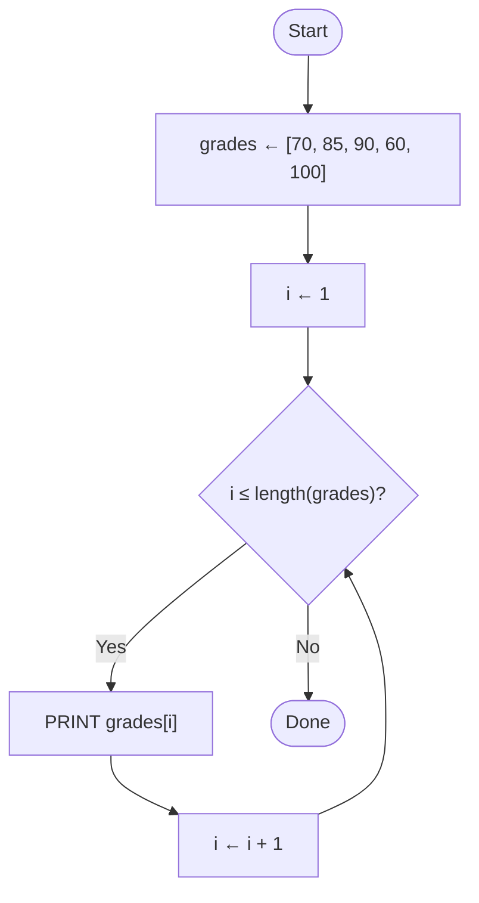

import Callout from '../../components/Callout.astro';
import Steps from '../../components/Steps.astro';

[In the previous post](/en/blog/loops) we learned loops: doing the same work **over and over**
while a condition holds. At the end we summed the numbers 1 to 10 — but did you notice those
numbers were **generated in sequence** (`n ← n + 1`)? There was no pile of stored numbers; we
computed the next one on each pass. But what if we have specific values given to us up front?
Say your five exam grades: 70, 85, 90, 60, 100. These aren't a pattern — just a handful of
values. How do we hand them to a computer?

From the [variables post](/en/blog/variables) we know one way: put each grade in its own box.
`grade1 ← 70`, `grade2 ← 85`, `grade3 ← 90`… Five grades, five variables, fine. But what about
**fifty** grades? Are you going to invent fifty separate names? And if you wanted to sum them,
a loop wouldn't help either — because each box has a **different name,** there's no sequence
for the loop to walk. This is exactly where we get stuck. This post is about the idea that
frees us: **storing many values under a single name, in order.** We call it a **list.**

<Callout type="note" title="Where are we in this series?">
This is the seventh post in the **Algorithms** series. We [met algorithms](/en/blog/what-is-an-algorithm),
drew them as [flowcharts](/en/blog/flowcharts), wrote them as [pseudocode](/en/blog/pseudocode),
stored a single piece of information with [variables](/en/blog/variables), decided with
[conditionals](/en/blog/conditionals), and learned to repeat with [loops](/en/blog/loops).
A list locks the last two together: it holds a pile of data under **one name,** and the loop
**walks** it from start to finish. This pair — list and loop — is the backbone of real programs,
which is why this is the longest post in the series. But don't worry: still not a single line of
real code, just pen, paper, and thinking.
</Callout>

## Why do we need lists?

Back to our problem: you want the average of five exam grades. With separate variables it
looks like this:

```text title="Without a list — each grade in its own box" showLineNumbers=false
grade1 ← 70
grade2 ← 85
grade3 ← 90
grade4 ← 60
grade5 ← 100
average ← (grade1 + grade2 + grade3 + grade4 + grade5) / 5
PRINT average
```

For five grades it's bearable. But two problems jump out. First: it **doesn't scale.** With
fifty grades you'd need fifty assignment lines and one enormous sum. Second — and more
importantly: you **can't build a loop.** [Loops](/en/blog/loops) were meant for exactly "repeat
the same work", but here there's no repeatable pattern; `grade1`, `grade2`, `grade3` are
independent names. There's no **sequence** for the loop to walk over.

Yet in everyday life we always gather "many things of the same kind" under one heading:

- **A shopping list:** milk, bread, eggs, cheese… all on one sheet, one below the other.
- **A class roster:** thirty student names, in order, in one notebook.
- **A playlist:** hundreds of songs under one name, as track 1, track 2, and so on.

In none of these do we give everything a separate name; we make one **list** and look at its
items **in order.** That is exactly what a list does on a computer.

## What is a list?

Think of a list as **a row of boxes lined up side by side** — and the whole row carries a
single name. In the [variables post](/en/blog/variables) we pictured a variable as "one box
with a label on it"; a list is **a row of those boxes.** Let's put our five grades in a list:

```text title="Gather five grades in one list" showLineNumbers=false
grades ← [70, 85, 90, 60, 100]
```

This line is familiar: the same **assignment** arrow (`←`) that puts the value on the right
into the name on the left. The only difference is that this time we put not a single number
in the box, but **a row of numbers** inside square brackets. Now we have a single name,
`grades`, holding five values in a definite **order.** Let's see that order in a table:

| Position (index) | 1 | 2 | 3 | 4 | 5 |
| :--------------- | :-: | :-: | :-: | :-: | :-: |
| Value | 70 | 85 | 90 | 60 | 100 |

The top row is each box's **position** (index), the bottom row is the **value** in that box.
Not mixing these two up is the most important point of this post — we'll come back to it again
and again. A list doesn't have to hold numbers either; just like with [variables](/en/blog/variables),
it can hold text:

```text title="A list of text" showLineNumbers=false
shopping ← ["milk", "bread", "eggs"]
```

Same rule: one name (`shopping`), ordered values inside. Numbers or text, a list means "keep
many things of the same kind under one roof, in order."

## Why are lists so important?

Now that you know what a list is, let's step back and see **why** it matters so much. Because a
list isn't some minor topic off to the side — it's the **cornerstone** quietly running under
almost every piece of software you use. Consider:

<Callout type="tip" title="There's a list almost everywhere">
- **In a search engine,** the results you get are a list — links lined up in order.
- **On your phone:** contacts, incoming messages, notifications, photos in the gallery — all lists.
- **In a music app** the playlist; **in a game** your inventory and the scoreboard; **on a
  shopping site** the items in your cart — all lists.
- **A photo** is really a list of tiny dots of color (pixels) laid side by side.
- **A piece of text** (even this sentence) is really a list of letters — we'll get to that at the end.
- **In a database,** each record (a user, an order) is like a list of ordered fields.
</Callout>

As you can see, a huge part of what real programs do is holding, walking, filtering and
changing "**many things of the same kind**" — and all of those are lists. That's exactly why
the **loop** from the [previous post](/en/blog/loops) and the **list** in this one, put
together, form the most-used pair in programming: the list holds the data, the loop works
through it. Grasp this pair and you've solved half of how real software works.

## How do we reach an element? The index

We've built the list; but how do we reach a single value inside it? Here is the magic of a
list: each box has a **position** (index) number, and by naming that number you reach straight
into the box you want. We write it with **square brackets:**

```text title="Reaching an element by position" showLineNumbers=false
grades ← [70, 85, 90, 60, 100]
PRINT grades[1]      → 70   (the first grade)
PRINT grades[3]      → 90   (the third grade)
PRINT grades[5]      → 100  (the fifth, i.e. the last)
```

`grades[3]` reads as: "the value at **position 3** of the grades list." The number in the
brackets is the **position,** and the answer is the **value** at that position. These two are
entirely different things:

<Callout type="important" title="A position is not the value itself">
In `grades[3]`, the `3` is an **address** — it means "the third box." The answer, `90`, is the
**value inside** that box. So `grades[3]` means "whatever is in the third box" (90), not "3."
Think of a mailbox: the box's number (3) and the letter inside it (90) are not the same thing.
Miss this distinction and you'll trip over lists constantly.
</Callout>

The real power of the index shows up here: instead of a fixed number, you can put a **variable**
inside the brackets. If you write `grades[i]`, it gives you the element at whatever position
`i` is — 70 when `i` is 1, 60 when `i` is 4. Does something occur to you? If we increase `i`
with a loop — 1, 2, 3… — we can walk the **whole list** in a single line. In a moment we'll do
exactly that. But first, let's talk about that famous detail that plagues beginners.

<Callout type="caution" title="Real code counts from 0">
On paper, with human intuition, we count from **1:** the first element is `grades[1]`. But in
real code almost **every language starts from 0:** the first element is `grades[0]`, the second
`grades[1]`, and the last is `grades[4]`. It sounds odd, but there's a logic to it: a position
really means "how many steps from the start of the list" — and the first element is **0 steps**
from the beginning. This "counting from zero" business is the number-one trap for beginners;
it's the sibling of the [loops](/en/blog/loops) "off by one" mistake. Throughout this series
we'll stay close to intuition and count from **1;** but the moment you move to a real language,
let this be your first check: **does this language count from 0 or from 1?**
</Callout>

<Callout type="tip" title="Reaching the last element">
To reach a list's last element, don't hand-write "5" — because a list can grow and shrink.
Instead, always use the length: the last element is always `grades[length(grades)]` (we'll meet
the `length` helper in a moment). This way, even if you add an element, "the last" keeps
pointing to the right place. A little bonus: in real code some languages offer an elegant
shortcut for this, like `grades[-1]` ("the first from the end") — but the idea is the same: "go
to the last box."
</Callout>

## Walking a list with a loop

Now we reach the idea at the heart of this post: a list and a loop, hand in hand. Looking at
every element of a list one by one, from start to finish, is called **walking** (traversing)
the list. The pattern: a counter starts at 1, moves up to the list's length, and on each pass
reaches the element at `list[counter]`.

We need a small helper that asks how many elements a list has; we'll call it `length(...)`.
`length(grades)` gives **5** for our five-element list. Now let's print all the grades — the
very counter loop from the [loops post](/en/blog/loops), except the counter now turns into a
position:

```text title="Print all grades — walking a list" showLineNumbers=false
grades ← [70, 85, 90, 60, 100]
i ← 1
WHILE i ≤ length(grades) DO
    PRINT grades[i]
    i ← i + 1
ENDWHILE
```

You know the three parts from [loops](/en/blog/loops): **initialization** (`i ← 1`),
**condition** (`i ≤ length(grades)`), and **progression** (`i ← i + 1`). The only new thing
is `grades[i]` in the loop body — "whatever pass we're on, the grade at that position." Let's
see the same idea as a flowchart too; almost identical to the loop diagram from the
[previous post](/en/blog/loops), only the boxes' contents changed:



That **loop-back arrow** (F to D) is, again, the heart of the loop. Now let's walk the loop on
paper — with the **trace table** you know from the [variables](/en/blog/variables) and
[loops](/en/blog/loops) posts:

| Pass | `i` (start) | `i ≤ 5`? | `grades[i]` | Printed | `i` (end) |
| :-: | :---------: | :------: | :---------: | :-----: | :-------: |
| 1 | 1 | true | `grades[1]` = 70 | 70 | 2 |
| 2 | 2 | true | `grades[2]` = 85 | 85 | 3 |
| 3 | 3 | true | `grades[3]` = 90 | 90 | 4 |
| 4 | 4 | true | `grades[4]` = 60 | 60 | 5 |
| 5 | 5 | true | `grades[5]` = 100 | 100 | 6 |
| 6 | 6 | **false** | — | — | (loop ends) |

When `i` becomes 6 the condition turns false and the loop stops politely, right at the end of
the list. Notice: the counter `i` both **counts the passes** and **points to the position** —
walking a list is where these two come together. That's exactly why a loop and a list get along
so well.

## Accumulating with a list: sum and average

Once you can walk a list, we can do real work with it. Recall the **accumulation** pattern from
the [loops post](/en/blog/loops): set up an accumulator before the loop, add to it on each pass,
get a single result at the end. Now we apply exactly the same pattern to a list — let's find
the average of the five grades:

```text title="Grade average — walking + accumulating" showLineNumbers=false
grades ← [70, 85, 90, 60, 100]
total ← 0
i ← 1
WHILE i ≤ length(grades) DO
    total ← total + grades[i]
    i ← i + 1
ENDWHILE
average ← total / length(grades)
PRINT average
```

Here there are two variables, and just like in [loops](/en/blog/loops) their roles are
separate: `i` is the **counter** driving the position, `total` is the **accumulator** where the
result builds up. On each pass `total` grows by the current grade: 0 → 70 → 155 → 245 → 305 →
405. When the loop ends `total` is 405; dividing it by the number of elements (5) gives an
**average of 81.**

<Callout type="important" title="Initialize the accumulator OUTSIDE the loop">
That golden rule from the [loops post](/en/blog/loops) holds here too: the `total ← 0` line must
sit **outside** the loop, before it. Put it inside and it resets every pass, so nothing
accumulates. Also, for the average, dividing by `length(grades)` instead of hand-writing "5"
matters: if you add one more grade tomorrow, the code keeps dividing by the **right** number
on its own. Trust the list's length, not a fixed number.
</Callout>

## Finding the highest and the lowest

In the [loops post](/en/blog/loops) we said "summing, counting, finding the maximum… all are
variants of the same accumulation pattern." Now that we have a list in hand, we can actually
do that "find the maximum": let's find the **highest** grade.

The idea is simple and very human: hold a piece of paper, and write the first grade on it for
now. Then, as you walk the list, whenever a grade is **bigger** than the one on your paper,
update it. When you reach the end, the highest grade is left on the paper:

```text title="Finding the highest grade" showLineNumbers=false
grades ← [70, 85, 90, 60, 100]
highest ← grades[1]
i ← 2
WHILE i ≤ length(grades) DO
    IF grades[i] > highest THEN
        highest ← grades[i]
    ENDIF
    i ← i + 1
ENDWHILE
PRINT highest
```

Did you notice all three structures working together in this example: we walk the list with a
**loop,** compare with a **conditional** on each pass ([conditionals](/en/blog/conditionals)),
and write the result to an **accumulator.** All the pieces of the series — variable, condition,
loop, list — meet here in one small program. Walk it on paper: `highest` goes 70 → 85 → 90 →
90 → 100; it doesn't change when it hits 60 (since 60 isn't greater than 90), and stops at
**100.**

<Callout type="tip" title="Why does i start at 2? And the lowest?">
Because we put the first grade into `highest` right at the start (`highest ← grades[1]`), there's
no need to compare it again — that's why the loop starts from the second element (`i ← 2`).
Writing `i ← 1` wouldn't be wrong either, it would just add a redundant first pass comparing
the grade with itself. With the same pattern, if you write `<` instead of `>`, you find the
**lowest** grade — and by putting both comparisons in the same loop you can find both in a
single walk (we'll do exactly that in the mini project at the end).
</Callout>

## Searching a list: is it there, where?

Another common job: finding out whether a value is **in** the list. Is a name on the roster? Is
that item in the cart? For this too we walk the list and compare each element with what we're
looking for. To hold the result we use a **yes/no flag** — recall the `true`/`false` (boolean)
values from the [variables post](/en/blog/variables):

```text title="Is a name in the list?" showLineNumbers=false
names  ← ["Ada", "Ali", "Zeynep", "Can"]
target ← "Zeynep"
found  ← false
i ← 1
WHILE i ≤ length(names) DO
    IF names[i] = target THEN
        found ← true
    ENDIF
    i ← i + 1
ENDWHILE
PRINT found
```

The logic: we assume the flag is `false` from the start ("haven't found it yet"). As we walk the
list, if we hit what we're looking for, we flip the flag to `true`. When the loop ends the flag
tells us whether that value is in the list. If you want to know not just **whether** but **at
what position,** put a position next to the flag: add `position ← i` inside the `IF` block — when
the loop ends, `position` holds the index of the element you were looking for.

<Callout type="note" title="Checking one by one: the most basic search">
This method — scanning the list from start to finish **one by one** until you find what you
want — is the most basic form of search; it's exactly what you do when your finger runs down a
notebook line by line looking for a name. On huge lists of millions of elements there are
clever methods that do this far faster, but those are an advanced topic; for now all you need to
know is that "walk and compare" is enough to find anything in a list. A small tip: as soon as
you find it, you can cut the loop short early with [`STOP`](/en/blog/pseudocode) — no need to
look at the remaining elements.
</Callout>

## Changing a list: add, fix, remove

So far our lists have stayed as they were built. But real lists live: you add something new to
a shopping list, you fix a grade, you take an item out of the cart. There are three basic
operations — call them a list's "daily life."

**Fixing an element** is easy — pick the position and assign a new value to it. This is the
same assignment from [variables](/en/blog/variables), except the target is now a box of the
list:

```text title="Fixing an element" showLineNumbers=false
grades ← [70, 85, 90, 60, 100]
grades[4] ← 75          (the fourth grade is now 75, not 60)
PRINT grades[4]         → 75
```

To **add an element to the end** of a list we'll say `APPEND`: it attaches a new value to the
end, and the list grows by one box:

```text title="Adding to the end" showLineNumbers=false
shopping ← ["milk", "bread", "eggs"]
APPEND "cheese" TO shopping
PRINT length(shopping)   → 4   (the list now has four elements)
```

To **remove an element** we'll say `REMOVE`: it takes the value out of the list, and the list
shrinks by one box:

```text title="Removing an element" showLineNumbers=false
shopping ← ["milk", "bread", "eggs", "cheese"]
REMOVE "bread" FROM shopping
PRINT length(shopping)   → 3   ("bread" is gone; list: milk, eggs, cheese)
```

Notice that a list's **length can change** — an important property that sets a list apart from a
single variable. Adding a song to a playlist, removing a student from a roster, fixing a grade…
each is one of these three operations.

<Callout type="caution" title="Removing shifts the positions">
Removing has a sneaky side effect: when an element leaves, everything behind it shifts one
position **forward.** In the example above, once "bread" (position 2) is removed, "eggs" moves
from position 3 to 2, and "cheese" from 4 to 3. That's why removing elements from a list *while
walking it* with a loop is one of the most confusing things for beginners — the moment you
remove, the positions move and your counter gets thrown off. Our rule: **don't remove while
walking;** decide what to remove first and then remove it, or collect the elements you want into
a new list (which is exactly what we'll do next).
</Callout>

## Building a list from empty

So far our lists were born with ready-made values. But most of the time a list **starts empty**
and fills up pass by pass as the program runs — just like filling an empty shopping cart as you
walk the aisles. An empty list is created with `[]` (no boxes inside, `length` is 0), then it
grows inside a loop with `APPEND`. This is one of the **most-used** patterns in real software:
filtering a bunch of things and collecting only the ones you want.

Let's do an example: from the numbers 1 to 20, collect only the **even** ones into a list. We
tell even from odd with `MOD` from the [conditionals post](/en/blog/conditionals) (`n MOD 2 =
0`), count from 1 to 20 with a [loop](/en/blog/loops), and append the fitting ones to the empty
list:

```text title="Collect the even numbers into a list — building from empty" showLineNumbers=false
evens ← []
n ← 1
WHILE n ≤ 20 DO
    IF n MOD 2 = 0 THEN
        APPEND n TO evens
    ENDIF
    n ← n + 1
ENDWHILE
PRINT evens        → [2, 4, 6, 8, 10, 12, 14, 16, 18, 20]
```

This is an upgrade of the "1–10 even numbers" example from the [pseudocode](/en/blog/pseudocode)
and [loops](/en/blog/loops) posts: there we **printed** the evens, here we **collect** them into
a list — so we can later count them, sum them, or walk them again.

<Callout type="important" title="This time the accumulator is a list">
The idea is again the familiar **accumulation:** prepare an empty container before the loop, add
the fitting element to it on each pass. The only difference is that the accumulator this time is
not a number (`total ← 0`) but a **list** (`evens ← []`). Set up the empty list, just like you
started `total` from zero, **outside** the loop, once. "Walk a bunch of things, filter, collect
the keepers into a new list" — once you internalize this pattern, most of what real programs do
will look familiar.
</Callout>

## Two lists side by side: parallel lists

Often we want to hold not one piece of information but **related** ones: each student has both a
name and a grade. A simple way is to keep two separate lists and let the **same position** map
to the same student. This is called **parallel lists:** `names[i]` and `grades[i]`, for the same
`i`, describe the same person.

```text title="Name and grade — parallel lists" showLineNumbers=false
names  ← ["Ada", "Can", "Zeynep"]
grades ← [90, 70, 85]
i ← 1
WHILE i ≤ length(names) DO
    PRINT names[i] + ": " + grades[i]
    i ← i + 1
ENDWHILE
```

Here `+` joins two pieces of text (the text concatenation from the
[variables post](/en/blog/variables)). The output is, in order, `Ada: 90`, `Can: 70`, `Zeynep:
85`. With a single `i` we walk both lists **together,** because we lined them up in the same
order.

<Callout type="caution" title="Don't break the alignment">
Parallel lists have one rule: **their alignment must always stay in sync.** If you add a new
student to `names`, don't forget to add their grade to `grades` — otherwise the lists slip and
`names[3]` pairs with someone else's grade, giving a silently wrong result. Because of this
fragility, in real code you later learn safer structures like **dictionaries/objects** to keep
related information together. But the underlying idea is always the same: "match different parts
of the same thing by position."
</Callout>

## A list inside a list: grids and tables

Our lists so far were a single row — one row of boxes. But the world is often **two-dimensional:**
a chessboard, a bingo card, a spreadsheet, a game map, a cinema seating plan… all are **rows and
columns.** The way to represent this is surprisingly simple: a list whose elements are
themselves **lists.** That is, **a list inside a list.**

```text title="A two-dimensional list — a grid" showLineNumbers=false
grid ← [[1, 2, 3],
        [4, 5, 6]]
```

`grid` has two elements, and each one is a **row** (itself a list): `grid[1]` is `[1, 2, 3]`,
the first row. To reach a single cell you need **two** positions: first the row, then the
column. `grid[1][2]` is "the second element of the first row," i.e. **2**; `grid[2][3]` is
**6**. Let's look at it as a table:

| | col 1 | col 2 | col 3 |
| :-- | :-: | :-: | :-: |
| **row 1** | 1 | 2 | 3 |
| **row 2** | 4 | 5 | 6 |

To walk a two-dimensional list you need a two-dimensional walk: a **nested loop.** Recall the
nested loop from the [loops post](/en/blog/loops) — each time the outer loop takes a pass, the
inner loop runs fully from start to finish. That's exactly the pattern we need here: the outer
loop walks the **rows,** the inner loop walks that row's **columns:**

```text title="Walking the whole grid — nested loop" showLineNumbers=false
row ← 1
WHILE row ≤ length(grid) DO
    col ← 1
    WHILE col ≤ length(grid[row]) DO
        PRINT grid[row][col]
        col ← col + 1
    ENDWHILE
    row ← row + 1
ENDWHILE
```

Note: the outer `length(grid)` gives **how many rows** there are (2), while the inner
`length(grid[row])` gives **how many columns** are in that row (3). Walk it on paper and it
prints 1, 2, 3, 4, 5, 6 in order — the first row start to finish, then the second. Remember the
multiplication-table example from the [loops post](/en/blog/loops)? That nested loop was really
practice for walking over a two-dimensional list.

## Text is a list too: characters

Here's that lovely connection we promised. In the [variables post](/en/blog/variables) we met
text (`name ← "Ada"`) as a value type. In fact, a piece of text is, behind the scenes, **a list
of letters (characters).** So everything you've learned about lists — position, length, walking
— applies directly to text:

```text title="A piece of text is like a list of letters" showLineNumbers=false
word ← "hello"
PRINT word[1]            → "h"   (the first letter)
PRINT word[4]            → "l"   (the fourth letter)
PRINT length(word)       → 5     (five letters)
```

You can walk text letter by letter just like a list. For example, let's count how many times a
particular letter appears in a word — [conditional](/en/blog/conditionals) and
[accumulation](/en/blog/loops) together:

```text title="Count the letter 'a' in a word" showLineNumbers=false
word ← "banana"
count ← 0
i ← 1
WHILE i ≤ length(word) DO
    IF word[i] = "a" THEN
        count ← count + 1
    ENDIF
    i ← i + 1
ENDWHILE
PRINT count              → 3
```

<Callout type="note" title="Why does this connection matter?">
"Text = list of letters" is gold in real programming: checking whether a password is long
enough, counting the words in a sentence, checking whether an email has an `@`… all are walking
a piece of text letter by letter — that is, walking a list. A little honesty note: in some
languages text behaves slightly differently from an ordinary list (for instance, you might not
be able to change a single letter directly). But the ideas of **walking, length and position**
are the same everywhere; if you understand a list, you understand text too.
</Callout>

## Common mistakes

<Callout type="caution" title="Watch out for these traps">
- **Mixing up position and value:** thinking `grades[3]` is "3." It's the **value in** the third
  box (90). The position is an address, the answer is the content at that address.
- **Going out of bounds:** asking for `grades[6]` (or `grades[0]`) in a 5-element list. That box
  doesn't exist; the program errors. Always bound the loop condition with `length(...)`.
- **From 0 or from 1?** On paper we counted from 1, but real code mostly counts from 0. It's the
  first thing to check when you move to a language; mix it up and you'll miss either the first
  or the last element.
- **Hand-writing the length:** writing a fixed `5` instead of `length(grades)`. The moment you
  add an element the code breaks. Trust the list's real length, not a number.
- **Confusing the counter with the accumulator:** the same trap from [loops](/en/blog/loops).
  `i` drives the position, `total`/`highest` accumulates the result; they're separate jobs.
- **Removing while walking:** taking elements out of a list while walking it with a loop shifts
  the positions and throws off the counter. Don't remove while walking; collect the keepers into
  a new list.
- **Breaking parallel-list alignment:** adding to one but not the other. The moment `names[i]`
  and `grades[i]` stop pointing to the same person, you get a silently wrong result.
- **Swapping row and column:** writing `grid[col][row]` in a two-dimensional list. Row first,
  then column — don't reverse the order.
- **Forgetting the empty list:** what if the list has no elements at all (`[]`)? `length` is 0,
  the loop never runs — think about cases like trying to divide by 0 when taking an average.
</Callout>

<Callout type="note" title="A little history note: why do we count from 0?">
Thinking of a list's elements as **numbered boxes** is one of the oldest ideas in programming;
even **Fortran** (1957), one of the first high-level languages, offered programmers "arrays."
But the nicest story hides in that "0 or 1?" debate. The Dutch computer scientist **Edsger
Dijkstra** (1930–2002), in a short handwritten note in 1982 ("Why numbering should start at
zero"), argued this is no accident: a position really shows "how many steps from the start of
the list," and the first element is **zero steps** from the beginning — so its natural home is
`list[0]`. Human intuition wants to count from 1 (as we did on paper), but the machine's logic
prefers to count from 0. There's a physical root to it too: a computer's memory is an endless
run of numbered cells, and a list is a **consecutive** stretch of those cells; a position just
means "how many cells from the start." Today, when you write `list[0]` in a language to get the
first element, you're using the logic of Dijkstra's little note from forty years ago. Together
with Ada Lovelace, who described the loop in the [previous post](/en/blog/loops), every list you
write today is part of this long story.
</Callout>

## Try it yourself

Pen and paper are enough. For each exercise, first write the **pseudocode** (don't forget how to
walk a list: counter, length condition, `list[i]`), then draw a **trace table** and run a few
passes by hand.

### Exercise 1 — Print a list backwards (easy)

> You have the list `numbers ← [3, 8, 1, 9, 4]`. Print the elements **from last to first:**
> 4, 9, 1, 8, 3.

<Callout type="note" title="Hint">
This is walking a list, but this time **backwards.** Recall the countdown exercise from
[loops](/en/blog/loops): start the counter at the **last position** with `i ← length(numbers)`,
make the condition `i ≥ 1`, and decrease it by one each pass with `i ← i - 1`. The body is again
`PRINT numbers[i]`. Check with a trace table: does `i` go 5, 4, 3, 2, 1 and stop right at **1**
without dropping to 0?
</Callout>

### Exercise 2 — Count who passed (medium)

> A class's grades: `grades ← [45, 70, 30, 88, 55, 90, 40]`. A grade of 50 or above counts as a
> pass. Find how many passed and print it.

<Callout type="note" title="Hint">
Here walking a list, a **conditional,** and **counting** come together. Before the loop set up a
counter: `passed ← 0`. As you walk the list, inside `IF grades[i] ≥ 50 THEN` say `passed ←
passed + 1`. This is an accumulator, so initialize it **outside** the loop. When the loop ends
print `passed` — walking it on paper you'll see the answer is **4.**
</Callout>

### Exercise 3 — Collect only the evens (medium)

> From the list `numbers ← [7, 4, 11, 2, 9, 8, 5]`, collect only the **even** numbers, keeping
> their order, into a **new list,** and print that new list.

<Callout type="note" title="Hint">
This is the "building a list from empty" pattern from the post. **Before** the loop, prepare an
empty list: `evens ← []`. Walk the original list; on each pass, inside `IF numbers[i] MOD 2 = 0
THEN`, say `APPEND numbers[i] TO evens`. When the loop ends print `evens`. (Answer: `[4, 2,
8]`.) Note: you're **reading** the original list and accumulating the result into **another**
list — you don't touch the list you're walking.
</Callout>

### Exercise 4 — Who got the highest grade? (parallel lists)

> Two parallel lists: `names ← ["Ada", "Can", "Zeynep", "Ali"]` and
> `grades ← [72, 95, 88, 95]`. Find the **highest grade** and the **name of the student** who
> got it.

<Callout type="note" title="Hint">
Set up the "find the maximum" pattern, but this time keep not just the grade but **which
position** it's at. Hold two accumulators: `highest ← grades[1]` and `bestPos ← 1`. Walk the
list from `i ← 2`; when `IF grades[i] > highest THEN`, update **both** (`highest ← grades[i]`
and `bestPos ← i`). When the loop ends, find the name with `names[bestPos]`. (Answer: 95, Can —
on a tie for highest, the first one wins.) See the power of parallel lists: you used a position
found in one list to reach the same person in the other.
</Callout>

### Exercise 5 — Sum of the grid (mini project)

> A two-dimensional list: `grid ← [[5, 3, 8], [1, 9, 2], [7, 4, 6]]`. Find the **sum of all the
> numbers** in the grid and print it.

<Callout type="note" title="Hint">
This is a nested-loop job. **Before** the loops set up `total ← 0` (the accumulator). Let the
outer loop walk the rows (`row ← 1` to `length(grid)`), and the inner loop walk that row's
columns (`col ← 1` to `length(grid[row])`). In the inner loop body say `total ← total +
grid[row][col]`. Once both loops end, print `total`. (Answer: 45.) Don't forget to **reset** the
inner counter (`col ← 1`) on every outer pass — recall that nested-loop rule from the
[loops post](/en/blog/loops).
</Callout>

## Summary

<Callout type="tip" title="Put it in your pocket">
- A **list** stores many values under **one name,** in order; it ends the hassle of opening a
  separate variable for each value (`grades ← [70, 85, 90]`). It's almost everywhere in
  software — that's why the list + loop pair is the backbone of programming.
- Each element has a **position** (index), and you reach it with square brackets (`grades[3]`).
  A position is an address, not the value itself.
- On paper we count from **1;** but real code almost always counts from **0** — this is the
  number-one trap for beginners.
- You **walk** a list with a loop: the counter moves from 1 up to `length(list)`, and on each
  pass you look at the element with `list[i]`. The loop and the list work together.
- While walking you can **accumulate** (sum, average, count, find the highest/lowest) and
  **search** (is it there, at what position) — all the [loop](/en/blog/loops) patterns, applied
  to a list.
- Lists live: you can **fix** an element (`list[i] ← ...`), **add** to the end (`APPEND ...`), or
  **remove** one (`REMOVE ...`); the length changes. Watch out that removing shifts positions.
- Often a list **starts empty** (`[]`) and fills inside a loop with `APPEND` — "walk, filter,
  collect into a new list" is the most common pattern in real programs.
- **Parallel lists** (same position = same person) hold related data, and **two-dimensional
  lists** (a list inside a list + a nested loop) hold grid/table layouts. And remember: a piece
  of **text** is really a list of letters, too.
</Callout>
