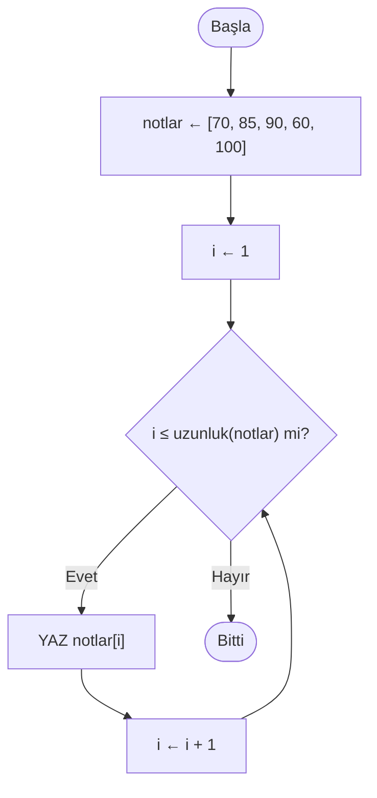

import Callout from '../../components/Callout.astro';
import Steps from '../../components/Steps.astro';

[Önceki yazıda](/blog/donguler) döngüleri öğrendik: aynı işi bir şart tuttuğu sürece
**tekrar tekrar** yapmak. En sonunda 1'den 10'a kadar olan sayıları toplamıştık — ama fark
ettin mi, o sayılar hep **sırayla üretiliyordu** (`sayı ← sayı + 1`). Ortada saklanan bir
sayı yığını yoktu; her turda bir sonrakini hesaplıyorduk. Peki ya elimizde önceden verilmiş,
**belli** değerler varsa? Diyelim ki senin beş sınav notun: 70, 85, 90, 60, 100. Bunlar bir
kalıp değil — sadece bir avuç değer. Bilgisayara bunları nasıl veririz?

[Değişkenler yazısından](/blog/degiskenler) bir yol biliyoruz: her notu ayrı bir kutuya
koyarız. `not1 ← 70`, `not2 ← 85`, `not3 ← 90`… Beş not için beş değişken, olur. Peki ya
**elli** not? Elli ayrı isim mi uyduracaksın? Üstelik hepsini toplamak istesen, döngü de
işe yaramaz — çünkü her kutunun **farklı bir adı** var, döngünün gezeceği bir sıra yok. İşte
tam burada tıkanırız. Bu yazının konusu, bu tıkanıklığı açan fikir: **birçok değeri tek bir
isim altında, sıralı biçimde saklamak.** Buna **liste** diyoruz.

<Callout type="note" title="Bu seride neredeyiz?">
Bu, **Algoritmalar** serisinin yedinci yazısı. [Algoritmayı tanıdık](/blog/algoritma-nedir),
[akış şemasıyla](/blog/akis-semalari) çizdik, [sözde kodla](/blog/sozde-kod) yazdık,
[değişkenlerle](/blog/degiskenler) tek bir bilgiyi sakladık, [koşullarla](/blog/kosullar)
karar verdik ve [döngülerle](/blog/donguler) tekrar etmeyi öğrendik. Liste, son iki parçayı
birbirine kenetliyor: bir yığın veriyi **tek isimde** tutar, döngü de onu baştan sona
**gezer.** Bu ikili — liste ve döngü — gerçek programların belkemiğidir; bu yüzden bu yazı
serinin en uzunu. Ama merak etme: hâlâ tek satır gerçek kod yok, sadece kalem, kâğıt ve düşünce.
</Callout>

## Neden listeye ihtiyacımız var?

Az önceki soruna geri dönelim: beş sınav notunun ortalamasını bulmak istiyorsun. Ayrı
değişkenlerle şöyle görünür:

```text title="Listesiz — her not ayrı kutuda" showLineNumbers=false
not1 ← 70
not2 ← 85
not3 ← 90
not4 ← 60
not5 ← 100
ortalama ← (not1 + not2 + not3 + not4 + not5) / 5
YAZ ortalama
```

Beş not için katlanılır. Ama iki sıkıntı hemen göze çarpıyor. Birincisi: **ölçeklenmiyor.**
Elli not olsa, elli satır atama ve upuzun bir toplama yazman gerekir. İkincisi — ve daha
önemlisi: **döngü kuramıyorsun.** [Döngüler](/blog/donguler) tam da "aynı işi tekrarla" demek
içindi, ama burada tekrarlanacak bir kalıp yok; `not1`, `not2`, `not3` birbirinden bağımsız
isimler. Döngünün üzerinde yürüyeceği bir **sıra** yok.

Oysa günlük hayatta bu tür "aynı türden çok şeyi" hep tek bir başlık altında toplarız:

- **Alışveriş listesi:** süt, ekmek, yumurta, peynir… Hepsi tek bir kâğıtta, alt alta.
- **Sınıf yoklaması:** otuz öğrenci adı, bir defterde sırayla.
- **Çalma listesi:** yüzlerce şarkı, tek bir isim altında, 1. sıra, 2. sıra diye.

Hiçbirinde her şeye ayrı bir isim vermeyiz; tek bir **liste** yapar, içindekilere **sırasıyla**
bakarız. Bilgisayarda listenin yaptığı iş tam olarak budur.

## Liste nedir?

Bir listeyi, **yan yana dizilmiş bir sıra kutu** gibi düşün — ve bütün bu sıra, tek bir isim
taşır. [Değişkenler yazısında](/blog/degiskenler) bir değişkeni "üstünde etiket olan tek bir
kutu" olarak hayal etmiştik; liste, o kutulardan **bir dizisidir.** Beş notumuzu bir listeye
koyalım:

```text title="Beş notu tek listede topla" showLineNumbers=false
notlar ← [70, 85, 90, 60, 100]
```

Bu satır tanıdık: sağdaki değeri sol taraftaki isme koyan aynı **atama** oku (`←`). Tek fark,
bu kez kutuya tek bir sayı değil, köşeli parantez içinde **bir sıra sayı** koyuyoruz. Artık
`notlar` adında tek bir ismimiz var ve içinde beş değer, belli bir **sırayla** duruyor. Bu
sırayı bir tabloyla görelim:

| Konum (sıra no) | 1 | 2 | 3 | 4 | 5 |
| :-------------- | :-: | :-: | :-: | :-: | :-: |
| Değer | 70 | 85 | 90 | 60 | 100 |

Üstteki satır her kutunun **konumu** (sıra numarası), alttaki satır o kutudaki **değer.**
İkisini birbirine karıştırmamak, bu yazının en önemli noktası — birazdan tekrar tekrar
döneceğiz buna. Bir liste sadece sayı tutmak zorunda da değil; [değişkenlerdeki](/blog/degiskenler)
gibi metin de tutabilir:

```text title="Metinlerden oluşan bir liste" showLineNumbers=false
alışveriş ← ["süt", "ekmek", "yumurta"]
```

Kural aynı: tek isim (`alışveriş`), içinde sıralı değerler. İster sayı ister metin olsun,
liste "aynı türden birçok şeyi tek çatı altında, sırayla tut" demektir.

## Listeler neden bu kadar önemli?

Ne olduğunu artık biliyorsun; şimdi bir adım geri çekilip **neden** bu kadar önemli olduğunu
görelim. Çünkü liste, kenarda kalmış küçük bir konu değil — kullandığın hemen her yazılımın
altında sessizce çalışan **temel taşıdır.** Bir düşün:

<Callout type="tip" title="Aslında her yerde liste var">
- **Bir arama motorunda** aldığın sonuçlar bir listedir — sırayla dizilmiş bağlantılar.
- **Telefonundaki** kişiler, gelen mesajlar, bildirimler, galerideki fotoğraflar: hepsi liste.
- **Bir müzik uygulamasında** çalma listesi; **bir oyunda** envanterin ve skor tablosu; **bir
  alışveriş sitesinde** sepetindeki ürünler — hepsi liste.
- **Bir fotoğraf** aslında yan yana dizilmiş minik renk noktacıklarının (piksel) listesidir.
- **Bir yazı** (bu cümle bile) aslında harflerin bir listesidir — yazının sonunda buna geleceğiz.
- **Bir veritabanında** her kayıt (bir kullanıcı, bir sipariş) bir liste gibi sıralı alanlardan oluşur.
</Callout>

Gördüğün gibi, gerçek programların yaptığı işin büyük kısmı "**aynı türden birçok şeyi**"
tutmak, gezmek, süzmek ve değiştirmektir — ve bunların hepsi listedir. İşte bu yüzden
[önceki yazıdaki](/blog/donguler) **döngü** ile bu yazıdaki **liste,** bir araya geldiğinde
programlamanın en çok kullanılan ikilisini oluşturur: liste veriyi tutar, döngü onu işler.
Bu ikiliyi kavradığında, gerçek yazılımların nasıl çalıştığının yarısını çözmüş olursun.

## Bir elemana nasıl ulaşırız? Konum (index)

Listeyi kurduk; peki içindeki tek bir değere nasıl ulaşırız? İşte listenin sihri burada:
her kutunun bir **konumu** (sıra numarası) var ve o numarayı söyleyerek istediğin kutuya
doğrudan uzanırsın. Bunu **köşeli parantezle** yazarız:

```text title="Konumla elemana ulaşmak" showLineNumbers=false
notlar ← [70, 85, 90, 60, 100]
YAZ notlar[1]      → 70   (birinci not)
YAZ notlar[3]      → 90   (üçüncü not)
YAZ notlar[5]      → 100  (beşinci, yani son not)
```

`notlar[3]` şöyle okunur: "notlar listesinin **3. sırasındaki** değer." Parantez içindeki sayı
**konumdur,** cevap ise o konumdaki **değerdir.** Bu ikisi bambaşka şeyler:

<Callout type="important" title="Konum, değerin kendisi değildir">
`notlar[3]` ifadesindeki `3` bir **adres**tir — "üçüncü kutu" demektir. Cevabı olan `90` ise
o kutunun **içindeki değer.** Yani `notlar[3]`, "3" değil, "üçüncü kutuda ne varsa o" (90)
demektir. Bir posta kutusu gibi düşün: kutunun numarası (3) ile içindeki mektup (90) aynı
şey değildir. Bu ayrımı kaçıran, listelerle çalışırken sürekli takılır.
</Callout>

Konumun asıl gücü şurada ortaya çıkar: parantezin içine sabit bir sayı yerine bir **değişken**
koyabilirsin. `notlar[i]` dersen, `i` neyse o konumdaki elemanı verir — `i` 1 iken 70, `i` 4
iken 60. Aklına bir şey geldi mi? `i`'yi bir döngüyle 1, 2, 3… diye artırırsak, tek satırla
**bütün listeyi** gezebiliriz. Birazdan tam da bunu yapacağız. Ama önce, yeni başlayanların
başına bela olan o meşhur ayrıntıyı konuşmalıyız.

<Callout type="caution" title="Gerçek kodda saymaya 0'dan başlanır">
Biz kâğıtta, insan sezgisiyle **1'den** sayıyoruz: birinci eleman `notlar[1]`. Ama gerçek
kodda neredeyse **bütün diller 0'dan** başlar: ilk eleman `notlar[0]`, ikincisi `notlar[1]`,
sonuncusu ise `notlar[4]` olur. Kulağa garip geliyor, ama bir mantığı var: konum aslında
"listenin başından kaç adım uzakta" demektir — ilk eleman başlangıçtan **0 adım** uzaktadır.
Bu "sıfırdan sayma" meselesi, yeni başlayanların bir numaralı tuzağıdır; [döngülerdeki](/blog/donguler)
"sınırı bir kaydırmak" hatasının tam da kardeşidir. Biz seri boyunca sezgiye yakın kalmak için
**1'den** sayacağız; ama gerçek bir dile geçtiğinde ilk kontrol edeceğin şey bu olsun:
**bu dil 0'dan mı, 1'den mi sayıyor?**
</Callout>

<Callout type="tip" title="Son elemana ulaşmak">
Bir listenin son elemanına ulaşmak için elle "5" yazma — çünkü liste büyüyüp küçülebilir. Bunun
yerine hep uzunluğu kullan: son eleman daima `notlar[uzunluk(notlar)]`'dır (birazdan `uzunluk`
yardımcısıyla tanışacağız). Böylece listeye eleman eklesen bile "son" hep doğru yeri gösterir.
Küçük bir bonus: gerçek kodda bazı diller bunun için `notlar[-1]` ("sondan birinci") gibi şık
bir kısayol sunar — ama fikir aynıdır: "son kutuya git."
</Callout>

## Listeyi döngüyle gezmek

Şimdi bu yazının kalbindeki fikre geldik: liste ile döngü el ele. Bir listenin bütün
elemanlarına baştan sona tek tek bakmaya, listeyi **gezmek** (dolaşmak) diyoruz. Kalıp şu:
bir sayaç 1'den başlar, listenin uzunluğuna kadar ilerler ve her turda `liste[sayaç]` ile
o sıradaki elemana uzanır.

Bir listenin kaç elemanı olduğunu soran küçük bir yardımcıya ihtiyacımız var; ona
`uzunluk(...)` diyeceğiz. `uzunluk(notlar)`, beş elemanlı listemiz için **5** verir. Şimdi
bütün notları ekrana yazdıralım — [döngüler yazısındaki](/blog/donguler) sayaçlı döngünün ta
kendisi, sadece sayaç artık bir konuma dönüşüyor:

```text title="Bütün notları yazdır — listeyi gezmek" showLineNumbers=false
notlar ← [70, 85, 90, 60, 100]
i ← 1
ZAMAN i ≤ uzunluk(notlar) DOĞRU İKEN
    YAZ notlar[i]
    i ← i + 1
DÖNGÜ SONU
```

Üç parçayı [döngülerden](/blog/donguler) tanıyorsun: **başlangıç** (`i ← 1`), **koşul**
(`i ≤ uzunluk(notlar)`) ve **ilerletme** (`i ← i + 1`). Tek yenilik, döngünün gövdesindeki
`notlar[i]` — yani "şu an kaçıncı turdaysak, o sıradaki not." Aynı fikri akış şemasıyla da
görelim; [önceki yazıdaki](/blog/donguler) döngü şemasının neredeyse aynısı, sadece kutuların
içi değişti:



O **geriye dönen ok** (F'den D'ye) yine döngünün kalbi. Şimdi döngüyü kâğıtta yürütelim —
[değişkenler](/blog/degiskenler) ve [döngüler](/blog/donguler) yazılarından tanıdığın
**izleme tablosu** ile:

| Tur | `i` (turun başı) | `i ≤ 5` doğru mu? | `notlar[i]` | Ekrana yazılan | `i` (turun sonu) |
| :-: | :--------------: | :---------------: | :---------: | :------------: | :--------------: |
| 1 | 1 | doğru | `notlar[1]` = 70 | 70 | 2 |
| 2 | 2 | doğru | `notlar[2]` = 85 | 85 | 3 |
| 3 | 3 | doğru | `notlar[3]` = 90 | 90 | 4 |
| 4 | 4 | doğru | `notlar[4]` = 60 | 60 | 5 |
| 5 | 5 | doğru | `notlar[5]` = 100 | 100 | 6 |
| 6 | 6 | **yanlış** | — | — | (döngü biter) |

`i` 6 olunca koşul yanlış çıkıyor ve döngü tam listenin sonunda, kibarca duruyor. Dikkat et:
sayaç `i` hem **turları** sayıyor hem de **konumu** gösteriyor — listeyi gezerken bu ikisi bir
araya geliyor. İşte döngü ile listenin neden bu kadar iyi anlaştığının sebebi bu.

## Listeyle biriktirmek: toplam ve ortalama

Listeyi gezmeyi öğrendiysen, artık onunla gerçek bir iş yapabiliriz. [Döngüler yazısındaki](/blog/donguler)
**biriktirme** kalıbını hatırla: döngüden önce bir biriktirici kurar, her turda ona ekler,
sonunda tek bir sonuç alırdık. Şimdi tam olarak aynı kalıbı listeye uyguluyoruz — beş notun
ortalamasını bulalım:

```text title="Not ortalaması — gezmek + biriktirmek" showLineNumbers=false
notlar ← [70, 85, 90, 60, 100]
toplam ← 0
i ← 1
ZAMAN i ≤ uzunluk(notlar) DOĞRU İKEN
    toplam ← toplam + notlar[i]
    i ← i + 1
DÖNGÜ SONU
ortalama ← toplam / uzunluk(notlar)
YAZ ortalama
```

Burada iki değişken var, tıpkı [döngülerdeki](/blog/donguler) gibi rolleri ayrı: `i` konumu
ilerleten **sayaç,** `toplam` ise sonucu biriken **biriktirici.** Her turda `toplam`, o
sıradaki nota göre büyüyor: 0 → 70 → 155 → 245 → 305 → 405. Döngü bitince `toplam` 405 olur;
onu eleman sayısına (5) bölünce **ortalama 81** çıkar.

<Callout type="important" title="Biriktiriciyi döngünün DIŞINDA başlat">
[Döngüler yazısındaki](/blog/donguler) o altın kural burada da geçerli: `toplam ← 0` satırı
döngünün **dışında,** ondan önce durmalı. İçeri koyarsan her turda sıfırlanır ve hiçbir şey
birikmez. Ayrıca ortalama için böldüğümüz sayının (`uzunluk(notlar)`) elle "5" yazmak yerine
`uzunluk(...)` olması önemli: yarın listeye bir not daha eklersen, kod **kendiliğinden** doğru
sayıya bölmeye devam eder. Sabit sayı yerine listenin uzunluğuna güven.
</Callout>

## En yükseği ve en düşüğü bulmak

[Döngüler yazısında](/blog/donguler) "toplama, sayma, en büyüğü bulma… hepsi aynı biriktirme
kalıbının çeşitleridir" demiştik. Şimdi bir liste elimizde olduğuna göre, o "en büyüğü bulma"yı
gerçekten yapabiliriz: notların **en yükseğini** bulalım.

Fikir basit ve çok insani: elinde bir kâğıt tut, üstüne şimdilik ilk notu yaz. Sonra listeyi
gezerken, gördüğün her not elindekinden **büyükse** kâğıdı güncelle. Sona geldiğinde kâğıtta
en yüksek not kalır:

```text title="En yüksek notu bulmak" showLineNumbers=false
notlar ← [70, 85, 90, 60, 100]
enYuksek ← notlar[1]
i ← 2
ZAMAN i ≤ uzunluk(notlar) DOĞRU İKEN
    EĞER notlar[i] > enYuksek İSE
        enYuksek ← notlar[i]
    BİTİREĞER
    i ← i + 1
DÖNGÜ SONU
YAZ enYuksek
```

Dikkat ettin mi, bu örnekte üç yapı da bir arada çalışıyor: listeyi bir **döngüyle** geziyoruz,
her turda bir **koşulla** ([koşullar](/blog/kosullar)) karşılaştırma yapıyoruz ve sonucu bir
**biriktiriciye** yazıyoruz. Serinin bütün parçaları — değişken, koşul, döngü, liste — burada
tek bir küçük programda buluşuyor. Kâğıtta yürüt: `enYuksek` sırayla 70 → 85 → 90 → 90 → 100
olur; 60'a rastladığında değişmez (çünkü 60, 90'dan büyük değil), sonunda **100**'de durur.

<Callout type="tip" title="Neden i, 2'den başlıyor? Ya en düşük?">
İlk notu daha en baştan `enYuksek`e koyduğumuz için (`enYuksek ← notlar[1]`), onu tekrar
karşılaştırmaya gerek yok — bu yüzden döngü ikinci elemandan (`i ← 2`) başlıyor. `i ← 1`
yazsaydın da yanlış olmazdı, sadece ilk turda notu kendisiyle karşılaştıran gereksiz bir
adım olurdu. Aynı kalıpla `>` yerine `<` yazarsan, bu kez **en düşük** notu bulursun — hatta
iki karşılaştırmayı aynı döngüye koyarak ikisini birden tek gezişte bulabilirsin (yazının
sonundaki mini projede tam olarak bunu yapacağız).
</Callout>

## Listede aramak: bir şey var mı, nerede?

Sık ihtiyaç duyulan bir başka iş: bir değerin listede **olup olmadığını** bulmak. Yoklamada
bir isim var mı? Sepette şu ürün var mı? Bunun için de listeyi gezip her elemanı aradığımızla
karşılaştırırız. Sonucu tutmak için bir **evet/hayır bayrağı** kullanırız — [değişkenler
yazısındaki](/blog/degiskenler) `doğru`/`yanlış` (boolean) değerlerini hatırla:

```text title="Bir isim listede var mı?" showLineNumbers=false
isimler ← ["Ada", "Ali", "Zeynep", "Can"]
aranan  ← "Zeynep"
bulundu ← yanlış
i ← 1
ZAMAN i ≤ uzunluk(isimler) DOĞRU İKEN
    EĞER isimler[i] = aranan İSE
        bulundu ← doğru
    BİTİREĞER
    i ← i + 1
DÖNGÜ SONU
YAZ bulundu
```

Mantık şu: bayrağı en baştan `yanlış` kabul ederiz ("daha bulamadık"). Listeyi gezerken
aradığımıza rastlarsak bayrağı `doğru`ya çeviririz. Döngü bitince bayrak, o değerin listede
olup olmadığını söyler. **Sadece var mı** değil, **kaçıncı sırada** olduğunu da öğrenmek
istersen, bayrağın yanına bir de konum yaz: `EĞER` bloğunun içine `konum ← i` ekle — döngü
bitince `konum`, aradığın elemanın sırasını tutar.

<Callout type="note" title="Tek tek bakmak: en temel arama">
Bu yöntem — listeyi baştan sona **tek tek** tarayıp aradığını bulmak — aramanın en temel
hâlidir; günlük hayatta bir defterdeki ismi parmağınla satır satır ararken yaptığının aynısı.
Milyonlarca elemanlı devasa listelerde bunu çok daha hızlı yapan akıllı yöntemler vardır, ama
onlar ileri bir konu; şimdilik bilmen gereken tek şey, "gez ve karşılaştır" kalıbının bir
listede istediğini bulmaya yettiği. Küçük bir ipucu: aradığını bulur bulmaz döngüyü
[`DUR`](/blog/sozde-kod) ile erkenden kesebilirsin — kalan elemanlara bakmaya gerek kalmaz.
</Callout>

## Listeyi değiştirmek: ekle, düzelt, sil

Şimdiye kadar listelerimiz kurulduğu gibi kaldı. Ama gerçek listeler yaşar: alışveriş
listesine yeni bir şey eklersin, bir notu düzeltirsin, sepetten bir ürünü çıkarırsın. Üç
temel iş var; bunlara bir listenin "günlük hayatı" diyebiliriz.

**Bir elemanı düzeltmek** kolay — konumu seçip ona yeni bir değer atarsın. Bu, [değişkenlerdeki](/blog/degiskenler)
atamanın aynısı, sadece hedef artık listenin bir kutusu:

```text title="Bir elemanı düzeltmek" showLineNumbers=false
notlar ← [70, 85, 90, 60, 100]
notlar[4] ← 75          (dördüncü not artık 60 değil, 75)
YAZ notlar[4]           → 75
```

**Listenin sonuna eleman eklemek** için `EKLE` diyeceğiz: listeye yeni bir değeri sona
iliştirir, liste bir kutu **uzar:**

```text title="Sona eleman eklemek" showLineNumbers=false
alışveriş ← ["süt", "ekmek", "yumurta"]
alışveriş'e "peynir" EKLE
YAZ uzunluk(alışveriş)   → 4   (liste artık dört elemanlı)
```

**Bir elemanı silmek** için `ÇIKAR` diyeceğiz: değeri listeden çıkarır, liste bir kutu
**kısalır:**

```text title="Eleman silmek" showLineNumbers=false
alışveriş ← ["süt", "ekmek", "yumurta", "peynir"]
alışveriş'ten "ekmek" ÇIKAR
YAZ uzunluk(alışveriş)   → 3   ("ekmek" gitti; liste: süt, yumurta, peynir)
```

Listenin **uzunluğunun değişebildiğine** dikkat et — bu, listeyi tek bir değişkenden ayıran
önemli bir özellik. Bir çalma listesine şarkı eklemek, bir yoklamadan öğrenci çıkarmak, bir
notu düzeltmek… hepsi bu üç işten biridir.

<Callout type="caution" title="Silince konumlar kayar">
Silmenin sinsi bir yan etkisi vardır: bir eleman çıkınca, arkasındaki bütün elemanlar bir
konum **öne kayar.** Yukarıdaki örnekte "ekmek" (2. sıra) silinince, "yumurta" 3. sıradan 2.
sıraya, "peynir" 4'ten 3'e kayar. Bu yüzden bir listeyi döngüyle gezerken aynı anda ondan
eleman silmek, yeni başlayanların kafasını en çok karıştıran işlerden biridir — sildiğin an
konumlar oynar ve sayacın şaşar. Kuralımız: **gezerken silme;** önce ne sileceğine karar ver,
sonra sil, ya da temizlenmiş elemanları yeni bir listeye topla (bir sonraki bölümde tam bunu
yapacağız).
</Callout>

## Boştan başlayıp liste kurmak

Şu ana kadar listelerimiz hazır değerlerle doğdu. Ama çoğu zaman liste **boş başlar** ve
program çalışırken tur tur dolar — tıpkı boş bir alışveriş sepetini gezerken doldurman gibi.
Boş bir liste `[]` ile kurulur (içinde hiç kutu yok, `uzunluk` 0'dır), sonra döngü içinde
`EKLE` ile büyür. Bu, gerçek yazılımlarda **en sık kullanılan** kalıplardan biridir: bir sürü
şeyi süzüp yalnızca işine yarayanları biriktirmek.

Bir örnek yapalım: 1'den 20'ye kadar olan sayılardan yalnızca **çift** olanları bir listede
toplayalım. [Koşullar yazısındaki](/blog/kosullar) `MOD` ile çift olup olmadığını anlıyoruz
(`sayı MOD 2 = 0`), [döngüyle](/blog/donguler) 1'den 20'ye sayıyoruz ve uygun olanları boş
listeye ekliyoruz:

```text title="Çift sayıları bir listede topla — boştan kurmak" showLineNumbers=false
çiftler ← []
sayı ← 1
ZAMAN sayı ≤ 20 DOĞRU İKEN
    EĞER sayı MOD 2 = 0 İSE
        çiftler'e sayı EKLE
    BİTİREĞER
    sayı ← sayı + 1
DÖNGÜ SONU
YAZ çiftler        → [2, 4, 6, 8, 10, 12, 14, 16, 18, 20]
```

Bu, [sözde kod](/blog/sozde-kod) ve [döngüler](/blog/donguler) yazılarındaki "1–10 çift
sayıları" örneğinin bir üst sürümü: orada çiftleri **ekrana yazıyorduk,** burada bir listeye
**topluyoruz** — böylece sonradan onları sayabilir, toplayabilir, tekrar gezebiliriz.

<Callout type="important" title="Biriktirici bu kez bir liste">
Fikir yine tanıdık **biriktirme:** döngüden önce boş bir kap hazırla, her turda ona uygun olanı
ekle. Tek fark, biriktiricinin bu kez bir sayı (`toplam ← 0`) değil, bir **liste** (`çiftler ←
[]`) olması. Boş listeyi de tıpkı `toplam`'ı sıfırdan başlattığın gibi, döngünün **dışında,**
bir kez kur. "Bir sürü şeyi gez, süz, işine yarayanı yeni bir listeye biriktir" — bu kalıbı bir
kez oturttuğunda, gerçek programların yaptığı işlerin çoğunu tanıdık bulacaksın.
</Callout>

## İki liste yan yana: paralel listeler

Çoğu zaman tek bir bilgi değil, birbirine **bağlı** bilgiler tutmak isteriz: her öğrencinin
hem adı hem notu var. Basit bir yol, iki ayrı liste tutup **aynı konumu** aynı öğrenciye
denk getirmektir. Buna **paralel listeler** denir: `isimler[i]` ile `notlar[i]`, aynı `i`
için aynı kişiyi anlatır.

```text title="İsim ve not — paralel listeler" showLineNumbers=false
isimler ← ["Ada", "Can", "Zeynep"]
notlar  ← [90, 70, 85]
i ← 1
ZAMAN i ≤ uzunluk(isimler) DOĞRU İKEN
    YAZ isimler[i] + ": " + notlar[i]
    i ← i + 1
DÖNGÜ SONU
```

Burada `+` iki metni birbirine ekliyor ([değişkenler yazısındaki](/blog/degiskenler) metin
birleştirme). Çıktı sırayla `Ada: 90`, `Can: 70`, `Zeynep: 85` olur. Tek bir `i` ile iki
listeyi **birlikte** geziyoruz; çünkü onları aynı sırayla dizdik.

<Callout type="caution" title="Hizayı bozma">
Paralel listelerin tek kuralı: **hizaları hep aynı kalmalı.** `isimler`e yeni bir öğrenci
eklersen, `notlar`a da onun notunu eklemeyi unutma — yoksa listeler kayar ve `isimler[3]`
başka birinin notuyla eşleşir, sessiz sedasız yanlış sonuç verirsin. Bu kırılganlık yüzünden,
gerçek kodda birbirine bağlı bilgileri bir arada tutmak için ileride **sözlük/nesne** gibi
daha güvenli yapılar öğrenilir. Ama altta yatan fikir hep aynıdır: "aynı şeyin farklı
parçalarını konumla eşleştir."
</Callout>

## Liste içinde liste: ızgaralar ve tablolar

Şimdiye kadarki listelerimiz tek sıraydı — bir satır kutu. Ama dünya çoğu zaman **iki
boyutludur:** satranç tahtası, tombala kartı, Excel tablosu, bir oyunun haritası, sinemadaki
koltuk planı… Hepsi **satır ve sütun.** Bunu temsil etmenin yolu şaşırtıcı derecede basit:
elemanları yine **liste** olan bir liste. Yani **liste içinde liste.**

```text title="İki boyutlu liste — bir ızgara" showLineNumbers=false
izgara ← [[1, 2, 3],
          [4, 5, 6]]
```

`izgara`'nın iki elemanı var ve her biri bir **satır** (kendisi bir liste): `izgara[1]`,
`[1, 2, 3]` yani birinci satırdır. Tek bir hücreye ulaşmak için **iki** konum gerekir: önce
satır, sonra sütun. `izgara[1][2]`, "birinci satırın ikinci elemanı" yani **2**'dir;
`izgara[2][3]` ise **6**. Bir tabloyla bakalım:

| | sütun 1 | sütun 2 | sütun 3 |
| :-- | :-: | :-: | :-: |
| **satır 1** | 1 | 2 | 3 |
| **satır 2** | 4 | 5 | 6 |

İki boyutlu bir listeyi gezmek için de iki boyutlu bir gezinti gerekir: **iç içe döngü.**
[Döngüler yazısındaki](/blog/donguler) iç içe döngüyü hatırla — dış döngü her tur attığında iç
döngü baştan sona döner. İşte tam da o kalıp burada işe yarıyor: dış döngü **satırları,** iç
döngü o satırın **sütunlarını** dolaşır:

```text title="Bütün ızgarayı gezmek — iç içe döngü" showLineNumbers=false
satır ← 1
ZAMAN satır ≤ uzunluk(izgara) DOĞRU İKEN
    sütun ← 1
    ZAMAN sütun ≤ uzunluk(izgara[satır]) DOĞRU İKEN
        YAZ izgara[satır][sütun]
        sütun ← sütun + 1
    DÖNGÜ SONU
    satır ← satır + 1
DÖNGÜ SONU
```

Dikkat: dıştaki `uzunluk(izgara)` **kaç satır** olduğunu (2), içteki `uzunluk(izgara[satır])`
ise o satırda **kaç sütun** olduğunu (3) verir. Kâğıtta yürütünce sırayla 1, 2, 3, 4, 5, 6
yazılır — önce birinci satır baştan sona, sonra ikinci satır. [Döngüler yazısındaki](/blog/donguler)
çarpım tablosu örneğini hatırladın mı? İşte o iç içe döngü, aslında iki boyutlu bir liste
üzerinde yürümeye hazırlanmaktı.

## Metin de bir listedir: karakterler

Söz verdiğimiz o hoş bağlantıya geldik. [Değişkenler yazısında](/blog/degiskenler) metni
(`isim ← "Ada"`) bir değer türü olarak tanımıştık. Aslında bir metin, perde arkasında
**harflerin (karakterlerin) bir listesidir.** Yani liste hakkında öğrendiğin her şey —
konum, uzunluk, gezmek — doğrudan metne de uygulanır:

```text title="Bir metin, harflerin listesi gibidir" showLineNumbers=false
kelime ← "merhaba"
YAZ kelime[1]            → "m"   (birinci harf)
YAZ kelime[4]            → "h"   (dördüncü harf)
YAZ uzunluk(kelime)      → 7     (yedi harf)
```

Metni de bir listeyi gezdiğin gibi harf harf gezebilirsin. Örneğin bir kelimede belli bir
harfin kaç kez geçtiğini sayalım — [koşul](/blog/kosullar) ve [biriktirme](/blog/donguler)
bir arada:

```text title="Bir kelimede 'a' harfini say" showLineNumbers=false
kelime ← "kalabalık"
sayaç ← 0
i ← 1
ZAMAN i ≤ uzunluk(kelime) DOĞRU İKEN
    EĞER kelime[i] = "a" İSE
        sayaç ← sayaç + 1
    BİTİREĞER
    i ← i + 1
DÖNGÜ SONU
YAZ sayaç                → 3
```

<Callout type="note" title="Neden bu bağlantı önemli?">
"Metin = harf listesi" fikri, gerçek programlamada altın değerindedir: bir şifrenin yeterince
uzun olup olmadığını kontrol etmek, bir cümledeki kelimeleri saymak, bir e-postada `@` var mı
diye bakmak… hepsi bir metni harf harf gezmektir — yani liste gezmenin ta kendisi. Küçük bir
dürüstlük notu: bazı dillerde metinler, sıradan listelerden biraz farklı davranır (örneğin
bir harfini doğrudan değiştiremeyebilirsin). Ama **gezme, uzunluk ve konum** fikri her yerde
aynıdır; listeyi anladıysan metni de anladın demektir.
</Callout>

## Sık yapılan hatalar

<Callout type="caution" title="Bu tuzaklara dikkat">
- **Konum ile değeri karıştırmak:** `notlar[3]`'ün "3" olduğunu sanmak. O, üçüncü **kutudaki
  değerdir** (90). Konum bir adres, cevap ise o adresteki içerik.
- **Sınırın dışına çıkmak:** 5 elemanlı listede `notlar[6]` (ya da `notlar[0]`) istemek. O kutu
  yoktur; program hata verir. Döngü koşulunu hep `uzunluk(...)` ile sınırla.
- **0'dan mı 1'den mi?** Kâğıtta 1'den saydık, ama gerçek kod çoğunlukla 0'dan sayar. Bir dile
  geçtiğinde ilk kontrol edeceğin şey bu; karıştırırsan ya ilk ya da son elemanı kaçırırsın.
- **Uzunluğu elle yazmak:** `uzunluk(notlar)` yerine sabit `5` yazmak. Listeye bir eleman
  eklediğin an kod bozulur. Sayıya değil, listenin gerçek uzunluğuna güven.
- **Sayaç ile biriktiriciyi karıştırmak:** [Döngülerdeki](/blog/donguler) aynı tuzak. `i`
  konumu ilerletir, `toplam`/`enYuksek` sonucu biriktirir; ikisi ayrı işlerdir.
- **Gezerken silmek:** Bir listeyi döngüyle gezerken ondan eleman çıkarmak konumları kaydırır
  ve sayacı şaşırtır. Gezerken silme; süzülmüşleri yeni bir listeye topla.
- **Paralel listelerde hizayı bozmak:** Birine ekleyip ötekine eklememek. `isimler[i]` ile
  `notlar[i]` aynı kişiyi göstermeyi bıraktığı an, sessizce yanlış sonuç alırsın.
- **Satır-sütunu ters yazmak:** İki boyutlu listede `izgara[sütun][satır]` demek. Önce satır,
  sonra sütun — sırayı karıştırma.
- **Boş listeyi unutmak:** Ya liste hiç eleman içermiyorsa (`[]`)? `uzunluk` 0 olur, döngü hiç
  çalışmaz — ortalama alırken 0'a bölmeye çalışmak gibi durumları düşün.
</Callout>

<Callout type="note" title="Küçük bir tarih notu: neden 0'dan sayıyoruz?">
Bir listenin elemanlarını **numaralı kutular** gibi düşünme fikri, programlamanın en eski
fikirlerinden biri; ilk üst düzey dillerden **Fortran**'da (1957) bile programcılara "dizi"
(array) olarak sunulmuştu. Ama asıl hoş hikâye, o "0'dan mı 1'den mi?" tartışmasında saklı.
Hollandalı bilgisayar bilimci **Edsger Dijkstra** (1930–2002), 1982'de elle yazdığı kısacık
bir notta ("Numaralandırma neden sıfırdan başlamalı?") bunun tesadüf olmadığını anlatır: bir
konum aslında "listenin başından kaç adım uzakta" olduğunu gösterir, ilk eleman ise başlangıçtan
**sıfır adım** uzaktadır — yani doğal yeri `liste[0]`'dır. İnsan sezgisi 1'den saymak ister
(kâğıtta biz de öyle yaptık), ama makinenin mantığı 0'dan saymayı sever. Bunun bir de fiziksel
kökü var: bilgisayarın belleği, uçsuz bucaksız numaralı hücrelerden oluşur ve bir liste, bu
hücrelerden **art arda gelen** bir dizidir; konum da "baştan kaç hücre ötede" demektir. Bugün
bir dilde `liste[0]` yazıp ilk elemanı aldığında, aslında Dijkstra'nın kırk yıl önceki o küçük
notunun mantığını kullanıyorsun. [Bir önceki yazıdaki](/blog/donguler) döngüyü tarif eden Ada
Lovelace ile birlikte, bugün yazdığın her liste bu uzun hikâyenin bir parçası.
</Callout>

## Kendin dene

Kalem ve kâğıt yeter. Her egzersizde önce **sözde kodu** yaz (listeyi gezmeyi unutma: sayaç,
uzunluk koşulu, `liste[i]`), sonra bir **izleme tablosu** çizip birkaç turu elle çalıştır.

### Egzersiz 1 — Listeyi tersten yazdır (kolay)

> Elinde `sayılar ← [3, 8, 1, 9, 4]` listesi var. Elemanları **sondan başa** doğru ekrana
> yaz: 4, 9, 1, 8, 3.

<Callout type="note" title="İpucu">
Bu bir listeyi gezmek, ama bu kez **geriye doğru.** [Döngülerdeki](/blog/donguler) geri sayım
egzersizini hatırla: sayacı `i ← uzunluk(sayılar)` ile **son konumdan** başlat, koşulu `i ≥ 1`
yap ve her turda `i ← i - 1` ile bir azalt. Gövdede yine `YAZ sayılar[i]` var. İzleme tablosuyla
kontrol et: `i` sırayla 5, 4, 3, 2, 1 oluyor ve tam **1**'de durup 0'a inmiyor mu?
</Callout>

### Egzersiz 2 — Geçenleri say (orta)

> Bir sınıfın notları: `notlar ← [45, 70, 30, 88, 55, 90, 40]`. 50 ve üzeri alanlar geçti
> sayılıyor. Kaç kişinin geçtiğini bul ve yazdır.

<Callout type="note" title="İpucu">
Burada listeyi gezmek, **koşul** ve **sayma** bir arada. Döngüden önce bir sayaç kur:
`geçen ← 0`. Listeyi gezerken her turda `EĞER notlar[i] ≥ 50 İSE` içinde `geçen ← geçen + 1`
de. Bu bir biriktirici, o yüzden döngünün **dışında** başlat. Döngü bitince `geçen`i yaz —
kâğıtta yürütünce cevabın **4** çıktığını göreceksin.
</Callout>

### Egzersiz 3 — Sadece çiftleri topla (orta)

> `sayılar ← [7, 4, 11, 2, 9, 8, 5]` listesindeki yalnızca **çift** sayıları, sırasını
> koruyarak **yeni bir listeye** topla ve o yeni listeyi yazdır.

<Callout type="note" title="İpucu">
Bu, yazıdaki "boştan başlayıp liste kurmak" kalıbı. Döngüden **önce** boş bir liste hazırla:
`çiftler ← []`. Asıl listeyi gez; her turda `EĞER sayılar[i] MOD 2 = 0 İSE` içinde
`çiftler'e sayılar[i] EKLE` de. Döngü bitince `çiftler`i yaz. (Cevap: `[4, 2, 8]`.) Dikkat:
asıl listeyi **okuyor,** sonucu **başka bir listeye** biriktiriyorsun — gezdiğin listeye
dokunmuyorsun.
</Callout>

### Egzersiz 4 — En yüksek notu kim aldı? (paralel liste)

> İki paralel liste var: `isimler ← ["Ada", "Can", "Zeynep", "Ali"]` ve
> `notlar ← [72, 95, 88, 95]`. **En yüksek notu** ve o notu alan **öğrencinin adını** bul.

<Callout type="note" title="İpucu">
"En yükseği bulma" kalıbını kur, ama bu kez sadece notu değil, **hangi konumda** olduğunu da
sakla. İki biriktirici tut: `enYuksek ← notlar[1]` ve `enKonum ← 1`. Listeyi `i ← 2`'den gez;
`EĞER notlar[i] > enYuksek İSE` olduğunda **ikisini birden** güncelle (`enYuksek ← notlar[i]`
ve `enKonum ← i`). Döngü bitince adı `isimler[enKonum]` ile bulursun. (Cevap: 95, Can — eşit en
yüksekte ilk gelen kazanır.) Paralel listelerin gücünü gördün mü: bir listede bulduğun konumu,
öteki listede aynı kişiye ulaşmak için kullandın.
</Callout>

### Egzersiz 5 — Izgaranın toplamı (mini proje)

> İki boyutlu bir liste: `izgara ← [[5, 3, 8], [1, 9, 2], [7, 4, 6]]`. Izgaradaki **bütün
> sayıların toplamını** bul ve yazdır.

<Callout type="note" title="İpucu">
Bu bir iç içe döngü işi. Döngülerden **önce** `toplam ← 0` kur (biriktirici). Dış döngü
satırları gezsin (`satır ← 1`'den `uzunluk(izgara)`'ya), iç döngü o satırın sütunlarını
(`sütun ← 1`'den `uzunluk(izgara[satır])`'ya). İç döngünün gövdesinde
`toplam ← toplam + izgara[satır][sütun]` de. Her iki döngü de bitince `toplam`ı yaz. (Cevap:
45.) İç sayacı (`sütun ← 1`) her dış turda **yeniden** başlatmayı unutma — [döngüler
yazısındaki](/blog/donguler) o iç içe döngü kuralını hatırla.
</Callout>

## Özet

<Callout type="tip" title="Cebine koy">
- **Liste,** birçok değeri **tek bir isim** altında, sıralı biçimde saklamaktır; her değer
  için ayrı değişken açma derdini bitirir (`notlar ← [70, 85, 90]`). Yazılımın hemen her
  yerindedir — bu yüzden liste + döngü ikilisi programlamanın belkemiğidir.
- Her elemanın bir **konumu** (index) vardır ve ona köşeli parantezle ulaşırsın (`notlar[3]`).
  Konum bir adrestir, değerin kendisi değil.
- Kâğıtta **1'den** sayarız; ama gerçek kod neredeyse hep **0'dan** sayar — yeni başlayanların
  bir numaralı tuzağı budur.
- Bir listeyi **döngüyle gezersin:** sayaç 1'den `uzunluk(liste)`ye kadar ilerler, her turda
  `liste[i]` ile o elemana bakarsın. Döngü ile liste birlikte çalışır.
- Gezerken **biriktirebilir** (toplam, ortalama, sayma, en büyüğü/küçüğü bulma) ve **arayabilirsin**
  (bir şey var mı, kaçıncı sırada) — hepsi [döngülerdeki](/blog/donguler) kalıpların listeye hâli.
- Listeler yaşar: eleman **düzeltir** (`liste[i] ← ...`), sona **ekler** (`... EKLE`) veya
  **silersin** (`... ÇIKAR`); uzunluğu değişir. Silince konumların kaydığına dikkat et.
- Çoğu zaman liste **boş başlar** (`[]`) ve döngü içinde `EKLE` ile dolar — "gez, süz, yeni
  listeye biriktir" gerçek programların en sık kalıbıdır.
- **Paralel listeler** (aynı konum = aynı kişi) bağlı bilgileri, **iki boyutlu listeler**
  (liste içinde liste + iç içe döngü) ızgara/tablo düzenini tutar. Ve unutma: bir **metin** de
  aslında harflerin bir listesidir.
</Callout>
