import Callout from '../../components/Callout.astro';
import Steps from '../../components/Steps.astro';
import Figure from '../../components/Figure.astro';
import torvaldsImg from '../../assets/linus-torvalds.webp';
import stallmanImg from '../../assets/richard-stallman.webp';
import tuxImg from '../../assets/tux.png';
import bobYoungImg from '../../assets/bob-young.webp';
import redHatTowerImg from '../../assets/red-hat-tower.webp';

We are starting a new series. So far on this blog we have walked two roads. In the [Algorithms
series](/en/blog/what-is-an-algorithm) you worked out, with pen and paper, the logic of getting a computer to do
a job. In the [Java series](/en/blog/what-is-java) we started pouring that logic into a real language, and we
even went [inside the JVM](/en/blog/inside-the-jvm) to see how the engine turns. Now we go one floor further
down: to the ground your programs run on, the **operating system.** On the world's servers, the most common
form of that ground is **Linux,** and the best-known name for Linux in the business world is **Red Hat.**

In this first part we will not install anything and we will not type a single command. First, let's sit down
and answer a few questions. What exactly is Linux, and what does that thing they call the "kernel" actually do?
What is a "distribution", and why are there hundreds of them? How does a program get installed on Linux, and
what is this "package manager" everyone talks about? Is "Red Hat" a company, an operating system, or both?
Where did the red hat come from? Fedora, CentOS, RHEL, Rocky, Alma... what is this crowd of names? And the most
curious question of all: how does a company make billions of dollars from software anyone can download for
free? Remember how we wrote down brewing tea step by step in the very first Algorithms post? This time actually
brew some, we are going to sit here a while.

<Callout type="important" title="Short answer: what is Red Hat?">
**Red Hat** is an open source software company founded in 1993 and part of IBM today; **RHEL** (Red Hat
Enterprise Linux) is the Linux operating system it offers to organisations, supported for ten years. The word
**Linux** strictly means only the kernel of the operating system; "distributions" such as RHEL, Fedora and
Ubuntu build a usable system around that kernel by adding tools, a package manager and support. Red Hat doesn't
sell the software; it sells the subscription: tested updates, security patches and support. The rest, step by
step, is in this post.
</Callout>

<Callout type="note" title="Who is this series for?">
Someone who has never touched Linux. Maybe you use Windows or a Mac, maybe even the word "terminal" makes you
a little nervous. That's fine, we start from zero. You don't need to know programming; but if words like
variable or loop come up, have a look at the [Algorithms series](/en/blog/what-is-an-algorithm), and if Java or
the JVM gets mentioned, the [Java series](/en/blog/what-is-java). This series walks hand in hand with those two:
they explain "how a program thinks and gets written", this one explains "what ground that program runs on, and
how that ground is managed". If you want a goal for yourself: by the end of the series you will have seen every
topic on Red Hat's RHCSA certification exam. But the real goal isn't a certificate. It's being the person who
knows what they're doing when they sit down at a Linux machine.
</Callout>

<Callout type="tip" title="Diagrams look small?">
There are quite a few diagrams in this post. Click the **Enlarge** button at the top right of any diagram (or
the diagram itself) to open it full screen; zoom with the mouse wheel or two fingers and drag to pan. Esc closes
it.
</Callout>

## First, the ground: what does an operating system do?

In the [Java post](/en/blog/what-is-java) we talked about how "dumb" a computer really is, remember? On its own
it could only do tiny things: add, compare, move something from one place to another. What made it look smart
was doing those tiny things billions of times per second. Let's add one more piece to that picture.

Dozens of programs run on a computer at the same time: a browser, music, a text editor, an update check in the
background... All of them want the same processor, the same memory, the same disk, the same network connection.
Who gets the processor, and in what order? What happens if one program pokes into another program's memory?
When you press a key, which window does it go to? What if two programs try to write the same file on disk at
once?

The big manager program that answers all of these questions, sitting between the hardware and the programs, is
what we call the **operating system.** Think of the manager of an apartment building: the flats (programs)
don't share the water, electricity and lift (the hardware) among themselves directly; the manager sets the
rules. Who uses what, and when, and who is not allowed into whose flat, is all settled. Windows is an operating
system, macOS is an operating system, and so are Android and iOS on your phone. Linux is a member of this family
too... but as you'll see in a moment, the word "Linux" actually describes something a little narrower than that.

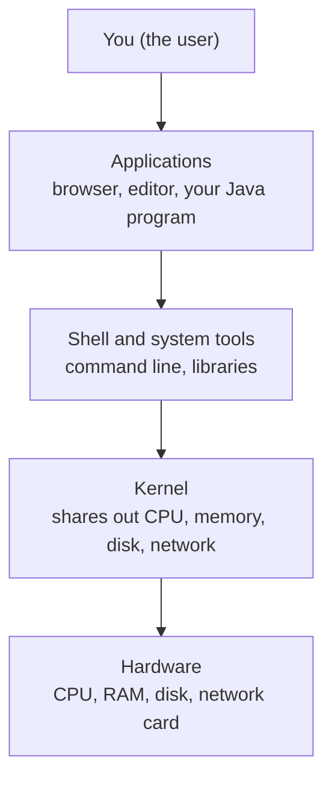

Read the diagram top to bottom. You are at the top, talking to applications. Applications never touch the
hardware directly; in between sit the shell, libraries and, most importantly, the **kernel.** The only layer
that truly talks to the hardware is the kernel at the bottom.

<Callout type="tip" title="Remember the side door from the JVM post">
Deep [inside the JVM](/en/blog/inside-the-jvm) there was a "side door": JNI, the Java program's door to the
operating system and the hardware. Opening a file, sending a packet over the network, drawing something on the
screen... the JVM can do none of these by itself; it asks the operating system for all of them. Throughout this
series we are on the other side of that door. When your Java program says "open a file", the thing that takes
the request, checks whether you're allowed, and actually goes to the disk is the kernel you're meeting in this
part.
</Callout>

## What exactly is this thing called "Linux"?

The short answer surprises most people: **Linux is not an operating system on its own; it is the kernel of one.**
Just one layer of the diagram above. No shell, no installer, no browser, not even a command to list your files.
The kernel is the engine that manages the hardware and offers programs services like "use the processor, take
some memory, write to the disk". That's it.

Think of a car. The engine is the heart of the car; without it the car doesn't move. But you can't go anywhere
with just an engine: you need a chassis, wheels, a steering wheel, seats, a dashboard. Linux is the engine. The
car that emerges when you put everything around it is called a **distribution,** and we'll give it a whole
section of its own shortly. For now, settle this in your mind: Red Hat Enterprise Linux is a distribution,
Ubuntu is a distribution, Fedora is a distribution. The same engine, the Linux kernel, runs inside all of them.

### What does the kernel actually do?

We said "it manages the hardware", but let's open that up a little, because nearly everything we do in the
later parts of this series will touch one of these five jobs.

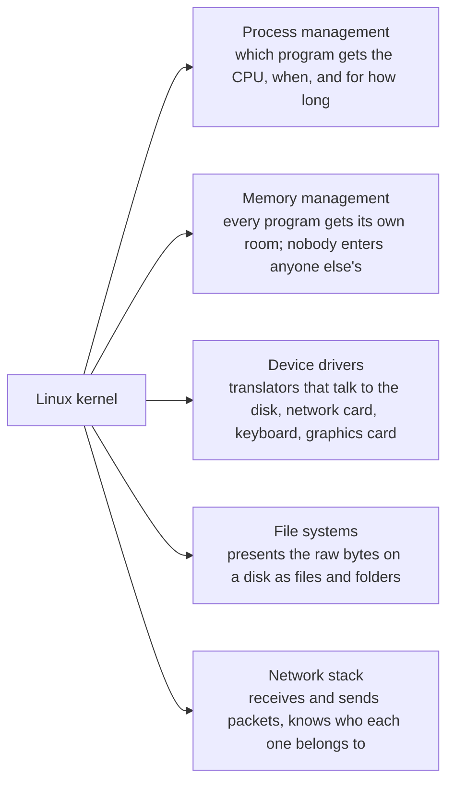

- **Process management.** Every running program is called a "process". A processor can only do one thing at a
  time (per core); the kernel rotates processes in and out of the processor in slices of milliseconds. It does
  this so fast that you think they're all running at once. The part that does this job is called the
  **scheduler.** In part 9 we'll list and stop processes with our own hands.
- **Memory management.** It gives every program a memory area that is "yours only" and stops a program from
  reaching into anyone else's. Remember those "boxes" in RAM from the [Java post](/en/blog/what-is-java)? The
  program doesn't know which physical chip they actually live on; the kernel does.
- **Device drivers.** There are thousands of different disks, network cards, keyboards and graphics cards, and
  each speaks its own language. A driver is the translator who knows that language. The secret of Linux running
  on nearly every piece of hardware in the world is the enormous driver collection that ships inside the kernel.
- **File systems.** A disk is really just a pile of bytes in numbered blocks. The layer that turns "report.txt
  inside the Documents folder" into blocks on the disk is the kernel. The subject of parts 4 and 11.
- **Network stack.** Every packet going to and from the internet is handled by the kernel: whose address it is,
  which program it should be delivered to, the kernel knows it all. We'll see it in part 10.

So what happens when a program wants something from the kernel? Picture a restaurant. The customer (program)
can't walk into the kitchen (hardware); they tell the waiter (kernel), the waiter goes to the kitchen and brings
the food. The formal name for a program telling the kernel "read this file" or "send a packet to this address"
is a **system call.**

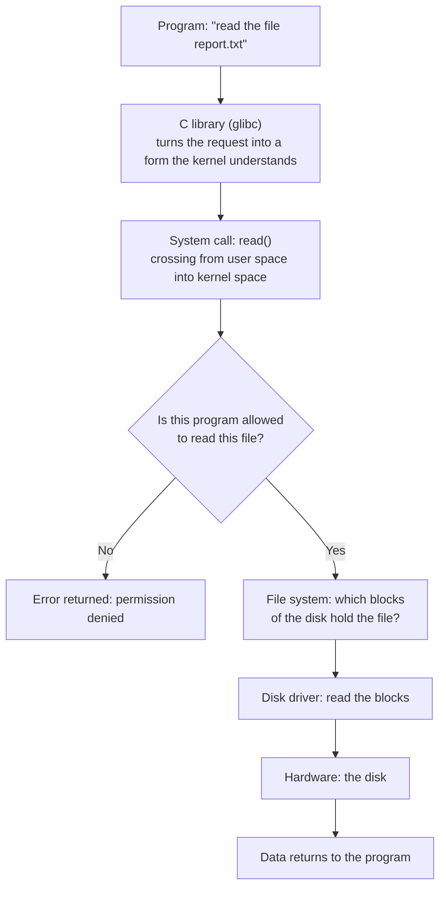

The distinction between "user space" and "kernel space" in the diagram matters. The kernel works in a closed-off
area, like the kitchen; programs sit out in the dining room. Whatever happens in the dining room (even a program
crashing), the kitchen stays standing. This separation is one of the reasons Linux servers can run for months
without a reboot. And notice that question, "is it allowed?": the kernel answers every request by looking at who
is asking. When you learn users and permissions in part 6, you'll see how central that question is.

<Callout type="note" title="For the curious: a few numbers about the kernel">
The Linux kernel today is over thirty million lines of code, and thousands of people from around the world
contribute to every release. Most of that code is device drivers; the actual "brain" is comparatively small.
The kernel has a **monolithic** design: drivers and file systems are not separate programs but parts of the
kernel; yet they can be loaded and unloaded as **modules** on demand (that's what happens when you plug in a
USB device). The kernel has its own version number (like 6.12), which is separate from the distribution version
you'll see shortly (like RHEL 10). Linus Torvalds has led the project since 1991 and still publishes every new
release himself.
</Callout>

### The story of the engine: Helsinki, 1991

The birth of Linux is one of the loveliest stories in software history. In 1991, **Linus Torvalds,** a
21-year-old student at the University of Helsinki, starts writing an operating system kernel to use on his own
computer. In August 1991 he posts this message to an internet discussion group (lightly abridged):

> "Hello everybody out there using minix. I'm doing a (free) operating system (just a hobby, won't be big and
> professional like gnu)..."

"Just a hobby." That hobby now runs the vast majority of the world's servers, **all** of the 500 fastest
supercomputers, the Android phone in your pocket, the modem in your home, your smart TV, and even the little
helicopter that flew on Mars. Torvalds first thought of calling the kernel "Freax"; the administrator of the
server he uploaded the files to named the folder "Linux", and the name stuck.

<div style="display:flex;flex-wrap:wrap;gap:1.25rem;justify-content:center;align-items:flex-end;margin:1.5rem 0;">
  <div style="flex:0 1 240px;max-width:240px;">
    <Figure src={torvaldsImg} alt="Linus Torvalds, LinuxCon Europe 2014" caption="Linus Torvalds, creator of the kernel and still its maintainer (2014). (Photo: Krd, crop: Von Sprat, CC BY-SA 4.0, Wikimedia Commons.)" />
  </div>
  <div style="flex:0 1 240px;max-width:240px;">
    <Figure src={stallmanImg} alt="Richard Stallman, 2014" caption="Richard Stallman, founder of the GNU project and the free software idea (2014). (Photo: Thesupermat, CC BY-SA 3.0, Wikimedia Commons.)" />
  </div>
</div>

<Callout type="note" title="History note: without GNU, Linux would have stayed a bare engine">
The **GNU** in Torvalds' message was a project started in 1983 by **Richard Stallman.** Its goal was to write a
complete Unix-like operating system that anyone could freely use and modify. By 1991 they had nearly
everything: a compiler (gcc), a shell (bash), file tools... The one missing piece was the kernel. Torvalds'
kernel dropped exactly into that gap. Most of the commands you type on a Linux distribution today, `ls`, `cp`,
`grep` and the rest, are actually products of the GNU project. That is why some people insist on calling the
system "GNU/Linux", and they have a point.

And what does "Unix-like" mean? **Unix** is the system Ken Thompson and Dennis Ritchie wrote at Bell Labs in
1969, the model for every modern operating system that followed. Linux doesn't use Unix's code, but it inherits
its ideas, its habits and its command culture. You'll feel this strongly when we get to the terminal part.
</Callout>

<Callout type="note" title="A small coincidence: two Ewings">
Linux's mascot, the plump penguin **Tux,** was drawn in 1996 by a graphic artist named **Larry Ewing.** The
founder of Red Hat, whom you're about to meet, is **Marc Ewing.** Same surname, no relation; just a nice
coincidence.
</Callout>

<div style="display:flex;justify-content:center;margin:1.5rem 0;">
  <div style="flex:0 1 180px;max-width:180px;">
    <Figure src={tuxImg} alt="Tux, the Linux penguin mascot" caption="Tux. (Drawing: Larry Ewing, Simon Budig and Garrett LeSage; lewing@isc.tamu.edu and The GIMP.)" />
  </div>
</div>

### A short timeline of Linux

You'll see Red Hat's own timeline shortly; first, the engine's own journey. Not to memorise, but to get a feel
for how long this has been going on.

| Year | Event |
| --- | --- |
| 1969 | Unix is born at Bell Labs (Ken Thompson and Dennis Ritchie) |
| 1983 | Richard Stallman announces the GNU project |
| 1987 | Andrew Tanenbaum writes Minix to teach students how operating systems work; Torvalds will be working on it in 1991 |
| 1991 | Torvalds posts his "just a hobby" message; Linux 0.01 is released |
| 1992 | Linux moves to the GPL licence: anyone can use, change and share it |
| 1993 | Debian and Slackware are founded; the oldest distributions still alive today |
| 1994 | Linux 1.0; the first release of Red Hat Linux |
| 1996 | The Tux mascot is drawn; Linux 2.0 enters multi-processor servers |
| 1998 | The term "open source" is coined; IBM and Oracle begin supporting Linux |
| 2003 | The SCO lawsuit begins (below, in the Red Hat story) |
| 2004 | The first release of Ubuntu |
| 2005 | Torvalds writes Git to manage kernel development |
| 2007 | Android is announced: the Linux kernel goes into your pocket |
| 2011 | Linux 3.0 marks the twentieth year |
| 2017 | All 500 of the world's fastest supercomputers run Linux |
| 2021 | NASA's Ingenuity helicopter flies on Mars running Linux |
| 2024 | The XZ backdoor (below); Linux 6.12 becomes the kernel of RHEL 10 |

## The distribution (distro): the car around the engine

Now let's come back to the car analogy and look inside the car. What does a Linux distribution put around the
kernel? Knowing this list means carrying a map of the rest of the series in your pocket, because each part will
open up one of these pieces.

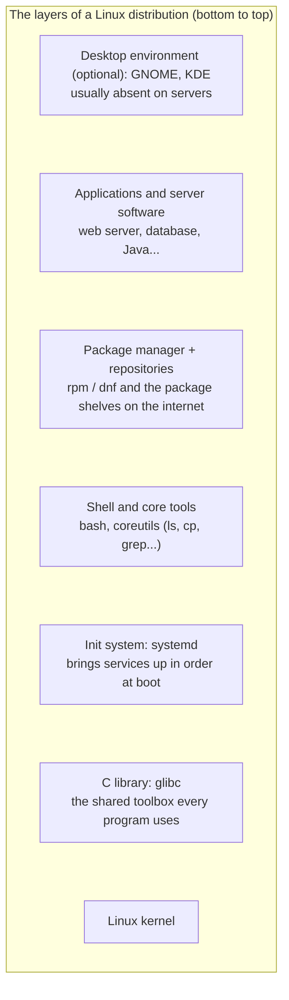

One by one, bottom to top:

- **Kernel.** The engine. You just met it.
- **C library (glibc).** The collection of ready-made functions nearly every program uses for common jobs like
  "open a file", "ask for memory", "write to the screen". In the system call diagram, the road to the waiter
  went through here. In the [Functions post](/en/blog/functions) we said "write it once, let everyone use it";
  glibc is that idea at operating-system scale.
- **Init system (systemd).** The first program to run after the kernel when the computer boots. Like the first
  person up in the morning who wakes everyone else in order: it starts the network, mounts the disk partitions,
  brings up the web server, opens the login screen. The subject of part 8.
- **Shell and core tools.** The shell (bash) is the program that takes the commands you type and runs them;
  coreutils is the collective name for hundreds of small tools like `ls`, `cp`, `mkdir`. We start in part 3.
- **Package manager and repositories.** The infrastructure for installing and removing programs; we'll talk
  about it at length shortly.
- **Applications and server software.** Everything you can install from the distribution's repositories: web
  server, database, editors, Java, Python...
- **Desktop environment.** Windows, menus, icons. GNOME is the default on RHEL. But note: on a server there is
  usually **no desktop;** everything is managed from the terminal. That's why we learn the terminal early.

On top of these, the distribution adds an **installer** (RHEL's is called Anaconda; we'll use it in part 2),
default **configuration** decisions (which security layer is on, which file system is used), **documentation**
and an **update stream.** So a distribution is more than the sum of its parts: it is a "manufacturer" that tests
that the parts fit together, vouches that they work as a whole, and keeps updating them for years.

### Why are distributions different from each other?

If hundreds of distributions use the same engine, where is the difference? The answer: in the decisions the
factory makes. These six headings explain nearly all of the difference between any two distributions.

| Decision | What does it mean? | Examples |
| --- | --- | --- |
| **Package format and manager** | What box do programs come in, and which tool installs them? | rpm/dnf (Red Hat family), deb/apt (Debian family), pacman (Arch) |
| **Release model** | Numbered releases, or updates that flow every day? | Point release: RHEL, Debian, Ubuntu. Rolling: Arch, openSUSE Tumbleweed |
| **Support length** | How many years does a release get updates? | RHEL 10 years, Ubuntu LTS 5 years, Fedora 13 months |
| **Philosophy** | Stability, novelty, simplicity or freedom? | RHEL stability, Fedora novelty, Debian strict free software, Arch "build it yourself" |
| **Who is behind it** | A company, a community, a foundation? | Red Hat (RHEL), Canonical (Ubuntu), community (Debian, Arch), foundation (Alma) |
| **Defaults** | Which desktop, which security layer, which file system? | GNOME, SELinux and XFS (RHEL); GNOME, AppArmor and ext4 (Ubuntu) |

Now you can see why learning one distribution makes the others feel familiar: none of the decisions in the table
changes the kernel, the shell, the logic of the file system, or the user and permission system. What changes is
packaging and a few defaults. Roughly ninety percent shared, ten percent "family accent".

### Families and forking

Most distributions fall into a few big families. The reason is open source's most powerful right: **forking.**
Because the code is open to everyone, you can take a distribution you don't like and go your own way. Ubuntu is
a fork that Canonical opened in 2004, taking Debian's code to build a distribution that is "easier to install
and releases more often". Linux Mint is a fork of Ubuntu. CentOS, Rocky and Alma are forks of RHEL.

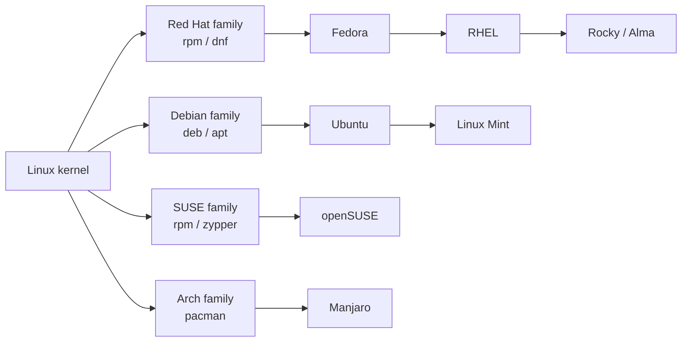

The most visible thing that separates the families is the first row of the table: the package format. The Red
Hat family uses **rpm** packages and the **dnf** tool; the Debian family uses **deb** packages and the **apt**
tool. Where you'd type `apt install` on Ubuntu, you type `dnf install` on RHEL, and the rest is largely the same.

### Release models: point release or rolling?

The second row of the table is the most confusing topic when choosing a distribution. There are two
approaches:

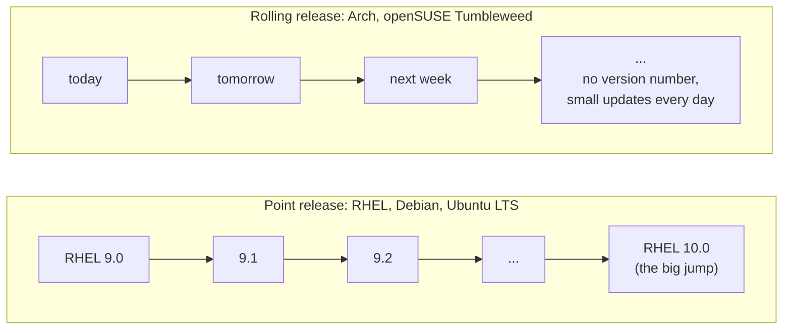

In the **point release** model the distribution ships numbered releases at set intervals; once a release is out,
the major versions of the programs inside it **do not change,** only bug and security fixes arrive. That is what
you want for a company's server: whatever works today should work the same way after tomorrow's update. In the
**rolling release** model there is no version number; the newest programs flow in every day. Delightful for a
curious desktop user, a nightmare for a bank's server.

RHEL is one of the strictest examples of the point release model and has turned it into a rhythm: a **major
release roughly every three years** (RHEL 8, 9, 10), a **minor release every six months** (9.4, 9.5, 9.6...),
and **ten years of support** for every major release. Read a version number like this: `10.2` → major version 10
(which "generation"), minor version 2 (which update batch of that generation).

<Callout type="important" title="The distribution version and the kernel version are different things">
"RHEL 10" is a distribution version; the kernel inside it has its own version, 6.12. RHEL 9 has kernel 5.14, RHEL
8 had 4.18. A distribution takes the kernel of the day it ships and stays **on that kernel** for ten years; new
features and fixes are carried over to it separately (we'll come back to this "carrying over" in the packages
section). So the answer to "RHEL 9 has kernel 5.14, isn't that old?" is: the number looks old, the code inside
it is not.
</Callout>

### What is the difference between RHEL and Ubuntu?

When people say "Linux", the first name that comes to mind for most is Ubuntu; the name you'll run into most in
the business world is RHEL. Putting the two side by side is the most concrete example of the table above, and
the answer to "which one should I learn?".

First, what they share: both use the same engine, the Linux kernel. Both have systemd, bash, GNOME, the same
directory tree, the same logic of users and permissions, the same `ls`, `cp`, `grep`. Ninety percent of what you
learn on an Ubuntu machine carries straight over to RHEL, and vice versa. The difference is in the decisions the
two factories made:

| | **Ubuntu** | **RHEL** |
| --- | --- | --- |
| Who makes it? | Canonical (2004, Mark Shuttleworth), a fork of Debian | Red Hat (1995), derived from Fedora |
| Packaging | `.deb` packages, `apt` | `.rpm` packages, `dnf` |
| Release rhythm | A release every six months; an **LTS** every two years (24.04, 26.04...) | A major release every three years (9, 10); a minor release every six months |
| Support length | 5 years free for LTS; 10 years and more with Ubuntu Pro | 10 years per major release; extendable for a fee |
| Cost model | Free for everyone; Ubuntu Pro if you want support | Updates tied to a subscription; free developer subscription for individuals |
| Security layer | AppArmor | SELinux (part 12) |
| Default file system | ext4 | XFS |
| Firewall tool | ufw | firewalld (part 13) |
| Container tool | Docker is common (also ships as a Snap) | Podman built in (part 14) |
| Extra package format | Snap | Flatpak |
| Administrator account | root locked; the first user administers via `sudo` | root enabled; plus a `sudo`-capable user |
| Where is it common? | Desktops, developer laptops, cloud virtual machines, WSL | Banks, telecoms, government, regulated industries, large company servers |
| Certification | Almost no official certification path | RHCSA, RHCE, RHCA |

After reading the table, separate two things. First, the **difference in philosophy:** Ubuntu says "for
everyone, right now, for free"; RHEL says "keep it the same for ten years, have someone vouch for it, let me
call someone if I need to". Both are right; they answer different needs. Even Ubuntu's name says as much: in
Zulu and Xhosa it means "humanity, being together". Second, the **difference in commands:** the differences
you'll feel day to day come down to a handful of tools. `dnf` instead of `apt`, `firewalld` instead of `ufw`,
SELinux instead of AppArmor. Once you learn those in the relevant parts of this series, sitting down at an
Ubuntu machine will only require thinking "what was the equivalent again?".

<Callout type="tip" title="So which one should I learn?">
Short answer: whichever you pick, you're learning Linux; switching between the two takes a few days. Long
answer: for daily use and hobby projects on your own computer, Ubuntu is a perfectly good start. But if your
goal is system administration, enterprise servers, or a job at a large institution like a bank or a telecom,
the Red Hat family opens more doors, both in job listings and because it has a widely recognised certification
path. This series follows that path; but in every part I'll leave small notes saying "on Ubuntu the equivalent
is this", so that you're comfortable in both worlds.
</Callout>

<Callout type="note" title="A note from Türkiye: Pardus">
The family tree has a Turkish branch, too. **Pardus** is the national Linux distribution developed by TÜBİTAK,
Türkiye's research council; it takes its name from the scientific name of the Anatolian leopard (Panthera
pardus). Its first release came in 2005, when it was an independent distribution with its own package manager
(PiSi). Since 2013 it has been based on Debian, which makes it Ubuntu's cousin, running on `apt`. It is used in
government agencies, courts and schools; Pardus 23 is built on Debian 12. Most of what you learn in this series
applies on Pardus as well; what differs, again, is the package manager. Red Hat itself is present in Türkiye
with an office and partners; the RHEL installations in banking and telecoms are carried by that ecosystem.
</Callout>

### The other enterprise Linuxes: SUSE, Oracle, Amazon

RHEL and Ubuntu are the two most visible faces of this market, but not the only players. In a server room you
may also run into these:

| Distribution | Who, when? | Family | Notable for |
| --- | --- | --- | --- |
| **SUSE Linux Enterprise (SLES)** | SUSE, Germany, 1992; the oldest commercial distribution | Its own family: rpm / zypper | The standard for SAP systems; the YaST management tool; support beyond 10 years; community edition openSUSE |
| **Oracle Linux** | Oracle, 2006 | RHEL-compatible (built from Red Hat's source code) | Free to download, paid support; aimed at Oracle database customers; optional kernel of its own (UEK) |
| **Amazon Linux** | Amazon Web Services, 2011; the Amazon Linux 2023 release is Fedora-based | Red Hat family: rpm / dnf | Only on the AWS cloud; free for AWS customers; integrated with the cloud tooling |
| **Rocky Linux / AlmaLinux** | Community, 2021 | RHEL-compatible | Free; paid support available from companies such as CIQ or TuxCare |
| **Debian** | Community, 1993 | Debian: deb / apt | The parent of Ubuntu and Pardus; no company behind it, support from third parties; very common on servers |

What they share: the same kernel, the same shell, the same command culture. What differs, again, is packaging,
the support model and the organisation behind them.

There's a hardware side, too. RHEL runs not only on the PC processors you know (x86_64) but also on the kind of
ARM processors found in phones and Raspberry Pis, on IBM's Power servers, and on the IBM Z mainframes that
banks still use. The "write once, run anywhere" line from the [Java post](/en/blog/what-is-java) holds at the
operating system level as well: the same RHEL, the same commands, completely different iron.

### Upstream and downstream: the river analogy

One last concept, then on to the Red Hat story. A distribution writes none of the thousands of programs inside
it itself. The kernel is developed by Torvalds' team, bash by the GNU project, GNOME by the GNOME community, the
web server by the Apache foundation. These projects are called **upstream;** the distribution is
**downstream:** the plant that collects the water coming from up the river and bottles it.

This river is not one-way. When a distribution finds and fixes a bug, it sends the fix back up to the upstream
project so that everyone benefits. Red Hat has a principle about this: **"upstream first".** Before putting a
feature into RHEL, it gets that feature accepted into the original project. That is why Red Hat is one of the
largest contributors to the Linux kernel and to many foundational projects. When we get to the family tree,
we'll follow this river from Fedora all the way to RHEL.

<Callout type="important" title="Why the Red Hat family for this series?">
Two reasons. First, the world of work: on the servers of banks, telecoms, government agencies and large
companies, the Linux you'll most often run into is RHEL or something compatible with it. The day someone says
"connect to the server and restart that service", the odds are it's this family in front of you. Second, the
path: Red Hat's RHCSA certification is one of the most recognised entry certifications for Linux system
administration in the world, and its syllabus makes a perfectly good lesson plan for a beginner. We'll follow
that plan, but we won't cram for an exam; we'll understand each topic as we go.
</Callout>

## Packages and the package manager: how do programs get installed on Linux?

In the distribution's layers we skipped past the "package manager" with a "shortly". Now is the time, because
this concept is where newcomers to Linux feel most lost. How do you install a program on Windows? You go to a
website, download `setup.exe`, click "Next, Next, Finish". Every program brings its own installer; you don't
really know what it does; every program checks for its own updates separately.

The Linux world solves this from the opposite direction: like the **app store** on your phone. The distribution
keeps thousands of programs ready on its own shelves. You say "I want this one"; the system takes the program
from the shelf, adds the other pieces it needs alongside it, installs it, records it, and keeps all of it
up to date with a single command. This arrangement rests on three cornerstones: **package, dependency and
repository.**

### What is a package?

A package is a box containing everything a single program (or library) needs in order to be installed. In the
Red Hat family these boxes have the `.rpm` extension. Think of a box from IKEA: parts inside, a label saying
what it is, assembly instructions, and a list saying "you'll also need these screws".

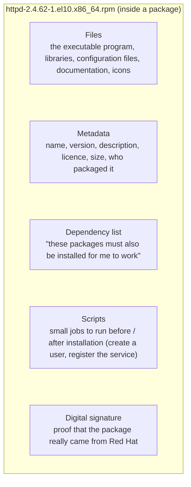

Learn to read the file name in the diagram too, because you'll see it constantly: `httpd-2.4.62-1.el10.x86_64.rpm`.
The pieces: **httpd** (the package name; this is a web server), **2.4.62** (the program's own version), **1**
(the packager's attempt number), **el10** (packaged for Enterprise Linux 10), **x86_64** (which processor
architecture it's for). Even a single file name tells you that much.

### Dependencies: nobody stands alone

Modern programs don't live alone. A web server uses a separate library for encryption; that library leans on
another library for compression; that one on the C library. If every program carried its own copy of these
libraries, there would be hundreds of copies of the same thing on the disk, and when a vulnerability came out
you'd have to fix hundreds of places. Instead, a library is installed **once** and everyone shares it. A
program's list of "these must be installed for me to work" is called its **dependencies.**

A lovely idea, but it has a trap, and that trap produced the most famous headache in Linux history.

<Callout type="note" title="History note: dependency hell and the birth of package managers">
In the 1990s there were packages, but no tool to fetch them from a repository and resolve their dependencies.
You'd want to install a program and it would say "this library is missing"; you'd find and download it, and it
would say "that one depends on this"; you'd download a third, and this time it would clash with the version some
already-installed program wanted... This loop was called **dependency hell,** and it was one of the things that
made the Linux of those years intimidating.

The solution came in two steps. First, package formats were standardised: Debian's **dpkg** (1994) and Red
Hat's **rpm** (1995, Marc Ewing and Erik Troan). Then, on top of these formats, higher-level tools were written
that look at repositories and resolve the dependency chain **by themselves:** on the Debian side **apt** (1998),
on the Red Hat side first **yum** (2003, "Yellowdog Updater, Modified", written by Seth Vidal at Duke
University), and from 2015 its rewritten successor **dnf** (in Fedora 22, and the default in RHEL since
version 8). Today the "missing library" problem is nearly gone; dnf follows that chain for you.
</Callout>

### Repositories: shelves and a catalogue

Where do the packages live? In **repositories** on the internet. A repository consists of two things: the
package files themselves (the shelves) and a **catalogue** (metadata) describing which version of which package
is there and what it depends on. The package manager downloads the catalogue first, then decides what to fetch
from it. The same repository has copies in different parts of the world, called **mirrors;** you download from
the one nearest you.

On RHEL the main repositories are tied to your subscription and come in two parts: **BaseOS** (the core pieces
of the operating system) and **AppStream** (applications, languages, server software; some of these are offered
in more than one version). Beyond those there are extra repositories such as **EPEL,** maintained by the
community for RHEL; a program that isn't in the main repositories can usually be found there.

Then there's the matter of trust. How do you know that a package you downloaded from the internet really came
from Red Hat, and that nobody slipped something into it along the way? Every package is **signed** with Red
Hat's private key; your system knows Red Hat's public key and verifies the signature before installing any
package. Like the hologram sticker in a shop: if the signature doesn't match, the package isn't installed. In
part 7 you'll see this with your own eyes.

### Two layers: rpm and dnf

In the Red Hat family, package work is split between two tools, and mixing them up is very common.

- **rpm** is the low-level layer. It installs and removes a single `.rpm` file, answers questions like "which
  package did this file come from?", and manages a **database** that records every installed package. But it
  doesn't look at repositories and doesn't download dependencies; it installs whatever you hand it. Like the
  warehouse clerk: puts the box on the shelf, writes it in the ledger.
- **dnf** is the high-level layer. It searches repositories, finds the package you want, resolves the dependency
  chain, downloads everything, verifies signatures and has rpm do the installation. Like the purchasing manager:
  you say "I want this", and it handles the rest.

Day to day you use dnf; you keep rpm mostly for queries. Let's follow what happens behind the scenes when you
say `dnf install httpd`:

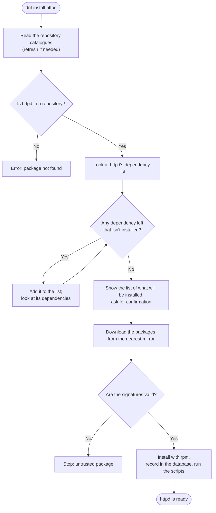

Note the loop in the diagram: the question "any dependency left that isn't installed?" is asked again until the
answer is "no". This is exactly what we described in the [Loops post](/en/blog/loops) as "a decision asked
repeatedly". For a web server this loop runs a few times; for a big desktop environment, hundreds.

<Callout type="tip" title="Just to see them: a few commands">
You don't need to type these now, just know what they look like. In part 7 we'll try all of them on a real
machine.

```text title="dnf and rpm at first glance" showLineNumbers=false
dnf install httpd      # install the package (and its dependencies)
dnf remove httpd       # remove it
dnf update             # update everything installed to the newer versions in the repositories
dnf search editor      # search the repositories
rpm -q httpd           # is it installed, and which version?
rpm -qf /usr/bin/ls    # which package did this file come from?
```
</Callout>

### Updates, and "why do the versions on RHEL look old?"

When you say `dnf update`, dnf compares the versions of the installed packages against the repository catalogue
and downloads and installs the ones that have something newer. Simple so far. But combined with RHEL's point
release model, this produces a situation that surprises beginners: "RHEL 9 has Python 3.9, but Python 3.13 is
out in the world; isn't this system out of date?"

The answer lies in the concept of **backporting.** When RHEL ships a release, it **freezes** the major versions
of the programs inside it for ten years, because the enterprise customer wants "what works today to work the
same tomorrow". But security holes and important bugs can't wait. Red Hat's engineers take these fixes from the
program's new version and **carry them back** to the old version: the version number stays 3.9, but the code
inside is patched. So an old-looking version number on RHEL doesn't mean "not updated"; it means "deliberately
held steady and separately patched". If you need a new feature from upstream, the AppStream repositories offer
more than one version side by side for some languages and tools.

### The other boxes: deb, Flatpak and containers

The package format changes by family, but the idea is the same: `.deb` packages and apt in the Debian family,
rpm and zypper in SUSE, pacman in Arch. In recent years, universal formats designed to "work on every
distribution" have also appeared: **Flatpak** (for desktop applications, backed by Fedora and Red Hat), **Snap**
(Ubuntu's) and **AppImage** (a single file, no installation). On the server side, the newest form of packaging
is the **container image:** the program is put into a single box together with its dependencies and runs the
same everywhere. We'll do this with Podman in part 14 of the series; that's when you'll say "this is a package
manager too, really".

| Family | Package format | Low-level tool | High-level tool (daily use) |
| --- | --- | --- | --- |
| Red Hat (RHEL, Fedora, Rocky, Alma) | `.rpm` | `rpm` | `dnf` |
| Debian (Debian, Ubuntu, Mint) | `.deb` | `dpkg` | `apt` |
| SUSE (openSUSE, SLES) | `.rpm` | `rpm` | `zypper` |
| Arch (Arch, Manjaro) | `.pkg.tar.zst` | `pacman` | `pacman` |
| Universal (desktop) | Flatpak, Snap, AppImage | — | `flatpak`, `snap` |
| Container | image (OCI) | — | `podman`, `docker` |

## The story of the red hat

Now to the company whose name this series carries. Red Hat's story starts with two people, and at first they
don't know each other.

### Marc Ewing and his grandfather's cap

In the early 1990s, **Marc Ewing** is a computer science student at Carnegie Mellon University in Pittsburgh.
Everyone on campus knows him, because he always wears the same cap: his grandfather's red Cornell University
lacrosse cap. Students stuck in the computer lab are told "go find the guy in the red hat, he'll sort it out".
Ewing names his own software projects after the cap, too.

After graduating, Ewing sets out to build a Linux distribution that is easier to install and tidier than
anything made so far. In the autumn of 1994, on a day that happens to be Halloween, he publishes the first
release; its name is **Red Hat Linux.** That release is still known as the "Halloween release" today. One of the
things that set Ewing's distribution apart was the **RPM** package system you just met; he wrote it together
with Erik Troan, and thirty years later rpm is still the cornerstone of this family.

### Bob Young and the car with the hood welded shut

In the same years, a Canadian entrepreneur named **Bob Young** runs a small company called **ACC Corporation,**
selling Unix and Linux software and books by catalogue. Young notices that what his customers ask for most is
Ewing's Red Hat Linux. In 1995 he buys Ewing's business and merges it with his own, and **Red Hat Software** is
born. Ewing runs the technical side, Young runs the business. The company settles in North Carolina, in the
Raleigh area where its headquarters still are today.

<div style="display:flex;flex-wrap:wrap;gap:1.25rem;justify-content:center;align-items:flex-end;margin:1.5rem 0;">
  <div style="flex:0 1 230px;max-width:230px;">
    <Figure src={bobYoungImg} alt="Bob Young, 2014" caption="Bob Young, co-founder and first CEO of Red Hat (2014). (Photo: Tendenci Software, CC BY 2.0, Wikimedia Commons.)" />
  </div>
  <div style="flex:0 1 340px;max-width:340px;">
    <Figure src={redHatTowerImg} alt="Red Hat Tower, Raleigh" caption="Red Hat Tower, the company's headquarters in Raleigh (2013). (Photo: Mark Turner, CC0, Wikimedia Commons.)" />
  </div>
</div>

Young had an analogy he told everyone back then, and I think it is still one of the best explanations of open
source there is:

> "Would you buy a car with the hood welded shut?"

Closed-source software is the car with the hood welded shut: you can't look inside, only the manufacturer can
repair it, and when something breaks, you wait. With open-source software the hood is open; look inside
yourself if you like, or take it to another mechanic. So then what does Red Hat sell? The answer to that comes
shortly, under its own heading.

### Through the years

Let's see the rest as a series of stations, then stop at the important ones one by one.

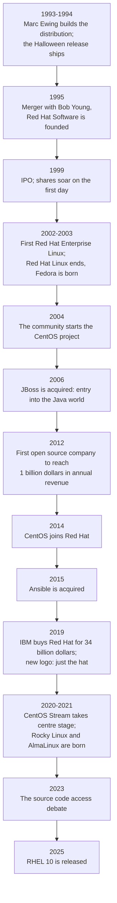

**1999: a day on Wall Street.** In August 1999 Red Hat went public and its share price multiplied several times
over on the first day; it was one of the biggest first-day gains to that date. For those asking "can you build
a company out of software that's given away for free?", this was the first answer.

**2002-2003: the big decision.** Until then, Red Hat Linux was the same product for hobbyists and companies
alike, sold in a box. In 2002 a separate, long-supported edition for companies appeared: **Red Hat Enterprise
Linux.** In 2003, with Red Hat Linux 9, the old product was discontinued, and the community side became a
separate project named **Fedora.** (A fedora is a style of hat; the match with the logo is no accident.) This
split is the foundation of the family tree you'll see in a moment.

**2004: CentOS.** RHEL's source code was open; a group from the community took that code, stripped out Red Hat's
trademarks and compiled a free, fully compatible edition: **CentOS** (Community Enterprise Operating System).
For years it was the darling of small companies and hobbyists as "free RHEL". In 2014 Red Hat brought the
CentOS project under its own roof.

<Callout type="note" title="History note: the SCO lawsuit and the &quot;is it legal to use Linux?&quot; scare">
In 2003 a company called SCO Group filed a billion-dollar lawsuit against IBM, claiming that it owned the
rights to Unix and that Unix code had been smuggled into Linux; it then sent letters to hundreds of large
companies using Linux demanding "licence fees". Suddenly one question was on every company's mind: "If we use
Linux, will they sue us too?" Red Hat filed suit against SCO that August and made its customers a promise: if
you run into legal trouble for using Red Hat products, we stand behind you. In 2004 that promise became a
programme called **Open Source Assurance;** the "legal assurance" item in the subscription comes from here. How
the case ended: in 2007 a court ruled that the Unix copyrights belonged to Novell, not SCO, and SCO filed for
bankruptcy the same year; the last remnants with IBM were only settled in 2021. No evidence of stolen code in
Linux was ever found. The case was a turning point in open source earning its "safe to use" stamp in the
corporate world.
</Callout>

**2006 and after: the Java world.** Red Hat acquired the Java application server **JBoss.** When you hear that
Quarkus, a name that will come up often on this blog, is also a Red Hat product, you won't be surprised any
more. So these two series are closer than you'd think: you learn Java over there, and the server that Java runs
on over here.

**2019: IBM.** In a deal announced in October 2018 and completed in July 2019, **IBM bought Red Hat for 34
billion dollars,** the largest software acquisition to that date. Red Hat carried on operating as a separate
company inside IBM. The logo changed that same year: the shadowed face under the hat, "Shadowman", used for
years, was gone, and only the red hat remained.

**2020-2021: CentOS Stream and the new clones.** In December 2020 Red Hat announced it would end classic CentOS
Linux and shift the focus to **CentOS Stream.** Stream is a continuously updated preview of the next RHEL
release; not an "exact copy" of RHEL but "one step ahead" of it. The community, used to its free RHEL copy, did
not like this decision, and two new projects were born in 2021: **Rocky Linux,** started by CentOS co-founder
Gregory Kurtzer (named after the late CentOS co-founder Rocky McGaugh), and **AlmaLinux,** started by the
company CloudLinux ("alma" means "soul" in several languages).

<Callout type="note" title="History note: the 2023 source code debate">
In June 2023 Red Hat stopped publishing RHEL's source code in public repositories and began providing it only
to subscribers; the only publicly available source became CentOS Stream. The decision was hotly debated in the
open source world. Rocky and Alma adjusted their paths accordingly: Rocky aims to reach the code through other
routes and keep exact compatibility; Alma dropped the "exact copy" claim and aims to be "compatible with RHEL"
instead. For you, as a beginner, the practical upshot is this: the commands and concepts you'll learn on these
distributions are still the same. The debate itself is a good lesson in where the open source principle of
"keep the code open" collides with the reality of "the company has to make money".
</Callout>

## The family tree: from upstream to Fedora, from Fedora to RHEL

Let's put all these names into one picture. Remember the river analogy: the water flows from top to bottom.

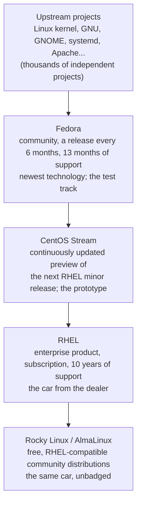

By analogy: Fedora is a car maker's **concept cars and test track.** New ideas are tried here first; exciting,
but sometimes bumpy. CentOS Stream is the **prototype about to enter production:** nearly finished, showing
what the next model will look like. RHEL is **the car you buy from the dealer:** tested for years, under
warranty, with spare parts (updates) available for ten years. Rocky and Alma are **manufacturers selling the
same factory's output under a different badge:** the same car, no warranty or dealer support, but free.

This flow is concrete: every RHEL release is a specific Fedora release, frozen and polished for years. RHEL 8
derived from Fedora 28; RHEL 9 from Fedora 34; RHEL 10 from Fedora 40. A new feature you see in Fedora today
turns up in RHEL two or three years later.

### RHEL's release history

You don't need to memorise every release; but a glance at the table shows you both RHEL's rhythm and how Linux
has changed over the last twenty years.

| Release | Year | Kernel | What did it bring? |
| --- | --- | --- | --- |
| RHEL 2.1 | 2002 | 2.4 | The first enterprise release (then called Advanced Server) |
| RHEL 3 | 2003 | 2.4 | The "Red Hat Enterprise Linux" name; many processor architectures |
| RHEL 4 | 2005 | 2.6 | SELinux enabled by default for the first time (part 12) |
| RHEL 5 | 2007 | 2.6 | Built-in virtualisation (Xen) |
| RHEL 6 | 2010 | 2.6.32 | KVM virtualisation, the ext4 file system |
| RHEL 7 | 2014 | 3.10 | **systemd** (part 8), XFS by default, firewalld (part 13), Docker support |
| RHEL 8 | 2019 | 4.18 | **dnf,** AppStream repositories, **Podman** (part 14), the Cockpit web console |
| RHEL 9 | 2022 | 5.14 | First release derived from CentOS Stream; SSH password login for root disabled by default |
| RHEL 10 | 2025 | 6.12 | Managing the OS like a container image (image mode), an AI assistant on the command line, post-quantum cryptography, Wayland only |

<Callout type="note" title="The lifecycle: what does ten years mean?">
The life of a RHEL release has two main phases. The first five years are **full support:** support for new
hardware, new features and a minor release every six months. The next five years are **maintenance support:**
no new features, only security and important bug fixes. At the end of the ten years, paid **extended support**
can buy a few more years. A bank knowing that the RHEL 8 it installed in 2019 will receive security patches
until 2029 means that bank can plan its systems. Compare that with Fedora's 13-month lifespan and you see why
the two are for different jobs.
</Callout>

### So which one should I install?

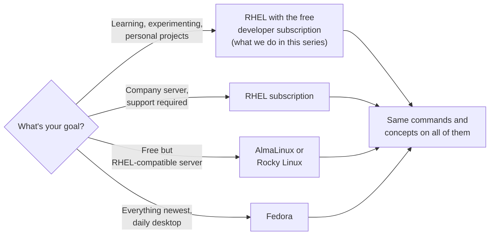

In this series we'll install RHEL itself, because Red Hat gives individual developers a **free subscription:**
you create an account, and you can download, install and update RHEL on up to 16 systems. That is exactly the
subject of the next part. But if you already have an Alma or a Rocky at hand, you can follow the series without
any trouble at all.

## If anyone can download it for free, what does Red Hat sell?

We've reached the curious question from the start of the post. The source code is open, Alma and Rocky are
free, Fedora is free. How does Red Hat earn billions of dollars a year?

The answer is one word: **subscription.** And what the subscription sells is not the software itself but the
services around it. When you buy a RHEL subscription, you get:

- **Tested updates.** Every patch reaches you after being tried against thousands of hardware and software
  combinations. So your server doesn't fall over because of an update.
- **Security patches and a ten-year lifespan.** When a new vulnerability is announced, Red Hat's team prepares
  the fix (that backporting business), and keeps preparing fixes for ten years.
- **Certified compatibility.** The guarantee that "this server model, this database, this Java version has been
  tested on RHEL and is supported". You can guess that a bank doesn't settle for "seems to work".
- **A phone number.** A support team that is obliged to answer when the server won't boot at three in the
  morning.
- **Legal assurance and tooling.** A company that vouches for the licensing status of the code you run, plus
  extra tools for managing and monitoring systems in bulk.

Back to Bob Young's car: Red Hat isn't selling the car, the hood is open. What it sells is **the maintenance
contract, the warranty and roadside assistance.** For a car you can fix at home as a hobby, you wouldn't pay
for those; but if you run a fleet of buses carrying thousands of passengers, you would. Companies pay for
exactly that reason.

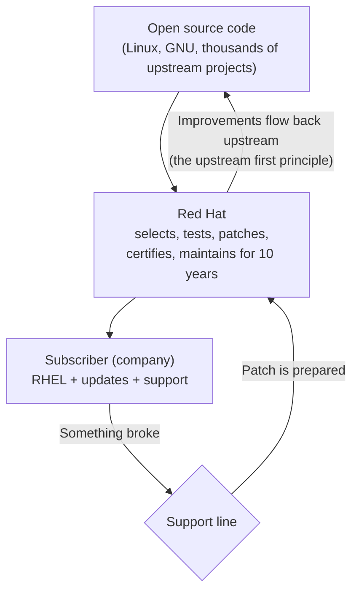

Don't miss the last arrow in the diagram: the fixes Red Hat writes don't go only to subscribers, they flow back
into the upstream projects. This loop is the heart of the model: the code stays a common good, and the company
sells services on top of it.

Subscriptions come in kinds, too. The **individual developer subscription** this series uses is free and covers
up to 16 systems; there is a free edition for teams as well. Companies buy standard and premium subscriptions,
paid yearly per server and priced by support level (business hours or around the clock). The software is the
same in all of them; the difference is the service that comes with it.

<Callout type="note" title="Free as in beer, or free as in freedom? Two different words">
In English, "free" means both "at no cost" and "at liberty"; it is the most classic confusion in the open source
world. The emphasis in open source, or free software, is on the second: the freedom to **see, change and
share** the code. Costing nothing is usually a consequence of that, but not a requirement. RHEL is the perfect
example: its code is free as in freedom, but getting the edition Red Hat has prepared and tested takes a
subscription. The reverse exists too: thousands of programs you download for nothing whose code you'll never
see. Telling these two apart will help you understand half of all open source debates.
</Callout>

## What happens when a vulnerability comes out? Red Hat's difference

The "security patches" item in the subscription list looks ordinary on paper. But once you look at a few events
of recent years, you understand why that item is the biggest reason companies pay for RHEL. First, let's settle
a few words.

A **vulnerability** is a bug in a program that lets someone malicious do something they shouldn't be able to
(read your files, take over your machine). Every serious vulnerability gets a worldwide identifier: a **CVE**
number. You read `CVE-2024-3094` as: the year 2024, record number 3094 of that year. The fix that closes the
hole is called a **patch.** If a vulnerability leaks to the public or to attackers before its patch is ready,
it's called a **zero-day:** the defenders have zero days to prepare. To prevent that, the industry developed a
custom: **coordinated disclosure.** Whoever finds the vulnerability first tells the software's developers and
the major distributors in secret; everyone prepares their patch; on the agreed day the vulnerability, the CVE
and the patches are published together. That secret period is called the **embargo.** Red Hat classifies
vulnerabilities into four severity levels (low, moderate, important, critical) and publishes every patch as a
numbered **security advisory** (RHSA).

### Why does closing a hole take so long?

You've probably heard this: a big vulnerability comes out, and months or even years later, systems breached
through that same hole are still in the news. But careful: what takes long is usually not *writing* the patch;
it's the patch *reaching* and being *applied to* millions of systems around the world. There are three
bottlenecks:

1. **The software may have no maintainer.** In the open source world many critical pieces are in the hands of
   one or two volunteers. If there's nobody to write the patch, or they're late, everyone waits.
2. **The patch has to be carried everywhere separately.** The same library is packaged separately in hundreds of
   distributions, thousands of products, millions of embedded devices (modems, smart TVs, cameras) and container
   images. Each one's maker has to carry the patch into their own package; many never do.
3. **The patch may not be applied.** The most common and most expensive one. In 2017 the credit company Equifax
   still hadn't applied the patch for an Apache Struts vulnerability two months after it came out; attackers
   walked in through that hole and stole the data of 147 million people. The same year, the WannaCry ransomware
   locked hundreds of thousands of computers in 150 countries using a hole Microsoft had patched two months
   earlier; hospitals in the UK postponed operations. Years after 2021's Log4Shell, unpatched systems are still
   being found.

So the time it takes to close a vulnerability is the patch being written, plus distributed, plus applied. The
first two are the distributor's job; the third is the system administrator's. One day, that means you.

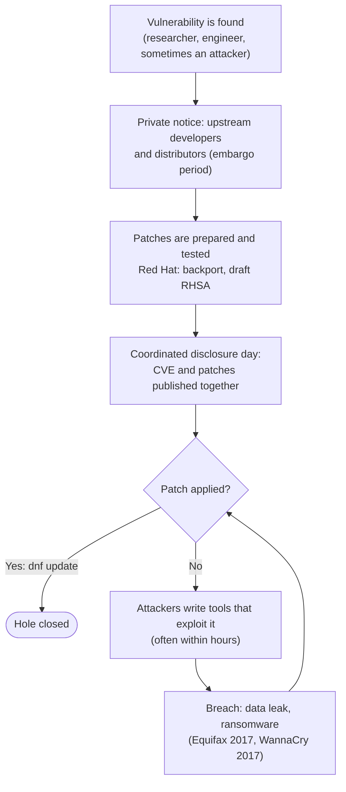

### Why is Red Hat's response fast?

Red Hat has had a **Product Security** team doing nothing but this since 2001. That team is among the first to
receive embargoed notices, because Red Hat is both the world's largest Linux distributor and a company that
employs the maintainers of critical pieces like the kernel, glibc, systemd and OpenSSL. Often the engineer who
writes the patch already works at Red Hat. Red Hat is also one of the few organisations authorised to assign
CVE numbers; the `CVE-2024-3094` number in the XZ incident was assigned by Red Hat. The result: when coordinated
disclosure day arrives, the patch is usually ready, and it arrives when you type `dnf update` in the morning.

A second advantage comes from the point release model you met a moment ago: because RHEL carries older,
thoroughly tested versions of programs, it is often **not affected at all** by fresh bugs added to the newest
versions. You'll see two examples of that in the table below.

### Examples from real incidents

| Incident | What happened? | Disclosed | Red Hat |
| --- | --- | --- | --- |
| **Heartbleed** (OpenSSL, CVE-2014-0160) | A bug in the internet's encryption library allowed reading passwords and keys from server memory | 7 April 2014 | RHEL 6 patch the next day (RHSA-2014:0376); RHEL 5 was unaffected because it carried an older OpenSSL |
| **Shellshock** (bash, CVE-2014-6271) | Commands could be injected into the shell through environment variables; web servers were open to remote takeover | 24 September 2014 | Same-day patch (RHSA-2014:1293); when the first upstream fix turned out incomplete, Red Hat engineer Florian Weimer wrote the lasting fix, published within two days |
| **Meltdown / Spectre** (CPU, CVE-2017-5754 and CVE-2017-5715) | Flaws rooted in processor design that let programs read each other's memory | 3 January 2018 | Same-day kernel patch (RHSA-2018:0007); Red Hat had prepared the patches during the months-long embargo |
| **Log4Shell** (Java Log4j, CVE-2021-44228) | Remote code execution in Java applications through a single log line; called the biggest vulnerability of the decade | 10 December 2021 | Same-day CVE page, list of affected products and temporary mitigations; product patches over the following days |
| **PwnKit** (polkit, CVE-2021-4034) | An ordinary user could become root through a tool found on every Linux desktop and server; unnoticed for 12 years | 25 January 2022 | Same-day RHEL 7 and 8 patches (RHSA-2022:0272 and 0274) |
| **Looney Tunables** (glibc, CVE-2023-4911) | A bug in the C library let a local user become root | 3 October 2023 | RHEL 8 and 9 patches within two days (RHSA-2023:5453 and 5455); glibc's maintainers already work at Red Hat |
| **XZ backdoor** (xz/liblzma, CVE-2024-3094) | A backdoor planted with two years of patience in a compression library; it would have opened SSH access to servers worldwide | 29 March 2024 | Same-day alert and CVE; Fedora's development releases were cleaned; RHEL was untouched because it carried an older xz |
| **regreSSHion** (OpenSSH, CVE-2024-6387) | A previously fixed hole in the remote login server reappeared | 1 July 2024 | RHEL 9 patch within two days (RHSA-2024:4312); RHEL 8 didn't carry the affected version, so it didn't even need a patch |

<Callout type="note" title="History note: the XZ backdoor that almost happened">
On the last Friday of March 2024, a database engineer at Microsoft named Andres Freund noticed that SSH logins
on his test machine had slowed down by about half a second. Most people would have shrugged; he dug in. What he
found was one of the most skilful attacks in software history: someone using the name "Jia Tan" had spent two
years contributing to a small compression project called xz as a volunteer, earned trust, become a maintainer,
and then hidden a backdoor in the library that would open the SSH server remotely. The code had reached Fedora's
development releases and Debian's testing branch; within a few months it would have spread around the world
with the next major distribution releases. Red Hat published an alert and assigned the CVE number the same day,
and cleaned up Fedora. As for RHEL: it didn't have to do anything, because RHEL 9 carried a version of xz from
three years before the backdoor. Remember the "old-looking versions" section; this was the most concrete benefit
of the point release model. The incident showed open source's weakest point (critical projects depending on a
single volunteer) and its strongest (because the code is open to everyone, one curious person could find the
backdoor) at the same time.
</Callout>

<Callout type="important" title="Let's be fair: the speed isn't unique to Red Hat, the guarantee is">
All the major distributions, Debian, Ubuntu, SUSE, take part in the coordinated disclosure system, and most of
them ship patches the same day. Three things set Red Hat apart: because it employs the maintainers of critical
pieces, it usually writes the patch itself; it commits by contract to backporting the patch for ten years, even
to old versions nobody else cares about any more; and it vouches that the patch has been tested with the other
components. And the other side of the coin: even the fastest patch in the world is useless if you don't apply
it. When you learn `dnf update` in part 7, remember this section.
</Callout>

## Red Hat today: not just an operating system

Red Hat's name is tied to RHEL, but the company's product family today is much wider. You don't need to learn
all of it now; let's just draw a map so that when you hear the names you can say "ah, that's Red Hat's".

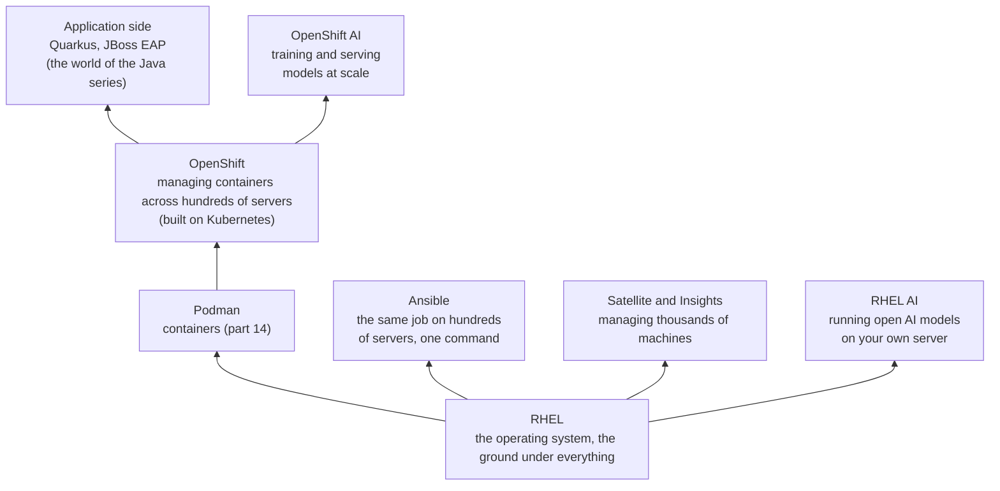

Read it bottom to top. Underneath everything is **RHEL.** Above it, **Podman** lets you put programs into
portable boxes called "containers". When you need to manage thousands of containers across hundreds of servers,
**OpenShift** steps in. **Ansible** is the automation tool that does jobs like "apply this setting on those 200
servers" with a single command. **Quarkus** and **JBoss EAP** are the layer where Java applications run; you'll
meet them over in the [Java series](/en/blog/what-is-java) as it progresses. In this series we are at the very
bottom of this stack, and we won't climb until the ground is solid.

There's an invisible side, too: not only Red Hat's products but many of the pieces inside the distribution
itself came out of the hands of Red Hat engineers. **systemd,** which you met a moment ago, was written in 2010
by Lennart Poettering and Kay Sievers while working at Red Hat. Red Hat is among the largest contributors to the
**GNOME** desktop, the **NetworkManager** networking tool, the audio stack, the Linux kernel, and
**Kubernetes,** the foundation of the container world. "Upstream first" is not just a slogan.

### Red Hat and artificial intelligence

Let me open up the two new boxes on the right of the map, because this is the most talked-about side of Red Hat
today. First, a bearing for the beginner: a chat assistant like ChatGPT is not a web page; behind it run
thousands of servers with **GPUs** (graphics processors), and nearly all of those servers run Linux.
**Training** a model means showing it billions of examples of data; **inference** means asking the trained
model a question and getting an answer. Both happen on huge server fleets, on top of the operating system. So
Red Hat's first role in the AI world is, as always, being the **ground:** RHEL on GPU servers.

On top of that, from 2023 onwards, it built a product family:

| Product | What is it for? |
| --- | --- |
| **RHEL AI** (2024) | A ready-made RHEL image containing IBM's open source **Granite** models, **InstructLab** for training the model on your own data, and a fast inference engine. The aim: run the model on your own server instead of renting it in the cloud |
| **OpenShift AI** (2023, formerly OpenShift Data Science) | The platform for training, versioning and serving models across hundreds of servers; the shared workspace of data scientists |
| **AI Inference Server** (2025) | A server that runs a trained model as fast and cheaply as possible; based on the open source **vLLM** project. Red Hat acquired Neural Magic, vLLM's largest contributor, in early 2025 |
| **Lightspeed** assistants | AI helpers embedded in RHEL, OpenShift and Ansible: you can ask "why did the disk fill up on this server?" from the command line (RHEL 10) |
| **InstructLab** (2024, with IBM) | An open method and tool for adding knowledge to an AI model the way you contribute to an open source project |

Two ideas explain this whole table. First, Red Hat's slogan: **"any model, any hardware, any cloud."** Just
as RHEL runs on every brand of server, it shouldn't matter whose chip or cloud the model runs on. Second, the
open source reflex you've met three times in this post: let the model's weights be open (Granite), let the
training method be open (InstructLab), let the inference engine be open (vLLM). A closed AI service is the
2020s version of Bob Young's car with the hood welded shut; Red Hat is trying to open the same hood, this time
for AI.

So why would a bank want this, instead of saying "we'll just ask ChatGPT"? Because it cannot send customer
data to an outside service; both the law (KVKK in Türkiye, GDPR in Europe) and common sense forbid it. If it
runs the model on its own RHEL server, **the data never leaves home.** We'll come back to that sentence in the
final note of this post.

<Callout type="note" title="For the curious: vLLM, InstructLab and Neural Magic">
**vLLM** is an open source engine that started at the University of California, Berkeley in 2023 and runs
large language models without wasting memory; today it is the de facto standard of the industry. **Neural
Magic** was the company that specialised in shrinking models (quantisation, sparsity) to run on less
hardware, and the largest contributor to vLLM; Red Hat brought it in-house in January 2025. **InstructLab** is
based on IBM Research's LAB method: instead of retraining a model from scratch to teach it something new,
generate synthetic data from a handful of examples and add it to the model. In 2025 Red Hat also launched
**llm-d,** a project with Google, IBM and NVIDIA for running models spread across many servers. You don't need
to know any of this now; it will make sense much later in the series, after you've met Podman and OpenShift.
</Callout>

### Where does it run?

Let's make it concrete. The New York Stock Exchange's trading systems run on RHEL. The world's largest banks,
airlines, telecoms, government agencies... Red Hat says the large majority of the Fortune 500 are its customers.
Every major cloud provider (Amazon, Microsoft, Google) offers RHEL ready to go. Wherever you are, the back rooms
of your country's banks, telecom operators and public systems very likely hold a machine from this family. So
what you're learning isn't a hobby tool; it's the ground the world's money and data infrastructure stands on.

### What exactly does "enterprise" mean?

I've used the word "enterprise" a lot in this post; let me make it concrete, because the reason banks choose
RHEL is exactly here. Three things separate an enterprise environment from an ordinary computer: **scale**
(not a hundred machines but tens of thousands), **responsibility** (if the system stops, money and sometimes
lives are lost) and **audit** (a regulator shows up and asks "how did you secure this?").

To answer that last one, the operating system has to have been tested by independent bodies. A few of the
credentials RHEL carries:

- **FIPS 140-3.** Its cryptographic modules have been tested against the US and Canadian government standard.
  Most public sector and financial institutions require this.
- **Common Criteria.** An international security evaluation standard; independent laboratories go through the
  system with a fine-tooth comb.
- **DISA STIG and CIS profiles.** Official configuration guides that say "this is how a secure server is set
  up". RHEL ships these as ready-made profiles; with the built-in OpenSCAP tool you can check whether a system
  complies with the guide in a single command.
- **Industry rules such as PCI DSS.** Rules every system that handles credit cards has to follow; RHEL's
  profiles have ready answers for these, too.

Then there's the certified catalogue: which server model, which database, which SAP or Oracle version is
officially supported on RHEL, all in one list. A bank doesn't say "seems to work"; it says "it's on the list".
What justifies the price of enterprise Linux is less the software itself than this pile of paper.

## A short look inside the system: what lies ahead?

Before closing the post, let me introduce, in a sentence each, three concepts we'll open up at length in later
parts, so that what you see on the installation screen in part 2 doesn't feel foreign.

**The boot chain.** What happens when you press the power button is like a relay race:

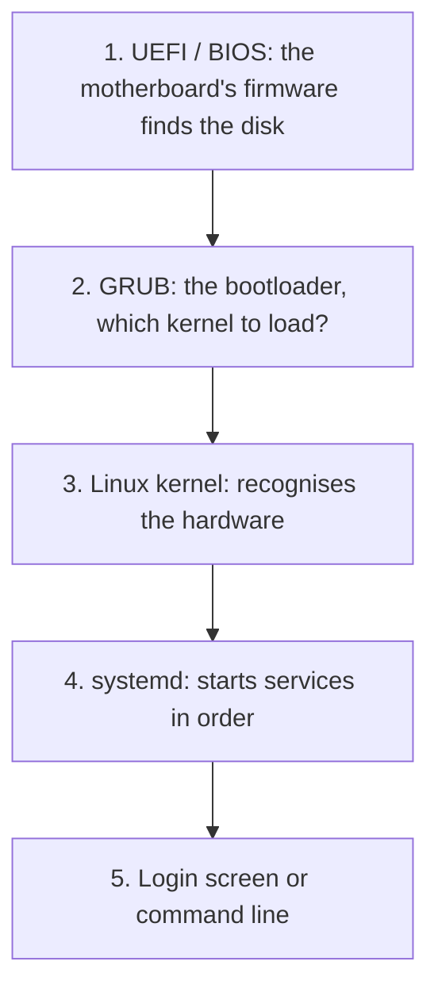

The motherboard's own tiny firmware (UEFI) finds the disk and runs the **bootloader** (GRUB); GRUB loads the
kernel into memory; the kernel recognises the hardware and starts the first program, systemd; and systemd brings
everything up in order. In part 8 we'll touch every link of this chain.

**Terminal, shell and command.** The three are often confused. The **terminal** is the window that shows what
you type; the **shell** is the program that reads the line you typed in that window and runs it (bash on RHEL);
a **command** is a single job you tell the shell (like `ls`). The window, the waiter, the order. We start in
part 3.

**root and the ordinary user.** Linux has a single account that can do everything: **root.** Everyone else can
only touch their own files; for system files they ask root for permission (with the `sudo` command). The "is it
allowed?" question in the system call diagram is fed from here. The subject of part 6.

## The certification path: RHCSA, RHCE and beyond

I said I'm writing the series "following the RHCSA syllabus"; let me explain what that is in two paragraphs.
**RHCSA** (Red Hat Certified System Administrator) is Red Hat's entry-level system administration certification.
What sets the exam apart from most other IT exams is this: there are **no** multiple-choice questions. You are
put in front of a real RHEL machine and given concrete tasks such as "create this user, mount this disk, start
this service at boot, configure SELinux like so". If you can do it, you pass; if you can't, you don't. So it
can't be passed by memorising, and rightly so.

One step up is **RHCE** (Red Hat Certified Engineer), built around automation with Ansible. Above that is
**RHCA** (Architect), reached by collecting specialist exams. This series covers the RHCSA topics in order; in
the final part we'll talk about the exam itself, how to prepare, and which roads open up afterwards.

## The series roadmap

I want you to know where we're going from the start. Each part builds on the one before, just like in the other
series:

<Steps>

1. **What is Red Hat?** The post you're reading now.
2. **[Installing RHEL](/en/blog/installing-rhel).** The free developer subscription, a virtual machine, installation step by step.
3. **The terminal and the shell.** First commands; meeting bash.
4. **The Linux file system.** "Everything is a file" and the directory tree.
5. **Redirection, pipes and vim.** Chaining commands together, editing files.
6. **Users and permissions.** root, sudo, rwx.
7. **Packages: RPM and dnf.** Applying the concepts from this post on a real machine.
8. **Services with systemd.** The boot chain, managing services.
9. **Processes and scheduling.** Running programs, logs, cron.
10. **Networking and SSH.** Connecting to a machine remotely.
11. **Disks and LVM.** Managing storage.
12. **SELinux.** Understanding it without fear.
13. **firewalld.** The firewall.
14. **Containers with Podman.** Putting a program in a box.
15. **Final steps and the RHCSA path.**

</Steps>

The up-to-date list, with the published parts, always lives on the [Red Hat page](/en/red-hat).

## Think for yourself

We didn't type any commands in this part, so the questions are on paper too. The aim is to see whether the
concepts have settled in.

### Question 1 — Is there Linux in your phone? (easy)

> We said Android phones use the Linux kernel. Does that make it correct to say "Android is a Linux
> distribution"? Think with the car analogy.

<Callout type="note" title="Hint">
The engine is the same: there really is a Linux kernel under Android. But what's built around it (the app
store, a Java-like application layer, a touch interface) is very different from a classic Linux distribution;
there are no GNU tools, no package manager like dnf or apt, no systemd. So "Android is an operating system that
uses the Linux kernel" is correct; calling it a "Linux distribution" is debatable. Same engine, a completely
different car.
</Callout>

### Question 2 — Put them on the right shelf (easy)

> Match these four names with their descriptions: **Fedora, CentOS Stream, RHEL, AlmaLinux.**
> (a) The enterprise product, supported for ten years and sold by subscription. (b) A preview of the next RHEL
> release. (c) The community distribution that ships every six months and tries new technology first. (d) A
> free, RHEL-compatible community distribution.

<Callout type="note" title="Hint">
Fedora → (c), CentOS Stream → (b), RHEL → (a), AlmaLinux → (d). Remember the direction of flow in the family
tree: from Fedora towards RHEL, "less novelty, more stability"; from RHEL towards the clones, "the same thing,
without support".
</Callout>

### Question 3 — The dependency chain (medium)

> The `photoeditor` package you want to install depends on `imagelib`, and `imagelib` depends on
> `compression`; `compression` is already installed. When you say `dnf install photoeditor`, which packages
> does dnf download? Follow the loop in the flowchart by hand.

<Callout type="note" title="Hint">
The loop goes like this: `photoeditor` isn't installed → add it to the list, look at its dependency: `imagelib`
isn't installed → add it to the list, look at its dependency: `compression` is installed → stop. To download:
`photoeditor` and `imagelib`, that's all. dnf doesn't re-download something already installed; it only checks
that its version is sufficient.
</Callout>

### Question 4 — The old-looking version (medium)

> A friend says "RHEL 9 has Python 3.9, it's out of date, this system is insecure." Write them a two-sentence
> reply using the concept of backporting.

<Callout type="note" title="Hint">
"The version number is deliberately held steady so that what works today works the same tomorrow; the security
fixes are taken from the new version and carried back to this one, so it says 3.9 but the code inside is
patched." Bonus points: "If you need a new Python feature, the AppStream repositories offer more than one version
side by side."
</Callout>

### Question 5 — The car with the open hood (medium)

> A friend says "If the code is open anyway, paying Red Hat is nonsense, everyone just installs Alma and moves
> on." Explain to them, in one paragraph, when they're right and when they're wrong.

<Callout type="note" title="Hint">
When they're right: learning at home, a small personal project, a test server. There, paying for "roadside
assistance" makes no sense; Alma, Rocky, or RHEL with the free developer subscription is plenty. When they're
wrong: a company environment where a stopped server loses money, where the guarantee "this database is
supported on this system" is mandatory, and where a security patch has to arrive within hours. What's being
bought there isn't code; it's responsibility and time.
</Callout>

### Question 6 — Do commands travel? (medium)

> You need to guess whether a command you learned on RHEL will also work on Ubuntu. Which kinds of commands do
> you think are the same on both sides, and which differ? Look at the "RHEL versus Ubuntu" table.

<Callout type="note" title="Hint">
File and directory work (`ls`, `cp`, `mkdir`), user and permission commands, process management and the like
come from the GNU tools or the kernel, so they're the same on both sides. Where things differ is package
management: `dnf install` on RHEL, `apt install` on Ubuntu. A few configuration files have slightly different
locations and names, and defaults like the security layer (SELinux versus AppArmor) change. Roughly ninety
percent shared, ten percent family accent.
</Callout>

### Question 7 — The patch existed (medium)

> In the Equifax incident, the patch for the Apache Struts vulnerability came out in March 2017; the company was
> breached in May. In which box of the security flowchart did this company get stuck? What does this have to do
> with a system administrator?

<Callout type="note" title="Hint">
They stayed on the "No" branch of "patch applied?"; the patch had been written and distributed, but not applied.
So the bottleneck wasn't the distributor, it was the people running that system. On RHEL the same situation
reads "the RHSA was published but nobody ran `dnf update`". Red Hat can have the patch ready in the morning;
applying it is your job, and part 7 of the series is exactly for that.
</Callout>

## A final note: underneath everything is data

Before closing this post, let me say in one word why this whole story of kernels, packages and subscriptions
matters: **data.**

The most valuable thing of the twentieth century was oil; countries fought wars for it. The oil of the
twenty-first century is data, and that is no longer a metaphor. Your account numbers, your health records,
your location, your messages, your habits, your face and your voice... all of it sits on a server, and the
great majority of those servers run Linux. What happens when your data is stolen is no longer limited to "I'll
change my password": loans can be taken out in your name, your voice and face can be imitated with AI to
defraud your family, a company's entire data can be encrypted and held for ransom, a hospital can shut down for
days. In 2016 a database containing the identity details of roughly 50 million citizens of Türkiye ended up on
the internet; that data is still in circulation. AI enlarges this picture from two directions: models are fed
with data (yours included), and the list of things that can be done with stolen data grows longer every year.

That is why a system administrator's real job is not keeping the server up but **protecting the data.** Every
part of this series actually serves that: users and permissions (who can touch what), SELinux (even when a
rule is broken, the kernel says "stop"), the firewall (who can get in), updates (closing known holes), disk
encryption and backups. You'll learn commands, but let this question stand behind every command: does this
change whose hands the data is in?

Red Hat's work in this area can be summed up in three layers as well:

- **Locks at the kernel level.** Red Hat is the main maintainer of SELinux, on by default in RHEL since 2005.
  The maintainer of Linux's disk encryption tool (LUKS) is a Red Hat engineer; the **Clevis/Tang** method,
  which unlocks an encrypted server disk at boot using a key server on the network, was born at Red Hat.
- **System-wide encryption rules.** Since RHEL 8, a single command switches the whole system into "reject weak
  encryption" mode; FIPS-validated modules; and with RHEL 10, **post-quantum cryptography,** that is, preparing
  today for the possibility that future quantum computers break today's ciphers.
- **Identity, detection and the supply chain.** Identity Management for the organisation and **Keycloak** for
  applications (born at Red Hat, handed to an independent foundation in 2023); **Insights** to detect
  vulnerabilities before you notice them; **software supply chain assurance** (signed builds, a bill of
  materials for every package), which grew in importance after the XZ incident; containers running without
  root (Podman); and work on **confidential computing,** where data stays encrypted even while in memory.

Let's close the AI link, too: an organisation cannot send customer data to an outside chat service; KVKK and
GDPR already forbid it. The solution is to run the model on your own server. The reason RHEL AI and OpenShift
AI exist is exactly this sentence: **the data never leaves home.**

## Summary and what's next

<Callout type="tip" title="Keep in your pocket">
- The **operating system** is the manager standing between hardware and programs. The **kernel** is its heart:
  it schedules processes, shares out memory, talks to hardware through drivers, presents the disk as a file
  system, handles network packets. When programs want something from it, they make a **system call** (the
  waiter).
- **Linux is not an operating system on its own; it is the kernel** (the engine). Linus Torvalds started it in
  1991 as "just a hobby"; today it sits under servers, supercomputers and Android phones.
- **Distribution** = kernel + glibc + systemd + shell and core tools + package manager and repositories +
  installer + (optional) desktop + years of updates (the car). Distributions differ by package format, release
  model (point / rolling), support length, philosophy and defaults; **forking** creates families. The
  distribution version and the kernel version are different things.
- **Package** = files + metadata + dependency list + scripts + signature (the IKEA box). **Dependencies** follow
  from the idea of shared libraries; a **repository** is package shelves plus a catalogue. **rpm** is the
  low-level layer (one box, the database), **dnf** the high-level layer (repositories, dependency resolution,
  downloading, signature checks). On RHEL versions are frozen and fixes are **backported.**
- **Ubuntu and RHEL** share the same engine, systemd, bash and GNOME; the differences are packaging (apt / dnf),
  rhythm (every 6 months plus LTS / every 3 years plus 10 years), cost model (free for everyone /
  subscription), security layer (AppArmor / SELinux) and where each is common (desktop and cloud / enterprise
  servers).
- **Red Hat** is the company founded between 1993 and 1995 by Marc Ewing (the guy in the red hat) and Bob
  Young; headquartered in Raleigh, part of IBM since 2019. All of its products are open source; it works by
  the "upstream first" principle.
- The family tree: upstream → **Fedora** (test track) → **CentOS Stream** (prototype) → **RHEL** (the car from
  the dealer, a major release every 3 years, 10 years of support) → **Rocky / Alma** (the same car, unbadged
  and free).
- Red Hat sells the **subscription,** not the software: tested updates, security patches, certified
  compatibility, a support line. The hood is open; the money goes to maintenance and warranty. "Free" means two
  things: **at no cost** and **at liberty.**
- Vulnerability → **CVE** → coordinated disclosure (embargo) → patch. What drags out the closing is usually not
  writing the patch but **distributing and applying** it (Equifax and WannaCry, 2017). Red Hat is among the
  first to receive embargoes and maintains the critical pieces: same-day or next-day patches for Heartbleed,
  Shellshock, Meltdown and PwnKit; in the XZ backdoor and regreSSHion, RHEL wasn't even affected thanks to the
  point release model.
- **Enterprise** = scale + responsibility + audit; that is why RHEL carries credentials like FIPS, Common
  Criteria and STIG, and a certified catalogue. The other enterprise Linuxes: SUSE, Oracle Linux, Amazon Linux.
  Türkiye's distribution, **Pardus,** is in the Debian family. The 2003 **SCO lawsuit** is where the
  subscription's legal assurance item was born.
- **AI** runs on GPU Linux servers; Red Hat's place is first the ground (RHEL), then **RHEL AI** (Granite +
  InstructLab, a model on your own server), **OpenShift AI** (scale), **AI Inference Server** (vLLM, Neural
  Magic) and the **Lightspeed** assistants. The slogan: any model, any hardware, any cloud; the open source reflex.
- The oil of the century is **data;** the system administrator's real job is protecting it. Red Hat: SELinux,
  LUKS and Clevis/Tang, system-wide crypto policies, post-quantum cryptography, IdM and Keycloak, Insights,
  supply chain assurance. The same principle in AI: **the data never leaves home** (KVKK, GDPR).
- In this series we'll install **RHEL with the free developer subscription;** what you learn will also apply to
  Alma, Rocky, Fedora and, to a large extent, Ubuntu. Our goal is to finish the RHCSA syllabus with
  understanding.
- Next up: opening a Red Hat account, getting the free subscription, and installing RHEL step by step in a
  virtual machine on our own computer: [Part 2, Installing RHEL](/en/blog/installing-rhel).
</Callout>

## Sources and further reading

The sources behind this post, and the official pages to turn to for the next step:

- [Red Hat Developer Subscription](https://developers.redhat.com/products/rhel/download): to download RHEL for free (the subject of part 2).
- [RHEL life cycle](https://access.redhat.com/support/policy/updates/errata): support dates for every release.
- [Red Hat security updates and CVE database](https://access.redhat.com/security/security-updates/cve): the official records of the incidents in this post, for example [CVE-2024-3094](https://access.redhat.com/security/cve/CVE-2024-3094) (the XZ backdoor).
- [Fedora](https://fedoraproject.org/), [CentOS Stream](https://www.centos.org/centos-stream/), [Rocky Linux](https://rockylinux.org/), [AlmaLinux](https://almalinux.org/): the distributions in the family tree.
- [Pardus](https://www.pardus.org.tr/): TÜBİTAK's distribution.
- [kernel.org](https://www.kernel.org/): the home of the Linux kernel; [History of Linux](https://en.wikipedia.org/wiki/History_of_Linux) (Wikipedia).
- [Red Hat AI](https://www.redhat.com/en/products/ai), [InstructLab](https://instructlab.ai/), [vLLM](https://github.com/vllm-project/vllm): the projects from the AI section.
- [RHCSA certification](https://www.redhat.com/en/services/certification/rhcsa): the exam's official page.
- Photos, Wikimedia Commons: [Linus Torvalds](https://commons.wikimedia.org/wiki/File:LinuxCon_Europe_Linus_Torvalds_03_(cropped).jpg), [Richard Stallman](https://commons.wikimedia.org/wiki/File:Richard_Stallman_-_F%C3%AAte_de_l%27Humanit%C3%A9_2014_-_010.jpg), [Tux](https://commons.wikimedia.org/wiki/File:Tux.svg), [Bob Young](https://commons.wikimedia.org/wiki/File:Bob_Young_-_CNX_2014_02.jpg), [Red Hat Tower](https://commons.wikimedia.org/wiki/File:Red_Hat_Tower-2013-10-29.jpeg).
