import Callout from '../../components/Callout.astro';
import Steps from '../../components/Steps.astro';
import Figure from '../../components/Figure.astro';
import torvaldsImg from '../../assets/linus-torvalds.webp';
import stallmanImg from '../../assets/richard-stallman.webp';
import tuxImg from '../../assets/tux.png';
import bobYoungImg from '../../assets/bob-young.webp';
import redHatTowerImg from '../../assets/red-hat-tower.webp';

Yeni bir seriye başlıyoruz. Bu blogda şimdiye kadar iki yol yürüdük. [Algoritmalar serisinde](/blog/algoritma-nedir)
kalem ve kâğıtla, bir bilgisayara iş yaptırmanın mantığını çözdün. [Java serisinde](/blog/java-nedir) o mantığı
gerçek bir dile dökmeye başladık; hatta [JVM'in içine](/blog/jvm-derinlemesine) girip motorun nasıl döndüğüne
baktık. Şimdi bir kat daha aşağı iniyoruz: yazdığın programların üzerinde koştuğu zemine, yani **işletim
sistemine.** Bu zeminin dünyadaki sunucularda en yaygın hâli **Linux,** Linux'un iş dünyasındaki en tanınmış
temsilcisi de **Red Hat.**

Bu ilk bölümde hiçbir şey kurmayacağız, tek satır komut yazmayacağız. Önce oturup şu soruların cevabını
verelim: Linux tam olarak ne, "çekirdek" dedikleri şey ne yapıyor? "Dağıtım" ne demek, neden yüzlerce tane var?
Linux'ta bir program nasıl kuruluyor, şu "paket yöneticisi" denen şey ne? "Red Hat" bir şirket mi, bir işletim
sistemi mi, yoksa ikisi birden mi? Kırmızı şapka nereden çıktı? Fedora, CentOS, RHEL, Rocky, Alma... bu isim
kalabalığı ne? Ve en meraklı soru: herkesin bedava indirebildiği bir yazılımdan bir şirket nasıl olup da
milyarlarca dolar kazanıyor? Hani Algoritmalar serisinin ilk yazısında çay demlemeyi adım adım yazmıştık ya; bu
sefer gerçekten demle, biraz oturacağız.

<Callout type="important" title="Kısa cevap: Red Hat nedir?">
**Red Hat,** 1993'te kurulmuş, bugün IBM'e bağlı bir açık kaynak yazılım şirketi; **RHEL** (Red Hat Enterprise
Linux) ise bu şirketin kurumlara sunduğu, on yıl boyunca desteklenen Linux işletim sistemi. **Linux** kelimesi
aslında yalnızca işletim sisteminin çekirdeğini anlatır; RHEL, Fedora ve Ubuntu gibi "dağıtımlar" o çekirdeğin
etrafına araçlar, paket yöneticisi ve destek ekleyerek kullanılabilir bir sistem kurar. Red Hat yazılımı satmaz,
aboneliğini satar: test edilmiş güncellemeler, güvenlik yamaları ve destek. Gerisi, adım adım, bu yazıda.
</Callout>

<Callout type="note" title="Bu seri kimin için?">
Linux'a hiç dokunmamış biri için. Belki Windows ya da Mac kullanıyorsun, belki "terminal" kelimesi bile biraz
ürkütüyor. Sorun değil, sıfırdan gideceğiz. Programlama bilmen gerekmiyor; ama arada değişken, döngü gibi
kelimeler geçerse [Algoritmalar serisine](/blog/algoritma-nedir), Java ya da JVM lafı geçerse [Java
serisine](/blog/java-nedir) göz atabilirsin. Bu seri onlarla el ele gidiyor: onlar "program nasıl düşünür ve
yazılır"ı, bu seri "o program hangi zeminde koşar ve o zemin nasıl yönetilir"i anlatıyor. Kendine bir hedef
istersen: seriyi bitirdiğinde Red Hat'in RHCSA sertifika sınavının konularının tamamını görmüş olacaksın. Ama
asıl hedef sertifika değil; bir Linux makinesinin başına oturduğunda ne yaptığını bilen biri olmak.
</Callout>

<Callout type="tip" title="Diyagramlar küçük mü geldi?">
Bu yazıda epey şema var. Her şemanın sağ üstündeki **Büyüt** düğmesine (ya da şemanın kendisine) tıklarsan tam
ekran açılır; fare tekerleği ya da iki parmakla yakınlaştırıp sürükleyerek gezebilirsin. Esc ile kapanır.
</Callout>

## Önce zemini görelim: işletim sistemi ne iş yapar?

[Java yazısında](/blog/java-nedir) bir bilgisayarın aslında ne kadar "aptal" olduğunu konuşmuştuk, hatırlıyor
musun? Tek başına yalnızca toplama, karşılaştırma, bir yerden bir yere taşıma gibi minik işler yapabiliyordu;
onu akıllı gösteren şey bu işleri saniyede milyarlarca kez yapmasıydı. Şimdi o resme bir parça daha ekleyelim.

Bir bilgisayarda aynı anda onlarca program çalışır: tarayıcı, müzik, bir metin editörü, arka planda güncelleme
kontrolü... Hepsi aynı işlemciyi, aynı belleği, aynı diski, aynı ağ bağlantısını istiyor. Kim hangi sırayla
işlemciyi kullanacak? Bir programın belleğine başka bir program karışırsa ne olacak? Klavyeye basıldığında o
tuş hangi pencereye gidecek? Diskteki bir dosyayı iki program aynı anda yazmaya kalkarsa?

Bu soruların hepsini cevaplayan, donanımla programlar arasında duran o büyük yönetici programa **işletim
sistemi** diyoruz. Bir apartmanın yöneticisi gibi düşün: daireler (programlar) suyu, elektriği, asansörü
(donanımı) doğrudan kendi aralarında paylaşmaz; yönetici düzeni kurar. Kim ne zaman neyi kullanır, kim kimin
dairesine giremez, hepsi bellidir. Windows bir işletim sistemidir, macOS bir işletim sistemidir, telefonundaki
Android ve iOS da öyle. Linux da bu ailenin bir üyesi... ama birazdan göreceğin gibi, "Linux" kelimesi aslında
bundan biraz daha dar bir şeyi anlatıyor.

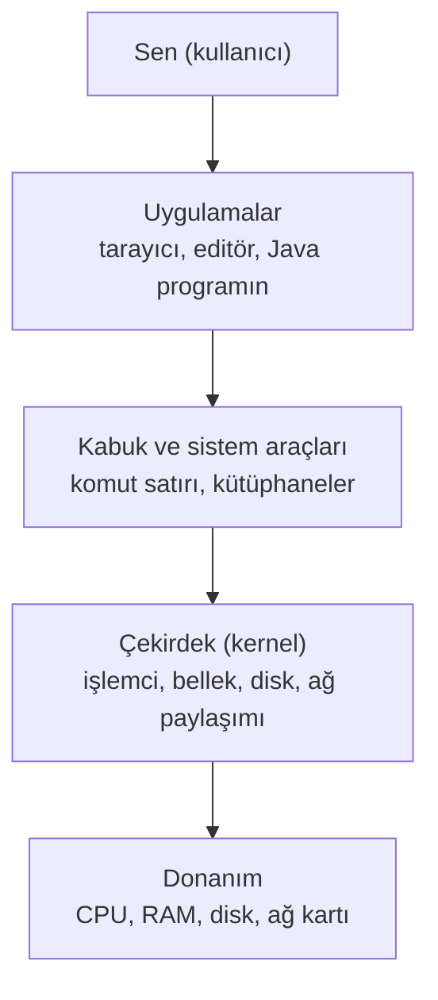

Şemayı yukarıdan aşağıya oku. Sen en üstte, uygulamalarla konuşuyorsun. Uygulamalar doğrudan donanıma dokunmaz;
araya kabuk, kütüphaneler ve en önemlisi **çekirdek** girer. Donanımla gerçekten konuşan tek katman en alttaki
çekirdektir.

<Callout type="tip" title="JVM yazısındaki yan kapıyı hatırla">
[JVM'in derinliklerinde](/blog/jvm-derinlemesine) bir "yan kapı" vardı: JNI, Java programının işletim sistemine
ve donanıma açılan kapısıydı. Bir dosya açmak, ağa paket göndermek, ekrana bir şey çizmek... JVM bunların
hiçbirini kendi başına yapamaz, hepsini işletim sisteminden ister. Bu seri boyunca o kapının öbür tarafındayız.
Java programın "bir dosya aç" dediğinde isteği alan, izin var mı diye bakan ve diske gerçekten giden şey, bu
bölümde tanışacağın çekirdektir.
</Callout>

## "Linux" dediğimiz şey tam olarak ne?

Bu sorunun kısa cevabı çoğu kişiyi şaşırtıyor: **Linux, tek başına bir işletim sistemi değil, işletim sisteminin
çekirdeğidir.** Yani yukarıdaki şemanın yalnızca bir katmanı. Kabuk yok, kurulum programı yok, tarayıcı yok,
hatta dosyaları listeleyecek bir komut bile yok. Çekirdek, donanımı yöneten ve programlara "işlemciyi kullan,
belleği al, diske yaz" gibi hizmetleri sunan motor; o kadar.

Bir araba düşün. Motor arabanın kalbidir, onsuz araba yürümez. Ama tek başına bir motorla bir yere gidemezsin:
şasi, tekerlekler, direksiyon, koltuklar, gösterge paneli gerekir. Linux, motordur. Etrafına konulan her şeyle
birlikte ortaya çıkan arabaya ise **dağıtım (distribution)** denir; ona birazdan ayrı bir bölüm ayıracağız.
Şimdilik şunu yerine oturt: Red Hat Enterprise Linux bir dağıtımdır, Ubuntu bir dağıtımdır, Fedora bir
dağıtımdır. Hepsinin içinde aynı motor, Linux çekirdeği çalışır.

### Çekirdek tam olarak ne yapıyor?

"Donanımı yönetiyor" dedik ama bunu biraz açalım, çünkü serinin ilerleyen bölümlerinde yapacağımız hemen her
şey bu beş işten birine dokunacak.

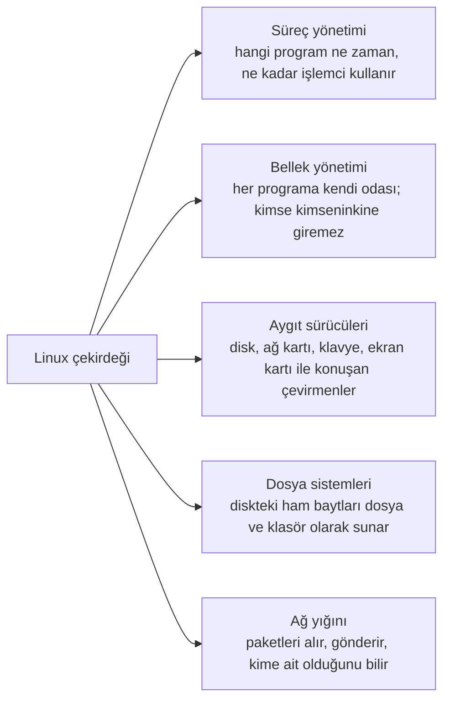

- **Süreç yönetimi.** Çalışan her programa "süreç" (process) denir. İşlemci aynı anda tek bir şey yapabilir
  (çekirdek başına); çekirdek, süreçleri milisaniyelik dilimlerle sırayla işlemciye sokup çıkarır. O kadar hızlı
  yapar ki sen hepsinin aynı anda çalıştığını sanırsın. Bu işi yapan parçaya **zamanlayıcı** (scheduler) denir.
  9. bölümde süreçleri elimizle listeleyip durduracağız.
- **Bellek yönetimi.** Her programa "sadece senin" diye bir bellek alanı verir ve bir programın başkasının
  alanına elini uzatmasını engeller. [Java yazısındaki](/blog/java-nedir) o RAM'deki "kutular" var ya; onların
  gerçekten hangi fiziksel yongada durduğunu program bilmez, çekirdek bilir.
- **Aygıt sürücüleri.** Binlerce farklı disk, ağ kartı, klavye, ekran kartı var ve her biri kendi dilini konuşur.
  Sürücü, o dili bilen çevirmendir. Linux'un dünyanın hemen her donanımında çalışabilmesinin sırrı, çekirdeğin
  içinde gelen devasa sürücü koleksiyonudur.
- **Dosya sistemleri.** Bir disk aslında numaralı bloklardan oluşan bir bayt yığınıdır. "Belgeler klasörünün
  içindeki rapor.txt" gibi bir şeyi diskteki bloklara çeviren katman çekirdektir. 4. ve 11. bölümlerin konusu.
- **Ağ yığını.** İnternete giden ve gelen her paketi çekirdek işler: adresi kime ait, hangi programa teslim
  edilecek, hepsini o bilir. 10. bölümde göreceğiz.

Peki bir program çekirdekten bir şey isteyeceği zaman ne oluyor? Bir lokanta düşün. Müşteri (program) mutfağa
(donanıma) giremez; garsona (çekirdeğe) söyler, garson mutfağa gider, yemeği getirir. Programın çekirdeğe
"şu dosyayı oku" ya da "şu adrese paket gönder" demesinin resmî adı **sistem çağrısı**dır (system call).

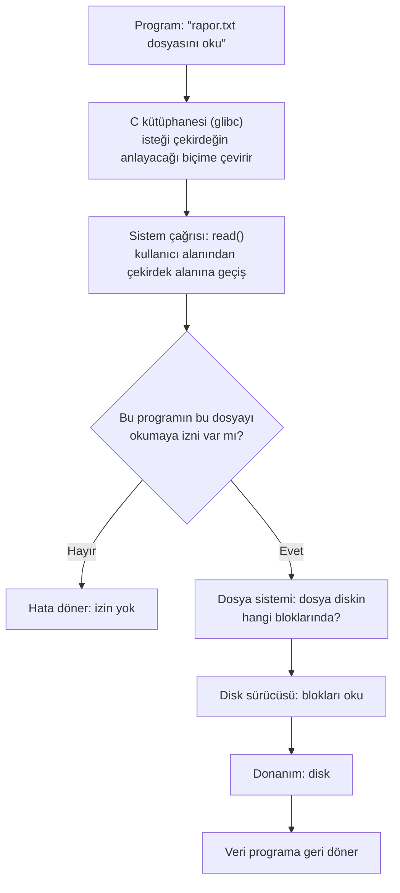

Şemadaki "kullanıcı alanı" ve "çekirdek alanı" ayrımı önemli. Çekirdek, mutfak gibi kapalı bir bölgede çalışır;
programlar salonda oturur. Salonda ne olursa olsun (bir program çökse bile) mutfak ayakta kalır. Bu ayrım, Linux
sunucularının aylarca kapatılmadan çalışabilmesinin nedenlerinden biridir. Bir de o "izin var mı?" sorusuna
dikkat: çekirdek her isteği kimin yaptığına bakarak cevaplar. 6. bölümde kullanıcıları ve izinleri
öğrendiğinde, bu sorunun ne kadar merkezî olduğunu göreceksin.

<Callout type="note" title="Merak edenler için: çekirdek hakkında birkaç rakam">
Linux çekirdeği bugün otuz milyon satırı aşkın koddan oluşuyor ve her sürüme dünyanın dört bir yanından binlerce
kişi katkı veriyor. Kodun büyük kısmı aygıt sürücüleridir; asıl "beyin" görece küçüktür. Çekirdek **monolitik**
bir tasarıma sahiptir: sürücüler ve dosya sistemleri ayrı programlar değil, çekirdeğin parçasıdır; ama bunlar
**modül** olarak ihtiyaç anında yüklenip kaldırılabilir (bir USB aygıtı taktığında olan budur). Çekirdeğin kendi
sürüm numarası vardır (6.12 gibi) ve bu numara birazdan göreceğin dağıtım sürümünden (RHEL 10 gibi) ayrıdır.
Linus Torvalds, 1991'den beri projeyi hâlâ yönetiyor; her yeni sürümü o yayımlıyor.
</Callout>

### Motorun hikâyesi: 1991, Helsinki

Linux'un doğuşu, yazılım tarihinin en sevimli hikâyelerinden biri. 1991 yılında Helsinki Üniversitesi'nde okuyan
21 yaşındaki **Linus Torvalds,** kendi bilgisayarında kullanmak için bir işletim sistemi çekirdeği yazmaya
başlıyor. Ağustos 1991'de bir internet tartışma grubuna şu mesajı gönderiyor (biraz sadeleştirerek çeviriyorum):

> "Merhaba, Minix kullanan herkese. (Ücretsiz) bir işletim sistemi yapıyorum; sadece bir hobi, GNU gibi büyük ve
> profesyonel olmayacak..."

"Sadece bir hobi." O hobi bugün dünyadaki sunucuların büyük çoğunluğunu, en hızlı 500 süper bilgisayarın
**tamamını,** cebindeki Android telefonu, evindeki modemi, akıllı televizyonu, hatta Mars'ta uçan minik
helikopteri çalıştırıyor. Torvalds çekirdeğin adını önce "Freax" koymayı düşünmüş; dosyaları koyduğu sunucunun
yöneticisi klasöre "Linux" adını vermiş ve isim öyle kalmış.

<div style="display:flex;flex-wrap:wrap;gap:1.25rem;justify-content:center;align-items:flex-end;margin:1.5rem 0;">
  <div style="flex:0 1 240px;max-width:240px;">
    <Figure src={torvaldsImg} alt="Linus Torvalds, LinuxCon Europe 2014" caption="Linus Torvalds, çekirdeğin yaratıcısı ve hâlâ yöneticisi (2014). (Foto: Krd, kırpma: Von Sprat, CC BY-SA 4.0, Wikimedia Commons.)" />
  </div>
  <div style="flex:0 1 240px;max-width:240px;">
    <Figure src={stallmanImg} alt="Richard Stallman, 2014" caption="Richard Stallman, GNU projesinin ve özgür yazılım fikrinin kurucusu (2014). (Foto: Thesupermat, CC BY-SA 3.0, Wikimedia Commons.)" />
  </div>
</div>

<Callout type="note" title="Tarih notu: GNU olmasaydı Linux bir motordan ibaret kalırdı">
Torvalds'ın mesajında geçen **GNU,** 1983'te **Richard Stallman**'ın başlattığı bir projeydi. Amacı, herkesin
özgürce kullanıp değiştirebileceği eksiksiz bir Unix benzeri işletim sistemi yazmaktı. 1991'e gelindiğinde
ellerinde neredeyse her şey vardı: derleyici (gcc), kabuk (bash), dosya araçları... Eksik olan tek parça
çekirdekti. Torvalds'ın çekirdeği tam o boşluğa oturdu. Bugün bir Linux dağıtımında yazdığın `ls`, `cp`, `grep`
gibi komutların çoğu aslında GNU projesinin ürünü. Bu yüzden bazıları sisteme ısrarla "GNU/Linux" der; haksız
da sayılmazlar.

Peki "Unix benzeri" ne demek? **Unix,** 1969'da Bell Laboratuvarları'nda Ken Thompson ve Dennis Ritchie'nin
yazdığı, sonraki bütün modern işletim sistemlerine örnek olmuş bir sistem. Linux, Unix'in kodunu kullanmaz ama
fikirlerini, alışkanlıklarını ve komut kültürünü devralır. Terminal bölümüne geldiğimizde bunu çok hissedeceksin.
</Callout>

<Callout type="note" title="Küçük bir tesadüf: iki Ewing">
Linux'un maskotu tombul penguen **Tux**'u 1996'da **Larry Ewing** adlı bir grafiker çizdi. Birazdan tanışacağın
Red Hat'in kurucusu ise **Marc Ewing.** Aynı soyadı taşıyorlar ama akraba değiller; sadece hoş bir tesadüf.
</Callout>

<div style="display:flex;justify-content:center;margin:1.5rem 0;">
  <div style="flex:0 1 180px;max-width:180px;">
    <Figure src={tuxImg} alt="Tux, Linux'un penguen maskotu" caption="Tux. (Çizim: Larry Ewing, Simon Budig ve Garrett LeSage; lewing@isc.tamu.edu ve GIMP ile.)" />
  </div>
</div>

### Linux'un kısa zaman çizelgesi

Red Hat'in kendi zaman çizelgesini birazdan göreceksin; önce motorun kendi yolculuğu. Ezberlemek için değil,
"bu iş ne zamandır dönüyor" hissini almak için.

| Yıl | Olay |
| --- | --- |
| 1969 | Bell Laboratuvarları'nda Unix doğar (Ken Thompson ve Dennis Ritchie) |
| 1983 | Richard Stallman GNU projesini duyurur |
| 1987 | Andrew Tanenbaum, öğrencilere işletim sistemi öğretmek için Minix'i yazar; Torvalds 1991'de bunun üzerinde çalışacak |
| 1991 | Torvalds "sadece bir hobi" mesajını atar; Linux 0.01 yayımlanır |
| 1992 | Linux, GPL lisansına geçer: herkes kullanabilir, değiştirebilir, dağıtabilir |
| 1993 | Debian ve Slackware kurulur; bugün hâlâ yaşayan en eski dağıtımlar |
| 1994 | Linux 1.0; Red Hat Linux'un ilk sürümü |
| 1996 | Tux maskotu çizilir; Linux 2.0 ile çok işlemcili sunuculara giriş |
| 1998 | "Açık kaynak" terimi ortaya çıkar; IBM ve Oracle Linux'u desteklemeye başlar |
| 2003 | SCO davası başlar (aşağıda, Red Hat'in hikâyesinde) |
| 2004 | Ubuntu'nun ilk sürümü |
| 2005 | Torvalds, çekirdek geliştirmeyi yönetmek için Git'i yazar |
| 2007 | Android duyurulur: Linux çekirdeği cebe girer |
| 2011 | Linux 3.0 ile yirminci yıl |
| 2017 | Dünyanın en hızlı 500 süper bilgisayarının tamamı Linux çalıştırıyor |
| 2021 | NASA'nın Ingenuity helikopteri Mars'ta Linux ile uçar |
| 2024 | XZ arka kapısı (aşağıda); Linux 6.12, RHEL 10'un çekirdeği olur |

## Dağıtım (distro): motorun etrafındaki araba

Şimdi araba benzetmesine geri dönelim ve arabanın içine bakalım. Bir Linux dağıtımı, çekirdeğin etrafına neler
koyar? Bu listeyi bilmek, serinin geri kalanının haritasını cebine koymak demek; çünkü her bölüm bu parçalardan
birini açacak.

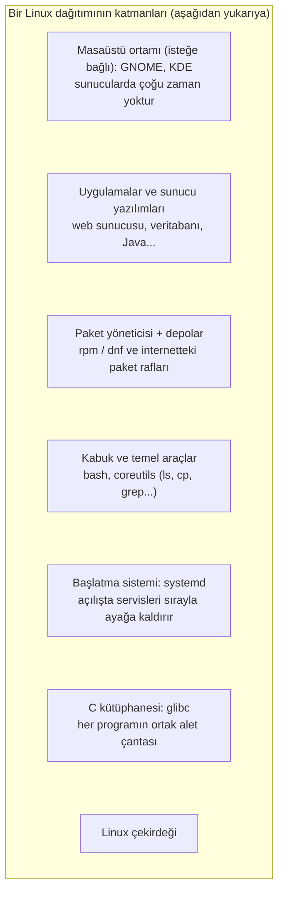

Tek tek, aşağıdan yukarıya:

- **Çekirdek.** Motor. Az önce tanıdın.
- **C kütüphanesi (glibc).** Hemen her programın "dosya aç", "bellek iste", "ekrana yaz" gibi ortak işleri
  yaptığı hazır fonksiyon koleksiyonu. Şemadaki sistem çağrısı akışında garsona giden yol buradan geçiyordu.
  [Fonksiyonlar yazısında](/blog/fonksiyonlar) "bir kere yaz, herkes kullansın" demiştik ya; glibc bunun
  işletim sistemi boyutundaki hâli.
- **Başlatma sistemi (systemd).** Bilgisayar açıldığında çekirdekten sonra çalışan ilk program. Sabah ilk kalkan
  ve evdeki herkesi sırayla uyandıran kişi gibi: ağı başlatır, disk bölümlerini bağlar, web sunucusunu ayağa
  kaldırır, giriş ekranını açar. 8. bölümün konusu.
- **Kabuk ve temel araçlar.** Kabuk (bash), yazdığın komutları alıp çalıştıran programdır; coreutils ise `ls`,
  `cp`, `mkdir` gibi yüzlerce küçük aracın toplu adı. 3. bölümde başlıyoruz.
- **Paket yöneticisi ve depolar.** Program kurup kaldırma altyapısı; birazdan uzun uzun konuşacağız.
- **Uygulamalar ve sunucu yazılımları.** Dağıtımın depolarından kurabildiğin her şey: web sunucusu, veritabanı,
  editörler, Java, Python...
- **Masaüstü ortamı.** Pencereler, menüler, simgeler. RHEL'de varsayılan GNOME'dur. Ama dikkat: bir sunucuda
  çoğu zaman masaüstü **yoktur;** her şey terminalden yönetilir. Bu yüzden terminali erken öğreneceğiz.

Bunların üstüne dağıtım şunları da ekler: bir **kurulum programı** (RHEL'de adı Anaconda; 2. bölümde
kullanacağız), varsayılan **yapılandırma** kararları (hangi güvenlik katmanı açık, hangi dosya sistemi kullanılır),
**belgeler** ve bir **güncelleme akışı.** Yani dağıtım, parçaların toplamından fazlasıdır: parçaların birbirine
uyduğunu test eden, birlikte çalıştıklarına kefil olan, güncellemelerini yıllarca sürdüren bir "üretici".

### Dağıtımlar neden birbirinden farklı?

Aynı motoru kullanan yüzlerce dağıtım varsa, fark nerede? Cevap: fabrikanın verdiği kararlarda. Şu altı başlık,
iki dağıtım arasındaki farkın neredeyse tamamını açıklar.

| Karar | Ne demek? | Örnekler |
| --- | --- | --- |
| **Paket biçimi ve yöneticisi** | Programlar hangi kutuda gelir, hangi araç kurar? | rpm/dnf (Red Hat ailesi), deb/apt (Debian ailesi), pacman (Arch) |
| **Sürüm modeli** | Belirli sürümler mi çıkar, yoksa her gün akan güncellemeler mi? | Sabit sürüm: RHEL, Debian, Ubuntu. Yuvarlanan: Arch, openSUSE Tumbleweed |
| **Destek süresi** | Bir sürüm kaç yıl güncelleme alır? | RHEL 10 yıl, Ubuntu LTS 5 yıl, Fedora 13 ay |
| **Felsefe** | Kararlılık mı, yenilik mi, sadelik mi, özgürlük mü? | RHEL kararlılık, Fedora yenilik, Debian özgür yazılım katılığı, Arch "kendin kur" |
| **Arkasındaki kim** | Şirket mi, topluluk mu, vakıf mı? | Red Hat (RHEL), Canonical (Ubuntu), topluluk (Debian, Arch), vakıf (Alma) |
| **Varsayılanlar** | Hangi masaüstü, hangi güvenlik katmanı, hangi dosya sistemi? | GNOME ve SELinux ve XFS (RHEL), GNOME ve AppArmor ve ext4 (Ubuntu) |

Bir dağıtımı öğrenince diğerleri neden tanıdık geliyor, şimdi görüyorsun: tablodaki kararların hiçbiri
çekirdeği, kabuğu, dosya sistemi mantığını, kullanıcı ve izin sistemini değiştirmiyor. Değişen, paketleme ve
birkaç varsayılan. Kabaca yüzde doksan ortak, yüzde on "aile şivesi".

### Aileler ve çatallama

Dağıtımların çoğu birkaç büyük aileye ayrılır. Bunun nedeni açık kaynağın en güçlü hakkı: **çatallama** (fork).
Kod herkese açık olduğu için, beğenmediğin bir dağıtımı alıp kendi yoluna gidebilirsin. Ubuntu, Debian'ın kodunu
alıp "daha kolay kurulan, daha sık sürüm çıkaran" bir dağıtım yapmak isteyen Canonical'ın 2004'te açtığı bir
çataldır. Linux Mint, Ubuntu'nun çatalı. CentOS, Rocky ve Alma da RHEL'in.

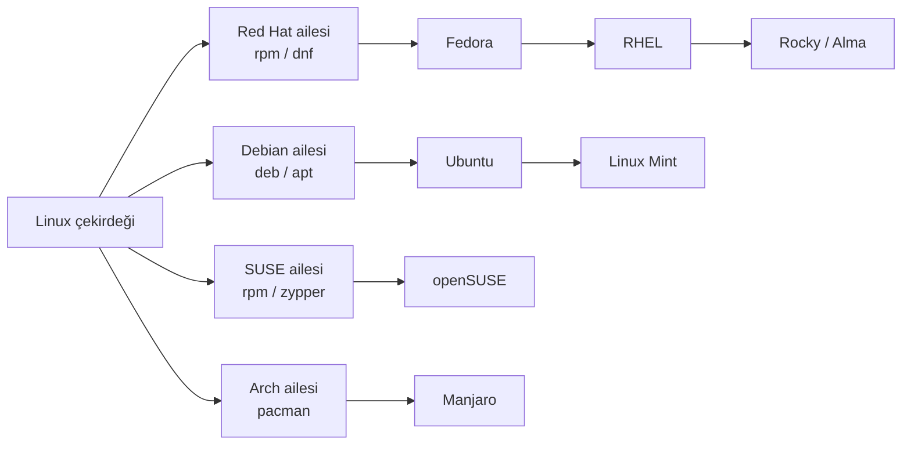

Aileleri birbirinden ayıran en görünür şey, tablonun ilk satırı: paket biçimi. Red Hat ailesi **rpm** paketleri
ve **dnf** aracını kullanır; Debian ailesi **deb** paketleri ve **apt** aracını. Bir Ubuntu'da `apt install`
yazdığın yerde RHEL'de `dnf install` yazarsın, gerisi büyük ölçüde aynıdır.

### Sürüm modelleri: sabit mi, yuvarlanan mı?

Tablodaki ikinci satır, dağıtım seçerken en çok kafa karıştıran konu. İki yaklaşım var:

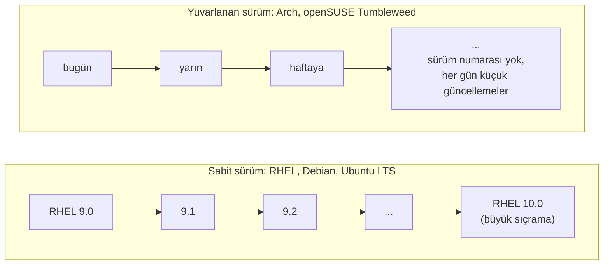

**Sabit sürüm** (point release) modelinde dağıtım belirli aralıklarla numaralı sürümler çıkarır; bir sürüm
çıktıktan sonra içindeki programların büyük sürümleri **değişmez,** yalnızca hata ve güvenlik düzeltmeleri gelir.
Bir şirketin sunucusu için istediğin şey budur: bugün çalışan şey, yarınki güncellemeden sonra da aynı şekilde
çalışsın. **Yuvarlanan sürüm** (rolling release) modelinde ise sürüm numarası yoktur; her gün en yeni programlar
akar. Meraklı bir masaüstü kullanıcısı için keyifli, bir banka sunucusu için kâbus.

RHEL sabit sürüm modelinin en katı örneklerinden biridir ve bunu bir tempo hâline getirmiştir: yaklaşık **üç
yılda bir büyük sürüm** (RHEL 8, 9, 10), **altı ayda bir küçük sürüm** (9.4, 9.5, 9.6...) ve her büyük sürüm için
**on yıl destek.** Sürüm numarasını şöyle okursun: `10.2` → büyük sürüm 10 (hangi "nesil"), küçük sürüm 2 (o
neslin kaçıncı güncelleme paketi).

<Callout type="important" title="Dağıtım sürümü ile çekirdek sürümü ayrı şeylerdir">
"RHEL 10" bir dağıtım sürümüdür; içindeki çekirdeğin kendi sürümü ise 6.12'dir. RHEL 9'da çekirdek 5.14, RHEL
8'de 4.18'di. Bir dağıtım, çıktığı andaki çekirdeği alır ve on yıl boyunca **o çekirdek üzerinde** kalır; yeni
özellikler ve düzeltmeler ona ayrıca taşınır (bu "taşıma" işine birazdan paketler bölümünde geri döneceğiz).
Yani "RHEL 9'da çekirdek 5.14 mü, o eski değil mi?" sorusunun cevabı: numara eski görünür, içindeki kod
değildir.
</Callout>

### RHEL ile Ubuntu'nun farkı ne?

"Linux" deyince çoğu kişinin aklına ilk gelen isim Ubuntu; iş dünyasında en çok karşılaşacağın isim ise RHEL.
İkisini yan yana koymak, yukarıdaki tablonun en somut örneği ve "hangisini öğrenmeliyim?" sorusunun cevabı.

Önce ortak nokta: ikisi de aynı motoru, Linux çekirdeğini kullanır. İkisinde de systemd, bash, GNOME, aynı dizin
ağacı, aynı kullanıcı ve izin mantığı, aynı `ls`, `cp`, `grep` vardır. Bir Ubuntu makinesinde öğrendiğin
şeylerin yüzde doksanı RHEL'de aynen geçer, tersi de öyle. Fark, iki fabrikanın verdiği kararlarda:

| | **Ubuntu** | **RHEL** |
| --- | --- | --- |
| Kim yapıyor? | Canonical (2004, Mark Shuttleworth), Debian'ın çatalı | Red Hat (1995), Fedora'dan türer |
| Paketleme | `.deb` paketleri, `apt` | `.rpm` paketleri, `dnf` |
| Sürüm temposu | Altı ayda bir sürüm; iki yılda bir **LTS** (24.04, 26.04...) | Üç yılda bir büyük sürüm (9, 10); altı ayda bir küçük sürüm |
| Destek süresi | LTS için 5 yıl ücretsiz; Ubuntu Pro ile 10 yıl ve üzeri | Her büyük sürüm için 10 yıl; ek ücretle uzatılabilir |
| Ücret modeli | Herkese ücretsiz, destek istersen Ubuntu Pro | Güncellemeler aboneliğe bağlı; bireysel geliştirici aboneliği ücretsiz |
| Güvenlik katmanı | AppArmor | SELinux (12. bölüm) |
| Varsayılan dosya sistemi | ext4 | XFS |
| Güvenlik duvarı aracı | ufw | firewalld (13. bölüm) |
| Konteyner aracı | Docker yaygın (Snap ile de gelir) | Podman yerleşik (14. bölüm) |
| Ek paket biçimi | Snap | Flatpak |
| Yönetici hesabı | root kilitli, ilk kullanıcı `sudo` ile yönetir | root açık; ayrıca `sudo` yetkili kullanıcı |
| Nerede yaygın? | Masaüstü, geliştirici bilgisayarları, bulut sanal makineleri, WSL | Bankalar, telekom, kamu, düzenlemeye tabi sektörler, büyük şirket sunucuları |
| Sertifika | Resmî bir sertifika yolu yok denecek kadar az | RHCSA, RHCE, RHCA |

Tabloyu okuduktan sonra iki şeyi ayırt et. Birincisi, **felsefe farkı:** Ubuntu "herkes için, hemen, ücretsiz"
diyor; RHEL "on yıl aynı kalsın, biri kefil olsun, gerekirse arayabileyim" diyor. İkisi de haklı; farklı
ihtiyaçlara cevap veriyorlar. Ubuntu'nun adı bile bunu anlatır: Zulu ve Xhosa dillerinde "insanlık, birlikte
var olma" demek. İkincisi, **komut farkı:** günlük işte hissedeceğin farklar birkaç araçtan ibaret. `apt`
yerine `dnf`, `ufw` yerine `firewalld`, AppArmor yerine SELinux. Bunları serinin ilgili bölümlerinde
öğrendiğinde, bir Ubuntu makinesine oturduğunda yalnızca "karşılığı neydi?" diye düşünmen yeterli olacak.

<Callout type="tip" title="Peki hangisini öğrenmeliyim?">
Kısa cevap: hangisini seçersen seç, Linux öğreniyorsun; ikisi arasında geçiş birkaç gün sürer. Uzun cevap:
kendi bilgisayarında günlük kullanım ve hobi için Ubuntu gayet iyi bir başlangıç. Ama hedefin sistem
yöneticiliği, kurumsal sunucular ya da Türkiye'deki banka ve telekom gibi büyük kurumlarda iş ise RHEL ailesi
sana daha çok kapı açar; hem iş ilanlarında hem de tanınan bir sertifika yolu olması bakımından. Bu seri o yolu
izliyor; ama her bölümde "Ubuntu'da bunun karşılığı şudur" diye küçük notlar düşeceğim ki iki dünyada da rahat
edesin.
</Callout>

<Callout type="note" title="Türkiye notu: Pardus">
Aile ağacında Türkiye'nin de bir dalı var. **Pardus,** TÜBİTAK'ın geliştirdiği yerli Linux dağıtımı; adını
Anadolu parsının bilimsel adından (Panthera pardus) alıyor. İlk sürümü 2005'te çıktı; o yıllarda kendi paket
yöneticisi (PiSi) olan bağımsız bir dağıtımdı. 2013'ten beri Debian tabanlı, yani Ubuntu'nun kuzeni; `apt` ile
çalışıyor. Kamu kurumlarında, adliyelerde ve okullarda kullanılıyor; Pardus 23, Debian 12 üzerine kurulu. Bu
seride öğreneceklerinin büyük kısmı Pardus'ta da geçerli; farklılaşan yer yine paket yöneticisi. Red Hat'in
kendisi de Türkiye'de ofisi ve iş ortaklarıyla var; bankacılık ve telekomdaki RHEL kurulumlarını bu ekosistem
taşıyor.
</Callout>

### Öteki kurumsal Linux'lar: SUSE, Oracle, Amazon

RHEL ile Ubuntu bu pazarın en görünür iki yüzü ama tek oyuncular değil. Bir sunucu odasında karşına şunlar da
çıkabilir:

| Dağıtım | Kim, ne zaman? | Aile | Öne çıkan |
| --- | --- | --- | --- |
| **SUSE Linux Enterprise (SLES)** | SUSE, Almanya, 1992; ticari dağıtımların en eskisi | Kendi ailesi: rpm / zypper | SAP sistemlerinin standardı; YaST yönetim aracı; 10 yılı aşan destek; topluluk sürümü openSUSE |
| **Oracle Linux** | Oracle, 2006 | RHEL uyumlu (Red Hat'in kaynak kodundan derlenir) | İndirmesi ücretsiz, desteği ücretli; Oracle veritabanı müşterileri için; isteğe bağlı kendi çekirdeği (UEK) |
| **Amazon Linux** | Amazon Web Services, 2011; Amazon Linux 2023 sürümü Fedora tabanlı | Red Hat ailesi: rpm / dnf | Yalnızca AWS bulutunda; AWS müşterilerine ücretsiz; bulut araçlarıyla bütünleşik |
| **Rocky Linux / AlmaLinux** | Topluluk, 2021 | RHEL uyumlu | Ücretsiz; isteyen CIQ ya da TuxCare gibi şirketlerden ücretli destek alır |
| **Debian** | Topluluk, 1993 | Debian: deb / apt | Ubuntu'nun ve Pardus'un ebeveyni; arkasında şirket yok, destek üçüncü partiden; sunucularda çok yaygın |

Ortak nokta: hepsinde aynı çekirdek, aynı kabuk, aynı komut kültürü. Fark yine paketleme, destek modeli ve
arkasındaki kurum.

Bir de donanım tarafı var. RHEL yalnızca bildiğin PC işlemcilerinde (x86_64) değil; telefonlardaki ve
Raspberry Pi'daki türden ARM işlemcilerde, IBM'in Power sunucularında ve bankaların hâlâ kullandığı IBM Z
anabilgisayarlarında (mainframe) da çalışır. [Java yazısındaki](/blog/java-nedir) "bir kez yaz, her yerde
çalıştır" sözü işletim sistemi katında da geçerli: aynı RHEL, aynı komutlar, bambaşka demir.

### Üst akım ve alt akım: nehir benzetmesi

Son bir kavram, sonra Red Hat'in hikâyesine geçiyoruz. Bir dağıtım, içindeki binlerce programın hiçbirini kendisi
yazmaz. Çekirdeği Torvalds'ın ekibi, bash'i GNU projesi, GNOME'u GNOME topluluğu, web sunucusunu Apache vakfı
geliştirir. Bu projelere **üst akım** (upstream) denir; dağıtım ise **alt akım**dır (downstream): nehrin
yukarısından gelen suyu toplayıp şişeleyen tesis.

Bu nehir tek yönlü değildir. Dağıtım bir hata bulup düzelttiğinde, düzeltmeyi yukarıya, üst akıma gönderir ki
herkes yararlansın. Red Hat'in bu konuda bir ilkesi var: **"önce üst akım"** (upstream first). Bir özelliği
RHEL'e koymadan önce onu asıl projeye kabul ettirir. Bu yüzden Red Hat, Linux çekirdeğinin ve pek çok temel
projenin en büyük katkıcılarından biridir. Aile ağacına geldiğimizde bu nehri Fedora'dan RHEL'e kadar
izleyeceğiz.

<Callout type="important" title="Neden bu seride Red Hat ailesi?">
İki nedenle. Birincisi, iş dünyası: bankaların, telekom şirketlerinin, kamu kurumlarının ve büyük şirketlerin
sunucularında en sık karşına çıkacak Linux, RHEL ya da onunla uyumlu bir dağıtımdır. Bir gün "sunucuya bağlan,
şu servisi yeniden başlat" denildiğinde karşında büyük ihtimalle bu aile olacak. İkincisi, yol: Red Hat'in RHCSA
sertifikası, Linux sistem yönetimi için dünyada en çok tanınan giriş sertifikalarından biri ve müfredatı yeni
başlayan biri için gayet iyi bir ders planı. Biz o planı takip edeceğiz ama sınav ezberi yapmayacağız; her
konuyu anlayarak geçeceğiz.
</Callout>

## Paketler ve paket yöneticisi: Linux'ta program nasıl kurulur?

Dağıtımın katmanlarında "paket yöneticisi"ni "birazdan" diye geçmiştik. Şimdi sırası, çünkü bu kavram Linux'a
yeni gelenlerin en çok yabancılık çektiği yer. Windows'ta program kurmak nasıl olur? Bir web sitesine gidersin,
`setup.exe` indirirsin, "İleri, İleri, Son" dersin. Her program kendi kurulumunu kendi getirir; ne yaptığını pek
bilmezsin; güncellemeleri her program ayrı ayrı kendi kontrol eder.

Linux dünyası bunu tam tersinden çözer: telefonundaki **uygulama mağazası** gibi. Dağıtım, binlerce programı
kendi raflarında hazır tutar. Sen "şunu istiyorum" dersin; sistem programı raftan alır, ihtiyaç duyduğu diğer
parçaları da yanına ekler, kurar, kaydını tutar ve hepsini tek komutla güncel tutar. Bu düzenin üç temel taşı var:
**paket, bağımlılık ve depo.**

### Paket nedir?

Bir paket, tek bir programın (ya da kütüphanenin) kurulmak için gereken her şeyini içeren kutudur. Red Hat
ailesinde bu kutuların uzantısı `.rpm`'dir. IKEA'dan aldığın bir kutu gibi düşün: içinde parçalar var, üstünde ne
olduğu yazıyor, içinde montaj talimatı var ve "bunun için şu vidalar da gerekir" diyen bir liste.

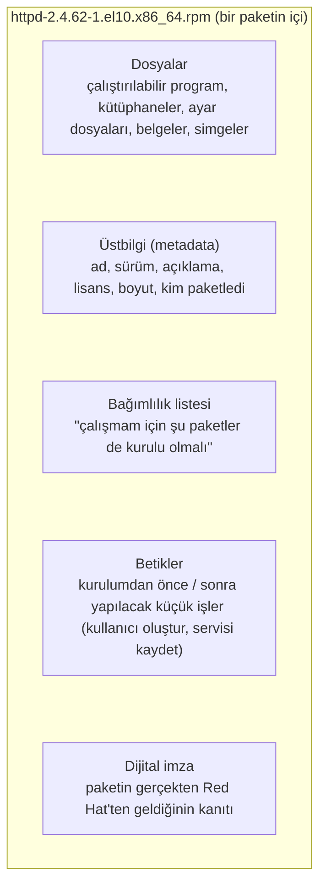

Şemadaki dosya adını da okumayı öğren, çünkü sürekli göreceksin: `httpd-2.4.62-1.el10.x86_64.rpm`. Parçaları:
**httpd** (paketin adı, bu bir web sunucusu), **2.4.62** (programın kendi sürümü), **1** (paketleyicinin kaçıncı
denemesi), **el10** (Enterprise Linux 10 için paketlenmiş), **x86_64** (hangi işlemci mimarisi için). Tek bir
dosya adından bile o kadar şey öğreniyorsun.

### Bağımlılık: kimse tek başına değil

Modern programlar tek başına yaşamaz. Bir web sunucusu, şifreleme için ayrı bir kütüphane kullanır; o kütüphane
sıkıştırma için başka bir kütüphaneye yaslanır; o da C kütüphanesine. Her program bu kütüphanelerin kendi
kopyasını taşısaydı diskte aynı şeyden yüzlerce kopya olurdu ve bir güvenlik açığı çıktığında yüzlerce yeri
düzeltmek gerekirdi. Onun yerine kütüphane **bir kez** kurulur, herkes onu paylaşır. Bir programın "çalışmam için
şunlar kurulu olmalı" listesine **bağımlılık** (dependency) denir.

Güzel fikir, ama bir tuzağı var ve o tuzak Linux tarihinin en meşhur baş ağrısını doğurdu.

<Callout type="note" title="Tarih notu: bağımlılık cehennemi ve paket yöneticilerinin doğuşu">
1990'larda paketler vardı ama onları depodan çekip bağımlılıklarını çözecek bir araç yoktu. Bir programı kurmak
istersin, "şu kütüphane eksik" der; onu bulup indirirsin, "o da şuna bağımlı" der; üçüncüyü indirirsin, bu sefer
kurulu bir başka programın istediği sürümle çakışır... Bu döngüye **bağımlılık cehennemi** (dependency hell)
dendi ve o yılların Linux'unu ürkütücü yapan şeylerden biriydi.

Çözüm iki adımda geldi. Önce paket biçimleri standartlaştı: Debian'ın **dpkg**'si (1994) ve Red Hat'in **rpm**'i
(1995, Marc Ewing ve Erik Troan). Sonra bu biçimlerin üstüne, depolara bakıp bağımlılık zincirini **kendiliğinden**
çözen üst katman araçlar yazıldı: Debian tarafında **apt** (1998), Red Hat tarafında önce **yum** (2003'te Duke
Üniversitesi'nde Seth Vidal'ın yazdığı "Yellowdog Updater, Modified"), 2015'ten itibaren onun yeniden yazılmış
hâli **dnf** (Fedora 22'de, RHEL'de 8. sürümden beri varsayılan). Bugün "eksik kütüphane" derdi neredeyse yok;
dnf o zinciri senin yerine takip ediyor.
</Callout>

### Depo: raflar ve katalog

Paketler nerede duruyor? İnternet üzerindeki **depolarda** (repository). Bir depo iki şeyden oluşur: paket
dosyalarının kendisi (raflar) ve hangi paketin hangi sürümünün orada olduğunu, neye bağımlı olduğunu anlatan bir
**katalog** (metadata). Paket yöneticisi önce kataloğu indirir, sonra ne alacağına oradan bakar. Aynı deponun
dünyanın farklı yerlerinde kopyaları vardır; bunlara **ayna** (mirror) denir, sana en yakınından indirirsin.

RHEL'de ana depolar aboneliğine bağlıdır ve ikiye ayrılır: **BaseOS** (işletim sisteminin çekirdek parçaları) ve
**AppStream** (uygulamalar, diller, sunucu yazılımları; bunların bazıları birden fazla sürümle sunulur). Bunların
dışında topluluğun RHEL için sürdürdüğü **EPEL** gibi ek depolar da vardır; ana depoda olmayan bir programı
çoğu zaman oradan bulursun.

Bir de güven meselesi var. İnternetten indirdiğin bir paketin gerçekten Red Hat'ten geldiğini, yolda birinin
içine bir şey katmadığını nereden bileceksin? Her paket, Red Hat'in gizli anahtarıyla **imzalanır;** senin
sistemin ise Red Hat'in açık anahtarını tanır ve her paketi kurmadan önce imzayı doğrular. Mağazadaki hologram
etiketi gibi: imza tutmuyorsa paket kurulmaz. 7. bölümde bunu kendi gözünle göreceksin.

### İki katman: rpm ve dnf

Red Hat ailesinde paket işi iki araca bölünmüştür ve ikisini karıştırmak çok yaygın.

- **rpm** alt katmandır. Tek bir `.rpm` dosyasını kurar, kaldırır, "bu dosya hangi paketten geldi?" gibi sorulara
  cevap verir ve kurulu her paketin kaydını tuttuğu bir **veritabanı** yönetir. Ama depolara bakmaz, bağımlılık
  indirmez; sen ona ne verirsen onu kurar. Depodaki görevli gibi: kutuyu rafa koyar, defterine yazar.
- **dnf** üst katmandır. Depoları tarar, istediğin paketi bulur, bağımlılık zincirini çözer, hepsini indirir,
  imzaları doğrular ve kurulumu rpm'e yaptırır. Satın alma müdürü gibi: "şunu istiyorum" dersin, gerisini o
  halleder.

Günlük işte dnf kullanırsın; rpm'i çoğunlukla sorgulamak için elinde tutarsın. `dnf install httpd` dediğinde
perde arkasında olanları takip edelim:

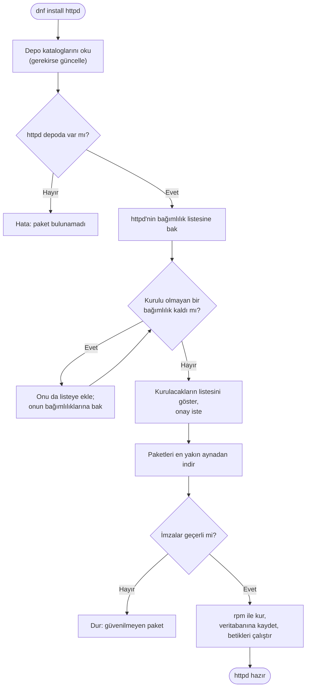

Şemadaki döngüye dikkat: "kurulu olmayan bağımlılık kaldı mı?" sorusu, cevap "hayır" olana kadar tekrar sorulur.
[Döngüler yazısında](/blog/donguler) "tekrar sorulan karar" diye anlattığımız şey tam olarak bu. Bir web sunucusu
için bu döngü birkaç tur döner; büyük bir masaüstü ortamı için yüzlerce.

<Callout type="tip" title="Sadece görmek için: birkaç komut">
Şimdi yazman gerekmiyor, sadece nasıl göründüklerini bil. 7. bölümde hepsini gerçek bir makinede deneyeceğiz.

```text title="dnf ve rpm, ilk bakış" showLineNumbers=false
dnf install httpd      # paketi (ve bağımlılıklarını) kur
dnf remove httpd       # kaldır
dnf update             # kurulu her şeyi depodaki yeni sürümlere güncelle
dnf search editor      # depoda ara
rpm -q httpd           # kurulu mu, hangi sürüm?
rpm -qf /usr/bin/ls    # bu dosya hangi paketten geldi?
```
</Callout>

### Güncelleme ve "RHEL'deki sürümler neden eski görünüyor?"

`dnf update` dediğinde dnf, kurulu paketlerin sürümlerini depo kataloğuyla karşılaştırır ve yenisi olanları
indirip kurar. Buraya kadar basit. Ama RHEL'in sabit sürüm modeliyle birleşince yeni başlayanları şaşırtan bir
durum ortaya çıkar: "RHEL 9'da Python 3.9 var, oysa dünyada Python 3.13 çıktı; bu sistem güncel değil mi?"

Cevap, **geri taşıma** (backport) kavramında. RHEL bir sürüm çıkardığında içindeki programların büyük sürümlerini
on yıl boyunca **dondurur;** çünkü kurumsal müşteri "bugün çalışan yarın da aynı çalışsın" ister. Ama güvenlik
açıkları ve önemli hatalar bekleyemez. Red Hat'in mühendisleri bu düzeltmeleri programın yeni sürümünden alıp
eski sürüme **geri taşır:** sürüm numarası 3.9 kalır, ama içindeki kod yamalıdır. Yani RHEL'de eski görünen bir
sürüm numarası, "güncellenmemiş" değil, "kasıtlı olarak sabit tutulup ayrıca yamalanmış" demektir. Üst akımda
yeni bir özelliğe ihtiyacın varsa, AppStream depoları bazı diller ve araçlar için birden fazla sürümü yan yana
sunar.

### Öteki kutular: deb, Flatpak ve konteynerler

Paket biçimi aileye göre değişir ama fikir aynıdır: Debian ailesinde `.deb` paketleri ve apt, SUSE'de rpm ve
zypper, Arch'ta pacman. Son yıllarda bir de "her dağıtımda çalışsın" diye tasarlanmış evrensel biçimler çıktı:
**Flatpak** (masaüstü uygulamaları için, Fedora ve Red Hat'in desteklediği), **Snap** (Ubuntu'nun) ve
**AppImage** (tek dosya, kurulumsuz). Sunucu tarafında ise paketlemenin en yeni hâli **konteyner imajı**dır:
program, bağımlılıklarıyla birlikte tek bir kutuya konur ve her yerde aynı çalışır. Serinin 14. bölümünde Podman
ile bunu yapacağız; o zaman "bu da bir paket yöneticisi aslında" diyeceksin.

| Aile | Paket biçimi | Alt katman | Üst katman (günlük kullanım) |
| --- | --- | --- | --- |
| Red Hat (RHEL, Fedora, Rocky, Alma) | `.rpm` | `rpm` | `dnf` |
| Debian (Debian, Ubuntu, Mint) | `.deb` | `dpkg` | `apt` |
| SUSE (openSUSE, SLES) | `.rpm` | `rpm` | `zypper` |
| Arch (Arch, Manjaro) | `.pkg.tar.zst` | `pacman` | `pacman` |
| Evrensel (masaüstü) | Flatpak, Snap, AppImage | — | `flatpak`, `snap` |
| Konteyner | imaj (OCI) | — | `podman`, `docker` |

## Kırmızı şapkanın hikâyesi

Şimdi serinin adını taşıyan şirkete gelelim. Red Hat'in hikâyesi iki kişiyle başlıyor ve ikisi de başlangıçta
birbirini tanımıyor.

### Marc Ewing ve dedesinin şapkası

1990'ların başında **Marc Ewing,** Pittsburgh'daki Carnegie Mellon Üniversitesi'nde okuyan bir bilgisayar
öğrencisi. Kampüste onu herkes tanıyor, çünkü sürekli aynı şapkayı takıyor: dedesinden kalma, kırmızı bir
Cornell Üniversitesi lakros şapkası. Bilgisayar laboratuvarında sıkışan öğrencilere "kırmızı şapkalı çocuğu
bul, o çözer" deniyor. Ewing kendi yazılım projelerine de bu şapkanın adını veriyor.

Mezun olduktan sonra Ewing, Linux için o zamana kadar yapılanlardan daha kolay kurulan, daha derli toplu bir
dağıtım hazırlamaya koyuluyor. 1994'ün sonbaharında, Cadılar Bayramı'na denk gelen bir günde ilk sürümü
yayımlıyor; adı **Red Hat Linux.** O sürüm bugün hâlâ "Halloween sürümü" diye anılıyor. Ewing'in dağıtımını
farklı kılan şeylerden biri, az önce tanıdığın **RPM** paket sistemiydi; bunu Erik Troan'la birlikte yazdı ve
rpm otuz yıl sonra hâlâ bu ailenin temel taşı.

### Bob Young ve kaputu kaynaklı araba

Aynı yıllarda Kanadalı bir girişimci olan **Bob Young,** katalogla Unix ve Linux yazılımları ve kitapları satan
**ACC Corporation** adında küçük bir şirket işletiyor. Young, müşterilerinin en çok Ewing'in Red Hat Linux'unu
istediğini fark ediyor. 1995'te Ewing'in işini satın alıp kendi şirketiyle birleştiriyor ve **Red Hat Software**
doğuyor. Ewing teknik tarafı, Young işi yönetiyor. Şirket Kuzey Carolina'ya, bugün hâlâ merkezinin bulunduğu
Raleigh bölgesine yerleşiyor.

<div style="display:flex;flex-wrap:wrap;gap:1.25rem;justify-content:center;align-items:flex-end;margin:1.5rem 0;">
  <div style="flex:0 1 230px;max-width:230px;">
    <Figure src={bobYoungImg} alt="Bob Young, 2014" caption="Bob Young, Red Hat'in kurucu ortağı ve ilk CEO'su (2014). (Foto: Tendenci Software, CC BY 2.0, Wikimedia Commons.)" />
  </div>
  <div style="flex:0 1 340px;max-width:340px;">
    <Figure src={redHatTowerImg} alt="Red Hat Tower, Raleigh" caption="Red Hat Tower, şirketin Raleigh'deki genel merkezi (2013). (Foto: Mark Turner, CC0, Wikimedia Commons.)" />
  </div>
</div>

Young'ın o dönemde herkese anlattığı bir benzetme var ve bence hâlâ açık kaynağı en iyi anlatan cümlelerden
biri:

> "Kaputu kaynakla kapatılmış bir araba satın alır mıydınız?"

Kapalı kaynaklı yazılım, kaputu kaynaklı arabadır: içine bakamazsın, tamirini yalnızca üretici yapabilir, sorun
çıkınca beklersin. Açık kaynaklı yazılımda kaput açıktır; istersen kendin bakarsın, istersen başka bir tamirciye
götürürsün. Peki o zaman Red Hat neyi satıyor? Bu sorunun cevabı birazdan, ayrı bir başlıkta.

### Yıllar içinde

Buradan sonrasını duraklar hâlinde görelim, sonra önemli olanlarda tek tek duracağız.

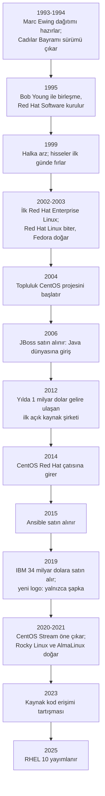

**1999: Wall Street'te bir gün.** Ağustos 1999'da Red Hat halka açıldı ve hisse fiyatı ilk günde birkaç katına
çıktı; o güne kadarki en büyük ilk gün yükselişlerinden biriydi. "Bedava dağıtılan bir yazılımdan şirket mi
olur?" diyenlere ilk cevap buydu.

**2002-2003: Büyük karar.** O zamana kadar Red Hat Linux hem meraklılara hem şirketlere aynı üründü ve kutuda
satılıyordu. 2002'de şirketler için ayrı, uzun süre desteklenen bir sürüm çıktı: **Red Hat Enterprise Linux.**
2003'te ise Red Hat Linux 9 ile eski ürün sona erdirildi ve topluluk tarafı **Fedora** adıyla ayrı bir projeye
dönüştü. (Fedora, bir fötr şapka türü; logo ile uyumu tesadüf değil.) Bu ayrım, birazdan göreceğin aile
ağacının temelidir.

**2004: CentOS.** RHEL'in kaynak kodu açıktı; topluluktan bir grup bu kodu alıp Red Hat markalarını çıkararak
ücretsiz, birebir uyumlu bir sürüm derledi: **CentOS** (Community Enterprise Operating System). Yıllarca "bedava
RHEL" olarak küçük şirketlerin ve hobicilerin gözdesi oldu. 2014'te Red Hat, CentOS projesini kendi çatısı
altına aldı.

<Callout type="note" title="Tarih notu: SCO davası ve &quot;Linux kullanmak yasal mı?&quot; korkusu">
2003'te SCO Group adlı bir şirket, Unix'in haklarının kendisinde olduğunu ve Linux'un içine Unix kodu
sızdırıldığını öne sürerek IBM'e milyar dolarlık bir dava açtı; ardından Linux kullanan yüzlerce büyük şirkete
"lisans ücreti ödeyin" mektupları gönderdi. Bir anda şirketlerin kafasında şu soru belirdi: "Linux kullanırsak
bizi de mi dava ederler?" Red Hat, o yılın Ağustos'unda SCO'ya karşı dava açtı ve müşterilerine bir söz verdi:
Red Hat ürünlerini kullandığınız için bir hukuki sorun çıkarsa arkanızda biz varız. 2004'te bu söz **Open
Source Assurance** adlı bir programa dönüştü; aboneliğin "hukuki güvence" maddesi buradan geliyor. Davanın
sonu: 2007'de mahkeme Unix'in telif haklarının SCO'da değil Novell'de olduğuna hükmetti, SCO aynı yıl iflas
başvurusu yaptı; IBM ile son kırıntılar ancak 2021'de bir uzlaşmayla kapandı. Linux'ta çalıntı kod olduğuna dair
hiçbir kanıt bulunamadı. Bu dava, açık kaynağın kurumsal dünyada "güvenle kullanılır" damgasını almasında dönüm
noktası oldu.
</Callout>

**2006 ve sonrası: Java dünyası.** Red Hat, Java uygulama sunucusu **JBoss**'u satın aldı. Bu blogda adı sık sık
geçecek olan Quarkus'un da Red Hat'in ürünü olduğunu duyunca artık şaşırmayacaksın. Yani bu iki seri
sandığından daha yakın: Java'yı orada öğreniyorsun, o Java'nın koştuğu sunucuyu burada.

**2019: IBM.** Ekim 2018'de duyurulan ve Temmuz 2019'da tamamlanan anlaşmayla **IBM, Red Hat'i 34 milyar
dolara** satın aldı; o güne kadarki en büyük yazılım satın almasıydı. Red Hat, IBM içinde ayrı bir şirket gibi
çalışmayı sürdürdü. Aynı yıl logo da değişti: yıllardır kullanılan, şapkanın altındaki gölgeli yüz ("Shadowman")
gitti, geriye yalnızca kırmızı şapka kaldı.

**2020-2021: CentOS Stream ve yeni klonlar.** Aralık 2020'de Red Hat, klasik CentOS Linux'u sonlandıracağını ve
odağın **CentOS Stream**'e kayacağını duyurdu. Stream, RHEL'in bir sonraki sürümünün sürekli güncellenen ön
izlemesi; yani RHEL'in "birebir kopyası" değil, "bir adım önü". Bedava RHEL kopyasına alışmış topluluk bu
karardan hoşlanmadı ve 2021'de iki yeni proje doğdu: CentOS'un kurucularından Gregory Kurtzer'in başlattığı
**Rocky Linux** (adını, hayatını kaybeden CentOS kurucu ortağı Rocky McGaugh'dan alıyor) ve CloudLinux
şirketinin başlattığı **AlmaLinux** ("alma", birçok dilde "ruh" demek).

<Callout type="note" title="Tarih notu: 2023'te kaynak kod tartışması">
Haziran 2023'te Red Hat, RHEL'in kaynak kodunu herkese açık depolarda yayımlamayı bırakıp yalnızca abonelerine
sunmaya başladı; herkese açık kalan tek kaynak CentOS Stream oldu. Bu karar açık kaynak dünyasında epey
tartışıldı. Rocky ve Alma yollarını buna göre ayarladı: Rocky, koda farklı yollardan ulaşıp birebir uyumu
sürdürme peşinde; Alma ise "birebir kopya" iddiasını bırakıp "RHEL ile uyumlu" olmayı hedefliyor. Yeni başlayan
biri olarak senin için pratik sonucu şu: bu dağıtımlarda öğreneceğin komutlar ve kavramlar hâlâ aynı.
Tartışmanın kendisi ise açık kaynağın "kod açık olsun" ilkesiyle "şirket para kazansın" gerçeğinin nerede
çarpıştığını gösteren güzel bir ders.
</Callout>

## Aile ağacı: üst akımdan Fedora'ya, Fedora'dan RHEL'e

Bütün bu isimleri tek bir resme oturtalım. Nehir benzetmesini hatırla: su yukarıdan aşağıya akıyor.

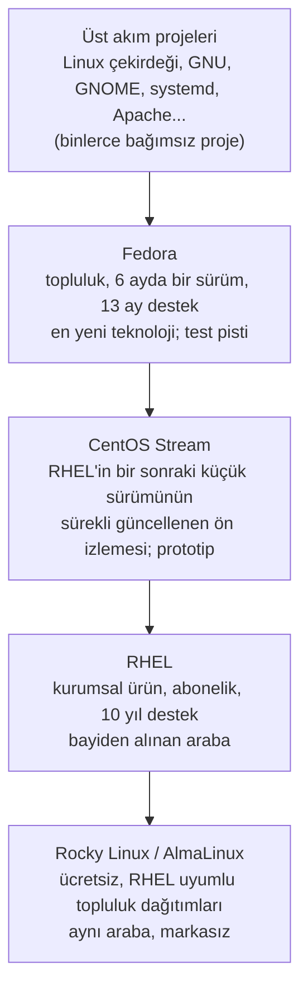

Bir benzetmeyle: Fedora, bir otomobil markasının **konsept araçları ve test pisti.** Yeni fikirler önce burada
denenir; heyecanlı ama bazen sarsıntılı. CentOS Stream, **seri üretime girmek üzere olan prototip:** neredeyse
bitmiş, bir sonraki modelde ne olacağını gösteriyor. RHEL, **bayiden aldığın araba:** yıllarca test edilmiş,
garantili, on yıl boyunca yedek parçası (güncellemesi) çıkan. Rocky ve Alma ise **aynı fabrikanın çıktısını
başka bir markayla satan** üreticiler: araba aynı, garanti ve bayi desteği yok, ama bedava.

Bu akış somut: her RHEL sürümü belirli bir Fedora sürümünün dondurulmuş ve yıllarca cilalanmış hâlidir. RHEL 8,
Fedora 28'den; RHEL 9, Fedora 34'ten; RHEL 10, Fedora 40'tan türedi. Fedora'da bugün gördüğün bir yenilik,
iki-üç yıl sonra RHEL'de karşına çıkar.

### RHEL'in sürüm tarihi

Her sürümü ezberlemene gerek yok; ama tabloya bir göz atarsan hem RHEL'in temposunu hem de Linux'un son yirmi
yılda nasıl değiştiğini görürsün.

| Sürüm | Yıl | Çekirdek | Neler getirdi? |
| --- | --- | --- | --- |
| RHEL 2.1 | 2002 | 2.4 | İlk kurumsal sürüm (o zamanki adı Advanced Server) |
| RHEL 3 | 2003 | 2.4 | "Red Hat Enterprise Linux" adı; birçok işlemci mimarisi |
| RHEL 4 | 2005 | 2.6 | SELinux ilk kez varsayılan olarak açık (12. bölüm) |
| RHEL 5 | 2007 | 2.6 | Sanallaştırma (Xen) yerleşik |
| RHEL 6 | 2010 | 2.6.32 | KVM sanallaştırma, ext4 dosya sistemi |
| RHEL 7 | 2014 | 3.10 | **systemd** (8. bölüm), XFS varsayılan, firewalld (13. bölüm), Docker desteği |
| RHEL 8 | 2019 | 4.18 | **dnf,** AppStream depoları, **Podman** (14. bölüm), Cockpit web konsolu |
| RHEL 9 | 2022 | 5.14 | CentOS Stream'den türeyen ilk sürüm; root için SSH parola girişi varsayılan kapalı |
| RHEL 10 | 2025 | 6.12 | İşletim sistemini konteyner imajı gibi yönetme (image mode), komut satırında yapay zekâ yardımcısı, kuantum sonrası şifreleme, yalnızca Wayland |

<Callout type="note" title="Yaşam döngüsü: on yıl ne demek?">
Bir RHEL sürümünün ömrü iki ana evreye ayrılır. İlk beş yıl **tam destek:** yeni donanım desteği, yeni özellikler
ve altı ayda bir küçük sürümler gelir. Sonraki beş yıl **bakım desteği:** yeni özellik gelmez, yalnızca güvenlik
ve önemli hata düzeltmeleri sürer. On yılın sonunda ek ücretli **uzatılmış destek** ile birkaç yıl daha
kazanılabilir. Bir bankanın 2019'da kurduğu RHEL 8'in 2029'a kadar güvenlik yaması alacağını bilmesi, o bankanın
sistemi planlayabilmesi demek. Fedora'nın 13 aylık ömrüyle karşılaştırınca ikisinin neden farklı işler için
olduğunu anlıyorsun.
</Callout>

### Peki ben hangisini kurmalıyım?

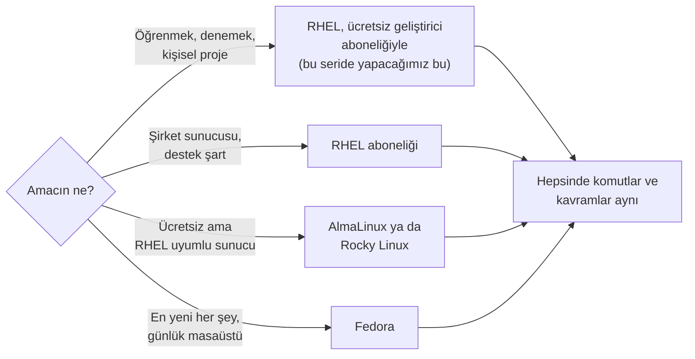

Bu seride RHEL'in kendisini kuracağız, çünkü Red Hat bireysel geliştiricilere **ücretsiz bir abonelik** veriyor:
bir hesap açıyorsun, 16 sisteme kadar RHEL'i indirip kurabiliyor ve güncelleyebiliyorsun. Bir sonraki bölümün
konusu tam olarak bu. Ama elinde bir Alma ya da Rocky varsa da seriyi hiç zorlanmadan takip edebilirsin.

## Herkes bedava indirebiliyorsa Red Hat neyi satıyor?

Yazının başında sorduğumuz meraklı soruya geldik. Kaynak kod açık, Alma ve Rocky bedava, Fedora bedava. Red Hat
nasıl oluyor da yılda milyarlarca dolar kazanıyor?

Cevap tek kelime: **abonelik.** Ve abonelikle satılan şey yazılımın kendisi değil, yazılımın etrafındaki
hizmetler. Bir RHEL aboneliği aldığında şunları alıyorsun:

- **Test edilmiş güncellemeler.** Her yama, binlerce donanım ve yazılım bileşimiyle denendikten sonra sana
  geliyor. Sunucun bir güncelleme yüzünden çökmesin diye.
- **Güvenlik yamaları ve on yıllık ömür.** Yeni bir güvenlik açığı duyulduğunda Red Hat'in ekibi düzeltmeyi
  hazırlıyor (hani şu geri taşıma işi) ve on yıl boyunca hazırlamaya devam ediyor.
- **Sertifikalı uyumluluk.** "Bu sunucu modeli, bu veritabanı, bu Java sürümü RHEL üzerinde test edildi ve
  destekleniyor" garantisi. Bir bankanın "çalışıyor gibi" ile yetinmediğini tahmin edersin.
- **Bir telefon numarası.** Gece üçte sunucu açılmadığında arayabileceğin, cevap vermek zorunda olan bir destek
  ekibi.
- **Hukuki güvence ve araçlar.** Kullandığın kodun lisans durumuna kefil olan bir şirket; ayrıca sistemleri toplu
  yönetme ve izleme gibi ek araçlar.

Bob Young'ın arabasına geri dönersek: Red Hat arabayı satmıyor, kaput açık. Sattığı şey **bakım sözleşmesi,
garanti ve yol yardımı.** Evde hobi olarak tamir edebileceğin bir araba için bunlara para vermezsin; ama
binlerce yolcu taşıyan bir otobüs filosu işletiyorsan verirsin. Şirketler de tam olarak bu yüzden veriyor.

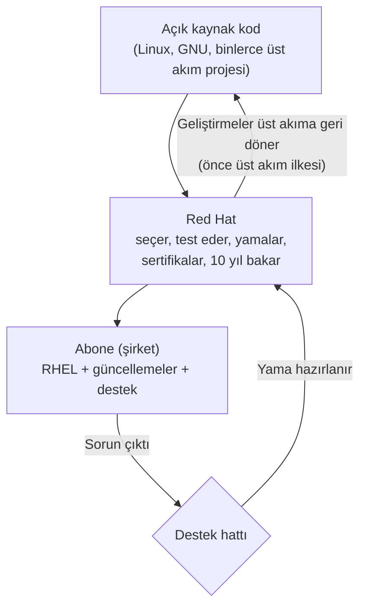

Şemadaki son oku kaçırma: Red Hat'in yazdığı düzeltmeler yalnızca abonelere gitmiyor, üst akım projelerine
geri dönüyor. Bu döngü modelin kalbidir: kod ortak mal olarak kalır, şirket onun üzerine hizmet satar.

Aboneliklerin türleri de var. Bu serinin kullanacağı **bireysel geliştirici aboneliği** ücretsizdir ve 16 sisteme
kadar geçerlidir; ekipler için de ücretsiz bir sürümü vardır. Şirketler ise sunucu başına yıllık ödenen, destek
seviyesine (mesai saatleri ya da 7/24) göre değişen standart ve premium abonelikler alır. Hepsinde yazılım
aynıdır; fark, yanında gelen hizmettir.

<Callout type="note" title="Ücretsiz mi, özgür mü? İki farklı kelime">
İngilizcede "free" hem "bedava" hem "özgür" demek; açık kaynak dünyasının en klasik karışıklığı bu. Açık kaynak
ya da özgür yazılımın vurgusu ikincisidir: kodu **görme, değiştirme ve dağıtma** özgürlüğü. Bedava olması çoğu
zaman bunun sonucudur ama zorunlu değildir. RHEL tam da bunun örneği: kodu özgür, ama Red Hat'in hazırlayıp test
ettiği sürümü almak abonelik ister. Bunun tersi de var: bedava indirdiğin ama kodunu asla göremediğin binlerce
program. Bu ikisini ayırt etmek, açık kaynak tartışmalarının yarısını anlamanı sağlar.
</Callout>

## Güvenlik açıkları çıktığında ne olur? Red Hat'in farkı

Abonelik listesindeki "güvenlik yamaları" maddesi kâğıt üstünde sıradan görünüyor. Ama son yıllarda yaşanan
birkaç olaya bakınca, o maddenin neden şirketlerin RHEL'e para vermesinin en büyük nedeni olduğunu anlıyorsun.
Önce birkaç kelimeyi yerine oturtalım.

**Güvenlik açığı,** bir programdaki, kötü niyetli birinin yapmaması gereken bir şeyi yapmasına (dosyalarını
okumasına, makineni ele geçirmesine) izin veren hatadır. Her ciddi açığa dünya çapında bir kimlik verilir: **CVE**
numarası. `CVE-2024-3094` diye okursun: 2024 yılı, o yılın 3094. kaydı. Açığı kapatan düzeltmeye **yama** (patch)
denir. Açık, yaması hazır olmadan kamuya ya da saldırganlara sızmışsa buna **sıfır gün** (zero-day) denir:
savunanların hazırlanmak için sıfır günü vardır. Bunu önlemek için sektör bir gelenek geliştirmiştir:
**koordineli açıklama.** Açığı bulan kişi önce yazılımın geliştiricilerine ve büyük dağıtımcılara gizlice haber
verir; herkes yamasını hazırlar; belirlenen günde açık, CVE ve yamalar aynı anda yayımlanır. Bu gizli döneme
**ambargo** denir. Red Hat, açıkları önem derecesine göre dört seviyede sınıflar (düşük, orta, önemli, kritik) ve
her yamayı numaralı bir **güvenlik duyurusuyla** (RHSA) yayımlar.

### Kapatmak neden bu kadar uzun sürüyor?

Şunu duymuşsundur: büyük bir açık çıkar, aylar hatta yıllar sonra hâlâ o açıktan girilen sistemler haberlere
düşer. Ama dikkat: uzun süren şey çoğu zaman yamanın *yazılması* değildir; yamanın dünyadaki milyonlarca sisteme
*ulaşması* ve *uygulanmasıdır.* Üç darboğaz var:

1. **Yazılımın bakımcısı olmayabilir.** Açık kaynak dünyasında pek çok kritik parça bir-iki gönüllünün elindedir.
   Yama yazacak kimse yoksa ya da geç kalırsa, herkes bekler.
2. **Yama her yere ayrı ayrı taşınmalıdır.** Aynı kütüphane yüzlerce dağıtımda, binlerce üründe, milyonlarca
   gömülü cihazda (modem, akıllı televizyon, kamera) ve konteyner imajında ayrı ayrı paketlenmiştir. Her birinin
   üreticisi yamayı kendi paketine taşımak zorundadır; çoğu bunu hiç yapmaz.
3. **Yama uygulanmayabilir.** En sık görülen ve en pahalı olan bu. 2017'de Equifax adlı kredi şirketi, Apache
   Struts'taki bir açık için yama çıktıktan iki ay sonra bile yamayı uygulamamıştı; saldırganlar o açıktan girip
   147 milyon kişinin bilgisini çaldı. Aynı yıl WannaCry fidye yazılımı, Microsoft'un iki ay önce yamaladığı bir
   açıkla 150 ülkede yüz binlerce bilgisayarı kilitledi; İngiltere'de hastaneler ameliyat erteledi. 2021'in
   Log4Shell'inden yıllar sonra bile yamasız sistemlere rastlanıyor.

Yani bir açığın kapanma süresi, yamanın yazılması artı dağıtılması artı uygulanmasıdır. İlk ikisi dağıtımcının
işi, üçüncüsü sistem yöneticisinin. Yani bir gün senin.

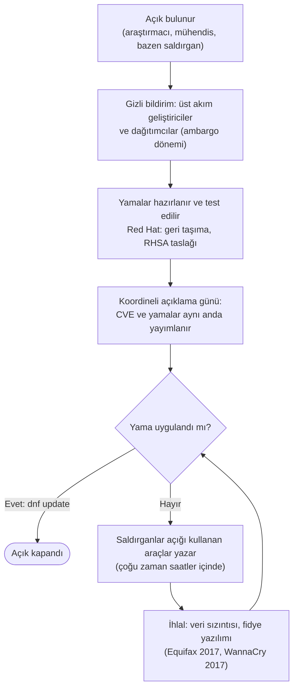

### Red Hat'in müdahalesi neden hızlı?

Red Hat'in 2001'den beri yalnızca bu işle uğraşan bir **Ürün Güvenliği** ekibi var. Bu ekip ambargolu
bildirimleri ilk alanlar arasındadır; çünkü Red Hat hem dünyanın en büyük Linux dağıtımcısı hem de çekirdek,
glibc, systemd, OpenSSL gibi kritik parçaların bakımcılarını kendi bünyesinde çalıştıran bir şirkettir. Çoğu
zaman yamayı yazan mühendis zaten Red Hat'te çalışmaktadır. Red Hat ayrıca CVE numarası verme yetkisi olan az
sayıdaki kuruluştan biridir; XZ olayındaki `CVE-2024-3094` numarasını Red Hat verdi. Sonuç: koordineli açıklama
günü geldiğinde yama çoğunlukla hazırdır; sen sabah `dnf update` dediğinde gelir.

İkinci bir avantaj, biraz önce tanıdığın sabit sürüm modelinden gelir: RHEL, programların eski ve iyice test
edilmiş sürümlerini taşıdığı için, en yeni sürümlere eklenen taze hatalardan çoğu zaman **hiç etkilenmez.**
Aşağıdaki tabloda bunun iki örneğini göreceksin.

### Olaylardan örnekler

| Olay | Ne oldu? | Açıklandı | Red Hat |
| --- | --- | --- | --- |
| **Heartbleed** (OpenSSL, CVE-2014-0160) | İnternetin şifreleme kütüphanesindeki hata, sunucu belleğinden parola ve anahtar okumaya izin veriyordu | 7 Nisan 2014 | RHEL 6 yaması ertesi gün (RHSA-2014:0376); RHEL 5 daha eski OpenSSL taşıdığı için etkilenmedi |
| **Shellshock** (bash, CVE-2014-6271) | Kabuğa ortam değişkeni üzerinden komut çalıştırılabiliyordu; web sunucularını uzaktan ele geçirmeye açıktı | 24 Eylül 2014 | Aynı gün yama (RHSA-2014:1293); ilk üst akım yaması eksik çıkınca kalıcı düzeltmeyi Red Hat mühendisi Florian Weimer yazdı, iki gün içinde yayımlandı |
| **Meltdown / Spectre** (işlemci, CVE-2017-5754 ve CVE-2017-5715) | İşlemcilerin tasarımından kaynaklanan, programların birbirinin belleğini okumasına izin veren açıklar | 3 Ocak 2018 | Aynı gün çekirdek yaması (RHSA-2018:0007); aylar süren ambargo boyunca Red Hat yamaları hazırlamıştı |
| **Log4Shell** (Java Log4j, CVE-2021-44228) | Java uygulamalarında tek bir günlük satırıyla uzaktan kod çalıştırma; on yılın en büyük açığı sayıldı | 10 Aralık 2021 | Aynı gün CVE sayfası, etkilenen ürün listesi ve geçici önlemler; ürün yamaları sonraki günlerde |
| **PwnKit** (polkit, CVE-2021-4034) | Her Linux masaüstü ve sunucusunda bulunan bir araçla sıradan kullanıcının root olabilmesi; 12 yıldır fark edilmemişti | 25 Ocak 2022 | Aynı gün RHEL 7 ve 8 yamaları (RHSA-2022:0272 ve 0274) |
| **Looney Tunables** (glibc, CVE-2023-4911) | C kütüphanesindeki hata ile yerel kullanıcının root olması | 3 Ekim 2023 | İki gün içinde RHEL 8 ve 9 yamaları (RHSA-2023:5453 ve 5455); glibc'nin bakımcıları zaten Red Hat'te |
| **XZ arka kapısı** (xz/liblzma, CVE-2024-3094) | Bir sıkıştırma kütüphanesine iki yıllık sabırla yerleştirilen arka kapı; SSH üzerinden dünyadaki sunuculara girişe açılacaktı | 29 Mart 2024 | Aynı gün uyarı ve CVE; Fedora'nın geliştirme sürümleri temizlendi; RHEL eski xz sürümü taşıdığı için hiç etkilenmedi |
| **regreSSHion** (OpenSSH, CVE-2024-6387) | Uzaktan bağlantı sunucusunda, eskiden kapatılmış bir açığın yeniden ortaya çıkması | 1 Temmuz 2024 | RHEL 9 yaması iki gün içinde (RHSA-2024:4312); RHEL 8 etkilenen sürümü taşımadığı için yamaya bile gerek kalmadı |

<Callout type="note" title="Tarih notu: XZ arka kapısı, az kalsın oluyordu">
2024 Mart'ının son cuma günü, Microsoft'ta çalışan Andres Freund adlı bir veritabanı mühendisi, test
makinesinde SSH girişlerinin yarım saniye kadar yavaşladığını fark etti. Çoğu kişi bunu umursamazdı; o
kurcaladı. Bulduğu şey yazılım tarihinin en ustaca saldırılarından biriydi: "Jia Tan" adını kullanan biri, iki
yıl boyunca xz adlı küçük bir sıkıştırma projesine gönüllü katkı yapmış, güven kazanıp bakımcı olmuş, sonra
kütüphaneye SSH sunucusunu uzaktan açan bir arka kapı gizlemişti. Kod Fedora'nın geliştirme sürümlerine ve
Debian'ın test dalına girmişti; birkaç ay sonra yeni büyük dağıtım sürümleriyle dünyaya yayılacaktı. Red Hat
aynı gün uyarı yayımlayıp CVE numarasını verdi ve Fedora'yı temizledi. RHEL'e gelince: hiçbir şey yapmasına
gerek kalmadı, çünkü RHEL 9 xz'nin arka kapıdan üç yıl önceki sürümünü taşıyordu. "Eski görünen sürümler"
bölümünü hatırla; sabit sürüm modelinin en somut faydası buydu. Olay, açık kaynağın hem en zayıf yerini (tek
gönüllüye bağlı kritik projeler) hem de en güçlü yerini (kod herkese açık olduğu için bir meraklının arka kapıyı
bulabilmesi) aynı anda gösterdi.
</Callout>

<Callout type="important" title="Adil olalım: hız Red Hat'e özgü değil, garanti öyle">
Koordineli açıklama düzeninde Debian, Ubuntu, SUSE gibi büyük dağıtımların hepsi yer alır ve çoğu aynı gün yama
çıkarır. Red Hat'i ayıran üç şey var: kritik parçaların bakımcılarını kendi bünyesinde çalıştırdığı için yamayı
çoğu zaman kendisi yazar; on yıl boyunca, artık kimsenin ilgilenmediği eski sürümler için bile yamayı geri
taşımayı sözleşmeyle taahhüt eder; ve yamanın diğer bileşenlerle test edildiğine kefil olur. Bir de madalyonun
öbür yüzü: dünyanın en hızlı yaması bile sen uygulamazsan işe yaramaz. 7. bölümde `dnf update`'i öğrendiğinde
bu bölümü hatırla.
</Callout>

## Red Hat bugün: yalnızca bir işletim sistemi değil

Red Hat'in adı RHEL ile anılıyor ama şirketin bugünkü ürün ailesi çok daha geniş. Hepsini şimdi öğrenmene gerek
yok; sadece isimleri duyduğunda "ha, o Red Hat'in" diyebil diye bir harita çizelim.

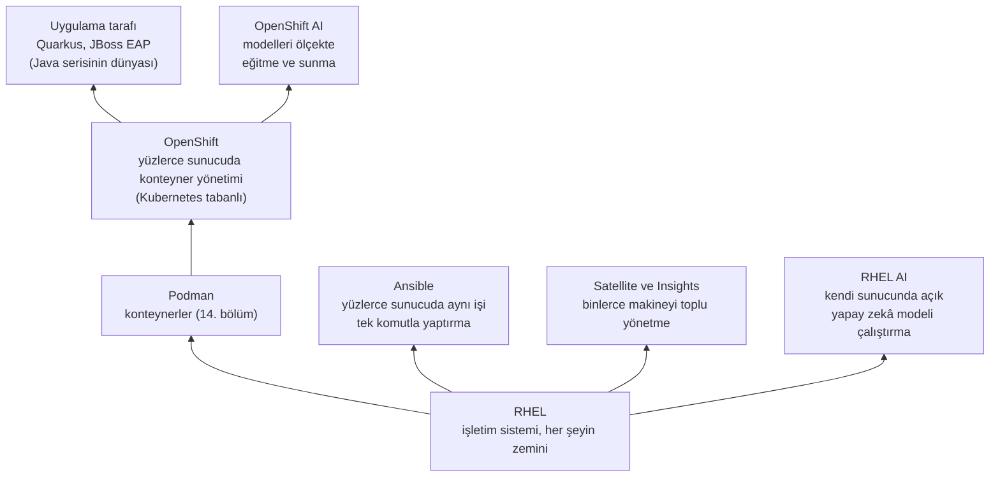

Aşağıdan yukarıya oku. Her şeyin altında **RHEL** var. Onun üstünde **Podman,** programları "konteyner" denen
taşınabilir kutulara koymanı sağlıyor. Yüzlerce sunucuda binlerce konteyneri yönetmek gerekince **OpenShift**
devreye giriyor. **Ansible,** "şu 200 sunucuda şu ayarı yap" gibi işleri tek komutla yaptıran otomasyon aracı.
**Quarkus** ve **JBoss EAP** ise Java uygulamalarının koştuğu katman; [Java serisi](/blog/java-nedir) ilerledikçe
onlarla orada karşılaşacaksın. Bu seride bu yığının en altındayız ve sağlam bir zemin kurmadan yukarı
çıkmıyoruz.

Bir de görünmeyen taraf var: Red Hat'in yalnızca ürünleri değil, dağıtımın içindeki parçaların kendisi de büyük
ölçüde Red Hat mühendislerinin elinden çıkmıştır. Az önce tanıdığın **systemd**'yi 2010'da Red Hat'te çalışan
Lennart Poettering ve Kay Sievers yazdı. Masaüstü ortamı **GNOME**'un, ağ yönetimi aracı **NetworkManager**'ın,
ses altyapısının, Linux çekirdeğinin ve konteyner dünyasının temeli **Kubernetes**'in en büyük katkıcıları
arasında Red Hat var. "Önce üst akım" ilkesi lafta kalmıyor.

### Red Hat ve yapay zekâ

Haritanın sağ tarafındaki iki yeni kutuyu açayım, çünkü bugün Red Hat'in en çok konuşulan tarafı bu. Önce
yeni başlayan için bir yer tespiti: ChatGPT gibi bir sohbet asistanı bir web sayfası değildir; arkasında
binlerce **GPU**'lu (grafik işlemcili) sunucu çalışır ve o sunucuların neredeyse tamamı Linux kullanır. Bir
modeli **eğitmek** (training), ona milyarlarca örnek veri göstermek demek; **çalıştırmak** (inference) ise
eğitilmiş modele soru sorup cevap almak. İkisi de dev sunucu filolarında, işletim sisteminin üstünde olur. Yani
yapay zekâ dünyasında Red Hat'in ilk rolü, hep olduğu gibi, **zemin** olmak: GPU sunucularında RHEL.

Onun üstüne 2023'ten itibaren bir ürün ailesi kurdu:

| Ürün | Ne işe yarar? |
| --- | --- |
| **RHEL AI** (2024) | Hazır bir RHEL imajı: içinde IBM'in açık kaynak **Granite** modelleri, modeli kendi verinle eğitmeni sağlayan **InstructLab** ve hızlı çalıştırma motoru var. Amaç: modeli bulutta kiralamak yerine kendi sunucunda çalıştırmak |
| **OpenShift AI** (2023, eski adı OpenShift Data Science) | Modelleri yüzlerce sunucuda eğitmek, sürümlemek ve sunmak için platform; veri bilimcilerin ortak çalışma alanı |
| **AI Inference Server** (2025) | Eğitilmiş bir modeli mümkün olduğunca hızlı ve ucuz çalıştıran sunucu; açık kaynak **vLLM** projesine dayanır. Red Hat, vLLM'in en büyük katkıcısı Neural Magic'i 2025 başında satın aldı |
| **Lightspeed** asistanları | RHEL, OpenShift ve Ansible'ın içine gömülü yapay zekâ yardımcıları: "bu sunucuda disk neden doldu?" diye komut satırından sorabiliyorsun (RHEL 10) |
| **InstructLab** (2024, IBM ile) | Bir yapay zekâ modeline, açık kaynak projesine katkı verir gibi bilgi eklemeyi sağlayan açık yöntem ve araç |

İki fikir bu tablonun tamamını açıklıyor. Birincisi, Red Hat'in sloganı: **"herhangi bir model, herhangi bir
donanım, herhangi bir bulut."** Tıpkı RHEL'in her sunucu markasında çalışması gibi, modelin de hangi şirketin
çipinde ya da bulutunda koştuğunun fark etmemesi. İkincisi, bu yazıda üç kez karşına çıkan açık kaynak
refleksi: modelin ağırlıkları açık olsun (Granite), eğitme yöntemi açık olsun (InstructLab), çalıştırma
motoru açık olsun (vLLM). Kapalı bir yapay zekâ servisi, Bob Young'ın kaputu kaynaklı arabasının 2020'lerdeki
hâlidir; Red Hat aynı kaputu bu sefer yapay zekâ için açmaya çalışıyor.

Peki bir banka bunu neden istesin, "ChatGPT'ye sorarız olur biter" demesin? Çünkü müşteri verisini dışarıdaki
bir servise gönderemez; hem yasa (Türkiye'de KVKK, Avrupa'da GDPR) hem sağduyu buna izin vermez. Modeli kendi
RHEL sunucusunda çalıştırırsa **veri evden çıkmaz.** Yazının son notunda bu cümleye geri döneceğiz.

<Callout type="note" title="Merak edenler için: vLLM, InstructLab ve Neural Magic">
**vLLM,** 2023'te Berkeley Üniversitesi'nde başlayan, büyük dil modellerini bellek israfı olmadan çalıştıran
açık kaynak bir motor; bugün sektörün fiilî standardı. **Neural Magic,** modelleri küçültüp (nicemleme,
seyrekleştirme) daha az donanımda çalıştırma konusunda uzmanlaşmış ve vLLM'e en çok katkı veren şirketti; Red
Hat onu 2025 Ocak'ında bünyesine kattı. **InstructLab,** IBM Research'ün LAB yöntemine dayanır: modele yeni
bilgi öğretmek için baştan eğitmek yerine, az sayıda örnekten sentetik veri üretip modele eklemek. 2025'te Red
Hat, Google, IBM ve NVIDIA ile birlikte modelleri birçok sunucuya dağıtarak çalıştıran **llm-d** projesini de
başlattı. Bunların hiçbirini şimdi bilmen gerekmiyor; serinin çok sonrasında, Podman ve OpenShift'i tanıdıktan
sonra anlam kazanacaklar.
</Callout>

### Nerelerde çalışıyor?

Somutlaştıralım. New York Borsası'nın işlem sistemleri RHEL üzerinde çalışıyor. Dünyanın en büyük bankaları,
havayolu ve telekom şirketleri, kamu kurumları... Red Hat, Fortune 500 listesindeki şirketlerin büyük
çoğunluğunun müşterisi olduğunu söylüyor. Büyük bulut sağlayıcılarının hepsi (Amazon, Microsoft, Google) RHEL'i
hazır sunuyor. Türkiye'de de bankaların, telekom operatörlerinin ve kamu sistemlerinin arka odalarında büyük
ihtimalle bu aileden bir makine var. Yani öğrendiğin şey bir hobi aracı değil; dünyanın para ve veri
altyapısının üzerinde durduğu zemin.

### "Kurumsal" tam olarak ne demek?

Bu yazıda "kurumsal" kelimesini bolca kullandım; biraz somutlaştırayım, çünkü bankaların RHEL'i seçmesinin
nedeni tam olarak burada. Kurumsal (enterprise) bir ortamı sıradan bir bilgisayardan ayıran üç şey var:
**ölçek** (yüz değil, on binlerce makine), **sorumluluk** (sistem durursa para, bazen hayat kaybı) ve
**denetim** (bir düzenleyici kurum gelip "bunu nasıl güvenceye aldınız?" diye sorar).

O son maddeyi karşılamak için işletim sisteminin bağımsız kurumlarca sınanmış olması gerekir. RHEL'in taşıdığı
belgelerden birkaçı:

- **FIPS 140-3.** Şifreleme modüllerinin ABD ve Kanada devlet standardına göre test edilmiş olması. Kamu ve
  finans kurumlarının çoğu bunu şart koşar.
- **Common Criteria.** Uluslararası bir güvenlik değerlendirme standardı; bağımsız laboratuvarlar sistemi
  didik didik eder.
- **DISA STIG ve CIS profilleri.** "Güvenli bir sunucu şöyle ayarlanır" diyen resmî yapılandırma rehberleri.
  RHEL bunları hazır profil olarak sunar; OpenSCAP adlı yerleşik araçla sistemin rehbere uyup uymadığını tek
  komutla denetlersin.
- **PCI DSS gibi sektör kuralları.** Kredi kartı işleyen her sistemin uyması gereken kurallar; RHEL'in
  profilleri bunlara da hazır cevap verir.

Bir de sertifikalı katalog var: hangi sunucu modeli, hangi veritabanı, hangi SAP ya da Oracle sürümü RHEL
üzerinde resmî olarak destekleniyor, hepsi tek bir listede. Bir banka "çalışıyor gibi" demez, "bu listede" der.
Kurumsal Linux'un ücretini haklı çıkaran şey, yazılımın kendisinden çok bu kâğıt yığınıdır.

## Sistemin içine kısa bir bakış: ileride neler var?

Yazıyı kapatmadan, serinin ilerleyen bölümlerinde uzun uzun açacağımız üç kavramı şimdiden birer cümleyle
tanıştırayım; böylece 2. bölümde kurulum ekranında gördüğün şeyler yabancı gelmez.

**Açılış zinciri.** Güç düğmesine bastığında olanlar bir bayrak yarışı gibidir:

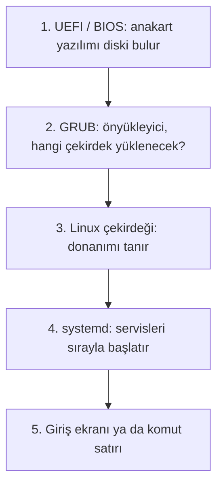

Anakartın kendi minik yazılımı (UEFI) diski bulur ve **önyükleyiciyi** (GRUB) çalıştırır; GRUB çekirdeği belleğe
yükler; çekirdek donanımı tanıyıp ilk programı, systemd'yi başlatır; systemd de sırayla her şeyi ayağa kaldırır.
8. bölümde bu zincirin her halkasına dokunacağız.

**Terminal, kabuk ve komut.** Üçü sık karıştırılır. **Terminal,** yazdıklarını gösteren pencere; **kabuk,**
o pencerede yazdığın satırı okuyup çalıştıran program (RHEL'de bash); **komut** ise kabuğa söylediğin tek bir iş
(`ls` gibi). Pencere, garson, sipariş. 3. bölümde başlıyoruz.

**root ve sıradan kullanıcı.** Linux'ta her şeyi yapabilen tek bir hesap vardır: **root.** Geri kalan herkes
yalnızca kendi dosyalarına dokunabilir; sistem dosyaları için root'tan izin ister (`sudo` komutuyla). Sistem
çağrısı şemasındaki "izin var mı?" sorusu buradan besleniyor. 6. bölümün konusu.

## Sertifika yolu: RHCSA, RHCE ve ötesi

Seriyi "RHCSA müfredatını izleyerek" yazdığımı söylemiştim; ne olduğunu iki paragrafla anlatayım. **RHCSA** (Red
Hat Certified System Administrator), Red Hat'in temel sistem yöneticiliği sertifikası. Sınavı diğer pek çok
bilişim sınavından ayıran şey şu: çoktan seçmeli soru **yoktur.** Karşına gerçek bir RHEL makinesi konur ve
"şu kullanıcıyı oluştur, şu diski bağla, şu servisi açılışta başlat, SELinux'u şöyle ayarla" gibi somut görevler
verilir. Yapabiliyorsan geçersin, yapamıyorsan geçemezsin. Bu yüzden ezberle alınamaz; iyi ki de öyle.

Bir üst basamak **RHCE** (Red Hat Certified Engineer), Ansible ile otomasyon üzerine kurulu. Onun da üstünde,
uzmanlık sınavlarını toplayarak ulaşılan **RHCA** (Architect) var. Bu seri RHCSA'nın konularını sırayla kapsıyor;
serinin son bölümünde sınavın kendisini, nasıl hazırlanılacağını ve sonrasında hangi yolların açıldığını
konuşacağız.

## Serinin yol haritası

Nereye gittiğimizi baştan bil istiyorum. Her bölüm bir öncekinin üstüne çıkacak, tıpkı diğer serilerde olduğu
gibi:

<Steps>

1. **Red Hat nedir?** Şu an okuduğun yazı.
2. **RHEL kurulumu.** Ücretsiz geliştirici aboneliği, sanal makine, kurulum adım adım.
3. **Terminal ve kabuk.** İlk komutlar; bash ile tanışma.
4. **Linux dosya sistemi.** "Her şey bir dosyadır" ve dizin ağacı.
5. **Yönlendirme, borular ve vim.** Komutları birbirine bağlamak, dosya düzenlemek.
6. **Kullanıcılar ve izinler.** root, sudo, rwx.
7. **Paketler: RPM ve dnf.** Bu yazıda tanıdığın kavramları gerçek makinede uygulamak.
8. **systemd ile servisler.** Açılış zinciri, servisleri yönetmek.
9. **Süreçler ve zamanlama.** Çalışan programlar, loglar, cron.
10. **Ağ ve SSH.** Makineye uzaktan bağlanmak.
11. **Diskler ve LVM.** Depolamayı yönetmek.
12. **SELinux.** Korkmadan anlamak.
13. **firewalld.** Güvenlik duvarı.
14. **Podman ile konteynerler.** Programı kutuya koymak.
15. **Son adımlar ve RHCSA yolu.**

</Steps>

Güncel liste ve yayımlanan bölümler her zaman [Red Hat sayfasında](/red-hat) duruyor.

## Kendin düşün

Bu bölümde komut yazmadık, o yüzden sorular da kâğıt üstünde. Amaç, kavramların yerine oturup oturmadığını
görmek.

### Soru 1 — Telefonunda Linux var mı? (kolay)

> Android telefonların Linux çekirdeği kullandığını söyledik. Buna göre "Android bir Linux dağıtımıdır" demek
> doğru mu? Araba benzetmesiyle düşün.

<Callout type="note" title="İpucu">
Motor aynı: Android'in altında gerçekten Linux çekirdeği var. Ama etrafına konulanlar (uygulama mağazası,
Java benzeri uygulama katmanı, dokunmatik arayüz) klasik bir Linux dağıtımından çok farklı; GNU araçları, dnf
ya da apt gibi bir paket yöneticisi, systemd yok. Yani "Android, Linux çekirdeği kullanan bir işletim
sistemidir" demek doğru; ona "Linux dağıtımı" demek ise tartışmalı. Aynı motor, bambaşka bir araba.
</Callout>

### Soru 2 — Doğru rafa koy (kolay)

> Şu dört ismi tanımlarıyla eşleştir: **Fedora, CentOS Stream, RHEL, AlmaLinux.**
> (a) On yıl desteklenen, abonelikle satılan kurumsal ürün. (b) RHEL'in bir sonraki sürümünün ön izlemesi.
> (c) Altı ayda bir sürüm çıkaran, en yeni teknolojiyi ilk deneyen topluluk dağıtımı. (d) RHEL ile uyumlu,
> ücretsiz topluluk dağıtımı.

<Callout type="note" title="İpucu">
Fedora → (c), CentOS Stream → (b), RHEL → (a), AlmaLinux → (d). Aile ağacındaki akış yönünü hatırla:
Fedora'dan RHEL'e doğru "yenilik azalır, kararlılık artar"; RHEL'den klonlara doğru ise "aynı şey, destek yok".
</Callout>

### Soru 3 — Bağımlılık zinciri (orta)

> Kurmak istediğin `fotoeditor` paketi `resimlib`'e, `resimlib` de `sikistirma`'ya bağımlı; `sikistirma` zaten
> kurulu. `dnf install fotoeditor` dediğinde dnf hangi paketleri indirir? Akış şemasındaki döngüyü elle takip
> et.

<Callout type="note" title="İpucu">
Döngü şöyle döner: `fotoeditor` kurulu değil → listeye ekle, bağımlılığına bak: `resimlib` kurulu değil → listeye
ekle, bağımlılığına bak: `sikistirma` kurulu → dur. İndirilecekler: `fotoeditor` ve `resimlib`, o kadar. Kurulu
olan bir şeyi dnf yeniden indirmez; sadece sürümünün yeterli olduğunu doğrular.
</Callout>

### Soru 4 — Eski görünen sürüm (orta)

> Bir arkadaşın "RHEL 9'da Python 3.9 var, güncel değil, bu sistem güvensiz" diyor. Geri taşıma kavramıyla ona
> iki cümlelik bir cevap yaz.

<Callout type="note" title="İpucu">
"Sürüm numarası kasıtlı olarak sabit tutuluyor ki bugün çalışan şey yarın da aynı çalışsın; güvenlik
düzeltmeleri ise yeni sürümden alınıp bu sürüme geri taşınıyor, yani 3.9 yazıyor ama içindeki kod yamalı."
Ekstra puan: "Yeni bir Python özelliğine ihtiyacın varsa AppStream depolarında birden fazla sürüm yan yana
sunuluyor."
</Callout>

### Soru 5 — Kaputu açık araba (orta)

> Bir arkadaşın "Kod zaten açıksa Red Hat'e para vermek saçmalık, herkes Alma kurar geçer" diyor. Ona hangi
> durumda haklı, hangi durumda haksız olduğunu bir paragrafla anlat.

<Callout type="note" title="İpucu">
Haklı olduğu durum: evde öğrenmek, küçük bir kişisel proje, deneme sunucusu. Orada "yol yardımı"na para vermenin
anlamı yok; Alma, Rocky ya da ücretsiz geliştirici aboneliğiyle RHEL yeter. Haksız olduğu durum: sunucunun
durması para kaybettiren, "bu veritabanı bu sistemde destekleniyor" garantisinin şart olduğu, güvenlik yamasının
saatler içinde gelmesi gereken bir şirket ortamı. Orada satın alınan şey kod değil, sorumluluk ve zaman.
</Callout>

### Soru 6 — Komutlar taşınır mı? (orta)

> RHEL'de öğrendiğin bir komutun Ubuntu'da da çalışıp çalışmayacağını tahmin etmen gerekiyor. Sence hangi tür
> komutlar iki tarafta da aynı olur, hangileri farklı olur? "RHEL ile Ubuntu'nun farkı ne?" tablosuna bak.

<Callout type="note" title="İpucu">
Dosya ve dizin işleri (`ls`, `cp`, `mkdir`), kullanıcı ve izin komutları, süreç yönetimi gibi şeyler GNU
araçlarından ya da çekirdekten geldiği için iki tarafta da aynıdır. Farklılaşan yer paket yönetimi: RHEL'de
`dnf install`, Ubuntu'da `apt install`. Bir de bazı yapılandırma dosyalarının yerleri ve adları, güvenlik katmanı
(SELinux ile AppArmor) gibi varsayılanlar değişir. Kabaca yüzde doksan ortak, yüzde on aile şivesi.
</Callout>

### Soru 7 — Yama vardı (orta)

> Equifax olayında Apache Struts açığının yaması Mart 2017'de çıkmıştı; şirket Mayıs'ta ele geçirildi. Güvenlik
> akış şemasında bu şirket hangi kutuda takıldı? Bu durumun bir sistem yöneticisiyle ilgisi ne?

<Callout type="note" title="İpucu">
"Yama uygulandı mı?" sorusunda "Hayır" dalında kaldılar; yama yazılmış ve dağıtılmıştı, uygulanmamıştı. Yani
darboğaz dağıtımcıda değil, o sistemi yöneten kişilerdeydi. RHEL'de aynı durum, "RHSA yayımlandı ama kimse
`dnf update` demedi" demektir. Red Hat yamayı sabah hazır edebilir, uygulamak senin işin; serinin 7. bölümü tam
bu iş için.
</Callout>

## Son not: her şeyin altında veri var

Bu yazıyı kapatmadan önce, bütün bu çekirdek, paket, abonelik hikâyesinin neden önemli olduğunu tek kelimeyle
söyleyeyim: **veri.**

Yirminci yüzyılın en değerli şeyi petroldü; ülkeler onun için savaştı. Yirmi birinci yüzyılın petrolü veri ve
bu artık bir benzetme değil. Hesap numaraların, sağlık kayıtların, konumun, mesajların, alışkanlıkların, yüzün
ve sesin... hepsi bir sunucuda duruyor ve o sunucuların büyük çoğunluğu Linux çalıştırıyor. Verin çalındığında
olacaklar artık "şifremi değiştiririm" ile sınırlı değil: kimliğinle kredi çekilebilir, sesin ve yüzün yapay
zekâyla taklit edilip ailen dolandırılabilir, bir şirketin bütün verisi şifrelenip fidye istenebilir, bir
hastane günlerce kapanabilir. 2016'da yaklaşık 50 milyon Türkiye vatandaşının kimlik bilgilerini içeren bir
veritabanı internete düştü; o veri hâlâ dolaşımda. Yapay zekâ bu tabloyu iki yönden büyütüyor: modeller veriyle
besleniyor (senin verinle de) ve çalınan veriyle yapılabileceklerin listesi her yıl uzuyor.

Bu yüzden bir sistem yöneticisinin asıl işi sunucuyu ayakta tutmak değil, **veriyi korumaktır.** Bu serideki
her bölüm aslında ona hizmet ediyor: kullanıcılar ve izinler (kim neye dokunabilir), SELinux (kural çiğnense
bile çekirdek "dur" der), güvenlik duvarı (kim içeri girebilir), güncellemeler (bilinen deliklerin kapanması),
disk şifreleme ve yedekleme. Komutları öğreneceksin, ama her komutun arkasında şu soru dursun: bu, verinin
kimin elinde olduğunu değiştiriyor mu?

Red Hat'in bu alandaki işi de üç katmanda özetlenebilir:

- **Çekirdek seviyesinde kilitler.** SELinux'un ana bakımcısı Red Hat; 2005'ten beri RHEL'de varsayılan
  olarak açık. Linux'un disk şifreleme aracının (LUKS) bakımcısı bir Red Hat mühendisi; şifreli bir sunucu
  diskini açılışta ağdaki anahtar sunucusundan otomatik açan **Clevis/Tang** yöntemi Red Hat'te doğdu.
- **Sistem geneli şifreleme kuralları.** RHEL 8'den beri tek komutla bütün sistemin "zayıf şifrelemeyi
  reddet" moduna geçmesi; FIPS onaylı modüller; RHEL 10 ile **kuantum sonrası şifreleme,** yani gelecekteki
  kuantum bilgisayarların bugünkü şifreleri kırma ihtimaline karşı bugünden hazırlık.
- **Kimlik, tespit ve tedarik zinciri.** Kurum içi kimlik yönetimi (Identity Management) ve uygulamalar için
  **Keycloak** (Red Hat'te doğdu, 2023'te bağımsız bir vakfa devredildi); **Insights** ile açıkların sen fark
  etmeden önce tespiti; XZ olayından sonra önemi artan **yazılım tedarik zinciri güvencesi** (imzalı yapılar,
  her paketin malzeme listesi); konteynerlerin root olmadan çalışması (Podman); ve verinin bellekteyken bile
  şifreli kaldığı **gizli hesaplama** üzerinde çalışmalar.

Yapay zekâ bağını da kapatalım: bir kurum müşteri verisini dışarıdaki bir sohbet servisine gönderemez; KVKK ve
GDPR bunu zaten yasaklar. Çözüm, modeli kendi sunucunda çalıştırmak. RHEL AI ve OpenShift AI'ın varlık nedeni
tam olarak bu cümle: **veri evden çıkmasın.**

## Özet ve sırada ne var?

<Callout type="tip" title="Cebine koy">
- **İşletim sistemi,** donanımla programlar arasında duran yöneticidir. **Çekirdek** onun kalbi: süreçleri
  zamanlar, belleği paylaştırır, sürücülerle donanımı konuşturur, diski dosya sistemi olarak sunar, ağ
  paketlerini işler. Programlar ondan bir şey isteyeceğinde **sistem çağrısı** yapar (garson).
- **Linux, tek başına bir işletim sistemi değil, çekirdektir** (motor). 1991'de Linus Torvalds "sadece bir hobi"
  diye başlattı; bugün sunucuların, süper bilgisayarların, Android telefonların altında o var.
- **Dağıtım** = çekirdek + glibc + systemd + kabuk ve temel araçlar + paket yöneticisi ve depolar + kurulum
  programı + (isteğe bağlı) masaüstü + yıllarca güncelleme (araba). Dağıtımlar paket biçimi, sürüm modeli
  (sabit / yuvarlanan), destek süresi, felsefe ve varsayılanlarla ayrışır; **çatallama** sayesinde aileler
  oluşur. Dağıtım sürümü ile çekirdek sürümü ayrı şeylerdir.
- **Paket** = dosyalar + üstbilgi + bağımlılık listesi + betikler + imza (IKEA kutusu). **Bağımlılık,** paylaşılan
  kütüphane fikrinin sonucudur; **depo,** paket rafları + kataloğudur. **rpm** alt katman (tek kutu, veritabanı),
  **dnf** üst katman (depo, bağımlılık çözme, indirme, imza doğrulama). RHEL'de sürümler dondurulur, düzeltmeler
  **geri taşınır.**
- **Red Hat,** 1993-95 arasında Marc Ewing (kırmızı şapkalı çocuk) ve Bob Young'ın kurduğu şirket; merkezi
  Raleigh, 2019'dan beri IBM'e bağlı. Ürünlerinin hepsi açık kaynak; "önce üst akım" ilkesiyle çalışır.
- Aile ağacı: üst akım → **Fedora** (test pisti) → **CentOS Stream** (prototip) → **RHEL** (bayiden alınan
  araba, 3 yılda bir büyük sürüm, 10 yıl destek) → **Rocky / Alma** (aynı araba, markasız ve bedava).
- **Ubuntu ile RHEL** aynı motoru, systemd'yi, bash'i ve GNOME'u paylaşır; fark paketleme (apt / dnf), tempo
  (6 ayda bir + LTS / 3 yılda bir + 10 yıl), ücret modeli (herkese ücretsiz / abonelik), güvenlik katmanı
  (AppArmor / SELinux) ve yaygın olduğu yerlerdir (masaüstü ve bulut / kurumsal sunucular).
- Red Hat yazılımı değil, **aboneliği** satar: test edilmiş güncellemeler, güvenlik yamaları, sertifikalı
  uyumluluk, destek hattı. Kaput açık; para bakım ve garantiye. "Free" iki şeydir: **bedava** ve **özgür.**
- Güvenlik açığı → **CVE** → koordineli açıklama (ambargo) → yama. Kapanmayı uzatan şey genellikle yamanın
  yazılması değil, **dağıtılması ve uygulanması** (Equifax ve WannaCry, 2017). Red Hat ambargoyu ilk alanlardan
  ve kritik parçaların bakımcısı: Heartbleed, Shellshock, Meltdown ve PwnKit'te aynı gün ya da ertesi gün yama;
  XZ arka kapısı ve regreSSHion'da RHEL sabit sürüm modeli sayesinde etkilenmedi bile.
- **Kurumsal** = ölçek + sorumluluk + denetim; RHEL'in FIPS, Common Criteria, STIG gibi belgeleri ve sertifikalı
  kataloğu bu yüzden var. Öteki kurumsal Linux'lar: SUSE, Oracle Linux, Amazon Linux. Türkiye'nin dağıtımı
  **Pardus** Debian ailesinden. 2003'teki **SCO davası,** aboneliğin hukuki güvence maddesinin doğduğu yer.
- **Yapay zekâ** GPU'lu Linux sunucularında çalışır; Red Hat'in yeri önce zemin (RHEL), sonra **RHEL AI**
  (Granite + InstructLab, kendi sunucunda model), **OpenShift AI** (ölçek), **AI Inference Server** (vLLM,
  Neural Magic) ve **Lightspeed** asistanları. Slogan: herhangi bir model, donanım, bulut; açık kaynak refleksi.
- Yüzyılın petrolü **veri;** sistem yöneticisinin asıl işi onu korumak. Red Hat: SELinux, LUKS ve Clevis/Tang,
  sistem geneli şifreleme politikaları, kuantum sonrası şifreleme, IdM ve Keycloak, Insights, tedarik zinciri
  güvencesi. Yapay zekâda da aynı ilke: **veri evden çıkmasın** (KVKK, GDPR).
- Bu seride **RHEL'i ücretsiz geliştirici aboneliğiyle** kuracağız; öğrendiklerin Alma, Rocky, Fedora ve büyük
  ölçüde Ubuntu'da da geçerli olacak. Hedefimiz RHCSA müfredatını anlayarak bitirmek.
- Sırada: bir Red Hat hesabı açmak, ücretsiz aboneliği almak ve RHEL'i bilgisayarımızdaki bir sanal makineye
  adım adım kurmak.
</Callout>

## Kaynaklar ve daha fazla okuma

Yazıdaki bilgilerin kaynakları ve bir sonraki adım için başvurabileceğin resmî sayfalar:

- [Red Hat geliştirici aboneliği](https://developers.redhat.com/products/rhel/download): RHEL'i ücretsiz indirmek için (2. bölümün konusu).
- [RHEL yaşam döngüsü](https://access.redhat.com/support/policy/updates/errata): her sürümün destek tarihleri.
- [Red Hat güvenlik güncellemeleri ve CVE veritabanı](https://access.redhat.com/security/security-updates/cve): yazıdaki olayların resmî kayıtları, örneğin [CVE-2024-3094](https://access.redhat.com/security/cve/CVE-2024-3094) (XZ arka kapısı).
- [Fedora](https://fedoraproject.org/), [CentOS Stream](https://www.centos.org/centos-stream/), [Rocky Linux](https://rockylinux.org/), [AlmaLinux](https://almalinux.org/): aile ağacındaki dağıtımlar.
- [Pardus](https://www.pardus.org.tr/): TÜBİTAK'ın dağıtımı.
- [kernel.org](https://www.kernel.org/): Linux çekirdeğinin evi; [Linux'un tarihi](https://en.wikipedia.org/wiki/History_of_Linux) (Wikipedia, İngilizce).
- [Red Hat AI](https://www.redhat.com/en/products/ai), [InstructLab](https://instructlab.ai/), [vLLM](https://github.com/vllm-project/vllm): yapay zekâ bölümündeki projeler.
- [RHCSA sertifikası](https://www.redhat.com/en/services/certification/rhcsa): sınavın resmî sayfası.
- Fotoğraflar, Wikimedia Commons: [Linus Torvalds](https://commons.wikimedia.org/wiki/File:LinuxCon_Europe_Linus_Torvalds_03_(cropped).jpg), [Richard Stallman](https://commons.wikimedia.org/wiki/File:Richard_Stallman_-_F%C3%AAte_de_l%27Humanit%C3%A9_2014_-_010.jpg), [Tux](https://commons.wikimedia.org/wiki/File:Tux.svg), [Bob Young](https://commons.wikimedia.org/wiki/File:Bob_Young_-_CNX_2014_02.jpg), [Red Hat Tower](https://commons.wikimedia.org/wiki/File:Red_Hat_Tower-2013-10-29.jpeg).
