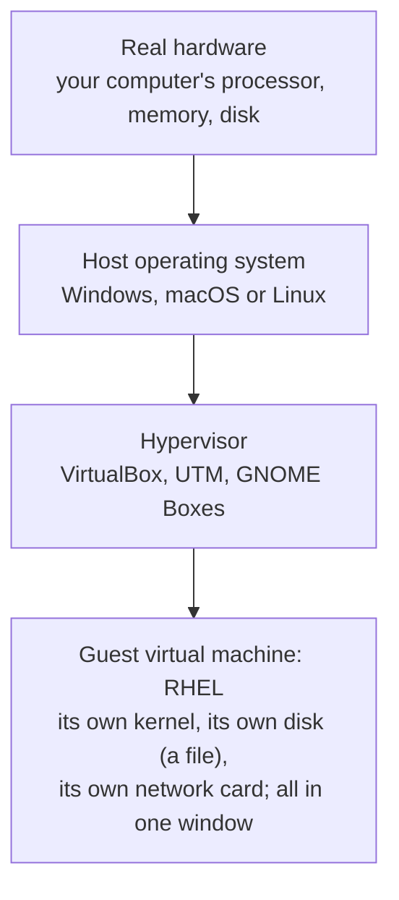
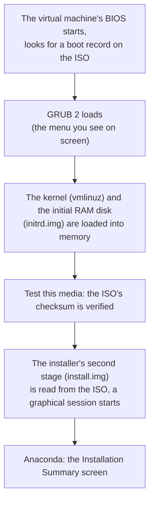
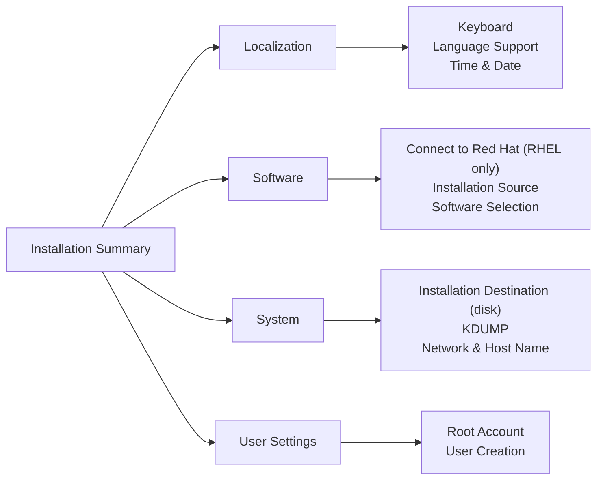
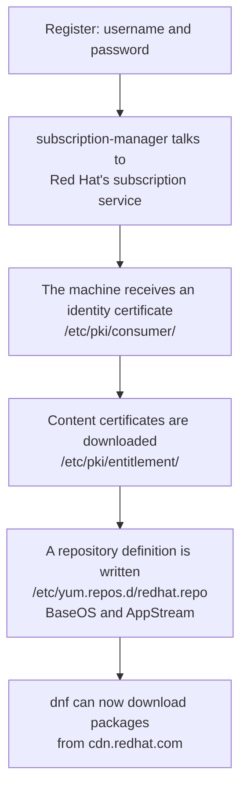
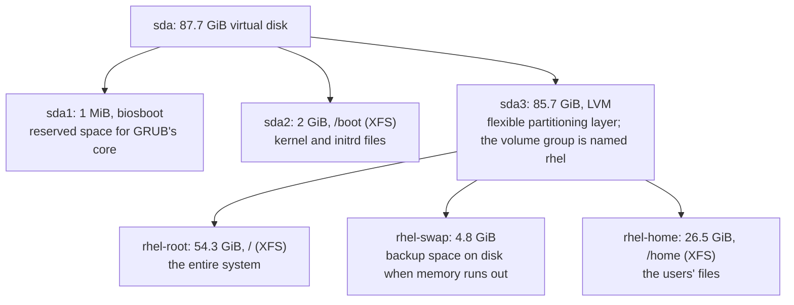
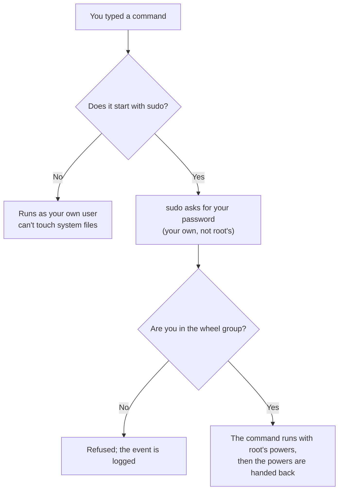
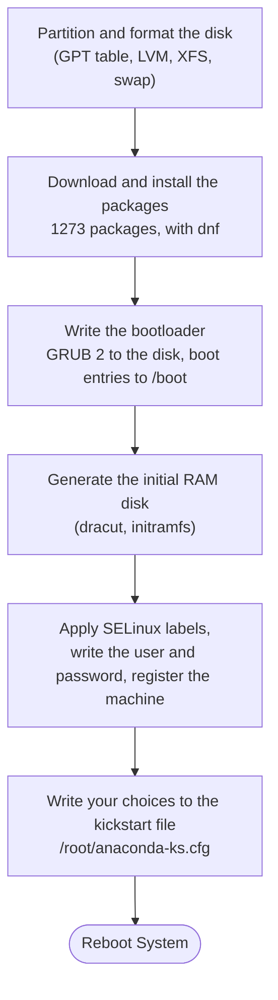
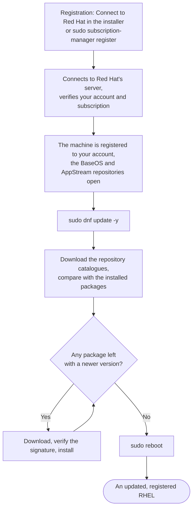

import Callout from '../../components/Callout.astro';
import Steps from '../../components/Steps.astro';
import Figure from '../../components/Figure.astro';
import vboxImg from '../../assets/ss-virtualbox-main.webp';
import boxesImg from '../../assets/ss-gnome-boxes.webp';
import bootImg from '../../assets/rhel10-01-boot-menu.webp';
import langImg from '../../assets/rhel10-02-language.webp';
import sumImg from '../../assets/rhel10-03-summary.webp';
import kbdImg from '../../assets/rhel10-04-keyboard.webp';
import timeImg from '../../assets/rhel10-05-timedate.webp';
import swImg from '../../assets/rhel10-07-software.webp';
import destImg from '../../assets/rhel10-08-destination.webp';
import netImg from '../../assets/rhel10-09-network.webp';
import rootImg from '../../assets/rhel10-10-root.webp';
import rootOnImg from '../../assets/rhel10-10b-root-enabled.webp';
import userImg from '../../assets/rhel10-11-user.webp';
import readyImg from '../../assets/rhel10-12-summary-ready.webp';
import progImg from '../../assets/rhel10-13-progress.webp';
import connectImg from '../../assets/rhel10-06-connect.webp';
import deskImg from '../../assets/rhel10-16b-desktop.webp';
import subImg from '../../assets/rhel10-19-subscription.webp';
import tdImg from '../../assets/rhel10-20-timedatectl.webp';
import lsblkImg from '../../assets/rhel10-21-lsblk.webp';
import netCliImg from '../../assets/rhel10-22-network.webp';
import idImg from '../../assets/rhel10-23-identity.webp';
import ksImg from '../../assets/rhel10-24-kickstart.webp';
import grpImg from '../../assets/rhel10-25-groups.webp';
import chkImg from '../../assets/rhel10-26-check-update.webp';
import updImg from '../../assets/rhel10-27-dnf-update.webp';
import instImg from '../../assets/rhel10-28-dnf-install.webp';
import treeImg from '../../assets/rhel10-29-tree.webp';
import histImg from '../../assets/rhel10-30-history.webp';
import completeImg from '../../assets/rhel10-14-complete.webp';
import loginImg from '../../assets/rhel10-15-login.webp';
import welcomeImg from '../../assets/rhel10-16-welcome.webp';
import actImg from '../../assets/rhel10-17-activities.webp';
import termImg from '../../assets/rhel10-18-terminal.webp';

In the [first part](/en/blog/what-is-red-hat) we talked at length: Linux is an engine, a distribution is the
car around the engine, Red Hat is the company that sells that car with a ten-year warranty. Today we stop
talking and pull the car into the garage: we're installing RHEL on your own computer. Without paying a penny,
because today we'll actually get the free developer subscription I described in part 1.

By the end of this post you'll have a running, updated RHEL machine registered to your Red Hat account. The
rest of the series happens on that machine: the terminal, files, users, packages, services... all of it here.
So this part reads a bit like a recipe: step by step, screen by screen. Remember how we broke brewing tea into
steps in the [first Algorithms post](/en/blog/what-is-an-algorithm)? An installation is exactly an algorithm.
Follow the order and the tea is ready at the end.

<Callout type="important" title="Short answer: how do you install RHEL?">
Installing **RHEL 10** takes five things: (1) open a free Red Hat account at developers.redhat.com; the
developer subscription covers up to 16 machines at no cost. (2) Download the RHEL 10 ISO; the 1 GB Boot ISO
is enough. (3) Create a virtual machine in VirtualBox (2 cores, 4 GB of memory, 30 GB of disk) and attach
the ISO. (4) In the Anaconda installer set the language, keyboard, time, Connect to Red Hat, software
selection, disk, network and user, then press Begin Installation; it takes 10 to 15 minutes. (5) Reboot,
log in and update with `sudo dnf update -y`. Every step, with its screen and what happens behind it, is below.
</Callout>

<Callout type="note" title="What you need for this part">
- A computer running Windows, macOS or Linux. 8 GB of memory is comfortable, 4 GB will do.
- 30 GB of free disk space and an internet connection that can handle a download of about 10 GB.
- An email address (for the Red Hat account) and an uninterrupted hour or two.
- Not pen and paper this time; though they're still handy for taking notes during the installation.
</Callout>

<Callout type="tip" title="About the screenshots">
Every installation screen in this post was captured from a **RHEL 10.2** machine I installed from scratch inside
VirtualBox 7.2 while writing the post; none of the images come from anywhere else. RHEL 9 has the same layout;
only the root box's name and default differ a little, and I'll point that out when we get there.
</Callout>

## Two concepts first: ISO and virtual machine

There are two new words, and let's settle both before the installation.

An **ISO file** is an installation disc squeezed into a single file. Operating systems used to come on DVDs;
an ISO is a byte-for-byte copy of everything on that DVD (the name comes from the organisation that wrote the
CD standard). There are no DVDs any more, but the file remains: you either write it to a USB stick and boot a
real computer from it, or you attach it to a virtual machine as a "virtual DVD". We'll do the second.

A **virtual machine** (VM for short) is a second computer running inside your computer. A program sets aside
part of the processor and memory and presents them "as if they were a separate computer"; you install whatever
operating system you like on that virtual computer. The program that does this is called a **hypervisor;**
VirtualBox, UTM and GNOME Boxes are hypervisors. Your actual computer is called the **host,** the virtual
computer inside it the **guest.**



Why not install directly on the computer? Three reasons. First, safety: it runs alongside Windows or macOS
without touching them. Second, courage: in this series I want you to break things; when something breaks in a
virtual machine you either roll back to a snapshot or delete it and reinstall in fifteen minutes. Third,
realism: most of the RHEL servers you'll meet at work are virtual machines already, just running inside a
bigger hypervisor (VMware, KVM or a cloud). If you remember the apartment manager analogy from
[part 1](/en/blog/what-is-red-hat): the hypervisor is like a contractor building a second apartment block inside
the first.

### Which hypervisor?

| Your computer | My suggestion | Note |
| --- | --- | --- |
| Windows | **VirtualBox** (free) | VMware Workstation is also free for personal use |
| Intel Mac | **VirtualBox** | The same x86_64 ISO |
| Apple Silicon Mac (M1, M2, M3, M4) | **UTM** (free) | Download RHEL's **aarch64** ISO; in UTM choose "Virtualize", not "Emulate" |
| Linux desktop (Fedora, Ubuntu, Pardus...) | **GNOME Boxes** or virt-manager | Uses the KVM in your system, the fastest |

<div style="display:flex;flex-wrap:wrap;gap:1.25rem;justify-content:center;align-items:flex-start;margin:1.5rem 0;">
  <div style="flex:1 1 300px;max-width:420px;">
    <Figure src={vboxImg} alt="VirtualBox 7 main window" caption="VirtualBox 7's main window: the list on the left holds your virtual machines, the New button at the top creates one. (Screenshot: Iketsi, CC BY-SA 4.0, Wikimedia Commons.)" />
  </div>
  <div style="flex:1 1 300px;max-width:420px;">
    <Figure src={boxesImg} alt="GNOME Boxes 47" caption="GNOME Boxes on a Linux desktop: the same job, a simpler window. (Screenshot: The GNOME Project, LGPL, Wikimedia Commons.)" />
  </div>
</div>

In this post I'll describe the screens through VirtualBox; in UTM and Boxes only the "create a virtual
machine" window differs, RHEL's own installation screens are identical.

<Callout type="caution" title="Three traps, before you start">
**Virtualisation may be switched off.** On many computers the processor's virtualisation feature (VT-x on
Intel, AMD-V on AMD) ships disabled from the factory. If VirtualBox says "VT-x is not available" or the
virtual machine is painfully slow, reboot the computer, enter the BIOS/UEFI settings (usually F2, Del or F10
at startup) and enable the "Virtualization" option. On Windows, VirtualBox can also slow down when Hyper-V or
WSL is enabled; in that case you can temporarily turn off Hyper-V from the "Turn Windows features on or off"
window.

**RHEL 10 won't run on processors older than 2013.** RHEL 10 requires a processor feature set called
"x86-64-v3"; Intel Haswell (2013) and later, AMD from 2015 onwards. If your computer is older, the
installation stops at the very first screen; in that case download RHEL 9 from the same page, and the rest is
the same.

**The x86_64 ISO won't run on Apple Silicon.** M-series Macs have ARM processors; you need RHEL's aarch64
edition. I said in part 1 that RHEL runs on ARM too; here's the proof.
</Callout>

### Booting from the ISO: behind the scenes

Before we start the installation, let's see once what happens when we say "boot the virtual machine from the
ISO"; because this chain is the very boot chain I described in part 1, only from an ISO instead of a disk.



Every ISO contains a small boot area defined by a standard left over from the CD era (El Torito); the BIOS
finds it and runs **GRUB 2.** The four lines you see in the menu are GRUB's lines. Once a choice is made, GRUB
loads two files into memory: the **kernel** (the engine from part 1; the file is called `vmlinuz`) and the
**initrd,** a compressed mini file system holding just enough drivers and tools for the kernel to find the disk
and the ISO. The kernel wakes up, finds the ISO and reads the installer's actual body (`install.img`). That
body is the program called **Anaconda.**

<Callout type="note" title="History note: Anaconda, kickstart and snake names">
Anaconda is the installer Red Hat started using in 1999 with Red Hat Linux 6.1; for twenty-five years the same
program has run in Fedora, CentOS and RHEL alike. It is written in Python, and the name is a joke on that:
Python is a snake, an anaconda is a bigger one. At the end of the installation Anaconda writes every choice you
made on the screens into a text file: `/root/anaconda-ks.cfg`. This file is called a **kickstart,** and it is
the way to repeat the same installation with one keystroke, even on two hundred machines at once; the
installation leg of the automation world I introduced in part 1 as "apply this setting on those 200 servers".
We'll look at that file together at the end of the post.

Two more small details. The **Test this media** option compares a checksum embedded in the ISO (the fingerprint
from step 2) against what is actually read from the disc; a byte corrupted during download is caught here. The
**Troubleshooting** menu holds **rescue mode** for repairing a broken system, a memory tester and a "basic
graphics mode" for display problems; we'll return to rescue mode in part 8. And a hidden door: while on the
installation screen, **Ctrl+Alt+F2** takes you to Anaconda's own shell; there are system administrators who
watch the logs and the commands running in the background from there.
</Callout>

## Step 1: a Red Hat account and the free subscription

In [part 1](/en/blog/what-is-red-hat) I described the subscription model: RHEL's code is open, but getting the
edition Red Hat tests and packages, and its updates, takes a subscription. For individual developers that
subscription is free and valid for up to 16 systems. Getting it takes five minutes.

<Steps>

1. In a browser go to **developers.redhat.com** and click the **Register** link at the top right. It asks for
   an email, name, username and password; a Red Hat account is created.
2. Click the verification link in your email and log in.
3. On first login, accept the terms of use. The moment the account is created, the **Red Hat Developer
   Subscription for Individuals** is added to it; there is nothing to buy and no card to enter.
4. Note your username and password somewhere. We'll be asked for them when registering the machine at the end
   of the installation.

</Steps>

The subscription is valid for a year; at the end of the year you log in to the same site, re-accept the terms,
and it renews. One more thing: this account isn't only for downloading the ISO; it's also your ticket to Red
Hat's documentation, knowledge base and support portal. You'll be visiting often after the installation.

## Step 2: downloading the ISO

<Steps>

1. While logged in with your account, go to **developers.redhat.com/products/rhel/download**.
2. Pick the newest major release: at the time of writing, **RHEL 10.**
3. Pick the architecture for your processor: **x86_64** for Windows, Linux and Intel Macs; **aarch64** for
   Apple Silicon Macs.
4. There are two ISOs. The **Boot ISO** (1 GB) contains only the installer; it downloads the packages from Red
   Hat's servers during installation and for that it **asks you to register** your account during the install.
   The **DVD ISO** (about 10 GB) carries everything inside; registration can wait. I used the Boot ISO: you
   already have the account, and registering during installation is the shortest route. The rest of the post
   follows that route; if you picked the DVD ISO the only difference is registering from the terminal in step 5.
5. When the download finishes you have a file named `rhel-10.2-x86_64-boot.iso` (or
   `rhel-10.2-x86_64-dvd.iso` if you chose the DVD). Read the name like the package names in part 1: `rhel` the
   product, `10.2` the release, `x86_64` the architecture, `boot` or `dvd` the ISO type.

</Steps>

<Callout type="note" title="For the curious: is the downloaded file corrupt?">
If even a single byte gets corrupted while downloading a large file, the installation crashes in strange
places. To catch that, Red Hat publishes a **checksum** (SHA-256) next to every ISO: a number computed from
the file's contents, like a fingerprint. The "Test this media & install" option in the installer's boot menu
already runs this check for you, so there's nothing to do for now. Once we've learned the terminal I'll also
show you how to do this check yourself with a single command.
</Callout>

## Step 3: creating the virtual machine

Now we build the guest computer: there's nothing in it yet, just a case, memory and an empty disk. I'm
assuming you've downloaded and installed VirtualBox from [virtualbox.org](https://www.virtualbox.org/).

<Steps>

1. Open VirtualBox and press **New**.
2. **Name:** `rhel-lab`. VirtualBox picks the type itself when it sees the name; if it doesn't, **Type:**
   Linux, **Version:** Red Hat (64-bit).
3. **ISO Image:** select the ISO file you just downloaded.
4. Tick **Skip Unattended Installation**. VirtualBox 7's "unattended install" feature means well but gives
   half-baked results with RHEL; we'll do the installation ourselves, which is the whole point anyway.
5. **Hardware:** Base Memory **4096 MB** (2048 if your computer has 4 GB), Processors **2.**
6. **Hard Disk:** create a new virtual disk. **30 GB** is enough; I gave it 90 GB so that there is room for the
   disk experiments in part 11 (on a disk larger than 50 GB Anaconda creates a separate `/home` partition, as
   you'll see shortly). Leave "Pre-allocate" unticked; the disk file grows as it's used and doesn't take up the
   full size right away.
7. **Finish.** `rhel-lab` appears in the list. Don't start it yet.

</Steps>

If you're using Boxes: **+** → **Install from file** → select the ISO → set memory and disk to the same values.
In UTM: **Create a New Virtual Machine** → **Virtualize** → **Linux** → select the ISO → memory 4096 MB, 2
cores, disk 30 GB. In all three the result is the same: a virtual computer with the ISO attached and an empty
disk.

<Callout type="tip" title="The so-called virtual disk is really a single file">
On your host computer, in VirtualBox's folder, a file called `rhel-lab.vdi` appeared. For the guest RHEL that
file is a whole disk; for the host it's an ordinary file. A nice example of the sentence "everything on a disk
is really bytes" from part 1: an entire disk can sit on another disk as a single file. If you want a backup,
copying that file is enough.
</Callout>

## Alternative: installing on a real machine

Throughout this series we'll use a virtual machine; it's the safest way to learn, because if you break something
you roll back to a snapshot and your host computer is untouched. But you may also want to install RHEL on a real
computer, straight onto the hardware: to turn an old laptop into a Linux lab, to get full performance, or to set
up a server. Two things then change; you write the installation medium to a **USB stick** and boot the machine
from that USB through the **BIOS/UEFI**. From there on it's the same Anaconda screens you're about to see.

<Callout type="caution" title="Back up first: a real disk holds real data">
On the virtual machine the disk was empty; there was nothing to lose if you got it wrong. On a real computer that
disk holds your photos, your documents, maybe your Windows. With "Automatic" the installer tries to use the free
space on the disk, but the option to wipe the disk entirely is one click away. Before installing, **back up
everything important to another disk or the cloud.** The steps here are for an empty or expendable computer.
</Callout>

### 1. Writing the ISO to a USB stick

The ISO you downloaded is a disc image; copying it onto the USB like a file isn't enough, it has to be "written"
(flashed). A 4 GB stick is enough for the Boot ISO, 16 GB for the DVD ISO; the process erases everything on the
stick. Tools:

| Tool | Platform | Note |
| --- | --- | --- |
| **Fedora Media Writer** | Windows, macOS, Linux | The easiest: pick the ISO and the USB, Write. A perfect fit for the Red Hat family. |
| **balenaEtcher** | Windows, macOS, Linux | Simple and visual; writes in three steps. |
| **Rufus** | Windows | Advanced; if asked, choose **DD Image** mode. |
| **`dd`** | Linux, macOS | Command line; the fastest but the most dangerous. |

For those who like the command line, `dd` (Linux). First find the USB's name with `lsblk` (e.g. `/dev/sdb`); **if
you pick the wrong disk you erase its contents,** so check twice:

```bash title="Writing to the USB with dd (Linux)" showLineNumbers=false
lsblk
sudo dd if=rhel-10.2-x86_64-boot.iso of=/dev/sdb bs=4M status=progress oflag=sync
```

On macOS the same job is done by finding the disk with `diskutil list` and running `sudo dd if=... of=/dev/rdiskN bs=4m`.

### 2. Booting from the USB: BIOS/UEFI

Turn the computer off, plug in the USB, turn it on, and while the boot logo shows, press the **boot menu** key. The
key varies by manufacturer; a line like "Boot Menu: F12" flashes on screen for a moment:

| Manufacturer | Boot menu | Firmware (setup) |
| --- | --- | --- |
| Dell, Lenovo (most) | F12 | F2 |
| HP | F9 | Esc or F10 |
| Asus, MSI | F8 / F11 | Del |
| Acer | F12 | F2 |

From the menu pick your USB stick; its name carries the brand or "USB", usually with a "UEFI:" prefix. If there's
no one-time menu, enter the firmware and move the USB ahead of the disk in the **boot order**. On Windows there's
another shortcut: Settings → System → Recovery → "Restart now" → boot from a device.

<Callout type="note" title="Secure Boot: usually not a problem">
Modern computers come with **Secure Boot** on; it only allows signed operating systems to boot. Because RHEL's
bootloader is signed by Microsoft, it installs fine on most machines even with Secure Boot on. If the USB won't
boot or you see a "not signed" style warning, turn Secure Boot off temporarily in the firmware and try again.
</Callout>

### 3. The rest is the same

Once it boots from the USB you get the GRUB menu described below; pick **Install Red Hat Enterprise Linux 10.2**.
From here the Anaconda screens are **identical** to the ones on the virtual machine, and you can follow the rest
of this post as it is. The only real difference is on the **Installation Destination (Step 7)** screen: there you
see your own disk, not an "ATA VBOX HARDDISK". If you're installing only RHEL, pick the right disk and leave
"Automatic"; if there's another system that must stay on the disk (Windows, say), you're into **dual boot**
territory, which is a more advanced topic and deserves its own post. When the install finishes, remove the USB so
the computer boots from the disk.

## Step 4: installing with Anaconda

Start the virtual machine with **Start** (on a real machine: the same menu appears when you boot from the USB). It
boots from the ISO and within a few seconds a menu appears. RHEL's
installer is called **Anaconda;** a program Red Hat has written since 1999, the same in Fedora and RHEL. The
whole installation revolves around a single screen, shown on this map:



<Figure src={sumImg} alt="The RHEL 10.2 Anaconda Installation Summary screen" caption="Installation Summary: four sections, each box one setting. Until the boxes with a warning mark (Connect to Red Hat, disk, root, user) are completed, Begin Installation stays locked; with the Boot ISO, Software Selection stays grey until you register. The time zone has already come up as Europe/Istanbul from the location." />

The nice thing about this screen is that you don't have to go in order: you enter a box, set it, come back;
once no box has a red warning mark left, the **Begin Installation** button unlocks. Now one by one:

<Steps>

1. **Boot menu.** The virtual machine boots from the ISO and the GRUB menu appears: **Install Red Hat Enterprise
   Linux 10.2**, **Test this media & install** (the default), FIPS mode and Troubleshooting. Leave the default
   selected and press Enter, or wait 60 seconds and it starts by itself. It verifies the ISO for a minute or two
   (the checksum business from earlier), then the installer loads.
2. **Language.** On the first screen you choose the language of the installer and of the system. The installer
   may look at your location and **preselect your local language;** it did so for me (Turkish). Pick **English**
   from the list and leave **English (United States)** on the right. The reason is in the box below. **Continue.**
3. **Keyboard.** In the Installation Summary open **Keyboard**. Only English (US) is in the list; press the plus
   button at the bottom, type your layout's name in the window that opens (for Turkish, `Turkish`, or **Turkish
   (F)** for the F layout), select it, **Add.** Move it to the top with the up arrow and type a few characters in
   the box on the right to test. **Done** (the blue button at the top left).
4. **Time & Date.** There's no map; there are two drop-down lists: **Region** and **City** (for Türkiye, Europe
   and Istanbul). It has most likely come up preselected from your location. Leave "Automatic date & time" on.
   **Done.**
5. **Connect to Red Hat.** With the Boot ISO this step is **mandatory:** until you register, the Software
   Selection box stays grey, saying "Red Hat CDN requires registration". With **Account** selected, type your Red
   Hat username and password and press **Register.** After a few seconds "Not registered" changes to your
   registration details. Leave the "Connect to Red Hat Insights" box ticked; I described Insights in part 1.
   **Done.** (When installing from the DVD ISO you can skip this box and register from the terminal later; I show
   that in step 5.)
6. **Software Selection.** The box unlocks after registration. From the list on the left choose **Server with
   GUI** (it came preselected for me); don't touch the add-ons on the right. I explain what you've chosen in the
   box below. **Done.**
7. **Installation Destination.** A single disk appears: our virtual disk, named "ATA VBOX HARDDISK" (87.7 GiB in
   my case), with a tick on it. On a real machine you may see several disks here; picking the right one is
   critical (see the *Alternative: installing on a real machine* section above). Leave
   **Storage Configuration: Automatic**. There's also an **Encrypt my data** box at the bottom; remember the
   final note of part 1, on a real server we'd tick it. Leave it empty for now. **Done.** Anaconda will partition
   the disk itself; you'll see what it did in a diagram shortly.
8. **Network & Host Name.** The switch at the top right should be **ON** (in VirtualBox it usually comes on; the
   card is called `enp0s3`); the network card uses the host's internet and gets an IP address. In the **Host
   Name** box at the bottom type `rhel-lab` and **Apply**; see "Current host name: rhel-lab" on the right.
   **Done.**
9. **Root Account.** RHEL 10 comes here with **Disable root account** selected, and my suggestion is to leave it
   that way: your user in the next step will carry the administrator rights. If you still want to enable root,
   choose **Enable root account**, type a strong password, and leave the **Allow root SSH login with password**
   box empty. Who root is, in a moment. **Done.** (On RHEL 9 this box is called Root Password and root comes
   enabled; there you're asked to set a password.)
10. **User Creation.** Type your **Full name;** the **User name** is derived automatically, change it if you
    like: lowercase, no special characters, no spaces (`mehmet`, for instance). The **Add administrative
    privileges to this user account (wheel group membership)** box comes ticked; **leave it ticked,** that's
    where sudo comes from. Type the password twice; make it long enough for the bar underneath to say "Strong".
    **Done.**
11. **Begin Installation.** Once the warning marks are gone, the button at the bottom right turns blue. Press it.
    With the Boot ISO the packages are downloaded first (1257 packages, 1.32 GiB in my case), then installed;
    with the DVD ISO they're installed straight from the disc. The progress bar takes ten to twenty minutes;
    meanwhile read the two boxes below.
12. **Reboot System.** When the installation finishes, the message "Red Hat Enterprise Linux is now successfully
    installed" and this button appear, with a note at the bottom saying where the licence agreement lives.
    Before pressing it, eject the ISO in VirtualBox with **Devices → Optical Drives → Remove disk from virtual
    drive;** otherwise the machine boots from the ISO and shows the installation menu again (exactly what
    happened in one of my early attempts). Then **Reboot System.**
13. **First boot.** On RHEL 10.2 no separate licence screen appeared; the licence counts as accepted with the
    note at the end of the installation (RHEL 9 shows an **Initial Setup** screen where you accept it and press
    **Finish Configuration**). You're greeted by the **login screen** with the Red Hat logo: click your username,
    type your password. The GNOME desktop opens and offers a short tour, "Welcome to Red Hat Enterprise Linux
    10.2 (Coughlan)"; **Skip** it if you like.

</Steps>

### The screens

Let's follow the steps once more in pictures; all of them are from my own RHEL 10.2 installation.

<div style="display:flex;flex-wrap:wrap;gap:1.25rem;justify-content:center;align-items:flex-start;margin:1.5rem 0;">
  <div style="flex:1 1 300px;max-width:400px;">
    <Figure src={bootImg} alt="The RHEL 10.2 GRUB boot menu" caption="Step 1, the boot menu: Test this media & install Red Hat Enterprise Linux 10.2 is selected; it starts by itself within 60 seconds." />
  </div>
  <div style="flex:1 1 300px;max-width:400px;">
    <Figure src={langImg} alt="The RHEL 10.2 Anaconda language selection screen" caption="Step 2, language: the installer picked Turkish from my location; we choose English from the list and continue with the button at the bottom right." />
  </div>
</div>

<div style="display:flex;flex-wrap:wrap;gap:1.25rem;justify-content:center;align-items:flex-start;margin:1.5rem 0;">
  <div style="flex:1 1 300px;max-width:400px;">
    <Figure src={kbdImg} alt="The RHEL 10.2 keyboard layout screen with Turkish added" caption="Step 3, keyboard: Turkish added with the plus button; test it in the box on the right, Done at the top left." />
  </div>
  <div style="flex:1 1 300px;max-width:400px;">
    <Figure src={timeImg} alt="The RHEL 10.2 time and date screen" caption="Step 4, time and date: Region Europe, City Istanbul; automatic time on." />
  </div>
</div>

<div style="display:flex;flex-wrap:wrap;gap:1.25rem;justify-content:center;align-items:flex-start;margin:1.5rem 0;">
  <div style="flex:1 1 300px;max-width:400px;">
    <Figure src={connectImg} alt="The RHEL 10.2 Connect to Red Hat screen" caption="Step 5, Connect to Red Hat: Account selected, username and password, Register. Leave the Insights box ticked." />
  </div>
  <div style="flex:1 1 300px;max-width:400px;">
    <Figure src={swImg} alt="The RHEL 10.2 software selection screen" caption="Step 6, software selection: environments on the left (Server with GUI selected), add-ons on the right." />
  </div>
</div>

<div style="display:flex;flex-wrap:wrap;gap:1.25rem;justify-content:center;align-items:flex-start;margin:1.5rem 0;">
  <div style="flex:1 1 300px;max-width:400px;">
    <Figure src={destImg} alt="The RHEL 10.2 installation destination screen" caption="Step 7, installation destination: the 87.7 GiB virtual disk (ATA VBOX HARDDISK) selected, Automatic; the Encrypt my data option at the bottom." />
  </div>
  <div style="flex:1 1 300px;max-width:400px;">
    <Figure src={netImg} alt="The RHEL 10.2 network and host name screen" caption="Step 8, network and host name: enp0s3 connected with an IP address; rhel-lab typed into Host Name and applied." />
  </div>
</div>

<div style="display:flex;flex-wrap:wrap;gap:1.25rem;justify-content:center;align-items:flex-start;margin:1.5rem 0;">
  <div style="flex:1 1 300px;max-width:400px;">
    <Figure src={rootImg} alt="The RHEL 10.2 root account screen" caption="Step 9, root account: the RHEL 10 default is Disable root account. We leave it that way." />
  </div>
  <div style="flex:1 1 300px;max-width:400px;">
    <Figure src={rootOnImg} alt="The RHEL 10.2 root account screen with root enabled" caption="For those who want root enabled: choosing Enable root account reveals the password fields and the SSH box." />
  </div>
</div>

<div style="display:flex;flex-wrap:wrap;gap:1.25rem;justify-content:center;align-items:flex-start;margin:1.5rem 0;">
  <div style="flex:1 1 300px;max-width:400px;">
    <Figure src={userImg} alt="The RHEL 10.2 user creation screen" caption="Step 10, the user: the administrative privileges box ticked, the password bar at Strong." />
  </div>
  <div style="flex:1 1 300px;max-width:400px;">
    <Figure src={readyImg} alt="The RHEL 10.2 summary screen, ready to install" caption="Every box done: Connect to Red Hat says Registered, the warning bar is gone, Begin Installation has turned blue." />
  </div>
</div>

<div style="display:flex;flex-wrap:wrap;gap:1.25rem;justify-content:center;align-items:flex-start;margin:1.5rem 0;">
  <div style="flex:1 1 300px;max-width:400px;">
    <Figure src={progImg} alt="The RHEL 10.2 installation progress screen" caption="Step 11, installation in progress: with the Boot ISO, 1257 packages are downloaded first." />
  </div>
  <div style="flex:1 1 300px;max-width:400px;">
    <Figure src={completeImg} alt="The RHEL 10.2 installation complete screen" caption="Step 12, complete: Reboot System has turned blue; the location of the licence agreement is noted at the bottom." />
  </div>
</div>

<div style="display:flex;flex-wrap:wrap;gap:1.25rem;justify-content:center;align-items:flex-start;margin:1.5rem 0;">
  <div style="flex:1 1 300px;max-width:400px;">
    <Figure src={loginImg} alt="The RHEL 10.2 login screen" caption="Step 13, the login screen: the user you created during installation is listed; click it, type your password." />
  </div>
  <div style="flex:1 1 300px;max-width:400px;">
    <Figure src={welcomeImg} alt="The RHEL 10.2 GNOME welcome tour" caption="On first login GNOME offers a short tour; you can Skip it. The terminal icon (third) sits in the dock at the bottom." />
  </div>
</div>

<div style="display:flex;flex-wrap:wrap;gap:1.25rem;justify-content:center;align-items:flex-start;margin:1.5rem 0;">
  <div style="flex:1 1 300px;max-width:400px;">
    <Figure src={deskImg} alt="The RHEL 10.2 desktop" caption="After skipping the tour: the RHEL 10.2 desktop, with the Red Hat logo Activities button at the top left." />
  </div>
  <div style="flex:1 1 300px;max-width:400px;">
    <Figure src={actImg} alt="The RHEL 10.2 GNOME Activities overview" caption="The Activities overview: a search box and the app dock. We open the terminal from here." />
  </div>
</div>

Congratulations, your first RHEL machine is running. But we're not done; there's registration and updating.
First, let's close the questions in the three boxes.

<Callout type="important" title="Why English as the system language?">
You can pick your own language, and it works. But the reason I suggest English is this: every error message
you'll read in this series, every document, every forum answer, and the RHCSA exam itself are in English. With
a translated system you'd see a localised message on screen and have to hunt for "Permission denied" in the
documentation. System in English, keyboard in your own layout: the most comfortable combination. In part 1 I
promised to explain the jargon in plain words; that promise stands, but let the machine's own language stay
English.
</Callout>

<Callout type="note" title="Software selection: Server with GUI, Server, Minimal">
The "environments" Anaconda offers are really bundles of packages; like pre-selected lists of the IKEA boxes
from [part 1](/en/blog/what-is-red-hat). **Minimal Install** is only the kernel, the shell and the core tools;
a few hundred packages. **Server** adds server tools to that but no desktop; the vast majority of real servers
are this. **Server with GUI** puts the GNOME desktop, a browser and graphical tools on top; a thousand-odd
packages. While learning we want a desktop: opening the terminal as a window with the documentation in a
browser next to it is comfortable. Later in the series you'll look at the desktop less and less; once you
learn remote access in part 10 we'll set up a second machine with "Server" selected and taste the real server
feeling. Choosing an environment isn't irreversible: adding or removing packages later with dnf is always
possible.
</Callout>

### Behind the settings: language, keyboard, time

Every box on the installation screen turned into a few lines of configuration on the disk. From the terminal you
can see what happened; let's meet a few of them now, because they'll be at your fingertips from part 3 onwards.

<Figure src={tdImg} alt="timedatectl and localectl output in a RHEL 10.2 terminal" caption="timedatectl: local time +03, hardware clock in UTC, NTP active and the clock synchronised. localectl: system language en_US.UTF-8, console keymap us, graphical layouts us and tr." />

**Language,** technically the **locale,** is a three-part code: `en_US.UTF-8` = language (English), region
(US) and character encoding (UTF-8). Choosing "English (United States)" during installation means writing this
line. The region part sets the date format, the decimal separator and the currency; UTF-8 is the encoding that
can represent every alphabet in the world, Turkish letters included. So the system speaks English, yet "ş" and
"ğ" are perfectly fine in file names. The **keyboard** is configured on two floors: a keymap for the text
console (`us`) and layouts for the graphical session (`us,tr`). The **en** at the top right is the layout
indicator of the second floor; **Super+Space** switches to Turkish and it reads **tr**.

<Callout type="note" title="History note: the Turkish F keyboard">
During installation two Turkish layouts came up: **Turkish** (Q) and **Turkish (F)**. The F layout was designed
in 1955 by İhsan Sıtkı Yener, who measured Turkish letter frequencies and gave the most common letters to the
strongest fingers; it became a standard in 1974. Most Turkish typing speed records were set on F keyboards. Yet
the great majority of computers today are sold with Q, which is why I assumed Q in the post. If you use F, the
only difference is picking that line during installation.
</Callout>

On the **time** side there are two clocks. The motherboard's battery-powered hardware clock (RTC) and the
operating system's system clock. Linux keeps the hardware clock in **UTC** (the "RTC in local TZ: no" in the
output) and shows local time on screen by applying the time zone; +03 for Europe/Istanbul. Since Türkiye
abolished daylight saving in 2016 and moved permanently to +03, that offset is constant year-round; the rules
live in a package called `tzdata` and arrive with updates. The "Automatic date & time" option corrects the
clock from time servers on the internet using the **NTP** protocol (Network Time Protocol, 1985); on RHEL a
service called **chrony** does this. A correct clock on a server is not decoration: security certificates look
at the date, log entries need ordering, and the scheduled jobs you'll see in part 9 trust the minute. A machine
whose clock is half an hour behind may fail to connect to websites with "certificate not yet valid".

### Registration and repositories: behind the scenes

What happens when you press Register in the "Connect to Red Hat" box is the concrete form of the subscription
section from part 1:



Your machine is given an **identity certificate;** from then on Red Hat recognises this machine by it (it uses
one of the 16 systems on your account). Alongside it, **content certificates** are downloaded: digitally
signed documents saying which repositories you may access. In the last step a repository file that `dnf` reads
is written, and inside it are the two shelves you met in part 1: **BaseOS** and **AppStream**. These
repositories are fed from Red Hat's **CDN** (Content Delivery Network, `cdn.redhat.com`); the name appeared on
screen as "Red Hat CDN".

On older RHELs you also had to "attach" a subscription by hand after registering. **Simple Content Access,**
the default since 2023, removed that: if the account is verified, the content is open. A sentence each on the
other two options in the box: **Set System Purpose** reports the machine's role, service level and usage
(production, development) to Red Hat; companies use it for reporting, we don't need it. **Connect to Red Hat
Insights** installs a small agent on the machine (`insights-client`) that regularly sends system information to
console.redhat.com; there Red Hat reports known vulnerabilities, misconfigurations and performance problems back
to you. In company environments all of this registration is done with an **activation key** instead of a
username; that's the "Activation Key" option at the top of the box.

### Software selection: environments and package groups

When you chose "Server with GUI" you actually chose an **environment:** a named bundle of package groups that
make sense installed together. After installation you can see the list from the terminal:

<Figure src={grpImg} alt="dnf group list output in a RHEL 10.2 terminal" caption="dnf group list: the same environments as in the installer. The installed environment is Server with GUI; the Container Management and Headless Management groups came with it." />

The list on the left of the installation screen appears here as "Environment Groups", the add-ons on the right
as "Groups". Our choice shows up in the `dnf history` output as a single transaction: **1273 packages.** A
Minimal Install is a few hundred packages; the difference is the GNOME desktop, a browser, fonts and graphical
tools. Adding an environment or group later is easy too: in part 7 we'll do it with `dnf group install`. In the
kickstart file this choice is a single line, `@^graphical-server-environment`; you'll see it later.

### Networking: enp0s3, 10.0.2.15 and NAT

The network connected without you clicking anything in the network box; how?

<Figure src={netCliImg} alt="free, nproc, ip and nmcli output in a RHEL 10.2 terminal" caption="The virtual machine's resources: 9.3 GiB of memory, 4.8 GiB of swap, 4 processors. The network card is enp0s3, its address 10.0.2.15/24; NetworkManager says connected; the machine name is rhel-lab." />

The card's name **enp0s3** is not random: `en` Ethernet, `p0` PCI bus zero, `s3` slot three. Older Linuxes
called cards `eth0`, `eth1`; on a server with two cards, which one got zero could change from boot to boot, and
that was a classic of faults fixed at three in the morning. Since 2012 the names are derived from the position in
the hardware; a card in the same slot gets the same name at every boot.

The address **10.0.2.15** is not random either: it's the standard address of VirtualBox's **NAT** mode. NAT
means this: the virtual machine lives in a small private network (10.0.2.0/24) hidden behind the host; when it
wants to go out, the host sends the packets under its own name. The gateway is 10.0.2.2, the name server
10.0.2.3, and the **DHCP** server handing out the address is VirtualBox itself. The result: the virtual machine
reaches the internet (which is why registration and package downloads went smoothly) but nothing from outside,
not even the host, can connect directly to the virtual machine. In part 10, while learning remote access, you'll
hit this wall and we'll see its two solutions: port forwarding and bridged mode. One more rule, for the
**host name:** lowercase letters, digits and hyphens; no spaces, underscores or special characters. Add a domain
to it (`rhel-lab.home.local`) and you get a fully qualified name; for now the short form is enough, and it lives
in the file `/etc/hostname`.

### How did Anaconda partition the disk?

We said "Automatic" and Anaconda arranged the 87.7 GiB disk itself. Let's look at what it did from the terminal;
in part 11 we'll do this by hand.

<Figure src={lsblkImg} alt="lsblk and df output in a RHEL 10.2 terminal" caption="lsblk: three partitions on the sda disk; sda3 is given to LVM, holding root, swap and home. df: 6.5 GB of the 55 GB root is in use." />



Piece by piece: **sda1** is a tiny partition; because the virtual machine boots with an old-style BIOS, a piece
of GRUB needs a place to live, that's all (on a machine booting with UEFI there would be a 600 MiB `/boot/efi`
partition instead). **sda2** is `/boot`: the kernel and initrd live here; the first links of the boot chain from
part 1. RHEL 10 gives it 2 GiB so that several kernel versions can sit side by side. Everything else is in
**sda3,** and not directly as partitions but inside a layer called **LVM.** LVM is the flexible arrangement that
lets you grow and shrink partitions later, even add a second disk and move a partition onto it; Anaconda named
the volume group `rhel` and opened three logical volumes in it. **Root** (`/`) is the whole system; **swap** is
disk space the kernel uses temporarily when memory fills up, sized according to memory (4.8 GiB for 10 GiB of
memory); **home** holds the users' files. Anaconda separates `/home` when the disk is larger than 50 GiB, so that
your files survive even if you reinstall the system; on a 30 GB disk this partition doesn't exist and everything
stays in root.

Everywhere you see **XFS** as the file system: written in the 1990s by Silicon Graphics for large files, the
default since RHEL 7. Remember from the table in part 1 that Ubuntu uses ext4; that was one of the family
differences. Had we ticked "Encrypt my data", this whole arrangement would be built inside a **LUKS** encryption
layer and the machine would ask for a passphrase at every boot; that was the disk encryption from the final note
of part 1. The only thing you need to know for now: "everything is under `/`", and we'll open that sentence up
at length in part 4.

### Who is root, and what is sudo?

You created two accounts during installation, and now you need to know which one to use when. **root** is the
single account in Linux that can do everything: change system files, install packages, delete users, format
the disk. Powerful and dangerous; one typo can wipe the whole system. That's why you do daily work as **your
own user** and borrow root's powers only when needed, for a single command. The borrowing command is called
**sudo** ("superuser do"). When you left the "Add administrative privileges" box ticked during installation, your user joined a
group called `wheel`; sudo grants its powers to members of that group. That's also why RHEL 10 ships with the
root account disabled: you don't need root for administrator rights, the wheel group and sudo are enough.



Note two details in the diagram: sudo asks for **your own** password, not root's; and every use of sudo is
logged, so it's clear who did what and when. In a real company nobody uses the root password day to day;
everyone logs in with their own account and says sudo when needed. The "is it allowed?" question in the system
call diagram from part 1 is answered by looking at exactly these accounts. In part 6 we'll learn users, groups
and permissions from start to finish.

How does the user you created during installation look from the terminal?

<Figure src={idImg} alt="id, getent group wheel and sudo -l output in a RHEL 10.2 terminal" caption="id: user number 1000, groups mehmet and wheel (10). sudo -l: as a member of wheel you can run every command as every user." />

Linux knows people by their numbers, not their names. The **uid=1000** in the `id` output is your user number;
root's number is 0, and 1 to 999 are reserved for the system's own accounts (for services); the first real
human starts at 1000. **gid=1000** is your personal group, created under your name. Next to it is **wheel
(10):** the "administrative privileges" box during installation put you in this group. The name comes from
1970s BSD Unix; in English a "big wheel" is a big boss. Sudo's rules live in the file `/etc/sudoers`, and on
RHEL a single line does the whole job: `%wheel ALL=(ALL) ALL`, meaning "members of wheel may run every command,
as every user, on every machine". The **(ALL) ALL** in the `sudo -l` output is the reflection of that line. The
long "Defaults" section at the start of the output is interesting too: sudo resets environment variables and
pins the search path to a safe list while running a command; precautions against a malicious program tricking
sudo. And there's the `context=unconfined_u...` part: that's the label SELinux stuck on you; the subject of
part 12, ignore it for now.

The "Strong" bar under the password box is a program's work too: **libpwquality** scores the password by
length, variety of characters and dictionary words; Anaconda won't accept one that is too short or guessable.
Your home folder is `/home/mehmet`, your shell `/bin/bash`; we'll enter both in part 3.

### What did Anaconda do during the installation?

In the fifteen minutes between pressing Begin Installation and Reboot System, this sequence of work ran behind
the scenes:



You'll do most of these by hand in later parts of the series: partitioning in part 11, packages in part 7, the
bootloader in part 8, SELinux in part 12. For now let's look only at the last step, because it is very
instructive:

<Figure src={ksImg} alt="The beginning of the anaconda-ks.cfg file in a RHEL 10.2 terminal" caption="The recipe of the installation: keyboard, language, network, host name, package environment, automatic partitioning. Everything you clicked on the screens is a line here." />

This is the **recipe** of the installation. `keyboard --xlayouts='us','tr'` is the keyboard box;
`lang en_US.UTF-8` the language screen; `network --hostname=rhel-lab` the network box;
`@^graphical-server-environment` the software selection; `autopart` the "Automatic" in the disk box. Like the
pseudocode we wrote in the [Algorithms series](/en/blog/pseudocode): every step of the installation in one line.
Put this file on a USB stick and start a new machine with "install according to this file", and Anaconda does
the same installation without asking a single question; that's how two hundred servers are installed
identically. The version numbers at the top of the file say something too: Anaconda 40, pykickstart 3.52, Blivet
3.13 (the library that does the disk work). The concrete form of the sentence "everything is open source" from
part 1: even the installer's components have a name, a version and a repository.

## Step 5: checking the registration and the first update

Now our first terminal commands. On the desktop click **Activities** at the top left, then the terminal icon in
the dock at the bottom (or type `terminal` and press Enter). In the window that opens you'll see this line (with
your own username and machine name if they differ):

```text title="The terminal, first look" showLineNumbers=false
mehmet@rhel-lab:~$
```

This line is called the **prompt** and it tells you four things: your username, the machine name (the
`rhel-lab` we gave during installation), the folder you're in (`~` is your home folder) and the `$` sign (it
would be `#` if you were root). In part 3 we'll take this line apart piece by piece; for now just type the
commands below and press Enter.

If you registered with **Connect to Red Hat** during installation, the machine is already linked to your Red Hat
account and the repositories are open. Remember the repository concept from [part 1](/en/blog/what-is-red-hat):
the shelves, the catalogue, and your account as the key to the door. Let's check:

```bash title="Registration status"
sudo subscription-manager status
```

`sudo` asks for your password (your own). Since it's your first time using sudo, you also get to read that
famous lecture: "Respect the privacy of others, think before you type, with great power comes great
responsibility." Then a short table appears with the line **Overall Status: Registered**. That's it; the machine
is registered.

<Figure src={subImg} alt="The output of sudo subscription-manager status in a RHEL 10.2 terminal" caption="First sudo: the lecture, the password prompt and Overall Status: Registered. Since the machine registered during installation, nothing else was needed." />

If you installed from the DVD ISO and skipped registration, you do the same job from the terminal now:

```bash title="Registering the machine with your Red Hat account (if you didn't during installation)"
sudo subscription-manager register
```

The command asks for your Red Hat username and password; the password is invisible as you type, which is
normal. A few seconds later the message "The system has been registered" appears and the repositories open. On
RHEL 9 and 10 there is no separate subscription to "attach" as there used to be; once the account is verified,
you're done. Let's see what happened in a diagram:



Now the first update. The packages inside the ISO (or downloaded during installation) belong to the day of
the installation; the security patches and fixes released since then are waiting in the repository. The sibling
of the `dnf install` loop I described in part 1:

```bash title="Updating the whole system"
sudo dnf update -y
```

`-y` ("yes") answers dnf's "this is the list of what will be installed, do you confirm?" question in advance.
If you want to see the list, run it without `-y`, read, then type `y`. The first update may be a few hundred
packages and takes five to fifteen minutes depending on your internet speed. When it finishes, reboot so that
the new kernel and libraries take effect:

```bash title="Rebooting"
sudo reboot
```

For me the first update ended like this:

<div style="display:flex;flex-wrap:wrap;gap:1.25rem;justify-content:center;align-items:flex-start;margin:1.5rem 0;">
  <div style="flex:1 1 300px;max-width:400px;">
    <Figure src={chkImg} alt="dnf check-update output in a RHEL 10.2 terminal" caption="dnf check-update: the repository catalogues came down (BaseOS 86 MB, AppStream 6.5 MB), pending updates: 0." />
  </div>
  <div style="flex:1 1 300px;max-width:400px;">
    <Figure src={updImg} alt="dnf update -y output in a RHEL 10.2 terminal: Nothing to do" caption="dnf update -y: Dependencies resolved, Nothing to do, Complete. Because the Boot ISO downloaded the packages fresh at installation time, there was nothing left to do." />
  </div>
</div>

Don't be surprised: since we installed from the Boot ISO, the packages came down from Red Hat's repository in
their current form barely an hour ago, hence "Nothing to do". Had you installed from the DVD ISO you'd see a few
hundred packages here. The first line of the output, **Updating Subscription Management repositories,**
appears on every dnf command: before dnf runs, the subscription-manager plugin checks that the repository list
is current. The second line, **metadata expiration,** says when the repository catalogue was last downloaded;
dnf doesn't refresh the catalogue every time, only when it has gone stale.

### The first package installation

The update came up empty, but this is the perfect moment to see the package loop I described in part 1 with a
real installation. I picked a small, useful program: `tmux`, a tool that splits the terminal into panes (we'll
use it a lot later).

```bash title="The first package"
sudo dnf install -y tmux
```

<div style="display:flex;flex-wrap:wrap;gap:1.25rem;justify-content:center;align-items:flex-start;margin:1.5rem 0;">
  <div style="flex:1 1 300px;max-width:400px;">
    <Figure src={instImg} alt="dnf install tmux output in a RHEL 10.2 terminal" caption="On the first installation dnf imports Red Hat's signing keys (release keys 2 and 4), tests the transaction first, then runs it: Installing tmux, Complete." />
  </div>
  <div style="flex:1 1 300px;max-width:400px;">
    <Figure src={histImg} alt="rpm -qi tmux and dnf history output in a RHEL 10.2 terminal" caption="rpm -qi: the package's name, version, size, licence and Red Hat signature. dnf history: transaction 1 is the installation's 1273 packages, transaction 2 is tmux." />
  </div>
</div>

All the concepts of part 1 pass by in order in the output. First dnf imports the **signing keys:** the keys
used to verify that packages really come from Red Hat, from the folder `/etc/pki/rpm-gpg/` (that hologram
sticker). Then **transaction check** and **transaction test:** dnf first does a dry run of the installation
and only performs it for real if there are no conflicts. At the end the line `tmux-3.3a-13...el10.x86_64`: the
package-name reading exercise from part 1, `el10` = packaged for RHEL 10. Looking at the package's record with
`rpm -qi tmux`, you see that signature in the **Signature** line; `sudo dnf history` keeps every package
operation on the machine numbered, and if you like, `dnf history undo 2` takes the tmux installation back. The
rest of the package world is in part 7.

<Callout type="note" title="For the curious: rhc connect and Insights">
If you left the "Connect to Red Hat Insights" box ticked during installation, your machine is also connected to
Red Hat **Insights:** the service I mentioned in part 1 that reports vulnerabilities and misconfigurations
before you notice them. Free on a personal account. If you go to console.redhat.com in a browser you'll see
`rhel-lab` in the list there; the first brick of what Red Hat calls "managing thousands of machines in bulk".
From the terminal, `sudo rhc connect` does the same job. In company environments, registration is done
automatically with an **activation key** instead of a username; that option was on the installer screen too.
We'll talk about it in part 15.
</Callout>

## A quick look around

After the reboot, open the terminal again. Don't memorise these; just type them and look. Each one will come up
one by one from part 3 onwards.

```bash title="Just to look" showLineNumbers=false
cat /etc/os-release     # which RHEL release?
uname -r                # kernel version (starts with 6.12, ends in el10)
hostnamectl             # machine name and hardware summary
free -h                 # memory: total, used, free
df -h /                 # how much space is left on the root partition?
ip -brief address       # network card and IP address
```

<Figure src={termImg} alt="os-release, uname and hostnamectl output in a RHEL 10.2 terminal" caption="From my own virtual machine: the prompt mehmet@rhel-lab, kernel 6.12.0 (el10_2), Red Hat Enterprise Linux 10.2 inside os-release, and VirtualBox as the hardware vendor in hostnamectl. The numbers from part 1, on screen." />

In the output of the first command look for `Red Hat Enterprise Linux 10`, in the second the kernel number
starting with `6.12`. In part 1 I said "RHEL 10's kernel is 6.12"; here it is with your own eyes. In `free -h`
you'll see the memory you gave the virtual machine, in `df -h /` the space Anaconda allotted to the root
partition.

### How to read a kernel version number

For me `uname -r` said `6.12.0-211.51.1.el10_2.x86_64`. Every piece of this long string says something, and the
proof of the backporting discussion from part 1 is right here:

| Piece | Meaning |
| --- | --- |
| `6.12.0` | The upstream kernel version; the 6.12 that Torvalds' team released at the end of 2024 |
| `211` | How many times Red Hat has packaged this kernel: 211 builds, each carrying patches and fixes |
| `51.1` | The update number within RHEL 10.2 (the z-stream): security patches to the same kernel are counted here |
| `el10_2` | For Enterprise Linux 10.2 |
| `x86_64` | The processor architecture |

So "RHEL 10 has kernel 6.12" means "Torvalds' 2024 kernel, with the fixes Red Hat has worked in over 211
rounds". The version number looks old, the code inside it doesn't; that "old-looking versions" section again.
`rpm -q kernel` lists the installed kernel packages; as updates arrive, several versions sit side by side here
(RHEL keeps three) and you can fall back to an older one from the boot menu. That's why `/boot` is 2 GiB.

The `hostnamectl` output tells a few things as well: **Chassis: vm** and **Virtualization: oracle** show that the
kernel knows it's a virtual machine running in VirtualBox. The line **Hardware Vendor: innotek GmbH** is a small
history lesson: VirtualBox was written in 2007 by a German company called innotek, bought by Sun Microsystems in
2008 (the company where Java was born, from part 1), and passed to Oracle together with Sun in 2010. The virtual
machine's BIOS still carries innotek's name.

### Everything under /: a small preview

In part 1 I said "everything is under `/`". The `tree` command that came with the installation shows it at a
glance:

<Figure src={treeImg} alt="tree -L 1 / output in a RHEL 10.2 terminal: the 21 folders under the root directory" caption="The root directory: 21 folders. bin, lib and sbin are shortcuts; the real files are under usr. home is yours, root the administrator's, etc the settings', var the changing data's." />

Twenty-one folders, each with a job: `/etc` configuration files (the `/etc/hostname` from earlier was there),
`/home` the users' homes, `/var` logs and changing data, `/boot` the kernel, `/dev` devices, `/proc` and `/sys`
the kernel's live state. Arrows like `bin -> usr/bin` are shortcuts: since 2012 the actual programs are gathered
under `/usr`, and the old names remain for compatibility. We'll walk through all of them in part 4.

<Callout type="tip" title="Cockpit: watching your machine from a browser (optional)">
RHEL ships with a web console called **Cockpit** installed but disabled. A single command enables it:
`sudo systemctl enable --now cockpit.socket`. Then, in the browser inside the virtual machine, go to
`https://localhost:9090` and log in with your own user: processor, memory, disk, services, logs, all of it in
graphs. It doesn't replace the terminal, but it's a nice first answer to "what is going on in this machine".
The `systemctl` command itself is the subject of part 8; for now just type it and move on.
</Callout>

## Snapshot: insurance before you break things

The last job, perhaps the most important one. Shut the virtual machine down (**sudo poweroff** or from the
desktop), then in VirtualBox with `rhel-lab` selected do **Machine → Take Snapshot,** and name it `clean
install`. In UTM right-click **Snapshots**; in Boxes the **Snapshots** tab in the machine's properties.

A snapshot is a photograph of the disk and settings at that moment. Later in the series, when you mistype a
command and leave the system unbootable (you will, we all have), you say **Restore** and return to this
moment; no reinstallation. That's why from now on you can experiment on this machine without fear. In fact you
should: half of the learning in this series will come from breaking something and understanding why it broke.

## If something goes wrong

- **"VT-x/AMD-V is not available", or the virtual machine crawls.** Virtualisation is disabled in the
  BIOS/UEFI; see the traps box above. On Windows, also check whether Hyper-V is enabled.
- **Software Selection is grey and says "Red Hat CDN requires registration".** You're using the Boot ISO;
  register with your account in the Connect to Red Hat box first, and the box unlocks.
- **The installation stops at the first screen with a message like "CPU not supported".** RHEL 10's processor
  requirement; download the RHEL 9 ISO.
- **The installer doesn't start, black screen.** Increase the memory you gave the virtual machine (at least
  2048 MB); in the boot menu try **Troubleshooting → Install in basic graphics mode**.
- **The window is too small, the desktop doesn't fit.** In VirtualBox **View → Auto-resize Guest Display** or
  scaled mode; Boxes and UTM fit the window themselves.
- **Registration says "Invalid username or password".** Make sure you've logged in to developers.redhat.com in
  a browser and accepted the terms; if your password contains unusual characters, try changing it.
- **I can't download the ISO or create an account.** Download the [AlmaLinux](https://almalinux.org/) or
  [Rocky Linux](https://rockylinux.org/) ISO; the installation screens are identical, there's just no
  registration step, go straight to `sudo dnf update -y`. Remember the family tree from part 1: the same car,
  unbadged.

## Think for yourself

The installation is done, but let a few questions stay on paper; let's make sure the concepts have settled.

### Question 1 — The right ISO (easy)

> A friend has a MacBook with an M3 processor, has downloaded RHEL's x86_64 ISO and is trying to install
> VirtualBox. What do you tell them?

<Callout type="note" title="Hint">
The M3 is an ARM processor; the x86_64 ISO won't run on it. They should download the **aarch64** ISO and use
**UTM** instead of VirtualBox, with the "Virtualize" option. The practical counterpart of the sentence "RHEL
runs on ARM too" from part 1.
</Callout>

### Question 2 — Memory bargaining (easy)

> Your computer has 8 GB of memory. What happens if you give the virtual machine 6 GB? And 1 GB?

<Callout type="note" title="Hint">
The memory you give the virtual machine is taken from the host; with 6 GB, Windows or macOS is left with 2 GB
and the host starts to crawl, and the virtual machine with it. 1 GB isn't enough for "Server with GUI": the
desktop won't start or the installation crashes. On an 8 GB computer, 3-4 GB is a balanced share.
</Callout>

### Question 3 — With root disabled (medium)

> RHEL 10 shipped with the root account disabled and we left it that way. Can we still administer the
> system? When would enabling root be necessary?

<Callout type="note" title="Hint">
Yes: since your user is sudo-capable you can do everything; sudo asks for your password, not root's. Many
cloud servers come exactly like this: root disabled, one administrator user, and sudo. Enabling root is a
spare door for situations where you break sudo by accident or need emergency recovery; if you want it, you can
also enable it after installation with `sudo passwd root`.
</Callout>

### Question 4 — The bank server (medium)

> You're installing RHEL on a bank's database server. Which environment do you pick in Software Selection, and
> why?

<Callout type="note" title="Hint">
**Server** or **Minimal Install.** A desktop takes up space on a server, increases the number of packages that
need updating, and enlarges the attack surface (remember the security section from part 1: every package is a
piece that may need a patch). A server is managed remotely through the terminal anyway; nobody looks at its
screen.
</Callout>

### Question 5 — Snapshot timing (easy)

> Does it make more sense to take the snapshot before the update or after? Why?

<Callout type="note" title="Hint">
After. The snapshot should preserve the "clean, updated, registered" state so that when you roll back you
don't have to update again. Later in the series, taking another snapshot before a big experiment (say, the disk
partitioning part) is a good habit too.
</Callout>

### Question 6 — Read the version number (medium)

> On a friend's machine `uname -r` gives `5.14.0-503.11.1.el9_5.x86_64`. Which RHEL release is it, which
> upstream kernel, and which Red Hat build?

<Callout type="note" title="Hint">
`el9_5` → RHEL 9.5. The upstream kernel is 5.14 (RHEL 9's kernel in the table from part 1). `503` is Red Hat's
build number, `11.1` the update count within 9.5. So: "the 5.14 kernel of 2021, with 503 rounds of patches".
</Callout>

### Question 7 — The NAT wall (medium)

> Your virtual machine reaches the internet, but when you try to connect to `10.0.2.15` from your host computer
> you get no answer. Why? Did you do something wrong in the network box?

<Callout type="note" title="Hint">
Nothing is wrong; that's the nature of NAT mode. The 10.0.2.0/24 network is a private network VirtualBox set up
for the virtual machine; there's a way out from inside, no way in from outside. The solution is in part 10:
either a port forwarding rule in VirtualBox (the host's port 2222 → the virtual machine's port 22), or switching
the card to bridged mode to get a real address from your home network.
</Callout>

## Summary and what's next

<Callout type="tip" title="Keep in your pocket">
- An **ISO** is the installation disc squeezed into a single file; a **virtual machine** is a second computer
  that a hypervisor (VirtualBox, UTM, Boxes) builds inside yours. Ideal for learning: break it, roll back.
- **Free developer subscription:** create an account at developers.redhat.com, RHEL on up to 16 systems; renew
  yearly. Download the ISO from the same site for your processor (x86_64 or aarch64): the Boot ISO (1 GB,
  register during installation) or the DVD ISO (10 GB).
- **Virtual machine:** 2 cores, 4 GB of memory, 30 GB of disk; "Skip Unattended Installation" in VirtualBox.
  Virtualisation must be enabled in the BIOS; RHEL 10 needs a processor from 2013 or later.
- **Anaconda:** a single summary screen; system language English, keyboard your own, time zone yours,
  registration with **Connect to Red Hat** (mandatory with the Boot ISO), **Server with GUI,** automatic disk
  (`/boot`, and `/` and swap inside LVM), network on, host name `rhel-lab`, root account disabled (the RHEL 10
  default), a user with administrator rights.
- **root** is the account that can do everything; RHEL 10 ships it disabled. Daily work as your own user,
  **sudo** when needed (the wheel group, your own password, every use logged).
- **Registration and update:** `sudo subscription-manager status` → "Overall Status: Registered" (if you didn't
  register during installation, `sudo subscription-manager register`) → `sudo dnf update -y` → `sudo reboot`.
- Take a **snapshot** ("clean install"); from now on, experiment on this machine without fear.
- **Behind the scenes:** language = locale (`en_US.UTF-8`), keyboard on two floors (console and graphical),
  hardware clock in UTC and synced with NTP; registration = identity and content certificates + `redhat.repo`,
  Simple Content Access; environment = a bundle of package groups (1273 packages); disk = biosboot + `/boot`
  2 GiB + LVM (root, swap, home), all XFS; network = `enp0s3` (a name derived from the slot) and VirtualBox NAT
  (10.0.2.15); user = uid 1000, wheel (10), sudoers.
- **Anaconda** partitioned, installed 1273 packages, wrote GRUB, generated the initramfs, labelled for SELinux
  and saved its recipe to `/root/anaconda-ks.cfg` (kickstart).
- **Kernel version** `6.12.0-211.51.1.el10_2`: upstream 6.12, Red Hat's 211th build, update 51.1 within 10.2.
  An old-looking number, patched code.
- Next up: the terminal and the shell. Every piece of that prompt, the first commands, meeting bash.
</Callout>

## Sources

- [RHEL download page](https://developers.redhat.com/products/rhel/download) and the [developer subscription FAQ](https://developers.redhat.com/articles/faqs-no-cost-red-hat-enterprise-linux).
- [RHEL 10 documentation](https://docs.redhat.com/en/documentation/red_hat_enterprise_linux/10): the official guide to every Anaconda screen.
- [VirtualBox](https://www.virtualbox.org/), [UTM](https://mac.getutm.app/), [GNOME Boxes](https://apps.gnome.org/Boxes/).
- The installer and its recipe: [Anaconda documentation](https://anaconda-installer.readthedocs.io/),
  [Anaconda source code](https://github.com/rhinstaller/anaconda), [kickstart syntax (pykickstart)](https://pykickstart.readthedocs.io/).
- Registration and repositories: [Simple Content Access](https://access.redhat.com/articles/simple-content-access),
  [Red Hat Insights](https://www.redhat.com/en/technologies/management/insights).
- Virtual machine and clock: [VirtualBox user manual](https://www.virtualbox.org/manual/),
  [the chrony project](https://chrony-project.org/).
- Alternative distributions: [AlmaLinux](https://almalinux.org/), [Rocky Linux](https://rockylinux.org/).
- Screenshots: the installation and desktop screens are from the author's RHEL 10.2 installation inside VirtualBox 7.2; [VirtualBox 7](https://commons.wikimedia.org/wiki/File:VirtualBox_7.0_Win10_en.png) (Iketsi, CC BY-SA 4.0) and [GNOME Boxes 47](https://commons.wikimedia.org/wiki/File:GNOME_Boxes_47.png) (GNOME, LGPL) from Wikimedia Commons.
