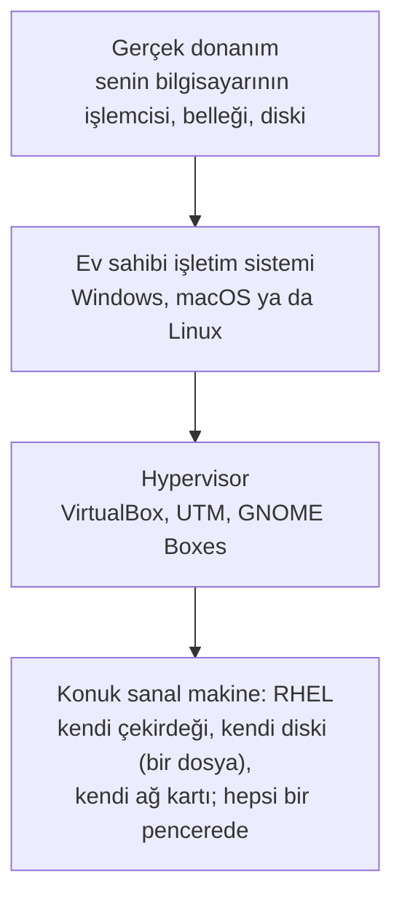
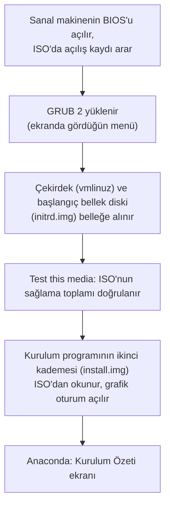
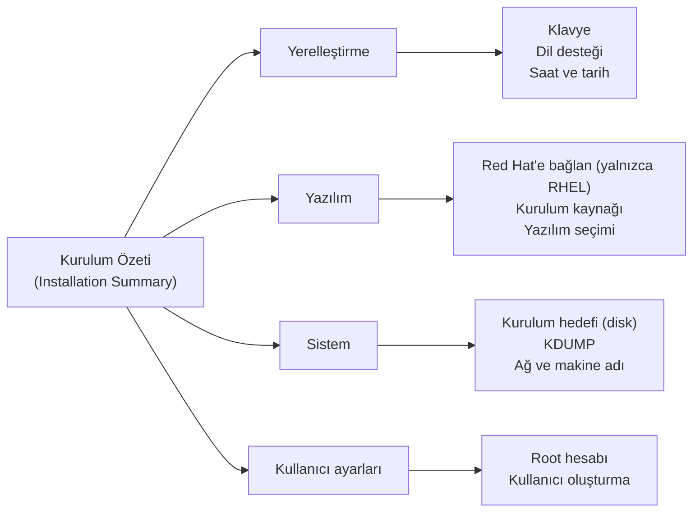
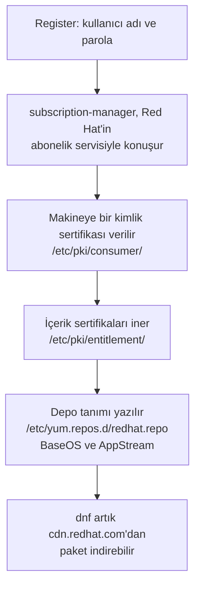
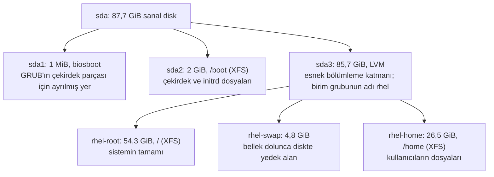
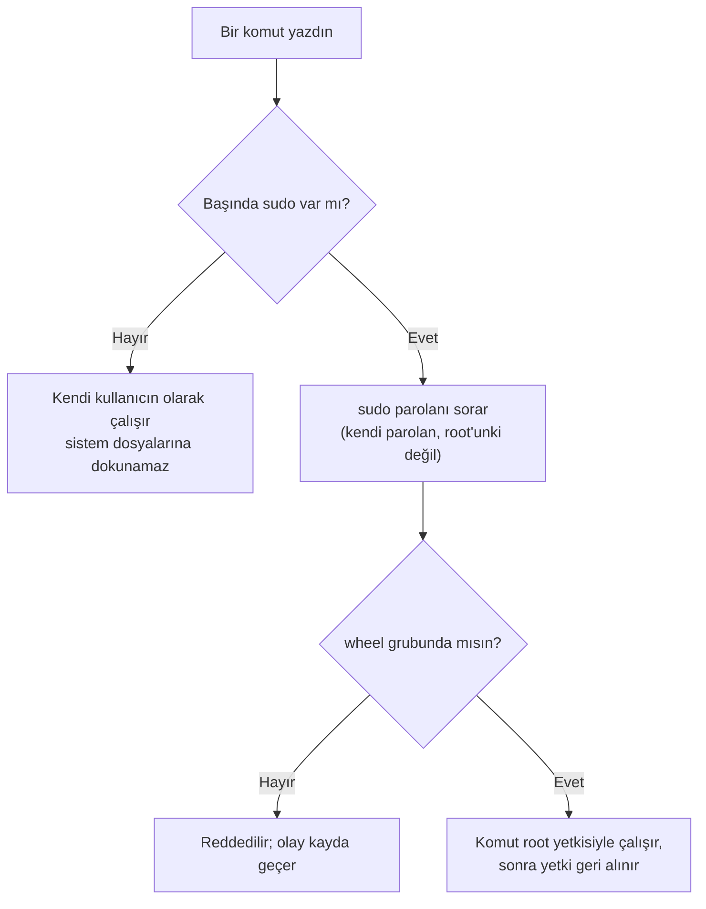
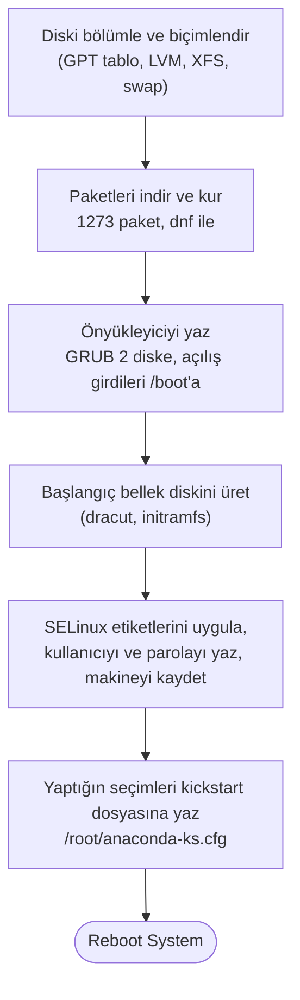
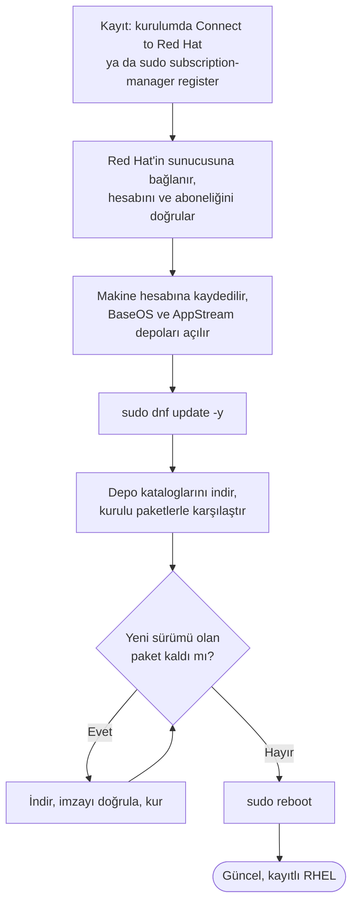

import Callout from '../../components/Callout.astro';
import Steps from '../../components/Steps.astro';
import Figure from '../../components/Figure.astro';
import vboxImg from '../../assets/ss-virtualbox-main.webp';
import boxesImg from '../../assets/ss-gnome-boxes.webp';
import bootImg from '../../assets/rhel10-01-boot-menu.webp';
import langImg from '../../assets/rhel10-02-language.webp';
import sumImg from '../../assets/rhel10-03-summary.webp';
import kbdImg from '../../assets/rhel10-04-keyboard.webp';
import timeImg from '../../assets/rhel10-05-timedate.webp';
import swImg from '../../assets/rhel10-07-software.webp';
import destImg from '../../assets/rhel10-08-destination.webp';
import netImg from '../../assets/rhel10-09-network.webp';
import rootImg from '../../assets/rhel10-10-root.webp';
import rootOnImg from '../../assets/rhel10-10b-root-enabled.webp';
import userImg from '../../assets/rhel10-11-user.webp';
import readyImg from '../../assets/rhel10-12-summary-ready.webp';
import progImg from '../../assets/rhel10-13-progress.webp';
import connectImg from '../../assets/rhel10-06-connect.webp';
import deskImg from '../../assets/rhel10-16b-desktop.webp';
import subImg from '../../assets/rhel10-19-subscription.webp';
import tdImg from '../../assets/rhel10-20-timedatectl.webp';
import lsblkImg from '../../assets/rhel10-21-lsblk.webp';
import netCliImg from '../../assets/rhel10-22-network.webp';
import idImg from '../../assets/rhel10-23-identity.webp';
import ksImg from '../../assets/rhel10-24-kickstart.webp';
import grpImg from '../../assets/rhel10-25-groups.webp';
import chkImg from '../../assets/rhel10-26-check-update.webp';
import updImg from '../../assets/rhel10-27-dnf-update.webp';
import instImg from '../../assets/rhel10-28-dnf-install.webp';
import treeImg from '../../assets/rhel10-29-tree.webp';
import histImg from '../../assets/rhel10-30-history.webp';
import completeImg from '../../assets/rhel10-14-complete.webp';
import loginImg from '../../assets/rhel10-15-login.webp';
import welcomeImg from '../../assets/rhel10-16-welcome.webp';
import actImg from '../../assets/rhel10-17-activities.webp';
import termImg from '../../assets/rhel10-18-terminal.webp';

[İlk bölümde](/blog/red-hat-nedir) uzun uzun konuştuk: Linux bir motor, dağıtım motorun etrafındaki araba,
Red Hat o arabayı on yıl garantiyle satan şirket. Bugün konuşmayı bırakıp arabayı garaja çekiyoruz: RHEL'i
kendi bilgisayarına kuracağız. Hem de bir kuruş ödemeden, çünkü Bölüm 1'de anlattığım ücretsiz geliştirici
aboneliğini bugün gerçekten alacağız.

Yazının sonunda elinde çalışan, güncel, Red Hat hesabına kayıtlı bir RHEL makinesi olacak. Serinin geri kalanı
bu makinede geçecek; terminal, dosyalar, kullanıcılar, paketler, servisler... hepsi burada. O yüzden bu bölüm
biraz "tarif" gibi: adım adım, ekran ekran. [Algoritmalar serisinin ilk yazısında](/blog/algoritma-nedir) çay
demlemeyi adımlara bölmüştük ya; kurulum da tam olarak bir algoritma. Sırayı bozmadan gidersen sonunda çay
hazır.

<Callout type="important" title="Kısa cevap: RHEL nasıl kurulur?">
**RHEL 10** kurmak için beş şey yapacaksın: (1) developers.redhat.com'da ücretsiz bir Red Hat hesabı aç;
geliştirici aboneliği 16 makineye kadar bedava. (2) RHEL 10 ISO'sunu indir; 1 GB'lık Boot ISO yeter.
(3) VirtualBox'ta bir sanal makine oluştur (2 çekirdek, 4 GB bellek, 30 GB disk) ve ISO'yu tak. (4) Anaconda
kurulum programında dil, klavye, saat, Connect to Red Hat, yazılım seçimi, disk, ağ ve kullanıcıyı ayarlayıp
Begin Installation'a bas; 10-15 dakika sürer. (5) Yeniden başlat, giriş yap ve `sudo dnf update -y` ile
güncelle. Her adımın ekranı ve perde arkası aşağıda.
</Callout>

<Callout type="note" title="Bu bölüm için gerekenler">
- Windows, macOS ya da Linux çalıştıran bir bilgisayar. 8 GB bellek rahat, 4 GB idare eder.
- Diskte 30 GB boş yer ve yaklaşık 10 GB indirmeyi kaldıracak bir internet bağlantısı.
- Bir e-posta adresi (Red Hat hesabı için) ve kesintisiz bir-iki saat.
- Bu sefer kalem kâğıt değil; ama kurulum sırasında not almak için yine işine yarar.
</Callout>

<Callout type="tip" title="Ekran görüntüleri hakkında">
Bu yazıdaki bütün kurulum ekranları, yazıyı yazarken VirtualBox 7.2 içinde sıfırdan kurduğum **RHEL 10.2**
makinesinden alındı; hiçbir görüntü başka yerden gelmiyor. RHEL 9'da düzen aynı, yalnızca root kutusunun adı ve
varsayılanı biraz farklı; yeri gelince söylerim.
</Callout>

## Önce iki kavram: ISO ve sanal makine

İki yeni kelime var, ikisini de kurulumdan önce yerine oturtalım.

**ISO dosyası,** bir kurulum diskinin tek dosyaya sığdırılmış hâlidir. Eskiden işletim sistemleri DVD ile
gelirdi; ISO, o DVD'nin içindeki her şeyin bayt bayt kopyasıdır (adı, CD standardını yazan kuruluştan geliyor).
Bugün DVD yok ama dosya duruyor: ya bir USB belleğe yazıp gerçek bilgisayarı ondan başlatırsın ya da bir
sanal makineye "sanal DVD" olarak takarsın. Biz ikincisini yapacağız.

**Sanal makine** (virtual machine, kısaca VM), bilgisayarının içinde çalışan ikinci bir bilgisayardır. Bir
program, işlemcinin ve belleğin bir kısmını ayırıp bunları "sanki ayrı bir bilgisayarmış gibi" sunar; sen o
sanal bilgisayara istediğin işletim sistemini kurarsın. Bu işi yapan programa **hypervisor** denir; VirtualBox,
UTM, GNOME Boxes birer hypervisor'dır. Senin asıl bilgisayarına **ev sahibi** (host), içindeki sanal
bilgisayara **konuk** (guest) denir.



Neden doğrudan bilgisayara kurmuyoruz? Üç neden. Birincisi, güvenlik: Windows'un ya da macOS'un yanında,
ona hiç dokunmadan çalışır. İkincisi, cesaret: bu seride bir şeyleri kırmanı istiyorum; sanal makinede bir şey
bozulunca ya anlık görüntüye dönersin ya da silip on beş dakikada yeniden kurarsın. Üçüncüsü, gerçekçilik:
işyerinde karşılaşacağın RHEL sunucularının büyük kısmı zaten sanal makinedir, sadece daha büyük bir
hypervisor'ın (VMware, KVM ya da bir bulut) içinde koşarlar. [Bölüm 1'deki](/blog/red-hat-nedir) apartman
yöneticisi benzetmesini hatırlarsan: hypervisor, apartmanın içine ikinci bir apartman kuran müteahhit gibidir.

### Hangi hypervisor?

| Bilgisayarın | Önerim | Not |
| --- | --- | --- |
| Windows | **VirtualBox** (ücretsiz) | VMware Workstation da kişisel kullanım için ücretsiz |
| Intel işlemcili Mac | **VirtualBox** | Aynı x86_64 ISO |
| Apple Silicon Mac (M1, M2, M3, M4) | **UTM** (ücretsiz) | RHEL'in **aarch64** ISO'sunu indir; UTM'de "Virtualize" seç, "Emulate" değil |
| Linux masaüstü (Fedora, Ubuntu, Pardus...) | **GNOME Boxes** ya da virt-manager | Sistemdeki KVM'i kullanır, en hızlısı |

<div style="display:flex;flex-wrap:wrap;gap:1.25rem;justify-content:center;align-items:flex-start;margin:1.5rem 0;">
  <div style="flex:1 1 300px;max-width:420px;">
    <Figure src={vboxImg} alt="VirtualBox 7 ana penceresi" caption="VirtualBox 7'nin ana penceresi: soldaki liste sanal makinelerin, üstteki New düğmesi yenisini oluşturur. (Ekran görüntüsü: Iketsi, CC BY-SA 4.0, Wikimedia Commons.)" />
  </div>
  <div style="flex:1 1 300px;max-width:420px;">
    <Figure src={boxesImg} alt="GNOME Boxes 47" caption="Linux masaüstünde GNOME Boxes: aynı iş, daha sade bir pencere. (Ekran görüntüsü: GNOME Projesi, LGPL, Wikimedia Commons.)" />
  </div>
</div>

Bu yazıda ekranları VirtualBox üzerinden anlatacağım; UTM ve Boxes'ta yalnızca "sanal makineyi oluşturma"
penceresi farklıdır, RHEL'in kendi kurulum ekranları birebir aynıdır.

<Callout type="caution" title="Üç tuzak, kuruluma başlamadan">
**Sanallaştırma kapalı olabilir.** Pek çok bilgisayarda işlemcinin sanallaştırma özelliği (Intel'de VT-x,
AMD'de AMD-V) fabrikadan kapalı gelir. VirtualBox "VT-x is not available" derse ya da sanal makine çok yavaşsa,
bilgisayarı yeniden başlatıp BIOS/UEFI ayarlarına gir (genellikle açılışta F2, Del ya da F10) ve
"Virtualization" seçeneğini aç. Windows'ta ayrıca Hyper-V ya da WSL açıksa VirtualBox yavaşlayabilir; o
durumda "Windows özelliklerini aç veya kapat" penceresinden Hyper-V'yi geçici olarak kapatabilirsin.

**RHEL 10, 2013 öncesi işlemcilerde çalışmaz.** RHEL 10, işlemciden "x86-64-v3" denen bir özellik seti ister;
Intel'de Haswell (2013) ve sonrası, AMD'de 2015 sonrası. Bilgisayarın daha eskiyse kurulum daha ilk ekranda
durur; bu durumda aynı sayfadan RHEL 9'u indir, gerisi aynı.

**Apple Silicon'da x86_64 ISO çalışmaz.** M serisi Mac'ler ARM işlemcilidir; RHEL'in aarch64 sürümünü
indirmen gerekir. Bölüm 1'de RHEL'in ARM'de de çalıştığını söylemiştim; işte kanıtı.
</Callout>

### ISO'dan açılış: perde arkası

Kuruluma başlamadan, "sanal makineyi ISO'dan başlat" dediğimizde neler olduğunu bir kere görelim; çünkü bu zincir,
Bölüm 1'de anlattığım açılış zincirinin ta kendisi, yalnızca disk yerine ISO'dan.



Her ISO'nun içinde, eski CD'lerden kalma bir standartla (El Torito) tanımlanmış küçük bir açılış alanı vardır;
BIOS onu bulur ve **GRUB 2**'yi çalıştırır. Menüde gördüğün dört satır GRUB'ın satırlarıdır. Seçim yapılınca GRUB
iki dosyayı belleğe alır: **çekirdek** (Bölüm 1'deki motor; dosya adı `vmlinuz`) ve **initrd** denen, çekirdeğin
diski ve ISO'yu bulmasına yetecek kadar sürücü ve araç içeren sıkıştırılmış bir mini dosya sistemi. Çekirdek
uyanır, ISO'yu bulur ve kurulum programının asıl gövdesini (`install.img`) okur. O gövde, adı **Anaconda** olan
programdır.

<Callout type="note" title="Tarih notu: Anaconda, kickstart ve yılan isimleri">
Anaconda, Red Hat'in 1999'da Red Hat Linux 6.1 ile kullanmaya başladığı kurulum programı; yirmi beş yıldır
Fedora, CentOS ve RHEL'in hepsinde aynı program çalışır. Python ile yazılmıştır ve adı da oradan bir şaka:
Python bir yılan, Anaconda daha büyük bir yılan. Kurulumun sonunda Anaconda, senin ekranlarda yaptığın her
seçimi bir metin dosyasına yazar: `/root/anaconda-ks.cfg`. Bu dosyaya **kickstart** denir ve aynı kurulumu
tek tuşla bir daha, hatta iki yüz makineye birden yapmanın yoludur; Bölüm 1'de "şu 200 sunucuda şu ayarı yap"
diye tanıttığım otomasyon dünyasının kurulum ayağı. Yazının sonunda o dosyaya birlikte bakacağız.

İki küçük ayrıntı daha. **Test this media** seçeneği, ISO'nun içine gömülü bir sağlama toplamını (Adım 2'de
anlattığım parmak izi) diskten okunan verilerle karşılaştırır; indirme sırasında bozulan bir bayt burada
yakalanır. **Troubleshooting** menüsünde ise bozulan bir sistemi kurtarmak için **rescue mode,** belleği test
eden bir araç ve ekran sorunları için "basic graphics mode" vardır; 8. bölümde rescue mode'a geri döneceğiz. Bir
de gizli kapı: kurulum ekranındayken **Ctrl+Alt+F2** ile Anaconda'nın kendi kabuğuna geçebilirsin; günlükleri
ve arka planda dönen komutları oradan izleyen sistem yöneticileri vardır.
</Callout>

## Adım 1: Red Hat hesabı ve ücretsiz abonelik

[Bölüm 1'de](/blog/red-hat-nedir) abonelik modelini anlatmıştım: RHEL'in kodu açık, ama Red Hat'in test edip
paketlediği sürümü ve güncellemeleri almak için bir abonelik gerekiyor. Bireysel geliştiriciler için bu
abonelik ücretsiz ve 16 sisteme kadar geçerli. Almak beş dakika.

<Steps>

1. Tarayıcıda **developers.redhat.com** adresine git ve sağ üstteki **Register** (Kaydol) bağlantısına
   tıkla. E-posta, ad, kullanıcı adı ve parola iste; bir Red Hat hesabı açılır.
2. E-postana gelen doğrulama bağlantısına tıkla ve giriş yap.
3. İlk girişte kullanım şartlarını kabul et. Hesabı açtığın anda **Red Hat Developer Subscription for
   Individuals** aboneliği hesabına tanımlanır; ayrıca bir şey satın alman ya da kart girmen gerekmez.
4. Kullanıcı adını ve parolanı bir yere not et. Kurulumun sonunda makineyi bu hesaba kaydederken
   soracağız.

</Steps>

Abonelik bir yıl geçerlidir; yılın sonunda aynı siteye girip şartları yeniden kabul ettiğinde yenilenir. Bir
de şu var: bu hesap yalnızca ISO indirmek için değil; Red Hat'in belgelerine, bilgi bankasına ve destek
portalına da giriş biletin. Kurulumdan sonra sık uğrayacaksın.

## Adım 2: ISO'yu indirmek

<Steps>

1. Hesabınla giriş yapmışken **developers.redhat.com/products/rhel/download** sayfasına git.
2. En yeni büyük sürümü seç: bu yazı yazılırken **RHEL 10.**
3. İşlemcine uygun mimariyi seç: Windows, Linux ve Intel Mac için **x86_64;** Apple Silicon Mac için
   **aarch64.**
4. İki ISO var. **Boot ISO** (1 GB) yalnızca kurulum programını içerir; paketleri kurulum sırasında Red Hat'in
   sunucularından indirir ve bunun için kurulumda hesabına **kayıt olmanı ister.** **DVD ISO** (yaklaşık 10 GB)
   her şeyi içinde taşır; kayıt sonraya kalabilir. Ben Boot ISO'yu kullandım: hesabın zaten var, kaydı kurulumda
   yapmak en kısa yol. Yazının geri kalanı bu yola göre; DVD ISO seçtiysen tek fark, kaydı 5. bölümde terminalden
   yapmak.
5. İndirme bitince elinde `rhel-10.2-x86_64-boot.iso` adlı bir dosya olur (DVD seçtiysen
   `rhel-10.2-x86_64-dvd.iso`). Adı Bölüm 1'deki paket adları gibi oku: `rhel` ürün, `10.2` sürüm, `x86_64`
   mimari, `boot` ya da `dvd` ISO türü.

</Steps>

<Callout type="note" title="Merak edenler için: indirilen dosya bozuk mu?">
Büyük bir dosya indirilirken bir bayt bile bozulursa kurulum garip yerlerde çöker. Bunu yakalamak için Red
Hat her ISO'nun yanında bir **sağlama toplamı** (SHA-256 checksum) yayımlar: dosyanın içeriğinden hesaplanan,
parmak izi gibi bir sayı. Kurulum programının açılış menüsündeki "Test this media & install" seçeneği zaten bu
kontrolü senin yerine yapar; o yüzden şimdilik bir şey yapman gerekmiyor. Terminali öğrendiğimizde bu
kontrolü tek komutla kendin yapmayı da göstereceğim.
</Callout>

## Adım 3: Sanal makineyi oluşturmak

Şimdi konuk bilgisayarı kuruyoruz: henüz içinde bir şey yok, sadece bir kasa, bellek ve boş bir disk.
VirtualBox'ı [virtualbox.org](https://www.virtualbox.org/) adresinden indirip kurduğunu varsayıyorum.

<Steps>

1. VirtualBox'ı aç, **New** (Yeni) düğmesine bas.
2. **Name:** `rhel-lab`. VirtualBox adı görünce türü kendisi seçer; seçmezse **Type:** Linux, **Version:**
   Red Hat (64-bit).
3. **ISO Image:** az önce indirdiğin ISO dosyasını seç.
4. **Skip Unattended Installation** kutusunu işaretle. VirtualBox 7'nin "otomatik kurulum" özelliği iyi
   niyetli ama RHEL'de yarım yamalak sonuçlar veriyor; kurulumu kendimiz yapacağız, zaten amacımız o.
5. **Hardware:** Base Memory **4096 MB** (bilgisayarında 4 GB varsa 2048), Processors **2.**
6. **Hard Disk:** yeni bir sanal disk oluştur. **30 GB** yeter; ben 90 GB verdim ki 11. bölümdeki disk
   denemelerine yer kalsın (Anaconda 50 GB'tan büyük diskte ayrı bir `/home` bölümü açar, birazdan göreceksin).
   "Pre-allocate" kutusunu boş bırak; disk dosyası kullandıkça büyür, verdiğin boyutu hemen kaplamaz.
7. **Finish.** Listede `rhel-lab` belirir. Henüz başlatma.

</Steps>

Boxes kullanıyorsan: **+** → **Install from file** → ISO'yu seç → bellek ve diski aynı değerlere getir.
UTM'de: **Create a New Virtual Machine** → **Virtualize** → **Linux** → ISO'yu seç → bellek 4096 MB, 2 çekirdek,
disk 30 GB. Üçünde de sonuç aynı: ISO'su takılı, boş diskli bir sanal bilgisayar.

<Callout type="tip" title="Sanal disk dediğimiz şey aslında tek bir dosya">
Ev sahibi bilgisayarında, VirtualBox'ın klasöründe `rhel-lab.vdi` diye bir dosya oluştu. Konuk RHEL için o
dosya koca bir disk; ev sahibi için sıradan bir dosya. Bölüm 1'deki "diskteki her şey aslında baytlardır"
cümlesinin hoş bir örneği: bir diskin tamamı, başka bir diskte tek bir dosya olarak durabiliyor. Yedeklemek
istersen o dosyayı kopyalaman yeter.
</Callout>

## Adım 4: Anaconda ile kurulum

Sanal makineyi **Start** ile başlat. ISO'dan açılır ve birkaç saniye içinde bir menü gelir. RHEL'in kurulum
programının adı **Anaconda;** 1999'dan beri Red Hat'in yazdığı, Fedora'da ve RHEL'de aynı olan bir program.
Bütün kurulum, şu haritadaki tek ekran etrafında döner:



<Figure src={sumImg} alt="RHEL 10.2 Anaconda Kurulum Özeti ekranı" caption="Kurulum Özeti: dört bölüm, her kutu bir ayar. Uyarı işaretli kutular (Red Hat'e bağlan, disk, root, kullanıcı) tamamlanmadan Begin Installation açılmaz; Boot ISO ile Software Selection kayıt yapılana kadar gri kalır. Saat dilimi konumdan Europe/Istanbul gelmiş bile." />

Bu ekranın güzel yanı, sırayla gitmek zorunda olmaman: her kutuya girer, ayarlar, geri dönersin; kırmızı
uyarı işareti kalan kutu olmayınca **Begin Installation** düğmesi açılır. Şimdi tek tek:

<Steps>

1. **Açılış menüsü.** Sanal makine ISO'dan açılır ve GRUB menüsü gelir: **Install Red Hat Enterprise Linux
   10.2**, **Test this media & install** (varsayılan), FIPS modu ve Troubleshooting. Varsayılan seçili kalsın,
   Enter; ya da 60 saniye bekle, kendisi başlar. Bir-iki dakika ISO'yu doğrular (az önceki sağlama toplamı işi),
   sonra kurulum programı yüklenir.
2. **Dil.** İlk ekranda kurulum programının ve sistemin dilini seçiyorsun. Kurulum programı bulunduğun ülkeye
   bakıp **Türkçe'yi seçili getirebilir;** bende öyle oldu. Listeden **English**'i seç, sağda **English (United
   States)** kalsın. Nedeni aşağıdaki kutuda. **Continue.**
3. **Klavye (Keyboard).** Kurulum Özeti'nde **Keyboard**'a gir. Listede yalnızca English (US) var; alttaki artı
   düğmesine bas, açılan pencerede `Turkish` yazıp listeden seç (F klavye kullanıyorsan **Turkish (F)**), **Add.**
   Yukarı ok ile en üste taşı, sağdaki kutuda birkaç Türkçe harf dene. **Done** (sol üstte, mavi düğme).
4. **Saat ve tarih (Time & Date).** Harita yok; iki açılır liste var: **Region: Europe, City: Istanbul.**
   Konumundan dolayı büyük ihtimalle zaten seçili gelir. "Automatic date & time" açık kalsın. **Done.**
5. **Red Hat'e bağlan (Connect to Red Hat).** Boot ISO ile bu adım **zorunlu:** kayıt yapılmadan Software
   Selection kutusu "Red Hat CDN requires registration" diyerek gri kalır. **Account** seçili, Red Hat kullanıcı
   adını ve parolanı yaz, **Register.** Birkaç saniye sonra "Not registered" yazısı kayıt bilgisiyle değişir.
   "Connect to Red Hat Insights" kutusu işaretli kalsın; ne olduğunu Bölüm 1'de anlatmıştım. **Done.** (DVD ISO
   ile kurarken bu kutuyu atlayıp kaydı sonradan terminalden yapabilirsin; 5. bölümde gösteriyorum.)
6. **Yazılım seçimi (Software Selection).** Kayıttan sonra kutu açılır. Sol listeden **Server with GUI** seç
   (bende varsayılan olarak seçili geldi); sağdaki ek paketlere dokunma. Ne seçtiğini aşağıdaki kutuda anlattım.
   **Done.**
7. **Kurulum hedefi (Installation Destination).** Tek disk görünür: "ATA VBOX HARDDISK" adlı sanal diskimiz
   (bende 87,7 GiB), üstünde onay işareti. **Storage Configuration: Automatic** kalsın. Altta bir de **Encrypt my data** kutusu var; Bölüm 1'in
   son notunu hatırla, gerçek bir sunucuda bunu işaretlerdik. Şimdilik boş bırak. **Done.** Anaconda diski
   kendi bölecek; ne yaptığını birazdan şemayla göreceksin.
8. **Ağ ve makine adı (Network & Host Name).** Sağ üstteki anahtar **ON** olsun (VirtualBox'ta genelde açık
   gelir; kartın adı `enp0s3`); ağ kartı ev sahibinin internetini kullanır ve bir IP alır. Alttaki **Host Name**
   kutusuna `rhel-lab` yazıp **Apply**; sağda "Current host name: rhel-lab" yazısını gör. **Done.**
9. **Root hesabı (Root Account).** RHEL 10 burada **Disable root account** seçili gelir ve önerim böyle
   bırakman: yönetici yetkisini bir sonraki adımdaki kullanıcın taşıyacak. Root'u yine de açmak istersen
   **Enable root account**'u seç, güçlü bir parola yaz; **Allow root SSH login with password** kutusu boş kalsın.
   Root kim, birazdan. **Done.** (RHEL 9'da bu kutunun adı Root Password ve root açık gelir; orada parola
   belirlemen istenir.)
10. **Kullanıcı oluşturma (User Creation).** **Full name** yaz; **User name** kendiliğinden türetilir, istersen
    değiştir: küçük harf, Türkçe karakter ve boşluk yok (`mehmet` gibi). **Add administrative privileges to this
    user account (wheel group membership)** kutusu işaretli gelir; **öyle kalsın,** sudo yetkisi buradan.
    Parolayı iki kez yaz; alttaki çubuk "Strong" diyene kadar uzat. **Done.**
11. **Begin Installation.** Uyarı işaretleri kalkınca sağ alttaki düğme maviye döner. Bas. Boot ISO ile önce
    paketler indirilir (bende 1257 paket, 1,32 GiB), sonra kurulur; DVD ISO ile doğrudan diskten kurulur.
    İlerleme çubuğu on-yirmi dakika sürer; bu arada aşağıdaki iki kutuyu oku.
12. **Reboot System.** Kurulum bitince "Red Hat Enterprise Linux is now successfully installed" yazısı ve bu
    düğme çıkar; altta lisans sözleşmesinin yerini söyleyen bir not belirir. Basmadan önce VirtualBox'ta
    **Devices → Optical Drives → Remove disk from virtual drive** ile ISO'yu çıkar; yoksa makine ISO'dan açılıp
    kurulum menüsünü yeniden gösterir (ilk denemelerimden birinde tam bu oldu). Sonra **Reboot System.**
13. **İlk açılış.** RHEL 10.2'de ayrı bir lisans ekranı gelmedi; lisans, kurulum sonundaki notla kabul edilmiş
    sayılıyor (RHEL 9'da bir **Initial Setup** ekranı çıkar, kabul edip **Finish Configuration** dersin). Karşına
    Red Hat logolu **giriş ekranı** gelir: kullanıcı adına tıkla, parolanı yaz. GNOME masaüstü açılır ve
    "Welcome to Red Hat Enterprise Linux 10.2 (Coughlan)" diye kısa bir tur önerir; **Skip** ile geçebilirsin.

</Steps>

### Ekranlar

Adımları görüntülerle bir daha izleyelim; hepsi kendi RHEL 10.2 kurulumumdan.

<div style="display:flex;flex-wrap:wrap;gap:1.25rem;justify-content:center;align-items:flex-start;margin:1.5rem 0;">
  <div style="flex:1 1 300px;max-width:400px;">
    <Figure src={bootImg} alt="RHEL 10.2 GRUB açılış menüsü" caption="Adım 1, açılış menüsü: Test this media & install Red Hat Enterprise Linux 10.2 seçili; 60 saniye içinde kendisi başlar." />
  </div>
  <div style="flex:1 1 300px;max-width:400px;">
    <Figure src={langImg} alt="RHEL 10.2 Anaconda dil seçimi ekranı" caption="Adım 2, dil: kurulum programı konumdan Türkçe seçmiş; listeden English seçiyoruz, sağ alttaki Sürdür ile devam." />
  </div>
</div>

<div style="display:flex;flex-wrap:wrap;gap:1.25rem;justify-content:center;align-items:flex-start;margin:1.5rem 0;">
  <div style="flex:1 1 300px;max-width:400px;">
    <Figure src={kbdImg} alt="RHEL 10.2 klavye düzeni ekranı, Turkish eklenmiş" caption="Adım 3, klavye: artı düğmesiyle Turkish eklendi; sağdaki kutuda denenir, Done sol üstte." />
  </div>
  <div style="flex:1 1 300px;max-width:400px;">
    <Figure src={timeImg} alt="RHEL 10.2 saat ve tarih ekranı" caption="Adım 4, saat ve tarih: Region Europe, City Istanbul; otomatik saat açık." />
  </div>
</div>

<div style="display:flex;flex-wrap:wrap;gap:1.25rem;justify-content:center;align-items:flex-start;margin:1.5rem 0;">
  <div style="flex:1 1 300px;max-width:400px;">
    <Figure src={connectImg} alt="RHEL 10.2 Connect to Red Hat ekranı" caption="Adım 5, Red Hat'e bağlan: Account seçili, kullanıcı adı ve parola, Register. Insights kutusu işaretli kalsın." />
  </div>
  <div style="flex:1 1 300px;max-width:400px;">
    <Figure src={swImg} alt="RHEL 10.2 yazılım seçimi ekranı" caption="Adım 6, yazılım seçimi: solda ortamlar (Server with GUI seçili), sağda ek paketler." />
  </div>
</div>

<div style="display:flex;flex-wrap:wrap;gap:1.25rem;justify-content:center;align-items:flex-start;margin:1.5rem 0;">
  <div style="flex:1 1 300px;max-width:400px;">
    <Figure src={destImg} alt="RHEL 10.2 kurulum hedefi ekranı" caption="Adım 7, kurulum hedefi: 87,7 GiB sanal disk (ATA VBOX HARDDISK) seçili, Automatic; altta Encrypt my data seçeneği." />
  </div>
  <div style="flex:1 1 300px;max-width:400px;">
    <Figure src={netImg} alt="RHEL 10.2 ağ ve makine adı ekranı" caption="Adım 8, ağ ve makine adı: enp0s3 bağlı ve IP almış; Host Name kutusuna rhel-lab yazılıp Apply denmiş." />
  </div>
</div>

<div style="display:flex;flex-wrap:wrap;gap:1.25rem;justify-content:center;align-items:flex-start;margin:1.5rem 0;">
  <div style="flex:1 1 300px;max-width:400px;">
    <Figure src={rootImg} alt="RHEL 10.2 root hesabı ekranı" caption="Adım 9, root hesabı: RHEL 10 varsayılanı Disable root account. Böyle bırakıyoruz." />
  </div>
  <div style="flex:1 1 300px;max-width:400px;">
    <Figure src={rootOnImg} alt="RHEL 10.2 root hesabı etkin ekranı" caption="Root'u açmak isteyenler için: Enable root account seçilince parola alanları ve SSH kutusu belirir." />
  </div>
</div>

<div style="display:flex;flex-wrap:wrap;gap:1.25rem;justify-content:center;align-items:flex-start;margin:1.5rem 0;">
  <div style="flex:1 1 300px;max-width:400px;">
    <Figure src={userImg} alt="RHEL 10.2 kullanıcı oluşturma ekranı" caption="Adım 10, kullanıcı: yönetici yetkisi kutusu işaretli, parola çubuğu Strong." />
  </div>
  <div style="flex:1 1 300px;max-width:400px;">
    <Figure src={readyImg} alt="RHEL 10.2 özet ekranı, kuruluma hazır" caption="Her kutu tamam: Connect to Red Hat &quot;Registered&quot;, uyarı çubuğu gitti, Begin Installation maviye döndü." />
  </div>
</div>

<div style="display:flex;flex-wrap:wrap;gap:1.25rem;justify-content:center;align-items:flex-start;margin:1.5rem 0;">
  <div style="flex:1 1 300px;max-width:400px;">
    <Figure src={progImg} alt="RHEL 10.2 kurulum ilerleme ekranı" caption="Adım 11, kurulum sürüyor: Boot ISO ile önce 1257 paket indiriliyor." />
  </div>
  <div style="flex:1 1 300px;max-width:400px;">
    <Figure src={completeImg} alt="RHEL 10.2 kurulum tamamlandı ekranı" caption="Adım 12, tamamlandı: Reboot System maviye döndü; altta lisans sözleşmesinin yeri yazıyor." />
  </div>
</div>

<div style="display:flex;flex-wrap:wrap;gap:1.25rem;justify-content:center;align-items:flex-start;margin:1.5rem 0;">
  <div style="flex:1 1 300px;max-width:400px;">
    <Figure src={loginImg} alt="RHEL 10.2 giriş ekranı" caption="Adım 13, giriş ekranı: kurulumda oluşturduğun kullanıcı listede; tıkla, parolanı yaz." />
  </div>
  <div style="flex:1 1 300px;max-width:400px;">
    <Figure src={welcomeImg} alt="RHEL 10.2 GNOME karşılama turu" caption="İlk girişte GNOME kısa bir tur önerir; Skip ile geçebilirsin. Alttaki çubukta terminal simgesi (üçüncü) duruyor." />
  </div>
</div>

<div style="display:flex;flex-wrap:wrap;gap:1.25rem;justify-content:center;align-items:flex-start;margin:1.5rem 0;">
  <div style="flex:1 1 300px;max-width:400px;">
    <Figure src={deskImg} alt="RHEL 10.2 masaüstü" caption="Karşılama turunu geçince: RHEL 10.2 masaüstü, sol üstte Red Hat logolu Activities düğmesi." />
  </div>
  <div style="flex:1 1 300px;max-width:400px;">
    <Figure src={actImg} alt="RHEL 10.2 GNOME Activities görünümü" caption="Activities görünümü: arama kutusu ve uygulama çubuğu. Terminali buradan açacağız." />
  </div>
</div>

Tebrikler, ilk RHEL makinen çalışıyor. Ama daha bitmedi; kayıt ve güncelleme var. Önce üç kutudaki soruları
kapatalım.

<Callout type="important" title="Neden sistem dili İngilizce?">
Türkçe seçebilirsin, çalışır. Ama sana İngilizce'yi önermemin sebebi şu: bu seride okuyacağın her hata
mesajı, her belge, her forum cevabı ve RHCSA sınavının kendisi İngilizce. Ekranında "İzin reddedildi" yazarken
belgede "Permission denied" aramak zorunda kalırsın. Sistem İngilizce, klavye Türkçe: en rahat bileşim bu.
Bölüm 1'de "jargonu Türkçeleştirerek anlatacağım" demiştim; o söz duruyor, ama makinenin kendi dili İngilizce
kalsın.
</Callout>

<Callout type="note" title="Yazılım seçimi: Server with GUI, Server, Minimal">
Anaconda'nın sunduğu "ortamlar" aslında paket demetleridir; [Bölüm 1'deki](/blog/red-hat-nedir) IKEA
kutularının önceden seçilmiş listeleri gibi. **Minimal Install** yalnızca çekirdek, kabuk ve temel araçlar;
birkaç yüz paket. **Server** buna sunucu araçlarını ekler ama masaüstü koymaz; gerçek sunucuların büyük
çoğunluğu budur. **Server with GUI** ise üstüne GNOME masaüstünü, bir tarayıcıyı ve grafik araçları koyar;
bin küsur paket. Biz öğrenirken masaüstü istiyoruz: terminali bir pencere olarak açmak, yanına tarayıcıda
belgeyi koymak rahat. Serinin ilerisinde masaüstüne giderek daha az bakacaksın; 10. bölümde uzaktan
bağlanmayı öğrenince "Server" seçili ikinci bir makine kurup gerçek sunucu hissini de tadacağız. Bir ortam
seçmek geri dönülmez değil: sonradan dnf ile paket eklemek ya da çıkarmak her zaman mümkün.
</Callout>

### Ayarların perde arkası: dil, klavye, saat

Kurulum ekranındaki her kutu, diskte birkaç satırlık bir ayara dönüştü. Terminalden bakınca ne olduğunu
görebiliyorsun; birkaçını şimdiden tanıyalım, çünkü bunlar 3. bölümden itibaren elinin altında olacak.

<Figure src={tdImg} alt="RHEL 10.2 terminalinde timedatectl ve localectl çıktısı" caption="timedatectl: yerel saat +03, donanım saati UTC, NTP etkin ve saat senkron. localectl: sistem dili en_US.UTF-8, konsol klavyesi us, grafik düzenler us ve tr." />

**Dil,** teknik adıyla **locale,** üç parçalı bir koddur: `en_US.UTF-8` = dil (İngilizce), bölge (ABD) ve
karakter kodlaması (UTF-8). Kurulumda "English (United States)" seçmek bu satırı yazmak demek. Bölge kısmı
tarih biçimini, ondalık ayracı, para birimini belirler; UTF-8 ise Türkçe harfler dahil dünyanın bütün
alfabelerini temsil edebilen kodlama. Yani sistem İngilizce konuşuyor ama dosya adlarında "ş" ve "ğ" gayet
rahat. **Klavye** iki katta ayarlanır: metin konsolu için bir keymap (`us`) ve grafik oturum için düzenler
(`us,tr`). Sağ üstteki **en** yazısı ikinci kattaki düzen göstergesi; **Super+Space** ile Türkçe'ye geçer,
yazı **tr** olur.

<Callout type="note" title="Tarih notu: Türkçe F klavye">
Kurulumda karşına iki Türkçe düzen çıktı: **Turkish** (Q) ve **Turkish (F)**. F klavye, 1955'te İhsan Sıtkı
Yener'in Türkçe harf sıklığını ölçerek tasarladığı, en çok kullanılan harfleri en güçlü parmaklara veren bir
düzendir; 1974'te standart oldu. Türkçe yazma hızı rekorlarının çoğu F klavyeyle kırıldı. Yine de bugün
bilgisayarların büyük çoğunluğu Q ile satılıyor; bu yüzden yazıda Q'yu varsaydım. F kullanıyorsan tek fark
kurulumda o satırı seçmek.
</Callout>

**Saat** tarafında iki saat var. Anakartın pil ile çalışan donanım saati (RTC) ve işletim sisteminin sistem
saati. Linux, donanım saatini **UTC**'de tutar (çıktıdaki "RTC in local TZ: no" bu), ekranda ise saat dilimini
uygulayarak yerel saati gösterir; Europe/Istanbul için +03. Türkiye 2016'da yaz saati uygulamasını kaldırıp
kalıcı olarak +03'e geçtiğinden bu fark yıl boyunca sabit; kurallar `tzdata` adlı bir pakette yaşar ve
güncellemelerle gelir. "Automatic date & time" seçeneği ise **NTP** protokolüyle (Network Time Protocol, 1985)
internetteki zaman sunucularından saati düzeltir; RHEL'de bu işi **chrony** adlı servis yapar. Bir sunucuda
saatin doğru olması süs değil: güvenlik sertifikaları tarihe bakar, günlük kayıtları sıralamaya ihtiyaç duyar,
9. bölümde göreceğin zamanlanmış görevler dakikaya güvenir. Saati yarım saat geri bir makine, "sertifika henüz
geçerli değil" diye web sitelerine bağlanamayabilir.

### Kayıt ve depolar: perde arkası

"Connect to Red Hat" kutusunda Register'a bastığında olanlar, Bölüm 1'deki abonelik bölümünün somut hâli:



Makinene bir **kimlik sertifikası** verilir; Red Hat bundan sonra bu makineyi onunla tanır (hesabındaki 16
sistemden birini kullanır). Yanında **içerik sertifikaları** iner: hangi depolara erişebileceğini söyleyen
dijital imzalı belgeler. Son adımda `dnf`'nin okuduğu bir depo dosyası yazılır ve içinde Bölüm 1'de tanıdığın
iki raf vardır: **BaseOS** ve **AppStream**. Bu depolar Red Hat'in **CDN**'inden (İçerik Dağıtım Ağı,
`cdn.redhat.com`) beslenir; adı ekranda "Red Hat CDN" diye geçiyordu.

Eski RHEL'lerde kayıttan sonra bir de elle "abonelik bağlamak" gerekirdi. 2023'ten beri varsayılan olan **Simple
Content Access** bunu kaldırdı: hesap doğrulandıysa içerik açık. Kutudaki öteki iki seçeneğe de bir cümle:
**Set System Purpose,** makinenin rolünü, hizmet seviyesini ve kullanım amacını (üretim, geliştirme) Red Hat'e
bildirir; şirketlerde raporlama için kullanılır, bize gerekmez. **Connect to Red Hat Insights** ise makineye
küçük bir ajan kurar (`insights-client`) ve sistem bilgilerini düzenli olarak console.redhat.com'a gönderir;
Red Hat orada bilinen açıkları, yanlış ayarları ve performans sorunlarını sana raporlar. Şirket ortamında bütün
bu kayıt, kullanıcı adı yerine bir **etkinleştirme anahtarı** ile yapılır; kutunun üstündeki "Activation Key"
seçeneği o.

### Yazılım seçimi: ortamlar ve paket grupları

"Server with GUI" seçtiğinde aslında bir **ortam** seçtin: birlikte kurulması anlamlı paket gruplarının adı
konmuş bir demeti. Kurulumdan sonra listeyi terminalden görebilirsin:

<Figure src={grpImg} alt="RHEL 10.2 terminalinde dnf group list çıktısı" caption="dnf group list: kurulumdaki ortamların aynısı. Kurulu ortam Server with GUI; Container Management ve Headless Management grupları da onunla geldi." />

Kurulum ekranındaki soldaki liste burada "Environment Groups", sağdaki ek paketler "Groups" olarak duruyor.
Bizim seçimimiz `dnf history` çıktısında tek bir işlem olarak görünür: **1273 paket.** Minimal Install birkaç
yüz pakettir; fark, GNOME masaüstü, tarayıcı, yazı tipleri ve grafik araçlardır. Bir ortamı ya da grubu
sonradan eklemek de kolay: 7. bölümde `dnf group install` ile bunu yapacağız. Kickstart dosyasında bu seçim
`@^graphical-server-environment` diye tek satır; ilerde göreceksin.

### Ağ: enp0s3, 10.0.2.15 ve NAT

Ağ kutusunda bir şeye tıklamadan ağ bağlandı; nasıl?

<Figure src={netCliImg} alt="RHEL 10.2 terminalinde free, nproc, ip ve nmcli çıktıları" caption="Sanal makinenin kaynakları: 9,3 GiB bellek, 4,8 GiB swap, 4 işlemci. Ağ kartı enp0s3, adresi 10.0.2.15/24; NetworkManager bağlı diyor; makine adı rhel-lab." />

Kartın adı **enp0s3** rastgele değil: `en` Ethernet, `p0` sıfırıncı PCI veriyolu, `s3` üçüncü yuva. Eski
Linux'lar kartlara `eth0`, `eth1` derdi; iki kartlı bir sunucuda hangisinin sıfır olacağı açılıştan açılışa
değişebiliyordu ve bu, gece üçte çözülen arızaların klasiğiydi. 2012'den beri isimler donanımdaki yerden
türetiliyor; aynı yuvadaki kart her açılışta aynı adı alıyor.

Adres **10.0.2.15** de rastgele değil: VirtualBox'ın **NAT** modunun standart adresi. NAT şu demek: sanal
makine, ev sahibinin arkasına saklanmış küçük bir özel ağda (10.0.2.0/24) yaşar; dışarı çıkmak istediğinde
paketleri ev sahibi kendi adıyla gönderir. Ağ geçidi 10.0.2.2, ad sunucusu 10.0.2.3, adresi dağıtan **DHCP**
sunucusu da VirtualBox'ın kendisi. Sonuç: sanal makine internete çıkar (kayıt ve paket indirme bu yüzden
sorunsuzdu) ama dışarıdan, hatta ev sahibinden sanal makineye doğrudan bağlanılamaz. 10. bölümde uzaktan
bağlanmayı öğrenirken bu duvara çarpacak ve iki çözümünü göreceğiz: port yönlendirme ve köprü (bridged) modu.
Bir de **makine adı** kuralı: küçük harf, rakam ve tire; boşluk, alt çizgi ve Türkçe karakter yok. Buna bir
alan adı eklersen (`rhel-lab.evim.local`) tam nitelikli ad olur; şimdilik kısa hâli yeter, `/etc/hostname`
dosyasında duruyor.

### Anaconda diski nasıl böldü?

"Automatic" dedik ve Anaconda 87,7 GiB'lık diski kendi düzenledi. Ne yaptığına terminalden bakalım; 11. bölümde
bunu elle yapacağız.

<Figure src={lsblkImg} alt="RHEL 10.2 terminalinde lsblk ve df çıktısı" caption="lsblk: sda diskinde üç bölüm; sda3 LVM'e verilmiş, içinde root, swap ve home. df: kökte 55 GB alanın 6,5 GB'ı dolu." />



Parça parça: **sda1** minicik bir bölüm; sanal makine eski tip BIOS ile açıldığı için GRUB'ın bir parçasına yer
lazım, o kadar (UEFI ile açılan bir makinede bunun yerine 600 MiB'lık bir `/boot/efi` bölümü olurdu). **sda2**,
`/boot`: çekirdek ve initrd burada durur; Bölüm 1'deki açılış zincirinin ilk halkaları. RHEL 10 buna 2 GiB
ayırıyor ki birkaç çekirdek sürümü yan yana durabilsin. Geri kalan her şey **sda3**'te ve doğrudan bölüm
olarak değil, **LVM** denen bir katmanın içinde. LVM, bölümleri sonradan büyütüp küçültmeyi, hatta ikinci bir
disk ekleyip aynı bölümü ona taşırmayı sağlayan esnek düzen; birim grubuna Anaconda `rhel` adını verdi ve içine
üç mantıksal birim açtı. **Kök** (`/`) sistemin tamamı; **swap,** bellek dolduğunda çekirdeğin geçici olarak
kullandığı disk alanı, boyutu belleğe göre hesaplanır (10 GiB bellek için 4,8 GiB); **home** ise kullanıcı
dosyaları. Anaconda, disk 50 GiB'tan büyükse `/home`'u ayırır ki sistemi yeniden kursan bile dosyaların dursun;
30 GB'lık bir diskte bu bölüm olmaz, her şey kökte kalır.

Dosya sistemi olarak her yerde **XFS** görüyorsun: 1990'larda Silicon Graphics'in büyük dosyalar için yazdığı,
RHEL 7'den beri varsayılan olan dosya sistemi. Bölüm 1'deki tabloda Ubuntu'nun ext4 kullandığını hatırla;
aile farklarından biri buydu. "Encrypt my data" kutusunu işaretlesek bütün bu düzen bir **LUKS** şifreleme
katmanının içine kurulur ve makine her açılışta bir parola isterdi; Bölüm 1'in son notundaki disk şifreleme
buydu. Şimdilik bilmen gereken tek şey: "her şey `/` altında" ve o cümleyi 4. bölümde uzun uzun açacağız.

### Root kim, sudo ne?

Kurulumda iki hesap oluşturdun ve şimdi hangisini ne zaman kullanacağını bilmen gerekiyor. **root,** Linux'un
her şeyi yapabilen tek hesabıdır: sistem dosyalarını değiştirir, paket kurar, kullanıcı siler, diski biçimler.
Güçlü ve tehlikeli; bir yazım hatası bütün sistemi silebilir. Bu yüzden günlük işleri **kendi kullanıcınla**
yaparsın ve yalnızca gerektiğinde, tek bir komut için root yetkisi ödünç alırsın. Ödünç alma komutunun adı
**sudo** ("superuser do"). Kurulumda "Add administrative privileges" kutusunu işaretli bıraktığında kullanıcın
`wheel` adlı bir gruba girdi; sudo, o gruptakilere yetki veriyor. RHEL 10'un root hesabını kapalı
getirmesinin nedeni de bu: yönetici yetkisi için root'a gerek yok, wheel grubu ve sudo yetiyor.



Şemadaki iki ayrıntıya dikkat: sudo senin **kendi** parolanı sorar, root'unkini değil; ve her sudo kullanımı
bir kayda geçer, kim ne zaman ne yaptı belli olur. Gerçek bir şirkette root parolasını kimse günlük
kullanmaz; herkes kendi hesabıyla girer, gerektiğinde sudo der. Bölüm 1'deki sistem çağrısı şemasındaki
"izni var mı?" sorusu, işte bu hesaplara bakarak cevaplanıyor. 6. bölümde kullanıcıları, grupları ve izinleri
baştan sona öğreneceğiz.

Kurulumda oluşturduğun kullanıcı terminalden nasıl görünüyor?

<Figure src={idImg} alt="RHEL 10.2 terminalinde id, getent group wheel ve sudo -l çıktısı" caption="id: kullanıcı numarası 1000, gruplar mehmet ve wheel (10). sudo -l: wheel üyesi olduğun için her komutu her kullanıcı adına çalıştırabilirsin." />

Linux insanları isimleriyle değil numaralarıyla tanır. `id` çıktısındaki **uid=1000**, senin kullanıcı
numaran; root'un numarası 0'dır, 1 ile 999 arası sistemin kendi hesaplarına ayrılmıştır (servisler için), ilk
gerçek insan 1000'den başlar. **gid=1000** ise senin adınla açılmış kişisel grubun. Yanında **wheel (10)** var:
kurulumdaki "administrative privileges" kutusu seni bu gruba yazdı. Adı 1970'lerin BSD Unix'inden gelir;
İngilizcede "big wheel" büyük patron demektir. Sudo'nun kuralları `/etc/sudoers` dosyasındadır ve RHEL'de tek
bir satır bütün işi yapar: `%wheel ALL=(ALL) ALL`, yani "wheel grubundakiler her makinede, her kullanıcı adına,
her komutu çalıştırabilir". `sudo -l` çıktısındaki **(ALL) ALL** o satırın yansıması. Çıktının başındaki uzun
"Defaults" bölümü de ilginç: sudo, komutu çalıştırırken ortam değişkenlerini sıfırlar ve yolu güvenli bir listeye
sabitler; kötü niyetli bir programın sudo'yu kandırmasını önleyen tedbirler. Bir de `context=unconfined_u...`
parçası var: bu, SELinux'un sana yapıştırdığı etiket; 12. bölümün konusu, şimdi görmezden gel.

Parola kutusunun altındaki "Strong" çubuğu da bir programın işi: **libpwquality,** parolayı uzunluk, harf çeşidi
ve sözlük kelimelerine göre puanlar; çok kısa ya da tahmin edilebilir bir parolayı Anaconda kabul etmez. Ev
klasörün `/home/mehmet`, kabuğun `/bin/bash`; 3. bölümde ikisine de gireceğiz.

### Kurulum sırasında Anaconda ne yaptı?

Begin Installation'a bastığın andan Reboot System'a kadar geçen on beş dakikada perde arkasında şu iş sırası
döndü:



Bunların çoğunu serinin ilerleyen bölümlerinde elle yapacaksın: bölümlemeyi 11.'de, paketleri 7.'de,
önyükleyiciyi 8.'de, SELinux'u 12.'de. Şimdi yalnızca son adıma bakalım, çünkü çok öğretici:

<Figure src={ksImg} alt="RHEL 10.2 terminalinde anaconda-ks.cfg dosyasının başı" caption="Kurulumun tarifi: klavye, dil, ağ, makine adı, paket ortamı, otomatik bölümleme. Ekranlarda tıkladığın her şey burada birer satır." />

Bu, kurulumun **tarifi.** `keyboard --xlayouts='us','tr'` klavye kutusu; `lang en_US.UTF-8` dil ekranı;
`network --hostname=rhel-lab` ağ kutusu; `@^graphical-server-environment` yazılım seçimi; `autopart` disk
kutusundaki "Automatic". [Algoritmalar serisinde](/blog/sozde-kod) yazdığımız sözde kod gibi: kurulumun her adımı
tek satır. Bu dosyayı bir USB belleğe koyup yeni bir makineyi "şu dosyaya göre kur" diye başlatırsan Anaconda
hiçbir soru sormadan aynı kurulumu yapar; iki yüz sunucuyu aynı biçimde kurmanın yolu bu. Dosyanın başındaki
sürüm numaraları da bir şey söylüyor: Anaconda 40, pykickstart 3.52, Blivet 3.13 (disk işlerini yapan
kütüphane). Bölüm 1'deki "her şey açık kaynak" cümlesinin somut hâli: kurulum programının parçalarının bile adı,
sürümü, deposu belli.

## Adım 5: Kayıt kontrolü ve ilk güncelleme

Şimdi ilk terminal komutlarımız. Masaüstünde sol üstteki **Activities**'e tıkla, alttaki çubuktan terminal
simgesine bas (ya da `terminal` yazıp Enter). Açılan pencerede şu satırı göreceksin (kullanıcı adın ve
makine adın farklıysa onlar yazar):

```text title="Terminal, ilk bakış" showLineNumbers=false
mehmet@rhel-lab:~$
```

Bu satıra **komut istemi** (prompt) denir ve dört şey söylüyor: kullanıcı adın, makine adın (kurulumda
verdiğimiz `rhel-lab`), bulunduğun klasör (`~` senin ev klasörün) ve `$` işareti (root olsaydın `#` olurdu).
3. bölümde bu satırı didik didik edeceğiz; şimdi yalnızca aşağıdaki komutları yazıp Enter'a bas.

Kurulumda **Connect to Red Hat** ile kaydolduysan makine zaten Red Hat hesabına bağlı ve depolar açık.
[Bölüm 1'deki](/blog/red-hat-nedir) depo kavramını hatırla: raflar, katalog ve kapının anahtarı olan hesabın.
Kontrol edelim:

```bash title="Kayıt durumu"
sudo subscription-manager status
```

`sudo` parolanı sorar (kendi parolan). İlk kez sudo kullandığın için bir de o meşhur uyarıyı okursun: "Başkalarının
mahremiyetine saygı göster, yazmadan önce düşün, büyük güç büyük sorumluluk getirir." Sonra kısa bir tablo ve
**Overall Status: Registered** satırı gelir. Bu kadar; makine kayıtlı.

<Figure src={subImg} alt="RHEL 10.2 terminalinde sudo subscription-manager status çıktısı" caption="İlk sudo: uyarı metni, parola sorusu ve Overall Status: Registered. Makine kurulumda kaydolduğu için başka bir şey gerekmedi." />

DVD ISO ile kurup kaydı atladıysan, aynı işi şimdi terminalden yaparsın:

```bash title="Makineyi Red Hat hesabına kaydetmek (kurulumda kaydolmadıysan)"
sudo subscription-manager register
```

Komut Red Hat kullanıcı adını ve parolanı sorar; yazarken parola görünmez, bu normal. Birkaç saniye sonra "The
system has been registered" mesajı gelir ve depolar açılır. RHEL 9 ve 10'da eskiden olduğu gibi ayrıca bir
"abonelik bağlamak" gerekmez; hesap doğrulandıysa iş biter. Ne olduğunu şemayla görelim:



Şimdi ilk güncelleme. ISO'nun içindeki (ya da kurulumda indirilen) paketler kurulum gününe ait; o günden bu yana
çıkan güvenlik yamaları ve düzeltmeler depoda bekliyor. Bölüm 1'de anlattığım `dnf install` döngüsünün kardeşi:

```bash title="Bütün sistemi güncellemek"
sudo dnf update -y
```

`-y` ("yes"), dnf'nin "kurulacakların listesi bu, onaylıyor musun?" sorusuna peşinen evet demek. Listeyi görmek
istersen `-y` olmadan çalıştır, oku, sonra `y` yaz. İlk güncelleme birkaç yüz paket olabilir ve internet hızına
göre beş-on beş dakika sürer. Bitince, yeni çekirdek ve kütüphaneler devreye girsin diye yeniden başlat:

```bash title="Yeniden başlatmak"
sudo reboot
```

Bende ilk güncelleme şöyle bitti:

<div style="display:flex;flex-wrap:wrap;gap:1.25rem;justify-content:center;align-items:flex-start;margin:1.5rem 0;">
  <div style="flex:1 1 300px;max-width:400px;">
    <Figure src={chkImg} alt="RHEL 10.2 terminalinde dnf check-update çıktısı" caption="dnf check-update: depo katalogları indi (BaseOS 86 MB, AppStream 6,5 MB), bekleyen güncelleme sayısı 0." />
  </div>
  <div style="flex:1 1 300px;max-width:400px;">
    <Figure src={updImg} alt="RHEL 10.2 terminalinde dnf update -y çıktısı: Nothing to do" caption="dnf update -y: Dependencies resolved, Nothing to do, Complete. Boot ISO paketleri kurulum anında güncel indirdiği için yapacak iş kalmadı." />
  </div>
</div>

Şaşırma: Boot ISO ile kurduğumuz için paketler daha bir saat önce Red Hat'in deposundan güncel hâliyle indi,
dolayısıyla "Nothing to do". DVD ISO ile kurmuş olsan burada birkaç yüz paket görürdün. Çıktının ilk satırı
**Updating Subscription Management repositories** her dnf komutunda görünür: dnf çalışmadan önce
subscription-manager eklentisi depo listesinin güncel olduğuna bakar. İkinci satır **metadata expiration**
ise depo kataloğunun en son ne zaman indirildiğini söyler; dnf kataloğu her seferinde değil, eskiyince
yeniler.

### İlk paket kurulumu

Güncelleme boş çıktı ama Bölüm 1'de anlattığım paket döngüsünü gerçek bir kurulumla görmenin tam sırası. Küçük
ve faydalı bir program seçtim: `tmux`, terminali pencerelere bölen bir araç (ilerde çok kullanacağız).

```bash title="İlk paket"
sudo dnf install -y tmux
```

<div style="display:flex;flex-wrap:wrap;gap:1.25rem;justify-content:center;align-items:flex-start;margin:1.5rem 0;">
  <div style="flex:1 1 300px;max-width:400px;">
    <Figure src={instImg} alt="RHEL 10.2 terminalinde dnf install tmux çıktısı" caption="İlk kurulumda dnf, Red Hat'in imza anahtarlarını içe aktarır (release key 2 ve 4), işlemi önce dener, sonra uygular: Installing tmux, Complete." />
  </div>
  <div style="flex:1 1 300px;max-width:400px;">
    <Figure src={histImg} alt="RHEL 10.2 terminalinde rpm -qi tmux ve dnf history çıktısı" caption="rpm -qi: paketin adı, sürümü, boyutu, lisansı ve Red Hat imzası. dnf history: 1. işlem kurulumun 1273 paketi, 2. işlem tmux." />
  </div>
</div>

Çıktıda Bölüm 1'in bütün kavramları sırayla geçiyor. Önce dnf **imza anahtarlarını** içe aktarıyor: paketlerin
gerçekten Red Hat'ten geldiğini doğrulamak için kullanılan anahtarlar, `/etc/pki/rpm-gpg/` klasöründen (hani şu
hologram etiketi). Sonra **transaction check** ve **transaction test:** dnf kurulumu önce kuru kuruya dener,
çakışma yoksa gerçekten yapar. En sonda `tmux-3.3a-13...el10.x86_64` satırı: Bölüm 1'deki paket adı okuma
alıştırması, `el10` = RHEL 10 için paketlenmiş. `rpm -qi tmux` ile paketin künyesine bakınca **Signature**
satırında o imzayı görüyorsun; `sudo dnf history` ise makinede yapılan her paket işlemini numaralı tutuyor,
istersen `dnf history undo 2` ile tmux kurulumunu geri alabilirsin. Paket dünyasının geri kalanı 7. bölümde.

<Callout type="note" title="Merak edenler için: rhc connect ve Insights">
Kurulumdaki "Connect to Red Hat Insights" kutusunu işaretli bıraktıysan makinen Red Hat **Insights**'a da
bağlandı: Bölüm 1'de andığım, açıkları ve yanlış yapılandırmaları sen fark etmeden önce haber veren servis.
Kişisel hesabında ücretsiz. Tarayıcıda console.redhat.com adresine girersen `rhel-lab`'ı orada listede görürsün;
Red Hat'in "binlerce makineyi toplu yönetme" dediği şeyin ilk tuğlası bu. Terminalden aynı işi `sudo rhc connect`
yapar. Şirket ortamlarında ise kayıt, kullanıcı adı yerine bir **etkinleştirme anahtarıyla** (activation key)
otomatik yapılır; kurulum ekranında da o seçenek vardı. 15. bölümde konuşuruz.
</Callout>

## Etrafa küçük bir bakış

Yeniden başlattıktan sonra terminali tekrar aç. Bunları ezberleme; sadece yaz ve bak. Her biri 3. bölümden
itibaren tek tek karşına çıkacak.

```bash title="Sadece bakmak için" showLineNumbers=false
cat /etc/os-release     # hangi RHEL sürümü?
uname -r                # çekirdek sürümü (6.12 ile başlar, sonu el10)
hostnamectl             # makine adı ve donanım özeti
free -h                 # bellek: toplam, kullanılan, boş
df -h /                 # kök bölümde ne kadar yer var?
ip -brief address       # ağ kartı ve IP adresi
```

<Figure src={termImg} alt="RHEL 10.2 terminalinde os-release, uname ve hostnamectl çıktısı" caption="Kendi sanal makinemden: komut istemi mehmet@rhel-lab, çekirdek 6.12.0 (el10_2), os-release içinde Red Hat Enterprise Linux 10.2 ve hostnamectl'de donanım üreticisi olarak VirtualBox. Bölüm 1'deki rakamlar ekranda." />

İlk komutun çıktısında `Red Hat Enterprise Linux 10` yazısını, ikincisinde `6.12` ile başlayan çekirdek
numarasını gör. Bölüm 1'de "RHEL 10'un çekirdeği 6.12" demiştim; işte kendi gözünle. `free -h`'de sanal
makineye verdiğin belleği, `df -h /`'de Anaconda'nın kök bölümüne ayırdığı yeri göreceksin.

### Bir çekirdek sürüm numarası nasıl okunur?

`uname -r` bende `6.12.0-211.51.1.el10_2.x86_64` dedi. Bu uzun ipin her parçası bir şey söylüyor ve Bölüm 1'deki
geri taşıma tartışmasının kanıtı burada:

| Parça | Anlamı |
| --- | --- |
| `6.12.0` | Üst akım çekirdek sürümü; Torvalds'ın ekibinin 2024 sonunda yayımladığı 6.12 |
| `211` | Red Hat'in bu çekirdeği kaçıncı kez paketlediği: 211 derleme, her biri yamalar ve düzeltmeler taşır |
| `51.1` | RHEL 10.2 içindeki güncelleme numarası (z-stream): aynı çekirdeğe gelen güvenlik yamaları burada sayılır |
| `el10_2` | Enterprise Linux 10.2 için |
| `x86_64` | İşlemci mimarisi |

Yani "RHEL 10'da çekirdek 6.12" demek, "Torvalds'ın 2024'teki çekirdeği, üstüne Red Hat'in 211 turda işlediği
düzeltmelerle" demek. Sürüm numarası eski görünür, içindeki kod değil; hani şu "eski görünen sürümler" bölümü.
`rpm -q kernel` ise kurulu çekirdek paketlerini listeler; güncellemeler geldikçe burada birkaç sürüm yan yana
durur (RHEL üç tane saklar), açılış menüsünden eskisine dönebilirsin. Bu yüzden `/boot` 2 GiB.

`hostnamectl` çıktısı da birkaç şey anlatıyor: **Chassis: vm** ve **Virtualization: oracle,** makinenin bir
sanal makine olduğunu ve VirtualBox'ta koştuğunu çekirdeğin bildiğini gösteriyor. **Hardware Vendor: innotek
GmbH** satırı ise küçük bir tarih dersi: VirtualBox'ı 2007'de Almanya'da innotek adlı bir şirket yazdı, 2008'de
Sun Microsystems satın aldı (Bölüm 1'deki Java'nın doğduğu şirket), 2010'da Sun ile birlikte Oracle'a geçti.
Sanal makinenin BIOS'u hâlâ innotek adını taşıyor.

### Her şey / altında: küçük bir ön izleme

Bölüm 1'de "her şey `/` altında" demiştim. Kurulumla gelen `tree` komutu bunu tek bakışta gösteriyor:

<Figure src={treeImg} alt="RHEL 10.2 terminalinde tree -L 1 / çıktısı: kök dizinin altındaki 21 klasör" caption="Kök dizin: 21 klasör. bin, lib ve sbin birer kısayol; asıl dosyalar usr altında. home senin, root yöneticinin, etc ayarların, var değişen verilerin evi." />

Yirmi bir klasör ve her birinin bir görevi var: `/etc` ayar dosyaları (az önceki `/etc/hostname` oradaydı),
`/home` kullanıcıların evleri, `/var` günlükler ve değişen veriler, `/boot` çekirdek, `/dev` aygıtlar, `/proc`
ve `/sys` çekirdeğin canlı durumu. `bin -> usr/bin` gibi oklar birer kısayol: 2012'den beri asıl programlar
`/usr` altında toplanıyor, eski adlar uyumluluk için duruyor. Hepsini 4. bölümde tek tek gezeceğiz.

<Callout type="tip" title="Cockpit: makineni tarayıcıdan izlemek (isteğe bağlı)">
RHEL'in içinde **Cockpit** adlı bir web konsolu kurulu gelir ama kapalıdır. Tek komutla açılır:
`sudo systemctl enable --now cockpit.socket`. Sonra sanal makinenin içindeki tarayıcıda
`https://localhost:9090` adresine gir, kendi kullanıcınla giriş yap: işlemci, bellek, disk, servisler,
günlükler, hepsi grafiklerle karşında. Terminalin yerini tutmaz ama "makinede ne oluyor" sorusuna güzel bir
ilk cevap. `systemctl` komutunun kendisi 8. bölümün konusu; şimdilik yazıp geç.
</Callout>

## Anlık görüntü: bozmadan önce sigorta

Son iş, belki de en önemlisi. Sanal makineyi kapat (**sudo poweroff** ya da masaüstünden kapat), sonra
VirtualBox'ta `rhel-lab` seçiliyken **Machine → Take Snapshot,** ad olarak `temiz kurulum` yaz. UTM'de sağ
tıkla **Snapshots**, Boxes'ta makine özelliklerinde **Snapshots** sekmesi.

Anlık görüntü, diskin ve ayarların o andaki fotoğrafıdır. Serinin ilerisinde bir komutu yanlış yazıp sistemi
açılmaz hâle getirirsen (getireceksin, hepimiz getirdik) **Restore** deyip bu ana dönersin; yeniden kurulum
yok. Bu yüzden şu andan itibaren bu makinede korkmadan deneme yapabilirsin. Hatta yapmalısın: bu seride
öğrenmenin yarısı, bir şeyi bozup neden bozulduğunu anlamaktan geçecek.

## Sorun çıkarsa

- **"VT-x/AMD-V is not available" ya da sanal makine sürünüyor.** Sanallaştırma BIOS/UEFI'de kapalı;
  yukarıdaki tuzaklar kutusuna bak. Windows'ta Hyper-V açıksa onu da kontrol et.
- **Software Selection gri ve "Red Hat CDN requires registration" diyor.** Boot ISO kullanıyorsun; önce
  Connect to Red Hat kutusunda hesabınla kaydol, kutu açılır.
- **Kurulum ilk ekranda "CPU not supported" benzeri bir mesajla duruyor.** RHEL 10'un işlemci gereksinimi;
  RHEL 9 ISO'sunu indir.
- **Kurulum programı açılmıyor, siyah ekran.** Sanal makineye verdiğin belleği artır (en az 2048 MB);
  açılış menüsünde **Troubleshooting → Install in basic graphics mode** dene.
- **Pencere çok küçük, masaüstü sığmıyor.** VirtualBox'ta **View → Auto-resize Guest Display** ya da
  ölçekli mod; Boxes ve UTM pencereyi kendileri uydurur.
- **Kayıt "Invalid username or password" diyor.** developers.redhat.com'a tarayıcıdan girip şartları
  kabul ettiğinden emin ol; parolada Türkçe karakter varsa değiştirmeyi dene.
- **ISO'yu indiremiyorum ya da hesap açamıyorum.** [AlmaLinux](https://almalinux.org/) ya da
  [Rocky Linux](https://rockylinux.org/) ISO'sunu indir; kurulum ekranları birebir aynı, yalnızca kayıt adımı
  yok, doğrudan `sudo dnf update -y` de. Bölüm 1'deki aile ağacını hatırla: aynı araba, markasız.

## Kendin düşün

Kurulum bitti ama birkaç soru kâğıt üstünde kalsın; kavramların oturduğundan emin olalım.

### Soru 1 — Doğru ISO (kolay)

> Arkadaşının M3 işlemcili bir MacBook'u var ve RHEL'in x86_64 ISO'sunu indirmiş, VirtualBox kurmaya
> çalışıyor. Ona ne dersin?

<Callout type="note" title="İpucu">
M3 bir ARM işlemcidir; x86_64 ISO onda çalışmaz. **aarch64** ISO'sunu indirmeli ve VirtualBox yerine
**UTM** kullanmalı, "Virtualize" seçeneğiyle. Bölüm 1'deki "RHEL ARM'de de çalışır" cümlesinin pratik
karşılığı.
</Callout>

### Soru 2 — Bellek pazarlığı (kolay)

> Bilgisayarında 8 GB bellek var. Sanal makineye 6 GB verirsen ne olur? 1 GB verirsen?

<Callout type="note" title="İpucu">
Sanal makineye verdiğin bellek ev sahibinden alınır; 6 GB verirsen Windows ya da macOS'a 2 GB kalır ve ev
sahibi sürünmeye başlar, sanal makine de onunla birlikte. 1 GB ise "Server with GUI" için yetmez, masaüstü
açılmaz ya da kurulum çöker. 8 GB'lık bir bilgisayarda 3-4 GB dengeli bir paylaşım.
</Callout>

### Soru 3 — Root kapalıyken (orta)

> RHEL 10 root hesabını kapalı getirdi ve biz de öyle bıraktık. Yine de sistemi yönetebiliyor muyuz? Root'u
> açmak ne zaman gerekir?

<Callout type="note" title="İpucu">
Evet: sudo yetkili kullanıcın olduğu için her şeyi yapabilirsin; sudo, root parolasını değil senin parolanı
ister. Pek çok bulut sunucusu tam da böyle gelir: root kapalı, bir yönetici kullanıcı ve sudo. Root'u açmak,
sudo'yu yanlışlıkla bozduğun ya da acil kurtarma gerektiren durumlar için bir yedek kapıdır; istersen
kurulumdan sonra `sudo passwd root` ile de açabilirsin.
</Callout>

### Soru 4 — Banka sunucusu (orta)

> Bir bankanın veritabanı sunucusuna RHEL kuruyorsun. Yazılım seçiminde hangi ortamı seçersin ve neden?

<Callout type="note" title="İpucu">
**Server** ya da **Minimal Install.** Masaüstü bir sunucuda yer kaplar, güncellenmesi gereken paket sayısını
artırır ve saldırı yüzeyini büyütür (Bölüm 1'deki güvenlik bölümünü hatırla: her paket, yama gerektirebilecek
bir parça). Sunucu zaten uzaktan, terminalle yönetilir; kimse onun ekranına bakmaz.
</Callout>

### Soru 5 — Anlık görüntü zamanı (kolay)

> Anlık görüntüyü güncellemeden önce mi, sonra mı almak daha mantıklı? Neden?

<Callout type="note" title="İpucu">
Sonra. Anlık görüntü "temiz, güncel, kayıtlı" hâli saklamalı ki geri döndüğünde yeniden güncelleme yapmak
zorunda kalma. Serinin ilerisinde büyük bir deneme öncesi (ör. disk bölümleme bölümü) yeni bir anlık görüntü
daha almak da iyi bir alışkanlık.
</Callout>

### Soru 6 — Sürüm numarasını oku (orta)

> Bir arkadaşının makinesinde `uname -r` şunu veriyor: `5.14.0-503.11.1.el9_5.x86_64`. Hangi RHEL sürümü,
> üst akım çekirdek hangisi, Red Hat kaçıncı derlemede?

<Callout type="note" title="İpucu">
`el9_5` → RHEL 9.5. Üst akım çekirdek 5.14 (Bölüm 1'deki tabloda RHEL 9'un çekirdeği). `503` Red Hat'in
derleme numarası, `11.1` ise 9.5 içindeki güncelleme sayısı. Yani "2021'in 5.14 çekirdeği, 503 tur yamayla".
</Callout>

### Soru 7 — NAT duvarı (orta)

> Sanal makinen internete çıkıyor ama ev sahibi bilgisayarından `10.0.2.15` adresine bağlanmayı denediğinde
> cevap alamıyorsun. Neden? Ağ kutusunda bir şey mi yanlış yaptın?

<Callout type="note" title="İpucu">
Hiçbir şey yanlış değil; NAT modunun doğası bu. 10.0.2.0/24 ağı VirtualBox'ın sanal makine için kurduğu özel
bir ağ; içeriden dışarıya çıkış var, dışarıdan içeriye giriş yok. Çözüm 10. bölümde: ya VirtualBox'ta port
yönlendirme kuralı (ev sahibinin 2222 portu → sanal makinenin 22 portu) ya da kartı köprü (bridged) moduna alıp
ev ağından gerçek bir adres almak.
</Callout>

## Özet ve sırada ne var?

<Callout type="tip" title="Cebine koy">
- **ISO,** kurulum diskinin tek dosyaya sığdırılmış hâli; **sanal makine,** bilgisayarının içinde hypervisor'ın
  (VirtualBox, UTM, Boxes) kurduğu ikinci bilgisayar. Öğrenmek için ideal: bozarsan geri dönersin.
- **Ücretsiz geliştirici aboneliği:** developers.redhat.com'da hesap aç, 16 sisteme kadar RHEL; yılda bir
  yenile. ISO'yu aynı siteden, işlemcine göre (x86_64 ya da aarch64) indir: Boot ISO (1 GB, kurulumda kayıt)
  ya da DVD ISO (10 GB).
- **Sanal makine:** 2 çekirdek, 4 GB bellek, 30 GB disk; VirtualBox'ta "Skip Unattended Installation".
  Sanallaştırma BIOS'ta açık olmalı; RHEL 10 için 2013 sonrası işlemci.
- **Anaconda:** tek bir özet ekranı; sistem dili İngilizce, klavye Türkçe, saat İstanbul, **Connect to Red Hat**
  ile kayıt (Boot ISO'da zorunlu), **Server with GUI,** otomatik disk (`/boot`, LVM içinde `/` ve swap), ağ açık,
  makine adı `rhel-lab`, root hesabı kapalı (RHEL 10 varsayılanı), yönetici yetkili kullanıcı.
- **root** her şeyi yapabilen hesap; RHEL 10 onu kapalı getirir. Günlük işler kendi kullanıcınla, gerektiğinde
  **sudo** (wheel grubu, kendi parolan, her kullanım kayıtlı).
- **Kayıt ve güncelleme:** `sudo subscription-manager status` → "Overall Status: Registered" (kurulumda kaydolmadıysan
  `sudo subscription-manager register`) → `sudo dnf update -y` → `sudo reboot`.
- **Anlık görüntü** al ("temiz kurulum"); artık bu makinede korkmadan dene.
- **Perde arkası:** dil = locale (`en_US.UTF-8`), klavye iki katlı (konsol ve grafik), donanım saati UTC ve
  NTP ile senkron; kayıt = kimlik ve içerik sertifikaları + `redhat.repo`, Simple Content Access; ortam = paket
  grupları demeti (1273 paket); disk = biosboot + `/boot` 2 GiB + LVM (root, swap, home) hepsi XFS; ağ =
  `enp0s3` (yerden türetilen ad) ve VirtualBox NAT (10.0.2.15); kullanıcı = uid 1000, wheel (10), sudoers.
- **Anaconda** kurulumda bölümledi, 1273 paket kurdu, GRUB'ı yazdı, initramfs üretti, SELinux etiketledi ve
  tarifini `/root/anaconda-ks.cfg` (kickstart) dosyasına kaydetti.
- **Çekirdek sürümü** `6.12.0-211.51.1.el10_2`: üst akım 6.12, Red Hat'in 211. derlemesi, 10.2 içindeki 51.1.
  güncelleme. Eski görünen numara, yamalı kod.
- Sırada: terminal ve kabuk. O komut isteminin her parçası, ilk komutlar, bash ile tanışma.
</Callout>

## Kaynaklar

- [RHEL indirme sayfası](https://developers.redhat.com/products/rhel/download) ve [geliştirici aboneliği](https://developers.redhat.com/articles/faqs-no-cost-red-hat-enterprise-linux) hakkında sık sorulan sorular.
- [RHEL 10 kurulum belgeleri](https://docs.redhat.com/en/documentation/red_hat_enterprise_linux/10): Anaconda'nın her ekranı için resmî kılavuz.
- [VirtualBox](https://www.virtualbox.org/), [UTM](https://mac.getutm.app/), [GNOME Boxes](https://apps.gnome.org/Boxes/).
- Kurulum programı ve tarifi: [Anaconda belgeleri](https://anaconda-installer.readthedocs.io/),
  [Anaconda kaynak kodu](https://github.com/rhinstaller/anaconda), [kickstart söz dizimi (pykickstart)](https://pykickstart.readthedocs.io/).
- Kayıt ve depolar: [Simple Content Access](https://access.redhat.com/articles/simple-content-access),
  [Red Hat Insights](https://www.redhat.com/en/technologies/management/insights).
- Sanal makine ve saat: [VirtualBox kullanım kılavuzu](https://www.virtualbox.org/manual/),
  [chrony projesi](https://chrony-project.org/); klavye tarihçesi için [F klavye](https://tr.wikipedia.org/wiki/F_klavye).
- Alternatif dağıtımlar: [AlmaLinux](https://almalinux.org/), [Rocky Linux](https://rockylinux.org/).
- Ekran görüntüleri: kurulum ve masaüstü ekranları yazarın VirtualBox 7.2 içindeki RHEL 10.2 kurulumundan; [VirtualBox 7](https://commons.wikimedia.org/wiki/File:VirtualBox_7.0_Win10_en.png) (Iketsi, CC BY-SA 4.0) ve [GNOME Boxes 47](https://commons.wikimedia.org/wiki/File:GNOME_Boxes_47.png) (GNOME, LGPL) Wikimedia Commons'tan.
