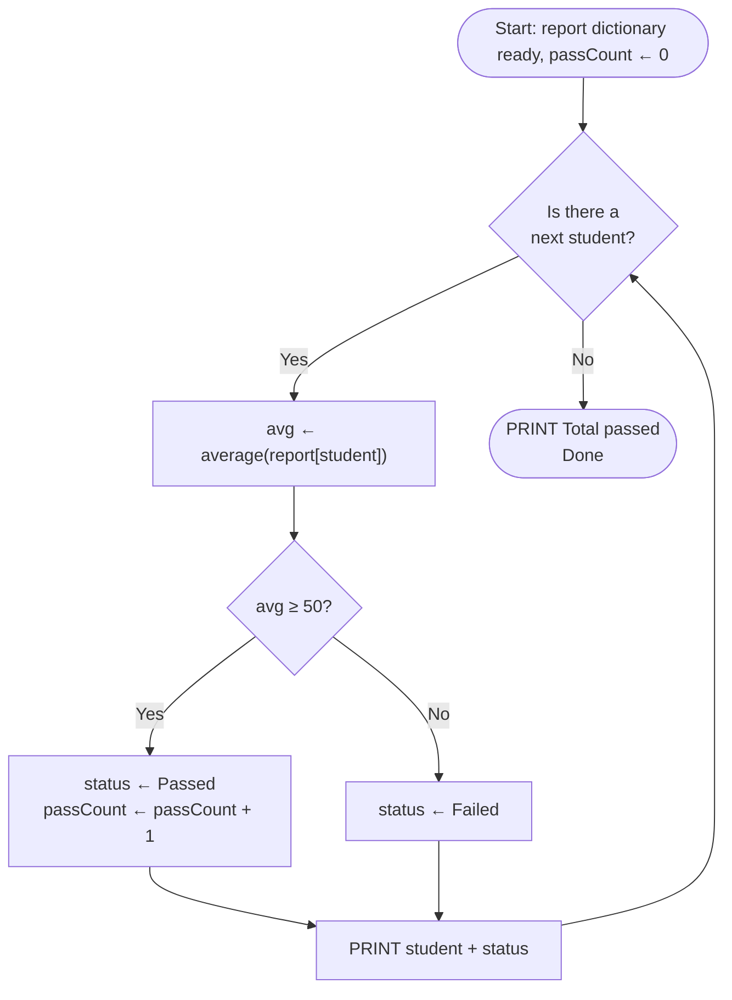
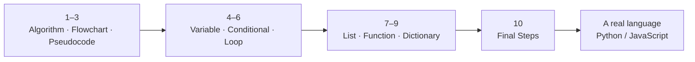

import Callout from '../../components/Callout.astro';
import Steps from '../../components/Steps.astro';

Long road, wasn't it? We started by asking [what an algorithm is](/en/blog/what-is-an-algorithm);
now you've got a whole toolbox in your hands: variables, conditionals, loops, lists, functions,
dictionaries.

This is the last post in the series. I won't teach a new topic here. Instead we'll look back: what
did we learn, and how do these pieces connect? Then we'll bring them all together in one small
program and close things out. Relax; this one is a bit of a victory lap.

<Callout type="note" title="Where did we start, where are we now?">
Across nine posts we saw: [what an algorithm is](/en/blog/what-is-an-algorithm),
[flowcharts](/en/blog/flowcharts), [pseudocode](/en/blog/pseudocode), [variables](/en/blog/variables),
[conditionals](/en/blog/conditionals), [loops](/en/blog/loops), [lists](/en/blog/lists),
[functions](/en/blog/functions), and [dictionaries](/en/blog/dictionaries). We learned all of it
without a single line of real code, with just pen and paper. In this final post we tie it all
together.
</Callout>

## What you learned is really just a few ideas

Nine topics can look intimidating. But here's the nice part: they all revolve around a few simple
ideas. Look back and what we learned splits naturally into three groups.

### 1. Holding a piece of information somewhere

Every program first has to put something somewhere. A number, a name, a bunch of grades... We grew
this step by step.

First there was the [variable](/en/blog/variables): a box you put one thing in and write a name on.
You said `age ← 30`, done. Then things got bigger and the [list](/en/blog/lists) arrived: not one box
but a row of boxes, all sharing a single name. When you said `grades[3]` you looked at the third box.
Remember how "which position the box is in" and "what's inside it" were two different things, that
mailbox example.

Last came the [dictionary](/en/blog/dictionaries): here you reached a box not by a position number
but directly by name. `grades["Ada"]`. Just like a phone book; to find someone's number you don't
count "which person were they," you look up their name.

From a single thing, to an ordered bunch of things, to a thing found by name. The same need (storing
a piece of information) in three ever-stronger forms.

### 2. The program deciding and repeating

You held the information; now what does the program do with it? Usually two things: sometimes it
makes a decision, sometimes it repeats the same work.

The decision part was the [conditional](/en/blog/conditionals). `IF grade ≥ 50 THEN ... ELSE ...`.
Passed, or failed? The path splits by the situation. The repeating part was the
[loop](/en/blog/loops). Instead of copying the same lines fifty times, you said "repeat until this is
done." A loop is really just a decision asked over and over; that's why it and the conditional are
relatives.

### 3. Tidying up the mess

As a program grows, it starts to sprawl. The [function](/en/blog/functions) was exactly what helped
here: giving a group of steps a name and making them a single piece. We wrote `average(list)` once
and then called it as often as we liked. We didn't even need to know exactly what happened inside;
hand it the list, take the average. A black box.

And how did we put all of this on paper? That was the job of the first three posts: we drew an
algorithm as a [flowchart](/en/blog/flowcharts) and wrote it as [pseudocode](/en/blog/pseudocode).
Underneath it all was one simple idea: breaking a job into clear, ordered steps. Remember that
tea-brewing example from [the very beginning](/en/blog/what-is-an-algorithm)? That's the one.

| For what? | Topic | In one sentence |
| --- | --- | --- |
| Putting on paper | [Algorithm](/en/blog/what-is-an-algorithm), [Flowchart](/en/blog/flowcharts), [Pseudocode](/en/blog/pseudocode) | Breaking a job into clear steps, drawn/written |
| Holding information | [Variable](/en/blog/variables), [List](/en/blog/lists), [Dictionary](/en/blog/dictionaries) | A single thing, an ordered bunch, a thing found by name |
| Deciding and repeating | [Conditional](/en/blog/conditionals), [Loop](/en/blog/loops) | Deciding by the situation and repeating |
| Tidying up | [Function](/en/blog/functions) | Splitting work into named, reusable pieces |

## Let's bring it all together

Now the fun part. Let's take all the pieces we learned and gather them into one program.

Let's make a little class report. We've got students and their grades; we'll compute each one's
average, check whether they passed or failed, and at the end count how many passed. Sounds like a
lot of work, but you already know how to do every bit of it:

```text title="Class report summary — where nine topics meet" showLineNumbers=false
FUNCTION average(list)
    total ← 0
    i ← 1
    WHILE i ≤ length(list) DO
        total ← total + list[i]
        i ← i + 1
    ENDWHILE
    RETURN total / length(list)
ENDFUNCTION

report ← { "Ada": [90, 85, 100], "Can": [40, 35, 45], "Ece": [70, 65, 80] }
passCount ← 0

FOR EACH student IN report
    avg ← average(report[student])
    IF avg ≥ 50 THEN
        status ← "Passed"
        passCount ← passCount + 1
    ELSE
        status ← "Failed"
    ENDIF
    PRINT student + ": average " + avg + " → " + status
ENDFOR

PRINT "Total passed: " + passCount
```

Run it and it prints:

```text showLineNumbers=false
Ada: average 91.67 → Passed
Can: average 40 → Failed
Ece: average 71.67 → Passed
Total passed: 2
```

Stop for a second and look at this. This tiny program has all nine topics of the series in it: a
[function](/en/blog/functions) (`average`), a [dictionary](/en/blog/dictionaries) (`report`),
[lists](/en/blog/lists) as values, a [loop](/en/blog/loops) (for each student), a
[conditional](/en/blog/conditionals) (pass/fail), [variables](/en/blog/variables) (`avg`, `status`,
`passCount`), an [accumulator](/en/blog/loops) (`passCount`), and
[PRINT](/en/blog/what-is-an-algorithm) throughout. Let's see the same program as a
[flowchart](/en/blog/flowcharts) too:



This is really what programming is. Small, simple pieces; on their own they don't do much. But put
them together the right way and, together, they handle a big job. And you can do this now.

## Where to next?

Through this series we learned how a computer thinks, on paper. The next step is telling that same
way of thinking to a real computer. Don't worry, the hardest part is already behind you.



<Steps>
1. **Pick a language.** The one most recommended for beginners is Python. It's easy to read, and
   honestly it looks almost exactly like pseudocode. If you want to build things that run in the
   browser, on web pages, JavaScript is a great choice too. Which one you start with really doesn't
   matter; the core ideas are the same in every language, and you already know them.
2. **Translate your pseudocode into real code.** This is easier than you'd think, because you already
   built the skeleton. Most of the time the work is just fitting the words to that language. Our
   `PRINT` becomes `print` in Python, `console.log` in JavaScript. You write `=` instead of `←`.
   `WHILE … ENDWHILE` turns into a `while` block. The logic doesn't change, only the way it's written.
3. **Write small things.** A calculator, a tiny to-do list, a number-guessing game... Small projects
   you can actually finish are the best teacher. And one more thing: don't be afraid to make mistakes.
   Code will break, it'll throw errors, and you'll find and fix them. That's how you learn the most.
</Steps>

<Callout type="tip" title="The best advice: learn by writing, not reading">
Programming is a bit like swimming: you can read all the books you want standing at the edge, but you
won't learn until you get in the water. The good news is, if you solved this series' exercises with a
pen, you're already in the water. You've cracked the hardest part, thinking like an algorithm. The
rest is practice. Even half an hour a day will surprise you a few months from now.
</Callout>

## A small thank you

One last thing. Behind every idea we learned in this series there were real people, each of them once
the first to think these things up. Let's name a few:

- [al-Khwarizmi](/en/blog/variables), whose name we invoke when we say "algorithm" today, was a 9th
  century mathematician who also founded algebra.
- George Boole built the true/false logic of [conditionals](/en/blog/conditionals).
- Ada Lovelace wrote the first [program](/en/blog/loops) back in 1843. Yes, the first programmer was
  a woman.
- Behind [lists](/en/blog/lists) are the Fortran language and Dijkstra, who asked "why do we count
  from zero?"
- David Wheeler brought the idea of the [function](/en/blog/functions); Grace Hopper brought the idea
  of the "library" and the first compiler.
- That fast-lookup trick (hashing) behind the [dictionary](/en/blog/dictionaries) was Hans Peter
  Luhn's work.

<Callout type="important" title="Your turn">
Take a look at that: a chain spanning more than a thousand years, each person adding a small idea,
stacked one on another until it became everything we have today. And now you're standing at the end
of that chain.

I'm not exaggerating: you can now see a problem, break it into steps, and write those steps with the
clarity a computer understands. The secret of programming was never an inborn talent; it was patiently
stacking small, clear steps. That's yours now too.

So pick a language, write your first real program. See you around.
</Callout>

## Summary

<Callout type="tip" title="Put it in your pocket">
- What you learned falls into three groups: **holding information**
  ([variable](/en/blog/variables) → [list](/en/blog/lists) → [dictionary](/en/blog/dictionaries)),
  **deciding and repeating** ([conditional](/en/blog/conditionals) + [loop](/en/blog/loops)), and
  **tidying up** ([function](/en/blog/functions)). We put all of it on paper with
  [flowcharts](/en/blog/flowcharts) and [pseudocode](/en/blog/pseudocode).
- These pieces work **together.** Programming is combining small pieces in a meaningful way; we saw
  all nine at once in a class-report program.
- **Next up is a real language** (Python/JavaScript). Translating your pseudocode into code is usually
  just fitting the words; the logic stays the same.
- Most of all: **learn by writing.** You've cracked the hard part; the rest is practice. Your turn.
</Callout>
