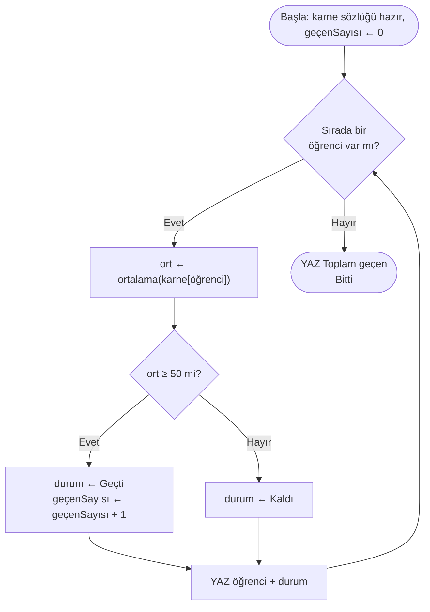
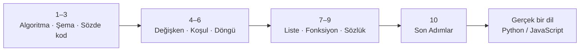

import Callout from '../../components/Callout.astro';
import Steps from '../../components/Steps.astro';

Uzun bir yoldu, değil mi? [Algoritma nedir](/blog/algoritma-nedir) diye sorarak başlamıştık; şimdi
elinde değişkenler, koşullar, döngüler, listeler, fonksiyonlar, sözlükler... koca bir alet çantası
var.

Bu, serinin son yazısı. Burada yeni bir konu öğretmeyeceğim. Bunun yerine geriye dönüp bakacağız:
neler öğrendik, bu parçalar birbirine nasıl bağlanıyor? Sonra da hepsini tek bir küçük programda
bir araya getirip seriyi kapatacağız. Rahat ol; bu yazı biraz da bir kutlama turu.

<Callout type="note" title="Nereden nereye geldik?">
Dokuz yazı boyunca şunları gördük: [algoritma nedir](/blog/algoritma-nedir),
[akış şemaları](/blog/akis-semalari), [sözde kod](/blog/sozde-kod), [değişkenler](/blog/degiskenler),
[koşullar](/blog/kosullar), [döngüler](/blog/donguler), [listeler](/blog/listeler),
[fonksiyonlar](/blog/fonksiyonlar) ve [sözlükler](/blog/sozlukler). Hepsini tek satır gerçek kod
yazmadan, sadece kalem ve kâğıtla öğrendik. Bu son yazıda hepsini toparlıyoruz.
</Callout>

## Aslında öğrendiğin şey birkaç fikirden ibaret

Dokuz konu deyince insanın gözü korkabilir. Ama işin güzel tarafı şu: hepsi birkaç basit fikrin
etrafında dönüyor. Geriye bakınca öğrendiklerimiz kendiliğinden üç öbeğe ayrılıyor.

### 1. Bir bilgiyi bir yerde tutmak

Her program, önce bir şeyi bir yere koymak zorunda. Bir sayıyı, bir ismi, bir sürü notu... Biz bunu
adım adım büyüttük.

Önce [değişken](/blog/degiskenler) vardı: tek bir şeyi koyduğun, üstüne isim yazdığın bir kutu.
`yaş ← 30` dedin, oldu. Sonra iş büyüdü ve [liste](/blog/listeler) geldi: tek kutu değil, yan yana
dizilmiş bir sürü kutu, hepsinin ortak bir adı var. `notlar[3]` deyince üçüncü kutuya bakıyordun.
Hani "kutunun kaçıncı sırada olduğu" ile "içinde ne olduğu" ayrı şeylerdi, şu posta kutusu örneği.

En son da [sözlük](/blog/sozlukler): burada kutulara sıra numarasıyla değil, doğrudan isimle
ulaşıyordun. `notlar["Ada"]`. Tıpkı telefon rehberi gibi; birinin numarasını bulmak için "kaçıncı
kişiydi" diye saymıyorsun, adına bakıyorsun.

Tek bir şeyden, sıralı bir sürü şeye, oradan da isimle bulunan şeye. Hep aynı ihtiyacın (bir bilgiyi
saklamak) giderek güçlenen üç hâli.

### 2. Programın karar vermesi ve tekrar etmesi

Bilgiyi tuttun, peki program bununla ne yapacak? Genelde iki şey: bazen bir karar verecek, bazen de
aynı işi tekrar edecek.

Karar kısmı [koşul](/blog/kosullar) idi. `EĞER not ≥ 50 İSE ... DEĞİLSE ...`. Geçti mi, kaldı mı?
Yol duruma göre ikiye ayrılıyordu. Tekrar kısmı da [döngü](/blog/donguler). Aynı satırları elli kere
kopyalamak yerine "şu iş bitene kadar tekrarla" diyordun. Aslında bir döngü, tekrar tekrar sorulan
bir karardan başka bir şey değil; koşulla akraba olmalarının sebebi bu.

### 3. Dağınıklığı toplamak

Program büyüdükçe dağılmaya başlar. [Fonksiyon](/blog/fonksiyonlar) tam burada işe yarıyordu: bir
grup adıma bir isim verip onları tek bir parça hâline getirmek. `ortalama(liste)`'yi bir kere yazdık,
sonra istediğimiz kadar çağırdık. İçinde tam olarak ne döndüğünü bilmemize bile gerek yoktu; listeyi
ver, ortalamayı al. Kara kutu.

Peki bütün bunları nasıl yazıya döktük? İlk üç yazının derdi buydu: bir algoritmayı
[şemayla](/blog/akis-semalari) çizdik, [sözde kodla](/blog/sozde-kod) yazdık. Hepsinin altında da şu
basit fikir yatıyordu: bir işi net, sıralı adımlara bölmek. Hani [en baştaki](/blog/algoritma-nedir)
çay demleme örneği vardı ya, işte o.

| Ne için? | Konu | Tek cümlede |
| --- | --- | --- |
| Yazıya dökmek | [Algoritma](/blog/algoritma-nedir), [Şema](/blog/akis-semalari), [Sözde kod](/blog/sozde-kod) | Bir işi net adımlara bölüp çizmek/yazmak |
| Bilgiyi tutmak | [Değişken](/blog/degiskenler), [Liste](/blog/listeler), [Sözlük](/blog/sozlukler) | Tek şey, sıralı bir sürü şey, isimle bulunan şey |
| Karar ve tekrar | [Koşul](/blog/kosullar), [Döngü](/blog/donguler) | Duruma göre karar vermek ve tekrarlamak |
| Toplamak | [Fonksiyon](/blog/fonksiyonlar) | İşleri isimli, tekrar kullanılabilir parçalara bölmek |

## Hepsini bir araya getirelim

Şimdi eğlenceli kısma geldik. Öğrendiğimiz bütün parçaları alıp tek bir programda buluşturalım.

Küçük bir sınıf karnesi yapalım. Elimizde öğrenciler ve notları olsun; her birinin ortalamasını
hesaplayalım, geçti mi kaldı mı diye bakalım, sonunda da kaç kişi geçmiş sayalım. Kulağa epey iş
gibi geliyor ama artık bunların hepsini biliyorsun:

```text title="Sınıf karne özeti — dokuz konunun buluştuğu yer" showLineNumbers=false
FONKSIYON ortalama(liste)
    toplam ← 0
    i ← 1
    ZAMAN i ≤ uzunluk(liste) DOĞRU İKEN
        toplam ← toplam + liste[i]
        i ← i + 1
    DÖNGÜ SONU
    DÖNDÜR toplam / uzunluk(liste)
FONKSIYON SONU

karne ← { "Ada": [90, 85, 100], "Can": [40, 35, 45], "Ece": [70, 65, 80] }
geçenSayısı ← 0

karne İÇİNDEKİ HER öğrenci İÇİN
    ort ← ortalama(karne[öğrenci])
    EĞER ort ≥ 50 İSE
        durum ← "Geçti"
        geçenSayısı ← geçenSayısı + 1
    DEĞİLSE
        durum ← "Kaldı"
    BİTİREĞER
    YAZ öğrenci + ": ortalama " + ort + " → " + durum
DÖNGÜ SONU

YAZ "Toplam geçen: " + geçenSayısı
```

Çalıştırınca şunu yazar:

```text showLineNumbers=false
Ada: ortalama 91.67 → Geçti
Can: ortalama 40 → Kaldı
Ece: ortalama 71.67 → Geçti
Toplam geçen: 2
```

Bir dakika durup şuna bak. Bu minik programda serinin dokuz konusu da var: bir
[fonksiyon](/blog/fonksiyonlar) (`ortalama`), bir [sözlük](/blog/sozlukler) (`karne`), değer olarak
[listeler](/blog/listeler), bir [döngü](/blog/donguler) (her öğrenci için), bir
[koşul](/blog/kosullar) (geçti/kaldı), [değişkenler](/blog/degiskenler) (`ort`, `durum`,
`geçenSayısı`), bir [biriktirici](/blog/donguler) (`geçenSayısı`) ve baştan sona
[YAZ](/blog/algoritma-nedir). Aynı programı bir de [şema](/blog/akis-semalari) hâlinde görelim:



Programlamak dediğimiz şey aslında bu. Küçük, basit parçalar; tek başlarına pek bir işe yaramıyorlar.
Ama doğru şekilde bir araya getirdiğinde, birlikte koca bir işi hallediyorlar. Ve sen artık bunu
yapabiliyorsun.

## Bundan sonra nereye?

Bu seri boyunca bir bilgisayarın nasıl düşündüğünü kâğıt üstünde öğrendik. Sıradaki adım, aynı şeyi
gerçek bir bilgisayara anlatmak. Merak etme, en zor kısmı geride kaldı bile.



<Steps>
1. **Bir dil seç.** Yeni başlayanlara en çok tavsiye edilen Python. Okuması kolay, hatta sözde koda
   tıpatıp benziyor diyebilirim. Tarayıcıda, web sayfalarında bir şeyler yapmak istiyorsan
   JavaScript de gayet iyi. Açıkçası hangisiyle başladığın çok önemli değil; temel fikirler her
   dilde aynı ve o fikirleri artık biliyorsun.
2. **Sözde kodunu gerçek koda çevir.** Bu sandığından kolay, çünkü iskeleti zaten kurdun. Çoğu zaman
   iş, sadece kelimeleri o dile uydurmaya kalıyor. Bizim `YAZ`, Python'da `print` oluyor,
   JavaScript'te `console.log`. `←` yerine `=` yazıyorsun. `ZAMAN … DÖNGÜ SONU` bir `while` bloğuna
   dönüşüyor. Mantık hiç değişmiyor, sadece yazılışı değişiyor.
3. **Küçük şeyler yaz.** Bir hesap makinesi, minik bir yapılacaklar listesi, bir sayı tahmin oyunu...
   Bitirebileceğin küçük projeler en iyi öğretmendir. Bir de: hata yapmaktan korkma. Kod bozulacak,
   hata verecek, sen bulup düzelteceksin. Zaten en çok bunu yaparak öğreniyorsun.
</Steps>

<Callout type="tip" title="En önemli tavsiye: okuyarak değil, yazarak öğren">
Programlama biraz yüzmeye benziyor: kenarda durup ne kadar kitap okursan oku, suya girmeden
öğrenemezsin. İyi haber şu ki, bu serideki egzersizleri kalemle çözdüysen suya çoktan girdin. En zor
kısmı, yani algoritma gibi düşünmeyi, çözdün bile. Gerisi pratik. Günde yarım saat bile, birkaç ay
sonra seni şaşırtır.
</Callout>

## Küçük bir teşekkür

Son bir şey. Bu seride öğrendiğimiz her fikrin arkasında gerçek insanlar var; hepsi bir zamanlar bu
şeyleri ilk kez düşünen kişilerdi. Kısaca analım:

- Bugün "algoritma" derken adını andığımız [el-Harezmî](/blog/degiskenler), 9. yüzyılda yaşamış,
  aynı zamanda cebiri de kurmuş bir matematikçi.
- [Koşulların](/blog/kosullar) doğru/yanlış mantığını George Boole kurdu.
- İlk [programı](/blog/donguler) 1843'te Ada Lovelace yazdı. Evet, ilk programcı bir kadındı.
- [Listelerin](/blog/listeler) arkasında Fortran dili ve "neden sıfırdan sayıyoruz?" diye soran
  Dijkstra var.
- [Fonksiyon](/blog/fonksiyonlar) fikrini David Wheeler, "kütüphane" fikrini ve ilk derleyiciyi de
  Grace Hopper getirdi.
- [Sözlüğün](/blog/sozlukler) o hızlı arama numarası (hash) Hans Peter Luhn'un işi.

<Callout type="important" title="Sıra sende">
Şuna bir bak: bin yılı aşan bir zincir, her biri küçük bir fikir eklemiş, üst üste konmuş, bugün
elimizdeki her şey olmuş. Ve şimdi o zincirin ucunda sen varsın.

Abartmıyorum: artık bir problemi görüp onu adımlara bölebiliyor, o adımları bir bilgisayarın
anlayacağı netlikte yazabiliyorsun. Programlamanın sırrı hiçbir zaman doğuştan gelen bir yetenek
değildi; küçük ve net adımları sabırla üst üste koymaktı. O da artık sende var.

Şimdi bir dil seç, ilk gerçek programını yaz. Görüşürüz.
</Callout>

## Özet

<Callout type="tip" title="Cebine koy">
- Öğrendiklerin üç grupta toplanıyor: **bilgiyi tutmak** ([değişken](/blog/degiskenler) →
  [liste](/blog/listeler) → [sözlük](/blog/sozlukler)), **karar ve tekrar**
  ([koşul](/blog/kosullar) + [döngü](/blog/donguler)) ve **toplamak**
  ([fonksiyon](/blog/fonksiyonlar)). Hepsini [şema](/blog/akis-semalari) ve
  [sözde kodla](/blog/sozde-kod) yazıya döktük.
- Bu parçalar **birlikte** çalışır. Programlamak, küçük parçaları anlamlı biçimde birleştirmektir;
  bir sınıf-karne programında dokuzunu birden gördük.
- Sırada **gerçek bir dil** var (Python/JavaScript). Sözde kodunu koda çevirmek çoğu zaman sadece
  kelimeleri uydurmaktır; mantık aynı kalır.
- En önemlisi: **yazarak öğren.** Zor kısmı çözdün; gerisi pratik. Sıra sende.
</Callout>
