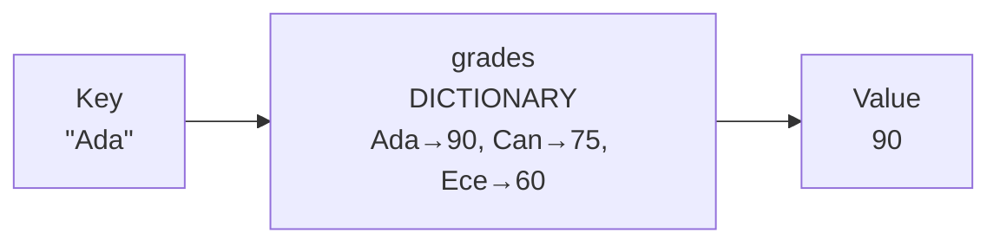
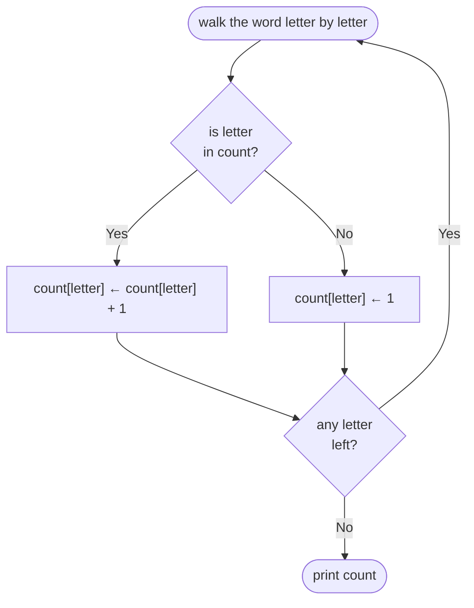

import Callout from '../../components/Callout.astro';
import Steps from '../../components/Steps.astro';

[In the previous post](/en/blog/functions) we learned to define a job once and call it by name
again and again — **functions.** Before that, with [lists](/en/blog/lists), we saw how to hold many
pieces of information under a single name. But lists had a limit: to reach an element you had to
know its **position number** — `grades[3]`. What if you don't want "the third student" but directly
**"Ada's grade"**? That is what this post is about: a new data structure that lets you reach
information by its **name** rather than its order — the **dictionary.**

The name is no accident. Think of a real dictionary: you look up a word and find its definition.
You don't say "word 5,842" — you look up **the word itself.** A dictionary in a computer is exactly
that: you give a **key** (the name you're looking for) and get back its **value** (the information).

<Callout type="note" title="Where are we in this series?">
This is the ninth post in the **Algorithms** series. We [met algorithms](/en/blog/what-is-an-algorithm),
drew them as [flowcharts](/en/blog/flowcharts), wrote them as [pseudocode](/en/blog/pseudocode),
stored information with [variables](/en/blog/variables), decided with
[conditionals](/en/blog/conditionals), repeated with [loops](/en/blog/loops), held piles of data
with [lists](/en/blog/lists), and split our jobs into named pieces with
[functions](/en/blog/functions). Now we add a way to hold data that's different from a list — and
often smarter. And a promise: still not a single line of real code, just pen, paper, and thinking.
</Callout>

## Why do we need dictionaries?

In the [lists post](/en/blog/lists) we touched on a problem: keeping a list of students and a list
of grades **side by side.** Names in one list, grades in another; we kept both in the same order so
that `names[i]` and `grades[i]` matched the same student. We called this **parallel lists:**

```text title="Parallel lists — you must keep them aligned" showLineNumbers=false
names  ← ["Ada", "Can", "Ece"]
grades ← [90, 75, 60]

# Ada's grade: which position is she in names? Find it, then look at the same position in grades.
```

This works but is fragile. If you add a name to `names` and forget to add a grade to `grades`, you
break the alignment; from then on `names[3]` shows one student and `grades[3]` shows someone else's
grade. Worse, to get "Ada's grade" you must first **search** for Ada in the list to find her
position (the one-by-one search from [lists](/en/blog/lists)), then use that position in the other
list. Two lists, two jobs for one piece of information.

But what you really have in mind is **a single mapping:** each name is tied to a grade. "Ada → 90,
Can → 75, Ece → 60." A dictionary holds this mapping directly, in one structure:

```text title="The same information — in a single dictionary" showLineNumbers=false
grades ← { "Ada": 90, "Can": 75, "Ece": 60 }

# Ada's grade:
PRINT grades["Ada"]      → 90
```

Two lists, the alignment worry, the search — all reduced to one line. When you say `grades["Ada"]`,
the computer gives you Ada's grade **directly;** it doesn't scan the list from start to end, doesn't
bother with "which position was Ada in?"

## What is a dictionary?

A **dictionary** is a data structure made of linked **key–value pairs.**

- **Key:** the name of what you're looking for — the word in a dictionary, the name in a phone book.
  Above, `"Ada"`.
- **Value:** the information tied to that key — the word's definition, the name's number. Above,
  `90`.

We write a dictionary with curly braces `{ }`, state each pair as `key: value`, and separate the
pairs with commas. In a [list](/en/blog/lists) we used square brackets `[ ]` and order; in a
dictionary we use curly braces `{ }` and keys:

```text title="A phone book dictionary" showLineNumbers=false
book ← { "Ada": "0532...", "Can": "0543...", "Emergency": "112" }

PRINT book["Emergency"]  → 112
```

Note: keys don't have to be text (they can be numbers too), but where they're most useful is
reaching information by a **meaningful name.** Writing `book["Emergency"]` is far clearer than
writing `book[3]` and trying to remember "the emergency number was in position three, I think."

<Callout type="important" title="The essence of a dictionary: reach by key, not position">
The whole logic of [lists](/en/blog/lists) was **position:** an element is found by its place in
order (`list[1]`, `list[2]`). The whole logic of a dictionary is the **key:** an element is found
by the meaningful name you gave it (`grades["Ada"]`). In a real dictionary you look up a word by
its letters, not by "which word number"; in a computer dictionary you give the key, not the
position. This single idea is the source of everything that sets a dictionary apart from a list.
</Callout>

## Reaching a value

To get a value from a dictionary we use square brackets, just like a list — but inside we write a
**key** instead of a position number:

```text title="Reaching a value by key" showLineNumbers=false
grades ← { "Ada": 90, "Can": 75, "Ece": 60 }

PRINT grades["Ada"]      → 90
PRINT grades["Ece"]      → 60
```

You can picture this as a **mapping** (an arrow carrying you from one side to the other): you give
the key, the dictionary hands you back its value.



This resembles the **black box** from the [functions post](/en/blog/functions): you give something
and get something back. The difference is that here what you give is a key, and what you get is the
value tied to that key.

<Callout type="caution" title="Asking for a key that isn't there">
What if you ask for a key that isn't in the dictionary? `PRINT grades["Zeynep"]` — but there's no
"Zeynep" in the dictionary. In most languages this gives an **error** or returns a special value
meaning "empty/none." That's why, before getting a key's value, you often need to ask "is this key
actually in the dictionary?" We'll see how to do that shortly.
</Callout>

## Adding and updating

Adding a new pair to a dictionary is surprisingly simple: you **assign** a value to the new key —
just like the `←` assignment arrow we used for [variables](/en/blog/variables):

```text title="Adding" showLineNumbers=false
grades ← { "Ada": 90, "Can": 75 }

grades["Ece"] ← 60           (a new pair: "Ece" → 60)
# Now: { "Ada": 90, "Can": 75, "Ece": 60 }
```

And if we assign a value to a key that already exists? Then the old value is **updated:**

```text title="Updating" showLineNumbers=false
grades["Ada"] ← 95           ("Ada" already existed → her value goes from 90 to 95)
# Now: { "Ada": 95, "Can": 75, "Ece": 60 }
```

<Callout type="note" title="Adding and updating: the same operation">
Notice: both are the exact same line — `grades[key] ← value`. The computer checks: if the key is
**not** in the dictionary it **adds** a new pair; if it **is** there it **replaces** the old value
with the new one. So in a dictionary, adding and updating are the same operation. This has a nice
consequence: a key appears in a dictionary **at most once.** If you "add" the same key twice, the
second overwrites the first; you don't end up with two separate "Ada" entries.
</Callout>

## Is a key there? (checking)

Remember the trap above: asking for a missing key can cause an error. That's why we often need to
ask "is this key in the dictionary?" We do this with [conditionals](/en/blog/conditionals):

```text title="Look first, then use it" showLineNumbers=false
IF "Ada" IS A KEY IN grades THEN
    PRINT "Ada's grade: " + grades["Ada"]
ELSE
    PRINT "Ada is not registered."
ENDIF
```

The expression `"Ada" IS A KEY IN grades` gives back a **true/false**
([boolean](/en/blog/variables)) just like in [conditionals](/en/blog/conditionals): true if the key
is in the dictionary, false if not. The "look first, use it if it's safe" pattern is one of the
most common you'll set up when working with dictionaries.

## Looping over a dictionary: for each key

To walk a [list](/en/blog/lists) from start to end we used a [loop](/en/blog/loops): we incremented
a counter `i` from 1 to `length(list)` and said `list[i]`. But a dictionary has **no position
number** — there's no such thing as "the 3rd key." So how do we walk it?

For this we use a slightly different loop: the **"for each"** loop. This loop takes the keys in the
dictionary one by one and hands them to you; each pass you process that key and its value:

```text title="Visit every pair in the dictionary" showLineNumbers=false
grades ← { "Ada": 90, "Can": 75, "Ece": 60 }

FOR EACH key IN grades
    PRINT key + ": " + grades[key]
ENDFOR
```

This loop prints:

```text showLineNumbers=false
Ada: 90
Can: 75
Ece: 60
```

Each pass, `key` becomes "Ada", "Can", "Ece" in turn; `grades[key]` is that key's value. You can
think of it as a sibling of the `WHILE … ENDWHILE` counted loop from the
[loops post](/en/blog/loops), adapted to a dictionary: there we advanced the counter ourselves,
here the loop brings us each key in turn.

<Callout type="tip" title="Walk and accumulate: a familiar pattern">
The **accumulation** pattern from the [loops](/en/blog/loops) and [lists](/en/blog/lists) posts
works here too. Want the total of all the grades? Set up the accumulator **before** the loop, and
add each key's value onto it:

```text showLineNumbers=false
total ← 0
FOR EACH key IN grades
    total ← total + grades[key]
ENDFOR
PRINT total       → 225
```

As you see, what you've learned stacks up: a new structure (the dictionary), an old pattern
(accumulation).
</Callout>

## Removing

To take a pair out of a dictionary, we use an operation like the `REMOVE` from
[lists](/en/blog/lists) — but by **key,** not by position number:

```text title="Removing a key" showLineNumbers=false
grades ← { "Ada": 90, "Can": 75, "Ece": 60 }

REMOVE "Can" FROM grades
# Now: { "Ada": 90, "Ece": 60 }
```

Here there's **no** "the elements behind it shift" worry from lists — because a dictionary had no
order to shift in the first place. "Can" is removed, "Ada" and "Ece" stay exactly as they were. A
small but pleasant side benefit of the dictionary being position-independent.

## A value can be anything: a list inside a dictionary

So far our values have always been a single number or a piece of text. But a key's value can be **a
list** too. For example, if you want to hold **several** grades per student:

```text title="When the value is a list" showLineNumbers=false
grades ← { "Ada": [90, 85, 100], "Can": [70, 60, 80] }

PRINT grades["Ada"]         → [90, 85, 100]   (all of Ada's grades)
PRINT grades["Ada"][1]      → 90              (Ada's first grade)
```

`grades["Ada"]` gives you a [list](/en/blog/lists); to get its first element you add one more
square bracket: `grades["Ada"][1]`. This way you can apply the `average` function from
[functions](/en/blog/functions) directly to a student's grades: `average(grades["Ada"])`. Small
pieces (dictionary, list, function) slot into each other to build bigger jobs — exactly as we
promised in the [functions post](/en/blog/functions).

## A dictionary = a thing's properties (toward objects)

One use of a dictionary is not to map different **things** to each other, but to hold the
**properties of a single thing** together. Think of a person: they have a name, an age, a city.
Instead of keeping these scattered across parallel variables, you can gather them in one
dictionary:

```text title="Describing a person in a single dictionary" showLineNumbers=false
person ← { "name": "Ada", "age": 30, "city": "Istanbul" }

PRINT person["name"]        → Ada
PRINT person["city"]        → Istanbul
```

Here the keys (`"name"`, `"age"`, `"city"`) are the thing's **property names,** and the values are
the information for those properties. `person` is now a "portable" information package as a whole:
you can hand it to a [function](/en/blog/functions) on its own, or make it an element of a
[list](/en/blog/lists) (for example `people ← [person1, person2, person3]` — a list where each
element is a dictionary).

<Callout type="note" title="You're one small step from an 'object'">
The word **object** that you'll hear often in real programming is, at its base, usually built on
exactly this kind of key–value mapping: holding a thing's properties together by name. So the
dictionary you're learning today is the very idea you'll later meet under names like "object,"
"record," and "struct." For now it's enough to keep it in mind as "a dictionary = a bundle of
information reached by names."
</Callout>

## When a list, when a dictionary?

Both hold several pieces of information together; but they answer different questions well. A table
to make the choice easier:

| Question / situation | List | Dictionary |
| --- | --- | --- |
| Access is by what? | By **position** (`list[3]`) | By **key** (`grades["Ada"]`) |
| Does order matter? | Yes — element order is meaningful | No — reached by key |
| Good for the question | "What's the next element?", "Walk them all" | "What corresponds to this name/id?" |
| Example | A shopping list, the next steps | name→number, product→price, word→definition |
| Same item twice? | Possible (a value can repeat) | Keys can't repeat (each key is unique) |

The short rule: if you'll process the data **start to end, in order** or the order itself is
meaningful, use a [list](/en/blog/lists); if you need fast access **from a name/id to a piece of
information,** use a **dictionary.** And as you see, the two aren't enemies but friends: a
dictionary's value can be a list, and a list's element can be a dictionary. Real programs use the
two nested together.

## Common mistakes

<Callout type="caution" title="Watch out for these traps">
- **Asking for a missing key:** using a key that isn't in the dictionary directly can raise an
  error. If you're not sure, check first with `IF key IS A KEY IN … THEN`.
- **Confusing a key with a position number:** in a dictionary, `grades[1]` usually does not mean
  "the first element"; `1` there is a **key.** In a dictionary, elements are found by key, not
  position.
- **Thinking the same key can repeat:** assigning to a key a second time does not **add** a new
  entry, it **overwrites** the old one. If you want to hold two "Ada"s, the keys must be different.
- **Relying on order in a dictionary:** when walking a dictionary, don't count on the order the
  pairs come in; a dictionary is a mapping, not "an ordered list." If you need order, you actually
  need a list.
- **Forgetting the dictionary works one way:** a dictionary is fast from key to value; but if you
  ask the reverse — "which key has the value 90?" — then you have to walk and search one by one,
  as in [lists](/en/blog/lists). A dictionary speeds you up in one direction: from key to value.
</Callout>

<Callout type="note" title="A little history note: from key to value at the speed of light">
Reaching a piece of information by its name, without scanning a list from start to end, sounds like
magic — how does the computer find "Ada" without stopping anywhere in between? Behind it is a clever
method called **hashing:** you do a small calculation that turns the key (say the word "Ada") into a
number, and that number tells you directly **where the value sits;** so instead of searching, you go
straight to the address. This idea was introduced in 1953 by the German engineer **Hans Peter
Luhn,** working at IBM. What he called a "hash table" is today the engine behind the dictionaries in
almost every programming language (a *dict* in Python, a *map*, *hash*, or *associative array* in
others). So when you write `grades["Ada"]` and get the answer instantly, you're standing on a
seventy-year-old idea — like the Fortran and Dijkstra of [lists](/en/blog/lists), the Ada Lovelace
of [loops](/en/blog/loops), the Grace Hopper of [functions](/en/blog/functions).
</Callout>

## Try it yourself

Pen and paper are enough. For each exercise, draw the dictionary as a little table (one column of
keys, one column of values), then trace the steps on it one by one. Remind yourself that you reach a
value by its key, not by a position number.

### Exercise 1 — A phone book (easy)

> Draw the dictionary `book ← { "Ada": "0532", "Can": "0543", "Emergency": "112" }`. Then find, in
> order: `book["Emergency"]`, `book["Ada"]`. Then add `book["Ece"] ← "0555"` and write the final
> state of the dictionary.

<Callout type="note" title="Hint">
Think of the dictionary as a two-column table. `book["Emergency"]` means "read the value in the
Emergency row" → 112. After the add line, a new row ("Ece" → "0555") is added to the table; the old
three rows stay as they were.
</Callout>

### Exercise 2 — There or not? (easy)

> For the `book` above, write a "find number" logic: given a name, if the name **is** in the book
> print its number, if **not** print "Not registered." Run it for `"Can"` and `"Zeynep"`.

<Callout type="note" title="Hint">
Set up the [conditional](/en/blog/conditionals): `IF name IS A KEY IN book THEN PRINT book[name]
ELSE PRINT "Not registered" ENDIF`. `"Can"` should give a number, `"Zeynep"` should give "Not
registered." This is the "look first, then use it" pattern you'll set up constantly in real
programs.
</Callout>

### Exercise 3 — Basket total (medium)

> `prices ← { "apple": 15, "milk": 40, "bread": 10 }` is a product→price dictionary. There's also a
> [list](/en/blog/lists) `basket ← ["apple", "apple", "bread"]`. Compute the total price of the
> products in the basket.

<Callout type="note" title="Hint">
Here a list and a dictionary work **together.** [Walk](/en/blog/loops) the basket (list), for each
product read its price from the dictionary and [accumulate](/en/blog/loops): `total ← 0`, then for
each `product` in the basket, `total ← total + prices[product]`. (Answer: 15 + 15 + 10 = 40.) Note:
"apple" appears twice in the basket, once in the dictionary — which shows exactly the difference: a
list keeps repeats, a dictionary keeps the mapping.
</Callout>

### Exercise 4 — Letter counter (medium)

> Count how many times each letter appears in the word `"beekeeper"` into a dictionary. The result
> should be a dictionary like: `{ "b": 1, "e": 5, "k": 1, "p": 1, "r": 1 }`.

<Callout type="note" title="Hint">
This is one of the most classic and powerful uses of dictionaries (letter/word **frequency**).
Start with an empty dictionary: `count ← { }`. [Walk the word letter by letter](/en/blog/lists)
(remember text is a list of letters). For each letter: if the letter is already **in** `count`,
increase its value by one (`count[letter] ← count[letter] + 1`), if **not**, start it at 1
(`count[letter] ← 1`). Here is the [flowchart](/en/blog/flowcharts) of this logic:



The **"is it there?"** decision in the middle is exactly the key-check you learned in this post.
(Bonus: with the same logic you can count how many times each word appears in a text — from search
engines to spell checkers, many things are a grown-up version of this.)
</Callout>

### Exercise 5 — Student report (mini project)

> Build a dictionary mapping each student to their grades: `report ← { "Ada": [90, 85, 100], "Can":
> [70, 60, 80] }`. Then, **for each student,** print their name and grade [average](/en/blog/functions).

<Callout type="note" title="Hint">
A dictionary whose values are [lists](/en/blog/lists). Set up a `FOR EACH student IN report` loop;
each pass `report[student]` gives you that student's **grade list.** Hand that list to the `average`
function from the [functions post](/en/blog/functions): `PRINT student + ": " +
average(report[student])`. This way a dictionary (student→grades), a list (grades), and a function
(average) meet in one small program. (Answers: Ada 91.67, Can 70.)
</Callout>

## Summary

<Callout type="tip" title="Put it in your pocket">
- A **dictionary** is a data structure of key–value pairs: you give a **key** (a name) and get back
  its **value** (information). Like a real dictionary: look up the word, find the definition.
- In a list you reach an element by **position** (`list[3]`); in a dictionary by **key**
  (`grades["Ada"]`). That is the one big idea that sets a dictionary apart from a list.
- **Adding and updating** are the same operation: `dict[key] ← value`. If the key is absent it adds,
  if present it overwrites (updates). A key appears at most once.
- Check whether a key exists with a **conditional**: `IF key IS A KEY IN … THEN`. "Look first, then
  use it."
- You walk a dictionary with a **for-each** loop; familiar patterns like accumulation work here too.
- **A value can be anything** — a number, some text, even a [list](/en/blog/lists) or another
  dictionary. A dictionary holding a thing's properties is the basis of the **object** you'll meet
  later.
- List or dictionary? Data you'll walk in order / whose order matters → a **list;** fast access from
  a name to information → a **dictionary.**
</Callout>
