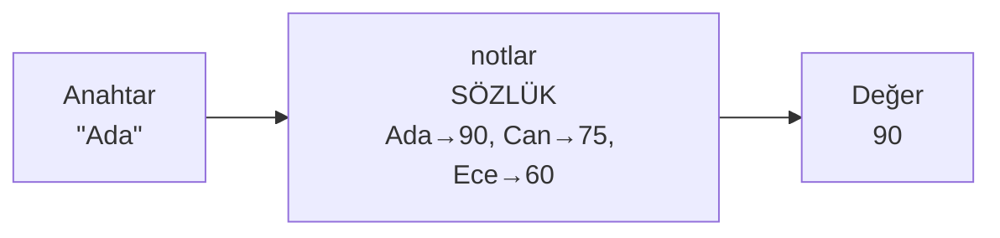
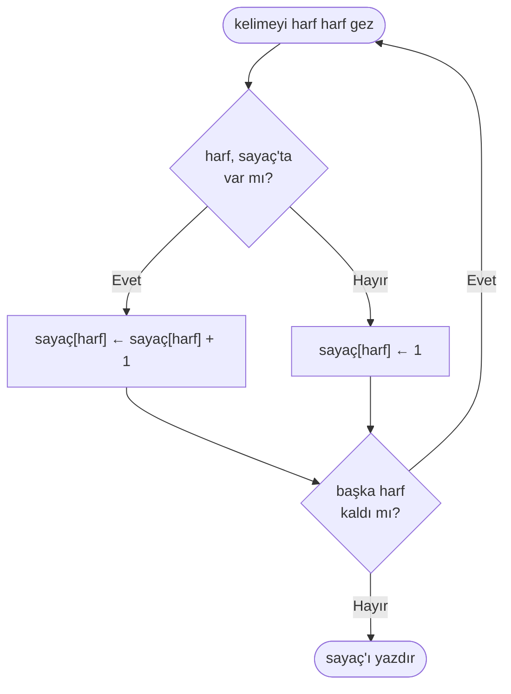

import Callout from '../../components/Callout.astro';
import Steps from '../../components/Steps.astro';

[Önceki yazıda](/blog/fonksiyonlar) bir işi bir kez tanımlayıp adıyla tekrar tekrar çağırmayı —
**fonksiyonları** — öğrendik. Ondan önce de [listelerle](/blog/listeler) çok sayıda bilgiyi tek
bir isim altında tutmayı gördük. Ama listelerin bir sınırı vardı: bir elemana ulaşmak için onun
**sıra numarasını** (konumunu) bilmen gerekiyordu — `notlar[3]`. Peki ya "üçüncü öğrenci" değil de
doğrudan **"Ada'nın notu"** lazımsa? İşte bu yazının konusu, bilgiye sırasıyla değil **adıyla**
ulaşmanı sağlayan yeni bir veri yapısı: **sözlük.**

Adı tesadüf değil. Gerçek bir sözlüğü düşün: bir kelimeyi ararsın, karşısındaki tanımı bulursun.
"Kelime 5.842" demezsin — **kelimenin kendisini** ararsın. Bilgisayardaki sözlük de tam olarak
budur: bir **anahtar** (aradığın isim) verirsin, ona bağlı **değeri** (bilgiyi) alırsın.

<Callout type="note" title="Bu seride neredeyiz?">
Bu, **Algoritmalar** serisinin dokuzuncu yazısı. [Algoritmayı tanıdık](/blog/algoritma-nedir),
[akış şemasıyla](/blog/akis-semalari) çizdik, [sözde kodla](/blog/sozde-kod) yazdık,
[değişkenlerle](/blog/degiskenler) bilgiyi sakladık, [koşullarla](/blog/kosullar) karar verdik,
[döngülerle](/blog/donguler) tekrar ettik, [listelerle](/blog/listeler) veri yığınlarını tuttuk ve
[fonksiyonlarla](/blog/fonksiyonlar) işlerimizi adlı parçalara böldük. Şimdi veriyi tutmanın
listeden farklı, çoğu zaman daha akıllı bir yolunu ekliyoruz. Ve söz: hâlâ tek satır gerçek kod
yok, sadece kalem, kâğıt ve düşünce.
</Callout>

## Neden sözlüğe ihtiyacımız var?

[Listeler yazısında](/blog/listeler) bir soruna değinmiştik: bir öğrenci listesiyle bir not
listesini **yan yana** tutmak. İsimler bir listede, notları başka bir listede; ikisini de aynı
sırada tutuyorduk ki `isimler[i]` ile `notlar[i]` aynı öğrenciye denk gelsin. Buna **paralel
listeler** demiştik:

```text title="Paralel listeler — hizayı korumak zorundasın" showLineNumbers=false
isimler ← ["Ada", "Can", "Ece"]
notlar  ← [90, 75, 60]

# "Ada"nın notu: isimler'de kaçıncı sırada? Bul, sonra notlar'da aynı sıraya bak.
```

Bu yaklaşım çalışır ama kırılgandır. `isimler`'e yeni bir isim ekleyip `notlar`'a not eklemeyi
unutursan hizayı bozarsın; ondan sonra `isimler[3]` bir öğrenciyi, `notlar[3]` bambaşka birinin
notunu gösterir. Üstelik "Ada'nın notu" için önce Ada'yı listede **arayıp** sırasını bulman
([listelerdeki](/blog/listeler) tek tek arama), sonra o sırayı öbür listede kullanman gerekir. İki
liste, tek bir bilgi için iki iş.

Oysa aklında aslında **tek bir eşleşme** var: her isme bir not bağlı. "Ada → 90, Can → 75, Ece →
60." İşte sözlük bu eşleşmeyi doğrudan, tek bir yapıda tutar:

```text title="Aynı bilgi — tek bir sözlükte" showLineNumbers=false
notlar ← { "Ada": 90, "Can": 75, "Ece": 60 }

# "Ada"nın notu:
YAZ notlar["Ada"]        → 90
```

İki liste, hizalama derdi, arama — hepsi tek satıra indi. `notlar["Ada"]` dediğinde bilgisayar
sana Ada'nın notunu **doğrudan** verir; listeyi baştan sona taramaz, "Ada kaçıncı sıradaydı?" diye
uğraşmaz.

## Sözlük nedir?

Bir **sözlük,** birbirine bağlı **anahtar–değer çiftlerinden** oluşan bir veri yapısıdır.

- **Anahtar (key):** Aradığın şeyin adı — sözlükteki kelime, rehberdeki isim. Yukarıda `"Ada"`.
- **Değer (value):** O anahtara bağlı bilgi — kelimenin tanımı, ismin numarası. Yukarıda `90`.

Sözlüğü süslü parantezlerle `{ }` yazar, her çifti `anahtar: değer` biçiminde belirtir, çiftleri
virgülle ayırırız. [Listede](/blog/listeler) köşeli parantez `[ ]` ve sıra kullanıyorduk; sözlükte
süslü parantez `{ }` ve anahtar kullanırız:

```text title="Bir telefon rehberi sözlüğü" showLineNumbers=false
rehber ← { "Ada": "0532...", "Can": "0543...", "Acil": "112" }

YAZ rehber["Acil"]       → 112
```

Dikkat et: anahtarlar illa metin olmak zorunda değil (sayı da olabilir), ama en çok işe yarar
olduğu yer, **anlamlı bir adla** bilgiye ulaşmaktır. `rehber["Acil"]` yazmak, `rehber[3]` yazıp
"acil numarası üçüncü sıradaydı galiba" diye hatırlamaya çalışmaktan çok daha nettir.

<Callout type="important" title="Sözlüğün özü: konumla değil, anahtarla ulaşmak">
[Listelerin](/blog/listeler) bütün mantığı **konumdu:** eleman, sıradaki yerine göre bulunurdu
(`liste[1]`, `liste[2]`). Sözlüğün bütün mantığı **anahtardır:** eleman, ona verdiğin anlamlı ada
göre bulunur (`notlar["Ada"]`). Gerçek sözlükte kelimeyi harfiyle ararsın, "kaçıncı kelime"
diye değil; bilgisayar sözlüğünde de anahtarı verirsin, sıra numarasını değil. Bu tek fikir,
sözlüğü listeden ayıran her şeyin kaynağıdır.
</Callout>

## Bir değere ulaşmak

Sözlükten bir değeri almak için, tıpkı listedeki gibi köşeli parantez kullanırız — ama içine sıra
numarası değil, **anahtar** yazarız:

```text title="Anahtarla değere ulaşmak" showLineNumbers=false
notlar ← { "Ada": 90, "Can": 75, "Ece": 60 }

YAZ notlar["Ada"]        → 90
YAZ notlar["Ece"]        → 60
```

Bunu bir **eşleme** (bir yandan öbür yana götüren bir ok) gibi canlandırabilirsin: anahtarı
verirsin, sözlük sana karşılığındaki değeri geri verir.



Bu, [fonksiyonlar yazısındaki](/blog/fonksiyonlar) **kara kutuya** benziyor: bir şey verip
karşılığında bir şey alıyorsun. Fark şu ki burada verdiğin bir anahtar, aldığın da o anahtara
bağlı değer.

<Callout type="caution" title="Olmayan anahtarı istemek">
Ya sözlükte olmayan bir anahtarı istersen? `YAZ notlar["Zeynep"]` — ama sözlükte "Zeynep" yok.
Çoğu dilde bu bir **hata** verir ya da "boş/yok" anlamına gelen özel bir değer döndürür. Bu yüzden
bir anahtarın değerini almadan önce, çoğu zaman "acaba bu anahtar sözlükte var mı?" diye sormak
gerekir. Az sonra bunu nasıl yapacağımızı göreceğiz.
</Callout>

## Eklemek ve güncellemek

Sözlüğe yeni bir çift eklemek şaşırtıcı derecede basittir: yeni anahtara bir değer **atarsın** —
tıpkı [değişkenlere](/blog/degiskenler) değer atarken kullandığımız `←` oku gibi:

```text title="Eklemek" showLineNumbers=false
notlar ← { "Ada": 90, "Can": 75 }

notlar["Ece"] ← 60           (yeni bir çift: "Ece" → 60)
# Artık: { "Ada": 90, "Can": 75, "Ece": 60 }
```

Peki ya var olan bir anahtara yeniden değer atarsak? O zaman eski değer **güncellenir:**

```text title="Güncellemek" showLineNumbers=false
notlar["Ada"] ← 95           ("Ada" zaten vardı → değeri 90'dan 95'e döner)
# Artık: { "Ada": 95, "Can": 75, "Ece": 60 }
```

<Callout type="note" title="Eklemek ve güncellemek: aynı işlem">
Fark ettin mi: ikisi de birebir aynı satır — `notlar[anahtar] ← değer`. Bilgisayar şuna bakar:
anahtar sözlükte **yoksa** yeni bir çift **ekler;** **varsa** eski değeri yenisiyle **değiştirir.**
Yani sözlükte ekleme ile güncelleme aynı işlemdir. Bunun güzel bir sonucu var: bir sözlükte bir
anahtar **en fazla bir kez** bulunur. Aynı anahtarı iki kez "eklersen", ikincisi birincinin
üstüne yazar; iki ayrı "Ada" kaydın olmaz.
</Callout>

## Bir anahtar var mı? (kontrol)

Yukarıda değindiğimiz tuzağı hatırla: olmayan bir anahtarı istemek hataya yol açabilir. Bu yüzden
sık sık "bu anahtar sözlükte var mı?" diye sormamız gerekir. Bunu [koşullarla](/blog/kosullar)
yaparız:

```text title="Önce var mı diye bak, sonra kullan" showLineNumbers=false
EĞER "Ada" anahtarı notlar içinde İSE
    YAZ "Ada'nın notu: " + notlar["Ada"]
DEĞİLSE
    YAZ "Ada kayıtlı değil."
BİTİREĞER
```

`"Ada" anahtarı notlar içinde İSE` ifadesi geriye [koşullardaki](/blog/kosullar) gibi bir
**doğru/yanlış** ([boolean](/blog/degiskenler)) verir: anahtar sözlükteyse doğru, değilse yanlış.
"Önce bak, güvendeysen kullan" düzeni — sözlüklerle çalışırken en sık kuracağın kalıplardan biri.

## Sözlükte gezmek: her anahtar için

[Listeyi](/blog/listeler) baştan sona gezmek için [döngü](/blog/donguler) kullanıyorduk: bir sayaç
`i`'yi 1'den `uzunluk(liste)`'ye kadar artırıp `liste[i]` diyorduk. Ama sözlükte **sıra numarası
yok** — "3. anahtar" diye bir şey yok. O hâlde nasıl gezeceğiz?

Bunun için biraz farklı bir döngü kullanırız: **"her anahtar için"** (İngilizcede *for-each*)
döngüsü. Bu döngü, sözlükteki anahtarları tek tek alıp sana verir; sen de her turda o anahtarı ve
onun değerini işlersin:

```text title="Sözlükteki her çifti ziyaret et" showLineNumbers=false
notlar ← { "Ada": 90, "Can": 75, "Ece": 60 }

notlar İÇİNDEKİ HER anahtar İÇİN
    YAZ anahtar + ": " + notlar[anahtar]
DÖNGÜ SONU
```

Bu döngü şunu yazdırır:

```text showLineNumbers=false
Ada: 90
Can: 75
Ece: 60
```

Her turda `anahtar` sırayla "Ada", "Can", "Ece" olur; `notlar[anahtar]` ise o anahtarın değeridir.
[Döngüler yazısındaki](/blog/donguler) `ZAMAN … DÖNGÜ SONU` sayaçlı döngüsünün, sözlüğe uyarlanmış
bir kardeşi gibi düşünebilirsin: orada sayacı biz ilerletiyorduk, burada döngü bizim için sırayla
her anahtarı getiriyor.

<Callout type="tip" title="Gezerek biriktirmek: tanıdık kalıp">
[Döngüler](/blog/donguler) ve [listeler](/blog/listeler) yazısındaki **biriktirme** kalıbı burada
da geçerli. Bütün notların toplamını mı istiyorsun? Biriktiriciyi döngüden **önce** kur, her
anahtarın değerini üstüne ekle:

```text showLineNumbers=false
toplam ← 0
notlar İÇİNDEKİ HER anahtar İÇİN
    toplam ← toplam + notlar[anahtar]
DÖNGÜ SONU
YAZ toplam        → 225
```

Gördüğün gibi öğrendiğin şeyler birbirinin üstüne biniyor: yeni yapı (sözlük), eski kalıp
(biriktirme).
</Callout>

## Silmek

Bir çifti sözlükten çıkarmak için, [listelerdeki](/blog/listeler) `ÇIKAR`'a benzer bir işlem
kullanırız — ama sıra numarasıyla değil, **anahtarla:**

```text title="Bir anahtarı silmek" showLineNumbers=false
notlar ← { "Ada": 90, "Can": 75, "Ece": 60 }

"Can" anahtarını notlar'DAN ÇIKAR
# Artık: { "Ada": 90, "Ece": 60 }
```

Burada listedeki gibi "silince arkadaki elemanlar kayar" derdi **yok** — çünkü sözlükte sıra
diye bir şey yoktu ki kaysın. "Can" çıkar, "Ada" ile "Ece" olduğu gibi kalır. Sözlüğün konumdan
bağımsız oluşunun küçük ama hoş bir yan faydası.

## Değer her şey olabilir: sözlük içinde liste

Şimdiye kadar değerlerimiz hep tek bir sayı ya da metindi. Ama bir anahtarın değeri **bir liste**
de olabilir. Örneğin her öğrencinin **birden çok** notunu tutmak istersen:

```text title="Değer bir liste olduğunda" showLineNumbers=false
notlar ← { "Ada": [90, 85, 100], "Can": [70, 60, 80] }

YAZ notlar["Ada"]           → [90, 85, 100]   (Ada'nın bütün notları)
YAZ notlar["Ada"][1]        → 90              (Ada'nın ilk notu)
```

`notlar["Ada"]` sana bir [liste](/blog/listeler) verir; onun da ilk elemanını almak için yanına
bir köşeli parantez daha eklersin: `notlar["Ada"][1]`. Böylece [fonksiyonlardaki](/blog/fonksiyonlar)
`ortalama` fonksiyonunu bir öğrencinin notlarına doğrudan uygulayabilirsin:
`ortalama(notlar["Ada"])`. Küçük parçalar (sözlük, liste, fonksiyon) birbirine geçip daha büyük
işler kuruyor — tıpkı [fonksiyonlar yazısında](/blog/fonksiyonlar) söz verdiğimiz gibi.

## Sözlük = bir şeyin özellikleri (nesneye doğru)

Sözlüğün bir kullanımı da, farklı **şeyleri** birbirine eşlemek değil, **tek bir şeyin
özelliklerini** bir arada tutmaktır. Bir kişiyi düşün: adı, yaşı, şehri var. Bunları paralel
değişkenlerde dağınık tutmak yerine, tek bir sözlükte toplayabilirsin:

```text title="Bir kişiyi tek bir sözlükte tanımlamak" showLineNumbers=false
kişi ← { "ad": "Ada", "yaş": 30, "şehir": "İstanbul" }

YAZ kişi["ad"]              → Ada
YAZ kişi["şehir"]           → İstanbul
```

Burada anahtarlar (`"ad"`, `"yaş"`, `"şehir"`) o şeyin **özellik adları,** değerler ise o
özelliklerin bilgisidir. `kişi`, artık bir bütün olarak "taşınabilir" bir bilgi paketi: bir
[fonksiyona](/blog/fonksiyonlar) tek başına verebilir, bir [listenin](/blog/listeler) elemanı
yapabilirsin (örneğin `kişiler ← [kişi1, kişi2, kişi3]` — her elemanı bir sözlük olan bir liste).

<Callout type="note" title="Buradan 'nesne'ye çok az kaldı">
Gerçek programlamada sık duyacağın **nesne** (object) kelimesinin temelinde, çoğu zaman işte
böyle bir anahtar–değer eşlemesi yatar: bir şeyin özelliklerini adlarıyla bir arada tutmak. Yani
bugün öğrendiğin sözlük, ileride "nesne", "kayıt" (record), "yapı" (struct) gibi isimlerle
karşılaşacağın fikrin ta kendisi. Şimdilik "sözlük = adlarıyla erişilen bir bilgi demeti" olarak
aklında tutman yeterli.
</Callout>

## Ne zaman liste, ne zaman sözlük?

İkisi de birden çok bilgiyi bir arada tutar; ama farklı sorulara iyi cevap verirler. Seçimi
kolaylaştıran bir tablo:

| Soru / durum | Liste | Sözlük |
| --- | --- | --- |
| Erişim neye göre? | **Konuma** göre (`liste[3]`) | **Anahtara** göre (`notlar["Ada"]`) |
| Sıra önemli mi? | Evet — eleman sırası anlamlıdır | Hayır — anahtarla ulaşılır |
| İyi olduğu soru | "Sıradaki eleman ne?", "Hepsini gez" | "Şu ismin/kimliğin karşılığı ne?" |
| Örnek | Bir alışveriş listesi, sıradaki adımlar | İsim→numara, ürün→fiyat, kelime→tanım |
| Aynı öğe iki kez? | Olabilir (aynı değer tekrarlanabilir) | Anahtar tekrarlanamaz (her anahtar tek) |

Kısa kural: veriyi **baştan sona, sırayla** işleyeceksen ya da sıranın kendisi anlamlıysa
[liste](/blog/listeler); bir **isimden/kimlikten bir bilgiye** hızlı ulaşman gerekiyorsa
**sözlük.** Ve gördüğün gibi ikisi düşman değil, dost: sözlüğün değeri bir liste, listenin bir
elemanı bir sözlük olabilir. Gerçek programlar bu ikisini iç içe kullanır.

## Sık yapılan hatalar

<Callout type="caution" title="Bu tuzaklara dikkat">
- **Olmayan anahtarı istemek:** Sözlükte olmayan bir anahtarı doğrudan kullanmak hata verebilir.
  Emin değilsen önce `EĞER anahtar … içinde İSE` ile kontrol et.
- **Anahtarı sıra numarasıyla karıştırmak:** Sözlükte `notlar[1]` çoğu zaman "birinci eleman"
  demek değildir; `1` orada bir **anahtardır.** Sözlükte elemanlar konumla değil, anahtarla bulunur.
- **Aynı anahtarı tekrar sanmak:** Bir anahtara ikinci kez değer atamak yeni bir kayıt **eklemez,**
  eskisini **ezer.** İki "Ada" tutmak istiyorsan anahtarların farklı olmalı.
- **Sözlükte sıraya güvenmek:** Bir sözlüğü gezerken çiftlerin geleceği sıraya bel bağlama; sözlük,
  "sıralı bir liste" değil, bir eşlemedir. Sıra lazımsa listeye ihtiyacın var demektir.
- **Değeri ararken bütün sözlüğü unutmak:** Sözlük anahtardan değere hızlıdır; ama "hangi anahtarın
  değeri 90?" diye tersten sorarsan, o zaman [listelerdeki gibi](/blog/listeler) tek tek gezip
  aramak gerekir. Sözlük seni bir yönde hızlandırır: anahtardan değere.
</Callout>

<Callout type="note" title="Küçük bir tarih notu: anahtardan değere ışık hızıyla">
Bir bilgiye adıyla, listeyi baştan sona taramadan ulaşma fikri kulağa sihir gibi gelir — nasıl
oluyor da bilgisayar "Ada"yı arada hiç durmadan buluyor? Bunun arkasında **hash'leme** (hashing)
denen zekice bir yöntem var: anahtarı (örneğin "Ada" kelimesini) bir sayıya çeviren küçük bir
hesap yaparsın, o sayı da değerin **nerede durduğunu** doğrudan söyler; böylece aramak yerine
adrese gidersin. Bu fikri 1953'te IBM'de çalışan Alman mühendis **Hans Peter Luhn** ortaya attı.
Onun "hash tablosu" dediği bu yapı, bugün neredeyse her programlama dilindeki sözlüklerin
(Python'da *dict*, başka dillerde *map*, *hash*, *associative array* adlarıyla) motorudur. Yani
`notlar["Ada"]` yazıp cevabı anında aldığında, yetmiş yıllık bir fikrin üstünde duruyorsun —
tıpkı [listelerdeki](/blog/listeler) Fortran ve Dijkstra, [döngülerdeki](/blog/donguler) Ada
Lovelace, [fonksiyonlardaki](/blog/fonksiyonlar) Grace Hopper gibi.
</Callout>

## Kendin dene

Kalem ve kâğıt yeter. Her egzersizde sözlüğü küçük bir tablo gibi çiz (bir sütun anahtarlar, bir
sütun değerler), sonra adımları üstünde tek tek izle. Anahtarla değere ulaştığını, sıra
numarasıyla değil, kendine hatırlat.

### Egzersiz 1 — Telefon rehberi (kolay)

> `rehber ← { "Ada": "0532", "Can": "0543", "Acil": "112" }` sözlüğünü çiz. Sonra sırayla şunları
> bul: `rehber["Acil"]`, `rehber["Ada"]`. Ardından `rehber["Ece"] ← "0555"` ekle ve sözlüğün son
> hâlini yaz.

<Callout type="note" title="İpucu">
Sözlüğü iki sütunlu bir tablo gibi düşün. `rehber["Acil"]` demek "Acil satırındaki değeri oku"
demektir → 112. Ekleme satırından sonra tabloya yeni bir satır ("Ece" → "0555") eklenir; eski üç
satır olduğu gibi kalır.
</Callout>

### Egzersiz 2 — Var mı, yok mu? (kolay)

> Yukarıdaki `rehber` için bir "numara bul" mantığı yaz: bir isim verildiğinde, o isim rehberde
> **varsa** numarasını, **yoksa** "Kayıtlı değil" yaz. Bunu `"Can"` ve `"Zeynep"` için çalıştır.

<Callout type="note" title="İpucu">
[Koşulu](/blog/kosullar) kur: `EĞER isim anahtarı rehber içinde İSE YAZ rehber[isim] DEĞİLSE YAZ
"Kayıtlı değil" BİTİREĞER`. `"Can"` için numara, `"Zeynep"` için "Kayıtlı değil" çıkmalı. Bu,
gerçek programlarda sürekli kuracağın "önce var mı bak, sonra kullan" kalıbı.
</Callout>

### Egzersiz 3 — Sepet toplamı (orta)

> `fiyatlar ← { "elma": 15, "süt": 40, "ekmek": 10 }` bir ürün→fiyat sözlüğü. Bir de
> `sepet ← ["elma", "elma", "ekmek"]` [listesi](/blog/listeler) var. Sepetteki ürünlerin toplam
> fiyatını hesapla.

<Callout type="note" title="İpucu">
Burada liste ve sözlük **birlikte** çalışıyor. Sepeti (liste) [gez](/blog/donguler), her ürün için
fiyatını sözlükten oku ve [biriktir](/blog/donguler): `toplam ← 0`, sonra sepetteki her `ürün` için
`toplam ← toplam + fiyatlar[ürün]`. (Cevap: 15 + 15 + 10 = 40.) Dikkat: sepette "elma" iki kez var,
sözlükte bir kez — bu tam da farkı gösteriyor: liste tekrarı tutar, sözlük eşlemeyi.
</Callout>

### Egzersiz 4 — Harf sayacı (orta)

> Bir `"kelebek"` kelimesindeki her harfin kaç kez geçtiğini bir sözlükte topla. Sonuç şöyle bir
> sözlük olmalı: `{ "k": 2, "e": 2, "l": 1, "b": 1 }`.

<Callout type="note" title="İpucu">
Bu, sözlüklerin en klasik ve en güçlü kullanımlarından biri (kelime/harf **frekansı**). Boş bir
sözlükle başla: `sayaç ← { }`. [Kelimeyi harf harf gez](/blog/listeler) (metnin bir harf listesi
olduğunu hatırla). Her harf için: EĞER harf zaten `sayaç`'ta **varsa** değerini bir artır
(`sayaç[harf] ← sayaç[harf] + 1`), **yoksa** 1 olarak başlat (`sayaç[harf] ← 1`). İşte bu mantığın
[akış şeması](/blog/akis-semalari):



Ortadaki **"var mı?"** kararı, bu yazıda öğrendiğin anahtar-kontrolünün ta kendisi. (Mini bonus:
aynı mantıkla bir metindeki kelimelerin kaç kez geçtiğini de sayabilirsin — arama motorlarından
yazım denetleyicilerine kadar pek çok şey bunun büyümüş hâlidir.)
</Callout>

### Egzersiz 5 — Öğrenci karnesi (mini proje)

> Her öğrenciyi notlarına eşleyen bir sözlük kur: `karne ← { "Ada": [90, 85, 100], "Can": [70,
> 60, 80] }`. Sonra **her öğrenci için** adını ve not [ortalamasını](/blog/fonksiyonlar) yazdır.

<Callout type="note" title="İpucu">
Değerlerin birer [liste](/blog/listeler) olduğu bir sözlük. `karne İÇİNDEKİ HER öğrenci İÇİN`
döngüsü kur; her turda `karne[öğrenci]` sana o öğrencinin **not listesini** verir. O listeyi
[fonksiyonlar yazısındaki](/blog/fonksiyonlar) `ortalama` fonksiyonuna ver:
`YAZ öğrenci + ": " + ortalama(karne[öğrenci])`. Böylece sözlük (öğrenci→notlar), liste (notlar) ve
fonksiyon (ortalama) tek bir küçük programda buluşuyor. (Cevaplar: Ada 91.67, Can 70.)
</Callout>

## Özet

<Callout type="tip" title="Cebine koy">
- **Sözlük,** anahtar–değer çiftlerinden oluşan bir veri yapısıdır: bir **anahtar** (ad) verir,
  ona bağlı **değeri** (bilgi) alırsın. Gerçek sözlük gibi: kelimeyi ara, tanımı bul.
- Listede elemana **konumla** (`liste[3]`) ulaşırsın; sözlükte **anahtarla** (`notlar["Ada"]`).
  Sözlüğü listeden ayıran tek büyük fikir budur.
- **Eklemek ve güncellemek** aynı işlemdir: `sözlük[anahtar] ← değer`. Anahtar yoksa ekler, varsa
  ezerek günceller. Bir anahtar en fazla bir kez bulunur.
- Bir anahtarın olup olmadığını **koşulla** kontrol et: `EĞER anahtar … içinde İSE`. "Önce bak,
  sonra kullan."
- Sözlükte **her anahtar için** (for-each) döngüsüyle gezersin; biriktirme gibi tanıdık
  kalıplar burada da geçerli.
- **Değer her şey olabilir** — bir sayı, bir metin, hatta bir [liste](/blog/listeler) ya da başka
  bir sözlük. Bir şeyin özelliklerini tutan sözlük, ileride tanışacağın **nesnenin** temelidir.
- Liste mi sözlük mü? Sırayla gezeceğin/sırası anlamlı veri → **liste;** addan bilgiye hızlı
  ulaşma → **sözlük.**
</Callout>
