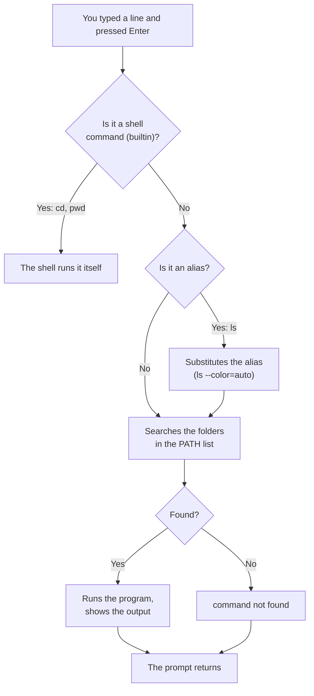
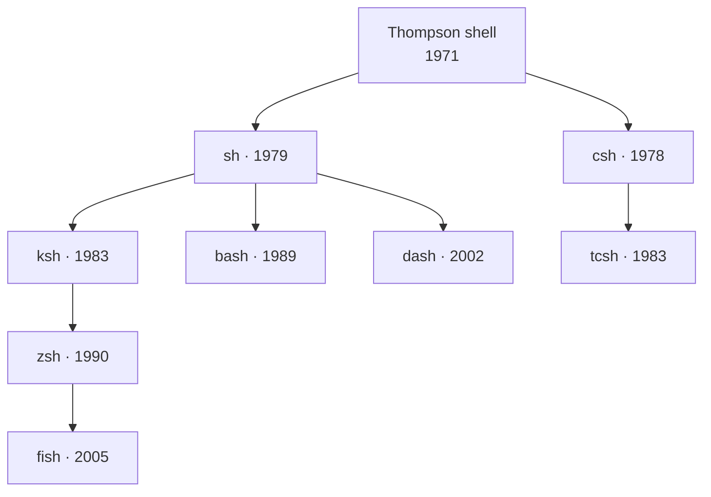
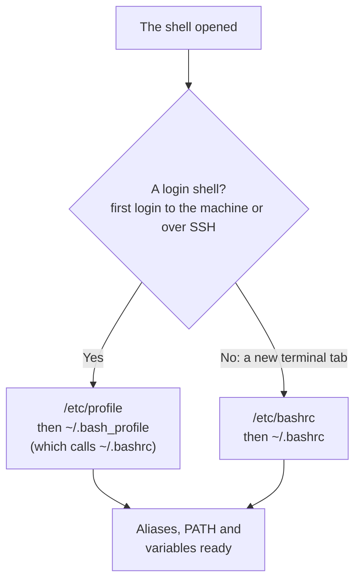

import Callout from '../../components/Callout.astro';
import Steps from '../../components/Steps.astro';
import Figure from '../../components/Figure.astro';
import promptImg from '../../assets/terminal-en-01-prompt.webp';
import lsImg from '../../assets/terminal-en-02-ls.webp';
import cdImg from '../../assets/terminal-en-03-cd.webp';
import manImg from '../../assets/terminal-en-04-man.webp';
import tabImg from '../../assets/terminal-en-05-tab.webp';
import helpImg from '../../assets/terminal-en-06-help.webp';
import historyImg from '../../assets/terminal-en-07-history.webp';
import gunlukImg from '../../assets/terminal-en-08-gunluk.webp';
import pathImg from '../../assets/terminal-en-09-path.webp';
import shellsImg from '../../assets/terminal-en-10-shells.webp';
import topImg from '../../assets/terminal-en-11-top.webp';
import bashrcImg from '../../assets/terminal-en-12-bashrc.webp';
import aliasImg from '../../assets/terminal-en-13-alias.webp';
import scriptImg from '../../assets/terminal-en-14-script.webp';
import pathPermImg from '../../assets/terminal-en-15-path.webp';
import readImg from '../../assets/terminal-en-17-read.webp';
import yedekImg from '../../assets/terminal-en-16-yedek.webp';
import nanoImg from '../../assets/terminal-en-18-nano.webp';
import vimImg from '../../assets/terminal-en-19-vim.webp';
import degiskenImg from '../../assets/terminal-en-20-degiskenler.webp';

In the [second part](/en/blog/installing-rhel) we installed RHEL; at the end of the install the desktop opened
and we briefly opened the terminal from the dock and typed a couple of commands. Today we go back to that window,
but this time not as a guest. The rest of the series happens here: files, users, packages, services, the
network... we'll manage all of it from this black-and-white window. So you need to feel at home here first.

Don't worry, the terminal is not as scary as it looks. In the [Algorithms series](/en/blog/what-is-an-algorithm)
we brewed tea step by step on paper; the terminal works exactly like that: you type a command, press Enter, it
runs, shows the result, and hands the turn back to you. In order, patient, dumb but fast. Let's get acquainted.

<Callout type="note" title="What you need for this part">
- The RHEL machine you installed in Part 2 (virtual or real, it doesn't matter). Have it on and logged in.
- Open the terminal: the black icon in the dock, or type "terminal" in Activities and press Enter. On RHEL 10
  it's called **Ptyxis.**
- **Read this part and type the same on your machine.** Every command is harmless; it only looks, it breaks
  nothing.
- Pen and paper aren't required, but they'll help with the questions at the end.
</Callout>

<Callout type="tip" title="About the screenshots">
I ran and captured every terminal screen in this post for real, on the RHEL 10.2 machine I installed in Part 2.
When you type the same, you'll see the same output; small differences (the date, the file list) are normal.
</Callout>

## Terminal, shell, prompt: who is who?

The three words always come up together and confuse people at first. Picture yourself at a bank counter:

- The **terminal** is the **counter window** you stand at; the box you type the command into and read the answer
  from. On RHEL 10 this window is called Ptyxis; on other systems it might be GNOME Terminal, Konsole, iTerm.
  They all do the same job.
- The **shell** is the **clerk** behind the counter; the program that understands your command, passes it to the
  operating system and hands the answer back. RHEL's clerk is called **bash.**
- The **prompt** is the clerk saying **"go ahead, type"**. That line to the left of the blinking cursor.

So the terminal is the vessel, the shell is the mind inside it, the prompt is the "I'm listening" sign. From now
on, when I say "open the terminal" I mean all three at once.

### Reading the prompt

When you open the terminal a line like this greets you. It looks cryptic but every piece says something:

<Figure src={promptImg} alt="The whoami, hostname and pwd commands and their output in a RHEL 10.2 terminal" caption="The prompt is the line mehmet@rhel-lab:~$. whoami tells the user, hostname the machine name, pwd the directory you're in." />

Let's read `mehmet@rhel-lab:~$` from left to right:

- **`mehmet`** is the name of the logged-in user. The `whoami` command says exactly this.
- **`@`** means "at"; a small separator in between.
- **`rhel-lab`** is the machine's name, the **hostname** you set in Part 2. The `hostname` command confirms it.
- **`:`** what follows the separator shows where you are.
- **`~`** is the directory you're currently in. This `~` is shorthand for your **home directory**; your home is
  `/home/mehmet`. The `pwd` command (print working directory) shows the full path plainly.
- **`$`** is where the prompt ends and you start typing. This sign says you're a **normal user.**

<Callout type="important" title="$ vs #: a small sign, a big meaning">
The final sign is **`$`** for a normal user and **`#`** for root (the administrator). So if you see a command on
the internet starting with `#`, it means "run this with administrator rights"; `$` means "an ordinary user is
enough". In Part 2 we left the root account disabled and gave ourselves administrator rights, remember? That's
why we'll use `sudo` when needed, but our own prompt stays `$`.
</Callout>

## First commands: where am I, what's here, how do I move?

When you move to a new place the first three questions are: where is this, what's in it, how do I get around. In
the terminal those three questions have three commands: `pwd`, `ls`, `cd`.

### ls: what's here?

`ls` (list) shows the files and folders in the directory you're in. On its own it gives a plain list; the letters
you add make it more talkative.

<Figure src={lsImg} alt="The output of ls, ls -l and ls -a in a RHEL 10.2 terminal" caption="ls gives a plain list. ls -l is detailed: permissions, owner, size, date. ls -a shows hidden files too (the ones starting with a dot, . and ..)." />

You see all three forms on the screen:

- **`ls`** the bare list: `backup.sh  greet2.sh  greet.sh  hello.txt  list.txt  notes  variables.sh`. Colored ones (folders in blue) give away the type.
- **`ls -l`** the "long" form. Each line is a file's ID card:
  `-rw-r--r--. 1 mehmet mehmet 17 Sep 14 05:08 hello.txt`. Left to right: type and permissions, link count,
  owner, group, size (bytes), last-modified date and name. What the permissions mean we'll discuss at length in
  [Part 6](/en/red-hat); for now "every file has an owner and permissions" is enough.
- **`ls -a`** means "all": it also shows **hidden files whose names start with a dot.** The leading `.` stands
  for the directory you're in, `..` for the directory above; we'll use these with `cd` in a moment.

You can combine `-l` and `-a` into `ls -la`; it does both. These little letters are called **options**; we'll
look at their structure shortly.

### cd and pwd: getting around

`cd` (change directory) moves you from one place to another. `pwd` lets you check "where am I now" at every step.
Used together, walking the directory tree becomes easy.

<Figure src={cdImg} alt="Getting around directories with cd and pwd in a RHEL 10.2 terminal" caption="Note: the path in the prompt changes after each cd. We moved with relative paths (notes, ..) and absolute paths (/, ~); pwd reports the exact place at each step." />

Let's follow the journey on the screen; notice that the prompt itself changes:

<Steps>
1. `cd ~/terminal-lesson` took us into our lesson folder; the prompt became `~/terminal-lesson`.
2. `cd notes` went into a subfolder. **`notes`** is a **relative path:** "the notes inside where I am".
3. `cd ..` went up one directory. **`..`** always means "one up".
4. `cd /` took us to the **root directory;** `/` is the top of the whole tree, "everything under `/`" from
   Part 1.
5. `cd ~` sent us home: `/home/mehmet`. `cd` on its own does the same.
</Steps>

<Callout type="important" title="Absolute path or relative path?">
There are two kinds of address. An **absolute path** starts at the root (`/`) and points to the same place
wherever you are: `/home/mehmet/terminal-lesson`. A **relative path** is relative to where you are: `notes`,
`../Pictures`. By analogy, an absolute path is a full postal address, a relative one is "right at that corner".
You'll reach for both constantly; if you lose track of which you're in, `pwd` tells you. Don't forget two
shortcuts: **`~`** is always your home directory, and **`cd -`** is the directory you were in just before (like
a "back" button between rooms).
</Callout>

## The shape of a command: command + option + argument

Everything we've typed so far fit the same mold. A command line is made of three parts:

```text title="The anatomy of a command" showLineNumbers=false
ls   -l   /etc
│    │    │
│    │    └─ argument: the thing the command works on (which directory?)
│    └────── option: an adjustment to the behavior (-l = long form)
└─────────── command: the program to run (ls)
```

- The **command** says what to do: `ls`, `cd`, `pwd`.
- The **option** (flag) adjusts how. It has two spellings: short (`-l`, `-a`) and long (`--all`, `--help`). You
  can combine the short ones: `ls -la` = `ls -l -a`.
- The **argument** says what to work on: `ls /etc` means "list the etc directory". Without an argument a command
  usually assumes the directory you're in.

Once this mold clicks, you can read commands you've never seen. `command -options arguments`; that's all. In the
[Java post](/en/blog/installing-the-jdk) we were in the same mold when we wrote `javac Merhaba.java`: command
`javac`, argument `Merhaba.java`.

## Help when you're stuck: man and --help

Nobody knows every command by heart; even an experienced sysadmin looks up help dozens of times a day. There are
two ways, and both work on every machine, without internet.

### man: the manual pages

`man` (manual) opens a command's full manual. Type `man ls` and see:

<Figure src={manImg} alt="The man ls manual page in a RHEL 10.2 terminal" caption="man ls: the official manual for ls. NAME, SYNOPSIS, DESCRIPTION sections and a description of every option. At the bottom it says 'press h for help or q to quit'." />

The manual fills the screen and opens inside a **pager.** Navigating it is easy:

- **Space** or the **arrow keys** scroll up and down.
- **`/word`** then Enter searches for that word (`n` for the next match).
- **`q`** quits. (The answer for everyone who panics because they can't get out of the manual: `q`.)
- **`h`** gives help.

The `LS(1)` at the top of the manual has a **1** that's a section number: 1 = user commands. It matters when the
same name is both a command and a config file, but don't worry about it now.

### --help: a quick summary

The whole manual is sometimes too much; if you just want to check "which option was it", `--help` is faster. It
prints a short summary of the command's options:

<Figure src={helpImg} alt="The beginning of the ls --help output in a RHEL 10.2 terminal" caption="ls --help: the usage form and a summary of the options. The output is long, so I cut the top with head -18; it's a pocket-sized version of man." />

<Callout type="tip" title="Keep it in your pocket: what to do when stuck">
If you forgot a command or you're hunting for an option, in order: first **`command --help`** (quick summary),
if that's not enough **`man command`** (full manual). If you can't even remember the command's name,
**`apropos keyword`** searches for related commands. These are three of a developer's most-used habits; it's not
about memorizing, it's about knowing how to look it up.
</Callout>

## Type less, do more: Tab and history

The secret to loving the terminal is typing less. Two features rest your fingers and prevent your mistakes.

### Tab: autocompletion

Type the start of a command or file name and press **Tab**; the shell completes the rest.

<Figure src={tabImg} alt="Autocompletion with Tab in a RHEL 10.2 terminal: typing cd ~/ter and pressing Tab becomes cd ~/terminal-lesson/" caption="I typed cd ~/ter and pressed Tab; the shell completed the rest as ~/terminal-lesson/. Never type long names by hand, let Tab do it." />

If there's a single possibility it completes at once. If there are several (say `Do` matches both `Documents`
and `Downloads`), pressing **Tab twice** lists them all; you add a few more letters and press Tab again. Tab
saves time and heads off most of the "no such file" errors that come from typos. It's the first habit a beginner
should build.

### History: don't retype the same command

The shell remembers every command you type. The **Up arrow** brings back previous commands; press Enter and it
runs again. To see the whole history, `history`:

<Figure src={historyImg} alt="The output of the history command in a RHEL 10.2 terminal: numbered command history" caption="history keeps every command I typed, numbered. The Up arrow brings back the last command; Ctrl+R searches through the history." />

- **Up/Down arrow:** move through previous commands.
- **`history`:** the full numbered list. Type `!149` to run command number 149 again.
- **`Ctrl+R`:** search the history. Start typing a word and the shell finds the last command containing it.
- **`!!`:** runs the very last command again (especially `sudo !!`, "run that last command again, as
  administrator").

<Callout type="tip" title="Two life-saving shortcuts">
**`Ctrl+C`** stops a running command; if something hangs or you typed the wrong thing, that's your rescue.
**`Ctrl+L`** (or the `clear` command) clears the screen without erasing the history. Add the trio **`Tab Tab`**,
**Up arrow** and **`Ctrl+R`**; once these five are in your muscle memory, the terminal stops being tiring.
</Callout>

## A few more useful commands

We've learned to move around and to get help. Let's pocket a few small commands too; all harmless, all often
useful.

<Figure src={gunlukImg} alt="The echo, date and uname -r commands in a RHEL 10.2 terminal" caption="echo prints text to the screen, date gives the date and time, uname -r reports the kernel version: 6.12.0-211.51.1.el10_2, the number we read in Part 2." />

- **`echo`** prints the text you give it: `echo Hello, terminal`. It looks simple, but it'll be a backbone
  when we write variables and scripts in later parts. It's the terminal's version of the `PRINT` command from
  the [Pseudocode post](/en/blog/pseudocode).
- **`date`** prints the current date and time: `Sun Sep 13 10:03:00 PM +03 2026`. The `+03` at the end is our
  time zone; we saw this offset in Part 2 while discussing the clock.
- **`uname -r`** reports the running kernel's version: `6.12.0-211.51.1.el10_2.x86_64`. We took this number
  apart in Part 2; here's RHEL 10's 6.12 kernel, with your own eyes.
- **`cat file`** dumps a text file's contents to the screen (for small files); for big ones `less file` shows it
  page by page (like man, quit with `q`).

## The black screen is a whole world

Let's stop for a second. In [Part 2](/en/blog/installing-rhel) we said that if you pick the "Server" or "Minimal"
install, no desktop appears, only this black screen. That's not a limitation. Graphical interfaces (mouse,
windows, icons) came **later** in the history of computing; in the 1970s and 80s every computer was run exactly
like this, with text. So the terminal isn't a stripped-down version of the graphical interface; on the contrary,
the graphical interface is a layer added on top of the terminal years afterward. The overwhelming majority of the
world's servers still run today with no desktop, just this screen.

And this black screen does far more than you'd think. There are **full-screen** programs that use menus, panels,
colors, even the mouse, just like graphical programs; they're called **TUIs** (Text User Interface). Here's a
program running inside the terminal, drawing a full screen: `top`, a live monitor of the system's processes.

<Figure src={topImg} alt="The top command in a RHEL 10.2 terminal: a full-screen, live process monitor" caption="top isn't a 'command and output'; it's a full-screen interface with a header, columns and colors, updating live, all drawn from text. You quit with q." />

As you can see, this isn't the familiar "type a command, see output"; it's an interface with a header and columns,
updating live, all drawn from text. And `top` is not the only one; there's a whole world of applications inside
the terminal:

- **Text editors:** `vim`, `nano`, `emacs`, and the modern `helix` (written in Rust). You write code and config
  files alike, all in the terminal.
- **System monitors:** `top`, `htop`, and the Rust-written `bottom` (btm), `btop`.
- **File managers:** the classic `mc` (Midnight Commander), the Rust-written `yazi`.
- **Modern takes on everyday tools (mostly in Rust):** `bat` (a colorful `cat`), `eza` (a modern `ls`), `ripgrep`
  (very fast search), `fd` (an easy `find`), `zoxide` (a smart `cd`), `starship` (a slick prompt), `atuin`
  (advanced history).
- **Whole applications:** `tmux` (a window manager that splits the screen, we installed it in Part 2), `lazygit`
  and `gitui` (a Git interface), email clients, music players, even games.

That so many of these tools have been rewritten in **Rust** in recent years is no accident, it's a sign of a
revival: the black screen didn't die, on the contrary it's coming back to life with fast, safe, beautiful tools.
Most of them are built on a Rust library called **ratatui.** So don't think of the terminal as old technology;
today even the newest tools are born here, on this black screen.

<Callout type="note" title="So why the terminal when there's a GUI?">
A fair question. The terminal wins at three things. **Speed:** without reaching for the mouse and hunting through
menus, one line gets the job done. **Working remotely:** you connect to a server from the other side of the world
and manage it; a GUI can't travel there but the terminal can (we'll see this with SSH in [Part 10](/en/red-hat)).
**Automation:** you write your task into a file and repeat it a thousand times, on a thousand machines; in a GUI
you make every click by hand. This is where a system administrator's real power comes from.
</Callout>

## Behind the curtain: what happens when you run a command?

When you type `ls` and press Enter, the shell actually does a few steps of work. Understand this once and errors
like "command not found", and the logic of the terminal, fall into place.



The most critical stop in this chain is **PATH.** When you type a command, the shell doesn't search everywhere;
it looks in order through a colon-separated list of folders called **PATH.** Here's the list on my own machine,
and `type`, which tells you what a name really is:

<Figure src={pathImg} alt="The output of echo $PATH, type pwd, type ls and which java in a RHEL 10.2 terminal" caption="echo $PATH shows the list of folders where commands are searched. type pwd says 'shell builtin', type ls turns out to be an alias, and which java gives the path /usr/bin/java." />

Let's read the output:

- **`echo $PATH`** prints that list:
  `/home/mehmet/.local/bin:/home/mehmet/bin:/usr/local/bin:/usr/local/sbin:/usr/bin:/usr/sbin:...`. When the
  shell looks for `ls`, it checks these folders in order and finds `/usr/bin/ls`. This is **exactly** the PATH we
  saw in the [Java JDK installation post](/en/blog/installing-the-jdk); there the JDK folder was added to this
  list so that `javac` could be found. Today we see it from the terminal's point of view.
- **`type pwd`** → `pwd is a shell builtin`: `pwd` isn't a program on disk, it's built right into the shell.
  So is `cd`; it has to be, because the shell itself keeps track of your current directory.
- **`type ls`** → `ls is aliased to 'ls --color=auto'`: `ls` is an **alias.** RHEL bound it to a shortcut so the
  output is colorized. That's why the folders showed up in blue.
- **`which java`** → `/usr/bin/java`: `which` tells you which folder in PATH a command lives in. We installed
  Java in the [Java series](/en/blog/what-is-java); here's the proof, it really is there.

So not everything you type in the terminal is the same kind of thing: some come from inside the shell
(`builtin`), some from a shortcut (`alias`), some from a real program on disk (PATH). Telling these three apart
solves, up front, a lot of confusing situations later on.

### Let's dig a little deeper into PATH

PATH is so central that it's worth one more step; most "command not found" errors, and most of the tools you'll
install later, look here.

- **Order matters.** The shell scans the list left to right and runs the **first match.** If two programs share a
  name, the one earlier in PATH wins. In the [Java post](/en/blog/installing-the-jdk) this was the cause of "I
  installed it but it still shows the old version": the old one came earlier in the list.
- **Adding a folder.** If you put your own programs in `~/.local/bin` you don't have to do anything; RHEL already
  adds that folder to PATH (we'll see it in `.bashrc` shortly). To add another folder:
  `export PATH="$HOME/tools:$PATH"`. Put it at the front for priority, or at the end (`$PATH:...`) so you don't
  override the system's commands.
- **Temporary or permanent?** `export PATH=...` applies only to **that terminal**; it's gone when you close the
  window. To make it permanent you write it into a startup file (`~/.bashrc`); that's exactly the next section.
- **Why isn't `.` (the current directory) in PATH?** Security. If the current directory were in PATH, and a folder
  someone sent you contained a malicious file named `ls`, typing `ls` might run it instead of the real `ls`. That's
  why you run a script in your own directory with a leading `./`: `./greet.sh`. It means "really run the one
  right here".

## Shell varieties: bash, zsh, fish and family

All along we've just said "the shell is bash". But the shell is actually a **replaceable** part, and it comes in
many varieties. First, let's be clear: the shell is a program that does two jobs at once. On one hand it's a
**command interpreter** (you type, it runs); on the other it's a small **programming language** — it has
variables, conditionals, loops; you can write a sequence of commands into a file and run it as a **script.** So
changing the shell changes not just the look of the prompt but the rules of the language.

The `/etc/shells` file tells you which shells are installed on your machine; you can even switch into another shell
and come back:

<Figure src={shellsImg} alt="bash --version, cat /etc/shells, zsh --version and switching into zsh in a RHEL 10.2 terminal" caption="bash 5.2; /etc/shells lists the installed shells (I just installed zsh). zsh -f switched into zsh and the prompt changed from $ to %; exit returned me to bash. Changing shells is that easy." />

As you see on the screen: `bash --version` gave the version, `/etc/shells` listed the installed shells, `zsh -f`
switched into zsh (notice the prompt changed from **`$` to `%`**), and `exit` returned me to bash. So where did
all these varieties come from? A short family tree:



Let's meet them one by one:

- **sh (the Bourne shell), 1979.** The ancestor shell, written by Stephen Bourne at Bell Labs. Plain for
  interactive use, but it laid the foundation of scripting; you still see `#!/bin/sh` at the top of scripts today.
  On modern systems `/bin/sh` is often linked to a smaller relative (dash).
- **csh / tcsh, 1978–1983.** Bill Joy (a founder of BSD and later Sun, mentioned in [Part 1](/en/blog/what-is-red-hat))
  wrote it with a C-like syntax; among the first to bring interactive conveniences like history and aliases. tcsh
  improved it by adding completion. Its scripting side is troublesome, so it's little used today.
- **ksh (the Korn shell), 1983.** David Korn combined sh's scripting power with csh's interactive comfort. It was
  the standard on commercial Unix for many years.
- **bash (Bourne Again Shell), 1989.** Brian Fox wrote it for the GNU project ([Stallman's project from
  Part 1](/en/blog/what-is-red-hat)). The name is a pun: **B**ourne **A**gain **SH**ell, both "Bourne reborn" and
  the English "born again". It's compatible with sh but adds history, Tab completion, job control and much more.
  The default on Linux and almost every server; it's what we use in this series.
- **dash, 2002.** A very small and fast sh. Designed not for interactive use but for running scripts quickly; it's
  the `/bin/sh` on Debian and Ubuntu. It doesn't ship separately on RHEL.
- **zsh (the Z shell), 1990.** Written by Paul Falstad, very similar to bash but ahead of it for interactive use:
  smart completion, spelling correction, a powerful plugin system (the famous oh-my-zsh). Apple has used it as the
  default on macOS since 2019.
- **fish (friendly interactive shell), 2005.** As the name says, the friendliest for beginners: syntax
  highlighting out of the box, suggestions that appear as you type (autosuggestions), and genuinely good
  completion. Its one catch: the syntax differs from bash/sh, so ready-made bash scripts don't run directly in
  fish.

The most important line between them is this: **POSIX compatibility.** sh, bash, ksh, zsh and dash share the same
basic syntax (the POSIX standard); a script you write in one largely runs in the others. fish and csh are outside
this family; more comfortable, but not portable.

| Shell | Year | Author | Highlight | POSIX | Default where |
| --- | --- | --- | --- | --- | --- |
| **bash** | 1989 | Brian Fox (GNU) | compatible, everywhere | Yes | Linux, RHEL, most servers |
| **zsh** | 1990 | Paul Falstad | plugins, strong interaction | Yes | macOS (2019+) |
| **fish** | 2005 | Axel Liljencrantz | friendly, autosuggestions | No | — (chosen by hand) |
| **sh / dash** | 1979 / 2002 | Bourne / Almquist | scripting; small and fast | Yes | /bin/sh on Debian/Ubuntu |
| **ksh** | 1983 | David Korn | sh power + interaction | Yes | some commercial Unix |
| **tcsh** | 1983 | Ken Greer | C-like syntax | No | older BSD systems |

<Callout type="tip" title="Which one should I use?">
For learning and for servers, **bash.** It's what you always meet, and what you learn applies everywhere. On your
own computer, if you want comfort, **zsh** (already the default if you're on macOS) or **fish** are a joy; the
highlighting and suggestions make life easier. But remember: whatever your personal shell, you need to **know
bash/sh** for writing scripts and connecting to someone else's server. `echo $SHELL` tells you which shell you're
in right now; `chsh` changes your default shell (but don't rush, learn bash solidly first).
</Callout>

## Making the shell your own: .bashrc and friends

Every time the shell opens, before you type anything, it reads a few **config files.** You write your aliases,
environment variables and PATH additions into these files so they're ready in every new terminal. In bash these
files' names start with a dot (so they're hidden) and most end in `rc`; `rc` comes from "run commands", a
convention dating back to the 1960s.

<Figure src={bashrcImg} alt="The bash files in the home directory and the default .bashrc content in a RHEL 10.2 terminal" caption="The config files in the home directory (.bashrc, .bash_profile) and RHEL's default .bashrc: it calls /etc/bashrc, adds ~/.local/bin to PATH, and loads the pieces under ~/.bashrc.d/." />

On the screen you see the files in the home directory and RHEL's default `.bashrc`. There are two main files:

- **`.bashrc`** — read on every **interactive** shell start (when you open a new terminal tab). Your aliases and
  everyday settings go here.
- **`.bash_profile`** — read only by a **login** shell (your first login to the machine or over SSH). On RHEL this
  file already calls `.bashrc`, so most of the time you only deal with `.bashrc`.

RHEL's default `.bashrc` does three things, all familiar: it calls the system-wide `/etc/bashrc`, **adds
`~/.local/bin` to PATH** (the PATH persistence we just discussed happens right here) and loads the piece-settings
in the `~/.bashrc.d/` folder.

Now let's add our own settings. Two basic tools: the **alias** and the **environment variable**.

<Figure src={aliasImg} alt="Defining an alias, an environment variable and appending to .bashrc in a RHEL 10.2 terminal" caption="alias ll='ls -l' is a shortcut; export EDITOR=nano is an environment variable. To make the alias permanent I appended it to .bashrc with >>; tail -2 shows the last lines." />

- **Alias:** a short name for a long command. Type `alias ll='ls -l'` and from then on `ll` is enough. But an
  alias defined like this lives **only in that terminal.** To make it permanent you add it to `.bashrc`:
  `echo "alias ll='ls -l'" >> ~/.bashrc`. The **`>>`** on screen means "append to the end of the file"; a single
  **`>`** would overwrite the file, wiping what's in it. Careful!
- **Environment variable:** settings that programs read. Type `export EDITOR=nano` and programs that ask you for an
  editor will open nano. `$PATH`, and `$JAVA_HOME` from the [Java post](/en/blog/installing-the-jdk), are both
  environment variables; you peek inside one with `echo $VAR`.

After changing a file you either open a new terminal or re-read the file with **`source ~/.bashrc`** (`source`
means "run the commands in this file now"). Which file is read when goes like this:



<Callout type="note" title="The equivalents in zsh and fish">
zsh has the same logic with different names: **`.zshrc`** (the counterpart of bash's `.bashrc`, every interactive
shell), **`.zprofile`** (the login shell) and **`.zshenv`** (every zsh, read earliest). That's why on macOS you
edit `.zshrc`. fish uses a completely different file: `~/.config/fish/config.fish`. In the
[Java post](/en/blog/installing-the-jdk), adding JAVA_HOME to `.bashrc` or `.zshrc` was exactly this: making a
setting permanent.
</Callout>

## Shell programming: your first script

We said the shell is a small programming language; let's prove it. A **script** is nothing but commands written
one under another in a file; the shell runs them in order. Remember the steps you wrote on paper in the
[Algorithms series](/en/blog/what-is-an-algorithm); a script is their counterpart on a real machine.

<Figure src={scriptImg} alt="The contents of greet.sh and running it twice in a RHEL 10.2 terminal" caption="greet.sh: a shebang, a comment, a variable, an argument ($1), a condition (if), command substitution ($(...)) and a loop (for). Run with no argument it greets 'world'; ./greet.sh Ada greets 'Ada'." />

Let's read the `greet.sh` script on screen line by line:

- **`#!/bin/bash`** — the first line, called the **shebang:** it means "run this file with bash". It sits at the
  very top of every script.
- **`# ...`** — lines starting with `#` are **comments;** the shell doesn't run them, they're for humans to read.
- **`name="$1"`** — a **variable.** The mailbox from the [Variables post](/en/blog/variables): its name is `name`,
  and we put a value in it. `$1` is the first **argument** given to the script from outside (if you say
  `./greet.sh Ada` then `$1` = Ada). Careful: there are **no spaces** around the `=` (`name = "..."` is an error).
- **`if [ -z "$name" ]; then ... fi`** — a **condition.** The bash form of the `IF ... THEN ... ENDIF` from
  pseudocode. `-z` means "is empty": if the user gave no name, we set `name` to "world". You read a variable by
  putting `$` in front of it.
- **`echo "... $name ..."`** — the `PRINT` from [pseudocode](/en/blog/pseudocode). Inside double quotes `$name` turns
  into its value; `$(date +%A)` is **command substitution:** it runs the command inside the parentheses and pastes
  its output there.
- **`for d in "$HOME"/*/; do ... done`** — a **loop.** The `FOR EACH ... ENDFOR` from pseudocode. It bumps a
  counter by one for each folder in the home directory (`$(( ... ))` does arithmetic).

Running a script takes two conditions. First you make the file **executable:** `chmod +x greet.sh` (once is
enough). Then you put `./` in front and say `./greet.sh`; remember `.` isn't in PATH, so the `./` is required.
We'll discuss [permissions at length in Part 6](/en/red-hat); for now `+x` meaning "this file is a program, it's
executable" is enough.

And if you want to run the script from anywhere, without `./`? This is exactly where PATH comes in:

<Figure src={pathPermImg} alt="Copying the script to ~/.local/bin and running it from any directory in a RHEL 10.2 terminal" caption="I copied the script into ~/.local/bin (RHEL adds that folder to PATH). Now even from the root directory just 'greet Mehmet' works; which greet confirms where it was found." />

I copied the script into the `~/.local/bin` folder (RHEL's `.bashrc` was adding it to PATH, remember). Now no
matter which directory I'm in, just typing `greet` is enough; the shell finds it in PATH and runs it. `which
greet` confirms where it found it. Writing your own command and adding it to the system is that simple.

This little script is a start. Shell programming is the **backbone** of DevOps and system administration; everyone
who sets up servers, takes backups, scans logs or ships releases writes scripts all day. So let's get to know the
basic building blocks a little more closely. Don't panic: they're all the bash spelling of the concepts you saw on
paper in the [Algorithms series](/en/blog/what-is-an-algorithm).

### Where do you write a script: nano, vim and editors

So far I've shown scripts ready-made; but how do you write one? A script is just a plain text file, so you write it
in any **text editor.** Two editors open right in the shell, without leaving the terminal, and both are on every
server.

**nano** is the beginner's editor. Type `nano greet.sh` and the file opens, ready to type. The `^` at the bottom
means Ctrl: **Ctrl+O** saves (write **O**ut), **Ctrl+X** exits, **Ctrl+W** searches. Easy, intuitive, its cheat
sheet always at the bottom of the screen.

<Figure src={nanoImg} alt="The greet.sh file in the nano editor in a RHEL 10.2 terminal" caption="nano greet.sh: a syntax-highlighting editor; at the bottom, Ctrl shortcuts like ^O Write Out (save) and ^X Exit. The easiest one for a beginner." />

**vim** is the powerful, fast, everywhere-present editor. It opens with `vim greet.sh`. It has a twist: it's
**modal.** On opening it's in **normal mode** (keys are commands); press `i` to enter **insert mode** and type, then
**Esc** to return to normal mode. `:w` saves, `:q` quits (`:wq` both, `:q!` quits without saving). Confusing at
first, but very fast once you're used to it; on servers it's often the only advanced editor you'll find ready.

<Figure src={vimImg} alt="The greet.sh file in the vim editor in a RHEL 10.2 terminal" caption="vim greet.sh: syntax highlighting, the ~ marks on the left are the empty lines past the end of the file, and the 'greet.sh 14L, 314B' status line at the bottom. Powerful but modal; the full walkthrough is in Part 5." />

Don't panic: we'll cover vim from the ground up, patiently, in [Part 5](/en/red-hat). For now, knowing how to
**open, type and save a script with nano** is enough. On a graphical desktop you can use a windowed editor like
GNOME Text Editor or VS Code too; a script is plain text, it doesn't matter what you write it with. Not even the
extension matters: `.sh` is a convention, what makes a script a script is the shebang on the first line.

### Variables: definition, rules and kinds

A variable is the mailbox from the [Variables post](/en/blog/variables): a name with a value inside. In bash it's
very simple to define, with a few strict rules.

**Definition and rules:**

- Assignment: `ad="Ada"`. **No spaces around the `=`** (`ad = "Ada"` is an error; the most common mistake).
- Reading: put `$` in front: `echo "$ad"`. To avoid ambiguity the braced form is safer: `${ad}` (e.g. to write
  `${ad}lar` joined together).
- Name rule: letters, digits and underscore; **can't start with a digit** and is **case-sensitive** (`ad` and `Ad`
  are different variables).
- Removing: `unset ad` deletes the variable.

**Quoting (the most common trap):**

- **Double quotes `"..."`:** the `$variable` inside turns into its value. **Always** quote variables: `"$file"`.
  Otherwise, if the value contains spaces, bash splits it ("word splitting") and things break.
- **Single quotes `'...'`:** touch nothing, print exactly what's inside. `echo '$ad'` prints `$ad`.
- **No quotes:** both expands and splits; usually not what you want, so quote by habit.

**Ways to produce a value:**

- **`$(...)` command substitution:** runs the command inside and inserts its output: `today=$(date +%F)`.
- **`$(( ... ))` arithmetic:** `sum=$((2 + 3))` → 5.

In bash a variable is **a string by default** (there's no separate type declaration); even `yas=40` is really the
text "40". But in practice we distinguish a few **kinds:**

<Figure src={degiskenImg} alt="The variables.sh script showing kinds of variables and its output in a RHEL 10.2 terminal" caption="variables.sh: a string, an integer with declare -i (40+2=42), an array, a readonly constant, and the $0/$#/$1/$USER/$HOME special and environment variables, all in one script." />

- **String:** the most common. `ad="Ada"`.
- **Integer:** with `declare -i sayi=40` bash treats it as a number; `sayi=sayi+2` becomes 42 directly.
- **Array:** holds several values together. `renkler=(red green blue)`; reach the first with `${renkler[0]}`, all
  with `${renkler[@]}`, the count with `${#renkler[@]}`. For a key-value associative array, `declare -A`.
- **Constant (readonly):** `readonly PI=3.14` can't be changed afterward; trying gives an error. We write constants
  in UPPERCASE by convention.

There are also **special variables** the shell gives you without you defining them:

| Variable | Meaning |
| --- | --- |
| `$0` | the script's name |
| `$1`, `$2` ... | arguments given to the script (1st, 2nd ...) |
| `$#` | the number of arguments |
| `$@` | all arguments |
| `$?` | the last command's exit code |
| `$$` | the running process's number (PID) |
| `$USER` `$HOME` `$PWD` | user, home directory, current directory (environment variables) |

The `variables.sh` on screen shows most of these together: a string and its length, an integer with
`declare -i`, an array, a `readonly` constant, the `$0`/`$#`/`$1` special variables and the `$USER`/`$HOME`
environment variables.

**Scope: shell variable or environment variable?** An ordinary variable lives only in the shell that defined it.
With **`export`** you turn it into an **environment variable**, and the programs that shell launches see it too:
`export EDITOR=nano`. `PATH` and `JAVA_HOME` from the [Java post](/en/blog/installing-the-jdk) are environment
variables; that's why they're defined with `export` in `.bashrc`.

**Playing with text:** bash can slice and reshape a variable's contents; these expansions come in handy often:

```bash title="String operations" showLineNumbers=false
s="hello-world"
echo "${#s}"                # length: 11
echo "${s:0:5}"             # first 5 chars: hello
echo "${s/world/shell}"     # replace: hello-shell
echo "${s^^}"               # UPPERCASE: HELLO-WORLD
```

### Taking input: read

`read` takes input from the user and puts it into a variable; it makes a script interactive.

<Figure src={readImg} alt="The greet2.sh script taking input from the user with read in a RHEL 10.2 terminal" caption="greet2.sh: read asks for a name and age, then greets differently based on the answer. What is your name? Ada, How old are you? 25 produces the 'adult' greeting." />

```bash title="greet2.sh"
#!/bin/bash
read -rp "What is your name? " name
read -rp "How old are you? " age
if [ "$age" -ge 18 ]; then
    echo "Hello $name, welcome (adult)."
else
    echo "Hello $name, welcome (young)."
fi
```

`-p` prints the prompt, `-r` takes the backslash literally (a good habit). The entered values land in `ad` and
`yas`, then `if` decides.

### Making decisions: test, square brackets and case

The `[ ... ]` next to `if` is actually a command called `test`; if the expression inside is true, the `then`
branch runs. The most-used tests:

| Test | Meaning |
| --- | --- |
| `[ -z "$x" ]` | is x **empty** |
| `[ -n "$x" ]` | is x **non-empty** |
| `[ "$a" = "$b" ]` | are the strings equal |
| `[ "$a" -eq "$b" ]` | are the numbers equal |
| `-gt` `-lt` `-ge` `-le` | number `>` `<` `≥` `≤` |
| `[ -f "$p" ]` | is p a **file** |
| `[ -d "$p" ]` | is p a **directory** |
| `[ -e "$p" ]` | does p **exist** |

Note that number comparison uses letters (`-gt`); the `<` `>` signs mean something else in the shell
(redirection). To chain two commands use **`&&`** (run the second if the first succeeded) and **`||`** (if it
failed): `mkdir backup && cd backup`. When there are many options, `case` is cleaner:

```bash title="case for many paths"
case "$1" in
    start) echo "starting" ;;
    stop)  echo "stopping" ;;
    *)     echo "unknown command" ;;
esac
```

### Repeating: for, while and reading line by line

Three kinds of loop do the job:

```bash title="Three loops"
# 1) walk a list
for color in red green blue; do
    echo "$color"
done

# 2) with a counter (C-style)
for ((n = 1; n <= 3; n++)); do
    echo "round $n"
done

# 3) while a condition holds
i=1
while [ "$i" -le 3 ]; do
    echo "number $i"
    i=$((i + 1))
done
```

The pattern you'll use most in system administration is reading a file or a command's output **line by line:**

```bash title="Read line by line"
while read -r line; do
    echo "-> $line"
done < list.txt
```

`break` leaves the loop entirely, `continue` skips this round and goes to the next.

### Functions

You write repeated work once, bind it to a name, then call that name:

```bash title="A function"
greet() {
    local person="$1"
    echo "Hi, $person!"
}

greet Ada      # Hi, Ada!
greet Mehmet   # Hi, Mehmet!
```

`local` confines the variable to the function (it doesn't pollute the outer variables). Arguments arrive as `$1`,
`$2`, just like in a script. Functions keep long scripts readable and free of repetition; the bash form of the
black box from the [Functions post](/en/blog/functions).

### Handling errors: exit codes and "strict mode"

Every command leaves an **exit code** behind when it finishes: **0 = success,** non-zero = error. You read the
last command's code with `$?`:

```bash title="Exit code" showLineNumbers=false
ls /nonexistent 2>/dev/null
echo "exit code: $?"   # prints: exit code: 2
```

Your own script also ends with `exit 0` (success) or `exit 1` (error); the `&&` and `||` chains from earlier rely
on this code. Putting this line at the top of serious scripts is almost a tradition, called **strict mode:**

```bash title="Strict mode" showLineNumbers=false
set -euo pipefail
```

- **`-e`:** stop the script at once if a command fails (don't carry on silently and make a mess).
- **`-u`:** error out if an undefined (misspelled) variable is used.
- **`-o pipefail`:** don't ignore a failure if any command in a pipeline (`|`) crashes.

There's also **`trap`** for cleanup: it sets a command to run however the script ends (errors included), like
`trap 'rm -f "$tmp"' EXIT`. Our backup script had `set -euo pipefail` on its first line; now you know why.

### A real example: a small backup script

Now let's look at a genuinely useful script that brings together what we've learned. It backs up a folder into a
timestamped archive:

<Figure src={yedekImg} alt="The backup.sh script and running it in a RHEL 10.2 terminal: it creates a timestamped tar.gz archive" caption="backup.sh uses almost every concept: strict mode, default argument, file test, command substitution. Running it created a timestamped archive like terminal-lesson-20260914-051331.tar.gz under ~/backups." />

The script uses nearly every building block: **strict mode** (`set -euo pipefail`), a **default argument**
(`${1:-...}`, falls back to `terminal-lesson` if no source is given), a **file test** (`[ ! -d ... ]`, if the
folder doesn't exist it writes the error to the error stream with `>&2` and exits with `exit 1`), **command
substitution** (`$(date ...)`, `$(basename ...)`, `$(dirname ...)`), and after building the archive it reports its
size (`du -h | cut`) and item count (`tar -tzf | wc -l`). Running it created a timestamped `.tar.gz` under
`~/backups`. Bind this script to the **scheduler** you'll meet in a later part and it takes a backup by itself
every night; that's the very essence of automation.

### Where this leads: the backbone of automation

The building blocks you've learned (variable, quoting, condition, loop, function, exit code) are exactly the
foundation of DevOps and system administration. Setting up, updating, backing up, monitoring a server and shipping
a new release all start as a shell script first. Later:

- In **[Part 9](/en/red-hat)** we'll schedule these scripts with `cron`: "take a backup every night at 03:00".
- When you need the same job done across hundreds of servers at once, tools like **Ansible** step in; the same
  shell logic sits underneath them.
- In modern software delivery (CI/CD), every step is made of small shell scripts.

So the three-line `greet.sh` you wrote today is really the first brick of a whole world. Learning shell
programming isn't memorizing one more command; it's opening the door to making the machine **do your work for
you.**

## Try it yourself

This time the questions are for the keyboard, not pen and paper. But answer each one **in your head first,** then
try it on your machine; if your guess doesn't match, that's where the real learning begins.

### Question 1 — Read the prompt (easy)

> A friend's screen shows the prompt: `root@web01:/var/log#`. This line tells you four things: who, which machine,
> which directory, and an important warning. Work out all four.

<Callout type="note" title="Hint">
The user is **root** (the administrator), the machine is **web01**, the directory is **/var/log** (an absolute
path, the log folder under root). The warning is the final **`#`:** this person is working as root, so every
command is fully privileged; you have to be careful here. And the directory being a full path rather than `~`
shows they're not in their home but in the system's log folder.
</Callout>

### Question 2 — Where do I end up? (medium)

> You're in your home directory (`/home/mehmet`). You type, in order: `cd terminal-lesson`, `cd notes`, `cd ..`,
> `cd /`, `cd -`. What does the final `pwd` print?

<Callout type="note" title="Hint">
Step by step: into `terminal-lesson` → down into `notes` → `..` back up to `terminal-lesson` → `/` to the root →
`cd -` means "go back to the previous directory", i.e. where you were before going to the root:
**`/home/mehmet/terminal-lesson`.** Remember `cd -` is a "back" button; it brings the last place you were, not
the parent directory.
</Callout>

### Question 3 — What's hidden? (easy)

> `ls` shows three things but `ls -a` shows seven. Where did the extra four come from, and what are they?

<Callout type="note" title="Hint">
`ls -a` also shows **hidden files:** the ones whose names **start with a dot.** Two of the extra four are the
`.` (this directory) and `..` (the parent) found in almost every directory; the others might be config files like
`.bashrc`. On Linux, to "hide" a file you just put a dot at the start of its name; no magic, just a convention.
</Callout>

### Question 4 — Lazy fingers (easy)

> There's a folder called `Downloads` in your home directory. What happens when you type `cd Dow` and press Tab?
> And when you type `cd D` and press Tab twice?

<Callout type="note" title="Hint">
`cd Dow` + Tab → a single match (`Downloads`), so the shell completes it at once to `cd Downloads/`. `cd D` +
Tab Tab → several things may start with `D` (`Documents`, `Downloads`, `Desktop`); one Tab won't complete, two
Tabs list them all so you can add a letter to disambiguate. The rule: Tab waits when unsure, two Tabs offer the
options.
</Callout>

### Question 5 — What is that command, really? (medium)

> If you type `type cd`, `type ls` and `which cat` you get three different kinds of answer. Which is from inside
> the shell, which is a shortcut, which is a program on disk?

<Callout type="note" title="Hint">
`type cd` → **shell builtin** (built into the shell; it has to be, since the shell keeps the current directory).
`type ls` → **aliased** (a shortcut, `ls --color=auto`). `which cat` → a path like **/usr/bin/cat** (a real
program on disk, found in PATH). Seeing that everything you type falls into one of these three kinds answers half
of the "why does this command behave like that" questions down the road.
</Callout>

### Question 6 — A permanent alias (medium)

> You typed `alias not='cd ~/terminal-lesson'` and it works. But after you close and reopen the terminal, `not`
> says "command not found". Why? How do you make it permanent?

<Callout type="note" title="Hint">
An alias defined in the terminal lives only in **that session;** a new terminal doesn't know it. To make it
permanent you add it to a startup file, `.bashrc`: `echo "alias not='cd ~/terminal-lesson'" >> ~/.bashrc`, then
`source ~/.bashrc` (or a new terminal). Because every new shell reads `.bashrc` on startup, the alias is now ready
every time.
</Callout>

### Question 7 — What does the script print? (medium)

> Consider this script:
>
> ```bash
> #!/bin/bash
> sayi=3
> if [ "$sayi" -gt 2 ]; then
>     echo "big"
> else
>     echo "small"
> fi
> ```
>
> What does it print? And if `sayi=1`?

<Callout type="note" title="Hint">
`-gt` means "greater than". With `sayi=3`, 3 > 2 is true, so it prints **`big`**. If `sayi=1`, then 1 > 2 is
false, it falls to the `else` branch and prints **`small`**. In bash, number comparison uses letters like `-gt`,
`-lt`, `-eq`; the `<` and `>` signs mean something else in the shell (redirection), so for numbers you use the
lettered ones.
</Callout>

### Question 8 — A small loop (medium)

> What does this script print?
>
> ```bash
> #!/bin/bash
> toplam=0
> for sayi in 2 4 6; do
>     toplam=$((toplam + sayi))
> done
> echo "total: $toplam"
> ```
>
> And if the list were `1 2 3 4 5` instead of `2 4 6`?

<Callout type="note" title="Hint">
The loop adds each number in the list to `toplam`: 0+2=2, +4=6, +6=12, so **`total: 12`**. If the list were
`1 2 3 4 5` it would print 1+2+3+4+5 = **15**. `$((...))` does the arithmetic; `for ... in` walks the list one by
one. This is the bash form of the running-sum example from the [Loops post](/en/blog/loops).
</Callout>

### Question 9 — The quoting difference (medium)

> You defined `ad="Ada Lovelace"`. What do these two lines print, and is there a difference?
>
> ```bash
> echo "$ad"
> echo $ad
> ```

<Callout type="note" title="Hint">
Both seem to print `Ada Lovelace`, but there's a difference. `echo "$ad"` passes the value as **one piece.**
`echo $ad`, unquoted, lets bash split the value on spaces ("word splitting"), so echo receives **two separate
arguments** (`Ada` and `Lovelace`); echo puts a single space between them, so the output looks similar, but
somewhere like `ls $file` with a space in the filename it breaks. The rule: **always** quote your variables.
</Callout>

## Summing up

We went from a guest in the terminal to being at home. You can now see where you are, get around, look up help
when stuck, and type less to do more. Put the following in your pocket; we'll use all of it in the coming parts.

<Callout type="tip" title="Pocket summary">
- The **terminal** is the window, the **shell** is the program inside it (**bash** on RHEL), the **prompt** is
  the "type" invitation. Read the prompt: `user@machine:dir$`; the final **`$`** is a normal user, **`#`** is
  root.
- **Getting around:** `pwd` where am I, `ls` what's here (`ls -l` detailed, `ls -a` with hidden), `cd` go
  (`cd ..` up, `cd ~` home, `cd -` back). An **absolute path** starts with `/`, a **relative path** is relative
  to where you are.
- **Command shape:** `command -option argument`. Short (`-l`) and long (`--all`) options; combine the short ones
  (`-la`).
- **Help:** first `command --help` (summary), then `man command` (full manual, quit with **`q`**).
- **Speed:** **Tab** completes, the **Up arrow** and **`history`** bring back the past, **`Ctrl+R`** searches.
  **`Ctrl+C`** stops, **`clear`** clears.
- **Behind the curtain:** the shell looks for a command as builtin → alias → the folders in **PATH**. `type` and
  `which` tell you what a name really is; PATH is the very same one from [Java](/en/blog/installing-the-jdk).
- **PATH:** order matters (first match wins); `export PATH="$HOME/bin:$PATH"` adds a folder; to make it
  permanent write it into `.bashrc`; run a script in your own directory with a leading `./`.
- **Startup files:** `.bashrc` is read in every terminal; aliases (`alias ll='ls -l'`), environment variables
  (`export EDITOR=nano`) and PATH go there; `source ~/.bashrc` applies them at once. On zsh it's `.zshrc`.
- **Editor:** a script is plain text; write it with `nano file.sh` (easy; Ctrl+O save, Ctrl+X exit) or
  `vim file.sh` (powerful, modal; `i` to type, Esc, `:wq`). Full vim in [Part 5](/en/red-hat).
- **Variable:** `ad="Ada"` (no spaces around `=`), read `"$ad"`; kinds: string, `declare -i` integer,
  `arr=(a b c)`, `readonly` constant; special variables `$0 $1 $# $?`; `export` for an environment variable.
- **Script:** put commands in a file, `#!/bin/bash` at the top, make it executable with `chmod +x`, run with
  `./name.sh`. Building blocks: variables (always quoted, `"$var"`), `read` for input, `if [ ... ]`/`case` for
  decisions, `for`/`while` for repetition, `function() { ... }`, the `$?` exit code, and `set -euo pipefail`
  (strict mode) at the top. All the bash counterpart of the [Algorithms series](/en/blog/what-is-an-algorithm);
  the backbone of DevOps and automation.
- Up next: [Part 4, the Linux file system](/en/red-hat). What "everything is a file" means, which folder of the
  directory tree holds what, we'll tour all of it. Now that you know how to move around, there's a lot to see.
</Callout>

## Sources

- [The Bash reference manual (GNU)](https://www.gnu.org/software/bash/manual/): the shell's official, complete
  documentation.
- [RHEL 10 documentation](https://docs.redhat.com/en/documentation/red_hat_enterprise_linux/10): command-line
  basics and system administration.
- [The Linux Command Line (William Shotts, free book)](https://linuxcommand.org/tlcl.php): the classic beginner
  resource for the terminal.
- The shell's history: [the Bourne shell](https://en.wikipedia.org/wiki/Bourne_shell) and
  [bash](https://en.wikipedia.org/wiki/Bash_(Unix_shell)) (Brian Fox, 1989).
- Screenshots: from the author's RHEL 10.2 machine inside VirtualBox (the Ptyxis terminal, bash).
