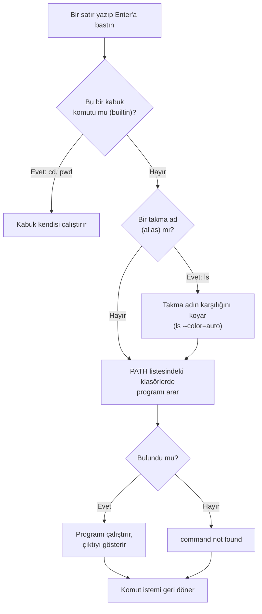
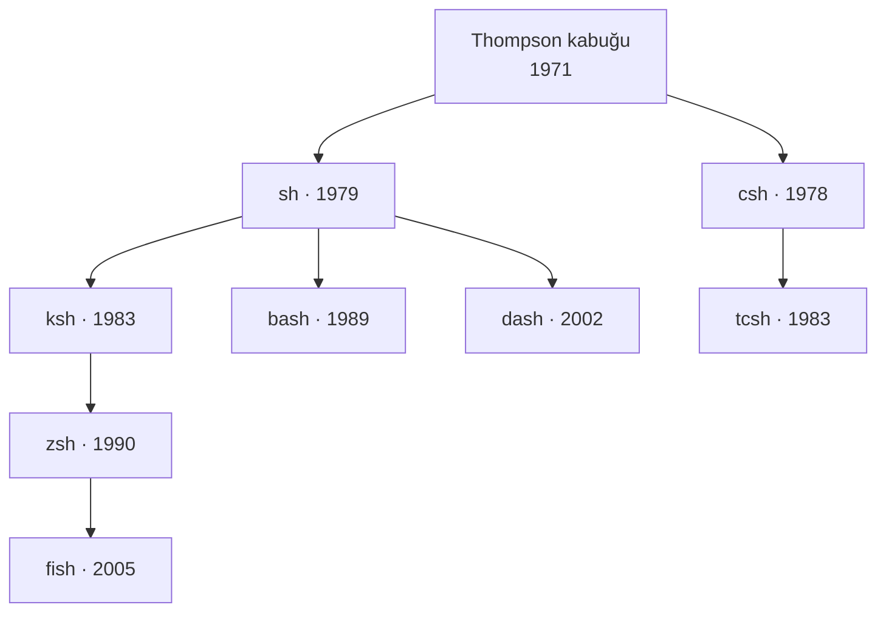
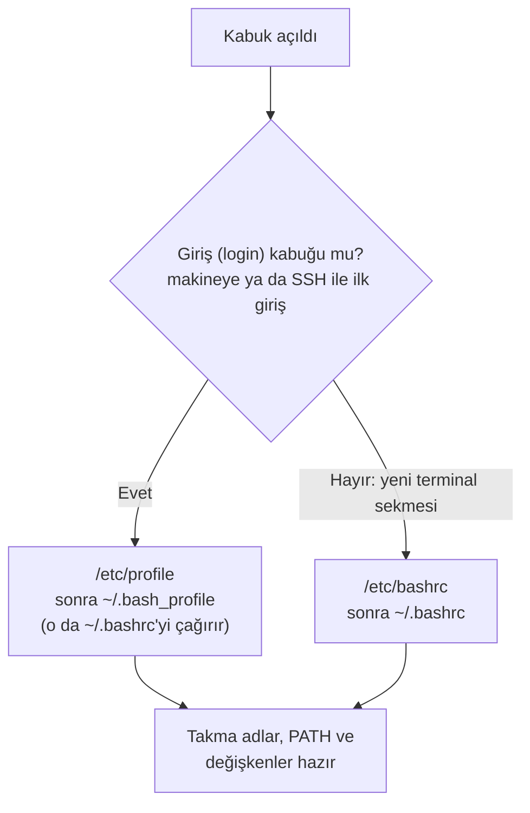

import Callout from '../../components/Callout.astro';
import Steps from '../../components/Steps.astro';
import Figure from '../../components/Figure.astro';
import promptImg from '../../assets/terminal-01-prompt.webp';
import lsImg from '../../assets/terminal-02-ls.webp';
import cdImg from '../../assets/terminal-03-cd.webp';
import manImg from '../../assets/terminal-04-man.webp';
import tabImg from '../../assets/terminal-05-tab.webp';
import helpImg from '../../assets/terminal-06-help.webp';
import historyImg from '../../assets/terminal-07-history.webp';
import gunlukImg from '../../assets/terminal-08-gunluk.webp';
import pathImg from '../../assets/terminal-09-path.webp';
import shellsImg from '../../assets/terminal-10-shells.webp';
import topImg from '../../assets/terminal-11-top.webp';
import bashrcImg from '../../assets/terminal-12-bashrc.webp';
import aliasImg from '../../assets/terminal-13-alias.webp';
import scriptImg from '../../assets/terminal-14-script.webp';
import pathPermImg from '../../assets/terminal-15-path.webp';
import readImg from '../../assets/terminal-17-read.webp';
import yedekImg from '../../assets/terminal-16-yedek.webp';
import nanoImg from '../../assets/terminal-18-nano.webp';
import vimImg from '../../assets/terminal-19-vim.webp';
import degiskenImg from '../../assets/terminal-20-degiskenler.webp';

[İkinci bölümde](/blog/rhel-kurulumu) RHEL'i kurduk; kurulumun sonunda masaüstü açıldı, dock'tan terminali
bir an açıp birkaç komut yazmıştık. Bugün o pencereye geri dönüyoruz, ama bu sefer misafir olarak değil.
Serinin geri kalanı burada geçecek: dosyalar, kullanıcılar, paketler, servisler, ağ... hepsini bu siyah-beyaz
pencereden yöneteceğiz. O yüzden önce burada rahat etmen gerekiyor.

Korkma, terminal göründüğü kadar ürkütücü değil. [Algoritmalar serisinde](/blog/algoritma-nedir) kâğıt üstünde
adım adım çay demlemiştik ya; terminal de tam olarak öyle çalışır: bir komut yazarsın, Enter'a basarsın, o
çalışır, sonucu gösterir ve sana tekrar döner. Sıra sıra, sabırlı, aptal ama hızlı. Hadi tanışalım.

<Callout type="note" title="Bu bölüm için gerekenler">
- Bölüm 2'de kurduğun RHEL makinesi (sanal ya da gerçek fark etmez). Açık ve giriş yapmış ol.
- Terminali aç: dock'taki siyah simge, ya da Activities'e "terminal" yazıp Enter. RHEL 10'da adı **Ptyxis.**
- Bu bölümü **okuyup aynısını makinende yaz.** Komutların hepsi zararsız; sadece bakar, hiçbir şeyi bozmaz.
- Kalem kâğıt şart değil ama sondaki sorular için yine iyi olur.
</Callout>

<Callout type="tip" title="Ekran görüntüleri hakkında">
Bu yazıdaki bütün terminal ekranlarını, Bölüm 2'de kurduğum RHEL 10.2 makinesinde gerçekten çalıştırıp çektim.
Sen de aynılarını yazınca aynı çıktıları göreceksin; ufak farklar (tarih, dosya listesi) normal.
</Callout>

## Terminal, kabuk, komut istemi: kim kimdir?

Üç kelime hep birlikte anılır ve başta karışır. Bir bankonun önünde sıraya girdiğini düşün:

- **Terminal**, önünde durduğun **gişe penceresidir;** komutu içeri yazdığın, cevabı içinden okuduğun kutu.
  RHEL 10'da bu pencerenin adı Ptyxis; başka sistemlerde GNOME Terminali, Konsole, iTerm olabilir. Hepsi aynı
  işi görür.
- **Kabuk (shell)**, gişenin arkasındaki **görevlidir;** senin yazdığın komutu anlayan, işletim sistemine
  ileten ve cevabı sana geri veren program. RHEL'in görevlisinin adı **bash.**
- **Komut istemi (prompt)**, görevlinin sana bakıp **"buyur, yaz"** demesidir. Ekranda yanıp sönen imlecin
  solundaki o satır.

Yani terminal kabın kendisi, kabuk içindeki akıl, komut istemi de "seni dinliyorum" işareti. Bundan sonra
"terminali aç" dediğimde bu üçlüyü birden kastediyor olacağım.

### Komut istemini okumak

Terminali açtığında seni şöyle bir satır karşılar. Görünüşte karmaşık ama her parçası bir şey söylüyor:

<Figure src={promptImg} alt="RHEL 10.2 terminalinde whoami, hostname ve pwd komutları ve çıktıları" caption="Komut istemi mehmet@rhel-lab:~$ satırı. whoami kullanıcıyı, hostname makine adını, pwd bulunduğun dizini söylüyor." />

`mehmet@rhel-lab:~$` satırını soldan sağa okuyalım:

- **`mehmet`** giriş yapmış kullanıcının adı. `whoami` komutu da tam bunu söyler.
- **`@`** "şurada" demek; araya giren küçük bir ayraç.
- **`rhel-lab`** makinenin adı, yani Bölüm 2'de verdiğin **hostname.** `hostname` komutu bunu doğrular.
- **`:`** ayraçtan sonra gelen kısım nerede olduğunu gösterir.
- **`~`** o an içinde bulunduğun dizin. Buradaki `~` işareti **ev dizininin** kısaltmasıdır; senin evin
  `/home/mehmet`. `pwd` komutu (print working directory, "çalışılan dizini yaz") tam yolu açıkça gösteriyor.
- **`$`** komut isteminin bittiği, senin yazmaya başlayabileceğin yer. Bu işaret **normal kullanıcı**
  olduğunu söyler.

<Callout type="important" title="$ ve # farkı: küçük işaret, büyük anlam">
Sondaki işaret normal kullanıcıda **`$`,** root (yönetici) kullanıcıda **`#`** olur. Bu yüzden internette bir
komutun başında `#` görürsen "bunu yönetici yetkisiyle çalıştır" demektir; `$` ise "sıradan kullanıcı yeter".
Bölüm 2'de root hesabını kapalı bırakıp kendine yönetici yetkisi vermiştik, hatırladın mı? O yüzden biz
gerektiğinde `sudo` kullanacağız, ama komut istemimiz hep `$` kalacak.
</Callout>

## İlk komutlar: neredeyim, ne var, nasıl gezerim?

Yeni bir yere taşındığında ilk üç soru şudur: buranın neresi, içinde ne var, nasıl dolaşırım. Terminalde bu üç
sorunun üç komutu var: `pwd`, `ls`, `cd`.

### ls: burada ne var?

`ls` (list, "listele") bulunduğun dizindeki dosya ve klasörleri gösterir. Tek başına sade bir liste verir;
yanına eklediğin harfler onu daha konuşkan yapar.

<Figure src={lsImg} alt="RHEL 10.2 terminalinde ls, ls -l ve ls -a komutlarının çıktıları" caption="ls sade liste verir. ls -l ayrıntılı: izinler, sahip, boyut, tarih. ls -a gizli dosyaları da (nokta ile başlayanlar, . ve ..) gösterir." />

Üç biçimi de ekranda görüyorsun:

- **`ls`** yalın liste: `liste.txt  merhaba.txt  notlar`. Renkli olanlar (klasörler mavi) türü ele verir.
- **`ls -l`** "uzun" (long) biçim. Her satırda bir dosyanın kimlik kartı var:
  `-rw-r--r--. 1 mehmet mehmet 20 Sep 13 22:00 liste.txt`. Soldan sağa: tür ve izinler, bağlantı sayısı,
  sahibi, grubu, boyutu (bayt), son değişiklik tarihi ve adı. İzinlerin ne anlama geldiğini
  [6. bölümde](/red-hat) uzun uzun konuşacağız; şimdilik "her dosyanın bir sahibi ve izinleri var" yeter.
- **`ls -a`** "hepsi" (all) demek: adı **nokta ile başlayan gizli dosyaları** da gösterir. Baştaki `.` içinde
  bulunduğun dizini, `..` bir üst dizini temsil eder; bunları birazdan `cd` ile kullanacağız.

`-l` ve `-a`'yı birleştirip `ls -la` da yazabilirsin; ikisini birden yapar. Bu küçük harflere **seçenek**
(option) denir; birazdan yapılarına bakacağız.

### cd ve pwd: gezinmek

`cd` (change directory, "dizin değiştir") seni bir yerden başka bir yere taşır. `pwd` de her adımda "şimdi
neredeyim" diye kontrol etmeni sağlar. İkisini birlikte kullanınca dizin ağacında yürümek çok kolaylaşır.

<Figure src={cdImg} alt="RHEL 10.2 terminalinde cd ve pwd ile dizinler arasında gezinme" caption="Dikkat: komut istemindeki yol her cd'den sonra değişiyor. Göreli yollarla (notlar, ..) ve mutlak yollarla (/, ~) gezindik; her adımda pwd tam yeri söylüyor." />

Ekrandaki yolculuğu birlikte izleyelim; komut isteminin kendisinin de değiştiğine dikkat et:

<Steps>
1. `cd ~/terminal-dersi` ile çalışma klasörümüze girdik; istem `~/terminal-dersi` oldu.
2. `cd notlar` alt klasöre indi. **`notlar`** bir **göreli yoldur:** "bulunduğum yerin içindeki notlar".
3. `cd ..` bir üst dizine çıkardı. **`..`** her zaman "bir yukarı" demektir.
4. `cd /` bizi **kök dizine** götürdü; `/` bütün ağacın tepesi, Bölüm 1'de "her şey `/` altında" demiştik.
5. `cd ~` eve döndürdü: `/home/mehmet`. `cd` tek başına da aynısını yapar.
</Steps>

<Callout type="important" title="Mutlak yol mu, göreli yol mu?">
İki tür adres var. **Mutlak yol** kök dizinden (`/`) başlar ve nerede olursan ol aynı yeri gösterir:
`/home/mehmet/terminal-dersi`. **Göreli yol** ise bulunduğun yere göredir: `notlar`, `../Resimler`. Benzetmeyle,
mutlak yol tam posta adresi, göreli yol "şu köşeden sağa" demektir. İkisinden birine hep başvuracaksın; hangisinde
olduğunu şaşırırsan `pwd` sana söyler. İki kısayolu unutma: **`~`** her zaman ev dizinin, **`cd -`** de bir önce
bulunduğun dizindir (odalar arası "geri" düğmesi gibi).
</Callout>

## Komutun yapısı: komut + seçenek + argüman

Şimdiye kadar yazdıklarımızın hepsi aynı kalıba uyuyordu. Bir komut satırı üç parçadan oluşur:

```text title="Bir komutun anatomisi" showLineNumbers=false
ls   -l   /etc
│    │    │
│    │    └─ argüman: komutun üzerinde çalışacağı şey (hangi dizin?)
│    └────── seçenek: davranışı değiştiren ayar (-l = uzun biçim)
└─────────── komut: çalıştırılacak program (ls)
```

- **Komut** ne yapılacağını söyler: `ls`, `cd`, `pwd`.
- **Seçenek** (option/flag) nasıl yapılacağını ayarlar. İki yazımı vardır: kısa (`-l`, `-a`) ve uzun
  (`--all`, `--help`). Kısa olanları birleştirebilirsin: `ls -la` = `ls -l -a`.
- **Argüman** neyin üzerinde çalışılacağını söyler: `ls /etc` "etc dizinini listele" demek. Argüman vermezsen
  komut çoğu zaman bulunduğun dizini varsayar.

Bu kalıbı bir kez oturttun mu, tanımadığın her komutu da okuyabilirsin. `komut -seçenekler argümanlar`; hepsi
bu. [Java yazısında](/blog/jdk-kurulumu) `javac Merhaba.java` yazarken de aynı kalıptaydık: komut `javac`,
argüman `Merhaba.java`.

## Takılınca yardım: man ve --help

Kimse bütün komutları ezbere bilmez; deneyimli bir sysadmin bile günde onlarca kez yardıma bakar. İki yolu var
ve ikisi de internet olmadan, her makinede çalışır.

### man: kılavuz sayfaları

`man` (manual, "el kitabı") bir komutun tam kılavuzunu açar. `man ls` yaz ve gör:

<Figure src={manImg} alt="RHEL 10.2 terminalinde man ls kılavuz sayfası" caption="man ls: ls komutunun resmî kılavuzu. NAME, SYNOPSIS, DESCRIPTION bölümleri ve bütün seçeneklerin açıklaması. Altta 'press h for help or q to quit' yazıyor." />

Kılavuz tam ekranı kaplar ve bir **sayfalayıcı** (pager) içinde açılır. Gezinmesi kolay:

- **Boşluk** ya da **ok tuşları** ile aşağı yukarı kayarsın.
- **`/kelime`** yazıp Enter'a basınca o kelimeyi arar (`n` ile sonraki eşleşme).
- **`q`** ile çıkarsın. (Kılavuzdan çıkamayıp panikleyen herkesin cevabı: `q`.)
- **`h`** yardım verir.

Kılavuzun başındaki `LS(1)` yazısındaki **1** bir bölüm numarasıdır: 1 = kullanıcı komutları. Aynı adın hem
komut hem ayar dosyası olduğu durumlarda bu numara işe yarar, ama şimdilik takılma.

### --help: hızlı özet

Kılavuzun tamamı bazen fazla gelir; sadece "hangi seçenek vardı" diye bakacaksan `--help` daha hızlıdır. Komutun
seçeneklerini kısa kısa ekrana basar:

<Figure src={helpImg} alt="RHEL 10.2 terminalinde ls --help komutunun çıktısının başı" caption="ls --help: kullanım biçimi ve seçeneklerin özeti. Çıktı uzun olduğu için başını head -18 ile kestim; man'in cep boyu hâli gibi." />

<Callout type="tip" title="Cebine koy: takılınca ne yapmalı">
Bir komutu unuttuysan ya da bir seçenek arıyorsan sırayla: önce **`komut --help`** (hızlı özet), yetmezse
**`man komut`** (tam kılavuz). Bir komutun adını bile hatırlamıyorsan **`apropos anahtar`** ilgili komutları
arar. Bunlar bir yazılımcının en çok kullandığı üç alışkanlıktır; ezberlemek değil, bakmayı bilmek önemli.
</Callout>

## Az yazıp çok iş: Tab ve geçmiş

Terminali sevmenin sırrı az yazmaktır. İki özellik parmaklarını dinlendirir ve hatalarını önler.

### Tab: otomatik tamamlama

Bir komutun ya da dosya adının başını yaz, **Tab** tuşuna bas; kabuk gerisini kendisi tamamlar.

<Figure src={tabImg} alt="RHEL 10.2 terminalinde Tab ile otomatik tamamlama: cd ~/ter yazıp Tab'a basınca cd ~/terminal-dersi/ oluyor" caption="cd ~/ter yazıp Tab'a bastım; kabuk gerisini ~/terminal-dersi/ diye tamamladı. Uzun adları asla elle yazma, Tab'lat." />

Tek olasılık varsa hemen tamamlar. Birden fazla varsa (mesela `Do` yazınca hem `Documents` hem `Downloads`)
**iki kez Tab'a** basınca hepsini listeler; sen birkaç harf daha ekleyip tekrar Tab'a basarsın. Tab hem zaman
kazandırır hem de yazım hatası yüzünden çıkan "no such file" hatalarının çoğunu daha baştan önler. Yeni
başlayanın ilk edinmesi gereken alışkanlık budur.

### Geçmiş: aynı komutu tekrar yazma

Kabuk yazdığın her komutu hatırlar. **Yukarı ok** ile bir önceki komutlara dönersin; Enter'a basınca yeniden
çalışır. Bütün geçmişi görmek için `history`:

<Figure src={historyImg} alt="RHEL 10.2 terminalinde history komutunun çıktısı: numaralı komut geçmişi" caption="history yazdığım bütün komutları numaralı biçimde tutuyor. Yukarı ok son komutu geri getirir; Ctrl+R ise geçmişte arama yapar." />

- **Yukarı/aşağı ok:** önceki komutlar arasında gezinir.
- **`history`:** numaralı tam liste. `!149` yazarsan 149 numaralı komutu tekrar çalıştırır.
- **`Ctrl+R`:** geçmişte arama. Bir kelime yazmaya başla, kabuk o kelimeyi içeren son komutu bulur.
- **`!!`:** en son komutu tekrar çalıştırır (özellikle `sudo !!` "az önceki komutu bir de yönetici olarak
  çalıştır" için çok kullanılır).

<Callout type="tip" title="İki hayat kurtaran kısayol">
**`Ctrl+C`** çalışan bir komutu durdurur; bir şey takıldıysa ya da yanlış komut yazdıysan kurtarıcın odur.
**`Ctrl+L`** (ya da `clear` komutu) ekranı temizler, ama geçmişi silmez. Bir de **`Tab Tab`**, **yukarı ok** ve
**`Ctrl+R`** üçlüsü; bu beşini kaslarına yerleştirdiğinde terminal artık yormaz.
</Callout>

## Birkaç faydalı komut daha

Gezinmeyi ve yardım almayı öğrendik. Cebe birkaç küçük komut daha atalım; hepsi zararsız, hepsi sık işine yarar.

<Figure src={gunlukImg} alt="RHEL 10.2 terminalinde echo, date ve uname -r komutları" caption="echo ekrana yazı basar, date tarih ve saati verir, uname -r çekirdek sürümünü söyler: 6.12.0-211.51.1.el10_2, Bölüm 2'de okuduğumuz numara." />

- **`echo`** kendisine verdiğin metni ekrana basar: `echo Merhaba, terminal`. Basit görünür ama ilerideki
  bölümlerde değişkenleri ve betikleri yazarken belkemiği olacak. [Sözde koddaki](/blog/sozde-kod) `YAZ`
  komutunun terminaldeki karşılığı budur.
- **`date`** o anki tarih ve saati yazar: `Sun Sep 13 10:03:00 PM +03 2026`. Sondaki `+03` saat dilimimiz;
  Bölüm 2'de saat ayarını konuşurken bu offset'i görmüştük.
- **`uname -r`** çalışan çekirdeğin sürümünü söyler: `6.12.0-211.51.1.el10_2.x86_64`. Bu numarayı Bölüm 2'de
  didik didik etmiştik; RHEL 10'un 6.12 çekirdeği, işte kendi gözünle.
- **`cat dosya`** bir metin dosyasının içeriğini ekrana döker (küçük dosyalar için); büyük dosyalar için
  `less dosya` sayfa sayfa gösterir (man gibi, `q` ile çıkılır).

## Kara ekran aslında koca bir dünya

Bir saniye durup şuna bakalım. [Bölüm 2'de](/blog/rhel-kurulumu) "Server" ya da "Minimal" kurulumu seçersen
masaüstü hiç gelmez, karşına yalnızca bu siyah ekran çıkar demiştik. Bu bir eksiklik değil. Grafik arayüzler
(fare, pencereler, simgeler) bilgisayar tarihine **sonradan** geldi; 1970'lerde ve 80'lerde bütün bilgisayarlar
tam olarak böyle, yazıyla yönetiliyordu. Yani terminal, grafik arayüzün kırpılmış bir hâli değil; tersine, grafik
arayüz terminalin üstüne yıllar sonra eklenen bir katman. Dünyadaki sunucuların ezici çoğunluğu bugün de
masaüstsüz, yalnızca bu ekranla çalışıyor.

Ve bu kara ekran, sandığından çok daha fazlasını yapar. Yazıyla, tıpkı grafik programlar gibi menüleri,
panelleri, renkleri, hatta fareyi kullanan **tam ekran** programlar vardır; bunlara **TUI** denir (Text User
Interface, metin tabanlı kullanıcı arayüzü). İşte terminalin içinde çalışan, tam ekran çizen bir program: `top`,
sistemdeki süreçleri canlı canlı gösteren bir izleyici.

<Figure src={topImg} alt="RHEL 10.2 terminalinde top komutu: tam ekran, canlı süreç izleyici" caption="top bir 'komut ve çıktı' değil; canlı güncellenen, sütunları, başlığı ve renkleri olan tam ekran bir arayüz, üstelik hepsi metinden. q ile çıkılır." />

Gördüğün gibi bu, alışık olduğumuz "komut yaz, çıktı gör" değil; canlı güncellenen, başlığı ve sütunları olan bir
arayüz, hepsi metinden çizilmiş. Ve `top` tek örnek değil; terminalin içinde koca bir uygulama dünyası var:

- **Metin düzenleyiciler:** `vim`, `nano`, `emacs` ve modern, Rust'la yazılmış `helix`. Kod da yazarsın, ayar
  dosyası da; hepsi terminalde.
- **Sistem izleyiciler:** `top`, `htop` ve Rust'la yazılmış `bottom` (btm), `btop`.
- **Dosya yöneticileri:** klasik `mc` (Midnight Commander), Rust'la yazılmış `yazi`.
- **Günlük araçların modern hâlleri (çoğu Rust'la):** `bat` (renkli `cat`), `eza` (modern `ls`), `ripgrep` (çok
  hızlı arama), `fd` (kolay `find`), `zoxide` (akıllı `cd`), `starship` (şık komut istemi), `atuin` (gelişmiş
  geçmiş).
- **Bütün uygulamalar:** `tmux` (ekranı bölen pencere yöneticisi, Bölüm 2'de kurmuştuk), `lazygit` ve `gitui`
  (Git arayüzü), e-posta istemcileri, müzik çalarlar, hatta oyunlar.

Son yıllarda bu araçların pek çoğunun **Rust** diliyle yeniden yazılması bir tesadüf değil, bir dirilişin işareti:
kara ekran ölmedi, tam tersine hızlı, güvenli ve güzel araçlarla yeniden canlanıyor. Bunların çoğu **ratatui**
denen bir Rust kütüphanesinin üstüne kuruludur. Yani "terminal eski teknoloji" diye düşünme; bugün en yeni araçlar
bile burada, bu kara ekranda doğuyor.

<Callout type="note" title="Peki grafik arayüz varken neden terminal?">
Haklı bir soru. Terminal üç şeyde yenilmez. **Hız:** elini fareye götürüp menü aramadan, tek satırla iş biter.
**Uzaktan çalışma:** bir sunucuya dünyanın öbür ucundan bağlanıp yönetirsin; grafik arayüz oraya taşınamaz ama
terminal taşınır ([Bölüm 10'da](/red-hat) SSH ile göreceğiz). **Otomasyon:** yaptığın işi bir dosyaya yazıp bin
kez, bin makinede tekrarlatırsın; grafik arayüzde her tıklamayı elle yaparsın. Bir sistem yöneticisinin asıl
gücü işte buradan gelir.
</Callout>

## Perde arkası: bir komut çalıştırınca ne oluyor?

`ls` yazıp Enter'a bastığında kabuk aslında birkaç adımlık bir iş yapıyor. Bunu bir kere anlarsan "command not
found" gibi hatalar da, terminalin mantığı da yerine oturur.



Bu zincirdeki en kritik durak **PATH.** Terminale bir komut yazdığında kabuk onu her yerde aramaz; **PATH** adlı,
iki nokta üst üste ile ayrılmış bir klasör listesine sırayla bakar. İşte kendi makinemdeki liste ve bir komutun
gerçekte ne olduğunu söyleyen `type`:

<Figure src={pathImg} alt="RHEL 10.2 terminalinde echo $PATH, type pwd, type ls ve which java çıktıları" caption="echo $PATH komutun arandığı klasör listesini gösteriyor. type pwd 'shell builtin' der, type ls bir takma ad çıkar, which java ise /usr/bin/java yolunu verir." />

Çıktıları okuyalım:

- **`echo $PATH`** o listeyi basar:
  `/home/mehmet/.local/bin:/home/mehmet/bin:/usr/local/bin:/usr/local/sbin:/usr/bin:/usr/sbin:...`. Kabuk `ls`
  ararken bu klasörlere sırayla bakıp `/usr/bin/ls`'i bulur. Bu **tam olarak** [Java'nın JDK kurulumu
  yazısında](/blog/jdk-kurulumu) gördüğümüz PATH'tir; orada `javac`'ın bulunması için JDK klasörü bu listeye
  ekleniyordu. Bugün onu terminalin gözünden görüyoruz.
- **`type pwd`** → `pwd is a shell builtin`: `pwd` diskte bir program değil, doğrudan kabuğun içine gömülü.
  `cd` de öyle; zaten öyle olmak zorunda, çünkü bulunduğun dizini kabuğun kendisi tutar.
- **`type ls`** → `ls is aliased to 'ls --color=auto'`: `ls` bir **takma addır** (alias). RHEL, çıktıyı
  renklendirsin diye onu kısayola bağlamış. O yüzden klasörler mavi görünüyordu.
- **`which java`** → `/usr/bin/java`: `which` bir komutun PATH'te hangi klasörde bulunduğunu söyler. Java'yı
  Bölüm... pardon, [Java serisinde](/blog/java-nedir) kurmuştuk; işte kanıtı, gerçekten orada.

Demek ki terminalde yazdığın her şey aynı türden değil: kimi kabuğun içinden (`builtin`), kimi bir kısayoldan
(`alias`), kimi de diskteki gerçek bir programdan (PATH) gelir. Bu üçlüyü ayırt etmek, ileride kafa karıştıran
pek çok durumu baştan çözer.

### PATH'i biraz daha deşelim

PATH o kadar merkezî ki bir adım daha derine inelim; "command not found" hatalarının ve ileride kuracağın
araçların çoğu buraya bakar.

- **Sıra önemlidir.** Kabuk listeyi soldan sağa tarar ve **ilk bulduğunu** çalıştırır. Aynı isimde iki program
  varsa PATH'te önce gelen kazanır. [Java yazısında](/blog/jdk-kurulumu) "kurdum ama hâlâ eski sürüm çıkıyor"
  derdinin sebebi buydu: eski sürüm listede daha öndeydi.
- **Yeni klasör eklemek.** Kendi programlarını `~/.local/bin` içine koyarsan ekstra bir şey yapmana gerek yok;
  RHEL o klasörü zaten PATH'e ekliyor (birazdan `.bashrc`'de göreceğiz). Başka bir klasör eklemek istersen:
  `export PATH="$HOME/araclar:$PATH"`. Başa koyarsan öncelik senindir; sona koyarsan (`$PATH:...`) sistemin
  komutlarını ezmezsin.
- **Geçici mi, kalıcı mı?** `export PATH=...` yalnızca **o terminal** için geçerlidir; pencereyi kapatınca
  gider. Kalıcı olması için bir başlangıç dosyasına (`~/.bashrc`) yazman gerekir; bir sonraki bölümün konusu tam
  bu.
- **Neden `.` (bulunduğun dizin) PATH'te değil?** Güvenlik. Bulunduğun dizin PATH'te olsaydı, birinin sana
  gönderdiği bir klasörde `ls` adında zararlı bir dosya olsa, `ls` yazınca sistem gerçek `ls`'i değil onu
  çalıştırabilirdi. O yüzden kendi dizinindeki bir betiği çalıştırmak için başına `./` koyarsın: `./selamla.sh`.
  Bu, "gerçekten buradakini çalıştır" demektir.

## Kabuk çeşitleri: bash, zsh, fish ve ailesi

Baştan beri "kabuk bash'tir" deyip geçtik. Ama kabuk aslında **değiştirilebilir** bir parçadır ve bir sürü çeşidi
vardır. Önce şunu netleştirelim: kabuk iki işi birden yapan bir programdır. Bir yandan **komut yorumlayıcıdır**
(sen yazarsın, o çalıştırır); öte yandan küçük bir **programlama dilidir** — değişkenleri, koşulları, döngüleri
vardır; bir dosyaya komut dizisi yazıp **betik** (script) olarak çalıştırabilirsin. Bu yüzden kabuğu değiştirmek,
sadece istemin görüntüsünü değil, dilin kurallarını da değiştirir.

Kendi makinende hangi kabukların kurulu olduğunu `/etc/shells` dosyası söyler; hatta başka bir kabuğa geçip geri
dönebilirsin:

<Figure src={shellsImg} alt="RHEL 10.2 terminalinde bash --version, cat /etc/shells, zsh --version ve zsh'ye geçiş" caption="bash 5.2, /etc/shells kurulu kabukları listeliyor (zsh'yi az önce kurdum). zsh -f ile zsh'ye geçince istem $'dan %'ye döndü; exit ile bash'e döndüm. Kabuğu değiştirmek bu kadar kolay." />

Ekranda gördüğün gibi: `bash --version` sürümü verdi, `/etc/shells` kurulu kabukları listeledi, `zsh -f` ile
zsh'ye geçtim (dikkat, istem **`$`'dan `%`'ye** döndü) ve `exit` ile bash'e geri döndüm. Peki bu çeşitler nereden
çıktı? Kısa bir aile ağacı:



Tek tek tanıyalım:

- **sh (Bourne shell), 1979.** Stephen Bourne'un Bell Laboratuvarları'nda yazdığı ata kabuk. Etkileşimde sadeydi
  ama betik yazmanın temelini o attı; bugün hâlâ betiklerin başında `#!/bin/sh` görürsün. Modern sistemlerde
  `/bin/sh` çoğu zaman daha küçük bir akrabaya (dash) bağlıdır.
- **csh / tcsh, 1978–1983.** [Bölüm 1'de](/blog/red-hat-nedir) adı geçen Bill Joy (BSD'nin ve sonradan Sun'ın
  kurucularından) C diline benzeyen bir söz dizimiyle yazdı; geçmiş ve takma ad gibi etkileşim kolaylıklarını ilk
  getirenlerdendi. tcsh onu tamamlama ekleyerek geliştirdi. Betik tarafı sorunlu olduğu için bugün az kullanılır.
- **ksh (Korn shell), 1983.** David Korn, sh'nin betik gücüyle csh'nin etkileşim rahatlığını birleştirdi. Uzun
  yıllar ticari Unix'lerin standardıydı.
- **bash (Bourne Again Shell), 1989.** Brian Fox, GNU projesi ([Bölüm 1'deki](/blog/red-hat-nedir) Stallman'ın
  projesi) için yazdı. Adı bir kelime oyunu: **B**ourne **A**gain **SH**ell, hem "Bourne'un yeniden doğuşu" hem
  de İngilizce "born again". sh ile uyumludur ama üstüne geçmiş, Tab tamamlama, iş kontrolü ve çok daha fazlasını
  ekler. Linux'un ve neredeyse bütün sunucuların varsayılanı; bu seride onu kullanıyoruz.
- **dash, 2002.** Çok küçük ve hızlı bir sh. Etkileşim için değil, betikleri hızlı çalıştırmak için tasarlandı;
  Debian ve Ubuntu'da `/bin/sh` odur. RHEL'de ayrı gelmez.
- **zsh (Z shell), 1990.** Paul Falstad'ın yazdığı, bash'e çok benzeyen ama etkileşimde onu geride bırakan kabuk:
  akıllı tamamlama, yazım düzeltme, güçlü eklenti sistemi (meşhur oh-my-zsh). Apple 2019'dan beri macOS'ta
  varsayılan olarak onu kullanıyor.
- **fish (friendly interactive shell), 2005.** Adı gibi, yeni başlayana en dostça olanı: kutudan çıktığı hâliyle
  sözdizimi renklendirme, sen yazarken beliren öneriler (autosuggestion) ve gerçekten iyi bir tamamlama sunar.
  Tek çelişkisi: söz dizimi bash/sh'den farklıdır, yani hazır bash betikleri fish'te doğrudan çalışmaz.

Aralarındaki en önemli çizgi şu: **POSIX uyumu.** sh, bash, ksh, zsh ve dash aynı temel söz dizimini paylaşır
(POSIX standardı); birinde yazdığın betik büyük ölçüde ötekinde de çalışır. fish ve csh bu ailenin dışındadır;
daha rahattırlar ama taşınabilir değildirler.

| Kabuk | Yıl | Yazar | Öne çıkan | POSIX | Nerede varsayılan |
| --- | --- | --- | --- | --- | --- |
| **bash** | 1989 | Brian Fox (GNU) | uyum, her yerde var | Evet | Linux, RHEL, çoğu sunucu |
| **zsh** | 1990 | Paul Falstad | eklenti, güçlü etkileşim | Evet | macOS (2019+) |
| **fish** | 2005 | Axel Liljencrantz | dostça, otomatik öneri | Hayır | — (elle seçilir) |
| **sh / dash** | 1979 / 2002 | Bourne / Almquist | betik; küçük ve hızlı | Evet | Debian/Ubuntu'da /bin/sh |
| **ksh** | 1983 | David Korn | sh gücü + etkileşim | Evet | bazı ticari Unix'ler |
| **tcsh** | 1983 | Ken Greer | C benzeri söz dizimi | Hayır | eski BSD sistemleri |

<Callout type="tip" title="Hangisini kullanmalıyım?">
Öğrenirken ve sunucularda **bash.** Karşına hep o çıkar, öğrendiğin her yerde geçerli. Kendi bilgisayarında
rahatlık istiyorsan **zsh** (macOS'taysan zaten varsayılan) ya da **fish** çok keyifli; renklendirme ve öneriler
işini kolaylaştırır. Ama şunu unutma: kişisel kabuğun ne olursa olsun, betik yazarken ve başkasının sunucusuna
bağlanırken **bash/sh bilmen gerekir.** Şu an hangi kabukta olduğunu `echo $SHELL` söyler; varsayılan kabuğunu
`chsh` komutuyla değiştirirsin (ama acele etme, önce bash'i sağlam öğren).
</Callout>

## Kabuğu kendine göre ayarlamak: .bashrc ve arkadaşları

Kabuk her açıldığında, sen daha bir şey yazmadan, birkaç **ayar dosyası** okur. Bu dosyalara takma adlarını,
ortam değişkenlerini ve PATH eklemelerini yazarsın; böylece her yeni terminalde hazır gelirler. Bash'te bu
dosyaların adı nokta ile başlar (yani gizlidir) ve çoğu `rc` ile biter; `rc` "run commands"tan gelir, 1960'lardan
kalma bir gelenek.

<Figure src={bashrcImg} alt="RHEL 10.2 terminalinde ev dizinindeki bash dosyaları ve varsayılan .bashrc içeriği" caption="Ev dizinindeki .bashrc, .bash_profile gibi ayar dosyaları ve RHEL'in varsayılan .bashrc'si: /etc/bashrc'yi çağırıyor, ~/.local/bin'i PATH'e ekliyor ve ~/.bashrc.d/ altındaki parçaları yüklüyor." />

Ekranda ev dizinindeki dosyaları ve RHEL'in varsayılan `.bashrc`'sini görüyorsun. Başlıca iki dosya var:

- **`.bashrc`** — her **etkileşimli** kabuk açılışında okunur (yeni bir terminal sekmesi açtığında). Takma
  adların ve günlük ayarların buraya yazılır.
- **`.bash_profile`** — yalnızca **giriş (login)** kabuğunda okunur (makineye ya da SSH ile ilk giriş). RHEL'de
  bu dosya zaten `.bashrc`'yi çağırır, o yüzden çoğu zaman sadece `.bashrc` ile ilgilenirsin.

RHEL'in varsayılan `.bashrc`'si üç iş yapıyor, üçü de tanıdık: sistem genelindeki `/etc/bashrc`'yi çağırıyor,
**`~/.local/bin`'i PATH'e ekliyor** (az önce konuştuğumuz PATH kalıcılığı tam burada oluyor) ve `~/.bashrc.d/`
klasöründeki parça ayarları yüklüyor.

Şimdi kendi ayarımızı ekleyelim. İki temel araç: **takma ad** ve **ortam değişkeni**.

<Figure src={aliasImg} alt="RHEL 10.2 terminalinde alias tanımlama, ortam değişkeni ve .bashrc'ye kalıcı ekleme" caption="alias ll='ls -l' kısayolu; export EDITOR=nano bir ortam değişkeni. Takma adı kalıcı yapmak için >> ile .bashrc'nin sonuna ekledim; tail -2 son satırları gösteriyor." />

- **Takma ad (alias):** uzun bir komuta kısa isim. `alias ll='ls -l'` yazınca artık `ll` yeter. Ama böyle
  tanımlanan takma ad **yalnızca o terminalde** yaşar. Kalıcı olması için `.bashrc`'ye eklersin:
  `echo "alias ll='ls -l'" >> ~/.bashrc`. Ekrandaki **`>>`** "dosyanın sonuna ekle" demek; tek **`>`** olsaydı
  dosyanın üstüne yazar, içindekini silerdi. Dikkat!
- **Ortam değişkeni (environment variable):** programların okuduğu ayarlar. `export EDITOR=nano` yazınca, sana
  editör soran programlar nano açar. `$PATH` de, [Java'daki](/blog/jdk-kurulumu) `$JAVA_HOME` de birer ortam
  değişkenidir; içine `echo $DEGISKEN` ile bakarsın.

Bir dosyayı değiştirdikten sonra ya yeni bir terminal açarsın ya da **`source ~/.bashrc`** ile o dosyayı yeniden
okutursun (`source` "bu dosyadaki komutları şimdi çalıştır" demek). Hangi dosyanın ne zaman okunduğu şöyle:



<Callout type="note" title="zsh ve fish'te karşılığı">
zsh'de aynı mantık, farklı isimler: **`.zshrc`** (bash'teki `.bashrc`'nin karşılığı, her etkileşimli kabuk),
**`.zprofile`** (giriş kabuğu) ve **`.zshenv`** (her zsh, en erken okunan). macOS'ta bu yüzden `.zshrc`
düzenlersin. fish ise bambaşka bir dosya kullanır: `~/.config/fish/config.fish`. [Java yazısında](/blog/jdk-kurulumu)
JAVA_HOME'u `.bashrc` ya da `.zshrc`'ye eklerken tam da bunu yapıyorduk: bir ayarı kalıcı kılmak.
</Callout>

## Kabuk programlama: ilk betiğin

Kabuğun küçük bir programlama dili olduğunu söylemiştik; şimdi kanıtlayalım. Bir **betik** (script), bir dosyaya
alt alta yazılmış komutlardan ibarettir; kabuk onları sırayla çalıştırır. [Algoritmalar serisinde](/blog/algoritma-nedir)
kâğıda döktüğün adımları hatırla; betik onların gerçek makinedeki karşılığı.

<Figure src={scriptImg} alt="RHEL 10.2 terminalinde selamla.sh betiğinin içeriği ve iki kez çalıştırılması" caption="selamla.sh: shebang, yorum, değişken, argüman ($1), koşul (if), komut yerine koyma ($(...)) ve döngü (for). Argümansız çalışınca 'dünya', ./selamla.sh Ada deyince 'Ada' selamlıyor." />

Ekrandaki `selamla.sh` betiğini satır satır okuyalım:

- **`#!/bin/bash`** — ilk satır, **shebang** denir: "bu dosyayı bash ile çalıştır" demek. Her betiğin en tepesinde
  olur.
- **`# ...`** — `#` ile başlayan satırlar **yorumdur;** kabuk onları çalıştırmaz, insan okusun diyedir.
- **`ad="$1"`** — bir **değişken.** [Değişkenler yazısındaki](/blog/degiskenler) posta kutusu: adı `ad`, içine
  değer koyuyoruz. `$1` betiğe dışarıdan verilen ilk **argümandır** (`./selamla.sh Ada` dersen `$1` = Ada).
  Dikkat: `=` işaretinin iki yanında **boşluk olmaz** (`ad = "..."` hata verir).
- **`if [ -z "$ad" ]; then ... fi`** — bir **koşul.** Sözde koddaki `EĞER ... İSE ... BİTİREĞER`'in bash hâli.
  `-z` "boş mu" demek: kullanıcı isim vermediyse `ad`'ı "dünya" yaparız. Değişkeni okurken başına `$` koyarız.
- **`echo "... $ad ..."`** — [Sözde koddaki](/blog/sozde-kod) `YAZ`. Çift tırnak içindeki `$ad` değerine
  dönüşür; `$(date +%A)` ise **komut yerine koymadır** (command substitution): parantez içindeki komutu çalıştırıp
  çıktısını oraya yapıştırır.
- **`for d in "$HOME"/*/; do ... done`** — bir **döngü.** Sözde koddaki `... İÇİN HER ... DÖNGÜ SONU`. Ev
  dizinindeki her klasör için sayacı bir artırır (`$(( ... ))` aritmetik yapar).

Betiği çalıştırmanın iki koşulu var. Önce dosyayı **çalıştırılabilir** yaparsın: `chmod +x selamla.sh` (bunu bir
kez yapman yeter). Sonra başına `./` koyup `./selamla.sh` dersin; hani PATH'te `.` yoktu ya, o yüzden `./` şart.
[İzinleri 6. bölümde](/red-hat) uzun uzun konuşacağız; şimdilik `+x` "bu dosya bir programdır, çalıştırılabilir"
demek yeter.

Peki betiği her yerden, `./` olmadan çalıştırmak istersen? İşte PATH tam burada devreye giriyor:

<Figure src={pathPermImg} alt="RHEL 10.2 terminalinde betiği ~/.local/bin'e kopyalayıp her dizinden çalıştırma" caption="Betiği ~/.local/bin'e kopyaladım (RHEL o klasörü PATH'e ekliyordu). Artık kök dizindeyken bile sadece 'selamla Mehmet' yazmak yetiyor; which selamla nerede bulunduğunu doğruluyor." />

Betiği `~/.local/bin` klasörüne kopyaladım (RHEL'in `.bashrc`'si orayı PATH'e ekliyordu, hatırla). Artık hangi
dizinde olursam olayım sadece `selamla` yazmam yeterli; kabuk onu PATH'te bulup çalıştırıyor. `which selamla` de
nerede bulduğunu doğruluyor. Kendi komutunu yazıp sisteme kazandırmak bu kadar basit.

Bu küçük betik bir başlangıç. Kabuk programlama, DevOps'un ve sistem yönetiminin **belkemiğidir;** sunucu kuran,
yedek alan, günlükleri tarayan, dağıtım yapan herkes gün boyu betik yazar. O yüzden temel yapı taşlarını biraz
daha yakından tanıyalım. Panikleme: hepsi [Algoritmalar serisinde](/blog/algoritma-nedir) kâğıtta gördüğün
kavramların bash yazımı.

### Betiği nerede yazarsın: nano, vim ve editörler

Şimdiye kadar betikleri hazır gösterdim; peki sen nasıl yazacaksın? Bir betik düz bir metin dosyasından ibarettir,
o yüzden herhangi bir **metin editörüyle** yazılır. Terminalden hiç çıkmadan, doğrudan kabukta açılan iki editör
vardır ve ikisi de her sunucuda bulunur.

**nano** yeni başlayanın editörüdür. `nano selamla.sh` yazınca dosya açılır ve hemen yazmaya başlarsın. Alttaki
`^` işareti Ctrl demektir: **Ctrl+O** kaydeder (write **O**ut), **Ctrl+X** çıkar, **Ctrl+W** arar. Kolay, sezgisel,
kılavuzu hep ekranın altında durur.

<Figure src={nanoImg} alt="RHEL 10.2 terminalinde nano editöründe selamla.sh dosyası" caption="nano selamla.sh: sözdizimi renklendirmeli editör; altta ^O Write Out (kaydet), ^X Exit (çık) gibi Ctrl kısayolları. Yeni başlayan için en kolayı." />

**vim** güçlü, hızlı ve her yerde bulunan editördür. `vim selamla.sh` ile açılır. Bir inceliği var: **kipli**
(modal) çalışır. Açıldığında **normal kip**tedir (tuşlar birer komuttur); yazmak için `i` ile **ekleme kipine**
geçer, bitince **Esc** ile normal kipe dönersin. `:w` kaydeder, `:q` çıkar (`:wq` ikisini birden, `:q!` kaydetmeden
çıkar). İlk başta kafa karıştırır ama alışınca çok hızlıdır; sunucularda çoğu zaman hazır bulacağın tek gelişmiş
editör odur.

<Figure src={vimImg} alt="RHEL 10.2 terminalinde vim editöründe selamla.sh dosyası" caption="vim selamla.sh: sözdizimi renklendirmesi, soldaki ~ işaretleri dosyanın bittiği boş satırlar, altta 'selamla.sh 14L, 296B' durum satırı. Güçlü ama kipli; tam anlatımı 5. bölümde." />

Panikleme: vim'i [5. bölümde](/red-hat) baştan sona, sabırla işleyeceğiz. Şimdilik bir betiği **nano ile açıp
yazıp kaydetmeyi** bilmen yeter. Grafik masaüstündeysen GNOME Metin Düzenleyici ya da VS Code gibi pencere tabanlı
bir editör de olur; betik sonuçta düz metindir, neyle yazdığın önemli değil. Hatta uzantı bile şart değil: `.sh`
bir alışkanlıktır, betiği "betik" yapan şey ilk satırdaki shebang'dir.

### Değişkenler: tanımlama, kurallar ve çeşitleri

Değişken, [Değişkenler yazısındaki](/blog/degiskenler) posta kutusudur: bir ad, içinde bir değer. Bash'te
tanımlaması çok basit ama birkaç katı kuralı var.

**Tanımlama ve kurallar:**

- Atama: `ad="Ada"`. **`=`'in iki yanında boşluk olmaz** (`ad = "Ada"` hata verir; en sık yapılan hata budur).
- Okuma: başına `$` koyarsın: `echo "$ad"`. Karışıklığı önlemek için süslü parantezli hâli daha güvenlidir:
  `${ad}` (mesela `${ad}lar` diye bitişik yazabilmek için).
- Ad kuralı: harf, rakam ve alt çizgi; **rakamla başlayamaz** ve **büyük/küçük harfe duyarlıdır** (`ad` ile `Ad`
  farklı değişkenlerdir).
- Silme: `unset ad` değişkeni yok eder.

**Tırnaklar (en sık tuzak):**

- **Çift tırnak `"..."`:** içindeki `$degisken` değerine dönüşür. Değişkenleri **her zaman çift tırnakla** kullan:
  `"$dosya"`. Yoksa değerin içinde boşluk varsa bash onu parçalara böler ("word splitting") ve işler karışır.
- **Tek tırnak `'...'`:** hiçbir şeye dokunmaz, içinde ne varsa aynen basar. `echo '$ad'` → ekrana `$ad` yazar.
- **Tırnaksız:** hem genişler hem bölünür; genelde istemezsin, o yüzden alışkanlık olarak hep tırnak kullan.

**Değer üretmenin yolları:**

- **`$(...)` komut yerine koyma:** parantez içindeki komutu çalıştırıp çıktısını koyar: `bugun=$(date +%F)`.
- **`$(( ... ))` aritmetik:** `toplam=$((2 + 3))` → 5.

Bash'te bir değişken **varsayılan olarak metindir** (ayrı bir tür bildirimi yoktur); `yas=40` bile aslında "40"
metnidir. Ama pratikte birkaç **çeşidi** ayırt ederiz:

<Figure src={degiskenImg} alt="RHEL 10.2 terminalinde değişken çeşitlerini gösteren degiskenler.sh betiği ve çıktısı" caption="degiskenler.sh: metin (string), declare -i ile tam sayı (40+2=42), dizi (array), readonly sabit, ve $0/$#/$1/$USER/$HOME özel ve ortam değişkenleri; hepsi tek betikte." />

- **Metin (string):** en yaygını. `ad="Ada"`.
- **Tam sayı:** `declare -i sayi=40` dersen bash o değişkeni sayı gibi görür; `sayi=sayi+2` doğrudan 42 olur.
- **Dizi (array):** birden çok değeri bir arada tutar. `renkler=(kırmızı yeşil mavi)`; ilkine `${renkler[0]}`,
  hepsine `${renkler[@]}`, adedine `${#renkler[@]}` ile ulaşırsın. Anahtar-değer tutan ilişkisel dizi için
  `declare -A`.
- **Sabit (readonly):** `readonly PI=3.14` dersen bir daha değiştirilemez; değiştirmeye kalkarsan hata verir.
  Sabitleri geleneksel olarak BÜYÜK harfle yazarız.

Bir de sen tanımlamadan, kabuğun sana hazır verdiği **özel değişkenler** vardır:

| Değişken | Anlamı |
| --- | --- |
| `$0` | betiğin adı |
| `$1`, `$2` ... | betiğe verilen argümanlar (1., 2. ...) |
| `$#` | argüman sayısı |
| `$@` | argümanların tümü |
| `$?` | son komutun çıkış kodu |
| `$$` | çalışan sürecin numarası (PID) |
| `$USER` `$HOME` `$PWD` | kullanıcı, ev dizini, bulunduğun dizin (ortam değişkenleri) |

Ekrandaki `degiskenler.sh` bunların çoğunu bir arada gösteriyor: metin ve uzunluğu, `declare -i` ile sayı, dizi,
`readonly` sabit, `$0`/`$#`/`$1` özel değişkenleri ve `$USER`/`$HOME` ortam değişkenleri.

**Kapsam: kabuk değişkeni mi, ortam değişkeni mi?** Sıradan bir değişken yalnızca onu tanımlayan kabukta yaşar.
**`export`** ile onu bir **ortam değişkenine** çevirirsen, o kabuğun başlattığı programlar da onu görür:
`export EDITOR=nano`. [Java yazısındaki](/blog/jdk-kurulumu) `PATH` ve `JAVA_HOME` birer ortam değişkenidir; bu
yüzden `.bashrc`'de `export` ile tanımlanırlar.

**Metinle oynamak:** bash değişkenin içeriğini kesip biçebilir; bu genişlemeler sık işine yarar:

```bash title="Metin işlemleri" showLineNumbers=false
s="merhaba-dünya"
echo "${#s}"                # uzunluk: 13
echo "${s:0:7}"             # ilk 7 karakter: merhaba
echo "${s/dünya/terminal}"  # değiştir: merhaba-terminal
echo "${s^^}"               # BÜYÜK harf: MERHABA-DÜNYA
```

### Girdi almak: read

`read` kullanıcıdan girdi alıp bir değişkene koyar; betiği etkileşimli yapar.

<Figure src={readImg} alt="RHEL 10.2 terminalinde read komutuyla kullanıcıdan girdi alan selam2.sh betiği" caption="selam2.sh: read ile ad ve yaş sorup cevaba göre farklı selam veriyor. Adın ne? Ada, Yaşın kaç? 25 girince 'yetişkin' selamı çıkıyor." />

```bash title="selam2.sh"
#!/bin/bash
read -rp "Adın ne? " ad
read -rp "Yaşın kaç? " yas
if [ "$yas" -ge 18 ]; then
    echo "Merhaba $ad, hoş geldin (yetişkin)."
else
    echo "Merhaba $ad, hoş geldin (genç)."
fi
```

`-p` soruyu ekrana yazar, `-r` ters bölü işaretini olduğu gibi alır (iyi alışkanlık). Girilen değerler `ad` ve
`yas` değişkenlerine düşer, sonra `if` ile karar verilir.

### Karar vermek: test, köşeli parantez ve case

`if`'in yanındaki `[ ... ]` aslında `test` adında bir komuttur; içindeki ifade doğruysa `then` dalı çalışır. En
çok kullanılan testler:

| Test | Anlamı |
| --- | --- |
| `[ -z "$x" ]` | x **boş** mu |
| `[ -n "$x" ]` | x **dolu** mu |
| `[ "$a" = "$b" ]` | metinler eşit mi |
| `[ "$a" -eq "$b" ]` | sayılar eşit mi |
| `-gt` `-lt` `-ge` `-le` | sayı `>` `<` `≥` `≤` |
| `[ -f "$p" ]` | p bir **dosya** mı |
| `[ -d "$p" ]` | p bir **klasör** mü |
| `[ -e "$p" ]` | p **var** mı |

Sayı karşılaştırmasının harflerle (`-gt`) yapıldığına dikkat; `<` `>` işaretleri kabukta başka anlama gelir
(yönlendirme). İki komutu zincirlemek için **`&&`** (ilki başarılıysa ikincisini çalıştır) ve **`||`** (ilki
başarısızsa) kullanılır: `mkdir yedek && cd yedek`. Çok seçenek varsa `case` daha temizdir:

```bash title="case ile çok yol"
case "$1" in
    başlat) echo "başlatılıyor" ;;
    durdur) echo "durduruluyor" ;;
    *)      echo "bilinmeyen komut" ;;
esac
```

### Tekrar: for, while ve satır satır okuma

Üç tür döngü işini görür:

```bash title="Üç döngü"
# 1) bir listeyi gez
for renk in kırmızı yeşil mavi; do
    echo "$renk"
done

# 2) sayaçla (C stili)
for ((n = 1; n <= 3; n++)); do
    echo "tur $n"
done

# 3) koşul doğru olduğu sürece
i=1
while [ "$i" -le 3 ]; do
    echo "sayı $i"
    i=$((i + 1))
done
```

Sistem yönetiminde en çok işine yarayacak kalıp, bir dosyayı ya da komut çıktısını **satır satır** okumaktır:

```bash title="Satır satır oku"
while read -r satir; do
    echo "-> $satir"
done < liste.txt
```

`break` döngüden tamamen çıkar, `continue` o turu atlayıp sonrakine geçer.

### Fonksiyonlar

Tekrar eden işi bir kez yazıp bir ada bağlarsın; sonra o adı çağırırsın:

```bash title="Fonksiyon"
selamla() {
    local kisi="$1"
    echo "Selam, $kisi!"
}

selamla Ada      # Selam, Ada!
selamla Mehmet   # Selam, Mehmet!
```

`local`, değişkeni fonksiyonun içine hapseder (dışarıdaki değişkenleri kirletmez). Fonksiyona gelen argümanlar,
tıpkı betikteki gibi `$1`, `$2` ile okunur. Fonksiyonlar, uzun betikleri okunur ve tekrarsız tutmanın yoludur;
[Fonksiyonlar yazısındaki](/blog/fonksiyonlar) kara kutunun bash hâli.

### Hataları yönetmek: çıkış kodları ve "katı mod"

Her komut bittiğinde geriye bir **çıkış kodu** bırakır: **0 = başarı,** sıfırdan farklı = hata. Son komutun
kodunu `$?` ile okursun:

```bash title="Çıkış kodu" showLineNumbers=false
ls /yokboyle 2>/dev/null
echo "çıkış kodu: $?"   # ekrana: çıkış kodu: 2
```

Kendi betiğin de `exit 0` (başarı) ya da `exit 1` (hata) ile biter; başta gördüğün `&&` ve `||` zincirleri de bu
koda dayanır. Ciddi betiklerin başına şu satırı koymak neredeyse bir gelenektir, adı **katı mod:**

```bash title="Katı mod" showLineNumbers=false
set -euo pipefail
```

- **`-e`:** bir komut hata verirse betiği hemen durdur (sessizce devam edip ortalığı dağıtma).
- **`-u`:** tanımsız (adı yanlış yazılmış) bir değişken kullanılırsa hata ver.
- **`-o pipefail`:** bir borudaki (`|`) herhangi bir komut çökerse hatayı görmezden gelme.

Bir de temizlik için **`trap`** vardır: betik nasıl biterse bitsin (hata dahil) çalışacak bir komut kurar,
`trap 'rm -f "$gecici"' EXIT` gibi. Yedekleme betiğimizin ilk satırında `set -euo pipefail` zaten vardı; şimdi
neden olduğunu biliyorsun.

### Gerçek bir örnek: küçük bir yedekleme betiği

Şimdi öğrendiklerimizi bir araya getiren, gerçekten işe yarar bir betiğe bakalım. Bir klasörü tarih damgalı bir
arşive yedekler:

<Figure src={yedekImg} alt="RHEL 10.2 terminalinde yedekle.sh betiği ve çalıştırılması: tarih damgalı bir tar.gz arşivi oluşturuyor" caption="yedekle.sh neredeyse her kavramı kullanıyor: katı mod, varsayılan argüman, dosya testi, komut yerine koyma. Çalışınca ~/yedekler altında terminal-dersi-20260913-232845.tar.gz gibi tarih damgalı bir arşiv oluştu." />

Betik neredeyse her yapı taşını kullanıyor: **katı mod** (`set -euo pipefail`), **varsayılan argüman**
(`${1:-...}`, kaynak verilmezse `terminal-dersi`), **dosya testi** (`[ ! -d ... ]`, klasör yoksa hata mesajını
`>&2` ile hata akışına yazıp `exit 1` ile çıkar), **komut yerine koyma** (`$(date ...)`, `$(basename ...)`,
`$(dirname ...)`) ve arşivi oluşturduktan sonra boyutunu (`du -h | cut`) ve öğe sayısını (`tar -tzf | wc -l`)
raporlaması. Çalıştırınca `~/yedekler` altında tarih damgalı bir `.tar.gz` dosyası oluştu. Bu betiği bir sonraki
bölümlerde göreceğin **zamanlayıcıya** bağlarsan her gece kendiliğinden yedek alır; işte otomasyonun özü tam
budur.

### Buradan nereye: otomasyonun belkemiği

Öğrendiğin bu yapı taşları (değişken, tırnak, koşul, döngü, fonksiyon, çıkış kodu) tam olarak DevOps'un ve sistem
yönetiminin temelidir. Bir sunucuyu kurmak, güncellemek, yedeklemek, izlemek ve yeni sürüm dağıtmak; hepsi önce
birer kabuk betiği olarak başlar. İleride:

- **[9. bölümde](/red-hat)** bu betikleri `cron` ile zamanlayacağız: "her gece 03:00'te yedek al" gibi.
- Aynı işi yüzlerce sunucuda birden yaptırmak gerektiğinde **Ansible** gibi araçlar devreye girer; onların
  altında da aynı kabuk mantığı yatar.
- Modern yazılım dağıtımında (CI/CD) her adım küçük kabuk betiklerinden oluşur.

Yani bugün yazdığın üç satırlık `selamla.sh`, aslında koca bir dünyanın ilk tuğlası. Kabuk programlamayı
öğrenmek, bir komut daha ezberlemek değil; makineye **kendi işlerini kendin yaptırmanın** kapısını açmaktır.

## Kendin dene

Bu sefer sorular kalem kâğıtla değil, klavyeyle. Ama her birini önce **kafanda cevapla,** sonra makinende dene;
tahminin tutmazsa asıl öğrenme orada başlıyor.

### Soru 1 — İstemi oku (kolay)

> Bir arkadaşının ekranında komut istemi şöyle: `root@web01:/var/log#`. Bu satır sana dört şey söylüyor: kim,
> hangi makine, hangi dizin ve önemli bir uyarı. Dördünü de çıkar.

<Callout type="note" title="İpucu">
Kullanıcı **root** (yönetici), makine **web01**, dizin **/var/log** (mutlak yol, kök altındaki günlük klasörü).
Uyarı ise sondaki **`#`:** bu kişi root olarak çalışıyor, yani yazdığı her komut tam yetkili; burada dikkatli
olmak gerekir. Bir de dizinin `~` değil tam yol olması, evinde değil sistemin log klasöründe olduğunu gösterir.
</Callout>

### Soru 2 — Nereye varırım? (orta)

> Ev dizinindesin (`/home/mehmet`). Sırasıyla şunları yazıyorsun: `cd terminal-dersi`, `cd notlar`, `cd ..`,
> `cd /`, `cd -`. Son `pwd` ne yazar?

<Callout type="note" title="İpucu">
Adım adım: `terminal-dersi`'ye gir → `notlar`'a in → `..` ile `terminal-dersi`'ye çık → `/` ile köke git →
`cd -` "bir önceki dizine dön" demek, yani köke gitmeden önce neredeysen oraya: **`/home/mehmet/terminal-dersi`.**
`cd -`'nin "geri düğmesi" olduğunu unutma; en son bulunduğun yeri getirir, bir üst dizini değil.
</Callout>

### Soru 3 — Gizli olan ne? (kolay)

> `ls` üç şey gösteriyor ama `ls -a` yedi şey gösteriyor. Aradaki dört şey nereden çıktı, ne bunlar?

<Callout type="note" title="İpucu">
`ls -a` **gizli dosyaları** da gösterir: adı **nokta ile başlayanlar.** Aradaki dördün ikisi neredeyse her
dizinde bulunan `.` (bu dizin) ve `..` (üst dizin); diğerleri de `.bashrc` gibi ayar dosyaları olabilir. Linux'ta
bir dosyayı "gizlemek" için adının başına nokta koymak yeter; sihir yok, sadece bir gelenek.
</Callout>

### Soru 4 — Tembel parmaklar (kolay)

> Ev dizininde `Downloads` adlı bir klasör var. `cd Dow` yazıp Tab'a basınca ne olur? Peki `cd D` yazıp iki kez
> Tab'a basınca?

<Callout type="note" title="İpucu">
`cd Dow` + Tab → tek eşleşme var (`Downloads`), kabuk hemen `cd Downloads/` diye tamamlar. `cd D` + Tab Tab →
`D` ile başlayan birden fazla şey olabilir (`Documents`, `Downloads`, `Desktop`); tek Tab tamamlamaz, iki Tab
hepsini listeler ki sen bir harf daha ekleyip ayırasın. Kural: Tab kararsızsa bekler, iki Tab seçenekleri sunar.
</Callout>

### Soru 5 — O komut aslında ne? (orta)

> `type cd`, `type ls` ve `which cat` yazsan üç farklı tür cevap alırsın. Hangisi kabuğun içinden, hangisi
> kısayol, hangisi diskteki bir program?

<Callout type="note" title="İpucu">
`type cd` → **shell builtin** (kabuğun içinde gömülü; dizini kabuk tuttuğu için başka türlü olamaz). `type ls`
→ **aliased** (bir takma ad, `ls --color=auto`). `which cat` → **/usr/bin/cat** gibi bir yol (diskteki gerçek
bir program, PATH'te bulundu). Terminalde yazdığın her şeyin bu üç türden birine düştüğünü görmek, ileride
"neden bu komut şöyle davranıyor" sorularının yarısını cevaplar.
</Callout>

### Soru 6 — Kalıcı takma ad (orta)

> `alias not='cd ~/terminal-dersi'` yazdın, çalışıyor. Ama terminali kapatıp açınca `not` artık "command not
> found" diyor. Neden? Nasıl kalıcı yaparsın?

<Callout type="note" title="İpucu">
Terminalde tanımlanan takma ad yalnızca **o oturumda** yaşar; yeni terminal onu bilmez. Kalıcı olması için bir
başlangıç dosyasına, `.bashrc`'ye eklemelisin: `echo "alias not='cd ~/terminal-dersi'" >> ~/.bashrc`, sonra
`source ~/.bashrc` (ya da yeni bir terminal). Her yeni kabuk açılışta `.bashrc`'yi okuduğu için takma ad artık
her seferinde hazır gelir.
</Callout>

### Soru 7 — Betik ne yazar? (orta)

> Şu betiği düşün:
>
> ```bash
> #!/bin/bash
> sayi=3
> if [ "$sayi" -gt 2 ]; then
>     echo "buyuk"
> else
>     echo "kucuk"
> fi
> ```
>
> Ekrana ne yazar? Peki `sayi=1` olsaydı?

<Callout type="note" title="İpucu">
`-gt` "greater than" (büyüktür) demek. `sayi=3`, 3 > 2 doğru olduğu için **`buyuk`** yazar. `sayi=1` olsaydı
1 > 2 yanlış olur, `else` dalına düşer ve **`kucuk`** yazardı. Bash'te sayı karşılaştırması `-gt`, `-lt`, `-eq`
gibi harflerle yapılır; `<` ve `>` işaretleri kabukta başka anlama gelir (yönlendirme), o yüzden sayılarda
harfli olanları kullanırız.
</Callout>

### Soru 8 — Küçük bir döngü (orta)

> Şu betik ne yazar?
>
> ```bash
> #!/bin/bash
> toplam=0
> for sayi in 2 4 6; do
>     toplam=$((toplam + sayi))
> done
> echo "toplam: $toplam"
> ```
>
> Peki listeyi `2 4 6` yerine `1 2 3 4 5` yapsaydın?

<Callout type="note" title="İpucu">
Döngü listedeki her sayıyı `toplam`a ekler: 0+2=2, +4=6, +6=12, yani **`toplam: 12`**. Liste `1 2 3 4 5` olsaydı
1+2+3+4+5 = **15** yazardı. `$((...))` aritmetik yapıyor; `for ... in` listeyi tek tek geziyor. Bu, [Döngüler
yazısındaki](/blog/donguler) toplama biriktirme örneğinin bash hâli.
</Callout>

### Soru 9 — Tırnak farkı (orta)

> `ad="Ada Lovelace"` tanımladın. Şu iki satır ne yazar, aralarında fark var mı?
>
> ```bash
> echo "$ad"
> echo $ad
> ```

<Callout type="note" title="İpucu">
İkisi de ekrana `Ada Lovelace` yazar gibi görünür ama fark vardır. `echo "$ad"` değeri **tek parça** olarak verir.
`echo $ad` ise tırnaksız olduğu için bash değeri boşluktan böler ("word splitting") ve echo'ya **iki ayrı argüman**
(`Ada` ve `Lovelace`) gider; echo aralarına tek boşluk koyduğu için çıktı yine benzer görünür, ama `ls $dosya` gibi
bir yerde dosya adında boşluk varsa iş bozulur. Kural: değişkenleri **her zaman çift tırnakla** kullan.
</Callout>

## Toparlayalım

Terminale misafirlikten çıkıp ev sahibi olduk. Artık nerede olduğunu görüyor, gezinebiliyor, takılınca yardıma
bakabiliyor ve az yazıp çok iş yapıyorsun. Aşağıdakini cebine koy; sıradaki bölümlerde hepsini kullanacağız.

<Callout type="tip" title="Cebine koy">
- **Terminal** pencere, **kabuk** içindeki program (RHEL'de **bash**), **komut istemi** de "yaz" davetidir.
  İstemi oku: `kullanıcı@makine:dizin$`; sondaki **`$`** normal kullanıcı, **`#`** root.
- **Gezinme:** `pwd` neredeyim, `ls` ne var (`ls -l` ayrıntılı, `ls -a` gizlilerle), `cd` git (`cd ..` üste,
  `cd ~` eve, `cd -` geri). **Mutlak yol** `/` ile başlar, **göreli yol** bulunduğun yere göredir.
- **Komut yapısı:** `komut -seçenek argüman`. Kısa (`-l`) ve uzun (`--all`) seçenekler; kısaları birleştir
  (`-la`).
- **Yardım:** önce `komut --help` (özet), sonra `man komut` (tam kılavuz, **`q`** ile çık).
- **Hız:** **Tab** tamamlar, **yukarı ok** ve **`history`** geçmişi getirir, **`Ctrl+R`** arar. **`Ctrl+C`**
  durdurur, **`clear`** temizler.
- **Perde arkası:** kabuk komutu builtin → alias → **PATH**'teki klasörler diye arar. `type` ve `which` bir
  adın gerçekte ne olduğunu söyler; PATH, [Java'daki](/blog/jdk-kurulumu) o PATH'in ta kendisi.
- **PATH:** sıra önemli (ilk bulunan kazanır); `export PATH="$HOME/bin:$PATH"` yeni klasör ekler; kalıcı olması
  için `.bashrc`'ye yazılır; kendi dizinindeki betik için başına `./` şart.
- **Başlangıç dosyaları:** `.bashrc` her terminalde okunur; takma ad (`alias ll='ls -l'`), ortam değişkeni
  (`export EDITOR=nano`) ve PATH oraya yazılır; `source ~/.bashrc` ile hemen uygulanır. zsh'de `.zshrc`.
- **Editör:** betik düz metindir; `nano dosya.sh` (kolay; Ctrl+O kaydet, Ctrl+X çık) ya da `vim dosya.sh`
  (güçlü, kipli; `i` yaz, Esc, `:wq`) ile yazarsın. vim'in tamamı [5. bölümde](/red-hat).
- **Değişken:** `ad="Ada"` (`=` çevresinde boşluk yok), oku `"$ad"`; çeşitleri: metin, `declare -i` sayı,
  `dizi=(a b c)`, `readonly` sabit; özel değişkenler `$0 $1 $# $?`; `export` ile ortam değişkeni.
- **Betik:** komutları bir dosyaya koy, başına `#!/bin/bash`, `chmod +x` ile çalıştırılabilir yap, `./ad.sh` ile
  çalıştır. Yapı taşları: değişken (her zaman `"$degisken"` diye tırnakla), `read` ile girdi, `if [ ... ]`/`case`
  ile karar, `for`/`while` ile tekrar, `fonksiyon() { ... }`, `$?` çıkış kodu ve başa `set -euo pipefail` (katı
  mod). Hepsi [Algoritma serisinin](/blog/algoritma-nedir) bash karşılığı; DevOps ve otomasyonun belkemiği.
- Sırada: [4. bölüm, Linux dosya sistemi](/red-hat). "Her şey bir dosyadır" ne demek, dizin ağacının hangi
  klasöründe ne durur, hepsini gezeceğiz. Artık gezinmeyi bildiğine göre, gezecek çok yer var.
</Callout>

## Kaynaklar

- [Bash başvuru kılavuzu (GNU)](https://www.gnu.org/software/bash/manual/): kabuğun resmî, tam belgesi.
- [RHEL 10 belgeleri](https://docs.redhat.com/en/documentation/red_hat_enterprise_linux/10): komut satırı
  temelleri ve sistem yönetimi.
- [The Linux Command Line (William Shotts, ücretsiz kitap)](https://linuxcommand.org/tlcl.php): yeni başlayanlar
  için terminalin klasik, İngilizce kaynağı.
- Kabuğun tarihçesi: [Bourne shell](https://en.wikipedia.org/wiki/Bourne_shell) ve
  [bash](https://en.wikipedia.org/wiki/Bash_(Unix_shell)) (Brian Fox, 1989).
- Ekran görüntüleri: yazarın VirtualBox içindeki RHEL 10.2 makinesinden (Ptyxis terminali, bash).
